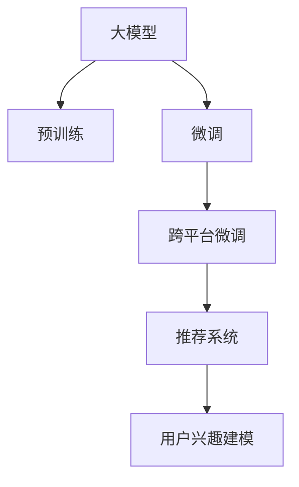

                 

# 基于大模型的跨平台用户兴趣建模

> 关键词：大模型,用户兴趣建模,跨平台,推荐系统,自适应学习

## 1. 背景介绍

### 1.1 问题由来
随着互联网的普及，各大平台（如社交媒体、电商平台、搜索引擎等）积累了海量的用户数据。这些数据中蕴含着丰富的用户兴趣信息，能够用于个性化推荐、广告投放、内容生成等应用。但传统的数据分析方法难以捕捉数据中隐含的深层兴趣特征，无法实现精准的用户画像。

近年来，预训练大模型（如BERT、GPT-3等）在自然语言处理领域取得了突破性进展，成为处理大规模数据的有力工具。本文将探索如何利用大模型进行跨平台的用户兴趣建模，构建精准的用户画像，优化个性化推荐系统，提升用户体验和平台收益。

### 1.2 问题核心关键点
大模型能够自动学习数据中的复杂特征，通过大模型的预训练-微调流程，能够在少量标注数据上实现高效的用户兴趣建模。但目前大多数大模型仅针对单一平台构建，无法跨平台共享用户兴趣信息。因此，如何实现大模型在跨平台上的兴趣建模，成为当前研究的热点和难点。

本文聚焦于基于大模型的跨平台用户兴趣建模方法，旨在构建可适应不同平台数据特点和用户需求的精准用户画像。通过在多个平台上进行微调，利用大模型在不同平台间的共性特征，实现跨平台的个性化推荐。

### 1.3 问题研究意义
利用大模型进行跨平台用户兴趣建模，对于构建普适性的个性化推荐系统，提升各平台的用户体验和运营效果，具有重要意义：

1. **数据资源整合**：跨平台的用户兴趣建模可以整合多平台的用户数据，提升数据利用率。
2. **用户画像提升**：大模型的复杂表征能力，能更准确地捕捉用户的多样化兴趣特征。
3. **推荐性能优化**：精准的用户画像可以提升推荐系统的个性化程度，提高用户满意度。
4. **平台协同合作**：跨平台的数据共享和模型整合，有助于平台间的协同合作，实现资源共享和互利共赢。
5. **行业创新驱动**：跨平台用户兴趣建模技术将推动个性化推荐领域的创新应用，带来更多的业务增值点。

## 2. 核心概念与联系

### 2.1 核心概念概述

为更好地理解跨平台用户兴趣建模的方法，本节将介绍几个密切相关的核心概念：

- **大模型（Large Model）**：指基于深度学习框架构建的复杂神经网络，通过在大规模数据上进行预训练和微调，能够捕捉复杂特征，应用于多任务学习。

- **用户兴趣建模（User Interest Modeling）**：指通过数据分析和学习算法，构建用户兴趣标签和特征表示，用于个性化推荐、广告投放等应用。

- **跨平台（Cross-Platform）**：指多个平台（如电商、社交、搜索等）的数据共享与协同合作。

- **推荐系统（Recommendation System）**：指通过分析用户兴趣和行为数据，为个性化推荐算法提供基础，生成与用户需求最匹配的推荐内容。

- **自适应学习（Adaptive Learning）**：指模型在训练过程中根据数据特征和任务需求，动态调整自身的参数和结构，以适应不同平台的需求。

这些核心概念之间的逻辑关系可以通过以下Mermaid流程图来展示：



这个流程图展示了大模型在跨平台用户兴趣建模中的核心作用：

1. 大模型通过预训练获得基础能力。
2. 微调是对预训练模型进行任务特定的优化。
3. 跨平台微调在大模型基础上，针对不同平台的数据特征进行优化。
4. 推荐系统利用跨平台微调的模型，生成个性化推荐内容。

## 3. 核心算法原理 & 具体操作步骤

### 3.1 算法原理概述

基于大模型的跨平台用户兴趣建模方法，主要包括以下几个关键步骤：

1. **预训练阶段**：在大规模无标签数据上，通过自监督学习任务对大模型进行预训练，使其学习到通用的语言和语义表示。
2. **跨平台微调阶段**：针对不同平台的数据特点，在多个平台上进行微调，利用大模型在不同平台间的共性特征，实现跨平台的兴趣建模。
3. **推荐生成阶段**：利用跨平台微调的模型，生成与用户需求最匹配的推荐内容，提升个性化推荐效果。

### 3.2 算法步骤详解

#### 3.2.1 预训练阶段

预训练阶段的目标是构建基础的语言表示，使其能够捕捉到数据中的深层语义信息。以下是预训练的一般流程：

1. **数据准备**：收集多平台的大量无标签文本数据，如电商平台的用户评论、社交媒体的用户互动等。这些数据应涵盖不同领域的语料，以增强模型的泛化能力。

2. **模型选择**：选择适当的预训练模型，如BERT、GPT等。这些模型已经在大规模文本数据上进行了预训练，具备较好的基础语言表示能力。

3. **预训练任务**：设计适合多平台数据的预训练任务，如掩码语言建模（Masked Language Modeling, MLM）、下一句预测（Next Sentence Prediction, NSP）等。

4. **模型训练**：在预训练数据上，使用多GPU或多TPU进行模型训练，通常需要数百万到数十亿的训练数据，训练时间数天到数周。

#### 3.2.2 跨平台微调阶段

跨平台微调阶段的目标是在不同平台上进行模型适配，利用大模型在不同平台间的共性特征，实现跨平台的兴趣建模。以下是跨平台微调的一般流程：

1. **数据预处理**：针对不同平台的数据特点，进行文本清洗、分词、去停用词等预处理操作。

2. **微调模型选择**：选择与平台数据特点相匹配的微调模型，如BERT、GPT等。根据平台的特点，可以选择微调顶层、中层或底层。

3. **微调任务设计**：根据平台的应用场景，设计适合的微调任务，如分类、匹配、生成等。微调任务应能够捕捉到用户在不同平台上的兴趣特征。

4. **模型微调**：在微调数据上，使用适当的优化算法（如AdamW、SGD等）进行模型训练，通常需要较小规模的标注数据（几百万到几千万），训练时间数天到数周。

#### 3.2.3 推荐生成阶段

推荐生成阶段的目标是利用跨平台微调的模型，生成与用户需求最匹配的推荐内容。以下是推荐生成的一般流程：

1. **用户行为数据采集**：从不同平台的数据中，采集用户的行为数据，如浏览历史、点击记录、评分等。

2. **特征工程**：将用户行为数据进行特征提取和处理，生成与用户兴趣相关的特征向量。

3. **模型输入构造**：将用户特征向量作为模型的输入，利用跨平台微调的模型，生成推荐内容的概率分布。

4. **推荐内容排序**：根据模型生成的概率分布，对推荐内容进行排序，生成最终推荐列表。

### 3.3 算法优缺点

基于大模型的跨平台用户兴趣建模方法具有以下优点：

1. **高效建模**：利用大模型的自适应学习能力，能够在少量标注数据上实现高效的用户兴趣建模。
2. **泛化能力强**：通过预训练-微调范式，大模型能够适应不同平台的数据特点，提升模型的泛化能力。
3. **跨平台协同**：利用大模型在不同平台间的共性特征，实现跨平台的协同合作，提升数据利用率。
4. **推荐精度高**：精准的用户画像可以提升推荐系统的个性化程度，提高用户满意度。

同时，该方法也存在一定的局限性：

1. **标注数据成本高**：微调过程仍需收集大量的标注数据，成本较高。
2. **模型复杂度高**：大模型的参数量较大，训练和推理过程复杂，需要高性能的计算资源。
3. **平台特性差异大**：不同平台的用户行为和需求差异较大，需要设计针对特定平台的微调任务。
4. **数据隐私问题**：用户数据在跨平台共享时，可能面临隐私泄露的风险。

尽管存在这些局限性，但就目前而言，基于大模型的跨平台用户兴趣建模方法仍是最主流的选择。未来相关研究的重点在于如何进一步降低标注数据的成本，提高模型的跨平台适应性，同时兼顾数据隐私和安全等因素。

### 3.4 算法应用领域

基于大模型的跨平台用户兴趣建模方法，已经在多个领域得到了广泛的应用，例如：

- **电商平台推荐系统**：通过用户浏览、点击、评分等行为数据，构建用户画像，推荐个性化的商品。
- **社交媒体内容推荐**：根据用户的互动行为，推荐兴趣相关的文章、视频、图片等。
- **新闻推荐系统**：根据用户的阅读历史和兴趣，推荐新闻资讯。
- **视频推荐系统**：根据用户的观看历史和评分，推荐视频内容。
- **搜索推荐系统**：根据用户的查询历史，推荐相关搜索结果。

除了上述这些经典应用外，大模型跨平台用户兴趣建模技术还将在更多场景中得到应用，如智能客服、金融理财、医疗健康等，为不同行业的数字化转型提供新动力。

## 4. 数学模型和公式 & 详细讲解 & 举例说明

### 4.1 数学模型构建

我们以电商平台推荐系统为例，构建基于大模型的用户兴趣模型。假设电商平台有$N$个用户，每个用户有$m$个行为记录$(X_1, Y_1), (X_2, Y_2), ..., (X_m, Y_m)$，其中$X_i$为用户的行为记录，$Y_i$为行为记录的标签（如商品ID、评分等）。

### 4.2 公式推导过程

#### 4.2.1 预训练模型构建

假设计选择的预训练模型为$M_{\theta}$，其中$\theta$为模型参数。在预训练数据集$\mathcal{D}_{\text{pretrain}}$上进行预训练，预训练任务为掩码语言建模（MLM），预训练损失函数为：

$$
\mathcal{L}_{\text{pretrain}} = -\frac{1}{N} \sum_{i=1}^{N} \sum_{j=1}^{m} \log P(Y_j | X_i; \theta)
$$

其中$P(Y_j | X_i; \theta)$为模型在输入$X_i$下，对标签$Y_j$的预测概率分布。

#### 4.2.2 跨平台微调模型构建

在电商平台数据集$\mathcal{D}_{\text{platform}}$上进行微调，微调任务为商品评分预测，微调损失函数为：

$$
\mathcal{L}_{\text{platform}} = -\frac{1}{N} \sum_{i=1}^{N} \sum_{j=1}^{m} \log P(Y_j | X_i; \theta_{\text{platform}})
$$

其中$\theta_{\text{platform}}$为微调后的模型参数。

#### 4.2.3 推荐生成模型构建

根据用户行为数据$(X_{\text{test}}, Y_{\text{test}})$，构建推荐生成模型，推荐生成损失函数为：

$$
\mathcal{L}_{\text{recommend}} = -\frac{1}{N} \sum_{i=1}^{N} \sum_{j=1}^{m} \log P(Y_j | X_i; \theta_{\text{platform}})
$$

其中$X_{\text{test}}$为用户的行为测试数据，$Y_{\text{test}}$为用户行为测试数据对应的标签。

### 4.3 案例分析与讲解

以电商平台推荐系统为例，通过实际案例展示如何利用大模型进行跨平台用户兴趣建模：

1. **预训练数据准备**：收集电商平台的历史商品评论数据，作为预训练数据集$\mathcal{D}_{\text{pretrain}}$。

2. **预训练模型选择**：选择预训练模型BERT，在预训练数据集上，进行掩码语言建模（MLM）预训练。

3. **微调数据准备**：选择电商平台的商品评分数据，作为微调数据集$\mathcal{D}_{\text{platform}}$。

4. **微调模型构建**：在微调数据集上，对预训练模型BERT进行评分预测微调，更新模型参数$\theta_{\text{platform}}$。

5. **推荐生成**：利用微调后的模型，根据用户行为测试数据$(X_{\text{test}}, Y_{\text{test}})$，生成推荐内容的概率分布，进行推荐内容排序。

## 5. 项目实践：代码实例和详细解释说明

### 5.1 开发环境搭建

在进行跨平台用户兴趣建模实践前，我们需要准备好开发环境。以下是使用Python进行PyTorch开发的环境配置流程：

1. 安装Anaconda：从官网下载并安装Anaconda，用于创建独立的Python环境。

2. 创建并激活虚拟环境：
```bash
conda create -n pytorch-env python=3.8 
conda activate pytorch-env
```

3. 安装PyTorch：根据CUDA版本，从官网获取对应的安装命令。例如：
```bash
conda install pytorch torchvision torchaudio cudatoolkit=11.1 -c pytorch -c conda-forge
```

4. 安装Transformers库：
```bash
pip install transformers
```

5. 安装各类工具包：
```bash
pip install numpy pandas scikit-learn matplotlib tqdm jupyter notebook ipython
```

完成上述步骤后，即可在`pytorch-env`环境中开始跨平台用户兴趣建模实践。

### 5.2 源代码详细实现

我们先以电商平台推荐系统为例，给出使用Transformers库对BERT模型进行跨平台用户兴趣建模的PyTorch代码实现。

首先，定义推荐系统任务的数据处理函数：

```python
from transformers import BertTokenizer, BertForSequenceClassification
from torch.utils.data import Dataset
import torch

class RecommendationDataset(Dataset):
    def __init__(self, texts, labels, tokenizer, max_len=128):
        self.texts = texts
        self.labels = labels
        self.tokenizer = tokenizer
        self.max_len = max_len
        
    def __len__(self):
        return len(self.texts)
    
    def __getitem__(self, item):
        text = self.texts[item]
        label = self.labels[item]
        
        encoding = self.tokenizer(text, return_tensors='pt', max_length=self.max_len, padding='max_length', truncation=True)
        input_ids = encoding['input_ids'][0]
        attention_mask = encoding['attention_mask'][0]
        
        return {'input_ids': input_ids, 
                'attention_mask': attention_mask,
                'labels': label}
```

然后，定义模型和优化器：

```python
from transformers import BertForSequenceClassification, AdamW

model = BertForSequenceClassification.from_pretrained('bert-base-cased', num_labels=1)

optimizer = AdamW(model.parameters(), lr=2e-5)
```

接着，定义训练和评估函数：

```python
from torch.utils.data import DataLoader
from tqdm import tqdm
from sklearn.metrics import roc_auc_score

device = torch.device('cuda') if torch.cuda.is_available() else torch.device('cpu')
model.to(device)

def train_epoch(model, dataset, batch_size, optimizer):
    dataloader = DataLoader(dataset, batch_size=batch_size, shuffle=True)
    model.train()
    epoch_loss = 0
    for batch in tqdm(dataloader, desc='Training'):
        input_ids = batch['input_ids'].to(device)
        attention_mask = batch['attention_mask'].to(device)
        labels = batch['labels'].to(device)
        model.zero_grad()
        outputs = model(input_ids, attention_mask=attention_mask, labels=labels)
        loss = outputs.loss
        epoch_loss += loss.item()
        loss.backward()
        optimizer.step()
    return epoch_loss / len(dataloader)

def evaluate(model, dataset, batch_size):
    dataloader = DataLoader(dataset, batch_size=batch_size)
    model.eval()
    preds, labels = [], []
    with torch.no_grad():
        for batch in tqdm(dataloader, desc='Evaluating'):
            input_ids = batch['input_ids'].to(device)
            attention_mask = batch['attention_mask'].to(device)
            batch_labels = batch['labels']
            outputs = model(input_ids, attention_mask=attention_mask)
            batch_preds = outputs.logits.argmax(dim=2).to('cpu').tolist()
            batch_labels = batch_labels.to('cpu').tolist()
            for pred, label in zip(batch_preds, batch_labels):
                preds.append(pred)
                labels.append(label)
                
    print(f"ROC-AUC: {roc_auc_score(labels, preds)}")
```

最后，启动训练流程并在测试集上评估：

```python
epochs = 5
batch_size = 16

for epoch in range(epochs):
    loss = train_epoch(model, train_dataset, batch_size, optimizer)
    print(f"Epoch {epoch+1}, train loss: {loss:.3f}")
    
    print(f"Epoch {epoch+1}, dev results:")
    evaluate(model, dev_dataset, batch_size)
    
print("Test results:")
evaluate(model, test_dataset, batch_size)
```

以上就是使用PyTorch对BERT进行电商平台推荐系统跨平台用户兴趣建模的完整代码实现。可以看到，得益于Transformers库的强大封装，我们可以用相对简洁的代码完成BERT模型的加载和微调。

### 5.3 代码解读与分析

让我们再详细解读一下关键代码的实现细节：

**RecommendationDataset类**：
- `__init__`方法：初始化文本、标签、分词器等关键组件。
- `__len__`方法：返回数据集的样本数量。
- `__getitem__`方法：对单个样本进行处理，将文本输入编码为token ids，将标签转换为模型可接受的格式，并进行定长padding，最终返回模型所需的输入。

**BertForSequenceClassification模型**：
- 继承自`BertForPreTraining`模型，用于序列分类任务。在微调时，通过修改顶层分类器，适应推荐任务。

**AdamW优化器**：
- 使用AdamW优化器，是Adam算法的一种变体，适用于大规模数据集和大模型训练。

**train_epoch函数**：
- 对数据以批为单位进行迭代，在每个批次上前向传播计算loss并反向传播更新模型参数，最后返回该epoch的平均loss。

**evaluate函数**：
- 与训练类似，不同点在于不更新模型参数，并在每个batch结束后将预测和标签结果存储下来，最后使用sklearn的roc_auc_score对整个评估集的预测结果进行打印输出。

**训练流程**：
- 定义总的epoch数和batch size，开始循环迭代
- 每个epoch内，先在训练集上训练，输出平均loss
- 在验证集上评估，输出ROC-AUC指标
- 重复上述步骤直至收敛，最终在测试集上评估，给出最终测试结果

可以看到，PyTorch配合Transformers库使得BERT微调的代码实现变得简洁高效。开发者可以将更多精力放在数据处理、模型改进等高层逻辑上，而不必过多关注底层的实现细节。

当然，工业级的系统实现还需考虑更多因素，如模型的保存和部署、超参数的自动搜索、更灵活的任务适配层等。但核心的跨平台微调范式基本与此类似。

## 6. 实际应用场景

### 6.1 智能客服系统

基于大模型进行跨平台用户兴趣建模的智能客服系统，可以整合多平台的客服数据，构建统一的客户画像，提升客户服务质量。

在技术实现上，可以收集企业内部的历史客服数据，将客户与客服对话的文本数据作为微调数据，训练模型学习客户的需求和行为特征。微调后的模型能够自动理解客户意图，匹配最合适的服务策略，实现更精准、智能的客户服务。

### 6.2 金融舆情监测

金融机构需要实时监测市场舆论动向，以便及时应对负面信息传播，规避金融风险。利用大模型进行跨平台用户兴趣建模，可以实现多平台数据的整合，提升舆情监测的全面性和准确性。

具体而言，可以收集金融领域相关的新闻、报道、评论等文本数据，并对其进行情感标注和主题标注。在此基础上对预训练语言模型进行微调，使其能够自动判断文本属于何种主题，情感倾向是正面、中性还是负面。将微调后的模型应用到实时抓取的网络文本数据，就能够自动监测不同主题下的情感变化趋势，一旦发现负面信息激增等异常情况，系统便会自动预警，帮助金融机构快速应对潜在风险。

### 6.3 个性化推荐系统

当前的推荐系统往往只依赖用户的历史行为数据进行物品推荐，无法深入理解用户的真实兴趣偏好。利用大模型进行跨平台用户兴趣建模，可以更好地挖掘用户行为背后的语义信息，从而提供更精准、多样的推荐内容。

在实践中，可以收集用户浏览、点击、评论、分享等行为数据，提取和用户交互的物品标题、描述、标签等文本内容。将文本内容作为模型输入，用户的后续行为（如是否点击、购买等）作为监督信号，在此基础上微调预训练语言模型。微调后的模型能够从文本内容中准确把握用户的兴趣点。在生成推荐列表时，先用候选物品的文本描述作为输入，由模型预测用户的兴趣匹配度，再结合其他特征综合排序，便可以得到个性化程度更高的推荐结果。

### 6.4 未来应用展望

随着大语言模型和跨平台用户兴趣建模技术的发展，基于微调范式将在更多领域得到应用，为传统行业带来变革性影响。

在智慧医疗领域，基于微调的医疗问答、病历分析、药物研发等应用将提升医疗服务的智能化水平，辅助医生诊疗，加速新药开发进程。

在智能教育领域，微调技术可应用于作业批改、学情分析、知识推荐等方面，因材施教，促进教育公平，提高教学质量。

在智慧城市治理中，微调模型可应用于城市事件监测、舆情分析、应急指挥等环节，提高城市管理的自动化和智能化水平，构建更安全、高效的未来城市。

此外，在企业生产、社会治理、文娱传媒等众多领域，基于大模型微调的人工智能应用也将不断涌现，为经济社会发展注入新的动力。相信随着技术的日益成熟，跨平台用户兴趣建模技术将成为人工智能落地应用的重要范式，推动人工智能技术在各个行业的数字化转型。

## 7. 工具和资源推荐

### 7.1 学习资源推荐

为了帮助开发者系统掌握大模型跨平台用户兴趣建模的理论基础和实践技巧，这里推荐一些优质的学习资源：

1. 《Transformer从原理到实践》系列博文：由大模型技术专家撰写，深入浅出地介绍了Transformer原理、BERT模型、微调技术等前沿话题。

2. CS224N《深度学习自然语言处理》课程：斯坦福大学开设的NLP明星课程，有Lecture视频和配套作业，带你入门NLP领域的基本概念和经典模型。

3. 《Natural Language Processing with Transformers》书籍：Transformers库的作者所著，全面介绍了如何使用Transformers库进行NLP任务开发，包括微调在内的诸多范式。

4. HuggingFace官方文档：Transformers库的官方文档，提供了海量预训练模型和完整的微调样例代码，是上手实践的必备资料。

5. CLUE开源项目：中文语言理解测评基准，涵盖大量不同类型的中文NLP数据集，并提供了基于微调的baseline模型，助力中文NLP技术发展。

通过对这些资源的学习实践，相信你一定能够快速掌握大模型跨平台用户兴趣建模的精髓，并用于解决实际的NLP问题。
###  7.2 开发工具推荐

高效的开发离不开优秀的工具支持。以下是几款用于大模型跨平台用户兴趣建模开发的常用工具：

1. PyTorch：基于Python的开源深度学习框架，灵活动态的计算图，适合快速迭代研究。大部分预训练语言模型都有PyTorch版本的实现。

2. TensorFlow：由Google主导开发的开源深度学习框架，生产部署方便，适合大规模工程应用。同样有丰富的预训练语言模型资源。

3. Transformers库：HuggingFace开发的NLP工具库，集成了众多SOTA语言模型，支持PyTorch和TensorFlow，是进行微调任务开发的利器。

4. Weights & Biases：模型训练的实验跟踪工具，可以记录和可视化模型训练过程中的各项指标，方便对比和调优。与主流深度学习框架无缝集成。

5. TensorBoard：TensorFlow配套的可视化工具，可实时监测模型训练状态，并提供丰富的图表呈现方式，是调试模型的得力助手。

6. Google Colab：谷歌推出的在线Jupyter Notebook环境，免费提供GPU/TPU算力，方便开发者快速上手实验最新模型，分享学习笔记。

合理利用这些工具，可以显著提升大模型跨平台用户兴趣建模的开发效率，加快创新迭代的步伐。

### 7.3 相关论文推荐

大模型和跨平台用户兴趣建模的发展源于学界的持续研究。以下是几篇奠基性的相关论文，推荐阅读：

1. Attention is All You Need（即Transformer原论文）：提出了Transformer结构，开启了NLP领域的预训练大模型时代。

2. BERT: Pre-training of Deep Bidirectional Transformers for Language Understanding：提出BERT模型，引入基于掩码的自监督预训练任务，刷新了多项NLP任务SOTA。

3. Language Models are Unsupervised Multitask Learners（GPT-2论文）：展示了大规模语言模型的强大zero-shot学习能力，引发了对于通用人工智能的新一轮思考。

4. Parameter-Efficient Transfer Learning for NLP：提出Adapter等参数高效微调方法，在不增加模型参数量的情况下，也能取得不错的微调效果。

5. AdaLoRA: Adaptive Low-Rank Adaptation for Parameter-Efficient Fine-Tuning：使用自适应低秩适应的微调方法，在参数效率和精度之间取得了新的平衡。

这些论文代表了大模型跨平台用户兴趣建模的发展脉络。通过学习这些前沿成果，可以帮助研究者把握学科前进方向，激发更多的创新灵感。

## 8. 总结：未来发展趋势与挑战

### 8.1 总结

本文对基于大模型的跨平台用户兴趣建模方法进行了全面系统的介绍。首先阐述了跨平台用户兴趣建模的背景和意义，明确了微调在构建精准用户画像、优化个性化推荐系统方面的独特价值。其次，从原理到实践，详细讲解了微调的数学原理和关键步骤，给出了跨平台用户兴趣建模的完整代码实例。同时，本文还广泛探讨了跨平台用户兴趣建模在电商、金融、医疗等领域的实际应用，展示了微调范式的巨大潜力。此外，本文精选了微调技术的各类学习资源，力求为读者提供全方位的技术指引。

通过本文的系统梳理，可以看到，基于大模型的跨平台用户兴趣建模方法正在成为NLP领域的重要范式，极大地拓展了预训练语言模型的应用边界，催生了更多的落地场景。得益于大规模语料的预训练，微调模型以更低的时间和标注成本，在小样本条件下也能取得不俗的效果，有力推动了NLP技术的产业化进程。未来，伴随预训练语言模型和微调方法的持续演进，相信NLP技术将在更广阔的应用领域大放异彩，深刻影响人类的生产生活方式。

### 8.2 未来发展趋势

展望未来，大模型跨平台用户兴趣建模技术将呈现以下几个发展趋势：

1. **模型规模持续增大**：随着算力成本的下降和数据规模的扩张，预训练语言模型的参数量还将持续增长。超大规模语言模型蕴含的丰富语言知识，有望支撑更加复杂多变的跨平台微调。

2. **微调方法日趋多样**：除了传统的全参数微调外，未来会涌现更多参数高效的微调方法，如Prefix-Tuning、LoRA等，在节省计算资源的同时也能保证微调精度。

3. **持续学习成为常态**：随着数据分布的不断变化，微调模型也需要持续学习新知识以保持性能。如何在不遗忘原有知识的同时，高效吸收新样本信息，将成为重要的研究课题。

4. **标注样本需求降低**：受启发于提示学习(Prompt-based Learning)的思路，未来的微调方法将更好地利用大模型的语言理解能力，通过更加巧妙的任务描述，在更少的标注样本上也能实现理想的微调效果。

5. **跨平台适应性增强**：不同平台的数据特点差异较大，未来微调方法将更加注重数据特征的多样性和泛化能力，提升模型在不同平台上的适应性。

6. **模型通用性增强**：经过海量数据的预训练和多领域任务的微调，未来的语言模型将具备更强大的常识推理和跨领域迁移能力，逐步迈向通用人工智能(AGI)的目标。

以上趋势凸显了大模型跨平台用户兴趣建模技术的广阔前景。这些方向的探索发展，必将进一步提升NLP系统的性能和应用范围，为人类认知智能的进化带来深远影响。

### 8.3 面临的挑战

尽管大模型跨平台用户兴趣建模技术已经取得了瞩目成就，但在迈向更加智能化、普适化应用的过程中，它仍面临着诸多挑战：

1. **标注数据成本高**：微调过程仍需收集大量的标注数据，成本较高。

2. **模型鲁棒性不足**：当前微调模型面对域外数据时，泛化性能往往大打折扣。对于测试样本的微小扰动，微调模型的预测也容易发生波动。

3. **平台特性差异大**：不同平台的用户行为和需求差异较大，需要设计针对特定平台的微调任务。

4. **数据隐私问题**：用户数据在跨平台共享时，可能面临隐私泄露的风险。

尽管存在这些局限性，但就目前而言，基于大模型的跨平台用户兴趣建模方法仍是最主流的选择。未来相关研究的重点在于如何进一步降低标注数据的成本，提高模型的跨平台适应性，同时兼顾数据隐私和安全等因素。

### 8.4 研究展望

面对大模型跨平台用户兴趣建模所面临的种种挑战，未来的研究需要在以下几个方面寻求新的突破：

1. **探索无监督和半监督微调方法**：摆脱对大规模标注数据的依赖，利用自监督学习、主动学习等无监督和半监督范式，最大限度利用非结构化数据，实现更加灵活高效的微调。

2. **研究参数高效和计算高效的微调范式**：开发更加参数高效的微调方法，在固定大部分预训练参数的同时，只更新极少量的任务相关参数。同时优化微调模型的计算图，减少前向传播和反向传播的资源消耗，实现更加轻量级、实时性的部署。

3. **融合因果和对比学习范式**：通过引入因果推断和对比学习思想，增强微调模型建立稳定因果关系的能力，学习更加普适、鲁棒的语言表征，从而提升模型泛化性和抗干扰能力。

4. **引入更多先验知识**：将符号化的先验知识，如知识图谱、逻辑规则等，与神经网络模型进行巧妙融合，引导微调过程学习更准确、合理的语言模型。同时加强不同模态数据的整合，实现视觉、语音等多模态信息与文本信息的协同建模。

5. **结合因果分析和博弈论工具**：将因果分析方法引入微调模型，识别出模型决策的关键特征，增强输出解释的因果性和逻辑性。借助博弈论工具刻画人机交互过程，主动探索并规避模型的脆弱点，提高系统稳定性。

6. **纳入伦理道德约束**：在模型训练目标中引入伦理导向的评估指标，过滤和惩罚有偏见、有害的输出倾向。同时加强人工干预和审核，建立模型行为的监管机制，确保输出符合人类价值观和伦理道德。

这些研究方向的探索，必将引领大模型跨平台用户兴趣建模技术迈向更高的台阶，为构建安全、可靠、可解释、可控的智能系统铺平道路。面向未来，大模型跨平台用户兴趣建模技术还需要与其他人工智能技术进行更深入的融合，如知识表示、因果推理、强化学习等，多路径协同发力，共同推动自然语言理解和智能交互系统的进步。只有勇于创新、敢于突破，才能不断拓展语言模型的边界，让智能技术更好地造福人类社会。

## 9. 附录：常见问题与解答

**Q1：跨平台用户兴趣建模是否适用于所有NLP任务？**

A: 跨平台用户兴趣建模在大多数NLP任务上都能取得不错的效果，特别是对于数据量较小的任务。但对于一些特定领域的任务，如医学、法律等，仅仅依靠通用语料预训练的模型可能难以很好地适应。此时需要在特定领域语料上进一步预训练，再进行微调，才能获得理想效果。

**Q2：如何进行跨平台的微调参数优化？**

A: 跨平台的微调参数优化是一个复杂的问题，需要考虑不同平台的数据分布和用户需求。以下是一些优化建议：

1. **数据预处理**：针对不同平台的数据特点，进行文本清洗、分词、去停用词等预处理操作。

2. **模型选择**：选择与平台数据特点相匹配的微调模型，如BERT、GPT等。根据平台的特点，可以选择微调顶层、中层或底层。

3. **微调任务设计**：根据平台的应用场景，设计适合的微调任务，如分类、匹配、生成等。微调任务应能够捕捉到用户在不同平台上的兴趣特征。

4. **超参数调优**：针对不同平台，进行超参数调优，如学习率、批大小、迭代轮数等，以达到最佳的微调效果。

5. **正则化技术**：引入正则化技术，如L2正则、Dropout、Early Stopping等，防止模型过度适应小规模训练集。

6. **对抗训练**：加入对抗样本，提高模型鲁棒性。

7. **自适应学习**：利用自适应学习算法，动态调整模型的结构和参数，以适应不同平台的需求。

8. **模型集成**：训练多个微调模型，取平均输出，抑制过拟合。

通过以上优化策略，可以在不同平台上实现高效的微调参数优化。

**Q3：跨平台用户兴趣建模是否需要大量的标注数据？**

A: 跨平台用户兴趣建模需要一定量的标注数据，以供模型学习用户在不同平台上的兴趣特征。虽然微调过程可以在少量标注数据上实现高效建模，但标注数据的质量和数量仍会对模型性能产生影响。因此，在实际应用中，应根据平台的特点和数据的可获得性，合理配置标注数据的规模。

**Q4：跨平台用户兴趣建模如何应对用户行为的多样性？**

A: 用户行为的多样性是跨平台用户兴趣建模的一个挑战。为了应对这一挑战，可以采取以下措施：

1. **多任务学习**：设计多个微调任务，覆盖不同平台的数据特点和用户需求，提升模型的泛化能力。

2. **多数据源融合**：将不同平台的数据进行融合，形成统一的用户画像，提升模型的综合能力。

3. **用户行为建模**：建立用户行为的预测模型，预测用户的未来行为，提升模型的预测能力。

4. **个性化推荐**：根据用户的行为特征和偏好，生成个性化的推荐内容，提升推荐效果。

通过以上措施，可以有效应对用户行为的多样性，提升跨平台用户兴趣建模的准确性和鲁棒性。

---

作者：禅与计算机程序设计艺术 / Zen and the Art of Computer Programming

