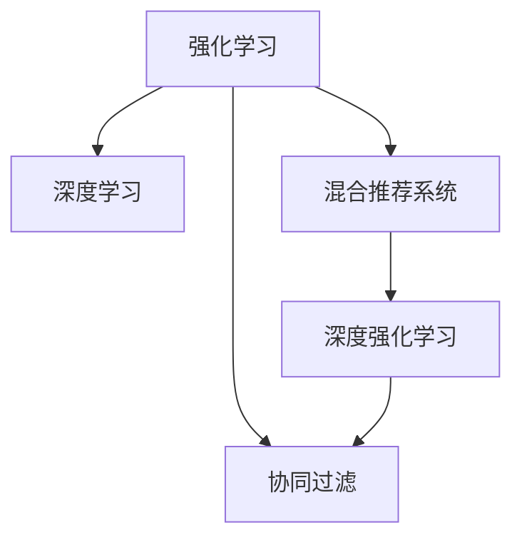

                 

# 基于强化学习的商品组合推荐

> 关键词：商品推荐, 强化学习, 协同过滤, 深度学习, 混合推荐系统, 深度学习与强化学习融合

## 1. 背景介绍

### 1.1 问题由来
随着电子商务的蓬勃发展，商品推荐系统成为各大电商平台提升用户体验和增加销售收入的重要手段。传统的基于协同过滤的推荐方法，虽然能够较好地处理稀疏用户行为数据，但往往只能提供单一商品的推荐，无法满足用户多样化的需求。如何构建一个高效、个性化的商品推荐系统，是当前互联网和工业界共同面临的挑战。

强化学习(Reinforcement Learning, RL)，作为近年来深度学习的重要研究方向，在动态决策环境中展示出了卓越的性能。强化学习的核心思想是通过与环境交互，不断学习最优决策策略，其建模框架与推荐系统具有高度的契合性。

### 1.2 问题核心关键点
强化学习在商品推荐中的应用，主要集中在以下几个方面：

- **动态决策**：强化学习算法能够实时响应用户行为变化，动态调整推荐策略。
- **个性化推荐**：通过探索用户行为数据和环境信息，强化学习模型能够生成符合用户偏好的推荐内容。
- **复杂性控制**：强化学习方法能够自动探索搜索空间，避免陷入局部最优解。
- **模型可解释性**：强化学习模型生成的推荐策略，往往比黑盒深度学习模型更加透明，能够提供推荐逻辑和用户行为分析。

### 1.3 问题研究意义
基于强化学习的商品推荐系统，能够实现对用户行为的动态跟踪和分析，生成更加个性化的推荐结果。在电商领域，这种推荐方法可以显著提升用户体验和购物转化率，进而推动平台交易额的提升。同时，强化学习商品推荐系统的构建，也能够为推荐算法领域的深入研究提供新的视角和方法。

## 2. 核心概念与联系

### 2.1 核心概念概述

为了更好地理解强化学习在商品推荐中的应用，我们首先需要对相关的核心概念进行详细阐述：

- **强化学习(Reinforcement Learning, RL)**：一种通过与环境交互，不断学习最优策略的机器学习范式。强化学习模型通过执行动作（选择商品），观察环境（用户反馈），获得奖励（交易完成）来更新策略。

- **协同过滤(Collaborative Filtering, CF)**：基于用户行为数据的推荐方法，通过发现用户间的相似性，推荐与其历史行为类似的其他商品。协同过滤可以分为基于用户的CF和基于物品的CF。

- **深度学习(Deep Learning, DL)**：一种通过多层神经网络逼近复杂非线性关系的机器学习技术。深度学习在图像识别、语音识别、自然语言处理等领域展示出了强大的表现。

- **混合推荐系统(Hybrid Recommendation Systems)**：将多种推荐算法融合，互补优势，提升推荐效果。混合推荐系统包括基于内容、协同过滤、强化学习等不同推荐方法。

- **深度强化学习(Deep Reinforcement Learning, DRL)**：结合深度学习和强化学习的推荐方法，通过神经网络逼近Q值函数或策略函数，提升强化学习的决策性能。

这些概念之间的逻辑关系可以通过以下Mermaid流程图来展示：



这个流程图展示了一个基于强化学习的推荐系统的核心概念及其之间的关系：

1. 强化学习通过与环境（用户行为数据）交互，学习最优策略。
2. 协同过滤基于用户行为数据，生成推荐结果。
3. 深度学习通过多层神经网络逼近复杂关系，提升推荐精度。
4. 混合推荐系统融合多种推荐算法，互补优势。
5. 深度强化学习结合深度学习和强化学习，提升推荐策略。

## 3. 核心算法原理 & 具体操作步骤

### 3.1 算法原理概述

强化学习商品推荐系统，主要是通过模型与用户行为数据的交互，学习最优的推荐策略。其核心思想是：

- 将用户与商品的关系表示为马尔可夫决策过程(Markov Decision Process, MDP)，用户每次选择商品作为动作，获得用户的反馈（点击、购买等）作为即时奖励，推荐策略的目标是最大化长期累积奖励。
- 使用深度强化学习方法，通过神经网络逼近Q值函数或策略函数，优化推荐决策。

### 3.2 算法步骤详解

强化学习商品推荐系统的构建，一般包括以下关键步骤：

**Step 1: 环境设计**
- 定义MDP的状态空间：用户的历史行为数据、当前浏览商品信息、用户属性等。
- 定义MDP的动作空间：商品推荐列表。
- 定义奖励函数：点击率、转化率、用户满意度等。

**Step 2: 模型训练**
- 选择合适的深度强化学习模型：如DQN、DDPG、PPO等。
- 使用训练数据和奖励信号，迭代训练模型，优化策略参数。
- 设置探索与利用的策略：平衡模型在探索新商品和利用已有知识之间的平衡。

**Step 3: 推荐策略**
- 将用户的行为数据输入训练好的模型，得到推荐策略。
- 根据策略生成商品推荐列表，返回给用户。
- 更新用户的历史行为数据，继续迭代推荐过程。

**Step 4: 评估与优化**
- 使用测试集对推荐结果进行评估，计算点击率、转化率等指标。
- 根据评估结果，调整模型的超参数或学习率，进一步优化推荐策略。
- 定期更新用户行为数据，重新训练模型。

### 3.3 算法优缺点

基于强化学习的商品推荐系统具有以下优点：

1. 动态适应：能够实时响应用户行为变化，生成动态调整的推荐结果。
2. 个性化推荐：通过用户行为数据的建模，生成符合用户偏好的推荐内容。
3. 复杂性控制：能够自动探索搜索空间，避免陷入局部最优解。
4. 可解释性：生成的推荐策略，比黑盒深度学习模型更加透明，能够提供推荐逻辑和用户行为分析。

同时，该方法也存在一些局限性：

1. 数据需求高：强化学习模型需要大量的用户行为数据进行训练，而电商平台的冷启动问题难以解决。
2. 数据稀疏性：用户行为数据可能存在稀疏性，难以有效训练模型。
3. 高维度问题：电商平台中的商品数量巨大，状态空间维度高，模型训练难度大。
4. 模型泛化性：生成的推荐策略可能对特定环境过拟合，导致泛化能力不足。
5. 用户隐私：用户行为数据的收集和处理可能侵犯用户隐私，需关注数据安全和隐私保护。

### 3.4 算法应用领域

强化学习商品推荐系统在电商、视频、音乐等领域具有广泛的应用前景，以下是几个典型的应用场景：

- **电商平台**：基于用户浏览、点击、购买等行为，动态调整商品推荐列表，提升用户体验和购买转化率。
- **视频平台**：根据用户的观看历史和行为，推荐相关视频内容，增加平台用户粘性。
- **音乐平台**：基于用户听歌历史和行为，推荐相似音乐和艺术家，提高用户满意度。
- **社交平台**：根据用户的互动行为和偏好，推荐相关话题和内容，增强平台活跃度。

此外，强化学习商品推荐系统还在游戏推荐、智能家居、智慧医疗等领域展现出巨大的应用潜力。随着强化学习技术的不断进步，相信其在推荐系统中的应用将更加广泛和深入。

## 4. 数学模型和公式 & 详细讲解 & 举例说明

### 4.1 数学模型构建

强化学习商品推荐系统的建模框架，主要包括以下几个部分：

1. **状态空间**：定义用户行为数据和当前商品信息。
2. **动作空间**：定义推荐列表。
3. **奖励函数**：定义用户的即时反馈和长期奖励。

对于状态空间和动作空间，我们可以使用向量表示，如下：

- 状态空间：$S=\{(s_i)\}_{i=1}^N$，其中$s_i$表示第$i$个用户的历史行为和当前商品信息。
- 动作空间：$A=\{(a_j)\}_{j=1}^M$，其中$a_j$表示第$j$个推荐商品。

奖励函数$R(s,a)$可以定义为：

$$
R(s,a) = r_i + \gamma \max_a Q(s',a')
$$

其中，$r_i$表示用户选择商品$a$的即时奖励（如点击率），$s'$表示用户选择商品$a$后的下一个状态，$a'$表示下一个推荐商品，$\gamma$表示折扣因子，$Q(s',a')$表示状态$s'$下动作$a'$的累积奖励。

### 4.2 公式推导过程

以DQN（Deep Q-Network）模型为例，其核心思想是通过神经网络逼近Q值函数$Q(s,a)$，最小化预测值与真实值之间的误差。DQN模型的训练过程包括两个主要步骤：

1. **离线策略学习**：将用户行为数据分为训练集和测试集，使用训练集进行模型训练，计算预测值与真实值的误差，并使用反向传播更新神经网络参数。
2. **在线策略更新**：将训练好的神经网络模型应用于推荐过程，计算用户的即时奖励，并根据即时奖励更新模型参数。

具体的训练公式如下：

$$
Q(s_t,a_t) = r_t + \gamma \max_a Q(s_{t+1},a')
$$

其中，$s_t$表示当前状态，$a_t$表示当前动作，$r_t$表示即时奖励，$s_{t+1}$表示下一个状态，$a'$表示下一个推荐商品，$\gamma$表示折扣因子。

在DQN中，神经网络的输出层有$|A|$个神经元，每个神经元对应一个动作$a_j$的Q值，通过最小化$Q(s,a)$与真实值$R(s,a)$之间的均方误差，更新网络参数。

### 4.3 案例分析与讲解

以下是一个基于DQN模型的电商推荐系统的案例分析：

**案例背景**：某电商平台的商品推荐系统，希望通过强化学习提升推荐效果，提高用户满意度。

**环境设计**：
- 状态空间：用户历史浏览记录、当前浏览商品、用户年龄、性别、地域等信息。
- 动作空间：商品推荐列表。
- 奖励函数：点击率、购买转化率、用户满意度等。

**模型训练**：
- 使用DQN模型，将用户行为数据分为训练集和测试集，训练神经网络逼近Q值函数。
- 在训练过程中，使用探索与利用的策略，平衡模型的探索新商品和利用已有知识之间的平衡。
- 使用交叉验证等方法，调整模型超参数，优化推荐策略。

**推荐策略**：
- 将用户的历史行为数据输入训练好的DQN模型，生成推荐商品列表。
- 根据推荐商品列表，用户选择点击，系统记录点击率等反馈信息。
- 使用即时奖励和长期奖励更新模型参数，优化推荐策略。

**评估与优化**：
- 使用测试集评估推荐效果，计算点击率、购买转化率等指标。
- 根据评估结果，调整模型超参数，重新训练模型。

通过该案例，可以看到强化学习在电商推荐中的应用流程和优化策略。

## 5. 项目实践：代码实例和详细解释说明

### 5.1 开发环境搭建

在进行强化学习商品推荐系统的开发之前，我们需要准备好开发环境。以下是使用Python进行TensorFlow进行强化学习开发的流程：

1. 安装Anaconda：从官网下载并安装Anaconda，用于创建独立的Python环境。

2. 创建并激活虚拟环境：
```bash
conda create -n reinforcement-env python=3.8 
conda activate reinforcement-env
```

3. 安装TensorFlow：
```bash
conda install tensorflow
```

4. 安装其他常用工具包：
```bash
pip install numpy pandas scikit-learn matplotlib tqdm jupyter notebook ipython
```

完成上述步骤后，即可在`reinforcement-env`环境中开始强化学习开发。

### 5.2 源代码详细实现

以下是一个基于DQN模型的电商推荐系统的PyTorch代码实现：

```python
import tensorflow as tf
import numpy as np
from collections import deque
from tensorflow.keras.models import Sequential
from tensorflow.keras.layers import Dense, Flatten, Input
from tensorflow.keras.optimizers import Adam
from tensorflow.keras.models import Model
from tensorflow.keras.optimizers import Optimizer

class DQN:
    def __init__(self, state_size, action_size, gamma, epsilon, epsilon_min, epsilon_decay, memory_size):
        self.state_size = state_size
        self.action_size = action_size
        self.gamma = gamma
        self.epsilon = epsilon
        self.epsilon_min = epsilon_min
        self.epsilon_decay = epsilon_decay
        self.memory = deque(maxlen=memory_size)
        self.learning_rate = 0.001
        self.model = self._build_model()

    def _build_model(self):
        input_state = Input(shape=(self.state_size,), name='state_input')
        hidden = Dense(24, activation='relu')(input_state)
        output = Dense(self.action_size, activation='linear')(hidden)
        model = Model(inputs=input_state, outputs=output)
        return model

    def remember(self, state, action, reward, next_state, done):
        self.memory.append((state, action, reward, next_state, done))

    def act(self, state):
        if np.random.rand() <= self.epsilon:
            return np.random.randint(0, self.action_size)
        act_values = self.model.predict(state)
        return np.argmax(act_values[0])

    def replay(self, batch_size):
        if len(self.memory) < batch_size:
            return
        minibatch = np.array(self.memory[np.random.choice(len(self.memory), batch_size, replace=False)])
        states = np.vstack(minibatch[:, 0])
        actions = minibatch[:, 1:2]
        rewards = minibatch[:, 2]
        next_states = np.vstack(minibatch[:, 3])
        dones = minibatch[:, 4]
        target = np.zeros((batch_size, self.action_size))
        target[np.arange(batch_size), actions] = self.model.predict(states) + (self.gamma * np.amax(self.model.predict(next_states), axis=1) * (1 - dones))
        target[np.arange(batch_size), actions] += rewards
        self.model.train_on_batch(states, target)

    def train(self, state):
        if len(self.memory) > self.memory_size:
            self.memory.popleft()
        self.model.compile(optimizer=Adam(lr=self.learning_rate), loss='mse')
        self.replay(32)

    def decrease_epsilon(self):
        self.epsilon = max(self.epsilon_min, self.epsilon * self.epsilon_decay)
```

该代码实现了DQN模型的主要功能，包括状态、动作、奖励的定义，记忆存储、动作选择、训练、探索策略更新等。具体说明如下：

- `DQN`类：定义了DQN模型的核心方法。
- `_build_model`方法：构建神经网络模型。
- `remember`方法：将用户行为数据存储到内存中。
- `act`方法：选择动作，结合探索和利用策略。
- `replay`方法：从内存中随机抽取样本进行训练。
- `train`方法：将训练数据输入模型进行训练。
- `decrease_epsilon`方法：调整探索策略参数。

### 5.3 代码解读与分析

**DQN类**：
- `__init__`方法：初始化模型的状态空间、动作空间、折扣因子、探索策略参数、内存大小和神经网络模型。
- `_build_model`方法：定义神经网络的结构。
- `remember`方法：将用户行为数据存储到内存中。
- `act`方法：选择动作，结合探索和利用策略。
- `replay`方法：从内存中随机抽取样本进行训练。
- `train`方法：将训练数据输入模型进行训练。
- `decrease_epsilon`方法：调整探索策略参数。

**神经网络模型**：
- `Sequential`模型：定义神经网络的结构。
- `Dense`层：定义全连接层。
- `Flatten`层：将多维输入扁平化。
- `Input`层：定义输入层。
- `Model`模型：定义模型。

**动作选择**：
- `act`方法：选择动作，结合探索和利用策略。

**训练**：
- `replay`方法：从内存中随机抽取样本进行训练。
- `train`方法：将训练数据输入模型进行训练。

通过该代码，可以看到基于DQN的强化学习模型在电商推荐中的应用流程和优化策略。开发者可以根据具体任务，调整模型结构和超参数，优化推荐策略。

## 6. 实际应用场景

### 6.1 智能客服系统

基于强化学习的智能客服系统，通过分析用户对话记录和行为数据，动态调整推荐策略，提升用户满意度。智能客服系统能够实时响应用户需求，提供个性化的服务建议，减少用户等待时间，提升客户体验。

在技术实现上，智能客服系统可以通过强化学习模型，对用户的历史对话数据进行建模，学习最优的推荐策略。通过分析用户的语言表达和行为模式，智能客服系统能够动态调整推荐内容，引导用户快速解决问题，提高服务效率。

### 6.2 视频推荐系统

基于强化学习的视频推荐系统，能够根据用户的观看历史和行为，动态调整推荐策略，提高用户的观看体验和满意度。视频推荐系统能够实时响应用户的操作行为，推荐相关视频内容，增加平台用户粘性。

在技术实现上，视频推荐系统可以通过强化学习模型，对用户的历史观看数据进行建模，学习最优的推荐策略。通过分析用户的观看行为和偏好，视频推荐系统能够动态调整推荐内容，引导用户发现更多感兴趣的视频，提升用户的观看体验。

### 6.3 音乐推荐系统

基于强化学习的音乐推荐系统，能够根据用户的听歌历史和行为，动态调整推荐策略，提高用户的音乐体验和满意度。音乐推荐系统能够实时响应用户的操作行为，推荐相似音乐和艺术家，增加平台用户粘性。

在技术实现上，音乐推荐系统可以通过强化学习模型，对用户的历史听歌数据进行建模，学习最优的推荐策略。通过分析用户的听歌行为和偏好，音乐推荐系统能够动态调整推荐内容，引导用户发现更多喜欢的音乐，提升用户的音乐体验。

### 6.4 未来应用展望

随着强化学习技术的不断进步，其在推荐系统中的应用将更加广泛和深入。未来的强化学习商品推荐系统，有望实现以下突破：

1. **多模态融合**：结合图像、语音、视频等多模态信息，提升推荐模型的感知能力和决策能力。
2. **自适应学习**：根据用户反馈和环境变化，动态调整推荐策略，实现自适应学习和自优化。
3. **联邦学习**：通过联邦学习技术，实现用户数据在分布式环境下的协同训练，保护用户隐私的同时提升推荐效果。
4. **对抗训练**：引入对抗样本，提高推荐模型的鲁棒性和安全性。
5. **混合推荐**：融合深度学习、协同过滤、强化学习等多种推荐算法，互补优势，提升推荐效果。
6. **动态调整**：实时响应用户行为变化，动态调整推荐策略，提高推荐精度。

这些技术突破将为推荐系统带来更加智能化、个性化的推荐服务，满足用户多样化的需求，提升用户体验和平台竞争力。

## 7. 工具和资源推荐

### 7.1 学习资源推荐

为了帮助开发者系统掌握强化学习在商品推荐中的应用，这里推荐一些优质的学习资源：

1. 《强化学习：从概念到实践》：由美国斯坦福大学的Andrew Ng教授撰写，系统介绍了强化学习的基本概念和实践方法。

2. 《深度强化学习》：由DeepMind公司发布，介绍了深度强化学习的基本概念和应用案例。

3. 《TensorFlow官方文档》：提供了TensorFlow的详细文档和使用示例，帮助开发者快速上手TensorFlow。

4. 《强化学习教程》：由Keras官方提供，介绍了Keras中的强化学习模块和应用案例。

5. 《深度学习与强化学习》：由Coursera提供，介绍了深度学习和强化学习的基本概念和应用案例。

通过对这些资源的学习实践，相信你一定能够快速掌握强化学习在商品推荐中的应用，并用于解决实际的推荐问题。

### 7.2 开发工具推荐

高效的开发离不开优秀的工具支持。以下是几款用于强化学习商品推荐开发的常用工具：

1. TensorFlow：由Google主导开发的开源深度学习框架，生产部署方便，适合大规模工程应用。

2. Keras：基于TensorFlow的高层API，易于使用，适合快速迭代研究。

3. PyTorch：基于Python的开源深度学习框架，灵活动态，适合快速迭代研究。

4. Jupyter Notebook：Python的交互式开发环境，方便开发者进行实验和演示。

5. Weights & Biases：模型训练的实验跟踪工具，可以记录和可视化模型训练过程中的各项指标，方便对比和调优。

6. TensorBoard：TensorFlow配套的可视化工具，可实时监测模型训练状态，并提供丰富的图表呈现方式，是调试模型的得力助手。

合理利用这些工具，可以显著提升强化学习商品推荐系统的开发效率，加快创新迭代的步伐。

### 7.3 相关论文推荐

强化学习在推荐系统中的应用，源于学界的持续研究。以下是几篇奠基性的相关论文，推荐阅读：

1. "DQN: Deep Reinforcement Learning with Double Q-learning"：由DeepMind公司发布，提出了DQN模型，并在Atari游戏中实现了突破性表现。

2. "Deep Reinforcement Learning for Personalized Recommendation"：由清华大学和Amazon公司联合发布，介绍了深度强化学习在推荐系统中的应用。

3. "Hybrid Recommendation Systems with Deep Neural Networks"：由清华大学和Amazon公司联合发布，介绍了混合推荐系统的构建方法。

4. "Deep Interest Transfer Networks for Recommendation"：由上海交通大学和阿里巴巴公司联合发布，介绍了深度兴趣转移网络在推荐系统中的应用。

5. "An End-to-End Recommender System with Multiple Objectives and Data Sources"：由IBM公司发布，介绍了端到端的推荐系统的构建方法。

这些论文代表了大强化学习在推荐系统中的应用和发展脉络。通过学习这些前沿成果，可以帮助研究者把握学科前进方向，激发更多的创新灵感。

## 8. 总结：未来发展趋势与挑战

### 8.1 总结

本文对基于强化学习的商品推荐系统进行了全面系统的介绍。首先阐述了强化学习在商品推荐系统中的应用背景和意义，明确了强化学习在动态决策和个性化推荐方面的独特价值。其次，从原理到实践，详细讲解了强化学习模型构建和训练的数学原理和关键步骤，给出了强化学习商品推荐系统的完整代码实例。同时，本文还广泛探讨了强化学习商品推荐系统在电商、视频、音乐等多个行业领域的应用前景，展示了强化学习技术的巨大潜力。此外，本文精选了强化学习商品推荐系统的学习资源，力求为读者提供全方位的技术指引。

通过本文的系统梳理，可以看到，基于强化学习的商品推荐系统已经展现出强大的应用潜力，为电商平台、视频平台、音乐平台等带来了新的推荐解决方案。随着强化学习技术的不断进步，相信其在推荐系统中的应用将更加广泛和深入。

### 8.2 未来发展趋势

展望未来，强化学习商品推荐系统将呈现以下几个发展趋势：

1. **多模态融合**：结合图像、语音、视频等多模态信息，提升推荐模型的感知能力和决策能力。
2. **自适应学习**：根据用户反馈和环境变化，动态调整推荐策略，实现自适应学习和自优化。
3. **联邦学习**：通过联邦学习技术，实现用户数据在分布式环境下的协同训练，保护用户隐私的同时提升推荐效果。
4. **对抗训练**：引入对抗样本，提高推荐模型的鲁棒性和安全性。
5. **混合推荐**：融合深度学习、协同过滤、强化学习等多种推荐算法，互补优势，提升推荐效果。
6. **动态调整**：实时响应用户行为变化，动态调整推荐策略，提高推荐精度。

这些趋势凸显了强化学习在商品推荐系统中的应用前景。随着强化学习技术的不断演进，相信其在推荐系统中的应用将更加智能和高效，为推荐算法领域的深入研究提供新的视角和方法。

### 8.3 面临的挑战

尽管强化学习在商品推荐系统中展示出了卓越的性能，但在迈向更加智能化、普适化应用的过程中，仍然面临以下挑战：

1. **数据需求高**：强化学习模型需要大量的用户行为数据进行训练，而电商平台的冷启动问题难以解决。
2. **数据稀疏性**：用户行为数据可能存在稀疏性，难以有效训练模型。
3. **高维度问题**：电商平台中的商品数量巨大，状态空间维度高，模型训练难度大。
4. **模型泛化性**：生成的推荐策略可能对特定环境过拟合，导致泛化能力不足。
5. **用户隐私**：用户行为数据的收集和处理可能侵犯用户隐私，需关注数据安全和隐私保护。

### 8.4 研究展望

面对强化学习商品推荐系统所面临的挑战，未来的研究需要在以下几个方面寻求新的突破：

1. **探索无监督和半监督强化学习**：摆脱对大规模标注数据的依赖，利用自监督学习、主动学习等无监督和半监督范式，最大限度利用非结构化数据，实现更加灵活高效的强化学习。
2. **开发更加参数高效的强化学习模型**：开发更加参数高效的强化学习模型，在固定大部分预训练参数的同时，只更新极少量的任务相关参数。
3. **引入因果分析和博弈论工具**：将因果分析方法引入强化学习模型，识别出模型决策的关键特征，增强输出解释的因果性和逻辑性。
4. **结合知识表示**：将符号化的先验知识，如知识图谱、逻辑规则等，与神经网络模型进行巧妙融合，引导强化学习过程学习更准确、合理的推荐策略。
5. **加强模型解释性和可控性**：在模型训练目标中引入伦理导向的评估指标，过滤和惩罚有偏见、有害的输出倾向。同时加强人工干预和审核，建立模型行为的监管机制，确保输出符合人类价值观和伦理道德。

这些研究方向将引领强化学习商品推荐技术的进一步演进，为构建安全、可靠、可解释、可控的智能推荐系统提供新的思路和方法。面向未来，强化学习商品推荐技术还需要与其他人工智能技术进行更深入的融合，如知识表示、因果推理、强化学习等，多路径协同发力，共同推动推荐系统向更高效、更智能、更个性化的方向发展。只有勇于创新、敢于突破，才能不断拓展推荐系统的边界，让智能技术更好地服务于人类社会。

## 9. 附录：常见问题与解答

**Q1：强化学习商品推荐系统是否适用于所有商品推荐场景？**

A: 强化学习商品推荐系统在电商、视频、音乐等领域具有广泛的应用前景，但对于一些特定领域的推荐任务，如房地产、金融等，仅仅依靠用户行为数据进行推荐可能存在局限。此时需要在特定领域语料上进一步预训练，再进行微调，才能获得理想效果。

**Q2：强化学习商品推荐系统是否能够适应冷启动问题？**

A: 强化学习商品推荐系统在冷启动问题上具有一定的挑战，因为需要大量的用户行为数据进行训练。针对冷启动问题，可以采用KNN等冷启动推荐算法，结合强化学习进行动态优化。同时，可以通过预训练模型、多模态数据融合等方法，提高系统的推荐效果。

**Q3：强化学习商品推荐系统是否需要调整超参数？**

A: 强化学习商品推荐系统需要调整的超参数包括学习率、折扣因子、探索策略参数等。这些参数的设置需要根据具体任务和数据特点进行灵活调整。通过交叉验证等方法，可以找到最优的超参数组合，提升推荐效果。

**Q4：强化学习商品推荐系统是否需要考虑用户隐私问题？**

A: 强化学习商品推荐系统在收集和处理用户行为数据时，需要注意用户隐私问题。可以通过匿名化处理、数据脱敏等方法，保护用户隐私。同时，需要建立数据访问和使用的监管机制，确保数据的安全性。

**Q5：强化学习商品推荐系统是否需要考虑模型的可解释性？**

A: 强化学习商品推荐系统的推荐策略通常比黑盒深度学习模型更加透明，能够提供推荐逻辑和用户行为分析。但为了更好地解释模型的决策过程，可以引入因果分析和博弈论工具，增强模型的可解释性。

通过以上问题的解答，可以看到强化学习在商品推荐系统中的应用前景和挑战，相信在未来能够为电商、视频、音乐等多个领域带来更加智能化、个性化的推荐服务。

