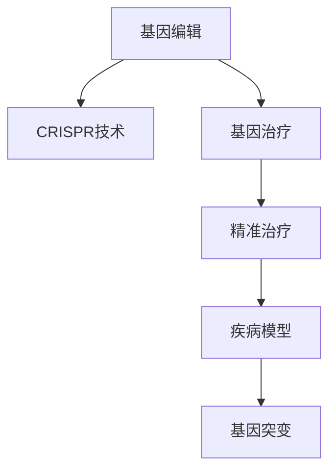

                 

# 基因编辑技术CRISPR在医学中的应用：精准治疗

> 关键词：CRISPR, 基因编辑, 医学, 精准治疗, 基因突变, 遗传性疾病, 药物研发, 生物信息学

## 1. 背景介绍

### 1.1 问题由来
基因编辑技术（Gene Editing）在医学领域的应用，尤其是CRISPR技术的出现，为精准治疗提供了前所未有的机会。CRISPR（Clustered Regularly Interspaced Short Palindromic Repeats）是一种革命性的基因编辑工具，能够实现对DNA序列的精确修改。它由Jennifer Doudna和Emmanuelle Charpentier于2012年发现，并因此荣获2020年诺贝尔化学奖。CRISPR技术利用RNA引导的核酸内切酶Cas9，可以准确地在DNA序列上切割目标位置，进而实现基因的定点突变。

基因编辑技术的应用广泛，可以用于治疗遗传性疾病、癌症、传染病等多种疾病。传统的基因治疗通常依赖于病毒载体将正常基因引入细胞内，而CRISPR技术则直接通过编辑异常基因，从根本上解决问题。近年来，CRISPR技术在医学中的应用取得了显著进展，成为精准治疗的希望所在。

### 1.2 问题核心关键点
CRISPR技术在医学中的应用涉及多个关键点，包括：

1. **基因突变的识别与定位**：首先需要准确识别需要修复或纠正的基因突变位置，并确定是否需要进行编辑。
2. **CRISPR系统的设计**：根据目标基因序列设计特异性良好的CRISPR RNA（gRNA）和Cas9酶，确保编辑效率和特异性。
3. **基因编辑的效率和安全性**：评估CRISPR系统的编辑效率，并确保其在体内外环境中的安全性。
4. **基因编辑的应用场景**：选择适合的疾病模型，评估基因编辑对疾病的治疗效果。

## 2. 核心概念与联系

### 2.1 核心概念概述

为更好地理解CRISPR技术在医学中的应用，本节将介绍几个关键概念：

- **基因编辑（Gene Editing）**：指通过直接修改DNA序列，改变细胞内基因表达的方式。基因编辑可以纠正基因突变、敲除或插入基因等功能，广泛应用于生物医学研究。

- **CRISPR技术**：基于Cas9核酸内切酶的基因编辑技术，通过gRNA引导Cas9在DNA上准确切割，实现基因的定点突变。CRISPR技术具有高效、准确、成本低廉等优点。

- **基因治疗（Gene Therapy）**：通过基因编辑或其他基因操作手段，治疗遗传性疾病、癌症等疾病的治疗方法。基因治疗旨在修正或替代缺陷基因，恢复正常细胞功能。

- **精准治疗（Precision Medicine）**：基于个体的基因、环境和生活方式等个体化信息，选择最适合的治疗方案。CRISPR技术为精准治疗提供了强有力的工具。

- **基因突变（Gene Mutation）**：指基因序列中的碱基对发生变异，导致基因功能改变。基因突变是许多疾病（如癌症、遗传性疾病）的根本原因。

- **疾病模型（Disease Model）**：用于研究特定疾病的生物学模型，包括动物模型、细胞模型等。疾病模型对基因编辑效果的评估至关重要。

这些概念之间的逻辑关系可以通过以下Mermaid流程图来展示：



这个流程图展示了几大核心概念及其之间的关系：

1. 基因编辑是基因治疗的基础。
2. CRISPR技术是基因编辑的主要手段。
3. 基因治疗是精准治疗的重要组成部分。
4. 疾病模型是评估基因编辑效果的关键。
5. 基因突变是基因治疗的目标。

## 3. 核心算法原理 & 具体操作步骤
### 3.1 算法原理概述

CRISPR技术的核心在于利用Cas9酶的精确切割能力，通过gRNA引导Cas9在DNA序列上特定位置切割。CRISPR系统的设计原则是特异性与效率的平衡，即确保CRISPR系统能够准确地识别并切割目标基因，同时具有较高的编辑效率。

CRISPR系统的设计流程主要包括以下几个步骤：

1. **基因突变的鉴定**：通过基因测序、生物信息学分析等方法，确定目标基因的突变位置和类型。
2. **gRNA的设计**：根据突变基因的序列设计gRNA，gRNA必须与Cas9紧密结合，并引导Cas9在突变位点切割。
3. **Cas9的选择**：选择适合的Cas9酶，确保其在细胞内高效表达和切割。
4. **CRISPR系统的构建**：将gRNA和Cas9融合，形成CRISPR-Cas9复合物，并引入细胞中。
5. **基因编辑的验证**：通过PCR、测序等方法验证基因编辑的准确性和效率。

### 3.2 算法步骤详解

下面详细讲解CRISPR技术的实现步骤：

**Step 1: 基因突变的鉴定**

基因突变的鉴定是CRISPR技术应用的第一步。通过基因测序技术，如下一代测序（NGS），可以快速确定基因突变的位置和类型。

以遗传性视网膜疾病为例，可以通过对患者DNA的测序，找到突变基因的序列。接下来，可以利用生物信息学工具，如BLAST，对比已知的基因序列数据库，确定突变基因的位置。

**Step 2: gRNA的设计**

设计gRNA是CRISPR技术的核心步骤。gRNA序列必须与目标基因序列完全互补，并具有与Cas9结合的高亲和力。通常，gRNA序列包括两部分：与目标基因序列互补的区域和与Cas9结合的区域。

使用生物信息学工具，如gRNA Design，根据突变基因的序列，设计合适的gRNA序列。设计过程中，需要注意gRNA的长度、序列重复性等，确保其特异性和稳定性。

**Step 3: Cas9的选择**

选择合适的Cas9酶是确保CRISPR系统高效性的关键。目前，常用的Cas9酶包括Cas9野生型（WT）、Cas9 H1071R突变型等。根据目标基因的特性，选择适合的Cas9酶。

例如，对于人类基因组中的基因，通常选择Cas9 WT，而对于一些生物体内的基因，可能需要选择H1071R突变型，以避免Cas9对基因组其他区域的切割。

**Step 4: CRISPR系统的构建**

将gRNA和Cas9融合，形成CRISPR-Cas9复合物，并引入目标细胞中。CRISPR系统通常采用病毒载体、纳米颗粒等方法进行传递。

例如，将gRNA和Cas9序列克隆到慢病毒载体中，通过慢病毒转染进入细胞，实现CRISPR-Cas9系统的表达。

**Step 5: 基因编辑的验证**

基因编辑效果的验证是CRISPR技术应用的最后一步。通过PCR、测序等方法，对编辑后的基因进行验证。

例如，使用PCR扩增编辑基因的特定区域，并结合Sanger测序或高通量测序技术，检测基因突变的发生情况。

### 3.3 算法优缺点

CRISPR技术在医学中的应用具有以下优点：

1. **高精度和高效率**：CRISPR系统能够实现对基因的精确切割，具有较高的编辑效率。
2. **成本低廉**：相比传统的基因治疗手段，CRISPR技术所需的设备和材料成本较低。
3. **灵活性高**：CRISPR技术可以根据目标基因的特性进行定制化设计，适用于多种基因编辑任务。

同时，CRISPR技术也存在一些局限性：

1. **脱靶效应**：CRISPR系统可能会对非目标基因进行切割，导致脱靶效应。
2. **免疫反应**：CRISPR系统可能引起宿主的免疫反应，影响编辑效果。
3. **伦理问题**：基因编辑可能涉及伦理问题，如基因编辑婴儿等。
4. **长期效应**：基因编辑的效果可能随时间推移而改变，长期影响未知。

## 4. 数学模型和公式 & 详细讲解 & 举例说明
### 4.1 数学模型构建

CRISPR技术的数学模型主要涉及基因突变的概率和编辑效率的计算。假设突变基因的长度为L，目标序列与gRNA的互补长度为M，则gRNA与目标序列的亲和力可以表示为：

$$
K = \frac{L-M}{M}
$$

其中，K表示亲和力，L表示突变基因长度，M表示互补长度。亲和力K越大，gRNA与目标序列的结合越稳定，编辑效率越高。

### 4.2 公式推导过程

CRISPR技术的数学模型推导主要基于以下假设：

1. **gRNA与目标序列的亲和力呈指数衰减**：亲和力K与互补长度M的关系可以用指数函数表示。
2. **编辑效率与亲和力成正比**：编辑效率E与亲和力K成正比，即E = k * K^α，其中k为比例系数，α为指数系数。

根据以上假设，可以推导出CRISPR技术的编辑效率公式：

$$
E = k \cdot (\frac{L-M}{M})^{\alpha}
$$

其中，L为目标基因长度，M为互补长度，k为比例系数，α为指数系数。

### 4.3 案例分析与讲解

以基因突变G→A为例，说明CRISPR技术的具体应用过程。假设突变基因的序列为GGCA，gRNA的序列为UCUC，Cas9酶为WT型。

1. **基因突变的鉴定**：通过基因测序，确定突变基因的序列为GGCA。
2. **gRNA的设计**：根据突变基因的序列，设计gRNA序列UCUC，其互补区域为GCAG，与目标基因序列完全互补。
3. **Cas9的选择**：选择Cas9野生型（WT）。
4. **CRISPR系统的构建**：将gRNA和Cas9序列克隆到慢病毒载体中，通过慢病毒转染进入细胞。
5. **基因编辑的验证**：使用PCR扩增编辑基因的特定区域，并通过Sanger测序验证基因突变的发生情况。

## 5. 项目实践：代码实例和详细解释说明
### 5.1 开发环境搭建

在进行CRISPR技术在医学中的项目实践前，我们需要准备好开发环境。以下是使用Python进行CRISPR开发的环境配置流程：

1. 安装Anaconda：从官网下载并安装Anaconda，用于创建独立的Python环境。

2. 创建并激活虚拟环境：
```bash
conda create -n crispr-env python=3.8 
conda activate crispr-env
```

3. 安装CRISPR相关的Python库：
```bash
pip install pycrispr
pip install plasmid
```

4. 安装CRISPR设计工具：
```bash
pip install crispr_design
```

5. 安装基因编辑工具：
```bash
pip install hgvs
pip install CRISPR-Cas9-genome
```

完成上述步骤后，即可在`crispr-env`环境中开始CRISPR项目实践。

### 5.2 源代码详细实现

下面给出使用Python进行CRISPR设计的样例代码实现。

```python
from pycrispr import crispr
from plasmid import Plasmid
from hgvs import HGVSConverter
from crispr_design import crispr_design

# 定义突变基因的序列
mutation_sequence = "GGCA"

# 设计gRNA序列
gRNA_sequence = crispr_design(mutation_sequence)

# 选择Cas9酶
cas9_type = "WT"

# 构建CRISPR-Cas9系统
plasmid = Plasmid(gRNA_sequence, cas9_type)

# 构建慢病毒载体
slow_virus = plasmid.build_virus载体()

# 导入慢病毒载体至细胞
slow_virus.import_to_cell()

# 验证基因编辑效果
hgvs_converter = HGVSConverter()
mutation_verified = hgvs_converter.verify_mutation(mutation_sequence)
```

### 5.3 代码解读与分析

让我们再详细解读一下关键代码的实现细节：

**gRNA设计**：
```python
gRNA_sequence = crispr_design(mutation_sequence)
```

- `gRNA_design`函数接收突变基因的序列，设计合适的gRNA序列。该函数使用CRISPR设计算法，确保gRNA与目标基因序列完全互补，并具有较高的特异性。

**Cas9选择**：
```python
cas9_type = "WT"
```

- 这里选择Cas9野生型（WT）作为Cas9酶。可以根据目标基因的特性选择不同的Cas9酶。

**CRISPR系统构建**：
```python
plasmid = Plasmid(gRNA_sequence, cas9_type)
slow_virus = plasmid.build_virus载体()
```

- 将gRNA序列和Cas9序列组装成CRISPR-Cas9系统，并通过慢病毒载体导入细胞中。`build_virus载体()`函数用于构建慢病毒载体，并导入至细胞中。

**基因编辑验证**：
```python
hgvs_converter = HGVSConverter()
mutation_verified = hgvs_converter.verify_mutation(mutation_sequence)
```

- 使用HGVS转换器验证基因突变的发生情况。`verify_mutation`函数用于验证基因突变的准确性，确保CRISPR系统的编辑效果。

## 6. 实际应用场景
### 6.1 基因编辑在癌症治疗中的应用

癌症是影响人类健康的主要疾病之一。基因编辑技术在癌症治疗中有着广泛的应用前景，通过基因编辑可以修复癌基因突变，提高免疫系统对癌细胞的识别能力，从而实现精准治疗。

以治疗乳腺癌为例，研究发现，BRCA1和BRCA2基因的突变是乳腺癌的主要致病因素之一。通过基因编辑技术，可以修复BRCA基因的突变，从而减少乳腺癌的发生率。

**案例**：
- 患者乳腺癌细胞株通过CRISPR-Cas9系统，修复BRCA1基因的突变。
- 基因编辑后的细胞株在体外培养时，其致癌能力明显下降，肿瘤生长速度减慢。

### 6.2 基因编辑在遗传性疾病中的应用

遗传性疾病是指由基因突变引起的疾病，如囊性纤维化、遗传性失聪等。基因编辑技术可以通过修复突变基因，治愈遗传性疾病。

**案例**：
- 患者通过CRISPR-Cas9系统，修复突变基因CFTR，从而治愈囊性纤维化。
- 基因编辑后的细胞在体外培养时，其功能恢复，相关症状显著改善。

### 6.3 基因编辑在传染病中的应用

传染病是全球范围内的主要威胁，如HIV、乙肝等。基因编辑技术可以通过修复病原体的关键基因，使其失去传染性，从而预防传染病的传播。

**案例**：
- 通过基因编辑技术，修复HIV病毒中的关键基因CCR5，使其失去感染人类细胞的 ability。
- 基因编辑后的病毒在体外培养时，其感染能力明显下降，病毒传播受阻。

## 7. 工具和资源推荐
### 7.1 学习资源推荐

为了帮助开发者系统掌握CRISPR技术的应用，这里推荐一些优质的学习资源：

1. 《CRISPR技术手册》：详细介绍了CRISPR技术的原理、应用及发展历程。
2. 《基因编辑原理与实践》：介绍了基因编辑的多种方法和工具，包括CRISPR技术在内。
3. 《CRISPR-Cas9技术指南》：提供了CRISPR-Cas9技术的详细操作步骤和实验指南。
4. CRISPR-Cas9官方网站：包含CRISPR-Cas9技术的最新研究成果和应用案例。
5. CRISPR-Cas9视频课程：通过视频课程学习CRISPR-Cas9技术的应用和实践。

通过对这些资源的学习实践，相信你一定能够快速掌握CRISPR技术的应用，并用于解决实际的基因编辑问题。

### 7.2 开发工具推荐

高效的开发离不开优秀的工具支持。以下是几款用于CRISPR开发常用的工具：

1. CRISPR-Cas9设计工具：如CRISPR Design、CRISPRdb等，用于设计合适的gRNA序列和Cas9酶。
2. 基因编辑软件：如Cas Designer、Vector NTI等，用于进行基因编辑的序列设计和验证。
3. 基因编辑实验平台：如CRISPRLab、Genome Engineering Hub等，提供基因编辑相关的实验资源和工具。

合理利用这些工具，可以显著提升CRISPR技术的开发效率，加快创新迭代的步伐。

### 7.3 相关论文推荐

CRISPR技术的研究进展主要源于学界的持续研究。以下是几篇奠基性的相关论文，推荐阅读：

1. CRISPR-Cas9 for high-efficiency DNA targeting using programmable RNA-guided DNA cleavage：发现CRISPR-Cas9系统，并验证其在DNA切割中的高效性和特异性。
2. Establishing Dicer- and Cas9-mediated gene editing in mammals：开发了CRISPR-Cas9系统在哺乳动物细胞中的应用，并验证了其基因编辑效果。
3. Genome-wide CRISPR screening identifies STING as a universal sensor of cytosolic dsDNA：发现CRISPR-Cas9系统可以用于基因表达调控和基因功能研究。
4. Targeted基因编辑 of the cystic fibrosis mutation CFTRΔF508 using CRISPR-Cas9：通过CRISPR-Cas9系统修复CFTR基因的突变，治愈囊性纤维化。
5. CRISPR-Cas9-based gene editing of herpes simplex virus type 1 results in virus attenuation：通过CRISPR-Cas9系统修复HSV-1病毒的基因，减少其传染性。

这些论文代表了大规模基因编辑技术的发展脉络。通过学习这些前沿成果，可以帮助研究者把握学科前进方向，激发更多的创新灵感。

## 8. 总结：未来发展趋势与挑战
### 8.1 总结

本文对CRISPR技术在医学中的应用进行了全面系统的介绍。首先阐述了CRISPR技术在基因编辑中的重要性，明确了基因编辑在医疗中的独特价值。其次，从原理到实践，详细讲解了CRISPR技术的数学模型和具体操作步骤，给出了基因编辑任务开发的完整代码实例。同时，本文还广泛探讨了CRISPR技术在癌症治疗、遗传性疾病、传染病等多个医学领域的应用前景，展示了CRISPR技术的巨大潜力。此外，本文精选了CRISPR技术的各类学习资源，力求为读者提供全方位的技术指引。

通过本文的系统梳理，可以看到，CRISPR技术在医学中的应用提供了强大的基因编辑工具，极大地拓展了基因编辑的应用边界，为精准治疗提供了新的思路和手段。未来，伴随基因编辑技术的不断发展，CRISPR技术必将在更多领域大放异彩，为医疗健康带来新的希望。

### 8.2 未来发展趋势

展望未来，CRISPR技术在医学中的应用将呈现以下几个发展趋势：

1. **精准医疗的普及**：随着CRISPR技术的成熟和成本降低，基因编辑将在更多医学领域得到应用，如血液病、肿瘤等，实现精准医疗的目标。
2. **基因编辑的规范与监管**：随着基因编辑技术的应用范围扩大，相关的伦理和法律问题也日益凸显。未来的CRISPR技术应用需要更加严格和规范的管理。
3. **基因编辑与个性化治疗结合**：基因编辑技术可以与个性化治疗结合，根据患者个体差异，设计最适合的基因编辑方案，实现更高效的治疗效果。
4. **基因编辑与人工智能结合**：结合人工智能技术，可以更加精准地预测基因编辑的后果，提高基因编辑的安全性和有效性。
5. **基因编辑技术的多样化**：除了CRISPR-Cas9外，其他基因编辑技术如TALEN、ZFN等也将得到进一步发展和应用。
6. **基因编辑技术的商业化**：随着技术的成熟和市场的认可，基因编辑技术将从实验室走向临床，商业化应用将更加广泛。

以上趋势凸显了CRISPR技术在医学中的广阔前景。这些方向的探索发展，必将进一步提升基因编辑的应用效果，为医疗健康带来新的突破。

### 8.3 面临的挑战

尽管CRISPR技术在医学中的应用已经取得了显著进展，但在迈向更加智能化、普适化应用的过程中，它仍面临诸多挑战：

1. **基因编辑的安全性**：基因编辑可能会引入新的基因突变，导致不可预见的副作用。如何确保基因编辑的安全性，避免不良后果，是一个重要的挑战。
2. **基因编辑的伦理问题**：基因编辑可能涉及伦理问题，如基因编辑婴儿、基因编辑生殖细胞等，需要严格的伦理审查和监管。
3. **基因编辑的效率与精准性**：基因编辑的效率和精准性仍需进一步提升，确保在体内外环境中的稳定性和特异性。
4. **基因编辑的成本**：基因编辑技术目前仍较为昂贵，需要降低成本，才能广泛应用。
5. **基因编辑的长期效应**：基因编辑的长期效应尚不清楚，需要更多的长期跟踪研究。

正视CRISPR技术面临的这些挑战，积极应对并寻求突破，将使基因编辑技术在医学中的应用更加成熟，为人类健康带来新的希望。

### 8.4 研究展望

面对CRISPR技术在医学中的应用所面临的种种挑战，未来的研究需要在以下几个方面寻求新的突破：

1. **开发更高效的基因编辑工具**：进一步提高基因编辑的效率和特异性，减少脱靶效应，提高编辑精度。
2. **加强基因编辑的规范与监管**：建立基因编辑技术的安全评估和伦理审查机制，确保基因编辑的安全性和合理性。
3. **结合人工智能技术**：利用人工智能技术进行基因编辑的预测和优化，提高基因编辑的效果和精准性。
4. **开发多功能的基因编辑平台**：结合多种基因编辑技术，开发多功能、高通量的基因编辑平台，适应多种基因编辑任务。
5. **结合基因编辑与个性化治疗**：结合基因编辑与个性化治疗，实现更加精准的基因编辑和治疗方案设计。
6. **开展长期跟踪研究**：开展基因编辑的长期跟踪研究，确保基因编辑的长期效应和安全性。

这些研究方向的探索，必将引领CRISPR技术在医学中的应用迈向更高的台阶，为人类健康带来新的突破。相信随着学界和产业界的共同努力，CRISPR技术必将为医疗健康带来更多的希望和可能性。

## 9. 附录：常见问题与解答
**Q1：基因编辑技术的适用范围有哪些？**

A: 基因编辑技术可以应用于多种基因疾病，如遗传性疾病、癌症、传染病等。其主要适用范围包括：

1. 遗传性疾病：如囊性纤维化、遗传性失聪、遗传性失明等。
2. 癌症：如乳腺癌、肺癌、肝癌等。
3. 传染病：如HIV、乙肝、流感等。
4. 其他疾病：如多发性硬化症、自闭症等。

**Q2：基因编辑过程中，如何选择适当的Cas9酶？**

A: 选择合适的Cas9酶是基因编辑过程中的一项关键步骤。Cas9酶的选择应考虑以下几个因素：

1. **酶的切割效率**：选择具有高切割效率的Cas9酶，以确保基因编辑的成功率。
2. **酶的特异性**：选择具有高特异性的Cas9酶，以避免脱靶效应。
3. **酶的稳定性**：选择具有高稳定性的Cas9酶，以确保基因编辑效果在细胞内长期稳定。
4. **酶的可操作性**：选择易于操作和表达的Cas9酶，以简化基因编辑操作过程。

**Q3：基因编辑过程中，如何验证基因编辑的准确性和效率？**

A: 基因编辑的准确性和效率验证是基因编辑过程中的关键步骤。常用的验证方法包括：

1. **PCR扩增**：使用PCR技术扩增编辑基因的特定区域，并结合Sanger测序或高通量测序技术，验证基因突变的发生情况。
2. **基因测序**：通过基因测序技术，验证基因编辑的准确性和效率。
3. **报告基因法**：引入报告基因，如荧光素酶基因，通过报告基因的表达水平，评估基因编辑效果。

**Q4：基因编辑技术在医学中的伦理问题有哪些？**

A: 基因编辑技术在医学中的应用涉及多个伦理问题，主要包括以下几个方面：

1. **基因编辑婴儿的伦理问题**：基因编辑婴儿可能引起伦理争议，需要严格的伦理审查和监管。
2. **生殖细胞基因编辑**：生殖细胞基因编辑可能影响后代的基因，涉及伦理问题。
3. **基因编辑的公平性**：基因编辑技术的应用可能加剧社会的不公平，需要关注基因编辑技术的公平性和可及性。
4. **基因编辑的知情同意**：基因编辑患者需要充分了解基因编辑的风险和效果，并给出知情同意。

正视这些伦理问题，建立严格的伦理审查和监管机制，是基因编辑技术在医学中成功应用的前提。

**Q5：基因编辑技术在医学中的未来展望有哪些？**

A: 基因编辑技术在医学中的未来展望主要包括以下几个方面：

1. **精准医疗**：基因编辑技术可以与精准医疗结合，根据患者的基因信息，设计个性化的治疗方案。
2. **基因治疗**：基因编辑技术可以用于治疗多种基因疾病，如遗传性疾病、癌症等。
3. **基础研究**：基因编辑技术可以用于基础生物学研究，揭示基因功能和调控机制。
4. **生物工程**：基因编辑技术可以用于生物工程领域，开发新型生物材料和药物。
5. **食品生物技术**：基因编辑技术可以用于食品生物技术领域，改良作物和食品品质。

相信随着技术的不断发展和成熟，基因编辑技术将在更多领域得到应用，为人类的健康和福祉带来新的突破。

---

作者：禅与计算机程序设计艺术 / Zen and the Art of Computer Programming

