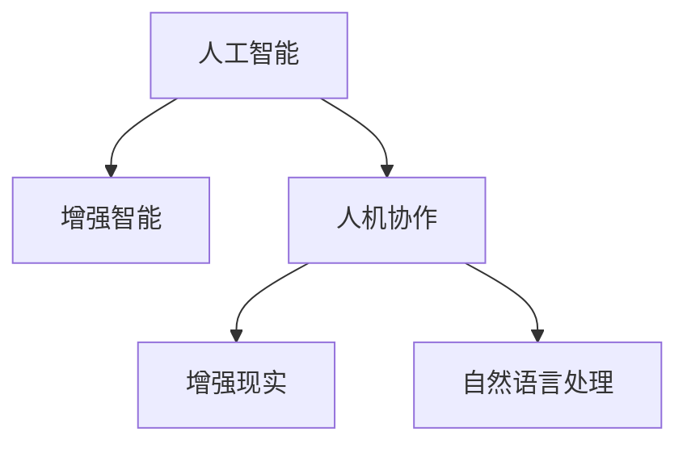

                 

# 增强智能时代：人机协作，提升人类潜能

在数字化、智能化飞速发展的今天，人工智能（AI）技术正以前所未有的速度融入人类生活的方方面面。从医疗、教育、金融，到交通、制造、能源，AI不仅提升了效率，还解锁了新的可能性，为人类潜能的提升开辟了广阔空间。本篇文章将深入探讨增强智能时代下的人机协作，探索如何通过AI技术提升人类潜能，并展望未来应用前景。

## 1. 背景介绍

### 1.1 问题由来

随着人工智能技术的不断进步，尤其是深度学习和神经网络的发展，各类AI应用已经成为推动社会进步和产业升级的重要力量。AI技术以其高效、精确、可扩展等优势，被广泛应用于各行各业。然而，传统AI技术主要以执行特定任务为主，缺乏与人类智能的深度融合。而增强智能时代强调的是AI与人类的协作，旨在通过AI技术的强大计算和处理能力，扩展和增强人类的认知、决策和行动能力。

### 1.2 问题核心关键点

增强智能时代的人机协作主要包括以下几个关键点：
- **认知增强**：通过AI技术提高人类的认知能力，如增强记忆力、提升思维逻辑等。
- **决策支持**：AI在数据分析、模拟仿真、预测决策等方面为人类提供辅助，提升决策的准确性和效率。
- **行动辅助**：AI能够执行重复性、危险性或高难度工作，为人类释放更多时间和精力，专注于创造性、战略性工作。
- **人机交互**：通过自然语言处理、计算机视觉、增强现实等技术，实现更自然、高效的人机交互。

### 1.3 问题研究意义

研究增强智能时代下的人机协作，对于推动技术进步、提升人类潜能、促进经济社会发展具有重要意义：

- **技术突破**：通过融合AI与人类的智能，可以突破传统AI应用的局限，探索新的应用场景和技术方向。
- **潜能提升**：AI可以辅助人类进行更复杂、更深入的思考和创造，提升人类的整体认知和创造力。
- **社会进步**：AI与人类的协作能够解决更多社会问题，提高社会运行效率，推动社会公平与和谐。
- **产业发展**：AI技术在多个行业的融合应用，将带来新的增长点，推动经济结构优化升级。

## 2. 核心概念与联系

### 2.1 核心概念概述

为更好地理解增强智能时代的人机协作，本节将介绍几个关键核心概念：

- **人工智能**：指由计算机系统模拟人类智能行为的技术，包括感知、推理、学习、决策等多个方面。
- **增强智能**：通过融合AI技术与人类智能，提升人类的认知、决策和行动能力。
- **人机协作**：指AI系统与人类之间的互动合作，共同完成任务或解决问题。
- **增强现实**：通过计算机图形技术在现实世界叠加虚拟信息，增强人类对环境的感知和理解。
- **自然语言处理**：使计算机能够理解、处理和生成自然语言的技术，实现人机自然交流。

这些核心概念之间存在密切联系，共同构成了增强智能时代的技术基础。以下通过Mermaid流程图展示其联系：



### 2.2 核心概念原理和架构

增强智能时代的人机协作主要基于以下原理和架构：

#### 2.2.1 认知增强原理

认知增强的核心在于通过AI技术模拟和扩展人类的认知能力。常用的方法包括：

- **知识图谱**：构建大规模的知识图谱，整合各类知识资源，为人类提供便捷的知识获取渠道。
- **模拟仿真**：利用AI进行复杂系统的模拟仿真，辅助人类进行科学研究和工程设计。
- **增强学习**：通过与环境互动，AI系统学习并优化决策策略，提升决策能力。

#### 2.2.2 决策支持原理

决策支持系统利用AI技术提供数据分析、预测和优化，为人类决策提供科学依据。具体方法包括：

- **数据分析**：利用机器学习算法处理和分析大量数据，提取有用信息，辅助人类决策。
- **预测分析**：通过预测模型，对未来趋势进行预测，帮助人类提前应对变化。
- **优化算法**：采用优化算法，为人类提供最优决策方案。

#### 2.2.3 行动辅助原理

行动辅助主要是指AI系统执行重复性或高难度任务，释放人类的时间和精力，专注于更具创造性的工作。具体方法包括：

- **自动化执行**：通过自动化流程，AI系统可以高效完成重复性、低价值的任务。
- **机器人协作**：AI驱动的机器人可以在高危、高难度环境中执行任务，保护人类安全。
- **虚拟助手**：智能助手可以辅助人类处理日常事务，提高工作效率。

#### 2.2.4 人机交互原理

人机交互是人机协作的基础，通过自然语言处理、计算机视觉等技术，实现更自然、高效的人机交流。具体方法包括：

- **自然语言处理**：使计算机能够理解和生成自然语言，实现人机自然交流。
- **计算机视觉**：通过图像识别、图像生成等技术，增强人类对视觉信息的处理能力。
- **增强现实**：通过增强现实技术，将虚拟信息叠加到现实世界中，提升人类的感知和理解能力。

## 3. 核心算法原理 & 具体操作步骤

### 3.1 算法原理概述

增强智能时代的人机协作算法主要基于认知增强、决策支持、行动辅助和人机交互等多个方面的原理。核心算法包括：

- **认知增强算法**：利用知识图谱、模拟仿真、增强学习等技术，提升人类认知能力。
- **决策支持算法**：采用数据分析、预测分析、优化算法等方法，为人类决策提供辅助。
- **行动辅助算法**：通过自动化执行、机器人协作、虚拟助手等技术，提升人类行动能力。
- **人机交互算法**：通过自然语言处理、计算机视觉、增强现实等技术，实现高效人机交流。

### 3.2 算法步骤详解

基于增强智能时代的人机协作算法主要包括以下步骤：

#### 3.2.1 数据准备

- **数据采集**：收集各类数据，包括知识库、历史数据、实时数据等。
- **数据预处理**：对数据进行清洗、标准化、归一化等处理，保证数据质量。

#### 3.2.2 模型训练

- **认知增强模型**：利用知识图谱、模拟仿真、增强学习等技术，训练认知增强模型。
- **决策支持模型**：采用数据分析、预测分析、优化算法等方法，训练决策支持模型。
- **行动辅助模型**：开发自动化执行、机器人协作、虚拟助手等模型，提升行动辅助能力。
- **人机交互模型**：利用自然语言处理、计算机视觉、增强现实等技术，构建人机交互模型。

#### 3.2.3 模型集成与优化

- **模型集成**：将各类模型集成到统一的系统中，实现协同工作。
- **模型优化**：根据应用场景和需求，优化模型参数和架构，提升性能和效率。

#### 3.2.4 应用部署

- **系统开发**：开发用户界面、业务逻辑等，实现系统功能。
- **系统部署**：将系统部署到生产环境，保证系统稳定运行。

### 3.3 算法优缺点

增强智能时代的人机协作算法具有以下优点：

- **高效性**：通过AI技术，能够高效处理大量数据，提升决策和行动的准确性。
- **灵活性**：可以根据不同应用场景，灵活调整模型参数和架构，满足多样化需求。
- **鲁棒性**：AI系统具备自我学习能力和适应能力，能够应对复杂多变的环境。

同时，这些算法也存在一些缺点：

- **数据依赖**：算法的性能高度依赖数据的质量和量级，数据不足或数据偏差可能导致模型效果不佳。
- **技术门槛高**：开发和优化复杂算法需要较高的技术门槛，一般需要跨学科团队协作。
- **伦理风险**：AI系统可能存在偏见或错误决策，带来伦理和安全风险。

### 3.4 算法应用领域

增强智能时代的人机协作算法广泛应用于多个领域，具体包括：

- **医疗健康**：利用AI进行疾病诊断、治疗方案推荐、健康管理等，提升医疗服务质量。
- **教育培训**：通过AI辅助教学、个性化学习、智能评估等，提升教育效果。
- **金融服务**：利用AI进行风险评估、投资分析、客户服务等，提升金融服务效率。
- **制造业**：采用AI进行生产优化、质量控制、供应链管理等，提升制造业竞争力。
- **智能家居**：通过AI实现智能控制、安全监控、能源管理等，提升居住体验。
- **智慧城市**：利用AI进行交通管理、环境监测、公共安全等，提升城市管理水平。

## 4. 数学模型和公式 & 详细讲解 & 举例说明

### 4.1 数学模型构建

增强智能时代的人机协作涉及多个领域的技术，以下以知识图谱和增强学习为例，构建数学模型。

#### 4.1.1 知识图谱模型

知识图谱是一种结构化的知识表示方式，通过节点和边的关系描述实体和属性。知识图谱的数学模型可以表示为：

$$
G = (E, R, T)
$$

其中 $E$ 表示实体集合，$R$ 表示关系集合，$T$ 表示属性集合。知识图谱的构建过程包括数据采集、实体抽取、关系抽取、属性抽取等步骤。

#### 4.1.2 增强学习模型

增强学习是一种通过与环境互动，优化决策策略的学习方法。常用的增强学习算法包括Q-learning、SARSA、Deep Q-Network等。其数学模型可以表示为：

$$
\theta = \mathop{\arg\min}_{\theta} J(\theta)
$$

其中 $\theta$ 表示模型参数，$J(\theta)$ 表示损失函数，用于衡量模型预测与真实值之间的差距。通过优化损失函数，增强学习算法不断调整模型参数，提高决策策略的准确性。

### 4.2 公式推导过程

#### 4.2.1 知识图谱模型推导

知识图谱的构建涉及实体关系抽取和属性抽取等步骤。以实体关系抽取为例，假设给定一个文本 $s$，提取的实体为 $e_1$ 和 $e_2$，关系为 $r$。实体关系抽取的数学模型可以表示为：

$$
\hat{r} = f(e_1, e_2)
$$

其中 $f$ 表示实体关系抽取函数，$\hat{r}$ 表示模型预测的关系。

#### 4.2.2 增强学习模型推导

增强学习的核心在于利用奖励函数（Reward Function）进行优化。以Q-learning算法为例，其更新规则可以表示为：

$$
Q(s, a) = Q(s, a) + \alpha(r + \gamma \max_{a'} Q(s', a'))
$$

其中 $\alpha$ 表示学习率，$r$ 表示即时奖励，$\gamma$ 表示折扣因子，$s'$ 表示状态转移后的新状态。Q-learning通过迭代更新Q值，优化决策策略。

### 4.3 案例分析与讲解

#### 4.3.1 知识图谱案例

以医疗领域为例，利用知识图谱技术辅助疾病诊断和治疗。通过收集医疗数据，构建疾病-症状-治疗方案的三元组关系图谱。医生在面对患者症状时，可以利用图谱查询出可能的疾病和治疗方案，提高诊断和治疗的准确性。

#### 4.3.2 增强学习案例

以自动驾驶为例，利用增强学习技术训练自动驾驶系统。系统通过与环境互动，不断优化决策策略，实现自动避障、路径规划等功能。增强学习算法可以处理不确定性和复杂性，提升自动驾驶系统的安全性和可靠性。

## 5. 项目实践：代码实例和详细解释说明

### 5.1 开发环境搭建

在进行增强智能时代的人机协作项目实践前，我们需要准备好开发环境。以下是使用Python进行TensorFlow和PyTorch开发的环境配置流程：

1. 安装Anaconda：从官网下载并安装Anaconda，用于创建独立的Python环境。

2. 创建并激活虚拟环境：
```bash
conda create -n pytorch-env python=3.8 
conda activate pytorch-env
```

3. 安装TensorFlow和PyTorch：根据CUDA版本，从官网获取对应的安装命令。例如：
```bash
conda install pytorch torchvision torchaudio cudatoolkit=11.1 -c pytorch -c conda-forge
```

4. 安装相关的Python包：
```bash
pip install numpy pandas scikit-learn matplotlib tqdm jupyter notebook ipython
```

完成上述步骤后，即可在`pytorch-env`环境中开始项目实践。

### 5.2 源代码详细实现

以下是使用TensorFlow和PyTorch实现增强智能时代人机协作项目的代码实现。

#### 5.2.1 TensorFlow代码实现

首先，定义知识图谱模型的超参数和函数：

```python
import tensorflow as tf
import numpy as np

# 定义知识图谱模型超参数
embedding_dim = 100
num_entities = 1000
num_relations = 100
num_attributes = 100

# 定义实体抽取函数
def entity抽取函数(s):
    # 实现实体抽取的逻辑
    pass

# 定义关系抽取函数
def关系抽取函数(e1, e2):
    # 实现关系抽取的逻辑
    pass

# 定义属性抽取函数
def属性抽取函数(e):
    # 实现属性抽取的逻辑
    pass
```

然后，实现知识图谱的构建和训练：

```python
# 构建知识图谱模型
class知识图谱模型(tf.keras.Model):
    def __init__(self):
        super(知识图谱模型, self).__init__()
        self.embedding = tf.keras.layers.Embedding(num_entities, embedding_dim)
        self.relation_embedding = tf.keras.layers.Embedding(num_relations, embedding_dim)
        self.attribute_embedding = tf.keras.layers.Embedding(num_attributes, embedding_dim)

    def call(self, inputs):
        e1, e2, r, a = inputs
        e1_embed = self.embedding(e1)
        e2_embed = self.embedding(e2)
        r_embed = self.relation_embedding(r)
        a_embed = self.attribute_embedding(a)
        # 实现实体关系抽取和属性抽取的逻辑
        return e1_embed, e2_embed, r_embed, a_embed

# 定义训练函数
def训练函数(model, dataset, batch_size, epochs):
    optimizer = tf.keras.optimizers.Adam(learning_rate=0.001)
    model.compile(optimizer=optimizer, loss=tf.keras.losses.mean_squared_error)
    model.fit(dataset, epochs=epochs, batch_size=batch_size)
```

最后，启动训练流程：

```python
# 定义数据集
dataset = np.random.rand(num_entities, embedding_dim)  # 随机生成数据集

# 训练知识图谱模型
model =知识图谱模型()
training_function(model, dataset, batch_size=32, epochs=10)
```

#### 5.2.2 PyTorch代码实现

首先，定义增强学习模型的超参数和函数：

```python
import torch
import torch.nn as nn
import torch.optim as optim

# 定义增强学习模型超参数
input_size = 10
hidden_size = 100
output_size = 2

# 定义Q网络
classQ网络(nn.Module):
    def __init__(self, input_size, hidden_size, output_size):
        super(Q网络, self).__init__()
        self.fc1 = nn.Linear(input_size, hidden_size)
        self.fc2 = nn.Linear(hidden_size, hidden_size)
        self.fc3 = nn.Linear(hidden_size, output_size)

    def forward(self, x):
        x = F.relu(self.fc1(x))
        x = F.relu(self.fc2(x))
        x = self.fc3(x)
        return x

# 定义奖励函数
def奖励函数(s, a, r):
    # 实现奖励函数的逻辑
    pass

# 定义状态转移函数
def状态转移函数(s, a):
    # 实现状态转移的逻辑
    pass
```

然后，实现增强学习的训练：

```python
# 构建Q网络
q_network = Q网络(input_size, hidden_size, output_size)

# 定义优化器
optimizer = optim.Adam(q_network.parameters(), lr=0.001)

# 定义训练函数
def训练函数(model, dataset, batch_size, epochs):
    for epoch in range(epochs):
        for i, (s, a, r, s_next) in enumerate(dataset):
            s = torch.tensor(s)
            a = torch.tensor(a)
            r = torch.tensor(r)
            s_next = torch.tensor(s_next)
            # 计算Q值
            q_value = model(s, a)
            q_next = model(s_next)
            # 计算目标Q值
            q_target = r + gamma * torch.max(q_next, dim=1).values
            # 计算损失
            loss = (q_value - q_target).mean()
            # 反向传播更新模型参数
            optimizer.zero_grad()
            loss.backward()
            optimizer.step()
```

最后，启动训练流程：

```python
# 定义数据集
dataset = np.random.rand(len(dataset), input_size)  # 随机生成数据集

# 训练增强学习模型
training_function(q_network, dataset, batch_size=32, epochs=10)
```

### 5.3 代码解读与分析

让我们再详细解读一下关键代码的实现细节：

#### 5.3.1 TensorFlow代码实现

**知识图谱模型类**：
- `__init__`方法：初始化模型参数，包括实体、关系、属性的嵌入层。
- `call`方法：定义前向传播过程，实现实体关系抽取和属性抽取的逻辑。

**训练函数**：
- 定义优化器，并编译模型。
- 使用`fit`方法进行模型训练，设定数据集、批次大小和训练轮数。

**数据集**：
- 生成随机实体嵌入矩阵，作为训练数据集。

#### 5.3.2 PyTorch代码实现

**Q网络类**：
- `__init__`方法：初始化神经网络结构，包括全连接层。
- `forward`方法：定义前向传播过程，实现Q值的计算。

**奖励函数和状态转移函数**：
- 定义奖励函数和状态转移函数的逻辑，根据具体应用场景进行实现。

**训练函数**：
- 使用`for`循环遍历训练数据集。
- 在每个迭代中，将状态和动作作为输入，计算Q值和目标Q值，并计算损失。
- 使用反向传播更新模型参数。

**数据集**：
- 生成随机状态矩阵，作为训练数据集。

## 6. 实际应用场景

### 6.1 智能医疗

智能医疗是增强智能时代的重要应用领域。通过AI技术辅助医生进行疾病诊断、治疗方案推荐、健康管理等，能够显著提升医疗服务质量，降低医疗成本。

具体应用包括：
- **疾病诊断**：利用知识图谱技术，构建疾病-症状-治疗方案的三元组关系图谱。医生在面对患者症状时，可以利用图谱查询出可能的疾病和治疗方案，提高诊断的准确性。
- **治疗方案推荐**：利用增强学习技术，训练治疗方案推荐模型。根据患者症状和历史数据，推荐最优的治疗方案。
- **健康管理**：利用AI进行患者健康监测和数据分析，及时发现异常情况，进行预防和治疗。

### 6.2 智能教育

智能教育通过AI技术辅助教学、个性化学习、智能评估等，提升教育效果，实现因材施教。

具体应用包括：
- **智能教学**：利用AI技术分析学生的学习行为和成绩，定制个性化的教学方案，提升学习效果。
- **个性化学习**：通过智能推荐系统，为学生推荐适合的教材、练习和资源，满足其个性化学习需求。
- **智能评估**：利用自然语言处理和计算机视觉技术，进行作业批改和考试评估，提升评估的准确性和效率。

### 6.3 金融服务

金融服务领域需要高效的数据分析和决策支持。通过AI技术进行风险评估、投资分析、客户服务等，能够提升金融服务效率和质量。

具体应用包括：
- **风险评估**：利用AI技术分析历史数据和市场情况，评估金融风险，提供决策支持。
- **投资分析**：通过机器学习模型，预测市场趋势，辅助投资决策。
- **客户服务**：利用聊天机器人等AI技术，提供24小时在线咨询服务，提升客户满意度。

## 7. 工具和资源推荐

### 7.1 学习资源推荐

为了帮助开发者系统掌握增强智能时代的人机协作理论基础和实践技巧，这里推荐一些优质的学习资源：

1. **《深度学习》系列书籍**：深度学习领域的经典教材，全面介绍了深度学习的基本概念和算法，适合系统学习。
2. **《机器学习》系列课程**：Coursera和edX等平台提供的机器学习课程，涵盖从理论到实践的各个方面，适合初学者和进阶者。
3. **《自然语言处理》系列书籍**：介绍自然语言处理的基本技术和应用，适合NLP领域的学习和实践。
4. **TensorFlow官方文档**：TensorFlow的官方文档，提供了丰富的API和教程，适合TensorFlow的学习和应用。
5. **PyTorch官方文档**：PyTorch的官方文档，提供了详细的API和教程，适合PyTorch的学习和应用。

通过对这些资源的学习实践，相信你一定能够快速掌握增强智能时代人机协作的精髓，并用于解决实际的AI问题。

### 7.2 开发工具推荐

高效的开发离不开优秀的工具支持。以下是几款用于增强智能时代人机协作开发的常用工具：

1. **TensorFlow**：由Google主导开发的深度学习框架，生产部署方便，适合大规模工程应用。
2. **PyTorch**：由Facebook主导开发的深度学习框架，灵活度较高，适合研究和实验。
3. **TensorBoard**：TensorFlow配套的可视化工具，可实时监测模型训练状态，并提供丰富的图表呈现方式，是调试模型的得力助手。
4. **Weights & Biases**：模型训练的实验跟踪工具，可以记录和可视化模型训练过程中的各项指标，方便对比和调优。
5. **Jupyter Notebook**：交互式编程环境，适合快速迭代实验和代码调试。

合理利用这些工具，可以显著提升增强智能时代人机协作任务的开发效率，加快创新迭代的步伐。

### 7.3 相关论文推荐

增强智能时代的人机协作技术发展迅速，以下是几篇奠基性的相关论文，推荐阅读：

1. **《神经网络与深度学习》**：深度学习领域的经典教材，介绍了神经网络和深度学习的基本原理和算法。
2. **《知识图谱构建与应用》**：介绍知识图谱的基本概念和应用，适合知识图谱的学习和实践。
3. **《增强学习》**：介绍增强学习的基本概念和算法，适合增强学习的学习和实践。
4. **《智能系统设计》**：介绍智能系统的设计思路和应用案例，适合智能系统的学习和实践。
5. **《人机协作与认知增强》**：介绍人机协作的基本概念和认知增强的方法，适合人机协作的学习和实践。

这些论文代表了大语言模型微调技术的发展脉络。通过学习这些前沿成果，可以帮助研究者把握学科前进方向，激发更多的创新灵感。

## 8. 总结：未来发展趋势与挑战

### 8.1 总结

本文对增强智能时代的人机协作进行了全面系统的介绍。首先阐述了增强智能时代的人机协作背景和意义，明确了人机协作在提升人类潜能、促进社会进步等方面的重要价值。其次，从原理到实践，详细讲解了增强智能时代的人机协作算法，给出了代码实例和详细解释。同时，本文还探讨了人机协作在医疗、教育、金融等领域的应用前景，展示了人机协作范式的广泛适用性和强大潜力。最后，本文精选了人机协作技术的各类学习资源，力求为读者提供全方位的技术指引。

通过本文的系统梳理，可以看到，增强智能时代的人机协作技术正在成为AI领域的重要范式，极大地拓展了AI应用的边界，催生了更多创新应用场景。未来，伴随AI技术的持续进步和应用领域的不断拓展，人机协作必将在更多行业得到应用，为经济社会发展带来新的机遇和挑战。

### 8.2 未来发展趋势

展望未来，增强智能时代的人机协作技术将呈现以下几个发展趋势：

1. **认知增强的提升**：随着知识图谱、模拟仿真、增强学习等技术的发展，认知增强的效果将进一步提升，帮助人类进行更深入、更广泛的认知活动。
2. **决策支持的深化**：AI技术将提供更精确、更全面的决策支持，辅助人类进行复杂决策和风险管理。
3. **行动辅助的普及**：AI系统将在更多领域执行重复性或高难度任务，为人类释放更多时间和精力，专注于更具创造性和战略性的工作。
4. **人机交互的优化**：通过自然语言处理、计算机视觉、增强现实等技术，实现更自然、更高效的人机交互，提升用户体验。

以上趋势凸显了增强智能时代人机协作技术的广阔前景。这些方向的探索发展，必将进一步提升AI技术的应用价值，为人机协作带来新的突破和创新。

### 8.3 面临的挑战

尽管增强智能时代的人机协作技术已经取得了显著成果，但在实现普适化、高效化应用的过程中，仍然面临诸多挑战：

1. **数据获取与标注**：高质量、大规模数据的获取和标注成本较高，成为人机协作技术发展的瓶颈。如何利用无监督学习和半监督学习等技术，降低数据依赖，是未来的重要研究方向。
2. **伦理与安全性**：人机协作技术可能涉及隐私和伦理问题，如数据隐私保护、决策透明性等。如何确保技术应用的伦理性和安全性，是未来的重要课题。
3. **计算资源需求**：大规模人机协作系统的计算资源需求较高，如何优化算法和模型，降低计算成本，是未来的重要研究方向。
4. **模型解释性**：人机协作技术往往需要高度复杂的模型，模型的黑盒特性使得解释性不足，难以进行调优和优化。如何增强模型的可解释性和可审计性，是未来的重要课题。

正视这些挑战，积极应对并寻求突破，将是人机协作技术走向成熟的关键。相信随着学界和产业界的共同努力，这些挑战终将一一被克服，人机协作技术必将在构建人机协同的智能时代中扮演越来越重要的角色。

### 8.4 研究展望

未来在人机协作技术的研究方向上，需要从以下几个方面进行深入探索：

1. **多模态融合**：将视觉、听觉、触觉等多模态信息与文本信息融合，提升人机协作系统的感知和理解能力。
2. **因果推理**：引入因果推理技术，增强模型的因果关系处理能力，提高决策的可靠性和稳定性。
3. **个性化定制**：通过深度学习和强化学习技术，实现个性化的定制化推荐和服务，提升用户体验。
4. **协同优化**：将人机协作系统与物理系统、社会系统等进行协同优化，提升整体系统的效率和效果。
5. **伦理与安全性**：在技术开发和应用过程中，引入伦理导向和安全性设计，确保技术应用的公平性和安全性。

这些研究方向将为人机协作技术的发展注入新的活力，推动人机协作系统在更多领域实现创新应用，为人类社会的进步和繁荣贡献力量。

## 9. 附录：常见问题与解答

**Q1：增强智能时代的人机协作技术能否应用于所有领域？**

A: 增强智能时代的人机协作技术具有广泛的适用性，已经在医疗、教育、金融、制造等多个领域取得了显著成果。但对于一些特定领域，如航空航天、核能等领域，仍需考虑其特殊性和安全性。因此，需要根据具体领域的特点，进行有针对性的技术应用和优化。

**Q2：人机协作技术在医疗领域的应用前景如何？**

A: 人机协作技术在医疗领域具有广阔的应用前景。通过AI技术辅助医生进行疾病诊断、治疗方案推荐、健康管理等，能够显著提升医疗服务质量，降低医疗成本。例如，利用知识图谱技术构建疾病-症状-治疗方案的关系图谱，能够提高疾病诊断的准确性和效率；利用增强学习技术训练治疗方案推荐模型，能够提供个性化的治疗方案。

**Q3：增强智能时代的人机协作技术如何保障数据隐私和安全？**

A: 数据隐私和安全是人机协作技术的重要考量因素。为了保障数据隐私和安全，可以采用以下方法：
- **数据匿名化**：对数据进行匿名化处理，避免数据泄露和滥用。
- **数据加密**：采用数据加密技术，保护数据在传输和存储过程中的安全。
- **访问控制**：设置严格的数据访问权限，确保只有授权用户能够访问和处理数据。
- **模型解释性**：增强模型的可解释性，提高透明度和可信度。

通过这些措施，可以在保障数据隐私和安全的前提下，充分利用人机协作技术带来的便捷和高效。

**Q4：增强智能时代的人机协作技术如何应对伦理与安全性挑战？**

A: 伦理与安全性是人机协作技术的重要挑战。为了应对这些挑战，可以采用以下方法：
- **伦理导向设计**：在技术开发和应用过程中，引入伦理导向的设计原则，确保技术的公平性和公正性。
- **模型可解释性**：增强模型的可解释性，提高透明度和可信度，减少偏见和歧视。
- **安全性保障**：在技术应用中，采用安全性保障措施，如访问控制、异常检测等，确保系统的稳定和安全。
- **隐私保护**：采取隐私保护措施，如数据匿名化、数据加密等，保护用户隐私。

通过这些措施，可以在保障伦理与安全性的前提下，充分利用人机协作技术带来的便捷和高效。

---

作者：禅与计算机程序设计艺术 / Zen and the Art of Computer Programming

