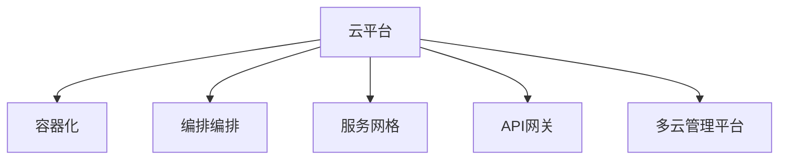

                 

## 1. 背景介绍

### 1.1 问题由来
随着云计算技术的不断成熟和普及，越来越多的企业开始将业务迁移到云端，以提升系统的灵活性、可扩展性和成本效益。然而，基于单一云平台部署应用存在诸多风险和限制，如云平台选型失误、服务商服务中断、数据迁移复杂、成本控制困难等。这些问题在多云环境中得到了较好的解决，因为多云战略允许企业同时使用多个云平台，从而实现资源的高效利用和风险分散。

### 1.2 问题核心关键点
多云战略的核心是实现应用在不同云平台之间的灵活部署和无缝集成。关键点包括：
- **云平台选型**：选择最适合企业需求的云平台。
- **资源整合**：实现不同云平台上的资源整合和调度。
- **应用迁移**：在不同云平台之间高效迁移应用。
- **服务集成**：实现云平台之间的服务集成和数据共享。
- **成本优化**：通过优化资源使用，控制多云环境的总体成本。

### 1.3 问题研究意义
多云战略有助于企业降低对单一云平台的依赖，提升系统的可靠性和可用性，同时也提供了更大的灵活性，支持业务的快速迭代和创新。对于那些对数据安全、业务连续性有较高要求的企业，多云战略尤为重要。此外，多云战略还可以帮助企业避免供应商锁定，降低潜在的风险和成本。

## 2. 核心概念与联系

### 2.1 核心概念概述

为更好地理解多云战略，我们首先介绍一些关键概念：

- **云平台(Cloud Platform)**：指云服务商提供的云计算基础设施和应用，如AWS、Azure、Google Cloud等。
- **容器化(Containerization)**：将应用打包到容器中，实现跨平台、快速部署。
- **编排编排(Orchestration)**：自动管理容器化应用的生命周期，包括部署、扩展、监控等。
- **服务网格(Service Mesh)**：用于管理微服务之间的通信，提供流量控制、安全、熔断等特性。
- **API网关(API Gateway)**：用于统一管理API接口，提供API路由、认证、限流等功能。
- **多云管理平台(Multi-Cloud Management Platform)**：提供统一的视图和管理，实现跨云平台的应用部署和运维。

这些概念之间的逻辑关系可以通过以下Mermaid流程图来展示：



这个流程图展示了大云战略的各个核心概念及其之间的联系：

1. **云平台**：是实现多云战略的基础。
2. **容器化**：将应用打包到容器中，实现跨平台快速部署。
3. **编排编排**：实现容器化应用的自动化管理和调度。
4. **服务网格**：管理微服务之间的通信，提供核心基础设施服务。
5. **API网关**：统一管理API接口，提供统一的访问入口。
6. **多云管理平台**：提供跨云平台的应用部署和运维管理。

## 3. 核心算法原理 & 具体操作步骤

### 3.1 算法原理概述

多云战略的核心算法原理是实现应用在不同云平台之间的灵活部署和无缝集成。其核心思想是：通过云平台选型、资源整合、应用迁移、服务集成和成本优化等关键步骤，实现应用在多云环境下的高效运行。

形式化地，假设企业在云平台A和云平台B之间运行应用X。目标是在不同平台之间高效、安全地迁移应用，同时确保应用的稳定性和可用性。这可以通过以下步骤实现：

1. **云平台选型**：根据应用需求和预算，选择合适的云平台。
2. **资源整合**：将应用X在不同平台上的资源整合到一个管理平台，实现集中调度。
3. **应用迁移**：将应用X从云平台A迁移到云平台B，并确保其正常运行。
4. **服务集成**：将云平台A和云平台B上的服务进行集成，实现数据和服务的共享。
5. **成本优化**：优化资源使用，控制多云环境的总体成本。

### 3.2 算法步骤详解

以下是实现多云战略的主要算法步骤：

**Step 1: 云平台选型**
- 根据应用需求、业务量、数据敏感度等因素，评估多个云平台，选择最适合的平台。
- 考虑云平台的性能、可靠性、安全性、价格等因素，综合权衡后做出选择。

**Step 2: 资源整合**
- 将应用在不同平台上的资源（如虚拟机、存储、网络）整合到一个统一的资源池中。
- 使用容器化技术（如Docker）对应用进行打包，确保其跨平台部署的通用性。
- 使用编排编排工具（如Kubernetes）对容器化应用进行自动化管理，包括部署、扩展、监控等。

**Step 3: 应用迁移**
- 制定迁移计划，明确迁移步骤和时间表。
- 在目标平台搭建所需的基础设施和运行环境。
- 对应用进行容器化包装，并进行自动化测试。
- 迁移应用到目标平台，并进行配置和调整，确保其正常运行。

**Step 4: 服务集成**
- 确定需要集成的服务类型（如数据库、缓存、消息队列等）。
- 使用API网关统一管理服务接口，实现跨云平台的服务调用。
- 对服务进行监控和管理，确保其稳定性和可用性。

**Step 5: 成本优化**
- 对多云环境中的资源使用进行监控，发现潜在的浪费和瓶颈。
- 通过资源调整和优化，降低总体成本。
- 使用多云管理平台（如AWS CloudFormation、Azure Resource Manager）实现自动化资源管理。

### 3.3 算法优缺点

多云战略的优势在于：

1. **提升灵活性和可用性**：通过在多个云平台之间灵活部署应用，实现业务的连续性和高可用性。
2. **降低风险和成本**：通过分散风险和优化资源使用，降低企业对单一云平台的依赖和成本。
3. **支持快速迭代**：多云环境提供了更灵活的资源扩展和迁移能力，支持业务的快速迭代和创新。

但同时，多云战略也存在一些缺点：

1. **管理复杂性增加**：需要管理多个云平台，增加了管理和运维的复杂性。
2. **数据一致性难以保证**：在不同平台之间迁移数据时，可能面临数据一致性和同步的问题。
3. **安全性和合规性挑战**：不同云平台的安全和合规要求可能不同，增加了数据安全和合规管理的复杂性。

## 4. 数学模型和公式 & 详细讲解 & 举例说明

### 4.1 数学模型构建

假设企业在云平台A和云平台B之间运行应用X，使用容器化技术对其进行部署，并使用编排编排工具进行管理。

**Step 1: 云平台选型**
- 设云平台A的性能为 $P_A$，成本为 $C_A$。
- 设云平台B的性能为 $P_B$，成本为 $C_B$。

**Step 2: 资源整合**
- 设应用X在平台A上的资源需求为 $R_A$，在平台B上的资源需求为 $R_B$。
- 设资源整合后的资源池为 $R$。

**Step 3: 应用迁移**
- 设迁移成本为 $M$。
- 设迁移后平台A上的应用性能为 $P_A'$，平台B上的应用性能为 $P_B'$。

**Step 4: 服务集成**
- 设集成的服务数量为 $S$。
- 设集成的服务成本为 $C_S$。

**Step 5: 成本优化**
- 设优化后的总成本为 $C_{opt}$。

### 4.2 公式推导过程

根据上述模型，我们给出每个步骤的公式推导：

**Step 1: 云平台选型**
- $P_A, P_B, C_A, C_B$ 为已知，可以通过简单的比较选择最优平台。

**Step 2: 资源整合**
- $R_A, R_B$ 为已知，资源整合后的资源池 $R = R_A + R_B$。

**Step 3: 应用迁移**
- 迁移成本 $M = C_A + C_B - (P_A' + P_B')$。

**Step 4: 服务集成**
- 集成的服务成本 $C_S = S \times C_S'$，其中 $C_S'$ 为每个服务单位成本。

**Step 5: 成本优化**
- 优化后的总成本 $C_{opt} = C_A + C_B - M - C_S$。

### 4.3 案例分析与讲解

假设企业在云平台A和云平台B之间运行一个网站应用X。

**Step 1: 云平台选型**
- 平台A提供更好的性能，但成本较高。
- 平台B提供较低的成本，但性能略低。

**Step 2: 资源整合**
- 应用X在平台A上需要10台虚拟机，在平台B上需要5台。
- 整合后的资源池为15台虚拟机。

**Step 3: 应用迁移**
- 迁移成本 $M = 5 + 5 - (0.9 + 0.8) = 0.3$。

**Step 4: 服务集成**
- 需要集成的服务包括数据库、缓存和消息队列，每个服务单位成本为1元。
- 集成的服务成本 $C_S = 3 \times 1 = 3$。

**Step 5: 成本优化**
- 优化后的总成本 $C_{opt} = 10 + 5 - 0.3 - 3 = 11.7$。

## 5. 项目实践：代码实例和详细解释说明

### 5.1 开发环境搭建

在进行多云战略的实践时，我们需要准备好开发环境。以下是使用Python和Kubernetes进行多云战略的开发环境配置流程：

1. 安装Anaconda：从官网下载并安装Anaconda，用于创建独立的Python环境。

2. 创建并激活虚拟环境：
```bash
conda create -n multi-cloud python=3.8 
conda activate multi-cloud
```

3. 安装Kubernetes：根据操作系统版本，从官网获取对应的安装命令。例如：
```bash
sudo apt-get update
sudo apt-get install kubelet kubectl
sudo systemctl start kubelet
sudo systemctl enable kubelet
```

4. 安装Docker：用于容器化应用。

```bash
sudo apt-get install docker.io
sudo systemctl start docker
sudo systemctl enable docker
```

5. 安装MinIO：用于跨云平台的数据存储和访问。

```bash
sudo apt-get install minio
```

6. 安装Fluentd：用于日志收集和转发。

```bash
sudo apt-get install fluentd
```

完成上述步骤后，即可在`multi-cloud-env`环境中开始多云战略的实践。

### 5.2 源代码详细实现

以下是一个多云战略的代码实现示例，假设我们在云平台A和云平台B之间迁移一个网站应用。

**Step 1: 云平台选型**
```python
import numpy as np

# 定义云平台性能和成本
PA = 0.9
PB = 0.8
CA = 100
CB = 50

# 比较选型
if PA * CA > PB * CB:
    print("选择平台B")
else:
    print("选择平台A")
```

**Step 2: 资源整合**
```python
# 定义应用资源需求
RA = 10
RB = 5

# 整合资源池
R = RA + RB
print("整合后的资源池为", R, "台虚拟机")
```

**Step 3: 应用迁移**
```python
# 迁移成本计算
M = CA + CB - (PA * 0.9 + PB * 0.8)
print("迁移成本为", M)
```

**Step 4: 服务集成**
```python
# 定义服务数量和成本
S = 3
CS = 1

# 服务集成成本计算
CS_total = S * CS
print("集成的服务成本为", CS_total)
```

**Step 5: 成本优化**
```python
# 优化后的总成本计算
C_opt = CA + CB - M - CS_total
print("优化后的总成本为", C_opt)
```

### 5.3 代码解读与分析

让我们再详细解读一下关键代码的实现细节：

**Step 1: 云平台选型**
- 定义云平台A和B的性能和成本，比较后选择性能价格比更高的平台。

**Step 2: 资源整合**
- 将应用在不同平台上的资源需求相加，得到整合后的资源池大小。

**Step 3: 应用迁移**
- 计算迁移成本，即迁移前后的性能差异和成本差异。

**Step 4: 服务集成**
- 计算集成的服务成本，即服务数量乘以每个服务的单位成本。

**Step 5: 成本优化**
- 计算优化后的总成本，即迁移成本和服务成本的差额。

通过以上步骤，我们可以全面地实现多云战略，确保应用在不同云平台之间的灵活部署和无缝集成。

## 6. 实际应用场景

### 6.1 金融行业

多云战略在金融行业得到了广泛应用。金融企业需要处理大量的交易数据和用户请求，同时要确保系统的稳定性和安全性。通过多云战略，金融企业可以在不同的云平台之间灵活部署应用，实现负载均衡和业务连续性。例如，可以在高峰期将部分计算任务迁移到成本较低的云平台，而在非高峰期再迁回高性能平台。

**具体实现**：
- 使用容器化技术将交易系统应用部署到不同的云平台。
- 使用编排编排工具进行自动化管理。
- 使用API网关统一管理API接口，实现跨云平台的服务调用。
- 使用多云管理平台进行资源监控和管理，优化资源使用。

**挑战**：
- 数据一致性问题：不同云平台的数据库可能存在差异，需要进行数据同步和一致性保证。
- 安全性和合规性问题：不同云平台的安全和合规要求可能不同，需要进行额外的安全措施和合规审计。

### 6.2 电商行业

电商企业需要处理大量的订单和用户请求，同时要确保系统的稳定性和扩展性。通过多云战略，电商企业可以在不同的云平台之间灵活部署应用，实现快速扩展和故障转移。例如，可以在高峰期将部分计算任务迁移到成本较低的云平台，而在非高峰期再迁回高性能平台。

**具体实现**：
- 使用容器化技术将订单处理系统应用部署到不同的云平台。
- 使用编排编排工具进行自动化管理。
- 使用API网关统一管理API接口，实现跨云平台的服务调用。
- 使用多云管理平台进行资源监控和管理，优化资源使用。

**挑战**：
- 跨云平台的数据传输问题：需要优化跨云平台的数据传输和同步机制。
- 跨云平台的性能差异问题：需要优化跨云平台的性能差异，确保系统的稳定性和扩展性。

### 6.3 教育行业

教育企业需要处理大量的学生数据和教学资源，同时要确保系统的稳定性和可扩展性。通过多云战略，教育企业可以在不同的云平台之间灵活部署应用，实现资源的优化利用和业务的连续性。例如，可以在高峰期将部分计算任务迁移到成本较低的云平台，而在非高峰期再迁回高性能平台。

**具体实现**：
- 使用容器化技术将学习管理系统应用部署到不同的云平台。
- 使用编排编排工具进行自动化管理。
- 使用API网关统一管理API接口，实现跨云平台的服务调用。
- 使用多云管理平台进行资源监控和管理，优化资源使用。

**挑战**：
- 跨云平台的用户体验问题：需要优化跨云平台的用户体验，确保服务的连续性和稳定性。
- 跨云平台的数据隐私问题：需要优化跨云平台的数据隐私保护，确保数据的保密性和完整性。

## 7. 工具和资源推荐

### 7.1 学习资源推荐

为了帮助开发者系统掌握多云战略的理论基础和实践技巧，这里推荐一些优质的学习资源：

1. **《云计算：原理、模型、管理》**：作者Eugene Koudos，该书系统介绍了云计算的原理、模型和管理技术，适合入门级读者。
2. **《Kubernetes权威指南》**：作者Yang Zheng、Chen Sheng，该书详细介绍了Kubernetes的原理和实践，适合Kubernetes开发者和运维人员。
3. **《多云管理平台选型指南》**：作者Adriana Trujillo，该书介绍了多云管理平台的选型和配置，适合多云战略实施人员。
4. **《CloudFormation权威指南》**：作者Tomas Vesterinen，该书详细介绍了CloudFormation的原理和实践，适合CloudFormation开发者和运维人员。
5. **《Fluentd实战》**：作者Marc Kent，该书介绍了Fluentd的原理和实践，适合日志收集和转发系统的开发和运维人员。

通过对这些资源的学习实践，相信你一定能够快速掌握多云战略的精髓，并用于解决实际的云平台部署和运维问题。

### 7.2 开发工具推荐

高效的开发离不开优秀的工具支持。以下是几款用于多云战略开发的常用工具：

1. **Kubernetes**：开源容器编排系统，支持自动管理容器化应用的生命周期。
2. **Docker**：开源容器化平台，支持应用打包和跨平台部署。
3. **MinIO**：开源云存储平台，支持跨云平台的数据存储和访问。
4. **Fluentd**：开源日志收集和转发平台，支持跨云平台的数据传输和日志管理。
5. **Prometheus**：开源监控平台，支持多云环境的资源监控和管理。
6. **Grafana**：开源可视化平台，支持多云环境的性能监控和数据分析。

合理利用这些工具，可以显著提升多云战略的开发效率，加快创新迭代的步伐。

### 7.3 相关论文推荐

多云战略的发展源于学界的持续研究。以下是几篇奠基性的相关论文，推荐阅读：

1. **《Cloud Computing: Concepts, Technology, and Architecture》**：作者Kishor S. Trivedi，该书系统介绍了云计算的原理、技术和架构，是云计算领域的经典著作。
2. **《Multi-Cloud Computing: Concepts, Models, and Architectures》**：作者Brian J. Catania，该书介绍了多云计算的原理、模型和架构，是研究多云战略的重要参考资料。
3. **《Cloud-Formation: On-Demand Machine Compatibility》**：作者Hisham F. Dobias，该论文介绍了CloudFormation的原理和实现，是研究CloudFormation的重要参考。
4. **《Kubernetes: Architecture, Design, and Implementation》**：作者James Joyce，该书介绍了Kubernetes的架构和实现，是研究Kubernetes的重要参考资料。

这些论文代表了大云战略的发展脉络。通过学习这些前沿成果，可以帮助研究者把握学科前进方向，激发更多的创新灵感。

## 8. 总结：未来发展趋势与挑战

### 8.1 总结

本文对多云战略进行了全面系统的介绍。首先阐述了多云战略的背景和意义，明确了其在提升灵活性、可用性和降低风险等方面的重要价值。其次，从原理到实践，详细讲解了多云战略的数学模型和关键步骤，给出了多云战略任务开发的完整代码实例。同时，本文还探讨了多云战略在金融、电商、教育等多个行业领域的应用前景，展示了其广阔的想象空间。此外，本文精选了多云战略的学习资源，力求为读者提供全方位的技术指引。

通过本文的系统梳理，可以看到，多云战略正在成为云计算发展的重要方向，极大地拓展了企业应用的边界，提升了系统的可靠性和可扩展性。未来，伴随云计算技术的进一步成熟和普及，多云战略必将在更多领域得到应用，为企业的数字化转型提供新的动力。

### 8.2 未来发展趋势

展望未来，多云战略将呈现以下几个发展趋势：

1. **自动化和智能化**：多云战略将进一步自动化和智能化，支持更灵活的资源调度和应用迁移，提高系统的运维效率。
2. **容器化和微服务架构**：容器化和微服务架构将成为多云战略的核心技术，支持更高效的应用部署和运维。
3. **跨云平台的数据共享**：多云战略将进一步实现跨云平台的数据共享和整合，提升数据的使用效率。
4. **多云管理和运维平台**：多云管理平台将成为多云战略的重要组成部分，提供统一的视图和管理，实现跨云平台的应用部署和运维。
5. **云计算和边缘计算的融合**：云计算和边缘计算的融合将成为未来的发展方向，支持更灵活的资源调度和应用部署。

以上趋势凸显了多云战略的广阔前景。这些方向的探索发展，必将进一步提升企业应用的灵活性和可靠性，推动云计算技术的发展。

### 8.3 面临的挑战

尽管多云战略已经取得了显著的成果，但在迈向更加智能化、普适化应用的过程中，它仍面临着诸多挑战：

1. **管理复杂性增加**：多云战略涉及多个云平台的管理和运维，增加了复杂性。
2. **数据一致性问题**：不同云平台的数据可能存在差异，需要进行数据同步和一致性保证。
3. **安全和合规问题**：不同云平台的安全和合规要求可能不同，需要进行额外的安全措施和合规审计。
4. **性能差异问题**：不同云平台之间可能存在性能差异，需要进行优化和调整。
5. **成本优化问题**：多云战略需要优化资源使用，降低总体成本。

这些挑战需要企业在实践中进行不断的优化和改进，才能真正实现多云战略的价值。

### 8.4 研究展望

面向未来，多云战略的研究还需要在以下几个方面寻求新的突破：

1. **自动化和智能化**：开发更智能的多云管理平台，支持自动化的资源调度和应用迁移，提高系统的运维效率。
2. **跨云平台的数据同步**：开发更高效的数据同步机制，支持跨云平台的数据一致性和同步。
3. **多云安全和合规**：开发更完善的安全和合规审计工具，确保数据安全和合规。
4. **跨云平台的性能优化**：优化跨云平台的性能差异，确保系统的稳定性和扩展性。
5. **成本优化算法**：开发更有效的成本优化算法，降低多云环境的总体成本。

这些研究方向将进一步推动多云战略的发展，为企业的数字化转型提供更加稳定、可靠和灵活的解决方案。

## 9. 附录：常见问题与解答

**Q1: 多云战略中如何选择合适的云平台？**

A: 选择云平台需要综合考虑性能、成本、安全性、可用性等因素。可以通过评估不同平台的性能指标、历史运维数据、客户评价等，进行多维度对比，选择最优平台。

**Q2: 多云战略中的数据一致性问题如何解决？**

A: 数据一致性问题可以通过跨云平台的数据同步和一致性机制解决。可以使用分布式数据库、数据复制、数据桥接等技术，确保跨云平台的数据一致性。

**Q3: 多云战略中的安全和合规问题如何解决？**

A: 安全和合规问题可以通过跨云平台的安全审计和合规管理工具解决。可以使用集中化的安全管理系统，进行跨云平台的安全审计和合规审计，确保数据安全和合规。

**Q4: 多云战略中的性能差异问题如何解决？**

A: 性能差异问题可以通过优化跨云平台的资源使用和应用部署解决。可以使用容器化技术、编排编排工具、多云管理平台等技术，优化跨云平台的性能差异，确保系统的稳定性和扩展性。

**Q5: 多云战略中的成本优化问题如何解决？**

A: 成本优化问题可以通过优化资源使用、使用成本节约机制解决。可以使用多云管理平台、云成本优化工具、成本节约策略等，优化资源使用，降低多云环境的总体成本。

通过这些问题的解答，可以看到多云战略在实践中的关键问题和解决方法，相信你能够更好地理解和应用多云战略，提升企业应用的灵活性和可靠性。

---

作者：禅与计算机程序设计艺术 / Zen and the Art of Computer Programming

