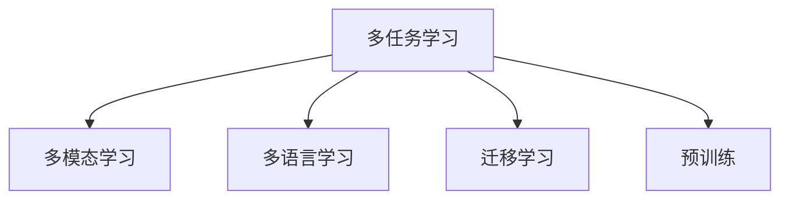

                 

# 多任务学习在NLP中的应用

> 关键词：多任务学习, 多模态学习, 多语言学习, 迁移学习, 预训练, 自然语言处理(NLP)

## 1. 背景介绍

### 1.1 问题由来
近年来，多任务学习（Multitask Learning, MTL）在自然语言处理（NLP）领域得到了广泛的应用。相比于单任务学习（Single Task Learning, STL），MTL能够在处理多个相关任务时，共享数据和特征表示，从而提高模型的泛化能力和性能。多任务学习在语言模型、文本分类、情感分析、信息抽取、机器翻译等任务上都取得了显著的进展。

本博客旨在全面系统地介绍多任务学习在NLP中的应用，包括核心概念、算法原理、操作步骤、数学模型、项目实践、实际应用场景、工具和资源推荐、总结、未来发展趋势与挑战，以及常见问题解答。通过深入讲解，希望能帮助NLP领域的开发者更好地理解和应用多任务学习技术。

## 2. 核心概念与联系

### 2.1 核心概念概述

为更好地理解多任务学习在NLP中的应用，本节将介绍几个密切相关的核心概念：

- 多任务学习（MTL）：指在同一组数据上，同时训练多个相关任务的学习范式。多任务学习通过共享数据和特征表示，提升模型在多个任务上的性能。
- 多模态学习（Multi-modal Learning）：指结合文本、图像、语音等多种数据模态进行学习的范式。多模态学习可以更好地捕捉现实世界的多维信息，提高模型的理解能力和泛化能力。
- 多语言学习（Multilingual Learning）：指在同一组多语言数据上进行多语言模型的训练和迁移学习的范式。多语言学习可以提升模型在跨语言任务上的表现，促进跨语言理解和翻译。
- 迁移学习（Transfer Learning）：指将一个领域学习到的知识，迁移应用到另一个不同但相关的领域的学习范式。多任务学习本身就是一种迁移学习的方式，可以在多个相关任务间进行知识共享和迁移。
- 预训练（Pre-training）：指在大规模无标签文本语料上进行自监督学习任务训练通用语言模型的过程。多任务预训练可以同时训练多个相关任务的预训练模型，从而获得更通用的语言表示。

这些核心概念之间的逻辑关系可以通过以下Mermaid流程图来展示：



这个流程图展示了我MTL、多模态学习、多语言学习、迁移学习和预训练之间的关联：

1. 多任务学习通过共享数据和特征表示，提升模型在多个任务上的性能。
2. 多模态学习可以结合多种数据模态，更好地捕捉现实世界的多维信息。
3. 多语言学习可以在跨语言任务上进行知识共享和迁移。
4. 迁移学习是将一个领域学习到的知识应用到另一个相关领域的学习方式。
5. 预训练是在大规模无标签文本语料上进行自监督学习任务训练通用语言模型的过程。

## 3. 核心算法原理 & 具体操作步骤

### 3.1 算法原理概述

多任务学习在NLP中的应用，本质上是一种有监督的细粒度迁移学习过程。其核心思想是：将预训练的大语言模型视作一个强大的"特征提取器"，通过同时训练多个相关任务，共享数据和特征表示，从而提升模型在多个任务上的性能。

形式化地，假设预训练模型为 $M_{\theta}$，其中 $\theta$ 为预训练得到的模型参数。给定多个下游任务 $T=\{T_1, T_2, ..., T_k\}$ 的标注数据集 $\{D_i=\{(x_i, y_i)\}_{i=1}^N\}_{i=1}^k$，多任务学习的优化目标是最小化所有任务的经验风险，即：

$$
\theta^* = \mathop{\arg\min}_{\theta} \sum_{i=1}^k \mathcal{L}_i(M_{\theta},D_i)
$$

其中 $\mathcal{L}_i$ 为第 $i$ 个任务的损失函数，用于衡量模型预测输出与真实标签之间的差异。常见的损失函数包括交叉熵损失、均方误差损失等。

通过梯度下降等优化算法，多任务学习过程不断更新模型参数 $\theta$，最小化总损失函数 $\sum_{i=1}^k \mathcal{L}_i$，使得模型输出逼近真实标签。由于 $\theta$ 已经通过预训练获得了较好的初始化，因此即便在多个小规模数据集上同时进行训练，也能较快收敛到理想的模型参数 $\theta^*$。

### 3.2 算法步骤详解

多任务学习在NLP中的应用，一般包括以下几个关键步骤：

**Step 1: 准备预训练模型和数据集**
- 选择合适的预训练语言模型 $M_{\theta}$ 作为初始化参数，如 BERT、GPT 等。
- 准备多个下游任务 $T=\{T_1, T_2, ..., T_k\}$ 的标注数据集 $\{D_i=\{(x_i, y_i)\}_{i=1}^N\}_{i=1}^k$，划分为训练集、验证集和测试集。

**Step 2: 添加任务适配层**
- 根据任务类型，在预训练模型顶层设计合适的输出层和损失函数。
- 对于分类任务，通常在顶层添加线性分类器和交叉熵损失函数。
- 对于生成任务，通常使用语言模型的解码器输出概率分布，并以负对数似然为损失函数。

**Step 3: 设置多任务学习超参数**
- 选择合适的优化算法及其参数，如 AdamW、SGD 等，设置学习率、批大小、迭代轮数等。
- 设置正则化技术及强度，包括权重衰减、Dropout、Early Stopping等。
- 确定冻结预训练参数的策略，如仅微调顶层，或全部参数都参与微调。

**Step 4: 执行梯度训练**
- 将训练集数据分批次输入模型，前向传播计算损失函数。
- 反向传播计算参数梯度，根据设定的优化算法和学习率更新模型参数。
- 周期性在验证集上评估模型性能，根据性能指标决定是否触发 Early Stopping。
- 重复上述步骤直到满足预设的迭代轮数或 Early Stopping 条件。

**Step 5: 测试和部署**
- 在测试集上评估多任务学习后的模型 $M_{\theta}$ 的性能，对比多任务学习和单任务学习的精度提升。
- 使用多任务学习后的模型对新样本进行推理预测，集成到实际的应用系统中。
- 持续收集新的数据，定期重新训练和微调模型，以适应数据分布的变化。

以上是多任务学习在NLP中的应用的一般流程。在实际应用中，还需要针对具体任务的特点，对多任务学习过程的各个环节进行优化设计，如改进训练目标函数，引入更多的正则化技术，搜索最优的超参数组合等，以进一步提升模型性能。

### 3.3 算法优缺点

多任务学习在NLP中的应用具有以下优点：
1. 共享数据和特征表示：通过共享数据和特征表示，多任务学习可以更好地捕捉数据之间的潜在关系，提升模型泛化能力。
2. 提高资源利用率：相比于单任务学习，多任务学习可以在有限的标注数据上，同时提升多个任务的表现，提高资源利用效率。
3. 增强模型鲁棒性：多任务学习通过在多个相关任务上进行联合训练，可以提升模型的鲁棒性和泛化能力，降低过拟合风险。
4. 促进跨领域迁移：多任务学习可以提升模型在不同领域之间的迁移能力，促进知识共享和跨领域应用。

同时，多任务学习也存在一定的局限性：
1. 任务间可能存在负迁移：如果任务间存在较大差异，多任务学习可能产生负迁移现象，降低模型性能。
2. 任务优先级难以平衡：多任务学习中任务之间的优先级分配可能会影响模型性能，需要合理设置。
3. 过拟合风险增加：多任务学习需要在多个任务上进行联合训练，容易产生过拟合现象，需要引入更多正则化技术。
4. 计算成本较高：多任务学习通常需要更长的训练时间，计算资源消耗较大。

尽管存在这些局限性，但就目前而言，多任务学习在NLP中依然是最主流范式之一。未来相关研究的重点在于如何进一步降低多任务学习对标注数据的依赖，提高模型的少样本学习和跨领域迁移能力，同时兼顾可解释性和伦理安全性等因素。

### 3.4 算法应用领域

多任务学习在NLP领域已经得到了广泛的应用，覆盖了几乎所有常见任务，例如：

- 文本分类：如情感分析、主题分类、意图识别等。通过多任务学习使模型学习文本-标签映射，同时提升对多个主题的分类能力。
- 命名实体识别：识别文本中的人名、地名、机构名等特定实体。通过多任务学习使模型掌握实体边界和类型，同时提升对多个实体类型的识别能力。
- 关系抽取：从文本中抽取实体之间的语义关系。通过多任务学习使模型学习实体-关系三元组，同时提升对多个关系类型的抽取能力。
- 问答系统：对自然语言问题给出答案。将问题-答案对作为多任务学习数据，训练模型学习匹配答案，同时提升对多种问题类型的回答能力。
- 机器翻译：将源语言文本翻译成目标语言。通过多任务学习使模型学习语言-语言映射，同时提升对多种语言对的翻译能力。
- 文本摘要：将长文本压缩成简短摘要。通过多任务学习使模型学习抓取要点，同时提升对多种摘要风格的生成能力。
- 对话系统：使机器能够与人自然对话。通过多任务学习使模型学习多轮对话历史，同时提升对多种对话类型的回复能力。

除了上述这些经典任务外，多任务学习还被创新性地应用到更多场景中，如可控文本生成、常识推理、代码生成、数据增强等，为NLP技术带来了全新的突破。随着预训练模型和多任务学习方法的不断进步，相信NLP技术将在更广阔的应用领域大放异彩。

## 4. 数学模型和公式 & 详细讲解 & 举例说明

### 4.1 数学模型构建

本节将使用数学语言对多任务学习在NLP中的应用进行更加严格的刻画。

记预训练语言模型为 $M_{\theta}$，其中 $\theta$ 为模型参数。假设多任务学习的任务数为 $k$，每个任务的训练集为 $D_i=\{(x_i, y_i)\}_{i=1}^N$，训练集中每个样本的输入为 $x_i$，输出为 $y_i$。

定义模型 $M_{\theta}$ 在输入 $x$ 上的输出为 $M_{\theta}(x)$，则多任务学习的目标函数为：

$$
\mathcal{L}(\theta) = \sum_{i=1}^k \mathcal{L}_i(M_{\theta}(x_i),y_i)
$$

其中 $\mathcal{L}_i$ 为第 $i$ 个任务的损失函数。例如，对于二分类任务，可以使用交叉熵损失函数：

$$
\mathcal{L}_i(M_{\theta}(x_i),y_i) = -[y_i\log M_{\theta}(x_i)+(1-y_i)\log (1-M_{\theta}(x_i))]
$$

### 4.2 公式推导过程

以多任务二分类任务为例，推导多任务学习的损失函数及其梯度计算公式。

假设模型 $M_{\theta}$ 在输入 $x_i$ 上的输出为 $\hat{y}_i=M_{\theta}(x_i) \in [0,1]$，表示样本属于正类的概率。真实标签 $y_i \in \{0,1\}$。则二分类交叉熵损失函数定义为：

$$
\mathcal{L}_i(M_{\theta}(x_i),y_i) = -[y_i\log \hat{y}_i + (1-y_i)\log (1-\hat{y}_i)]
$$

将其代入总目标函数，得：

$$
\mathcal{L}(\theta) = -\sum_{i=1}^k [y_i\log M_{\theta}(x_i)+(1-y_i)\log(1-M_{\theta}(x_i))]
$$

根据链式法则，目标函数对参数 $\theta_k$ 的梯度为：

$$
\frac{\partial \mathcal{L}(\theta)}{\partial \theta_k} = -\sum_{i=1}^k (\frac{y_i}{M_{\theta}(x_i)}-\frac{1-y_i}{1-M_{\theta}(x_i)}) \frac{\partial M_{\theta}(x_i)}{\partial \theta_k}
$$

其中 $\frac{\partial M_{\theta}(x_i)}{\partial \theta_k}$ 可进一步递归展开，利用自动微分技术完成计算。

在得到目标函数的梯度后，即可带入参数更新公式，完成模型的迭代优化。重复上述过程直至收敛，最终得到适应多任务学习后的最优模型参数 $\theta^*$。

## 5. 项目实践：代码实例和详细解释说明

### 5.1 开发环境搭建

在进行多任务学习实践前，我们需要准备好开发环境。以下是使用Python进行PyTorch开发的环境配置流程：

1. 安装Anaconda：从官网下载并安装Anaconda，用于创建独立的Python环境。

2. 创建并激活虚拟环境：
```bash
conda create -n pytorch-env python=3.8 
conda activate pytorch-env
```

3. 安装PyTorch：根据CUDA版本，从官网获取对应的安装命令。例如：
```bash
conda install pytorch torchvision torchaudio cudatoolkit=11.1 -c pytorch -c conda-forge
```

4. 安装Transformers库：
```bash
pip install transformers
```

5. 安装各类工具包：
```bash
pip install numpy pandas scikit-learn matplotlib tqdm jupyter notebook ipython
```

完成上述步骤后，即可在`pytorch-env`环境中开始多任务学习实践。

### 5.2 源代码详细实现

下面我们以多任务分类任务为例，给出使用Transformers库对BERT模型进行多任务学习的PyTorch代码实现。

首先，定义多任务分类任务的数据处理函数：

```python
from transformers import BertTokenizer
from torch.utils.data import Dataset
import torch

class MultiClassificationDataset(Dataset):
    def __init__(self, texts, labels, tokenizer, max_len=128):
        self.texts = texts
        self.labels = labels
        self.tokenizer = tokenizer
        self.max_len = max_len
        
    def __len__(self):
        return len(self.texts)
    
    def __getitem__(self, item):
        text = self.texts[item]
        label = self.labels[item]
        
        encoding = self.tokenizer(text, return_tensors='pt', max_length=self.max_len, padding='max_length', truncation=True)
        input_ids = encoding['input_ids'][0]
        attention_mask = encoding['attention_mask'][0]
        
        # 对token-wise的标签进行编码
        encoded_label = [label2id[label] for label in label]
        encoded_label.extend([label2id['O']] * (self.max_len - len(encoded_label)))
        labels = torch.tensor(encoded_label, dtype=torch.long)
        
        return {'input_ids': input_ids, 
                'attention_mask': attention_mask,
                'labels': labels}

# 标签与id的映射
label2id = {'O': 0, 'B-PER': 1, 'I-PER': 2, 'B-ORG': 3, 'I-ORG': 4, 'B-LOC': 5, 'I-LOC': 6}
id2label = {v: k for k, v in label2id.items()}

# 创建dataset
tokenizer = BertTokenizer.from_pretrained('bert-base-cased')

train_dataset = MultiClassificationDataset(train_texts, train_labels, tokenizer)
dev_dataset = MultiClassificationDataset(dev_texts, dev_labels, tokenizer)
test_dataset = MultiClassificationDataset(test_texts, test_labels, tokenizer)
```

然后，定义模型和优化器：

```python
from transformers import BertForTokenClassification, AdamW

model = BertForTokenClassification.from_pretrained('bert-base-cased', num_labels=len(label2id))

optimizer = AdamW(model.parameters(), lr=2e-5)
```

接着，定义训练和评估函数：

```python
from torch.utils.data import DataLoader
from tqdm import tqdm
from sklearn.metrics import classification_report

device = torch.device('cuda') if torch.cuda.is_available() else torch.device('cpu')
model.to(device)

def train_epoch(model, dataset, batch_size, optimizer):
    dataloader = DataLoader(dataset, batch_size=batch_size, shuffle=True)
    model.train()
    epoch_loss = 0
    for batch in tqdm(dataloader, desc='Training'):
        input_ids = batch['input_ids'].to(device)
        attention_mask = batch['attention_mask'].to(device)
        labels = batch['labels'].to(device)
        model.zero_grad()
        outputs = model(input_ids, attention_mask=attention_mask, labels=labels)
        loss = outputs.loss
        epoch_loss += loss.item()
        loss.backward()
        optimizer.step()
    return epoch_loss / len(dataloader)

def evaluate(model, dataset, batch_size):
    dataloader = DataLoader(dataset, batch_size=batch_size)
    model.eval()
    preds, labels = [], []
    with torch.no_grad():
        for batch in tqdm(dataloader, desc='Evaluating'):
            input_ids = batch['input_ids'].to(device)
            attention_mask = batch['attention_mask'].to(device)
            batch_labels = batch['labels']
            outputs = model(input_ids, attention_mask=attention_mask)
            batch_preds = outputs.logits.argmax(dim=2).to('cpu').tolist()
            batch_labels = batch_labels.to('cpu').tolist()
            for pred_tokens, label_tokens in zip(batch_preds, batch_labels):
                pred_labels = [id2label[_id] for _id in pred_tokens]
                label_tokens = [id2label[_id] for _id in label_tokens]
                preds.append(pred_labels[:len(label_tokens)])
                labels.append(label_tokens)
                
    print(classification_report(labels, preds))
```

最后，启动训练流程并在测试集上评估：

```python
epochs = 5
batch_size = 16

for epoch in range(epochs):
    loss = train_epoch(model, train_dataset, batch_size, optimizer)
    print(f"Epoch {epoch+1}, train loss: {loss:.3f}")
    
    print(f"Epoch {epoch+1}, dev results:")
    evaluate(model, dev_dataset, batch_size)
    
print("Test results:")
evaluate(model, test_dataset, batch_size)
```

以上就是使用PyTorch对BERT进行多任务分类的完整代码实现。可以看到，得益于Transformers库的强大封装，我们可以用相对简洁的代码完成BERT模型的加载和微调。

### 5.3 代码解读与分析

让我们再详细解读一下关键代码的实现细节：

**MultiClassificationDataset类**：
- `__init__`方法：初始化文本、标签、分词器等关键组件。
- `__len__`方法：返回数据集的样本数量。
- `__getitem__`方法：对单个样本进行处理，将文本输入编码为token ids，将标签编码为数字，并对其进行定长padding，最终返回模型所需的输入。

**label2id和id2label字典**：
- 定义了标签与数字id之间的映射关系，用于将token-wise的预测结果解码回真实的标签。

**训练和评估函数**：
- 使用PyTorch的DataLoader对数据集进行批次化加载，供模型训练和推理使用。
- 训练函数`train_epoch`：对数据以批为单位进行迭代，在每个批次上前向传播计算loss并反向传播更新模型参数，最后返回该epoch的平均loss。
- 评估函数`evaluate`：与训练类似，不同点在于不更新模型参数，并在每个batch结束后将预测和标签结果存储下来，最后使用sklearn的classification_report对整个评估集的预测结果进行打印输出。

**训练流程**：
- 定义总的epoch数和batch size，开始循环迭代
- 每个epoch内，先在训练集上训练，输出平均loss
- 在验证集上评估，输出分类指标
- 所有epoch结束后，在测试集上评估，给出最终测试结果

可以看到，PyTorch配合Transformers库使得BERT多任务分类的代码实现变得简洁高效。开发者可以将更多精力放在数据处理、模型改进等高层逻辑上，而不必过多关注底层的实现细节。

当然，工业级的系统实现还需考虑更多因素，如模型的保存和部署、超参数的自动搜索、更灵活的任务适配层等。但核心的多任务学习范式基本与此类似。

## 6. 实际应用场景
### 6.1 智能客服系统

基于多任务学习的大语言模型，可以广泛应用于智能客服系统的构建。传统客服往往需要配备大量人力，高峰期响应缓慢，且一致性和专业性难以保证。而使用多任务学习的大语言模型，可以7x24小时不间断服务，快速响应客户咨询，用自然流畅的语言解答各类常见问题。

在技术实现上，可以收集企业内部的历史客服对话记录，将问题和最佳答复构建成监督数据，在此基础上对预训练对话模型进行多任务学习。多任务学习后的模型能够自动理解用户意图，匹配最合适的答案模板进行回复。对于客户提出的新问题，还可以接入检索系统实时搜索相关内容，动态组织生成回答。如此构建的智能客服系统，能大幅提升客户咨询体验和问题解决效率。

### 6.2 金融舆情监测

金融机构需要实时监测市场舆论动向，以便及时应对负面信息传播，规避金融风险。传统的人工监测方式成本高、效率低，难以应对网络时代海量信息爆发的挑战。基于多任务学习的大语言模型，可以为金融舆情监测提供新的解决方案。

具体而言，可以收集金融领域相关的新闻、报道、评论等文本数据，并对其进行主题标注和情感标注。在此基础上对预训练语言模型进行多任务学习，使其能够自动判断文本属于何种主题，情感倾向是正面、中性还是负面。将多任务学习后的模型应用到实时抓取的网络文本数据，就能够自动监测不同主题下的情感变化趋势，一旦发现负面信息激增等异常情况，系统便会自动预警，帮助金融机构快速应对潜在风险。

### 6.3 个性化推荐系统

当前的推荐系统往往只依赖用户的历史行为数据进行物品推荐，无法深入理解用户的真实兴趣偏好。基于多任务学习的大语言模型，可以更好地挖掘用户行为背后的语义信息，从而提供更精准、多样的推荐内容。

在实践中，可以收集用户浏览、点击、评论、分享等行为数据，提取和用户交互的物品标题、描述、标签等文本内容。将文本内容作为模型输入，用户的后续行为（如是否点击、购买等）作为监督信号，在此基础上进行多任务学习。多任务学习后的模型能够从文本内容中准确把握用户的兴趣点。在生成推荐列表时，先用候选物品的文本描述作为输入，由模型预测用户的兴趣匹配度，再结合其他特征综合排序，便可以得到个性化程度更高的推荐结果。

### 6.4 未来应用展望

随着多任务学习和大语言模型技术的不断发展，基于多任务学习的方法将在更多领域得到应用，为传统行业带来变革性影响。

在智慧医疗领域，基于多任务学习的大语言模型，可以提升医疗问答、病历分析、药物研发等任务的表现，辅助医生诊疗，加速新药开发进程。

在智能教育领域，多任务学习的大语言模型，可以应用于作业批改、学情分析、知识推荐等方面，因材施教，促进教育公平，提高教学质量。

在智慧城市治理中，多任务学习的大语言模型，可以应用于城市事件监测、舆情分析、应急指挥等环节，提高城市管理的自动化和智能化水平，构建更安全、高效的未来城市。

此外，在企业生产、社会治理、文娱传媒等众多领域，基于多任务学习的大语言模型，将不断涌现，为各行各业带来新的技术路径和创新应用。相信随着技术的日益成熟，多任务学习技术将成为人工智能落地应用的重要范式，推动人工智能技术在各垂直行业的大规模应用。

## 7. 工具和资源推荐
### 7.1 学习资源推荐

为了帮助开发者系统掌握多任务学习在NLP中的应用，这里推荐一些优质的学习资源：

1. 《Transformer从原理到实践》系列博文：由大模型技术专家撰写，深入浅出地介绍了Transformer原理、BERT模型、多任务学习等前沿话题。

2. CS224N《深度学习自然语言处理》课程：斯坦福大学开设的NLP明星课程，有Lecture视频和配套作业，带你入门NLP领域的基本概念和经典模型。

3. 《Natural Language Processing with Transformers》书籍：Transformers库的作者所著，全面介绍了如何使用Transformers库进行NLP任务开发，包括多任务学习的相关技术。

4. HuggingFace官方文档：Transformers库的官方文档，提供了海量预训练模型和多任务学习样例代码，是上手实践的必备资料。

5. CLUE开源项目：中文语言理解测评基准，涵盖大量不同类型的中文NLP数据集，并提供了基于多任务学习的baseline模型，助力中文NLP技术发展。

通过对这些资源的学习实践，相信你一定能够快速掌握多任务学习在NLP中的应用精髓，并用于解决实际的NLP问题。
###  7.2 开发工具推荐

高效的开发离不开优秀的工具支持。以下是几款用于多任务学习开发的常用工具：

1. PyTorch：基于Python的开源深度学习框架，灵活动态的计算图，适合快速迭代研究。大部分预训练语言模型都有PyTorch版本的实现。

2. TensorFlow：由Google主导开发的开源深度学习框架，生产部署方便，适合大规模工程应用。同样有丰富的预训练语言模型资源。

3. Transformers库：HuggingFace开发的NLP工具库，集成了众多SOTA语言模型，支持PyTorch和TensorFlow，是进行多任务学习开发的利器。

4. Weights & Biases：模型训练的实验跟踪工具，可以记录和可视化模型训练过程中的各项指标，方便对比和调优。与主流深度学习框架无缝集成。

5. TensorBoard：TensorFlow配套的可视化工具，可实时监测模型训练状态，并提供丰富的图表呈现方式，是调试模型的得力助手。

6. Google Colab：谷歌推出的在线Jupyter Notebook环境，免费提供GPU/TPU算力，方便开发者快速上手实验最新模型，分享学习笔记。

合理利用这些工具，可以显著提升多任务学习任务的开发效率，加快创新迭代的步伐。

### 7.3 相关论文推荐

多任务学习在NLP领域的发展源于学界的持续研究。以下是几篇奠基性的相关论文，推荐阅读：

1. Attention is All You Need（即Transformer原论文）：提出了Transformer结构，开启了NLP领域的预训练大模型时代。

2. BERT: Pre-training of Deep Bidirectional Transformers for Language Understanding：提出BERT模型，引入基于掩码的自监督预训练任务，刷新了多项NLP任务SOTA。

3. Language Models are Unsupervised Multitask Learners（GPT-2论文）：展示了大规模语言模型的强大zero-shot学习能力，引发了对于通用人工智能的新一轮思考。

4. Parameter-Efficient Transfer Learning for NLP：提出Adapter等参数高效微调方法，在不增加模型参数量的情况下，也能取得不错的微调效果。

5. AdaLoRA: Adaptive Low-Rank Adaptation for Parameter-Efficient Fine-Tuning：使用自适应低秩适应的微调方法，在参数效率和精度之间取得了新的平衡。

6. Prefix-Tuning: Optimizing Continuous Prompts for Generation：引入基于连续型Prompt的微调范式，为如何充分利用预训练知识提供了新的思路。

这些论文代表了大语言模型多任务学习的发展脉络。通过学习这些前沿成果，可以帮助研究者把握学科前进方向，激发更多的创新灵感。

## 8. 总结：未来发展趋势与挑战

### 8.1 总结

本文对多任务学习在NLP中的应用进行了全面系统的介绍。首先阐述了多任务学习在NLP领域的背景和意义，明确了多任务学习在处理多个相关任务时的独特优势。其次，从原理到实践，详细讲解了多任务学习的数学原理和关键步骤，给出了多任务学习任务开发的完整代码实例。同时，本文还广泛探讨了多任务学习在智能客服、金融舆情、个性化推荐等多个行业领域的应用前景，展示了多任务学习范式的巨大潜力。此外，本文精选了多任务学习的各类学习资源，力求为读者提供全方位的技术指引。

通过本文的系统梳理，可以看到，多任务学习在NLP中已经取得了显著的进展，在多个相关任务上实现了性能提升。未来，随着多任务学习技术的不断成熟和深入研究，它将在更广泛的应用场景中发挥重要作用，推动NLP技术的进一步发展。

### 8.2 未来发展趋势

展望未来，多任务学习在NLP中的应用将呈现以下几个发展趋势：

1. 模型规模持续增大。随着算力成本的下降和数据规模的扩张，预训练语言模型的参数量还将持续增长。超大模型可以更好地捕捉多任务之间的潜在关系，提升模型泛化能力。

2. 多模态学习崛起。多模态学习可以结合文本、图像、语音等多种数据模态进行学习，更好地捕捉现实世界的多维信息，提升模型的理解和泛化能力。

3. 跨领域迁移增强。多任务学习可以在跨领域任务上进行知识迁移，促进不同领域之间的应用。未来将涌现更多跨领域多任务学习的应用，提升跨领域任务的性能。

4. 自监督学习增强。自监督学习可以充分利用未标注数据进行预训练，提升模型的泛化能力和鲁棒性。未来将更多地结合自监督学习进行多任务学习，提高模型性能。

5. 多语言学习扩展。多语言学习可以提升模型在跨语言任务上的表现，促进跨语言理解和翻译。未来将更多地结合多语言学习进行多任务学习，提升多语言任务的性能。

6. 对抗训练提升。对抗训练可以提升模型的鲁棒性和泛化能力，减少过拟合风险。未来将更多地结合对抗训练进行多任务学习，提高模型性能。

以上趋势凸显了多任务学习在NLP中的广阔前景。这些方向的探索发展，必将进一步提升多任务学习的性能和应用范围，为NLP技术带来更多的创新突破。

### 8.3 面临的挑战

尽管多任务学习在NLP中已经取得了显著进展，但在迈向更加智能化、普适化应用的过程中，它仍面临着诸多挑战：

1. 任务间关系复杂。不同任务之间的依赖关系可能不同，如何合理分配任务优先级，平衡任务间关系，仍是一个难题。

2. 任务冲突问题。当任务间存在矛盾时，如何选择合适的损失函数和目标函数，优化任务之间的协作，仍需要进一步探索。

3. 过拟合风险增加。多任务学习需要在多个任务上进行联合训练，容易产生过拟合现象，需要引入更多正则化技术。

4. 计算成本较高。多任务学习通常需要更长的训练时间，计算资源消耗较大。如何在提高性能的同时，降低计算成本，仍是一个挑战。

尽管存在这些挑战，但多任务学习在NLP中的巨大潜力不容忽视。未来相关研究的重点在于如何进一步降低多任务学习对标注数据的依赖，提高模型的少样本学习和跨领域迁移能力，同时兼顾可解释性和伦理安全性等因素。

### 8.4 研究展望

面对多任务学习在NLP中面临的挑战，未来的研究需要在以下几个方面寻求新的突破：

1. 探索无监督和半监督多任务学习方法。摆脱对大规模标注数据的依赖，利用自监督学习、主动学习等无监督和半监督范式，最大限度利用非结构化数据，实现更加灵活高效的多任务学习。

2. 研究多模态多任务学习技术。开发更多结合多模态数据的多任务学习技术，提升模型的多维理解能力。

3. 探索多语言多任务学习技术。开发更多结合多语言数据的多任务学习技术，提升模型的跨语言理解能力。

4. 引入因果推断和对比学习思想。通过引入因果推断和对比学习方法，增强多任务学习模型的稳定性，提高模型的泛化能力。

5. 结合知识图谱和逻辑推理。将符号化的先验知识与神经网络模型进行融合，引导多任务学习过程学习更准确、合理的语言表示。

6. 纳入伦理道德约束。在多任务学习模型的训练过程中，纳入伦理道德约束，避免有害信息的传播，确保模型的输出符合人类价值观和伦理道德。

这些研究方向的探索，必将引领多任务学习在NLP中走向更加成熟和实用的方向，为构建安全、可靠、可解释、可控的智能系统铺平道路。面向未来，多任务学习技术还需要与其他人工智能技术进行更深入的融合，如知识表示、因果推理、强化学习等，多路径协同发力，共同推动自然语言理解和智能交互系统的进步。只有勇于创新、敢于突破，才能不断拓展多任务学习的边界，让智能技术更好地造福人类社会。

## 9. 附录：常见问题与解答

**Q1：多任务学习是否适用于所有NLP任务？**

A: 多任务学习在大多数NLP任务上都能取得不错的效果，特别是对于数据量较小的任务。但对于一些特定领域的任务，如医学、法律等，仅依靠通用语料预训练的模型可能难以很好地适应。此时需要在特定领域语料上进一步预训练，再进行多任务学习。此外，对于一些需要时效性、个性化很强的任务，如对话、推荐等，多任务学习方法也需要针对性的改进优化。

**Q2：多任务学习中如何选择合适的损失函数？**

A: 多任务学习的损失函数需要根据具体任务进行调整。常见的损失函数包括交叉熵损失、均方误差损失、Focal Loss等。如果不同任务之间存在矛盾，可以使用加权损失函数，平衡不同任务的重要性。例如，对于情感分析和实体识别，可以使用交叉熵损失函数，对于问答系统，可以使用BLEU或ROUGE等自动评估指标。

**Q3：多任务学习中如何平衡任务之间的关系？**

A: 多任务学习中任务之间的关系需要根据具体任务进行调整。常见的平衡策略包括：
1. 加权损失函数：对不同任务设置不同的权重，平衡不同任务的重要性。
2. 并行训练：不同任务在同一批次上进行训练，实现任务间的协作。
3. 联合优化：不同任务的梯度进行联合优化，实现任务间的融合。

这些策略需要根据具体任务进行调整，找到最优的平衡方案。

**Q4：多任务学习中如何避免过拟合？**

A: 多任务学习中避免过拟合的策略包括：
1. 数据增强：通过回译、近义替换等方式扩充训练集，提高数据多样性。
2. 正则化：使用L2正则、Dropout、Early Stopping等正则化技术，防止模型过度适应小规模训练集。
3. 对抗训练：引入对抗样本，提高模型鲁棒性。
4. 参数高效微调：只调整少量模型参数，固定大部分预训练权重不变，以提高微调效率，避免过拟合。

这些策略需要根据具体任务进行调整，找到最优的避免过拟合方案。

**Q5：多任务学习在部署时需要注意哪些问题？**

A: 将多任务学习模型转化为实际应用，还需要考虑以下问题：
1. 模型裁剪：去除不必要的层和参数，减小模型尺寸，加快推理速度。
2. 量化加速：将浮点模型转为定点模型，压缩存储空间，提高计算效率。
3. 服务化封装：将模型封装为标准化服务接口，便于集成调用。
4. 弹性伸缩：根据请求流量动态调整资源配置，平衡服务质量和成本。
5. 监控告警：实时采集系统指标，设置异常告警阈值，确保服务稳定性。
6. 安全防护：采用访问鉴权、数据脱敏等措施，保障数据和模型安全。

多任务学习需要开发者根据具体任务，不断迭代和优化模型、数据和算法，方能得到理想的效果。

---

作者：禅与计算机程序设计艺术 / Zen and the Art of Computer Programming

