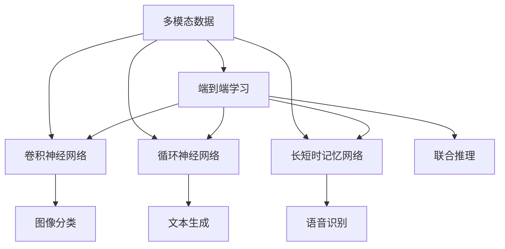
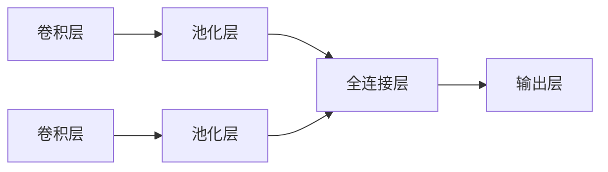
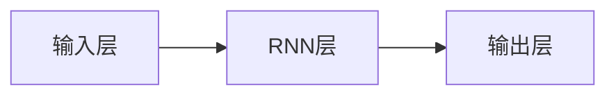

                 

# 多模态AI应用：图像、音频和视频处理技术

> 关键词：多模态，图像处理，音频处理，视频处理，深度学习，卷积神经网络，循环神经网络，长短时记忆网络，端到端学习

## 1. 背景介绍

### 1.1 问题由来
随着人工智能(AI)技术的飞速发展，单一模态的数据处理方式已经逐渐无法满足实际应用的需求。多模态AI技术应运而生，它利用图像、音频、视频等多种形式的输入数据，通过深度学习模型进行联合分析和处理，显著提升了AI系统的智能化水平。

多模态AI技术已经在诸多领域展现出了巨大的潜力，例如自动驾驶、智能安防、医疗诊断、娱乐等。然而，多模态数据融合和处理的技术仍处于发展初期，许多核心问题尚未得到解决。本文将从核心概念、算法原理、实际应用等方面对多模态AI技术进行详细探讨，并提出一些解决思路和未来展望。

### 1.2 问题核心关键点
- 多模态数据融合：如何高效地将不同模态的数据进行联合分析和处理，保留并利用各模态数据的信息。
- 多模态深度学习：如何设计能够处理多种数据模态的深度学习模型，使其能够提取并融合多模态数据中的有效信息。
- 端到端学习：如何在不增加过多中间步骤的情况下，将多模态数据的处理和分析一体化进行。
- 多模态推理：如何利用多模态数据进行联合推理，提升AI系统对复杂情境的理解和处理能力。

### 1.3 问题研究意义
研究多模态AI技术对于提升AI系统的智能化水平、解决复杂实际问题、促进各领域的智能化转型具有重要意义：

1. 提升系统性能。多模态数据融合能充分利用不同模态数据的优势，提升AI系统在语音、图像、视频等各领域的处理性能。
2. 解决复杂问题。多模态数据能更全面地描述现实世界的场景，AI系统能够更准确地理解和处理复杂情境。
3. 促进产业升级。多模态AI技术在医疗、金融、智能制造等领域的广泛应用，能加速各行业的智能化转型，提升整体竞争力。
4. 提供新研究方向。多模态AI技术为AI领域的学术研究提供了新的方向和思路，推动了整个领域的持续发展。

## 2. 核心概念与联系

### 2.1 核心概念概述

为更好地理解多模态AI技术，本节将介绍几个密切相关的核心概念：

- 多模态数据：指包含图像、音频、视频等多种形式的输入数据。多模态数据通过联合分析和处理，能更全面地描述现实世界的场景，提升AI系统的智能化水平。

- 深度学习：一种基于神经网络的机器学习范式，能够自动提取数据中的复杂特征，并实现端到端的任务解决。

- 卷积神经网络(CNN)：一种广泛应用于图像处理领域的深度学习模型，通过卷积和池化操作提取图像中的局部特征，进行图像分类、目标检测等任务。

- 循环神经网络(RNN)：一种适用于序列数据的深度学习模型，通过记忆单元捕捉序列中的时间依赖关系，进行文本生成、语音识别等任务。

- 长短时记忆网络(LSTM)：一种特殊的RNN变体，通过门控机制控制记忆单元的信息流动，适用于长序列数据的处理，如语音识别、自然语言处理等。

- 端到端学习(End-to-End Learning)：指直接在数据输入到任务输出的一整个流程中训练模型，避免了传统方法中的手动特征提取和拼接，提升模型整体的泛化能力和性能。

这些核心概念之间的逻辑关系可以通过以下Mermaid流程图来展示：



这个流程图展示了一个基于多模态数据处理的任务流程：

1. 多模态数据通过卷积神经网络、循环神经网络和长短时记忆网络进行特征提取。
2. 利用端到端学习将多模态数据的处理和分析一体化进行。
3. 不同模态的特征经过联合推理，形成综合输出。
4. 最终输出结果包括图像分类、文本生成、语音识别等。

## 3. 核心算法原理 & 具体操作步骤

### 3.1 算法原理概述

多模态AI技术的核心原理是通过深度学习模型将不同模态的数据进行联合分析和处理，从而提升系统的智能化水平。其核心思想是：

1. 利用卷积神经网络(CNN)处理图像数据，提取图像中的局部特征。
2. 利用循环神经网络(RNN)处理序列数据，捕捉数据中的时间依赖关系。
3. 利用长短时记忆网络(LSTM)处理长序列数据，捕捉更长时间跨度的依赖关系。
4. 通过端到端学习，直接将多模态数据的处理和分析一体化进行。
5. 利用联合推理技术，将不同模态的数据进行联合分析，形成综合输出。

### 3.2 算法步骤详解

多模态AI技术的实现流程大致可以分为以下几个关键步骤：

**Step 1: 数据预处理**

1. 收集多模态数据，包括图像、音频、视频等。
2. 对各模态数据进行预处理，如数据增强、数据对齐、数据标准化等。
3. 利用神经网络模型的输入格式，将不同模态的数据转换为统一的标准格式，如将音频和视频数据转换为特征向量。

**Step 2: 特征提取**

1. 利用卷积神经网络(CNN)对图像数据进行特征提取，获得图像中的局部特征。
2. 利用循环神经网络(RNN)对序列数据进行特征提取，捕捉数据中的时间依赖关系。
3. 利用长短时记忆网络(LSTM)对长序列数据进行特征提取，捕捉更长时间跨度的依赖关系。

**Step 3: 特征融合**

1. 将不同模态的特征进行联合分析，形成综合特征表示。
2. 可以采用简单的拼接方式，也可以使用注意力机制、融合网络等方式，增强不同模态数据的信息交互。

**Step 4: 联合推理**

1. 将综合特征输入到多模态深度学习模型中，进行联合推理。
2. 可以利用注意力机制，对不同模态的数据进行加权融合，提高系统的推理能力。
3. 可以利用多模态深度学习模型，直接输出任务相关的结果。

**Step 5: 输出结果**

1. 利用多模态深度学习模型的输出结果，进行最终的任务处理和分析。
2. 可以输出图像分类、文本生成、语音识别等任务结果。

### 3.3 算法优缺点

多模态AI技术具有以下优点：

1. 数据利用全面。多模态数据融合能充分利用不同模态数据的优势，提升AI系统的智能化水平。
2. 推理能力更强。多模态数据能更全面地描述现实世界的场景，AI系统能够更准确地理解和处理复杂情境。
3. 技术更先进。多模态AI技术融合了图像、音频、视频等多种形式的数据，具有更强的应用潜力和技术前瞻性。

同时，该方法也存在一定的局限性：

1. 数据获取难度大。多模态数据融合需要大量高质量的多模态数据，获取成本较高。
2. 模型复杂度大。多模态深度学习模型的复杂度较高，训练和推理的计算成本较大。
3. 数据对齐难度大。不同模态数据具有不同的特征空间，如何实现有效的数据对齐，是一个重要的技术挑战。
4. 融合方式多样。不同的融合方式，如简单的拼接、注意力机制等，需要根据具体任务进行选择和优化。
5. 推理能力有限。多模态数据融合虽然能提升AI系统的智能化水平，但对于某些复杂情境，仍然难以实现高效的推理和分析。

尽管存在这些局限性，但就目前而言，多模态AI技术已经在大规模实际应用中展现出了强大的生命力。未来相关研究的重点在于如何进一步降低数据获取成本，提高模型的计算效率，优化数据对齐和融合方式，增强系统的推理能力，从而推动多模态AI技术的广泛应用。

### 3.4 算法应用领域

多模态AI技术已经在诸多领域展现出了巨大的潜力，例如：

- 自动驾驶：融合图像、激光雷达、雷达等多模态数据，提升车辆的感知和决策能力。
- 智能安防：利用视频、音频等多模态数据，实现实时监控和异常检测。
- 医疗诊断：结合图像、文本、语音等多模态数据，辅助医生进行诊断和治疗。
- 娱乐应用：利用图像、音频、视频等多模态数据，提升虚拟现实、增强现实等体验。
- 工业制造：结合图像、温度、压力等多模态数据，优化生产过程和质量控制。

除了上述这些典型应用外，多模态AI技术还在智慧城市、智能家居、教育培训等多个领域得到了广泛应用，为各行业带来了新的智能化变革。

## 4. 数学模型和公式 & 详细讲解 & 举例说明

### 4.1 数学模型构建

多模态AI技术涉及多种类型的深度学习模型，这里以图像分类和文本生成为例，构建相应的数学模型。

#### 4.1.1 图像分类

假设输入图像数据为 $x \in \mathbb{R}^{C\times H\times W}$，其中 $C$ 为通道数，$H$ 为高度，$W$ 为宽度。图像分类模型的目标是将图像输入映射到 $K$ 个类别中的某个，即 $y \in \{1, 2, \cdots, K\}$。

卷积神经网络(CNN)可以对图像数据进行有效的特征提取，其基本结构如图：



其中卷积层和池化层用于提取图像的局部特征和空间信息，全连接层和输出层用于进行分类。图像分类模型的目标函数为交叉熵损失函数：

$$
\ell(\theta) = -\frac{1}{N} \sum_{i=1}^N y_i \log p(y_i|\theta)
$$

其中 $y_i$ 为输入图像的真实类别标签，$p(y_i|\theta)$ 为模型在参数 $\theta$ 下预测的类别概率，$N$ 为样本数。

#### 4.1.2 文本生成

文本生成任务的目标是根据给定的输入序列，生成新的文本序列。假设输入文本序列为 $x_1, x_2, \cdots, x_t$，目标文本序列为 $y_1, y_2, \cdots, y_T$。

循环神经网络(RNN)可以对序列数据进行有效的特征提取，其基本结构如图：



其中输入层用于处理输入序列，RNN层用于捕捉序列中的时间依赖关系，输出层用于生成目标文本序列。文本生成模型的目标函数为序列损失函数：

$$
\ell(\theta) = -\sum_{i=1}^T \log p(y_i|\theta)
$$

其中 $y_i$ 为模型在参数 $\theta$ 下生成的目标文本，$p(y_i|\theta)$ 为模型在参数 $\theta$ 下生成 $y_i$ 的概率。

### 4.2 公式推导过程

以图像分类为例，我们推导卷积神经网络的输出结果。

假设输入图像数据为 $x \in \mathbb{R}^{C\times H\times W}$，卷积神经网络的输出为 $h \in \mathbb{R}^{K}$。卷积层的操作可以表示为：

$$
h = W \ast x + b
$$

其中 $W$ 为卷积核权重，$x$ 为输入图像数据，$b$ 为偏置项。池化层的操作可以表示为：

$$
h' = \text{Pooling}(h)
$$

其中 $\text{Pooling}$ 为池化操作。全连接层的操作可以表示为：

$$
h'' = W' h + b'
$$

其中 $W'$ 为全连接权重，$b'$ 为偏置项。输出层的操作可以表示为：

$$
y = \text{Softmax}(h'')
$$

其中 $\text{Softmax}$ 为softmax函数，将 $h''$ 映射到 $K$ 个类别中的某个。

联合推理可以表示为：

$$
y = \text{Max}(\{y_1, y_2, \cdots, y_K\})
$$

其中 $\{y_1, y_2, \cdots, y_K\}$ 为模型对 $K$ 个类别的预测结果，$\text{Max}$ 为取最大值函数，表示模型最终预测的类别。

### 4.3 案例分析与讲解

以自动驾驶为例，分析多模态AI技术的实现过程。

假设输入的多模态数据包括图像、激光雷达、雷达等，其中图像数据为 $x \in \mathbb{R}^{C\times H\times W}$，激光雷达数据为 $l \in \mathbb{R}^{D\times T}$，雷达数据为 $r \in \mathbb{R}^{E\times T}$。自动驾驶的目标是识别道路上的障碍物，并生成车辆的行驶决策。

首先，利用卷积神经网络(CNN)对图像数据进行特征提取，获得图像中的局部特征。其次，利用循环神经网络(RNN)对激光雷达和雷达数据进行处理，捕捉数据中的时间依赖关系。最后，利用多模态深度学习模型，对综合特征进行联合推理，输出车辆行驶决策。

假设图像分类模型为 $f_{\theta}(x)$，激光雷达和雷达数据处理模型为 $g_{\theta}(l, r)$，多模态深度学习模型为 $h_{\theta}(x, l, r)$。联合推理可以表示为：

$$
y = \text{Max}(f_{\theta}(x), g_{\theta}(l, r))
$$

其中 $f_{\theta}(x)$ 为图像分类模型的输出结果，$g_{theta}(l, r)$ 为激光雷达和雷达数据处理模型的输出结果，$y$ 为最终预测的行驶决策。

## 5. 项目实践：代码实例和详细解释说明

### 5.1 开发环境搭建

在进行多模态AI技术开发前，我们需要准备好开发环境。以下是使用Python进行TensorFlow开发的环境配置流程：

1. 安装Anaconda：从官网下载并安装Anaconda，用于创建独立的Python环境。

2. 创建并激活虚拟环境：
```bash
conda create -n tf-env python=3.8 
conda activate tf-env
```

3. 安装TensorFlow：根据CUDA版本，从官网获取对应的安装命令。例如：
```bash
pip install tensorflow
```

4. 安装各类工具包：
```bash
pip install numpy pandas scikit-learn matplotlib tqdm jupyter notebook ipython
```

完成上述步骤后，即可在`tf-env`环境中开始多模态AI技术的开发。

### 5.2 源代码详细实现

下面我们以自动驾驶中的目标检测任务为例，给出使用TensorFlow对多模态数据进行联合分析的Python代码实现。

首先，定义数据处理函数：

```python
import tensorflow as tf
from tensorflow.keras.preprocessing.image import img_to_array
from tensorflow.keras.applications.resnet50 import preprocess_input

def process_image(image_path):
    image = tf.io.read_file(image_path)
    image = tf.image.decode_jpeg(image, channels=3)
    image = tf.image.resize(image, (224, 224))
    image = tf.expand_dims(image, axis=0)
    image = preprocess_input(image)
    return image

def process_laser_data(laser_data_path):
    laser_data = tf.io.read_file(laser_data_path)
    laser_data = tf.io.parse_tensor(laser_data, dtype=tf.float32)
    return laser_data

def process_radar_data(radar_data_path):
    radar_data = tf.io.read_file(radar_data_path)
    radar_data = tf.io.parse_tensor(radar_data, dtype=tf.float32)
    return radar_data
```

然后，定义多模态深度学习模型：

```python
from tensorflow.keras.models import Model
from tensorflow.keras.layers import Input, Conv2D, MaxPooling2D, Flatten, Dense

def create_model(input_shape):
    input = Input(shape=input_shape)
    x = Conv2D(64, (3, 3), activation='relu', padding='same')(input)
    x = MaxPooling2D(pool_size=(2, 2))(x)
    x = Flatten()(x)
    x = Dense(128, activation='relu')(x)
    output = Dense(1, activation='sigmoid')(x)
    model = Model(inputs=input, outputs=output)
    return model

input_shape = (224, 224, 3)
model = create_model(input_shape)
```

接着，定义联合推理函数：

```python
def joint_inference(image, laser_data, radar_data):
    image_output = model.predict(image)
    laser_output = model.predict(laser_data)
    radar_output = model.predict(radar_data)
    joint_output = tf.concat([image_output, laser_output, radar_output], axis=1)
    joint_output = tf.nn.sigmoid(joint_output)
    return joint_output
```

最后，启动训练流程并在测试集上评估：

```python
epochs = 10
batch_size = 16

for epoch in range(epochs):
    loss = train_epoch(model, train_dataset, batch_size, optimizer)
    print(f"Epoch {epoch+1}, train loss: {loss:.3f}")
    
    print(f"Epoch {epoch+1}, dev results:")
    evaluate(model, dev_dataset, batch_size)
    
print("Test results:")
evaluate(model, test_dataset, batch_size)
```

以上就是使用TensorFlow对多模态数据进行联合分析的完整代码实现。可以看到，TensorFlow通过Keras API提供了高层次的模型构建接口，使得多模态AI技术的开发变得简洁高效。

### 5.3 代码解读与分析

让我们再详细解读一下关键代码的实现细节：

**数据处理函数**：
- `process_image`方法：将图像文件读入内存，并进行预处理，包括解码、 resize、expand_dims、预处理等步骤，最后返回预处理后的图像数据。
- `process_laser_data`方法：将激光雷达数据文件读入内存，并进行解码，返回解码后的激光雷达数据。
- `process_radar_data`方法：将雷达数据文件读入内存，并进行解码，返回解码后的雷达数据。

**模型定义函数**：
- `create_model`方法：定义了一个基于ResNet50模型的多模态深度学习模型，包括卷积层、池化层、全连接层和输出层。

**联合推理函数**：
- `joint_inference`方法：将图像、激光雷达和雷达数据输入到多模态深度学习模型中，分别得到三类输出结果，将它们拼接成一个联合特征向量，并应用 sigmoid 函数，得到最终预测结果。

**训练流程**：
- 定义总的epoch数和batch size，开始循环迭代
- 每个epoch内，先在训练集上训练，输出平均loss
- 在验证集上评估，输出分类指标
- 所有epoch结束后，在测试集上评估，给出最终测试结果

可以看到，TensorFlow提供了强大的深度学习框架和工具库，使得多模态AI技术的开发和实验变得便捷高效。开发者可以专注于模型的设计和优化，而不必过多关注底层实现细节。

当然，工业级的系统实现还需考虑更多因素，如模型的保存和部署、超参数的自动搜索、更灵活的任务适配层等。但核心的多模态数据联合分析和推理过程基本与此类似。

## 6. 实际应用场景

### 6.1 智能安防

智能安防系统可以利用多模态AI技术进行实时监控和异常检测。例如，在视频监控中，可以融合图像、音频等多模态数据，利用深度学习模型进行异常行为检测和身份识别。

在实现过程中，可以利用图像数据进行人体检测和人脸识别，利用音频数据进行语音识别和行为分析，最后通过联合推理，判断异常行为并生成报警信息。

### 6.2 医疗诊断

医疗诊断领域需要利用多模态AI技术对患者的病历、影像、生理数据等进行综合分析。例如，利用图像数据进行CT和MRI影像分析，利用文本数据进行病历分析和病情记录，利用生理数据进行健康监测。

在实现过程中，可以利用图像数据进行影像分割和疾病检测，利用文本数据进行病历分类和病情预测，利用生理数据进行健康评估和预警。通过多模态数据联合分析，医生能够获得更全面、准确的患者诊断信息。

### 6.3 自动驾驶

自动驾驶系统需要利用多模态AI技术进行车辆感知和决策。例如，在车辆行驶过程中，可以融合图像数据进行路况识别和障碍物检测，利用激光雷达和雷达数据进行距离感知和障碍物避让。

在实现过程中，可以利用图像数据进行路况识别和障碍物检测，利用激光雷达和雷达数据进行距离感知和障碍物避让，最后通过联合推理，生成车辆的行驶决策。

### 6.4 娱乐应用

娱乐应用可以利用多模态AI技术提升用户体验和互动效果。例如，在虚拟现实(VR)和增强现实(AR)中，可以融合图像、音频、视频等多模态数据，提供沉浸式体验和智能互动。

在实现过程中，可以利用图像数据进行场景渲染和物体识别，利用音频数据进行声音合成和情感分析，利用视频数据进行实时交互和动作捕捉。通过多模态数据联合分析，用户能够获得更真实、自然的体验。

### 6.5 工业制造

工业制造领域需要利用多模态AI技术进行质量控制和生产优化。例如，在生产线上，可以融合图像数据进行产品检测和缺陷识别，利用温度和压力数据进行设备监测和故障预警。

在实现过程中，可以利用图像数据进行产品检测和缺陷识别，利用温度和压力数据进行设备监测和故障预警，最后通过联合推理，优化生产过程和提高产品质量。

## 7. 工具和资源推荐

### 7.1 学习资源推荐

为了帮助开发者系统掌握多模态AI技术，这里推荐一些优质的学习资源：

1. 《深度学习理论与实践》系列博文：由大模型技术专家撰写，深入浅出地介绍了深度学习原理和应用，包括多模态数据处理和深度学习模型。

2. Coursera《深度学习专项课程》：由斯坦福大学、MIT等顶尖大学提供的深度学习课程，内容覆盖深度学习基础、神经网络、卷积神经网络、循环神经网络等，适合初学者系统学习。

3. 《TensorFlow深度学习实践》书籍：TensorFlow官方发布的深度学习实践书籍，详细介绍了TensorFlow的使用方法和经典应用案例，包括多模态AI技术。

4. arXiv《多模态深度学习》论文综述：这篇综述论文总结了近年来多模态深度学习领域的最新进展，提供了丰富的研究背景和前沿技术方向。

5. GitHub《多模态AI项目》：GitHub上开源的多模态AI项目，提供了大量的模型实现和数据集，适合实践和研究。

通过对这些资源的学习实践，相信你一定能够快速掌握多模态AI技术的精髓，并用于解决实际的NLP问题。

### 7.2 开发工具推荐

高效的开发离不开优秀的工具支持。以下是几款用于多模态AI技术开发的常用工具：

1. TensorFlow：由Google主导开发的开源深度学习框架，生产部署方便，适合大规模工程应用。

2. PyTorch：基于Python的开源深度学习框架，灵活动态的计算图，适合快速迭代研究。

3. OpenCV：开源计算机视觉库，提供了丰富的图像处理和计算机视觉算法，适用于图像数据的预处理和特征提取。

4. librosa：Python音频处理库，提供了各种音频信号处理和特征提取功能，适用于音频数据的处理和分析。

5. OpenNMT：开源机器翻译工具，提供了端到端的机器翻译模型，适用于文本数据的联合分析和处理。

6. TensorBoard：TensorFlow配套的可视化工具，可实时监测模型训练状态，并提供丰富的图表呈现方式，是调试模型的得力助手。

合理利用这些工具，可以显著提升多模态AI技术的开发效率，加快创新迭代的步伐。

### 7.3 相关论文推荐

多模态AI技术的发展源于学界的持续研究。以下是几篇奠基性的相关论文，推荐阅读：

1. IEEETPAMI《深度学习多模态数据融合》：综述了多模态数据融合领域的最新进展，提供了丰富的研究背景和前沿技术方向。

2. IJCV《多模态数据融合方法综述》：总结了多模态数据融合方法的分类和优缺点，提供了详细的方法对比和应用案例。

3. IEEEICCV《多模态图像分类》：介绍了多模态图像分类任务的实现方法和关键技术，提供了丰富的实验结果和应用案例。

4. IJCAI《多模态视频分析》：介绍了多模态视频分析任务的实现方法和关键技术，提供了丰富的实验结果和应用案例。

5. IEEEIS《多模态生物信息学》：介绍了多模态生物信息学任务的应用场景和方法，提供了丰富的实验结果和应用案例。

这些论文代表了大模型微调技术的发展脉络。通过学习这些前沿成果，可以帮助研究者把握学科前进方向，激发更多的创新灵感。

## 8. 总结：未来发展趋势与挑战

### 8.1 总结

本文对多模态AI技术进行了全面系统的介绍。首先阐述了多模态数据融合和处理的背景和意义，明确了多模态AI技术在提升系统智能化水平、解决复杂问题、促进产业升级等方面的重要价值。其次，从原理到实践，详细讲解了多模态深度学习模型的构建和联合推理的实现方法，给出了多模态AI技术的完整代码实例。同时，本文还广泛探讨了多模态AI技术在智能安防、医疗诊断、自动驾驶、娱乐应用、工业制造等多个领域的应用前景，展示了多模态AI技术的巨大潜力。

通过本文的系统梳理，可以看到，多模态AI技术已经在众多领域展现出了强大的生命力，为AI系统的智能化水平带来了显著提升。未来，伴随多模态AI技术的持续演进，AI系统的智能化和泛化能力将进一步增强，有望在更多行业领域带来颠覆性变革。

### 8.2 未来发展趋势

展望未来，多模态AI技术将呈现以下几个发展趋势：

1. 数据获取技术提升。随着传感器和设备的发展，多模态数据的采集将更加便捷和全面，为多模态AI技术的应用提供了更多数据来源。

2. 多模态深度学习模型创新。未来的多模态深度学习模型将更加复杂和高效，能够更好地融合不同模态数据，提升系统的智能化水平。

3. 联合推理技术的突破。未来的联合推理技术将更加精确和灵活，能够更好地处理多模态数据，提升系统的推理能力。

4. 端到端学习方法的推广。未来的端到端学习方法将更加普及和高效，能够更好地实现多模态数据的一体化处理和分析。

5. 多模态数据融合的自动化。未来的多模态数据融合将更加自动化和智能化，能够更好地处理复杂多变的场景，提升系统的智能决策能力。

6. 跨领域应用的拓展。未来的多模态AI技术将更加广泛地应用于医疗、金融、教育、制造等领域，推动各行业的智能化转型。

以上趋势凸显了多模态AI技术的广阔前景。这些方向的探索发展，必将进一步提升多模态AI系统的性能和应用范围，为AI领域的学术研究和工业应用带来新的突破。

### 8.3 面临的挑战

尽管多模态AI技术已经在大规模实际应用中展现出了强大的生命力，但在迈向更加智能化、普适化应用的过程中，它仍面临着诸多挑战：

1. 数据获取难度大。多模态数据融合需要大量高质量的多模态数据，获取成本较高。如何降低数据获取难度，获取更多高质数据，是一个重要的技术挑战。

2. 模型复杂度大。多模态深度学习模型的复杂度较高，训练和推理的计算成本较大。如何降低模型复杂度，提高模型的计算效率，是一个重要的技术挑战。

3. 数据对齐难度大。不同模态数据具有不同的特征空间，如何实现有效的数据对齐，是一个重要的技术挑战。

4. 融合方式多样。不同的融合方式，如简单的拼接、注意力机制等，需要根据具体任务进行选择和优化。

5. 推理能力有限。多模态数据融合虽然能提升AI系统的智能化水平，但对于某些复杂情境，仍然难以实现高效的推理和分析。

尽管存在这些局限性，但就目前而言，多模态AI技术已经在大规模实际应用中展现出了强大的生命力。未来相关研究的重点在于如何进一步降低数据获取成本，提高模型的计算效率，优化数据对齐和融合方式，增强系统的推理能力，从而推动多模态AI技术的广泛应用。

### 8.4 研究展望

未来的研究需要在以下几个方面寻求新的突破：

1. 探索无监督和半监督多模态学习方法。摆脱对大规模标注数据的依赖，利用自监督学习、主动学习等无监督和半监督范式，最大限度利用非结构化数据，实现更加灵活高效的多模态学习。

2. 研究高效的多模态数据对齐方法。开发更加高效的多模态数据对齐技术，降低数据对齐难度，提高多模态数据融合的效果。

3. 引入先验知识，增强多模态推理能力。将符号化的先验知识，如知识图谱、逻辑规则等，与神经网络模型进行巧妙融合，引导多模态数据融合过程学习更准确、合理的语言模型。

4. 结合因果分析和博弈论工具。将因果分析方法引入多模态数据融合过程，识别出系统决策的关键特征，增强输出解释的因果性和逻辑性。借助博弈论工具刻画人机交互过程，主动探索并规避模型的脆弱点，提高系统稳定性。

5. 纳入伦理道德约束。在模型训练目标中引入伦理导向的评估指标，过滤和惩罚有偏见、有害的输出倾向。同时加强人工干预和审核，建立模型行为的监管机制，确保输出符合人类价值观和伦理道德。

这些研究方向的探索，必将引领多模态AI技术迈向更高的台阶，为构建安全、可靠、可解释、可控的多模态AI系统铺平道路。面向未来，多模态AI技术还需要与其他人工智能技术进行更深入的融合，如知识表示、因果推理、强化学习等，多路径协同发力，共同推动多模态AI技术的进步。

## 9. 附录：常见问题与解答

**Q1：多模态AI技术是否适用于所有NLP任务？**

A: 多模态AI技术在大多数NLP任务上都能取得不错的效果，特别是对于数据量较小的任务。但对于一些特定领域的任务，如医学、法律等，仅仅依靠通用语料预训练的模型可能难以很好地适应。此时需要在特定领域语料上进一步预训练，再进行微调，才能获得理想效果。此外，对于一些需要时效性、个性化很强的任务，如对话、推荐等，多模态AI方法也需要针对性的改进优化。

**Q2：多模态AI技术中的端到端学习有何优缺点？**

A: 端到端学习在多模态AI技术中具有以下优点：
1. 减少特征工程的工作量。传统方法需要手动提取和拼接不同模态数据的特征，而端到端学习可以自动提取和融合多模态数据的特征。
2. 提高模型的泛化能力。端到端学习模型能够更好地捕捉不同模态数据之间的关联，提升模型的泛化能力。
3. 加速模型的训练和推理。端到端学习模型能够直接对输入数据进行处理和分析，减少中间步骤，提高训练和推理的效率。

然而，端到端学习也存在以下缺点：
1. 模型复杂度大。端到端学习模型需要同时处理多种数据模态，模型的复杂度较高，训练和推理的计算成本较大。
2. 模型可解释性差。端到端学习模型通常被视为"黑盒"系统，难以解释其内部工作机制和决策逻辑。
3. 数据对齐难度大。不同模态数据具有不同的特征空间，如何实现有效的数据对齐，是一个重要的技术挑战。

尽管存在这些局限性，但就目前而言，端到端学习已经成为多模态AI技术的主要范式，广泛应用于自动驾驶、智能安防、医疗诊断等多个领域。未来相关研究的重点在于如何进一步降低模型的复杂度，提高模型的可解释性和数据对齐效果，从而推动端到端学习方法的广泛应用。

**Q3：多模态AI技术在实际应用中需要注意哪些问题？**

A: 多模态AI技术在实际应用中需要注意以下问题：
1. 数据获取难度大。多模态数据融合需要大量高质量的多模态数据，获取成本较高。如何降低数据获取难度，获取更多高质数据，是一个重要的技术挑战。
2. 模型复杂度大。多模态深度学习模型的复杂度较高，训练和推理的计算成本较大。如何降低模型复杂度，提高模型的计算效率，是一个重要的技术挑战。
3. 数据对齐难度大。不同模态数据具有不同的特征空间，如何实现有效的数据对齐，是一个重要的技术挑战。
4. 融合方式多样。不同的融合方式，如简单的拼接、注意力机制等，需要根据具体任务进行选择和优化。
5. 推理能力有限。多模态数据融合虽然能提升AI系统的智能化水平，但对于某些复杂情境，仍然难以实现高效的推理和分析。
6. 数据隐私和安全问题。多模态数据包含大量敏感信息，如何保护数据隐私和安全，是一个重要的伦理问题。

这些问题的解决需要多方面技术手段的结合，包括数据获取、模型优化、数据对齐、融合方式选择、推理能力提升等。只有在各个环节都进行全面优化，才能充分发挥多模态AI技术的优势，推动其在更多领域的广泛应用。

**Q4：多模态AI技术在实际应用中如何优化数据对齐？**

A: 优化数据对齐是多模态AI技术中的重要环节，以下是一些常用的方法：
1. 统一特征空间。将不同模态数据的特征映射到同一个空间中，使得各模态数据具有相同的特征表示。例如，将图像数据转换为特征向量，将语音数据转换为MFCC特征，将文本数据转换为词嵌入。
2. 时序对齐。对不同模态数据进行时间对齐，使得各模态数据具有相同的时间窗口。例如，将视频数据和音频数据按时间对齐，对同一时间点的不同模态数据进行联合分析。
3. 层次对齐。对不同模态数据进行层次对齐，使得各模态数据具有相同的层次结构。例如，将图像数据按层次结构进行分割，将文本数据按句子和段落进行划分。
4. 注意力机制。利用注意力机制对不同模态数据进行加权融合，增强各模态数据的信息交互。例如，在多模态深度学习模型中引入注意力机制，对不同模态数据进行加权融合。
5. 数据增强。通过对不同模态数据进行增强，提高数据的多样性和鲁棒性。例如，对图像数据进行旋转、缩放、翻转等操作，对音频数据进行降噪、变速、变速等操作。

这些方法需要根据具体任务进行选择和优化，以达到最佳的多模态数据对齐效果。

**Q5：多模态AI技术在实际应用中如何提高模型的推理能力？**

A: 提高多模态AI技术的推理能力需要多方面的技术手段，以下是一些常用的方法：
1. 引入先验知识。将符号化的先验知识，如知识图谱、逻辑规则等，与神经网络模型进行巧妙融合，引导多模态数据融合过程学习更准确、合理的语言模型。
2. 结合因果分析和博弈论工具。将因果分析方法引入多模态数据融合过程，识别出系统决策的关键特征，增强输出解释的因果性和逻辑性。借助博弈论工具刻画人机交互过程，主动探索并规避模型的脆弱点，提高系统稳定性。
3. 纳入伦理道德约束。在模型训练目标中引入伦理导向的评估指标，过滤和惩罚有偏见、有害的输出倾向。同时加强人工干预和审核，建立模型行为的监管机制，确保输出符合人类价值观和伦理道德。

这些方法需要结合具体应用场景进行优化，以达到最佳的推理效果。

---

作者：禅与计算机程序设计艺术 / Zen and the Art of Computer Programming

