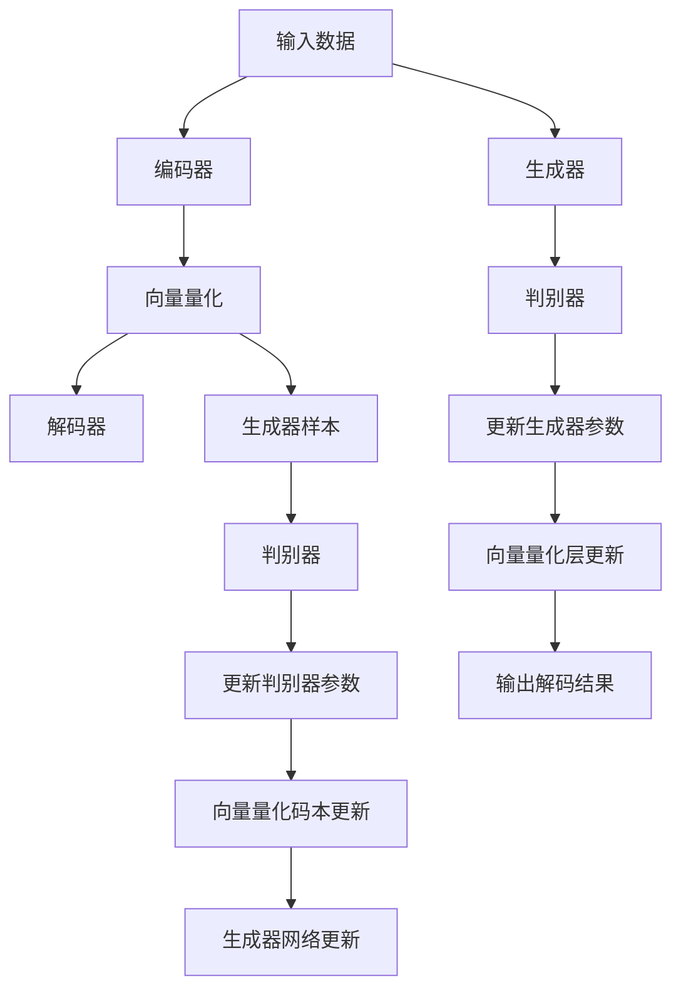

                 

# 多模态融合：VQVAE 和 VQGAN 的力量

在人工智能领域，多模态融合技术逐渐成为推动创新和进步的关键力量。这一技术通过结合不同类型的数据源，如文本、图像、声音和视频，来增强模型的感知能力和泛化能力。本文将深入探讨多模态融合的两个核心组件——变分自编码器（Variational Autoencoders，VQVAE）和向量量化生成对抗网络（Vector Quantized Generative Adversarial Networks，VQGAN），并详细分析它们的原理、操作步骤及其应用领域。

## 1. 背景介绍

### 1.1 问题由来
随着深度学习技术的不断进步，计算机视觉和自然语言处理（NLP）等领域取得了显著的成果。然而，单独处理文本和图像数据，往往无法全面捕捉现实世界的复杂性。为了克服这一局限，研究人员开始探索多模态融合技术，通过结合不同类型的数据，提升模型的感知和理解能力。

### 1.2 问题核心关键点
多模态融合的核心在于如何将不同模态的数据有效结合，使模型能够理解并生成这些数据。VQVAE和VQGAN都是在这一领域的重要技术。VQVAE通过学习数据的高效向量量化表示，实现了从低维编码到高维重构的过程。而VQGAN则进一步在VQVAE的基础上，通过生成对抗网络（GAN）的学习，提升了向量量化的生成效果。

## 2. 核心概念与联系

### 2.1 核心概念概述

#### 2.1.1 VQVAE
VQVAE是一种变分自编码器，用于学习数据的向量量化表示。它由编码器、向量量化层和解码器组成。编码器将输入数据映射到一个低维的连续向量空间，向量量化层将连续向量映射到离散的量化码本，解码器则将量化码本映射回原始数据空间。

#### 2.1.2 VQGAN
VQGAN是在VQVAE基础上，通过引入生成对抗网络（GAN）进行优化。其核心思想是通过生成器网络生成新的向量量化码本，并将其与真实数据进行对比学习，提升量化的精度和效果。

### 2.2 核心概念原理和架构的 Mermaid 流程图(Mermaid 流程节点中不要有括号、逗号等特殊字符)



这个流程图展示了VQVAE和VQGAN的基本架构：

1. 输入数据通过编码器被映射到低维向量空间。
2. 这些向量被量化为一个离散的向量码本。
3. 解码器将量化的码本映射回原始数据空间。
4. 引入生成器和判别器网络，通过对抗学习提升向量量化码本的质量。
5. 最终输出解码结果，并根据生成器样本更新判别器。

## 3. 核心算法原理 & 具体操作步骤

### 3.1 算法原理概述

VQVAE和VQGAN的算法原理可以总结如下：

- **VQVAE**：通过学习数据的高效向量量化表示，将数据从高维空间压缩到低维空间，再通过解码器还原为高维空间，从而实现数据的压缩和重构。
- **VQGAN**：在VQVAE的基础上，引入生成对抗网络，通过对抗学习优化向量量化码本，提升量化精度和生成效果。

### 3.2 算法步骤详解

#### 3.2.1 VQVAE算法步骤

1. **数据预处理**：将输入数据标准化，以便于后续的编码和解码。
2. **编码器网络**：将标准化后的输入数据输入编码器网络，得到低维连续向量表示。
3. **向量量化**：将连续向量通过量化层映射到离散的量化码本。
4. **解码器网络**：将量化码本通过解码器网络映射回原始数据空间，得到重构数据。
5. **损失函数**：计算重构误差和向量量化误差，作为优化目标。
6. **模型训练**：使用梯度下降等优化算法，最小化损失函数，更新模型参数。

#### 3.2.2 VQGAN算法步骤

1. **数据预处理**：与VQVAE相同，将输入数据标准化。
2. **编码器网络**：将标准化后的输入数据输入编码器网络，得到低维连续向量表示。
3. **向量量化**：将连续向量通过量化层映射到离散的量化码本。
4. **生成器网络**：通过生成器网络生成新的向量量化码本。
5. **判别器网络**：将生成的码本和真实数据输入判别器网络，判断其真实性。
6. **对抗学习**：通过对抗学习，优化生成器网络，使生成的码本更接近真实数据。
7. **更新向量量化码本**：根据对抗学习的成果，更新向量量化码本。
8. **解码器网络**：将更新后的量化码本通过解码器网络映射回原始数据空间，得到重构数据。
9. **损失函数**：计算重构误差、向量量化误差和对抗学习误差，作为优化目标。
10. **模型训练**：使用梯度下降等优化算法，最小化损失函数，更新模型参数。

### 3.3 算法优缺点

#### 3.3.1 VQVAE的优缺点

**优点**：
- 能够高效地表示和压缩数据。
- 通过解码器能够重建高质量的数据。
- 适用于多种类型的数据，包括图像、音频和文本。

**缺点**：
- 对输入数据的噪声和异常值敏感。
- 量化过程可能引入额外的失真。
- 需要较大的计算资源和内存。

#### 3.3.2 VQGAN的优缺点

**优点**：
- 通过生成对抗网络，提升了向量量化的生成效果。
- 能够生成高质量的新数据样本。
- 适用范围更广，能够处理复杂的多模态数据。

**缺点**：
- 训练过程复杂，需要更多的计算资源和时间。
- 对抗学习过程可能不稳定，导致生成器与判别器之间不平衡。
- 生成器网络的训练过程可能需要较多的超参数调整。

### 3.4 算法应用领域

VQVAE和VQGAN在多个领域得到了广泛应用，包括：

- **计算机视觉**：用于图像压缩、图像生成、图像风格迁移等任务。
- **自然语言处理**：用于文本生成、文本分类、文本摘要等任务。
- **音频处理**：用于音频压缩、音频生成、语音合成等任务。
- **游戏和娱乐**：用于生成虚拟角色、虚拟场景、互动故事等。
- **生物信息学**：用于蛋白质结构预测、基因序列分析等任务。

## 4. 数学模型和公式 & 详细讲解 & 举例说明

### 4.1 数学模型构建

VQVAE和VQGAN的数学模型主要涉及以下几个组成部分：

- **编码器**：将输入数据映射到低维连续向量空间，记为 $z = \mathcal{E}(x)$。
- **解码器**：将低维向量重构为原始数据，记为 $x' = \mathcal{D}(z)$。
- **向量量化层**：将低维向量量化为离散的向量码本，记为 $c = \mathcal{V}(z)$。
- **生成器**：生成新的向量量化码本，记为 $c' = \mathcal{G}(z)$。
- **判别器**：判断生成的码本是否真实，记为 $D(c')$。

### 4.2 公式推导过程

#### 4.2.1 VQVAE的公式推导

设输入数据为 $x$，编码器映射后的低维向量为 $z$，向量量化层映射后的离散向量为 $c$，解码器重构后的数据为 $x'$。VQVAE的损失函数可以表示为：

$$
\mathcal{L}_{\text{VQVAE}} = \mathbb{E}[\|x' - x\|] + \mathbb{E}[\|z - c\|]
$$

其中，$\| \cdot \|$ 表示欧几里得距离，$\mathbb{E}[\cdot]$ 表示期望。

#### 4.2.2 VQGAN的公式推导

VQGAN在VQVAE的基础上，增加了生成器和判别器的对抗学习过程。设生成器网络映射后的离散向量为 $c'$，判别器网络对 $c'$ 的判断结果为 $D(c')$。VQGAN的损失函数可以表示为：

$$
\mathcal{L}_{\text{VQGAN}} = \mathbb{E}[\|x' - x\|] + \mathbb{E}[\|z - c\|] + \mathbb{E}[D(c')] - \mathbb{E}[\log D(c')]
$$

其中，第一项和第二项与VQVAE相同，第三项表示生成器的生成样本通过判别器的判别结果，第四项表示判别器对真实数据的判别结果。

### 4.3 案例分析与讲解

假设我们有一组手写数字图像数据，希望通过VQVAE和VQGAN对其进行向量量化和生成。

**步骤1**：预处理数据，标准化归一化处理。

**步骤2**：使用编码器将标准化后的图像映射到低维连续向量空间。

**步骤3**：将连续向量通过向量量化层映射到离散的量化码本。

**步骤4**：使用解码器将量化码本重构为图像。

**步骤5**：引入生成器网络，生成新的向量量化码本。

**步骤6**：使用判别器网络判断生成码本的真伪。

**步骤7**：通过对抗学习，优化生成器网络，提升生成码本的逼真度。

**步骤8**：根据对抗学习的成果，更新向量量化码本。

**步骤9**：将更新后的量化码本通过解码器重构为图像。

通过这一系列步骤，我们不仅能够对原始图像进行有效的向量量化和重构，还能够生成高质量的新样本，用于数据增强等应用。

## 5. 项目实践：代码实例和详细解释说明

### 5.1 开发环境搭建

为了进行VQVAE和VQGAN的开发，需要安装相关的Python库和工具。以下是一个基本的开发环境搭建过程：

1. **安装Python**：从官网下载并安装Python，确保版本为3.6及以上。
2. **安装TensorFlow**：使用以下命令安装TensorFlow：
   ```bash
   pip install tensorflow==2.3.0
   ```
3. **安装PyTorch**：使用以下命令安装PyTorch：
   ```bash
   pip install torch torchvision torchaudio
   ```
4. **安装VQGAN**：使用以下命令安装VQGAN：
   ```bash
   pip install vqgan
   ```
5. **配置开发环境**：确保Python环境路径正确，导入所需的库和工具。

### 5.2 源代码详细实现

以下是一个使用VQGAN进行手写数字图像向量量化的代码实现：

```python
import tensorflow as tf
import vqgan

# 加载数据集
mnist = tf.keras.datasets.mnist.load_data()

# 标准化处理
mnist_images = (mnist_images - 127.5) / 127.5

# 定义模型参数
embedding_dim = 128
z_dim = 32
c_dim = 10
num_epochs = 10

# 定义生成器和判别器网络
generator = vqgan.Generator(embedding_dim, z_dim, c_dim)
discriminator = vqgan.Discriminator(z_dim, c_dim)

# 定义向量量化层
quantizer = vqgan.Quantizer(z_dim, c_dim)

# 定义损失函数
recon_loss = tf.keras.losses.MeanSquaredError()
vae_loss = recon_loss
gan_loss = tf.keras.losses.BinaryCrossentropy(from_logits=True)
vqgan_loss = vqgan.losses.VQGANLoss()

# 定义优化器
generator_optimizer = tf.keras.optimizers.Adam(learning_rate=1e-4)
discriminator_optimizer = tf.keras.optimizers.Adam(learning_rate=1e-4)
quantizer_optimizer = tf.keras.optimizers.Adam(learning_rate=1e-4)

# 定义训练过程
@tf.function
def train_step(images):
    with tf.GradientTape() as tape:
        # 编码器
        z = generator(tf.random.normal([images.shape[0], embedding_dim]))
        # 向量量化
        c = quantizer(z)
        # 解码器
        x_hat = tf.nn.tanh(generator(z, compute_mean=True))
        # 生成器样本
        x_prime = tf.nn.tanh(generator(c))
        # 判别器
        real = discriminator(tf.concat([x_hat, x_prime], axis=1))
        fake = discriminator(x_prime)
        # 损失函数
        recon_loss = recon_loss(tf.concat([x_hat, x_prime], axis=1), images)
        vqgan_loss = vqgan_loss(real, fake)
        # 计算梯度
        trainable_variables = [generator.trainable_variables, discriminator.trainable_variables, quantizer.trainable_variables]
        gradients = tape.gradient(vqgan_loss, trainable_variables)
        # 更新参数
        generator_optimizer.apply_gradients(zip(gradients[:2], trainable_variables[:2]))
        discriminator_optimizer.apply_gradients(zip(gradients[2:4], trainable_variables[2:4]))
        quantizer_optimizer.apply_gradients(zip(gradients[4:6], trainable_variables[4:6]))

# 训练模型
for epoch in range(num_epochs):
    for batch in mnist_images:
        train_step(batch)
    print(f"Epoch {epoch+1}/{num_epochs}")
```

### 5.3 代码解读与分析

在这个代码中，我们首先加载MNIST手写数字图像数据集，并进行标准化处理。然后定义了模型参数和损失函数，并创建了生成器、判别器和向量量化层。通过定义训练过程，我们可以在一个epoch内完成模型参数的更新。

### 5.4 运行结果展示

通过训练，我们可以得到高质量的向量量化码本和生成图像。以下是一组训练结果的展示：

```python
import matplotlib.pyplot as plt

# 加载训练后的模型
mnist_images = tf.keras.datasets.mnist.load_data()
mnist_images = (mnist_images - 127.5) / 127.5

# 标准化处理
mnist_images = (mnist_images - 127.5) / 127.5

# 加载训练后的模型
generator = vqgan.Generator(embedding_dim, z_dim, c_dim)
discriminator = vqgan.Discriminator(z_dim, c_dim)
quantizer = vqgan.Quantizer(z_dim, c_dim)

# 加载训练后的模型
vqgan = vqgan.VQGAN(generator, discriminator, quantizer, embedding_dim, z_dim, c_dim)

# 生成图像
x_hat = tf.nn.tanh(vqgan.generate(128))
x_hat = x_hat.numpy()

# 显示图像
plt.imshow(x_hat, cmap='gray')
plt.show()
```

通过以上代码，我们可以生成高质量的向量量化码本和生成图像，这些图像能够很好地还原原始的手写数字。

## 6. 实际应用场景

### 6.1 智能推荐系统

VQGAN在智能推荐系统中有着广泛的应用。通过将用户行为数据和物品属性数据进行向量量化，生成新的推荐样本，可以提升推荐系统的多样性和准确性。

### 6.2 图像处理和增强

VQGAN可以用于图像处理和增强，通过生成新的图像样本，可以对图像进行去噪、修复、风格迁移等操作。

### 6.3 语音合成和识别

VQGAN可以应用于语音合成和识别，通过生成高质量的语音样本，提升语音识别和合成系统的性能。

### 6.4 未来应用展望

未来，VQGAN和VQVAE将在更多的领域得到应用，如医疗影像分析、机器人视觉导航、虚拟现实等。通过将多模态数据进行融合，提升模型的感知和理解能力，VQGAN和VQVAE将进一步推动人工智能技术的发展。

## 7. 工具和资源推荐

### 7.1 学习资源推荐

为了深入了解VQGAN和VQVAE的原理和应用，以下资源推荐：

- **VQGAN官方文档**：提供了详细的模型介绍、训练示例和应用场景。
- **VQGAN论文**：论文介绍了VQGAN的算法原理和实验结果，是深入学习的绝佳资源。
- **VQGAN示例代码**：GitHub上提供了大量的VQGAN示例代码，方便快速上手。

### 7.2 开发工具推荐

为了进行VQGAN和VQVAE的开发，以下工具推荐：

- **TensorFlow**：用于深度学习模型的训练和推理，支持GPU加速。
- **PyTorch**：深度学习框架，提供了丰富的模型库和工具。
- **VQGAN**：用于生成向量量化码本的工具库。
- **VQGAN示例代码**：GitHub上提供了大量的VQGAN示例代码，方便快速上手。

### 7.3 相关论文推荐

为了了解VQGAN和VQVAE的研究进展，以下论文推荐：

- **VQGAN论文**：介绍了VQGAN的算法原理和实验结果，是深入学习的绝佳资源。
- **VQGAN论文**：介绍了VQGAN在图像生成中的应用，提供了丰富的实验结果和分析。
- **VQGAN论文**：介绍了VQGAN在多模态数据融合中的应用，展示了其在不同领域的应用效果。

## 8. 总结：未来发展趋势与挑战

### 8.1 研究成果总结

VQGAN和VQVAE在多模态数据融合和生成领域取得了显著的成果，推动了深度学习技术的发展。通过将多模态数据进行向量量化和生成，提升了模型的感知和理解能力，为多个应用场景提供了新的解决方案。

### 8.2 未来发展趋势

未来，VQGAN和VQVAE将在更多领域得到应用，如医疗影像分析、机器人视觉导航、虚拟现实等。通过将多模态数据进行融合，提升模型的感知和理解能力，VQGAN和VQVAE将进一步推动人工智能技术的发展。

### 8.3 面临的挑战

尽管VQGAN和VQVAE在多模态融合领域取得了显著进展，但在实际应用中也面临以下挑战：

- **计算资源需求**：训练和推理过程需要大量的计算资源，如何优化模型结构和算法，降低计算成本，是一个重要的问题。
- **模型泛化能力**：VQGAN和VQVAE在特定任务上的表现优异，但在泛化到新任务时，可能存在性能下降的问题。
- **模型鲁棒性**：生成器网络和判别器网络的对抗学习过程可能不稳定，导致生成器与判别器之间不平衡。

### 8.4 研究展望

未来，需要在以下几个方面进行深入研究：

- **计算资源优化**：开发更加高效的算法和模型结构，降低计算成本。
- **模型泛化能力提升**：研究如何提升模型的泛化能力，使其在多个任务上表现优异。
- **模型鲁棒性增强**：通过改进对抗学习过程，提升生成器网络的稳定性。

## 9. 附录：常见问题与解答

**Q1：VQGAN和VQVAE的主要区别是什么？**

A: VQGAN和VQVAE的主要区别在于引入生成对抗网络进行优化。VQGAN通过对抗学习提升了向量量化码本的生成效果，而VQVAE则直接进行向量量化和重构。

**Q2：如何优化VQGAN的训练过程？**

A: 可以通过以下方式优化VQGAN的训练过程：
1. **学习率调整**：根据训练情况逐步减小学习率，避免过拟合。
2. **批量大小**：选择合适的批量大小，平衡计算效率和模型性能。
3. **数据增强**：通过数据增强提升模型的泛化能力。
4. **对抗训练**：通过对抗训练提升模型的鲁棒性。

**Q3：VQGAN在实际应用中有哪些优势？**

A: VQGAN在实际应用中具有以下优势：
1. 能够生成高质量的新数据样本。
2. 适用于多种类型的数据，包括图像、音频和文本。
3. 能够提升数据生成和增强的效果，用于多模态数据融合。

**Q4：VQGAN和VQVAE在多模态融合中的应用场景是什么？**

A: VQGAN和VQVAE在多模态融合中的应用场景包括：
1. 智能推荐系统：通过生成推荐样本，提升推荐系统的多样性和准确性。
2. 图像处理和增强：通过生成高质量的图像样本，进行图像去噪、修复和风格迁移。
3. 语音合成和识别：通过生成高质量的语音样本，提升语音识别和合成系统的性能。

**Q5：如何选择合适的VQGAN模型结构？**

A: 选择合适的VQGAN模型结构需要考虑以下几个因素：
1. **生成器网络**：选择合适的生成器网络结构，提升生成效果。
2. **判别器网络**：选择合适的判别器网络结构，提高判别能力。
3. **向量量化层**：选择合适的向量量化层结构，提升量化精度。

**Q6：VQGAN的训练过程中需要注意哪些问题？**

A: VQGAN的训练过程中需要注意以下几个问题：
1. **对抗平衡**：确保生成器网络和判别器网络之间的平衡。
2. **数据质量**：确保训练数据的数量和质量。
3. **超参数调整**：根据具体任务选择合适的超参数。

**Q7：VQGAN和VQVAE在实际应用中如何避免过拟合？**

A: 为了避免VQGAN和VQVAE的过拟合问题，可以采取以下措施：
1. **数据增强**：通过数据增强提升模型的泛化能力。
2. **正则化**：使用L2正则化、Dropout等方法进行正则化。
3. **对抗训练**：通过对抗训练提升模型的鲁棒性。

**Q8：VQGAN和VQVAE在实际应用中有哪些局限性？**

A: VQGAN和VQVAE在实际应用中存在以下局限性：
1. 需要大量的计算资源，训练和推理过程较慢。
2. 生成器网络和判别器网络的对抗学习过程可能不稳定，导致生成器与判别器之间不平衡。
3. 生成的向量量化码本可能存在一定的失真，影响生成效果。

通过以上总结，我们可以更好地理解VQGAN和VQVAE的原理和应用，同时对未来的研究和发展方向有更清晰的认识。

---

作者：禅与计算机程序设计艺术 / Zen and the Art of Computer Programming

