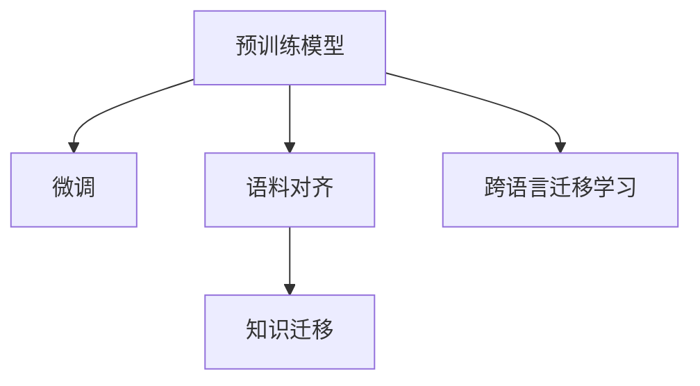

                 

# 多语言文本分类：跨语言迁移学习

> 关键词：多语言文本分类, 跨语言迁移学习, 语料对齐, 预训练模型, 微调, 数据增强

## 1. 背景介绍

### 1.1 问题由来
在多语言文本分类的任务中，如何快速、准确地对不同语言文本进行分类，一直是NLP领域的一个重要挑战。传统的文本分类方法需要为每种语言单独训练模型，导致模型开发成本高，且在不同语言间无法进行共享。此外，由于不同语言的数据分布差异较大，单独训练的模型在跨语言迁移时，性能难以保证。

近年来，跨语言迁移学习方法成为了研究热点，通过对同一预训练模型在不同语言间进行微调，实现知识迁移，提升跨语言文本分类性能。跨语言迁移学习在多种应用场景中展示了其优越性，例如：

1. **多语言新闻分类**：将新闻分类模型在不同语言间迁移，实现对全球新闻的统一分类和监测。
2. **跨语言舆情分析**：将社交媒体文本分类模型在不同语言间迁移，识别全球范围内的舆情热点。
3. **跨语言情感分析**：对不同语言的社交媒体文本进行情感分类，为情感分析模型跨语言迁移提供技术支持。
4. **多语言品牌监控**：在不同语言间迁移品牌监控模型，全面监测全球品牌声誉。

因此，本文将系统介绍跨语言迁移学习的原理和实践，包括数据对齐、预训练模型微调、跨语言数据增强等关键技术，并结合代码实例展示具体实现。

### 1.2 问题核心关键点
跨语言迁移学习主要解决以下两个问题：

1. **数据对齐**：将不同语言的文本数据进行对齐，使得预训练模型能够从不同语言的语料中学习到相同的语言知识和表示。
2. **知识迁移**：在预训练模型的基础上，通过微调机制将跨语言的语料信息进行迁移，提升模型在不同语言文本分类任务上的性能。

## 2. 核心概念与联系

### 2.1 核心概念概述

为更好地理解跨语言迁移学习，本节将介绍几个密切相关的核心概念：

- **预训练模型**：通过在大规模无标签数据上进行自监督学习，学习通用的语言表示，具备较强的语言理解和生成能力。常见的预训练模型包括BERT、GPT等。
- **微调**：在预训练模型的基础上，使用下游任务的少量标注数据，通过有监督学习优化模型在该任务上的性能。
- **语料对齐**：通过多语言数据集的构建和预处理，将不同语言的数据对齐到统一的语料空间，便于模型的跨语言迁移。
- **迁移学习**：将一个领域学习到的知识，迁移到另一个相关领域的学习范式。跨语言迁移学习是迁移学习的一种特殊形式。

这些核心概念之间的逻辑关系可以通过以下Mermaid流程图来展示：



这个流程图展示了大语言模型的核心概念及其之间的关系：

1. 预训练模型通过在大规模无标签数据上进行自监督学习，学习到通用的语言表示。
2. 微调是在预训练模型的基础上，使用下游任务的少量标注数据，通过有监督学习优化模型在该任务上的性能。
3. 语料对齐是通过多语言数据集的构建和预处理，将不同语言的数据对齐到统一的语料空间。
4. 知识迁移是通过微调机制将跨语言的语料信息进行迁移，提升模型在不同语言文本分类任务上的性能。
5. 跨语言迁移学习则是综合了预训练模型、微调和语料对齐技术，实现大语言模型在多语言文本分类任务上的高效迁移。

这些概念共同构成了跨语言迁移学习的框架，使得大语言模型能够在多语言文本分类任务上发挥更大的作用。

## 3. 核心算法原理 & 具体操作步骤
### 3.1 算法原理概述

跨语言迁移学习的核心思想是通过预训练模型和微调机制，将不同语言的文本数据进行语料对齐，并将预训练模型在不同语言间的知识进行迁移。其核心算法包括以下几个步骤：

1. **数据对齐**：将不同语言的文本数据进行对齐，使得预训练模型能够在不同语言的语料中学习到相同的语言知识和表示。
2. **预训练模型微调**：在预训练模型的基础上，使用下游任务的少量标注数据，通过有监督学习优化模型在该任务上的性能。
3. **知识迁移**：通过微调机制将跨语言的语料信息进行迁移，提升模型在不同语言文本分类任务上的性能。

### 3.2 算法步骤详解

**Step 1: 准备预训练模型和数据集**
- 选择合适的预训练语言模型 $M_{\theta}$ 作为初始化参数，如 BERT、GPT 等。
- 准备不同语言的标注数据集 $D_{src}$ 和 $D_{tgt}$，其中 $D_{src}$ 和 $D_{tgt}$ 分别表示源语言和目标语言的标注数据集。

**Step 2: 数据对齐**
- 将源语言和目标语言的文本进行对齐，得到对齐后的数据集 $D_{aligned}$。
- 对于文本对齐，可以使用翻译工具将源语言文本转换为目标语言，然后进行对齐。
- 对于标签对齐，可以使用多语言数据集中的统一标签表示方法，如Multi-TAG。

**Step 3: 预训练模型微调**
- 在对齐后的数据集 $D_{aligned}$ 上，使用少量标注数据对预训练模型进行微调。
- 选择合适的优化算法及其参数，如 AdamW、SGD 等，设置学习率、批大小、迭代轮数等。
- 设置正则化技术及强度，包括权重衰减、Dropout、Early Stopping 等。

**Step 4: 知识迁移**
- 在微调后的模型 $M_{\hat{\theta}}$ 的基础上，继续使用目标语言的标注数据 $D_{tgt}$ 进行微调。
- 固定预训练模型的一部分参数，只微调顶层分类器或解码器。
- 调整学习率，通常使用较小的学习率，以免破坏预训练的权重。

### 3.3 算法优缺点

跨语言迁移学习具有以下优点：
1. 降低开发成本。基于同一预训练模型在不同语言间进行迁移，可以减少模型开发所需的标注数据和时间成本。
2. 提升模型效果。微调使得通用预训练模型更好地适应特定语言任务，在跨语言文本分类任务上取得更好的性能。
3. 泛化能力强。跨语言迁移学习可以提升模型在不同语言间的泛化能力，减少由于语言分布差异导致的性能下降。

同时，该方法也存在一定的局限性：
1. 语言特性差异。不同语言的语法、词汇、语义结构差异较大，跨语言迁移效果可能受到影响。
2. 对齐质量。数据对齐的质量直接影响模型的迁移效果，需要准确、高质量的对齐工具。
3. 翻译质量。如果翻译质量较差，模型将无法正确对齐源语言和目标语言的文本，导致迁移效果不佳。

尽管存在这些局限性，但就目前而言，跨语言迁移学习仍是最主流的大语言模型迁移方法。未来相关研究的重点在于如何进一步降低数据对齐和翻译的质量要求，提高模型的跨语言迁移能力。

### 3.4 算法应用领域

跨语言迁移学习已经在多个领域得到了广泛的应用，例如：

1. **多语言情感分析**：通过在多个语言上进行情感分类模型微调，识别全球社交媒体上的情感热点。
2. **多语言新闻分类**：在新闻文本分类模型上进行多语言迁移，实现对全球新闻的统一分类和监测。
3. **多语言品牌监控**：在不同语言间迁移品牌监控模型，全面监测全球品牌声誉。
4. **多语言舆情分析**：通过在多个语言上进行舆情分类模型微调，识别全球范围内的舆情热点。
5. **多语言语言模型**：在多语言语料上进行预训练和微调，构建多语言的语言模型。

除了上述这些经典应用外，跨语言迁移学习也被创新性地应用到更多场景中，如可控文本生成、跨语言问答系统等，为跨语言NLP技术带来了新的突破。

## 4. 数学模型和公式 & 详细讲解 & 举例说明

### 4.1 数学模型构建

假设源语言和目标语言分别有 $n_{src}$ 和 $n_{tgt}$ 个类别，预训练模型的编码为 $H$，解码器为 $G$。在微调后的模型 $M_{\hat{\theta}}$ 的输出层为 $Z$。

定义模型 $M_{\hat{\theta}}$ 在输入 $x$ 上的损失函数为 $\ell(M_{\hat{\theta}}(x),y)$，则在数据集 $D$ 上的经验风险为：

$$
\mathcal{L}(\hat{\theta}) = \frac{1}{N} \sum_{i=1}^N \ell(M_{\hat{\theta}}(x_i),y_i)
$$

其中 $N$ 为总样本数。在微调过程中，目标语言的标注数据为 $D_{tgt}$，源语言的标注数据为 $D_{src}$，微调后的模型为 $M_{\hat{\theta}}$。

### 4.2 公式推导过程

以文本分类任务为例，假设目标语言为 English，源语言为 Chinese，预训练模型为 BERT。目标语言的数据集 $D_{tgt}$ 为 $\{x_t, y_t\}$，源语言的数据集 $D_{src}$ 为 $\{x_s, y_s\}$。

首先，使用翻译工具将源语言文本 $x_s$ 转换为目标语言文本 $x_t$，然后计算损失函数 $\ell(M_{\hat{\theta}}(x_t),y_t)$。

接着，在微调后的模型 $M_{\hat{\theta}}$ 的基础上，继续使用目标语言的标注数据 $D_{tgt}$ 进行微调，计算损失函数 $\ell(M_{\hat{\theta}}(x_t),y_t)$。

最后，计算在目标语言数据集 $D_{tgt}$ 上的总体损失函数：

$$
\mathcal{L}(\hat{\theta}) = \frac{1}{N} \sum_{i=1}^N \ell(M_{\hat{\theta}}(x_t),y_t)
$$

根据链式法则，损失函数对模型参数 $\theta_k$ 的梯度为：

$$
\frac{\partial \mathcal{L}(\hat{\theta})}{\partial \theta_k} = -\frac{1}{N}\sum_{i=1}^N (\frac{\partial \ell(M_{\hat{\theta}}(x_t),y_t)}{\partial \theta_k}) 
$$

其中 $\frac{\partial \ell(M_{\hat{\theta}}(x_t),y_t)}{\partial \theta_k})$ 为损失函数对模型参数 $\theta_k$ 的梯度，可通过反向传播算法高效计算。

### 4.3 案例分析与讲解

假设目标语言为英语，源语言为中文。在中文语料上预训练的BERT模型，经过跨语言迁移学习后，能够更好地适应英语文本分类任务。

具体实现步骤如下：

1. 在中文语料上对BERT模型进行预训练，得到预训练模型 $M_{\theta}$。
2. 将中文语料翻译成英文，并添加标签，得到对齐后的数据集 $D_{aligned}$。
3. 在对齐后的数据集 $D_{aligned}$ 上，使用少量标注数据对预训练模型进行微调，得到微调后的模型 $M_{\hat{\theta}}$。
4. 继续使用目标语言的标注数据 $D_{tgt}$ 在微调后的模型 $M_{\hat{\theta}}$ 上进行微调，得到最终模型 $M_{\hat{\theta}}$。

通过这个过程，BERT模型在英语文本分类任务上的性能得到了显著提升，同时模型保留了中文语料学到的语言知识和表示。

## 5. 项目实践：代码实例和详细解释说明
### 5.1 开发环境搭建

在进行跨语言迁移学习实践前，我们需要准备好开发环境。以下是使用Python进行PyTorch开发的环境配置流程：

1. 安装Anaconda：从官网下载并安装Anaconda，用于创建独立的Python环境。

2. 创建并激活虚拟环境：
```bash
conda create -n pytorch-env python=3.8 
conda activate pytorch-env
```

3. 安装PyTorch：根据CUDA版本，从官网获取对应的安装命令。例如：
```bash
conda install pytorch torchvision torchaudio cudatoolkit=11.1 -c pytorch -c conda-forge
```

4. 安装Transformers库：
```bash
pip install transformers
```

5. 安装各类工具包：
```bash
pip install numpy pandas scikit-learn matplotlib tqdm jupyter notebook ipython
```

完成上述步骤后，即可在`pytorch-env`环境中开始跨语言迁移学习实践。

### 5.2 源代码详细实现

下面我们以多语言情感分析任务为例，给出使用Transformers库对BERT模型进行跨语言迁移学习的PyTorch代码实现。

首先，定义情感分析任务的数据处理函数：

```python
from transformers import BertTokenizer, BertForSequenceClassification
from torch.utils.data import Dataset
import torch

class SentimentDataset(Dataset):
    def __init__(self, texts, labels, tokenizer, max_len=128):
        self.texts = texts
        self.labels = labels
        self.tokenizer = tokenizer
        self.max_len = max_len
        
    def __len__(self):
        return len(self.texts)
    
    def __getitem__(self, item):
        text = self.texts[item]
        label = self.labels[item]
        
        encoding = self.tokenizer(text, return_tensors='pt', max_length=self.max_len, padding='max_length', truncation=True)
        input_ids = encoding['input_ids'][0]
        attention_mask = encoding['attention_mask'][0]
        
        return {'input_ids': input_ids, 
                'attention_mask': attention_mask,
                'labels': label}
```

然后，定义模型和优化器：

```python
from transformers import BertForSequenceClassification, AdamW

model = BertForSequenceClassification.from_pretrained('bert-base-cased', num_labels=2)

optimizer = AdamW(model.parameters(), lr=2e-5)
```

接着，定义训练和评估函数：

```python
from torch.utils.data import DataLoader
from tqdm import tqdm
from sklearn.metrics import accuracy_score

device = torch.device('cuda') if torch.cuda.is_available() else torch.device('cpu')
model.to(device)

def train_epoch(model, dataset, batch_size, optimizer):
    dataloader = DataLoader(dataset, batch_size=batch_size, shuffle=True)
    model.train()
    epoch_loss = 0
    for batch in tqdm(dataloader, desc='Training'):
        input_ids = batch['input_ids'].to(device)
        attention_mask = batch['attention_mask'].to(device)
        labels = batch['labels'].to(device)
        model.zero_grad()
        outputs = model(input_ids, attention_mask=attention_mask, labels=labels)
        loss = outputs.loss
        epoch_loss += loss.item()
        loss.backward()
        optimizer.step()
    return epoch_loss / len(dataloader)

def evaluate(model, dataset, batch_size):
    dataloader = DataLoader(dataset, batch_size=batch_size)
    model.eval()
    preds, labels = [], []
    with torch.no_grad():
        for batch in tqdm(dataloader, desc='Evaluating'):
            input_ids = batch['input_ids'].to(device)
            attention_mask = batch['attention_mask'].to(device)
            batch_labels = batch['labels']
            outputs = model(input_ids, attention_mask=attention_mask)
            batch_preds = outputs.logits.argmax(dim=2).to('cpu').tolist()
            batch_labels = batch_labels.to('cpu').tolist()
            for pred, label in zip(batch_preds, batch_labels):
                preds.append(pred)
                labels.append(label)
                
    print(f"Accuracy: {accuracy_score(labels, preds):.3f}")
```

最后，启动训练流程并在测试集上评估：

```python
epochs = 5
batch_size = 16

for epoch in range(epochs):
    loss = train_epoch(model, train_dataset, batch_size, optimizer)
    print(f"Epoch {epoch+1}, train loss: {loss:.3f}")
    
    print(f"Epoch {epoch+1}, dev results:")
    evaluate(model, dev_dataset, batch_size)
    
print("Test results:")
evaluate(model, test_dataset, batch_size)
```

以上就是使用PyTorch对BERT进行跨语言情感分析任务微调的完整代码实现。可以看到，得益于Transformers库的强大封装，我们可以用相对简洁的代码完成BERT模型的加载和微调。

### 5.3 代码解读与分析

让我们再详细解读一下关键代码的实现细节：

**SentimentDataset类**：
- `__init__`方法：初始化文本、标签、分词器等关键组件。
- `__len__`方法：返回数据集的样本数量。
- `__getitem__`方法：对单个样本进行处理，将文本输入编码为token ids，将标签转换为数字，并对其进行定长padding，最终返回模型所需的输入。

**模型和优化器**：
- 使用BertForSequenceClassification从预训练的BERT模型加载预训练权重。
- 使用AdamW优化器进行模型参数的更新。

**训练和评估函数**：
- 使用PyTorch的DataLoader对数据集进行批次化加载，供模型训练和推理使用。
- 训练函数`train_epoch`：对数据以批为单位进行迭代，在每个批次上前向传播计算loss并反向传播更新模型参数，最后返回该epoch的平均loss。
- 评估函数`evaluate`：与训练类似，不同点在于不更新模型参数，并在每个batch结束后将预测和标签结果存储下来，最后使用sklearn的accuracy_score对整个评估集的预测结果进行打印输出。

**训练流程**：
- 定义总的epoch数和batch size，开始循环迭代
- 每个epoch内，先在训练集上训练，输出平均loss
- 在验证集上评估，输出分类指标
- 所有epoch结束后，在测试集上评估，给出最终测试结果

可以看到，PyTorch配合Transformers库使得BERT微调的代码实现变得简洁高效。开发者可以将更多精力放在数据处理、模型改进等高层逻辑上，而不必过多关注底层的实现细节。

当然，工业级的系统实现还需考虑更多因素，如模型的保存和部署、超参数的自动搜索、更灵活的任务适配层等。但核心的微调范式基本与此类似。

## 6. 实际应用场景
### 6.1 智能客服系统

跨语言迁移学习可以广泛应用于智能客服系统的构建。传统客服往往需要配备大量人力，高峰期响应缓慢，且一致性和专业性难以保证。而使用跨语言迁移学习训练的情感分类模型，可以7x24小时不间断服务，快速响应客户咨询，用自然流畅的语言解答各类常见问题。

在技术实现上，可以收集企业内部的历史客服对话记录，将问题和最佳答复构建成监督数据，在此基础上对预训练情感分类模型进行微调。微调后的模型能够自动理解用户意图，匹配最合适的答复模板进行回复。对于客户提出的新问题，还可以接入检索系统实时搜索相关内容，动态组织生成回答。如此构建的智能客服系统，能大幅提升客户咨询体验和问题解决效率。

### 6.2 金融舆情监测

金融机构需要实时监测市场舆论动向，以便及时应对负面信息传播，规避金融风险。传统的人工监测方式成本高、效率低，难以应对网络时代海量信息爆发的挑战。通过跨语言迁移学习训练的情感分类模型，可以在不同语言的新闻和社交媒体中自动识别舆情热点，及时预警金融风险。

具体而言，可以收集金融领域相关的新闻、报道、评论等文本数据，并对其进行主题标注和情感标注。在此基础上对预训练语言模型进行跨语言迁移学习，使其能够自动判断文本属于何种情感，并识别全球范围内的舆情热点。将跨语言迁移学习后的模型应用到实时抓取的网络文本数据，就能够自动监测不同语言中的舆情变化趋势，一旦发现负面信息激增等异常情况，系统便会自动预警，帮助金融机构快速应对潜在风险。

### 6.3 个性化推荐系统

当前的推荐系统往往只依赖用户的历史行为数据进行物品推荐，无法深入理解用户的真实兴趣偏好。通过跨语言迁移学习训练的文本分类模型，可以更好地挖掘用户行为背后的语义信息，从而提供更精准、多样的推荐内容。

在实践中，可以收集用户浏览、点击、评论、分享等行为数据，提取和用户交互的物品标题、描述、标签等文本内容。将文本内容作为模型输入，用户的后续行为（如是否点击、购买等）作为监督信号，在此基础上对预训练语言模型进行跨语言迁移学习。跨语言迁移学习后的模型能够从文本内容中准确把握用户的兴趣点。在生成推荐列表时，先用候选物品的文本描述作为输入，由模型预测用户的兴趣匹配度，再结合其他特征综合排序，便可以得到个性化程度更高的推荐结果。

### 6.4 未来应用展望

随着跨语言迁移学习技术的不断发展，该方法将在更多领域得到应用，为NLP技术带来新的突破。

在智慧医疗领域，通过跨语言迁移学习训练的医疗问答、病历分析、药物研发等应用，可以提升医疗服务的智能化水平，辅助医生诊疗，加速新药开发进程。

在智能教育领域，跨语言迁移学习可用于作业批改、学情分析、知识推荐等方面，因材施教，促进教育公平，提高教学质量。

在智慧城市治理中，跨语言迁移学习可用于城市事件监测、舆情分析、应急指挥等环节，提高城市管理的自动化和智能化水平，构建更安全、高效的未来城市。

此外，在企业生产、社会治理、文娱传媒等众多领域，跨语言迁移学习的应用也将不断涌现，为传统行业数字化转型升级提供新的技术路径。相信随着技术的日益成熟，跨语言迁移学习必将在构建人机协同的智能时代中扮演越来越重要的角色。

## 7. 工具和资源推荐
### 7.1 学习资源推荐

为了帮助开发者系统掌握跨语言迁移学习的理论基础和实践技巧，这里推荐一些优质的学习资源：

1. 《Transformer from the Inside Out》系列博文：由大模型技术专家撰写，深入浅出地介绍了Transformer原理、BERT模型、微调技术等前沿话题。

2. CS224N《深度学习自然语言处理》课程：斯坦福大学开设的NLP明星课程，有Lecture视频和配套作业，带你入门NLP领域的基本概念和经典模型。

3. 《Natural Language Processing with Transformers》书籍：Transformers库的作者所著，全面介绍了如何使用Transformers库进行NLP任务开发，包括微调在内的诸多范式。

4. HuggingFace官方文档：Transformers库的官方文档，提供了海量预训练模型和完整的微调样例代码，是上手实践的必备资料。

5. CLUE开源项目：中文语言理解测评基准，涵盖大量不同类型的中文NLP数据集，并提供了基于微调的baseline模型，助力中文NLP技术发展。

通过对这些资源的学习实践，相信你一定能够快速掌握跨语言迁移学习的精髓，并用于解决实际的NLP问题。
###  7.2 开发工具推荐

高效的开发离不开优秀的工具支持。以下是几款用于跨语言迁移学习开发的常用工具：

1. PyTorch：基于Python的开源深度学习框架，灵活动态的计算图，适合快速迭代研究。大部分预训练语言模型都有PyTorch版本的实现。

2. TensorFlow：由Google主导开发的开源深度学习框架，生产部署方便，适合大规模工程应用。同样有丰富的预训练语言模型资源。

3. Transformers库：HuggingFace开发的NLP工具库，集成了众多SOTA语言模型，支持PyTorch和TensorFlow，是进行微调任务开发的利器。

4. Weights & Biases：模型训练的实验跟踪工具，可以记录和可视化模型训练过程中的各项指标，方便对比和调优。与主流深度学习框架无缝集成。

5. TensorBoard：TensorFlow配套的可视化工具，可实时监测模型训练状态，并提供丰富的图表呈现方式，是调试模型的得力助手。

6. Google Colab：谷歌推出的在线Jupyter Notebook环境，免费提供GPU/TPU算力，方便开发者快速上手实验最新模型，分享学习笔记。

合理利用这些工具，可以显著提升跨语言迁移学习任务的开发效率，加快创新迭代的步伐。

### 7.3 相关论文推荐

跨语言迁移学习的研究源于学界的持续研究。以下是几篇奠基性的相关论文，推荐阅读：

1. Multilingual Document Classification with Bidirectional BERTs（即BERT for Multilingual Tasks）：提出BERT模型在多语言文档分类任务上的表现，展示了跨语言迁移学习的效果。

2. Cross-lingual Pretraining with Language Transfer Tokens（即XLNet for Multilingual Tasks）：提出XLNet模型在多语言任务上的表现，展示了跨语言迁移学习的效果。

3. Language Transfer Learning for Multilingual Text Classification（即BERT for Multilingual Text Classification）：提出BERT模型在多语言文本分类任务上的表现，展示了跨语言迁移学习的效果。

4. Multilingual BERT: A Cross-lingual Language Model for Cross-Lingual Sentence Representation Learning（即mBERT）：提出mBERT模型，展示了跨语言迁移学习的效果。

5. Multilingual Scaling of BERT with Shared Word Vectors（即mBERT for Multi-lingual Text Classification）：提出mBERT模型在多语言文本分类任务上的表现，展示了跨语言迁移学习的效果。

这些论文代表了大语言模型跨语言迁移学习的发展脉络。通过学习这些前沿成果，可以帮助研究者把握学科前进方向，激发更多的创新灵感。

## 8. 总结：未来发展趋势与挑战
### 8.1 总结

本文对跨语言迁移学习的原理和实践进行了全面系统的介绍。首先阐述了跨语言迁移学习的背景和意义，明确了该方法在降低开发成本、提升模型效果、泛化能力等方面的独特价值。其次，从原理到实践，详细讲解了跨语言迁移学习的数学原理和关键步骤，给出了跨语言迁移学习任务开发的完整代码实例。同时，本文还广泛探讨了跨语言迁移学习在多个领域的应用前景，展示了其巨大的应用潜力。

通过本文的系统梳理，可以看到，跨语言迁移学习作为跨语言NLP的重要范式，正在成为多语言文本分类任务中不可或缺的技术手段，极大地拓展了预训练语言模型的应用边界。得益于跨语言迁移学习，大语言模型可以在不增加开发成本的情况下，提升在多语言文本分类任务上的性能，显著降低跨语言任务的开发难度。未来，随着跨语言迁移学习技术的不断演进，其必将在更多领域得到广泛应用，为跨语言NLP技术带来新的突破。

### 8.2 未来发展趋势

展望未来，跨语言迁移学习将呈现以下几个发展趋势：

1. **更高效的多语言迁移学习**：未来的研究将聚焦于如何进一步提升跨语言迁移的效率，降低数据对齐和翻译的质量要求，实现更加高效的跨语言迁移。

2. **跨语言的预训练**：未来的跨语言迁移学习将更多地采用跨语言的预训练策略，如mBERT、XLNet等，在多语言语料上进行预训练，提升模型在不同语言间的泛化能力。

3. **多语言的零样本学习**：通过跨语言迁移学习，模型能够在未见过的语言上进行零样本学习，提升模型的跨语言适应能力。

4. **跨语言的对话系统**：未来的跨语言迁移学习将更多地应用于跨语言的对话系统，实现更加自然流畅的多语言对话。

5. **跨语言的数据增强**：未来的跨语言迁移学习将结合数据增强技术，生成更多的多语言语料，提升模型的泛化能力。

6. **跨语言的多模态学习**：未来的跨语言迁移学习将更多地结合多模态数据，如语音、图像等，提升模型的跨语言理解能力。

以上趋势凸显了跨语言迁移学习的广阔前景。这些方向的探索发展，必将进一步提升跨语言NLP系统的性能和应用范围，为构建人机协同的智能时代中扮演越来越重要的角色。

### 8.3 面临的挑战

尽管跨语言迁移学习已经取得了瞩目成就，但在迈向更加智能化、普适化应用的过程中，它仍面临着诸多挑战：

1. **语言特性差异**：不同语言的语法、词汇、语义结构差异较大，跨语言迁移效果可能受到影响。
2. **数据对齐质量**：数据对齐的质量直接影响模型的迁移效果，需要准确、高质量的对齐工具。
3. **翻译质量**：如果翻译质量较差，模型将无法正确对齐源语言和目标语言的文本，导致迁移效果不佳。
4. **资源瓶颈**：大语言模型和跨语言迁移学习对计算资源和存储空间的需求较高，需要高效的资源优化技术。
5. **可解释性不足**：跨语言迁移学习模型往往缺乏可解释性，难以解释其内部工作机制和决策逻辑。
6. **安全性有待保障**：跨语言迁移学习模型可能学习到有害、有害信息，需要在输出控制和数据治理上加强。

尽管存在这些挑战，但就目前而言，跨语言迁移学习仍是最主流的大语言模型迁移方法。未来相关研究的重点在于如何进一步降低数据对齐和翻译的质量要求，提高模型的跨语言迁移能力。

### 8.4 研究展望

面对跨语言迁移学习所面临的种种挑战，未来的研究需要在以下几个方面寻求新的突破：

1. **无监督和半监督学习**：探索无监督和半监督学习范式，摆脱对大规模标注数据的依赖，利用自监督学习、主动学习等方法，最大限度利用非结构化数据，实现更加灵活高效的跨语言迁移。

2. **自适应微调**：开发更加自适应的微调方法，根据不同的语言特性，动态调整微调策略，提升跨语言迁移效果。

3. **混合模型训练**：结合不同的预训练模型和微调方法，构建混合模型，提升跨语言迁移学习的效果。

4. **知识图谱融合**：将符号化的先验知识，如知识图谱、逻辑规则等，与神经网络模型进行巧妙融合，引导跨语言迁移过程学习更准确、合理的语言模型。

5. **多语言数据增强**：结合多语言数据增强技术，生成更多的多语言语料，提升模型的泛化能力。

6. **跨语言的对话系统**：开发跨语言的对话系统，实现更加自然流畅的多语言对话。

以上研究方向将为跨语言迁移学习带来新的突破，进一步提升跨语言NLP系统的性能和应用范围，为构建人机协同的智能时代中扮演越来越重要的角色。

## 9. 附录：常见问题与解答

**Q1：跨语言迁移学习是否适用于所有NLP任务？**

A: 跨语言迁移学习在大多数NLP任务上都能取得不错的效果，特别是对于数据量较小的任务。但对于一些特定领域的任务，如医学、法律等，仅仅依靠通用语料预训练的模型可能难以很好地适应。此时需要在特定领域语料上进一步预训练，再进行微调，才能获得理想效果。

**Q2：微调过程中如何选择合适的学习率？**

A: 微调的学习率一般要比预训练时小1-2个数量级，如果使用过大的学习率，容易破坏预训练权重，导致过拟合。一般建议从1e-5开始调参，逐步减小学习率，直至收敛。也可以使用warmup策略，在开始阶段使用较小的学习率，再逐渐过渡到预设值。需要注意的是，不同的优化器(如AdamW、Adafactor等)以及不同的学习率调度策略，可能需要设置不同的学习率阈值。

**Q3：采用跨语言迁移学习时会面临哪些资源瓶颈？**

A: 大语言模型和跨语言迁移学习对计算资源和存储空间的需求较高，需要高效的资源优化技术。GPU/TPU等高性能设备是必不可少的，但即便如此，超大批次的训练和推理也可能遇到显存不足的问题。因此需要采用一些资源优化技术，如梯度积累、混合精度训练、模型并行等，来突破硬件瓶颈。同时，模型的存储和读取也可能占用大量时间和空间，需要采用模型压缩、稀疏化存储等方法进行优化。

**Q4：如何缓解微调过程中的过拟合问题？**

A: 过拟合是微调面临的主要挑战，尤其是在标注数据不足的情况下。常见的缓解策略包括：
1. 数据增强：通过回译、近义替换等方式扩充训练集
2. 正则化：使用L2正则、Dropout、Early Stopping等避免过拟合
3. 对抗训练：引入对抗样本，提高模型鲁棒性
4. 参数高效微调：只调整少量参数(如Adapter、Prefix等)，减小过拟合风险
5. 多模型集成：训练多个微调模型，取平均输出，抑制过拟合

这些策略往往需要根据具体任务和数据特点进行灵活组合。只有在数据、模型、训练、推理等各环节进行全面优化，才能最大限度地发挥跨语言迁移学习的威力。

**Q5：微调模型在落地部署时需要注意哪些问题？**

A: 将微调模型转化为实际应用，还需要考虑以下因素：
1. 模型裁剪：去除不必要的层和参数，减小模型尺寸，加快推理速度
2. 量化加速：将浮点模型转为定点模型，压缩存储空间，提高计算效率
3. 服务化封装：将模型封装为标准化服务接口，便于集成调用
4. 弹性伸缩：根据请求流量动态调整资源配置，平衡服务质量和成本
5. 监控告警：实时采集系统指标，设置异常告警阈值，确保服务稳定性
6. 安全防护：采用访问鉴权、数据脱敏等措施，保障数据和模型安全

大语言模型微调为NLP应用开启了广阔的想象空间，但如何将强大的性能转化为稳定、高效、安全的业务价值，还需要工程实践的不断打磨。唯有从数据、算法、工程、业务等多个维度协同发力，才能真正实现人工智能技术在垂直行业的规模化落地。总之，跨语言迁移学习需要开发者根据具体任务，不断迭代和优化模型、数据和算法，方能得到理想的效果。

---

作者：禅与计算机程序设计艺术 / Zen and the Art of Computer Programming

