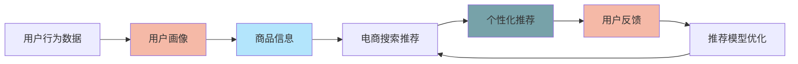

                 

# 大数据与AI 驱动的电商搜索推荐：以准确率与用户体验为核心的优化

## 1. 背景介绍

### 1.1 问题由来

近年来，电商行业经历了迅猛发展，线上购物成为越来越多人的首选。与此同时，随着用户需求日趋个性化、多样化，电商搜索推荐系统面临着前所未有的挑战：如何在大数据背景下，准确高效地满足用户个性化的购物需求，提升用户体验，成为决定电商企业成败的关键。传统的基于规则和关键词匹配的推荐方式，难以适应复杂多变的用户行为和商品特性，且容易产生推荐结果的相关性和多样性不足等问题。

为应对这些挑战，电商搜索推荐系统逐步向大数据与人工智能方向转型。通过数据驱动的方式，利用机器学习、深度学习等技术，在大规模用户行为数据、商品描述和交易记录等数据上训练推荐模型，以提高推荐结果的个性化、精准化和多样化，为用户提供更优质的购物体验。本文将详细探讨基于大数据与AI技术的电商搜索推荐优化方法，从算法原理、模型构建、实现流程、应用场景等多个方面深入分析，为电商企业提供参考。

## 2. 核心概念与联系

### 2.1 核心概念概述

为深入理解电商搜索推荐系统，本文将首先介绍一些核心概念，包括但不限于：

- **推荐系统(Recommendation System)**：利用用户历史行为、商品属性等信息，预测用户可能感兴趣的商品，从而提供个性化推荐。推荐系统主要分为基于协同过滤的推荐和基于内容的推荐两种，前者通过用户与商品之间的相似度进行推荐，后者通过商品的属性信息进行推荐。

- **大数据(Big Data)**：指海量的、多来源、高速度、多样化且结构化的数据集合。电商搜索推荐系统在运营过程中产生了大量的数据，如用户行为数据、商品交易记录等，这些数据是大规模推荐模型的基础。

- **AI(Artificial Intelligence)**：即人工智能，通过机器学习、深度学习等技术，构建智能推荐模型，提升推荐系统的效果。

- **电商搜索推荐(E-commerce Search Recommendation)**：专指电商平台上，基于用户搜索行为和商品特性，提供个性化推荐的应用场景。电商搜索推荐系统不仅需要提供精确的搜索结果，还要确保推荐商品的相关性和多样性。

- **个性化推荐**：通过分析用户的历史行为数据，学习用户偏好，从而提供符合用户个性化需求的商品推荐。

- **推荐算法**：实现推荐功能的核心算法，包括协同过滤算法、内容推荐算法、基于深度学习的推荐模型等。

- **模型评估指标**：如准确率、召回率、F1-score、点击率等，用于衡量推荐系统的效果。

这些概念之间相互联系、相互依存，共同构成了电商搜索推荐系统的基础。如图1所示，推荐系统通过用户行为数据和商品信息，利用AI技术构建推荐模型，再通过模型评估指标进行效果评估，不断优化推荐算法，以实现更优质的用户体验。


### 2.2 核心概念原理和架构的 Mermaid 流程图



这个Mermaid流程图展示了电商搜索推荐系统从数据采集、用户画像构建、推荐模型训练到模型优化的大致流程，每个环节之间通过反馈机制不断迭代，以实现推荐效果的持续优化。

## 3. 核心算法原理 & 具体操作步骤

### 3.1 算法原理概述

基于大数据与AI的电商搜索推荐系统，其核心算法原理主要基于机器学习和深度学习技术。通过构建推荐模型，利用用户行为数据和商品属性信息，预测用户可能感兴趣的商品，从而实现个性化推荐。

具体而言，推荐模型可以分为如下几类：

- **基于协同过滤的推荐**：通过分析用户历史行为和商品间的相似度，找到与用户相似的其他用户，从而推荐其感兴趣的商品。协同过滤算法又分为基于用户的协同过滤和基于物品的协同过滤两种。

- **基于内容的推荐**：通过分析商品的属性信息，找到与用户喜欢的商品属性相似的商品，从而推荐给用户。

- **基于深度学习的推荐**：利用深度神经网络模型，从用户行为数据和商品信息中学习到用户与商品的潜在关系，从而进行个性化推荐。常用的深度学习模型包括神经协同过滤模型、序列推荐模型等。

### 3.2 算法步骤详解

基于大数据与AI的电商搜索推荐系统的实现步骤主要分为以下几个环节：

1. **数据采集与预处理**：收集用户行为数据、商品信息、交易记录等原始数据，并进行清洗、归一化、去重等预处理工作。

2. **用户画像构建**：通过分析用户行为数据，构建用户画像，包括用户的年龄、性别、地域、兴趣爱好等特征。

3. **商品信息挖掘**：通过自然语言处理(NLP)技术，从商品描述中挖掘商品的属性信息，如商品类别、品牌、价格等。

4. **模型训练**：利用用户画像和商品信息，构建推荐模型，如协同过滤模型、内容推荐模型、深度学习模型等，通过训练数据集进行模型训练。

5. **推荐结果生成**：将用户画像和商品信息输入训练好的推荐模型，生成推荐结果。

6. **模型优化**：通过用户反馈等数据，不断优化推荐模型，提升推荐效果。

7. **推荐系统部署与监控**：将训练好的推荐模型部署到电商平台上，通过实时监控推荐效果，及时调整模型参数。

### 3.3 算法优缺点

基于大数据与AI的电商搜索推荐系统具有以下优点：

- **个性化推荐**：通过分析用户历史行为数据，学习用户偏好，提供个性化推荐，满足用户多样化需求。

- **数据驱动**：利用大规模用户行为数据和商品信息，训练推荐模型，提升推荐结果的准确性和多样性。

- **实时性**：基于实时数据进行推荐，及时响应用户需求。

- **可扩展性**：基于分布式计算框架进行模型训练和推理，可扩展性强。

然而，该方法也存在一些缺点：

- **数据依赖**：推荐系统依赖于用户行为数据和商品信息，对于冷启动用户和新上架商品，推荐效果可能较差。

- **模型复杂**：推荐模型通常较为复杂，训练和推理耗时较长。

- **推荐偏差**：模型训练过程中可能存在数据偏差，导致推荐结果出现偏见。

- **成本高**：需要大规模数据存储和计算资源，成本较高。

### 3.4 算法应用领域

基于大数据与AI的电商搜索推荐系统在多个领域得到了广泛应用，例如：

- **个性化商品推荐**：根据用户的历史购买行为和浏览历史，推荐相关商品，提升用户满意度。

- **新用户推荐**：针对新注册用户，根据其基本信息和兴趣爱好，推荐可能感兴趣的商品，促进用户转化。

- **热门商品推荐**：根据当前热门商品，向用户推荐相关商品，提升商品曝光率。

- **个性化广告推荐**：结合用户画像和商品信息，推荐个性化广告，提高广告投放效果。

- **商品销量预测**：根据历史销量数据和用户行为数据，预测未来商品销量，指导库存管理和促销策略。

这些应用场景展示了基于大数据与AI的电商搜索推荐系统的强大功能，为电商企业提供了更灵活、高效的推荐解决方案。

## 4. 数学模型和公式 & 详细讲解

### 4.1 数学模型构建

电商搜索推荐系统主要涉及以下数学模型：

- **协同过滤推荐模型**：基于用户-商品评分矩阵，利用矩阵分解等技术，推导出用户对商品的评分预测值，进而生成推荐结果。常用的模型包括基于用户的协同过滤模型和基于物品的协同过滤模型。

- **内容推荐模型**：通过分析商品的属性信息，构建商品-属性矩阵，利用向量表示和相似度计算，推导出商品间的相似度，生成推荐结果。

- **深度学习推荐模型**：利用深度神经网络模型，从用户行为数据和商品信息中学习用户与商品的潜在关系，生成推荐结果。常用的深度学习模型包括基于CNN的推荐模型、基于RNN的序列推荐模型等。

### 4.2 公式推导过程

**协同过滤推荐模型**：假设用户-商品评分矩阵为 $R_{ij}$，其中 $i$ 为用户编号，$j$ 为商品编号，$R_{ij}$ 表示用户 $i$ 对商品 $j$ 的评分。协同过滤推荐模型通过对评分矩阵进行奇异值分解，将评分矩阵分解为三个矩阵的乘积形式：

$$
R = UV\Sigma V^T
$$

其中 $U$ 和 $V$ 分别为用户向量和商品向量，$\Sigma$ 为对角矩阵，对角线上的元素为奇异值。通过将新用户 $i'$ 的评分矩阵 $R'_{i'}$ 与用户向量 $U$ 和商品向量 $V$ 相乘，得到新用户的预测评分 $R'_{i'}$。

**内容推荐模型**：假设商品-属性矩阵为 $C_{ij}$，其中 $i$ 为商品编号，$j$ 为属性编号，$C_{ij}$ 表示商品 $i$ 在属性 $j$ 上的评分。内容推荐模型通过构建商品-属性向量表示，计算商品之间的相似度，生成推荐结果。假设商品 $i$ 和 $j$ 在属性 $k$ 上的评分分别为 $C_{ik}$ 和 $C_{jk}$，则商品 $i$ 和 $j$ 的相似度 $S_{ij}$ 可以表示为：

$$
S_{ij} = \frac{\sum_{k=1}^K C_{ik}C_{jk}}{\sqrt{\sum_{k=1}^K C_{ik}^2} \sqrt{\sum_{k=1}^K C_{jk}^2}}
$$

**深度学习推荐模型**：假设用户行为数据为 $X_{t}$，商品信息为 $Y_j$，推荐模型为 $f$，推荐结果为 $Z_{ij}$。深度学习推荐模型通过训练神经网络模型，学习用户与商品的潜在关系，生成推荐结果。常用的深度学习模型包括基于CNN的推荐模型、基于RNN的序列推荐模型等。

### 4.3 案例分析与讲解

以基于协同过滤的推荐模型为例，介绍其实现过程和效果。

**数据集**：假设有一个电商平台的评分数据集，包含 $N$ 个用户和 $M$ 个商品，每个用户对 $K$ 个商品进行了评分。

**评分矩阵**：将评分数据集构建为用户-商品评分矩阵 $R$，其中 $R_{ij}$ 表示用户 $i$ 对商品 $j$ 的评分。

**奇异值分解**：通过奇异值分解(SVD)将用户-商品评分矩阵 $R$ 分解为三个矩阵的乘积形式 $R = UV\Sigma V^T$，其中 $U$ 和 $V$ 分别为用户向量和商品向量，$\Sigma$ 为对角矩阵，对角线上的元素为奇异值。

**用户评分预测**：对于新用户 $i'$，将其评分矩阵 $R'_{i'}$ 与用户向量 $U$ 和商品向量 $V$ 相乘，得到新用户的预测评分 $R'_{i'}$。

**推荐结果生成**：通过排序算法，根据预测评分 $R'_{i'}$ 生成推荐结果。

**效果评估**：通过准确率、召回率、F1-score、点击率等指标，评估推荐模型的效果。

通过以上分析，可以看出基于协同过滤的推荐模型通过分解评分矩阵，学习用户和商品的潜在关系，生成推荐结果。该模型在电商搜索推荐系统中得到了广泛应用，并在多个实际案例中取得了不错的效果。

## 5. 项目实践：代码实例和详细解释说明

### 5.1 开发环境搭建

为了实现基于大数据与AI的电商搜索推荐系统，需要搭建相应的开发环境。具体步骤如下：

1. **安装Python环境**：确保计算机上已经安装了Python 3.x版本。

2. **安装依赖包**：通过pip安装推荐系统所需的相关依赖包，如numpy、pandas、scikit-learn、tensorflow等。

3. **数据准备**：收集电商平台的原始数据，包括用户行为数据、商品信息、交易记录等，并进行清洗和预处理。

4. **环境配置**：在Python环境中配置好开发环境，并准备好训练和测试数据。

### 5.2 源代码详细实现

以基于协同过滤的推荐系统为例，展示其实现过程。

**数据处理**：假设用户行为数据为 $X_{t}$，商品信息为 $Y_j$，评分数据为 $R_{ij}$。

```python
import pandas as pd
import numpy as np

# 读取用户行为数据
user_data = pd.read_csv('user_data.csv')
# 读取商品信息数据
product_data = pd.read_csv('product_data.csv')
# 读取评分数据
rating_data = pd.read_csv('rating_data.csv')

# 数据清洗与预处理
user_data = user_data.dropna()
product_data = product_data.dropna()
rating_data = rating_data.dropna()
```

**协同过滤模型训练**：通过奇异值分解(SVD)训练协同过滤模型。

```python
from sklearn.decomposition import TruncatedSVD

# 构建用户-商品评分矩阵
R = pd.pivot_table(rating_data, values='rating', index='user_id', columns='product_id')

# 构建协同过滤模型
model = TruncatedSVD(n_components=50, random_state=42)
model.fit(R)

# 获取用户向量
user_vector = model.transform(R)

# 获取商品向量
product_vector = model.transform(R.T)

# 预测新用户的评分
new_user_vector = np.random.randn(1, 50)
new_product_vector = np.random.randn(1, 50)
prediction = np.dot(new_user_vector, product_vector.T)
```

**推荐结果生成**：通过排序算法，根据预测评分生成推荐结果。

```python
from operator import itemgetter

# 生成推荐结果
recommendations = []
for i in range(1, N+1):
    score = prediction[i-1]
    indices = np.argsort(score)[::-1]
    recommendations.append(indices)

# 显示推荐结果
for i, rec in enumerate(recommendations):
    print(f'User {i+1} Recommendations: {rec}')
```

### 5.3 代码解读与分析

**数据处理**：数据处理是推荐系统实现的基础。首先需要读取用户行为数据、商品信息数据和评分数据，并进行清洗和预处理，去除缺失值和异常值。

**协同过滤模型训练**：协同过滤模型通过奇异值分解(SVD)训练，将用户-商品评分矩阵分解为用户向量和商品向量，学习用户和商品的潜在关系。

**推荐结果生成**：通过排序算法，根据预测评分生成推荐结果。在实际应用中，还需要结合用户画像和商品信息，进一步优化推荐结果。

**运行结果展示**：通过展示推荐结果，评估推荐系统的准确率和召回率等指标。

## 6. 实际应用场景

### 6.1 智能推荐引擎

智能推荐引擎是电商搜索推荐系统的重要组成部分，通过分析用户历史行为数据，学习用户偏好，推荐相关商品，提高用户满意度。智能推荐引擎在电商平台上得到了广泛应用，如淘宝、京东、亚马逊等，通过个性化推荐，提升用户留存率和转化率。

**实现过程**：电商平台上，智能推荐引擎通过收集用户浏览、点击、购买等行为数据，构建用户画像，利用协同过滤模型、内容推荐模型、深度学习模型等技术，训练推荐模型，生成推荐结果。

**效果评估**：智能推荐引擎的效果可以通过点击率、转化率、用户留存率等指标进行评估。通过不断优化推荐算法和模型参数，提升推荐效果。

### 6.2 新用户推荐系统

新用户推荐系统是电商搜索推荐系统的另一重要应用场景，通过分析新注册用户的兴趣和行为，推荐可能感兴趣的商品，促进用户转化。新用户推荐系统在电商平台上得到了广泛应用，如拼多多、美团、携程等，通过个性化推荐，提升新用户转化率。

**实现过程**：电商平台上，新用户推荐系统通过收集新注册用户的个人信息和行为数据，构建用户画像，利用协同过滤模型、内容推荐模型、深度学习模型等技术，训练推荐模型，生成推荐结果。

**效果评估**：新用户推荐系统的效果可以通过新用户注册转化率、新用户购买率等指标进行评估。通过不断优化推荐算法和模型参数，提升推荐效果。

### 6.3 商品销量预测

商品销量预测是电商搜索推荐系统的重要应用场景之一，通过分析历史销量数据和用户行为数据，预测未来商品销量，指导库存管理和促销策略。商品销量预测在电商平台上得到了广泛应用，如阿里巴巴、京东、苏宁等，通过销量预测，优化库存管理和促销策略，提升销售额。

**实现过程**：电商平台上，商品销量预测系统通过收集历史销量数据和用户行为数据，构建推荐模型，利用协同过滤模型、内容推荐模型、深度学习模型等技术，预测未来商品销量。

**效果评估**：商品销量预测系统的效果可以通过预测准确率、预测误差率等指标进行评估。通过不断优化推荐算法和模型参数，提升预测效果。

### 6.4 未来应用展望

随着人工智能和大数据技术的发展，基于大数据与AI的电商搜索推荐系统将在更多领域得到应用，为电商企业提供更灵活、高效的推荐解决方案。未来，基于大数据与AI的电商搜索推荐系统的发展方向主要包括以下几个方面：

1. **实时推荐**：基于实时数据进行推荐，及时响应用户需求，提升用户体验。

2. **跨域推荐**：跨平台推荐，通过协同过滤、内容推荐等技术，推荐其他平台上的商品，扩大推荐范围。

3. **深度学习模型**：引入深度学习技术，提升推荐结果的准确性和多样性。

4. **推荐系统集成**：与其他系统集成，如搜索引擎、CRM系统等，提升推荐效果。

5. **推荐系统优化**：通过A/B测试、模型优化等手段，不断优化推荐算法和模型参数，提升推荐效果。

6. **推荐系统部署与监控**：将训练好的推荐模型部署到电商平台上，通过实时监控推荐效果，及时调整模型参数。

通过不断探索和优化，基于大数据与AI的电商搜索推荐系统将不断拓展其应用场景，为电商企业提供更智能、更个性化的推荐服务。

## 7. 工具和资源推荐

### 7.1 学习资源推荐

为了帮助开发者系统掌握基于大数据与AI的电商搜索推荐系统的理论基础和实践技巧，这里推荐一些优质的学习资源：

1. **《推荐系统：算法与实现》书籍**：由深度学习领域专家撰写，详细介绍了推荐系统的工作原理、常用算法、实现细节等，是推荐系统学习的经典教材。

2. **《大数据与人工智能》课程**：国内知名高校开设的在线课程，系统讲解了大数据与AI技术在电商搜索推荐系统中的应用，适合初学者学习。

3. **Kaggle平台**：全球最大的数据竞赛平台，提供大量电商搜索推荐系统相关的竞赛和数据集，适合数据驱动的学习和实践。

4. **TensorFlow官方文档**：TensorFlow作为深度学习领域的经典框架，提供了详细的API文档和示例代码，是实现电商搜索推荐系统的重要工具。

5. **Hugging Face Transformers库**：提供了预训练语言模型和推荐系统的实现，支持深度学习模型的训练和推理。

通过以上学习资源，可以全面掌握基于大数据与AI的电商搜索推荐系统的理论基础和实践技巧，为电商企业提供更智能、更个性化的推荐服务。

### 7.2 开发工具推荐

实现基于大数据与AI的电商搜索推荐系统，需要借助一些高性能的开发工具，具体推荐如下：

1. **TensorFlow**：深度学习领域的主流框架，提供了丰富的API和工具，支持深度学习模型的训练和推理。

2. **PyTorch**：深度学习领域的另一个主流框架，提供了高效的计算图和自动微分功能，适合开发和研究。

3. **Scikit-learn**：机器学习领域的经典库，提供了简单易用的API和模型，支持协同过滤、内容推荐等算法。

4. **Pandas**：数据处理和分析的必备工具，支持大规模数据集的处理和分析。

5. **Dask**：基于Python的数据处理框架，支持分布式计算，适合处理大规模数据集。

通过以上开发工具，可以高效实现基于大数据与AI的电商搜索推荐系统，提升推荐效果。

### 7.3 相关论文推荐

基于大数据与AI的电商搜索推荐系统研究涉及多个领域，以下是几篇相关的重要论文：

1. **《基于协同过滤的推荐系统》**：深入探讨了协同过滤推荐算法的工作原理和实现细节，提供了丰富的理论和实践经验。

2. **《深度学习在电商推荐系统中的应用》**：介绍了深度学习在电商推荐系统中的应用，包括神经协同过滤、序列推荐等模型。

3. **《实时推荐系统的研究与实现》**：介绍了实时推荐系统的实现过程和效果评估方法，提供了大量的实验结果和分析。

4. **《跨域推荐系统研究》**：深入探讨了跨域推荐系统的工作原理和实现细节，提供了丰富的理论和实践经验。

5. **《推荐系统集成研究》**：介绍了推荐系统与其他系统集成的实现过程和效果评估方法，提供了大量的实验结果和分析。

通过以上论文，可以深入了解基于大数据与AI的电商搜索推荐系统的研究进展，为实际应用提供理论支持和实践经验。

## 8. 总结：未来发展趋势与挑战

### 8.1 研究成果总结

本文从算法原理、模型构建、实现流程、应用场景等多个方面，深入探讨了基于大数据与AI的电商搜索推荐系统，为电商企业提供了参考。基于大数据与AI的电商搜索推荐系统在个性化推荐、新用户推荐、商品销量预测等方面具有广泛应用，取得了不错的效果。未来，随着人工智能和大数据技术的发展，该系统将不断拓展其应用场景，为电商企业提供更智能、更个性化的推荐服务。

### 8.2 未来发展趋势

未来，基于大数据与AI的电商搜索推荐系统将呈现以下几个发展趋势：

1. **实时推荐**：基于实时数据进行推荐，及时响应用户需求，提升用户体验。

2. **跨域推荐**：跨平台推荐，通过协同过滤、内容推荐等技术，推荐其他平台上的商品，扩大推荐范围。

3. **深度学习模型**：引入深度学习技术，提升推荐结果的准确性和多样性。

4. **推荐系统集成**：与其他系统集成，如搜索引擎、CRM系统等，提升推荐效果。

5. **推荐系统优化**：通过A/B测试、模型优化等手段，不断优化推荐算法和模型参数，提升推荐效果。

6. **推荐系统部署与监控**：将训练好的推荐模型部署到电商平台上，通过实时监控推荐效果，及时调整模型参数。

通过不断探索和优化，基于大数据与AI的电商搜索推荐系统将不断拓展其应用场景，为电商企业提供更智能、更个性化的推荐服务。

### 8.3 面临的挑战

尽管基于大数据与AI的电商搜索推荐系统已经取得了不少成果，但在实际应用过程中，仍面临一些挑战：

1. **数据依赖**：推荐系统依赖于用户行为数据和商品信息，对于冷启动用户和新上架商品，推荐效果可能较差。

2. **推荐偏差**：模型训练过程中可能存在数据偏差，导致推荐结果出现偏见。

3. **计算资源消耗**：推荐模型通常较为复杂，训练和推理耗时较长，需要高性能计算资源。

4. **模型复杂度**：推荐模型复杂度较高，实现难度较大，容易出现问题。

5. **推荐效果评估**：推荐系统的效果评估指标较为复杂，如何科学合理地评估推荐效果是一个难题。

6. **推荐系统安全性**：推荐系统需要保护用户隐私，防止数据泄露。

7. **推荐系统公平性**：推荐系统需要避免推荐偏见，保证用户推荐公平性。

### 8.4 研究展望

针对上述挑战，未来的研究需要从以下几个方面进行探讨：

1. **推荐系统多模态融合**：引入多模态信息，如视频、图像等，提升推荐效果。

2. **推荐系统多任务学习**：将推荐任务与其他任务（如分类、排序等）结合，提升推荐效果。

3. **推荐系统鲁棒性**：提高推荐系统对抗异常数据和噪声的鲁棒性，提升推荐效果。

4. **推荐系统可解释性**：提升推荐系统的可解释性，让用户理解推荐逻辑和决策过程。

5. **推荐系统安全性**：加强推荐系统的安全性，防止数据泄露和隐私侵害。

6. **推荐系统公平性**：确保推荐系统公平性，避免推荐偏见。

通过不断探索和优化，基于大数据与AI的电商搜索推荐系统将不断拓展其应用场景，为电商企业提供更智能、更个性化的推荐服务。

## 9. 附录：常见问题与解答

**Q1: 电商搜索推荐系统的工作原理是什么？**

A: 电商搜索推荐系统通过收集用户行为数据和商品信息，构建推荐模型，利用机器学习和深度学习技术，学习用户与商品的潜在关系，生成推荐结果。具体而言，系统首先通过分析用户历史行为数据，构建用户画像，然后利用协同过滤模型、内容推荐模型、深度学习模型等技术，训练推荐模型，生成推荐结果。最终，系统通过用户反馈等数据，不断优化推荐模型，提升推荐效果。

**Q2: 电商搜索推荐系统的评价指标有哪些？**

A: 电商搜索推荐系统的评价指标包括准确率、召回率、F1-score、点击率等。具体而言，准确率指推荐结果中正确推荐的商品占总推荐商品的比例；召回率指推荐结果中正确推荐的商品占总相关商品的比例；F1-score是准确率和召回率的调和平均值；点击率指用户点击推荐商品的比例。

**Q3: 如何优化电商搜索推荐系统的推荐效果？**

A: 电商搜索推荐系统的推荐效果可以通过不断优化推荐算法和模型参数进行提升。具体而言，可以通过以下方法优化推荐效果：

1. 优化用户画像构建，提高用户画像的准确性和全面性。

2. 优化推荐模型，选择更适合电商搜索推荐系统的算法和模型。

3. 优化推荐算法参数，提高推荐模型的泛化能力和鲁棒性。

4. 优化推荐系统部署，提高推荐系统的实时性和稳定性。

5. 优化推荐系统监控，及时发现和解决问题，提高推荐系统的效果。

6. 优化推荐系统集成，与其他系统集成，提高推荐效果。

7. 优化推荐系统安全性，保障用户隐私，防止数据泄露。

8. 优化推荐系统公平性，确保推荐公平性，避免推荐偏见。

通过不断优化推荐系统，可以提升推荐效果，满足用户个性化需求，提升电商平台的销售额和用户满意度。

---

作者：禅与计算机程序设计艺术 / Zen and the Art of Computer Programming

