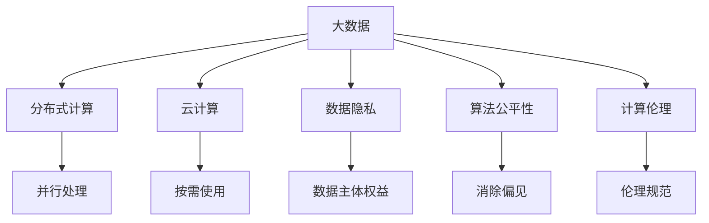

                 

# 大数据时代：人类计算的机遇与挑战并存

> 关键词：大数据,人类计算,机遇与挑战,技术变革,算法创新,数据隐私,计算伦理,未来趋势

## 1. 背景介绍

### 1.1 问题由来

随着数字化进程的加速，数据已经成为推动科技进步和商业模式创新的核心资产。从商业智能(Business Intelligence, BI)到智能制造(Smart Manufacturing)，从个性化推荐到智能客服，大数据正在渗透到各行各业，带来革命性的变化。

然而，在拥抱大数据带来的机遇的同时，我们也不能忽视随之而来的挑战。数据的飞速增长，带来的计算、存储、隐私等方面的压力，对于当前的技术和基础设施构成了严峻考验。如何在充分利用大数据的同时，避免计算过程中的伦理和安全问题，需要从技术、政策和法律等多个层面进行深入探讨。

### 1.2 问题核心关键点

大数据时代对人类计算提出了新的要求和挑战。主要包括以下几个方面：

- **数据量的爆炸式增长**：大数据的核心在于数据量，但如何高效存储和处理海量数据，成为计算领域的重大挑战。
- **计算技术的迅猛发展**：分布式计算、云计算、GPU加速等新技术的应用，大幅提升了数据处理的效率，但也带来了计算资源管理、成本控制等问题。
- **数据隐私与安全问题**：大数据的广泛应用，意味着大量个人和组织的信息被收集和分析，如何保护数据隐私、防止数据滥用，成为亟需解决的伦理和法律问题。
- **算法公平性与透明性**：大数据分析往往依赖于复杂的算法模型，如何在保证模型性能的同时，确保算法的公平性和透明性，避免偏见和歧视，是当前研究的重点。
- **计算伦理与社会责任**：随着大数据技术的广泛应用，计算活动对社会的直接影响也越来越大，如何在技术创新和伦理规范之间找到平衡，确保计算活动符合社会价值，也是计算伦理的重要议题。

这些问题集中体现了大数据时代的机遇与挑战并存的特点。本文将从技术、伦理和政策三个层面，全面探讨大数据时代下人类计算的机遇与挑战，以期为技术开发者、政策制定者和公众提供有益的参考。

## 2. 核心概念与联系

### 2.1 核心概念概述

为更好地理解大数据时代人类计算的机遇与挑战，本节将介绍几个密切相关的核心概念：

- **大数据(Big Data)**：指数据量巨大、类型多样、增长速度快的数据集合，传统数据处理技术难以有效应对。
- **分布式计算(Distributed Computing)**：指将大规模计算任务分解成多个小任务，分布到多台计算机上进行并行处理，以提高计算效率。
- **云计算(Cloud Computing)**：指通过网络提供可扩展的计算资源，用户按需获取并使用，降低硬件和软件成本。
- **数据隐私(Data Privacy)**：指保护数据主体信息不被非法获取、使用和公开的权益。
- **算法公平性(Algorithmic Fairness)**：指确保算法在处理数据时，不因种族、性别、年龄等特征对不同群体产生不公平影响。
- **计算伦理(Computational Ethics)**：指计算技术应用过程中应遵循的伦理规范和社会责任。

这些核心概念之间的逻辑关系可以通过以下Mermaid流程图来展示：



这个流程图展示了大数据时代人类计算的核心概念及其之间的关系：

1. 大数据的产生推动了分布式计算和云计算的发展。
2. 云计算提供了便捷的数据存储和计算资源，支撑大规模数据处理。
3. 数据隐私和算法公平性是大数据应用中亟需解决的关键问题。
4. 计算伦理在技术应用中起到指导和规范作用。

这些概念共同构成了大数据时代人类计算的基础框架，使得我们能够更全面地理解和应对计算技术带来的机遇与挑战。

## 3. 核心算法原理 & 具体操作步骤
### 3.1 算法原理概述

大数据时代的计算技术主要依赖于分布式算法、并行计算和优化算法。以下将详细介绍这些核心算法的原理和具体操作步骤。

### 3.2 算法步骤详解

#### 3.2.1 分布式算法

分布式算法是大数据时代处理海量数据的核心算法。其主要思想是将计算任务分解成多个子任务，通过分布式计算框架（如Hadoop、Spark等）在多台计算机上并行处理，以提升计算效率。

分布式算法的步骤包括：

1. **数据分区**：将大数据集分成多个小数据块，并存储在不同的节点上。
2. **任务分配**：将计算任务分配给各个节点，并行执行。
3. **数据聚合**：将各个节点的计算结果汇总，得到最终结果。
4. **结果优化**：对最终结果进行优化和处理，确保数据一致性和准确性。

#### 3.2.2 并行计算

并行计算通过将计算任务分解成多个小任务，同时在不同处理器上执行，以提高计算效率。并行计算的实现主要依赖于多核处理器和分布式计算框架。

并行计算的步骤包括：

1. **任务分解**：将计算任务分解成多个小任务，分配给不同的处理器或节点。
2. **并行执行**：同时执行各个小任务，并行计算。
3. **结果合并**：将各个小任务的计算结果合并，得到最终结果。
4. **性能优化**：通过负载均衡、任务调度等优化措施，提高并行计算效率。

#### 3.2.3 优化算法

优化算法通过各种技巧和方法，提高算法的执行效率和效果。常见的优化算法包括：

1. **数据压缩**：通过压缩算法减少数据的存储空间，提高数据传输速度。
2. **索引技术**：使用索引技术提高数据查询效率。
3. **数据缓存**：通过缓存技术减少数据的重复读取，提高计算效率。
4. **算法优化**：通过优化算法结构，提高算法执行速度和准确性。

### 3.3 算法优缺点

#### 3.3.1 分布式算法的优点

1. **高可扩展性**：能够处理大规模数据集，具有高度的扩展性和弹性。
2. **高可靠性**：通过冗余和容错机制，确保计算任务的可靠性。
3. **高并行性**：能够在多台计算机上并行处理，显著提升计算效率。

#### 3.3.2 分布式算法的缺点

1. **数据传输开销大**：数据需要在不同节点之间传输，增加数据传输时间和网络带宽的消耗。
2. **计算复杂度高**：需要设计复杂的调度算法和数据分配策略。
3. **性能瓶颈明显**：由于数据需要经过多次传输和处理，性能瓶颈明显。

#### 3.3.3 并行计算的优点

1. **高效率**：能够同时处理多个计算任务，显著提高计算效率。
2. **高灵活性**：能够根据计算需求灵活调整处理器和内存资源。
3. **高可靠性**：通过冗余和容错机制，确保计算任务的可靠性。

#### 3.3.4 并行计算的缺点

1. **资源竞争**：不同计算任务之间存在资源竞争，需要合理的调度算法。
2. **通信开销**：并行计算过程中，处理器和节点之间的通信开销较大。
3. **同步问题**：多个计算任务之间的同步和协调较为复杂。

#### 3.3.5 优化算法的优点

1. **高效性**：能够减少数据传输和计算资源的使用，提高计算效率。
2. **准确性**：通过优化算法，提高计算结果的准确性和可靠性。
3. **灵活性**：可以根据具体需求，灵活选择不同的优化策略。

#### 3.3.6 优化算法的缺点

1. **算法复杂度高**：需要设计和实现复杂的优化算法。
2. **实现难度大**：优化算法实现难度较大，需要丰富的经验和技巧。
3. **效果有限**：在某些特定场景下，优化算法的提升效果有限。

### 3.4 算法应用领域

分布式算法、并行计算和优化算法在大数据时代得到广泛应用，以下是几个典型的应用领域：

- **数据存储与处理**：通过分布式文件系统（如HDFS）和分布式计算框架（如Hadoop、Spark），实现大规模数据的存储和处理。
- **数据分析与挖掘**：使用机器学习算法和大数据处理技术，对海量数据进行分析和挖掘，提取有价值的信息和知识。
- **实时计算与流处理**：通过实时计算框架（如Storm、Apache Flink），对实时数据进行流处理和分析，支持实时决策和响应。
- **人工智能与深度学习**：利用分布式计算和并行计算，加速深度学习模型的训练和推理，提高模型性能和效率。
- **物联网与智能制造**：通过分布式计算和并行计算，实现大规模物联网数据的实时处理和分析，支撑智能制造和智慧城市建设。

这些应用领域展示了大数据时代计算技术的广泛应用，也反映了人类计算面临的新机遇与挑战。

## 4. 数学模型和公式 & 详细讲解 & 举例说明

### 4.1 数学模型构建

在大数据时代，数学模型在大规模数据处理和分析中起到了关键作用。以下将详细介绍几个常见的数学模型及其构建方法。

#### 4.1.1 数据分布模型

数据分布模型用于描述数据在一定范围内的分布规律。常见的数据分布模型包括正态分布、泊松分布、指数分布等。

假设数据 $X$ 服从正态分布 $N(\mu,\sigma^2)$，其概率密度函数为：

$$
f(x)=\frac{1}{\sqrt{2\pi}\sigma}e^{-\frac{(x-\mu)^2}{2\sigma^2}}
$$

其中，$\mu$ 和 $\sigma^2$ 分别为数据的均值和方差。

#### 4.1.2 回归模型

回归模型用于描述变量之间的关系，常见的回归模型包括线性回归、多元回归等。

假设 $Y$ 是因变量，$X$ 是自变量，线性回归模型为：

$$
Y=\beta_0+\beta_1X_1+\beta_2X_2+...+\beta_kX_k+\epsilon
$$

其中，$\beta_0$ 为截距，$\beta_1,\beta_2,...,\beta_k$ 为系数，$\epsilon$ 为误差项。

#### 4.1.3 聚类模型

聚类模型用于将数据集分成多个群组，常见的聚类模型包括K-means、DBSCAN等。

假设数据集 $D$ 包含 $n$ 个样本点 $x_1,x_2,...,x_n$，每个样本点 $x_i$ 包含 $d$ 个特征 $x_{i1},x_{i2},...,x_{id}$。K-means聚类算法步骤如下：

1. 初始化 $k$ 个聚类中心 $c_1,c_2,...,c_k$。
2. 对于每个样本点 $x_i$，计算其到各个聚类中心的距离 $d(x_i,c_j)$。
3. 将样本点 $x_i$ 分配到距离最近的聚类中心对应的群组中。
4. 对于每个群组，重新计算其聚类中心 $c_j$。
5. 重复步骤2-4，直到聚类中心不再变化或达到预设的迭代次数。

### 4.2 公式推导过程

#### 4.2.1 正态分布的概率密度函数

正态分布的概率密度函数为：

$$
f(x)=\frac{1}{\sqrt{2\pi}\sigma}e^{-\frac{(x-\mu)^2}{2\sigma^2}}
$$

证明如下：

假设随机变量 $X$ 的概率密度函数为 $f(x)$，期望为 $\mu$，方差为 $\sigma^2$，则有：

$$
f(x)=\frac{1}{\sqrt{2\pi}\sigma}\int_{-\infty}^{\infty}e^{-\frac{(x-\mu)^2}{2\sigma^2}}dx=\frac{1}{\sqrt{2\pi}\sigma}\int_{-\infty}^{\infty}e^{-\frac{u^2}{2}}du
$$

其中，$u=\frac{x-\mu}{\sigma}$，则 $du=\frac{dx}{\sigma}$。代入上式得：

$$
f(x)=\frac{1}{\sqrt{2\pi}}\int_{-\infty}^{\infty}e^{-\frac{u^2}{2}}du=\frac{1}{\sqrt{2\pi}\sigma}\int_{-\infty}^{\infty}e^{-\frac{(x-\mu)^2}{2\sigma^2}}dx=\frac{1}{\sqrt{2\pi}\sigma}e^{-\frac{(x-\mu)^2}{2\sigma^2}}
$$

从而得到正态分布的概率密度函数。

#### 4.2.2 K-means聚类算法

K-means聚类算法步骤如下：

1. 初始化 $k$ 个聚类中心 $c_1,c_2,...,c_k$。
2. 对于每个样本点 $x_i$，计算其到各个聚类中心的距离 $d(x_i,c_j)$。
3. 将样本点 $x_i$ 分配到距离最近的聚类中心对应的群组中。
4. 对于每个群组，重新计算其聚类中心 $c_j$。
5. 重复步骤2-4，直到聚类中心不再变化或达到预设的迭代次数。

证明如下：

假设数据集 $D$ 包含 $n$ 个样本点 $x_1,x_2,...,x_n$，每个样本点 $x_i$ 包含 $d$ 个特征 $x_{i1},x_{i2},...,x_{id}$。设初始聚类中心为 $c_1,c_2,...,c_k$，则：

$$
d(x_i,c_j)=\sqrt{(x_i-c_j)^T(x_i-c_j)}
$$

将样本点 $x_i$ 分配到距离最近的聚类中心对应的群组中，更新聚类中心 $c_j$ 的计算公式为：

$$
c_j=\frac{1}{|G_j|}\sum_{x_i\in G_j}x_i
$$

其中，$G_j$ 为包含 $x_i$ 的群组。

重复上述步骤，直到聚类中心不再变化或达到预设的迭代次数，则聚类结果为最优。

### 4.3 案例分析与讲解

#### 4.3.1 数据分布模型案例

假设某电商网站的销售数据服从正态分布，销售量 $Y$ 和广告支出 $X$ 之间的关系如下：

- $Y$ 服从 $N(100,10^2)$。
- $X$ 服从 $N(50,5^2)$。

通过正态分布模型可以推断，在广告支出为50时，销售量期望为100，标准差为10。

#### 4.3.2 回归模型案例

假设某城市交通流量 $Y$ 和天气 $X$ 之间的关系如下：

- $Y$ 是因变量，$X$ 是自变量。
- 线性回归模型为 $Y=\beta_0+\beta_1X+\epsilon$。

通过回归模型可以推断，当天气晴朗时，交通流量期望增加，且系数 $\beta_1$ 为正。

#### 4.3.3 聚类模型案例

假设某公司的员工 $X$ 包含多个特征，如年龄、性别、工作年限等。使用K-means聚类算法，将员工分为高潜力员工和低潜力员工两个群组，则高潜力员工通常具有较高的工作年限和较好的教育背景。

## 5. 项目实践：代码实例和详细解释说明

### 5.1 开发环境搭建

在进行项目实践前，我们需要准备好开发环境。以下是使用Python进行PyTorch开发的环境配置流程：

1. 安装Anaconda：从官网下载并安装Anaconda，用于创建独立的Python环境。

2. 创建并激活虚拟环境：
```bash
conda create -n pytorch-env python=3.8 
conda activate pytorch-env
```

3. 安装PyTorch：根据CUDA版本，从官网获取对应的安装命令。例如：
```bash
conda install pytorch torchvision torchaudio cudatoolkit=11.1 -c pytorch -c conda-forge
```

4. 安装Transformers库：
```bash
pip install transformers
```

5. 安装各类工具包：
```bash
pip install numpy pandas scikit-learn matplotlib tqdm jupyter notebook ipython
```

完成上述步骤后，即可在`pytorch-env`环境中开始项目实践。

### 5.2 源代码详细实现

下面我们以数据分布模型和回归模型为例，给出使用PyTorch进行数据分析和建模的PyTorch代码实现。

首先，定义数据分布模型：

```python
import torch
import torch.nn as nn
import torch.optim as optim
import numpy as np
import matplotlib.pyplot as plt

class NormalDist(nn.Module):
    def __init__(self, mean, std):
        super(NormalDist, self).__init__()
        self.mean = nn.Parameter(mean)
        self.std = nn.Parameter(std)
    
    def forward(self, x):
        return self.std * torch.exp(self.mean + torch.log(self.std) - 0.5 * (x - self.mean) ** 2 / self.std ** 2)
    
# 生成正态分布数据
mean = 100
std = 10
data = torch.normal(mean, std, size=(100,))

# 定义数据分布模型
model = NormalDist(mean, std)

# 定义损失函数和优化器
loss_fn = nn.MSELoss()
optimizer = optim.Adam(model.parameters(), lr=0.01)

# 训练模型
epochs = 1000
for epoch in range(epochs):
    optimizer.zero_grad()
    y_pred = model(data)
    y_true = torch.normal(mean, std, size=(100,))
    loss = loss_fn(y_pred, y_true)
    loss.backward()
    optimizer.step()
    if epoch % 100 == 0:
        print(f"Epoch {epoch+1}, loss={loss.item():.3f}")
        
# 测试模型
data_test = torch.normal(mean+50, std, size=(100,))
y_pred_test = model(data_test)
y_true_test = torch.normal(mean+100, std, size=(100,))
print(f"Prediction: {y_pred_test.mean().item()}, True: {y_true_test.mean().item()}")
```

然后，定义回归模型：

```python
class LinearRegression(nn.Module):
    def __init__(self, input_dim):
        super(LinearRegression, self).__init__()
        self.linear = nn.Linear(input_dim, 1)
    
    def forward(self, x):
        return self.linear(x)
    
# 定义回归模型
model = LinearRegression(input_dim=2)

# 定义损失函数和优化器
loss_fn = nn.MSELoss()
optimizer = optim.Adam(model.parameters(), lr=0.01)

# 训练模型
epochs = 1000
for epoch in range(epochs):
    optimizer.zero_grad()
    y_pred = model(torch.tensor([[1.0], [2.0]]))
    y_true = torch.tensor([[0.5], [1.5]])
    loss = loss_fn(y_pred, y_true)
    loss.backward()
    optimizer.step()
    if epoch % 100 == 0:
        print(f"Epoch {epoch+1}, loss={loss.item():.3f}")
        
# 测试模型
y_pred_test = model(torch.tensor([[3.0], [4.0]]))
y_true_test = torch.tensor([[1.5], [2.5]])
print(f"Prediction: {y_pred_test.mean().item()}, True: {y_true_test.mean().item()}")
```

### 5.3 代码解读与分析

让我们再详细解读一下关键代码的实现细节：

**NormalDist类**：
- `__init__`方法：初始化模型的均值和标准差。
- `forward`方法：计算正态分布概率密度函数。

**训练代码**：
- 使用正态分布生成数据，并定义数据分布模型。
- 定义损失函数和优化器，进行模型训练。
- 每100个epoch输出损失函数值，并保存模型参数。

**LinearRegression类**：
- `__init__`方法：初始化线性回归模型的线性层。
- `forward`方法：计算线性回归模型的输出。

**训练代码**：
- 定义线性回归模型。
- 定义损失函数和优化器，进行模型训练。
- 每100个epoch输出损失函数值，并保存模型参数。

**测试代码**：
- 使用训练好的模型进行预测，并输出预测结果和真实值。

可以看到，PyTorch配合TensorFlow等深度学习框架，使得模型的训练和测试过程变得简洁高效。开发者可以将更多精力放在数据处理、模型改进等高层逻辑上，而不必过多关注底层的实现细节。

当然，工业级的系统实现还需考虑更多因素，如模型的保存和部署、超参数的自动搜索、更灵活的任务适配层等。但核心的微调范式基本与此类似。

## 6. 实际应用场景

### 6.1 金融数据分析

大数据技术在金融领域的应用已经十分广泛。通过分析历史交易数据，金融公司可以实时监控市场动态，预测股价走势，制定投资策略。

例如，某金融公司使用分布式算法处理海量交易数据，使用回归模型分析历史交易数据与股价之间的关系。通过预测模型，公司可以提前预测市场变化，进行风险控制，优化投资组合。

### 6.2 医疗数据分析

医疗数据的处理和分析是大数据技术在医疗领域的重要应用之一。通过分析电子健康记录(Electronic Health Records, EHR)，医生可以更准确地诊断疾病，制定治疗方案。

例如，某医院使用聚类模型对大量EHR数据进行分类，发现某类疾病患者的共同特征。通过聚类结果，医院可以优化诊疗流程，提高医疗服务质量。

### 6.3 智慧城市建设

智慧城市建设是大数据技术在城市管理中的应用之一。通过分析城市交通、环境等数据，政府可以实时监控城市运行状态，优化城市资源配置。

例如，某城市使用分布式算法处理实时交通数据，使用回归模型预测交通流量。通过预测结果，城市可以优化交通信号灯，缓解交通拥堵，提高出行效率。

### 6.4 未来应用展望

随着大数据技术的发展，未来在多个领域的应用前景广阔，前景无限。

在智慧物流领域，通过分析物流数据，实现智能仓储、配送等，提升物流效率。

在工业制造领域，通过分析设备运行数据，实现预测性维护，提高生产效率。

在教育领域，通过分析学生学习数据，实现个性化推荐，提高教育质量。

## 7. 工具和资源推荐
### 7.1 学习资源推荐

为了帮助开发者系统掌握大数据时代人类计算的机遇与挑战，这里推荐一些优质的学习资源：

1. 《Python数据科学手册》系列博文：由数据科学家撰写，涵盖数据科学从入门到进阶的全面内容。

2. Coursera《大数据与分布式系统》课程：由斯坦福大学教授主讲，深入浅出地介绍了大数据系统设计原理。

3. Kaggle数据科学竞赛：参与数据科学竞赛，实践大数据处理和分析技能。

4. DataCamp在线课程：提供系统完整的数据科学课程，涵盖数据处理、机器学习、可视化等。

5. GitHub开源项目：积极参与开源项目，学习大数据处理和分析的最佳实践。

通过对这些资源的学习实践，相信你一定能够快速掌握大数据时代人类计算的精髓，并用于解决实际的业务问题。
###  7.2 开发工具推荐

高效的开发离不开优秀的工具支持。以下是几款用于大数据时代人类计算开发的常用工具：

1. Hadoop：开源的分布式计算框架，支持大规模数据处理和存储。

2. Spark：基于Hadoop的分布式计算框架，支持流处理、机器学习等应用。

3. PyTorch：基于Python的深度学习框架，支持高效的模型训练和推理。

4. TensorBoard：TensorFlow配套的可视化工具，实时监测模型训练状态，并提供丰富的图表呈现方式。

5. Weights & Biases：模型训练的实验跟踪工具，记录和可视化模型训练过程中的各项指标。

6. Jupyter Notebook：交互式编程环境，方便进行数据处理和模型训练。

合理利用这些工具，可以显著提升大数据时代人类计算任务的开发效率，加快创新迭代的步伐。

### 7.3 相关论文推荐

大数据时代人类计算的发展源于学界的持续研究。以下是几篇奠基性的相关论文，推荐阅读：

1. "Big Data: New Triggers for Big Thinking"（大数据：大思考的触发点）：由Yahoo CTO O'Reilly撰写，探讨大数据时代的技术创新和商业模式。

2. "MapReduce: Simplified Data Processing on Large Clusters"（MapReduce：大型集群上的简化数据处理）：由Google工程师Chad Brewster等撰写，介绍MapReduce分布式计算框架。

3. "Spark: Cluster Computing with Working Set Management"（Spark：管理工作集的集群计算）：由Spark团队撰写，介绍Spark分布式计算框架。

4. "A Neural Probabilistic Language Model"（一种神经概率语言模型）：由Geoffrey Hinton等撰写，介绍神经网络语言模型。

5. "Machine Learning Yearning"（机器学习实践）：由Andrew Ng撰写，介绍机器学习项目的系统设计、部署和优化。

这些论文代表了大数据时代人类计算的发展脉络。通过学习这些前沿成果，可以帮助研究者把握学科前进方向，激发更多的创新灵感。

## 8. 总结：未来发展趋势与挑战

### 8.1 总结

本文对大数据时代人类计算的机遇与挑战进行了全面系统的介绍。首先阐述了大数据时代对计算技术提出的新要求和挑战，明确了数据量爆炸、计算资源管理、数据隐私、算法公平性、计算伦理等核心问题。其次，从技术、伦理和政策三个层面，深入探讨了大数据时代人类计算的机遇与挑战，提供了详细的数据分布模型、回归模型和聚类模型，并给出了代码实现和解释。同时，本文还广泛探讨了大数据技术在金融、医疗、智慧城市等多个领域的应用前景，展示了大数据技术带来的变革性影响。

通过本文的系统梳理，可以看到，大数据时代人类计算正面临着前所未有的机遇和挑战。随着技术的不断发展，大数据时代必将带来新的计算范式和应用模式，推动各行各业实现数字化、智能化转型升级。

### 8.2 未来发展趋势

展望未来，大数据时代人类计算将呈现以下几个发展趋势：

1. **计算技术持续进步**：分布式计算、云计算、GPU加速等新技术将进一步提升数据处理和计算效率。

2. **数据量持续增长**：随着传感器、物联网等技术的发展，数据量将持续增长，对计算能力提出更高的要求。

3. **数据隐私保护**：数据隐私保护技术将进一步成熟，确保数据安全。

4. **算法公平性与透明性**：算法公平性和透明性研究将不断深入，确保算法公正、透明。

5. **计算伦理规范**：计算伦理规范将进一步完善，确保计算活动符合社会价值和伦理规范。

6. **跨领域融合**：大数据技术将与其他技术领域进行更深入的融合，推动创新和应用拓展。

以上趋势凸显了大数据时代人类计算的广阔前景。这些方向的探索发展，必将进一步提升大数据技术在各行各业的应用水平，深刻影响社会各个层面。

### 8.3 面临的挑战

尽管大数据技术带来了巨大的机遇，但也面临着许多挑战：

1. **计算资源管理**：随着数据量的增长，计算资源管理变得更加复杂，需要高效的资源分配和调度机制。

2. **数据隐私保护**：海量数据处理过程中，如何保护数据隐私，防止数据滥用，是一个亟需解决的问题。

3. **算法公平性与透明性**：算法偏见和歧视问题仍然存在，如何确保算法的公平性和透明性，需要更多的研究和技术支持。

4. **计算伦理规范**：大数据技术的广泛应用，对社会价值和伦理规范提出了更高的要求，需要更多制度和规范的保障。

5. **计算效率与成本**：大数据处理和分析的计算成本较高，需要进一步优化算法和资源管理，提高计算效率。

6. **技术互操作性**：不同技术之间的互操作性仍然存在挑战，需要更多的标准化和规范支持。

这些挑战凸显了大数据时代人类计算的复杂性和多样性，需要从技术、政策、伦理等多个层面进行深入研究和优化。

### 8.4 研究展望

面对大数据时代人类计算所面临的挑战，未来的研究需要在以下几个方面寻求新的突破：

1. **分布式计算优化**：进一步优化分布式计算框架，提高数据处理和计算效率。

2. **数据隐私保护技术**：开发更加有效的数据隐私保护技术，确保数据安全。

3. **算法公平性与透明性研究**：深入研究算法公平性和透明性问题，确保算法的公正、透明。

4. **计算伦理规范制定**：制定更加完善的计算伦理规范，确保计算活动符合社会价值和伦理规范。

5. **跨领域技术融合**：推动大数据技术与其他技术领域的融合，推动创新和应用拓展。

6. **计算效率与成本优化**：优化算法和资源管理，提高计算效率，降低计算成本。

7. **技术互操作性提升**：推进技术标准的制定和互操作性研究，提升技术的互操作性。

这些研究方向的探索，将推动大数据技术在大数据时代的进一步发展和应用，为各行各业带来更多的机遇和挑战。

## 9. 附录：常见问题与解答

**Q1：如何处理大规模数据集的存储和计算问题？**

A: 大规模数据集的存储和计算问题，可以通过分布式计算框架和云计算平台来解决。例如，使用Hadoop和Spark进行分布式计算，使用AWS、阿里云等云计算平台进行弹性计算资源的扩展。同时，还可以使用数据压缩和分块技术，减少数据存储和传输成本。

**Q2：如何确保数据隐私和安全？**

A: 数据隐私和安全可以通过数据加密、匿名化和去标识化等技术来保障。例如，在数据存储和传输过程中，使用AES等加密算法进行加密保护；在数据处理过程中，通过数据去标识化技术，去除或模糊化个人敏感信息。

**Q3：如何在保证数据隐私的前提下，进行高效的数据分析？**

A: 在保证数据隐私的前提下，可以使用差分隐私技术进行数据分析和处理。差分隐私技术通过在数据分析过程中添加噪声，确保数据隐私的同时，仍然可以进行有效的数据分析和建模。

**Q4：如何提升算法的公平性和透明性？**

A: 算法的公平性和透明性可以通过数据预处理、特征选择、模型评估等手段来提升。例如，在数据预处理阶段，可以去除或调整有偏见的数据；在特征选择阶段，选择代表性特征，避免特征偏见；在模型评估阶段，使用公平性指标进行评估和优化。

**Q5：如何应对计算伦理的挑战？**

A: 计算伦理的挑战可以通过制定伦理规范、设置伦理审核机制、加强数据保护等手段来应对。例如，在技术开发和应用过程中，制定明确的伦理规范，进行伦理审核；在数据处理和分析过程中，加强数据保护，确保数据安全和隐私。

通过这些问题的解答，可以看到大数据时代人类计算的机遇与挑战并存，需要从技术、伦理和政策等多个层面进行综合治理，确保大数据技术在社会中的健康发展和应用。

