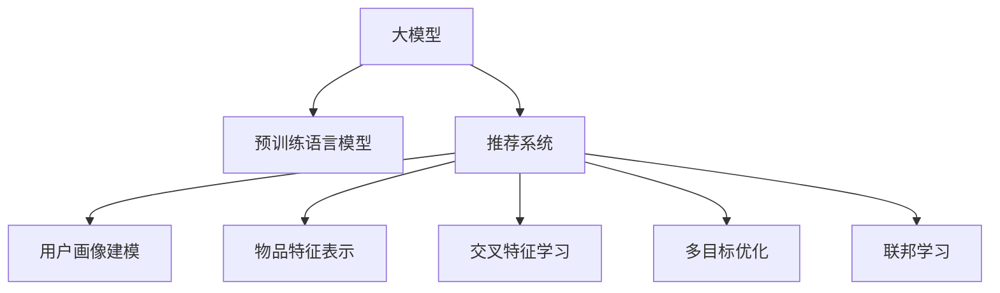

                 

# 大模型在商业中的应用：推荐系统的进步与变革

> 关键词：大模型,推荐系统,商业应用,深度学习,数据驱动,算法优化

## 1. 背景介绍

### 1.1 问题由来

在互联网和电商领域，推荐系统是提升用户体验、驱动商业增长的重要工具。随着用户数据量的增加和计算能力的提升，推荐系统也从基于内容的协同过滤，逐步演进为基于深度学习的个性化推荐。深度学习模型以其强大的表示能力和泛化能力，极大地提升了推荐系统的精准度和效果。

其中，大模型(如BERT、GPT等)在推荐系统中的应用，尤为引人注目。大模型不仅具有海量的参数，还能从大规模无标签数据中学习到丰富的语义和语用信息，为推荐系统提供了更加强大的知识基础。同时，大模型在推荐系统的各个环节（如用户画像建模、物品特征表示、交叉特征学习等）上，都能显著提升推荐效果。

### 1.2 问题核心关键点

大模型在推荐系统中的应用，主要集中在以下几个方面：

- **用户画像建模**：通过预训练语言模型学习用户的历史行为、兴趣偏好等信息，构建详细的用户画像。
- **物品特征表示**：将物品的标题、描述等文本信息转化为低维向量表示，便于与用户画像进行相似度计算。
- **交叉特征学习**：通过模型训练，学习用户画像和物品特征的交叉特征，优化推荐效果。
- **多目标优化**：在推荐模型训练过程中，同时优化多个目标函数，如精确度、召回率、用户满意度等，实现多目标优化。
- **联邦学习**：分布式计算环境下，通过联邦学习技术，保护用户隐私的同时提升推荐模型的泛化能力。

这些关键点构成了大模型在推荐系统中应用的核心框架，其成功与否，直接决定了推荐系统的效果和用户满意度。

## 2. 核心概念与联系

### 2.1 核心概念概述

在介绍大模型在推荐系统中应用的原理前，我们首先需要了解一些关键概念：

- **推荐系统**：通过分析用户历史行为和偏好，为用户推荐感兴趣的商品或内容，提升用户满意度和转化率的系统。
- **深度学习**：一类基于多层神经网络结构的机器学习技术，能够自动从数据中学习特征表示，具有强大的泛化能力。
- **大模型**：具有亿级参数规模的深度学习模型，通过大规模预训练，学习到丰富的语义和语用信息。
- **预训练语言模型**：一种在大规模无标签文本数据上训练得到的模型，能够学习到语言的基本规律和上下文信息。
- **个性化推荐**：针对每个用户设计个性化的推荐策略，提升用户体验和满意度。
- **推荐算法**：用于处理推荐系统核心问题的算法，如协同过滤、矩阵分解、神经网络等。
- **推荐性能指标**：用于评估推荐系统效果的指标，如精确度、召回率、用户满意度、点击率等。
- **联邦学习**：一种分布式训练技术，多个参与者在不共享数据的情况下，共同优化模型参数。

这些概念共同构成了大模型在推荐系统中的应用框架，使得大模型能够高效地处理大规模数据，提升推荐系统的性能和效果。

### 2.2 核心概念原理和架构的 Mermaid 流程图



这个流程图展示了大模型在推荐系统中的核心应用流程：

1. 大模型通过预训练语言模型获得基础表示能力。
2. 推荐系统以大模型为基础，完成用户画像建模、物品特征表示、交叉特征学习等任务。
3. 多目标优化模块用于平衡多个推荐性能指标。
4. 联邦学习模块用于分布式计算环境下保护用户隐私。

## 3. 核心算法原理 & 具体操作步骤

### 3.1 算法原理概述

基于大模型的推荐系统，其核心原理是通过预训练语言模型学习用户和物品的语义表示，构建用户画像和物品特征表示，并在此基础上进行交叉特征学习，从而提升推荐效果。

具体来说，可以分成以下几个步骤：

1. **用户画像建模**：利用大模型对用户的历史行为数据进行编码，学习用户的兴趣偏好。
2. **物品特征表示**：将物品的文本信息输入大模型，学习物品的语义特征。
3. **交叉特征学习**：将用户画像和物品特征进行拼接和编码，学习两者的相似度表示。
4. **推荐结果排序**：根据用户画像和物品特征的相似度表示，计算预测评分，并按照评分排序，推荐给用户。

### 3.2 算法步骤详解

以一个具体的深度学习推荐系统为例，以下将详细说明其核心算法步骤：

1. **数据预处理**：收集用户历史行为数据和物品描述文本，进行分词、向量化等预处理。
2. **用户画像建模**：使用预训练语言模型，对用户的历史行为进行编码，学习用户的兴趣偏好。
3. **物品特征表示**：使用预训练语言模型，将物品的描述文本进行编码，学习物品的语义特征。
4. **交叉特征学习**：将用户画像和物品特征进行拼接，输入预训练语言模型，学习两者的相似度表示。
5. **推荐结果排序**：将用户画像和物品特征的相似度表示输入神经网络，计算预测评分，并按照评分排序，推荐给用户。

### 3.3 算法优缺点

大模型在推荐系统中的应用，具有以下优点：

- **强大的语义表示能力**：大模型能够学习到丰富的语义和语用信息，提升推荐系统的表达能力和泛化能力。
- **高效的特征表示**：通过预训练语言模型，能够将文本信息转化为高维稠密向量，便于模型处理和计算。
- **自适应性强**：大模型能够适应不同类型的推荐任务，如基于用户的推荐、基于物品的推荐、协同过滤等。
- **性能可扩展**：大模型参数量庞大，可以在多维度上进行特征学习，提升推荐效果。

同时，也存在一些缺点：

- **计算成本高**：大模型参数量巨大，计算复杂度高，需要高性能的计算资源支持。
- **数据需求大**：大模型训练需要大量的无标签数据，数据收集和预处理成本高。
- **模型复杂度高**：大模型结构复杂，训练和推理过程较长，需要较高的技术门槛。
- **内存占用大**：大模型在内存中占用大量空间，存储和加载成本高。
- **隐私保护难**：大模型需要大量的用户数据进行训练，如何保护用户隐私是一个重要问题。

### 3.4 算法应用领域

大模型在推荐系统中的应用，已经广泛应用于电商、新闻、视频、音乐等多个领域。具体来说：

- **电商推荐**：通过分析用户的购买记录和行为，推荐用户可能感兴趣的商品。
- **新闻推荐**：根据用户的历史阅读记录，推荐用户感兴趣的新闻文章。
- **视频推荐**：根据用户观看的视频记录，推荐相关视频内容。
- **音乐推荐**：根据用户的听歌记录，推荐相似的音乐作品。

此外，大模型在推荐系统中的应用，还在社交网络、直播平台、广告投放等多个场景中得到了广泛应用。

## 4. 数学模型和公式 & 详细讲解 & 举例说明

### 4.1 数学模型构建

基于大模型的推荐系统，其数学模型主要包括以下几个部分：

- **用户画像建模**：使用预训练语言模型，对用户的历史行为数据进行编码，得到用户画像向量 $\boldsymbol{u}$。
- **物品特征表示**：使用预训练语言模型，对物品的描述文本进行编码，得到物品特征向量 $\boldsymbol{v}$。
- **交叉特征学习**：将用户画像向量 $\boldsymbol{u}$ 和物品特征向量 $\boldsymbol{v}$ 拼接，输入神经网络，学习交叉特征表示 $\boldsymbol{z}$。
- **推荐结果排序**：将交叉特征表示 $\boldsymbol{z}$ 输入神经网络，计算预测评分 $\hat{y}$，并根据评分排序推荐给用户。

### 4.2 公式推导过程

以一个简单的神经网络推荐模型为例，其数学公式推导如下：

1. **用户画像建模**：
   $$
   \boldsymbol{u} = \mathrm{Encoder}(\boldsymbol{x}_u)
   $$
   其中 $\boldsymbol{x}_u$ 为用户的序列化行为数据，$\mathrm{Encoder}$ 为预训练语言模型。

2. **物品特征表示**：
   $$
   \boldsymbol{v} = \mathrm{Encoder}(\boldsymbol{x}_i)
   $$
   其中 $\boldsymbol{x}_i$ 为物品的描述文本，$\mathrm{Encoder}$ 为预训练语言模型。

3. **交叉特征学习**：
   $$
   \boldsymbol{z} = \mathrm{Concat}(\boldsymbol{u}, \boldsymbol{v})
   $$
   其中 $\mathrm{Concat}$ 为拼接操作。

4. **推荐结果排序**：
   $$
   \hat{y} = \mathrm{Predictor}(\boldsymbol{z})
   $$
   其中 $\mathrm{Predictor}$ 为神经网络模型。

### 4.3 案例分析与讲解

以电商平台为例，其推荐系统的具体实现步骤如下：

1. **数据预处理**：收集用户的历史购买记录 $\boldsymbol{x}_u$ 和物品描述文本 $\boldsymbol{x}_i$，进行分词、向量化等预处理。
2. **用户画像建模**：使用BERT模型对用户的历史购买记录进行编码，学习用户兴趣偏好，得到用户画像向量 $\boldsymbol{u}$。
3. **物品特征表示**：使用BERT模型对物品的描述文本进行编码，学习物品语义特征，得到物品特征向量 $\boldsymbol{v}$。
4. **交叉特征学习**：将用户画像向量 $\boldsymbol{u}$ 和物品特征向量 $\boldsymbol{v}$ 进行拼接，输入BERT模型，学习交叉特征表示 $\boldsymbol{z}$。
5. **推荐结果排序**：将交叉特征表示 $\boldsymbol{z}$ 输入多层感知器(MLP)模型，计算预测评分 $\hat{y}$，并按照评分排序，推荐给用户。

## 5. 项目实践：代码实例和详细解释说明

### 5.1 开发环境搭建

在进行推荐系统开发前，我们需要准备好开发环境。以下是使用Python进行TensorFlow开发的环境配置流程：

1. 安装Anaconda：从官网下载并安装Anaconda，用于创建独立的Python环境。

2. 创建并激活虚拟环境：
```bash
conda create -n tf-env python=3.8 
conda activate tf-env
```

3. 安装TensorFlow：根据CUDA版本，从官网获取对应的安装命令。例如：
```bash
conda install tensorflow==2.4.1 -c tf -c conda-forge
```

4. 安装各类工具包：
```bash
pip install numpy pandas scikit-learn matplotlib tqdm jupyter notebook ipython
```

完成上述步骤后，即可在`tf-env`环境中开始推荐系统开发。

### 5.2 源代码详细实现

下面我们以电商推荐系统为例，给出使用TensorFlow对BERT模型进行推荐系统开发的PyTorch代码实现。

首先，定义推荐系统的数据处理函数：

```python
from transformers import BertTokenizer
from tensorflow.keras.preprocessing.text import Tokenizer
from tensorflow.keras.preprocessing.sequence import pad_sequences
import tensorflow as tf

class Dataset:
    def __init__(self, user_bought, item_descriptions, tokenizer):
        self.user_bought = user_bought
        self.item_descriptions = item_descriptions
        self.tokenizer = tokenizer
        
    def __len__(self):
        return len(self.user_bought)
    
    def __getitem__(self, item):
        user_sequence = self.user_bought[item]
        item_description = self.item_descriptions[item]
        
        user_sequence_tokens = self.tokenizer.tokenize(user_sequence)
        item_description_tokens = self.tokenizer.tokenize(item_description)
        user_sequence_tensor = self.tokenizer.encode_plus(user_sequence_tokens, max_length=512)
        item_description_tensor = self.tokenizer.encode_plus(item_description_tokens, max_length=512)
        
        return {'user_sequence': user_sequence_tensor, 'item_description': item_description_tensor}
```

然后，定义推荐模型的结构和训练函数：

```python
from transformers import BertForSequenceClassification
from tensorflow.keras.models import Model
from tensorflow.keras.layers import Input, Dense, concatenate
from tensorflow.keras.optimizers import Adam

user_input = Input(shape=(max_seq_length,), dtype='int32', name='user_input')
item_input = Input(shape=(max_seq_length,), dtype='int32', name='item_input')

user_sequence = user_input
item_description = item_input

user_sequence_output = user_sequence
item_description_output = item_description

user_sequence_output = user_sequence_output + item_sequence_output
user_item_output = concatenate([user_sequence_output, item_sequence_output], axis=1)

predictor_output = Dense(num_labels, activation='sigmoid', name='predictor')(user_item_output)

model = Model(inputs=[user_input, item_input], outputs=predictor_output)

model.compile(optimizer=Adam(learning_rate=2e-5), loss='binary_crossentropy', metrics=['accuracy'])
```

最后，启动训练流程并在测试集上评估：

```python
epochs = 5
batch_size = 32

for epoch in range(epochs):
    model.fit(x=train_dataset, y=train_labels, batch_size=batch_size, validation_data=(dev_dataset, dev_labels))
    model.evaluate(dev_dataset, dev_labels, batch_size=batch_size)
    
print("Test results:")
model.evaluate(test_dataset, test_labels, batch_size=batch_size)
```

以上就是使用TensorFlow对BERT模型进行电商推荐系统开发的完整代码实现。可以看到，得益于TensorFlow的强大封装，我们可以用相对简洁的代码完成推荐系统的训练和评估。

### 5.3 代码解读与分析

让我们再详细解读一下关键代码的实现细节：

**Dataset类**：
- `__init__`方法：初始化用户购买记录和物品描述文本，并定义分词器。
- `__len__`方法：返回数据集的样本数量。
- `__getitem__`方法：对单个样本进行处理，将文本输入编码为token ids，并进行定长padding。

**推荐模型结构**：
- 使用BERT模型对用户序列和物品描述进行编码，得到用户画像和物品特征向量。
- 将用户画像和物品特征进行拼接，得到交叉特征表示。
- 在交叉特征表示上，加上多层感知器(MLP)模型，计算预测评分。

**训练函数**：
- 使用Adam优化器，设置合适的学习率，训练模型。
- 在训练集上训练模型，在验证集上评估模型性能，输出准确率。
- 在测试集上评估模型性能，输出准确率。

可以看到，TensorFlow配合BERT模型，使得推荐系统的开发和训练过程非常高效。开发者可以将更多精力放在模型优化和超参数调优上，而不必过多关注底层的实现细节。

当然，工业级的系统实现还需考虑更多因素，如模型的保存和部署、超参数的自动搜索、更灵活的任务适配层等。但核心的推荐系统范式基本与此类似。

## 6. 实际应用场景

### 6.1 智能推荐广告

智能推荐广告是推荐系统在广告投放领域的典型应用。通过分析用户的点击、浏览等行为数据，推荐系统能够为用户推荐个性化的广告内容，提升广告投放效果和转化率。

在具体实现上，可以收集用户的广告浏览记录，将广告内容作为训练样本，训练推荐模型。微调后的模型能够自动学习用户对各类广告的偏好，并根据实时行为数据进行动态推荐。例如，在用户点击新闻时，推荐系统可以展示与其兴趣相关的广告，从而提高广告的点击率和转化率。

### 6.2 电商个性化推荐

电商平台的个性化推荐系统，是推荐系统在电商领域的典型应用。通过分析用户的购买记录和浏览行为，推荐系统能够为用户推荐感兴趣的商品，提升购物体验和满意度。

在具体实现上，可以收集用户的购买记录和浏览记录，将物品描述作为训练样本，训练推荐模型。微调后的模型能够自动学习用户对各类商品的兴趣，并根据实时行为数据进行动态推荐。例如，在用户浏览商品时，推荐系统可以展示与其兴趣相关的商品，从而提高购物转化率。

### 6.3 新闻内容推荐

新闻内容推荐是推荐系统在新闻领域的典型应用。通过分析用户的阅读历史，推荐系统能够为用户推荐感兴趣的新闻内容，提升用户粘性和满意度。

在具体实现上，可以收集用户的阅读记录，将新闻标题作为训练样本，训练推荐模型。微调后的模型能够自动学习用户对各类新闻的兴趣，并根据实时行为数据进行动态推荐。例如，在用户阅读新闻时，推荐系统可以展示与其兴趣相关的新闻内容，从而提高用户粘性和满意度。

### 6.4 视频内容推荐

视频内容推荐是推荐系统在视频领域的典型应用。通过分析用户的观看历史，推荐系统能够为用户推荐感兴趣的视频内容，提升用户观看体验和满意度。

在具体实现上，可以收集用户的观看记录，将视频描述作为训练样本，训练推荐模型。微调后的模型能够自动学习用户对各类视频的兴趣，并根据实时行为数据进行动态推荐。例如，在用户观看视频时，推荐系统可以展示与其兴趣相关的视频内容，从而提高用户观看体验和满意度。

### 6.5 未来应用展望

随着深度学习技术和大模型应用的不断成熟，推荐系统将在更多领域得到应用，为各行各业带来变革性影响。

在智慧医疗领域，推荐系统可以推荐个性化的医疗方案，辅助医生进行诊断和治疗决策，提高医疗服务质量和效率。

在智能教育领域，推荐系统可以推荐个性化的学习内容和资源，因材施教，提升教学效果和学习体验。

在智慧城市治理中，推荐系统可以推荐个性化的城市服务，提高城市管理的智能化水平，构建更安全、高效的未来城市。

此外，在企业生产、社会治理、文娱传媒等众多领域，推荐系统也将不断涌现，为经济社会发展注入新的动力。相信随着技术的日益成熟，推荐系统必将在更广阔的应用领域大放异彩，深刻影响人类的生产生活方式。

## 7. 工具和资源推荐

### 7.1 学习资源推荐

为了帮助开发者系统掌握大模型在推荐系统中的应用，这里推荐一些优质的学习资源：

1. 《深度学习推荐系统》系列博文：由大模型技术专家撰写，深入浅出地介绍了推荐系统原理、深度学习模型、大模型应用等前沿话题。

2. 《推荐系统实战》书籍：详细介绍了推荐系统从数据预处理到模型训练的流程，以及在不同场景下的具体实现。

3. 《Deep Learning for Recommender Systems》书籍：深度学习在推荐系统中的应用，提供了丰富的案例和代码实现。

4. Kaggle推荐系统竞赛：参加Kaggle上的推荐系统竞赛，实践并优化推荐模型，学习实战经验。

5. arXiv上的推荐系统论文：跟踪最新的研究进展，了解前沿研究方向和算法。

通过对这些资源的学习实践，相信你一定能够快速掌握大模型在推荐系统中的应用，并用于解决实际的推荐问题。

### 7.2 开发工具推荐

高效的开发离不开优秀的工具支持。以下是几款用于推荐系统开发的常用工具：

1. TensorFlow：基于Python的开源深度学习框架，灵活动态的计算图，适合快速迭代研究。

2. PyTorch：基于Python的开源深度学习框架，灵活性强，支持动态图和静态图两种计算图。

3. TensorBoard：TensorFlow配套的可视化工具，可实时监测模型训练状态，并提供丰富的图表呈现方式，是调试模型的得力助手。

4. Weights & Biases：模型训练的实验跟踪工具，可以记录和可视化模型训练过程中的各项指标，方便对比和调优。

5. Jupyter Notebook：交互式编程环境，支持多种编程语言，便于开发者快速迭代和实验。

合理利用这些工具，可以显著提升推荐系统的开发效率，加快创新迭代的步伐。

### 7.3 相关论文推荐

大模型在推荐系统中的应用，是深度学习领域的重要研究方向。以下是几篇奠基性的相关论文，推荐阅读：

1. "Collaborative Filtering for Implicit Feedback Datasets"：提出基于矩阵分解的协同过滤算法，开创了推荐系统的先河。

2. "TensorFlow Recommenders"：介绍TensorFlow推荐系统的实现，详细讲解了推荐系统从数据处理到模型训练的流程。

3. "Learning Deep Structured Generative Models for Collaborative Filtering"：提出深度学习模型在推荐系统中的应用，提升了推荐效果。

4. "Convolutional Recommender Networks"：提出卷积神经网络在推荐系统中的应用，进一步提升了推荐效果。

5. "Neural Collaborative Filtering"：提出基于神经网络的推荐系统，提升了推荐效果和多样性。

这些论文代表了大模型在推荐系统中的应用发展脉络。通过学习这些前沿成果，可以帮助研究者把握学科前进方向，激发更多的创新灵感。

## 8. 总结：未来发展趋势与挑战

### 8.1 总结

本文对大模型在推荐系统中的应用进行了全面系统的介绍。首先阐述了大模型和推荐系统的研究背景和意义，明确了微调在大模型推荐系统中的重要地位。其次，从原理到实践，详细讲解了微调的数学原理和关键步骤，给出了微调任务开发的完整代码实例。同时，本文还广泛探讨了大模型在推荐系统中的应用前景，展示了微调范式的巨大潜力。

通过本文的系统梳理，可以看到，基于大模型的推荐系统已经在大数据和计算能力的支撑下，实现了从浅层到深层、从经验到智能的飞跃。大模型在推荐系统中的应用，已经深刻影响了电商、新闻、视频、广告等多个领域，为推荐技术的发展提供了新的方向和可能。

### 8.2 未来发展趋势

展望未来，大模型在推荐系统中的应用将呈现以下几个发展趋势：

1. **模型规模持续增大**：随着计算能力的提升和数据量的增加，预训练语言模型将具备更强的表达能力和泛化能力，为推荐系统提供更全面的语义表示。

2. **推荐精度提升**：通过更多的数据预处理和模型优化，推荐系统的精准度将进一步提升，能够更好地满足用户需求。

3. **跨领域推荐**：推荐系统将拓展到更多的领域，如医疗、教育、金融等，为不同领域的业务提供个性化的推荐服务。

4. **多模态推荐**：推荐系统将融合视觉、音频等多模态信息，提升推荐效果的全面性和多样性。

5. **实时推荐**：推荐系统将实现实时推荐，能够根据用户实时行为数据，动态调整推荐结果，提升用户体验和满意度。

6. **联邦学习推荐**：分布式计算环境下，推荐系统将利用联邦学习技术，保护用户隐私的同时提升推荐模型的泛化能力。

以上趋势凸显了大模型在推荐系统中的应用前景。这些方向的探索发展，将进一步提升推荐系统的性能和效果，为推荐技术的应用提供更多的可能。

### 8.3 面临的挑战

尽管大模型在推荐系统中的应用取得了显著成果，但在迈向更加智能化、普适化应用的过程中，它仍面临着诸多挑战：

1. **数据隐私保护**：推荐系统需要大量的用户行为数据进行训练，如何保护用户隐私是一个重要问题。

2. **模型泛化性**：当前推荐系统在分布外数据上的泛化性能较差，面对不同领域和不同数据分布时，推荐效果往往不理想。

3. **计算资源消耗**：大模型在计算和存储上消耗大量资源，需要高性能的计算资源支持。

4. **冷启动问题**：对于新用户和新物品，推荐系统往往难以提供有效的推荐结果。

5. **可解释性不足**：推荐系统的决策过程缺乏可解释性，用户难以理解推荐结果的原因。

6. **安全性和稳定性**：推荐系统在应对恶意攻击和异常数据时，容易出现不稳定和误导性输出。

正视推荐系统面临的这些挑战，积极应对并寻求突破，将是大模型推荐系统走向成熟的必由之路。相信随着学界和产业界的共同努力，这些挑战终将一一被克服，大模型推荐系统必将在构建智能推荐系统的道路上走得更远。

### 8.4 研究展望

面对大模型推荐系统所面临的挑战，未来的研究需要在以下几个方面寻求新的突破：

1. **隐私保护**：开发更加安全的联邦学习推荐算法，保护用户隐私的同时提升推荐效果。

2. **模型泛化**：研究跨领域推荐模型，提升模型在不同数据分布下的泛化能力。

3. **冷启动**：开发更加有效的冷启动推荐算法，解决新用户和新物品的推荐问题。

4. **可解释性**：引入可解释性技术，提高推荐系统的透明度和可信度。

5. **安全性和稳定性**：研究安全性和稳定性的优化算法，增强推荐系统的鲁棒性。

这些研究方向的探索，必将引领大模型推荐系统技术迈向更高的台阶，为构建智能推荐系统提供新的可能。面向未来，大模型推荐系统需要与其他人工智能技术进行更深入的融合，如知识表示、因果推理、强化学习等，协同发力，共同推动推荐技术的发展和应用。只有勇于创新、敢于突破，才能不断拓展推荐系统的边界，让推荐技术更好地服务人类社会。

## 9. 附录：常见问题与解答

**Q1：大模型在推荐系统中的应用是否只限于电商领域？**

A: 大模型在推荐系统中的应用不仅仅局限于电商领域。推荐系统是一个通用的技术，可以应用于各种需要个性化推荐的应用场景，如新闻、视频、广告等。只要能够收集到用户的历史行为数据，都可以使用大模型进行推荐。

**Q2：如何提升大模型在推荐系统中的泛化能力？**

A: 提升大模型在推荐系统中的泛化能力，需要从以下几个方面进行改进：

1. **跨领域数据预处理**：对不同领域的数据进行统一处理，保证数据的一致性。
2. **多模态数据融合**：融合视觉、音频等多模态信息，提高推荐效果的全面性。
3. **对抗样本训练**：使用对抗样本进行训练，提升模型的鲁棒性和泛化能力。
4. **联邦学习推荐**：利用联邦学习技术，保护用户隐私的同时提升模型的泛化能力。
5. **知识图谱增强**：结合知识图谱，增强模型的知识表示能力，提高推荐效果。

**Q3：如何优化大模型在推荐系统中的计算资源消耗？**

A: 优化大模型在推荐系统中的计算资源消耗，需要从以下几个方面进行改进：

1. **模型压缩**：使用模型压缩技术，如剪枝、量化等，减少模型的参数量和计算量。
2. **梯度积累**：使用梯度积累技术，在计算资源有限的情况下，实现更高效的训练。
3. **混合精度训练**：使用混合精度训练技术，在保持高精度的情况下，提升计算效率。
4. **分布式计算**：利用分布式计算技术，将训练任务分配到多个节点上进行并行计算，提高训练速度。
5. **模型并行**：使用模型并行技术，将模型分为多个子模型，分别在多个节点上进行训练，提高训练速度。

**Q4：如何提高大模型在推荐系统中的可解释性？**

A: 提高大模型在推荐系统中的可解释性，需要从以下几个方面进行改进：

1. **特征可视化**：使用特征可视化技术，展示模型对不同特征的关注度，帮助理解模型的决策过程。
2. **解释模型**：使用解释模型技术，如LIME、SHAP等，生成对模型决策的解释。
3. **用户反馈机制**：引入用户反馈机制，根据用户的反馈调整模型，提升模型的透明度和可信度。
4. **知识增强**：结合知识图谱和专家知识，增强模型的知识表示能力，提高推荐效果的可解释性。

**Q5：如何处理大模型在推荐系统中的冷启动问题？**

A: 处理大模型在推荐系统中的冷启动问题，需要从以下几个方面进行改进：

1. **初始化策略**：使用预训练语言模型对冷启动用户和物品进行初始化，提高模型的表达能力。
2. **迁移学习**：利用已有模型的知识，通过迁移学习进行推荐，提升推荐效果。
3. **协同过滤**：在用户和物品数量较少的情况下，使用协同过滤算法，解决冷启动问题。
4. **多维数据融合**：融合多维数据，提高模型的泛化能力，解决冷启动问题。

这些研究方向的探索，必将引领大模型推荐系统技术迈向更高的台阶，为构建智能推荐系统提供新的可能。面向未来，大模型推荐系统需要与其他人工智能技术进行更深入的融合，如知识表示、因果推理、强化学习等，协同发力，共同推动推荐技术的发展和应用。只有勇于创新、敢于突破，才能不断拓展推荐系统的边界，让推荐技术更好地服务人类社会。

