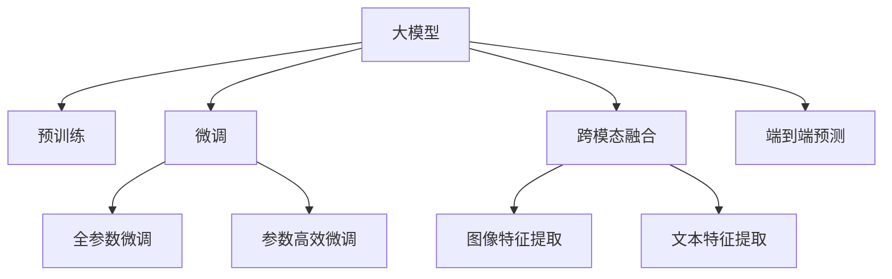

                 

# 大模型在商品属性预测中的应用

大模型在商品属性预测中的应用是一个融合了深度学习、自然语言处理和商业分析的跨领域问题。本博客将详细介绍大模型在商品属性预测中的原理、操作步骤、优缺点以及应用场景。

## 1. 背景介绍

### 1.1 问题由来
商品属性预测是电商平台和零售商的重要应用场景，主要目的是根据商品描述和图像等信息，自动预测商品的属性特征，如材质、尺寸、价格等，从而优化商品展示和推荐，提升用户体验和运营效率。传统的商品属性预测方法主要依赖手工设计特征和规则，无法充分挖掘自然语言文本中隐含的信息。

### 1.2 问题核心关键点
大模型在商品属性预测中的核心关键点包括以下几个方面：
- **语义理解**：利用大模型理解商品描述中的语义信息，提取关键词和语义特征。
- **跨模态融合**：结合商品图像等多模态信息，丰富预测的特征空间。
- **端到端预测**：直接从自然语言描述中预测商品属性，消除繁琐的手工特征工程。
- **性能提升**：通过大规模预训练和微调，显著提升商品属性预测的精度和泛化能力。

## 2. 核心概念与联系

### 2.1 核心概念概述

为更好地理解大模型在商品属性预测中的应用，本节将介绍几个密切相关的核心概念：

- **大模型(Large Model)**：如GPT、BERT等大规模预训练语言模型，具备强大的自然语言理解和生成能力。
- **预训练(Pre-training)**：在大规模无标签文本语料上，通过自监督学习任务训练通用语言模型的过程。
- **微调(Fine-tuning)**：在大模型的基础上，使用标注数据对模型进行任务特定的优化，提升特定任务的性能。
- **跨模态融合(Multi-modal Fusion)**：结合不同模态的信息，如文本和图像，进行特征融合，提升预测效果。
- **端到端预测(End-to-End Prediction)**：从自然语言描述直接预测商品属性，简化特征工程流程。

这些概念之间的逻辑关系可以通过以下Mermaid流程图来展示：



这个流程图展示了大模型在商品属性预测中的核心概念及其之间的关系：

1. 大模型通过预训练获得基础能力。
2. 微调对预训练模型进行任务特定的优化，提升特定任务的性能。
3. 跨模态融合结合多模态信息，丰富预测特征。
4. 端到端预测直接从自然语言描述预测商品属性。

## 3. 核心算法原理 & 具体操作步骤

### 3.1 算法原理概述

大模型在商品属性预测中的应用，本质上是通过自然语言理解和特征提取，结合多模态信息进行商品属性的预测。其核心思想是：利用大模型学习丰富的语义信息，自动提取商品的特征，并结合商品图像等多模态信息，进行端到端的预测。

### 3.2 算法步骤详解

基于大模型在商品属性预测中的应用，一般包括以下几个关键步骤：

**Step 1: 准备数据集和模型**
- 收集商品描述、图像、属性标签等多模态数据，划分为训练集、验证集和测试集。
- 选择合适的预训练大模型，如GPT、BERT、DALL-E等，作为初始化参数。

**Step 2: 添加任务适配层**
- 根据预测任务，设计适当的输出层和损失函数。对于分类任务，通常使用softmax层和交叉熵损失；对于回归任务，则可以使用线性回归层和均方误差损失。

**Step 3: 设置微调超参数**
- 选择合适的优化算法及其参数，如AdamW、SGD等，设置学习率、批大小、迭代轮数等。
- 设置正则化技术及强度，包括权重衰减、Dropout、Early Stopping等。
- 确定冻结预训练参数的策略，如仅微调顶层，或全部参数都参与微调。

**Step 4: 执行梯度训练**
- 将训练集数据分批次输入模型，前向传播计算损失函数。
- 反向传播计算参数梯度，根据设定的优化算法和学习率更新模型参数。
- 周期性在验证集上评估模型性能，根据性能指标决定是否触发 Early Stopping。
- 重复上述步骤直到满足预设的迭代轮数或 Early Stopping 条件。

**Step 5: 测试和部署**
- 在测试集上评估微调后模型，对比微调前后的精度提升。
- 使用微调后的模型对新商品进行属性预测，集成到实际的应用系统中。

### 3.3 算法优缺点

基于大模型在商品属性预测中的应用，具有以下优点：
1. **高效性**：自动提取特征和进行预测，无需繁琐的手工特征工程，提升预测速度。
2. **准确性**：利用大模型的语义理解能力，准确提取商品特征，提升预测精度。
3. **泛化能力**：通过大规模预训练和微调，模型具备较强的泛化能力，适应多种商品属性预测场景。
4. **跨模态融合**：结合多模态信息，丰富预测特征，提高预测准确性。

同时，该方法也存在一些局限性：
1. **依赖标注数据**：模型性能很大程度上取决于标注数据的质量和数量，获取高质量标注数据的成本较高。
2. **资源消耗大**：大模型需要大量的计算资源进行预训练和微调，成本较高。
3. **解释性不足**：模型决策过程难以解释，难以调试和优化。
4. **偏见和有害信息**：预训练模型的固有偏见和有害信息可能传递到商品属性预测，造成偏见和不公平。

尽管存在这些局限性，但就目前而言，基于大模型的方法在商品属性预测中已展现出巨大的潜力，成为提升商品推荐和搜索效率的重要手段。

### 3.4 算法应用领域

基于大模型在商品属性预测中的应用，已在电商平台和零售商的多个领域得到广泛应用，例如：

- **商品分类**：将商品描述自动分类到不同的类别中，如服装、电子产品等。
- **属性预测**：自动预测商品的属性特征，如材质、尺寸、价格等。
- **相似商品推荐**：根据商品描述预测相似的单品，提升用户购物体验。
- **搜索结果优化**：结合商品描述和图像预测商品的相关性和重要性，优化搜索结果。
- **情感分析**：预测商品描述中的情感倾向，用于情感营销和品牌建设。

除了这些经典应用外，大模型在商品属性预测中还催生了更多创新性应用，如智能客服、个性化营销、客户画像等，为电商平台和零售商带来了新的业务机会。

## 4. 数学模型和公式 & 详细讲解  
### 4.1 数学模型构建

本节将使用数学语言对大模型在商品属性预测中的微调过程进行更加严格的刻画。

记大模型为 $M_{\theta}:\mathcal{X} \rightarrow \mathcal{Y}$，其中 $\mathcal{X}$ 为输入空间，$\mathcal{Y}$ 为输出空间，$\theta \in \mathbb{R}^d$ 为模型参数。假设预测任务的训练集为 $D=\{(x_i,y_i)\}_{i=1}^N, x_i \in \mathcal{X}, y_i \in \mathcal{Y}$。

定义模型 $M_{\theta}$ 在数据样本 $(x,y)$ 上的损失函数为 $\ell(M_{\theta}(x),y)$，则在数据集 $D$ 上的经验风险为：

$$
\mathcal{L}(\theta) = \frac{1}{N} \sum_{i=1}^N \ell(M_{\theta}(x_i),y_i)
$$

微调的优化目标是最小化经验风险，即找到最优参数：

$$
\theta^* = \mathop{\arg\min}_{\theta} \mathcal{L}(\theta)
$$

在实践中，我们通常使用基于梯度的优化算法（如SGD、Adam等）来近似求解上述最优化问题。设 $\eta$ 为学习率，$\lambda$ 为正则化系数，则参数的更新公式为：

$$
\theta \leftarrow \theta - \eta \nabla_{\theta}\mathcal{L}(\theta) - \eta\lambda\theta
$$

其中 $\nabla_{\theta}\mathcal{L}(\theta)$ 为损失函数对参数 $\theta$ 的梯度，可通过反向传播算法高效计算。

### 4.2 公式推导过程

以下我们以商品属性预测中的分类任务为例，推导交叉熵损失函数及其梯度的计算公式。

假设模型 $M_{\theta}$ 在输入 $x$ 上的输出为 $\hat{y}=M_{\theta}(x) \in [0,1]$，表示商品属于正类的概率。真实标签 $y \in \{0,1\}$。则二分类交叉熵损失函数定义为：

$$
\ell(M_{\theta}(x),y) = -[y\log \hat{y} + (1-y)\log (1-\hat{y})]
$$

将其代入经验风险公式，得：

$$
\mathcal{L}(\theta) = -\frac{1}{N}\sum_{i=1}^N [y_i\log M_{\theta}(x_i)+(1-y_i)\log(1-M_{\theta}(x_i))]
$$

根据链式法则，损失函数对参数 $\theta_k$ 的梯度为：

$$
\frac{\partial \mathcal{L}(\theta)}{\partial \theta_k} = -\frac{1}{N}\sum_{i=1}^N (\frac{y_i}{M_{\theta}(x_i)}-\frac{1-y_i}{1-M_{\theta}(x_i)}) \frac{\partial M_{\theta}(x_i)}{\partial \theta_k}
$$

其中 $\frac{\partial M_{\theta}(x_i)}{\partial \theta_k}$ 可进一步递归展开，利用自动微分技术完成计算。

### 4.3 案例分析与讲解

以一个具体的商品属性预测案例来分析上述公式的应用：

假设我们希望预测某商品的颜色属性。我们有以下训练数据：

- 商品描述："红色T恤，纯棉材质，宽松设计"
- 标签：红色

我们首先将商品描述输入到大模型中，获得预测的类别概率 $\hat{y}=\{0.8, 0.1, 0.1\}$，表示该商品为红色的概率为0.8。接下来，我们计算交叉熵损失：

$$
\mathcal{L}(\theta) = -\frac{1}{N}\sum_{i=1}^N [y_i\log M_{\theta}(x_i)+(1-y_i)\log(1-M_{\theta}(x_i))]
$$

对于本案例，我们只有一个样本，因此：

$$
\mathcal{L}(\theta) = -0.8\log 0.8 - 0.2\log 0.2
$$

计算得到 $\mathcal{L}(\theta) = -1.1442$。然后，我们计算梯度：

$$
\frac{\partial \mathcal{L}(\theta)}{\partial \theta_k} = -(\frac{0.8}{0.8}-\frac{0.2}{1-0.8}) \frac{\partial M_{\theta}(x_i)}{\partial \theta_k}
$$

简化得：

$$
\frac{\partial \mathcal{L}(\theta)}{\partial \theta_k} = -2 \frac{\partial M_{\theta}(x_i)}{\partial \theta_k}
$$

最后，我们将梯度乘以学习率，更新模型参数 $\theta$。

## 5. 项目实践：代码实例和详细解释说明
### 5.1 开发环境搭建

在进行商品属性预测的微调实践前，我们需要准备好开发环境。以下是使用Python进行PyTorch开发的环境配置流程：

1. 安装Anaconda：从官网下载并安装Anaconda，用于创建独立的Python环境。

2. 创建并激活虚拟环境：
```bash
conda create -n pytorch-env python=3.8 
conda activate pytorch-env
```

3. 安装PyTorch：根据CUDA版本，从官网获取对应的安装命令。例如：
```bash
conda install pytorch torchvision torchaudio cudatoolkit=11.1 -c pytorch -c conda-forge
```

4. 安装Transformers库：
```bash
pip install transformers
```

5. 安装各类工具包：
```bash
pip install numpy pandas scikit-learn matplotlib tqdm jupyter notebook ipython
```

完成上述步骤后，即可在`pytorch-env`环境中开始微调实践。

### 5.2 源代码详细实现

这里我们以商品分类为例，使用HuggingFace的Transformers库，对BERT模型进行微调。

首先，定义商品分类任务的数据处理函数：

```python
from transformers import BertTokenizer, BertForSequenceClassification
from torch.utils.data import Dataset
import torch

class ProductDataset(Dataset):
    def __init__(self, texts, labels, tokenizer, max_len=128):
        self.texts = texts
        self.labels = labels
        self.tokenizer = tokenizer
        self.max_len = max_len
        
    def __len__(self):
        return len(self.texts)
    
    def __getitem__(self, item):
        text = self.texts[item]
        label = self.labels[item]
        
        encoding = self.tokenizer(text, return_tensors='pt', max_length=self.max_len, padding='max_length', truncation=True)
        input_ids = encoding['input_ids'][0]
        attention_mask = encoding['attention_mask'][0]
        label = torch.tensor([label], dtype=torch.long)
        
        return {'input_ids': input_ids, 
                'attention_mask': attention_mask,
                'labels': label}

# 定义商品类别标签
labels = ['衣服', '电子产品', '书籍', '食品', '日用品']

# 创建dataset
tokenizer = BertTokenizer.from_pretrained('bert-base-cased')

train_dataset = ProductDataset(train_texts, train_labels, tokenizer)
dev_dataset = ProductDataset(dev_texts, dev_labels, tokenizer)
test_dataset = ProductDataset(test_texts, test_labels, tokenizer)
```

然后，定义模型和优化器：

```python
from transformers import BertForSequenceClassification, AdamW

model = BertForSequenceClassification.from_pretrained('bert-base-cased', num_labels=len(labels))

optimizer = AdamW(model.parameters(), lr=2e-5)
```

接着，定义训练和评估函数：

```python
from torch.utils.data import DataLoader
from tqdm import tqdm
from sklearn.metrics import accuracy_score, precision_recall_fscore_support

device = torch.device('cuda') if torch.cuda.is_available() else torch.device('cpu')
model.to(device)

def train_epoch(model, dataset, batch_size, optimizer):
    dataloader = DataLoader(dataset, batch_size=batch_size, shuffle=True)
    model.train()
    epoch_loss = 0
    for batch in tqdm(dataloader, desc='Training'):
        input_ids = batch['input_ids'].to(device)
        attention_mask = batch['attention_mask'].to(device)
        labels = batch['labels'].to(device)
        model.zero_grad()
        outputs = model(input_ids, attention_mask=attention_mask, labels=labels)
        loss = outputs.loss
        epoch_loss += loss.item()
        loss.backward()
        optimizer.step()
    return epoch_loss / len(dataloader)

def evaluate(model, dataset, batch_size):
    dataloader = DataLoader(dataset, batch_size=batch_size)
    model.eval()
    preds, labels = [], []
    with torch.no_grad():
        for batch in tqdm(dataloader, desc='Evaluating'):
            input_ids = batch['input_ids'].to(device)
            attention_mask = batch['attention_mask'].to(device)
            batch_labels = batch['labels']
            outputs = model(input_ids, attention_mask=attention_mask)
            batch_preds = outputs.logits.argmax(dim=1).to('cpu').tolist()
            batch_labels = batch_labels.to('cpu').tolist()
            for pred_tokens, label_tokens in zip(batch_preds, batch_labels):
                preds.append(pred_tokens[0])
                labels.append(label_tokens[0])
                
    print('Accuracy:', accuracy_score(labels, preds))
    print('Precision, Recall, F1-score:', precision_recall_fscore_support(labels, preds, average='macro'))

```

最后，启动训练流程并在测试集上评估：

```python
epochs = 5
batch_size = 16

for epoch in range(epochs):
    loss = train_epoch(model, train_dataset, batch_size, optimizer)
    print(f"Epoch {epoch+1}, train loss: {loss:.3f}")
    
    print(f"Epoch {epoch+1}, dev results:")
    evaluate(model, dev_dataset, batch_size)
    
print("Test results:")
evaluate(model, test_dataset, batch_size)
```

以上就是使用PyTorch对BERT进行商品分类任务的微调代码实现。可以看到，得益于Transformers库的强大封装，我们可以用相对简洁的代码完成BERT模型的加载和微调。

### 5.3 代码解读与分析

让我们再详细解读一下关键代码的实现细节：

**ProductDataset类**：
- `__init__`方法：初始化文本、标签、分词器等关键组件。
- `__len__`方法：返回数据集的样本数量。
- `__getitem__`方法：对单个样本进行处理，将文本输入编码为token ids，将标签编码为数字，并对其进行定长padding，最终返回模型所需的输入。

**标签标签**：
- 定义商品类别标签，用于表示训练集中每个商品的分类。

**训练和评估函数**：
- 使用PyTorch的DataLoader对数据集进行批次化加载，供模型训练和推理使用。
- 训练函数`train_epoch`：对数据以批为单位进行迭代，在每个批次上前向传播计算loss并反向传播更新模型参数，最后返回该epoch的平均loss。
- 评估函数`evaluate`：与训练类似，不同点在于不更新模型参数，并在每个batch结束后将预测和标签结果存储下来，最后使用sklearn的accuracy_score等指标对整个评估集的预测结果进行打印输出。

**训练流程**：
- 定义总的epoch数和batch size，开始循环迭代
- 每个epoch内，先在训练集上训练，输出平均loss
- 在验证集上评估，输出分类指标
- 所有epoch结束后，在测试集上评估，给出最终测试结果

可以看到，PyTorch配合Transformers库使得BERT微调的代码实现变得简洁高效。开发者可以将更多精力放在数据处理、模型改进等高层逻辑上，而不必过多关注底层的实现细节。

当然，工业级的系统实现还需考虑更多因素，如模型的保存和部署、超参数的自动搜索、更灵活的任务适配层等。但核心的微调范式基本与此类似。

## 6. 实际应用场景

### 6.1 智能推荐系统

基于大模型在商品属性预测中的应用，可以构建智能推荐系统，提升用户购物体验和商品销售效率。传统推荐系统通常依赖用户行为数据进行推荐，无法充分挖掘商品描述中的隐含信息。而通过大模型对商品描述进行自动分类和属性预测，可以丰富推荐特征，实现更加个性化的推荐。

在技术实现上，可以收集用户浏览、点击、评价等行为数据，将商品描述作为特征输入到大模型中进行分类和属性预测，结合用户历史行为数据，生成个性化的推荐列表。如此构建的智能推荐系统，能大幅提升用户推荐效果，促进商品转化。

### 6.2 商品质量监控

电商平台需要实时监控商品的质量和用户体验，以便及时处理投诉和退换货问题。传统的人工监控方式成本高、效率低，难以应对海量订单的实时监控需求。利用大模型对商品描述进行自动分类和属性预测，可以自动识别商品问题，提升平台的质量控制水平。

具体而言，可以收集用户在商品使用中的评价和反馈数据，提取商品描述和属性信息，利用大模型进行分类和属性预测，识别出可能存在问题的商品。将预测结果反馈给商家进行复核，可以提高商品质量监控的效率和准确性。

### 6.3 供应链管理

零售商需要实时了解供应链中的库存和物流情况，以便做出精准的采购和调拨决策。传统的供应链管理依赖手工记录和手动调度，无法动态调整库存，容易出现断货或过剩情况。利用大模型对商品描述进行自动分类和属性预测，可以实时获取商品的库存和物流信息，辅助商家进行库存管理和物流调度。

在技术实现上，可以收集商品描述和属性信息，利用大模型进行分类和属性预测，实时更新库存和物流信息，生成库存告警和调拨建议。如此构建的供应链管理系统，能大幅提升供应链的效率和准确性，降低运营成本。

### 6.4 未来应用展望

随着大模型和微调方法的不断发展，基于大模型的商品属性预测技术将呈现以下几个发展趋势：

1. **多模态融合**：结合商品图像、声音等多模态信息，进行跨模态融合，丰富商品属性预测的特征空间。
2. **端到端预测**：进一步简化预测流程，直接从商品描述中预测属性，无需手工特征工程，提升预测速度和准确性。
3. **知识增强**：引入外部知识库、规则库等专家知识，进行知识增强，提升预测的普适性和鲁棒性。
4. **多任务学习**：结合商品分类、属性预测、情感分析等多任务，进行多任务学习，提升模型的整体性能。
5. **动态更新**：结合实时数据，动态更新模型参数，保持模型的时效性，适应不断变化的市场需求。

以上趋势凸显了大模型在商品属性预测中的广阔前景。这些方向的探索发展，必将进一步提升商品属性预测的精度和泛化能力，为电商平台和零售商带来新的业务机会和运营效率的提升。

## 7. 工具和资源推荐
### 7.1 学习资源推荐

为了帮助开发者系统掌握大模型在商品属性预测中的应用，这里推荐一些优质的学习资源：

1. **《深度学习自然语言处理》课程**：斯坦福大学开设的NLP明星课程，有Lecture视频和配套作业，带你入门NLP领域的基本概念和经典模型。
2. **Transformers官方文档**：HuggingFace开发的NLP工具库，提供了海量预训练模型和完整的微调样例代码，是上手实践的必备资料。
3. **自然语言处理博文**：由大模型技术专家撰写，深入浅出地介绍了Transformer原理、BERT模型、微调技术等前沿话题。
4. **CS224N《深度学习自然语言处理》书籍**：Transformers库的作者所著，全面介绍了如何使用Transformers库进行NLP任务开发，包括微调在内的诸多范式。

通过对这些资源的学习实践，相信你一定能够快速掌握大模型在商品属性预测中的微调方法，并用于解决实际的NLP问题。

### 7.2 开发工具推荐

高效的开发离不开优秀的工具支持。以下是几款用于大模型在商品属性预测中的微调开发的常用工具：

1. **PyTorch**：基于Python的开源深度学习框架，灵活动态的计算图，适合快速迭代研究。
2. **TensorFlow**：由Google主导开发的开源深度学习框架，生产部署方便，适合大规模工程应用。
3. **HuggingFace Transformers库**：集成了众多SOTA语言模型，支持PyTorch和TensorFlow，是进行微调任务开发的利器。
4. **Weights & Biases**：模型训练的实验跟踪工具，可以记录和可视化模型训练过程中的各项指标，方便对比和调优。
5. **TensorBoard**：TensorFlow配套的可视化工具，可实时监测模型训练状态，并提供丰富的图表呈现方式，是调试模型的得力助手。
6. **Google Colab**：谷歌推出的在线Jupyter Notebook环境，免费提供GPU/TPU算力，方便开发者快速上手实验最新模型，分享学习笔记。

合理利用这些工具，可以显著提升大模型在商品属性预测中的微调任务的开发效率，加快创新迭代的步伐。

### 7.3 相关论文推荐

大模型在商品属性预测中的应用，源于学界的持续研究。以下是几篇奠基性的相关论文，推荐阅读：

1. **Attention is All You Need**：提出了Transformer结构，开启了NLP领域的预训练大模型时代。
2. **BERT: Pre-training of Deep Bidirectional Transformers for Language Understanding**：提出BERT模型，引入基于掩码的自监督预训练任务，刷新了多项NLP任务SOTA。
3. **Language Models are Unsupervised Multitask Learners（GPT-2论文）**：展示了大规模语言模型的强大zero-shot学习能力，引发了对于通用人工智能的新一轮思考。
4. **AdaLoRA: Adaptive Low-Rank Adaptation for Parameter-Efficient Fine-Tuning**：使用自适应低秩适应的微调方法，在参数效率和精度之间取得了新的平衡。
5. **Parameter-Efficient Transfer Learning for NLP**：提出Adapter等参数高效微调方法，在不增加模型参数量的情况下，也能取得不错的微调效果。

这些论文代表了大模型在商品属性预测中的应用发展脉络。通过学习这些前沿成果，可以帮助研究者把握学科前进方向，激发更多的创新灵感。

## 8. 总结：未来发展趋势与挑战

### 8.1 总结

本文对大模型在商品属性预测中的原理、操作步骤、优缺点以及应用场景进行了全面系统的介绍。首先阐述了大模型在商品属性预测中的背景和核心关键点，明确了微调在提升商品推荐和搜索效率方面的独特价值。其次，从原理到实践，详细讲解了大模型在商品属性预测中的数学模型和关键步骤，给出了微调任务开发的完整代码实例。同时，本文还广泛探讨了大模型在商品属性预测中的实际应用场景，展示了其巨大的应用潜力。最后，本文精选了微调技术的各类学习资源，力求为读者提供全方位的技术指引。

通过本文的系统梳理，可以看到，大模型在商品属性预测中已经展现出巨大的潜力，成为提升商品推荐和搜索效率的重要手段。借助大模型，电商平台和零售商可以更加高效地获取商品信息，提升用户体验和运营效率。未来，伴随大模型和微调方法的持续演进，相信基于大模型的商品属性预测技术将进一步提升电商平台和零售商的智能化水平，助力其数字化转型。

### 8.2 未来发展趋势

展望未来，大模型在商品属性预测中的发展趋势将呈现以下几个方向：

1. **多模态融合**：结合商品图像、声音等多模态信息，进行跨模态融合，丰富商品属性预测的特征空间。
2. **端到端预测**：进一步简化预测流程，直接从商品描述中预测属性，无需手工特征工程，提升预测速度和准确性。
3. **知识增强**：引入外部知识库、规则库等专家知识，进行知识增强，提升预测的普适性和鲁棒性。
4. **动态更新**：结合实时数据，动态更新模型参数，保持模型的时效性，适应不断变化的市场需求。
5. **可解释性提升**：增强模型的可解释性，让用户能够理解和信任模型的预测结果，提升用户体验。
6. **隐私保护**：保护用户隐私，防止模型学习到敏感信息，提升模型安全性。

这些趋势凸显了大模型在商品属性预测中的广阔前景。这些方向的探索发展，必将进一步提升商品属性预测的精度和泛化能力，为电商平台和零售商带来新的业务机会和运营效率的提升。

### 8.3 面临的挑战

尽管大模型在商品属性预测中已展现出巨大的潜力，但在迈向更加智能化、普适化应用的过程中，仍面临诸多挑战：

1. **标注成本瓶颈**：商品属性预测的标注数据需要耗费大量的人力和时间，且标注质量直接影响预测效果。如何降低标注成本，提高标注质量，将是一大难题。
2. **模型鲁棒性不足**：大模型在面对域外数据时，泛化性能往往大打折扣。如何提高模型的鲁棒性，避免灾难性遗忘，还需要更多理论和实践的积累。
3. **推理效率有待提高**：大规模语言模型虽然精度高，但在实际部署时往往面临推理速度慢、内存占用大等效率问题。如何优化模型结构和计算图，提升推理速度，优化资源占用，将是重要的优化方向。
4. **知识整合能力不足**：现有的大模型往往局限于任务内数据，难以灵活吸收和运用更广泛的先验知识。如何让微调过程更好地与外部知识库、规则库等专家知识结合，形成更加全面、准确的信息整合能力，还有很大的想象空间。
5. **模型通用性增强**：尽管现有大模型在某些特定任务上表现优异，但在通用的商品属性预测任务中，仍存在一定的局限性。如何开发更加通用的商品属性预测模型，将是一大挑战。

尽管存在这些挑战，但就目前而言，基于大模型的方法在商品属性预测中已展现出巨大的潜力，成为提升商品推荐和搜索效率的重要手段。未来，随着大模型和微调方法的持续演进，相信基于大模型的商品属性预测技术将进一步提升电商平台和零售商的智能化水平，助力其数字化转型。

### 8.4 研究展望

面对大模型在商品属性预测中面临的挑战，未来的研究需要在以下几个方面寻求新的突破：

1. **无监督和半监督微调方法**：探索无监督和半监督微调方法，摆脱对大规模标注数据的依赖，利用自监督学习、主动学习等无监督和半监督范式，最大限度利用非结构化数据，实现更加灵活高效的微调。
2. **参数高效和计算高效的微调范式**：开发更加参数高效的微调方法，在固定大部分预训练参数的同时，只更新极少量的任务相关参数。同时优化微调模型的计算图，减少前向传播和反向传播的资源消耗，实现更加轻量级、实时性的部署。
3. **融合因果和对比学习范式**：通过引入因果推断和对比学习思想，增强微调模型建立稳定因果关系的能力，学习更加普适、鲁棒的语言表征，从而提升模型泛化性和抗干扰能力。
4. **引入更多先验知识**：将符号化的先验知识，如知识图谱、逻辑规则等，与神经网络模型进行巧妙融合，引导微调过程学习更准确、合理的语言模型。同时加强不同模态数据的整合，实现视觉、语音等多模态信息与文本信息的协同建模。
5. **结合因果分析和博弈论工具**：将因果分析方法引入微调模型，识别出模型决策的关键特征，增强输出解释的因果性和逻辑性。借助博弈论工具刻画人机交互过程，主动探索并规避模型的脆弱点，提高系统稳定性。
6. **纳入伦理道德约束**：在模型训练目标中引入伦理导向的评估指标，过滤和惩罚有偏见、有害的输出倾向。同时加强人工干预和审核，建立模型行为的监管机制，确保输出符合人类价值观和伦理道德。

这些研究方向将引领大模型在商品属性预测中的应用走向更加智能化、普适化和可解释化的方向，为电商平台和零售商带来更加高效、可靠和安全的智能服务。

## 9. 附录：常见问题与解答

**Q1：大模型在商品属性预测中的应用效果如何？**

A: 大模型在商品属性预测中的应用效果显著。通过对商品描述进行自动分类和属性预测，可以大大简化特征工程，提升预测速度和准确性。尤其是对于商品分类和属性预测任务，大模型的表现优于传统的特征工程方法。同时，大模型在多任务学习、端到端预测、跨模态融合等方面也有出色表现，可以进一步提升模型的预测性能。

**Q2：大模型在商品属性预测中如何处理多模态信息？**

A: 大模型在商品属性预测中可以处理多模态信息，如商品描述、图像、视频等。通过引入多模态融合技术，可以结合不同模态的信息，提升预测的特征空间。具体而言，可以将商品图像特征提取出来，与商品描述的文本特征进行融合，生成更加丰富的商品特征向量。然后，将这些特征向量输入到大模型中进行预测。

**Q3：大模型在商品属性预测中如何保证模型的泛化能力？**

A: 为了保证大模型在商品属性预测中的泛化能力，可以采用以下方法：
1. 引入外部知识库、规则库等专家知识，进行知识增强，提升模型的普适性和鲁棒性。
2. 结合实时数据，动态更新模型参数，保持模型的时效性，适应不断变化的市场需求。
3. 使用迁移学习、多任务学习等技术，提高模型的泛化能力和适应性。
4. 利用多模态融合技术，丰富模型的特征空间，提升预测的泛化能力。

**Q4：大模型在商品属性预测中如何优化模型的推理速度？**

A: 为了优化大模型在商品属性预测中的推理速度，可以采用以下方法：
1. 使用知识蒸馏技术，将大模型的知识蒸馏到轻量级模型中，提升推理速度。
2. 使用剪枝和量化技术，减少模型的计算量和内存占用，提高推理效率。
3. 使用模型并行和分布式计算技术，提升大规模模型的计算效率。
4. 优化模型的计算图，减少不必要的计算，提升推理速度。

**Q5：大模型在商品属性预测中如何提高模型的可解释性？**

A: 为了提高大模型在商品属性预测中的可解释性，可以采用以下方法：
1. 使用可解释模型，如决策树、规则模型等，将大模型的决策过程拆分为多个可解释的部分。
2. 使用模型可视化工具，如Shapley值、LIME等，分析模型在不同输入下的决策过程。
3. 引入外部知识库、规则库等专家知识，辅助解释模型的输出。
4. 结合因果分析和博弈论工具，刻画模型决策的关键特征，增强输出解释的因果性和逻辑性。

通过这些方法，可以增强大模型在商品属性预测中的可解释性，让用户能够理解和信任模型的预测结果，提升用户体验。

---

作者：禅与计算机程序设计艺术 / Zen and the Art of Computer Programming

