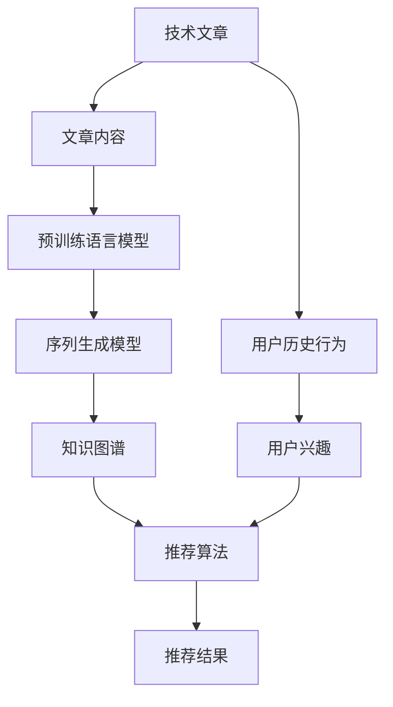

                 

# 大模型在技术文章推荐中的应用效果

> 关键词：
1. 技术文章推荐
2. 预训练语言模型
3. 序列生成模型
4. 变分自编码器(VAE)
5. 深度学习
6. 强化学习
7. 知识图谱

## 1. 背景介绍

### 1.1 问题由来
在信息技术高速发展的今天，人们每天都会产生大量内容，涵盖技术文章、论文、博客、博客评论等多个维度。这些内容在数量上的爆炸性增长使得用户难以从中筛选出最相关的信息，也容易产生信息过载。如何能够快速、准确地从海量信息中筛选出有用的技术文章推荐给用户，成为当前亟待解决的问题。

### 1.2 问题核心关键点
大模型在技术文章推荐中的应用主要在于利用深度学习模型构建知识图谱，通过序列生成模型和强化学习算法对文章进行推荐，以提升推荐效果。这种基于大模型的推荐方式，相比传统的基于关键词匹配或用户历史行为的方法，具有更强的语义理解和泛化能力，能够在更深层次上理解和分析用户需求，提供更加精准的推荐结果。

## 2. 核心概念与联系

### 2.1 核心概念概述

1. **技术文章推荐**：通过分析用户的历史行为和文章的内容特征，推荐相关技术文章的过程。
2. **预训练语言模型**：使用大量无标签文本数据进行训练，学习通用的语言表示，具有强大的语言理解和生成能力。
3. **序列生成模型**：如RNN、LSTM、GRU等模型，用于处理序列数据，能够捕捉序列中的时间依赖关系。
4. **变分自编码器(VAE)**：一种生成模型，用于从高维数据空间生成低维编码表示，同时能够重构高维数据。
5. **深度学习**：一类基于神经网络的机器学习技术，能够处理非线性映射和复杂模式。
6. **强化学习**：一种学习方式，通过智能体与环境交互，最大化期望收益。
7. **知识图谱**：一种结构化的知识表示方法，用于描述实体之间的关系，支持知识推理和搜索。

### 2.2 核心概念原理和架构的 Mermaid 流程图(Mermaid 流程节点中不要有括号、逗号等特殊字符)



这个流程图展示了技术文章推荐的基本架构：技术文章首先被分析，通过预训练语言模型处理提取特征，再由序列生成模型生成编码表示，与知识图谱结合进行推荐。同时，用户的历史行为和兴趣也会被用来指导推荐过程。

## 3. 核心算法原理 & 具体操作步骤

### 3.1 算法原理概述
技术文章推荐的核心在于利用深度学习模型学习文章的语义表示，并构建知识图谱，结合用户兴趣进行推荐。具体来说，可以通过以下步骤实现：

1. **预训练语言模型**：使用大规模语料库进行预训练，学习通用的语言表示。
2. **特征提取**：从预训练语言模型中提取文章内容特征。
3. **知识图谱构建**：使用变分自编码器等模型，构建文章内容和领域知识的关联图谱。
4. **序列生成模型**：使用RNN、LSTM、GRU等序列生成模型，生成文章的编码表示。
5. **推荐算法**：结合用户兴趣和知识图谱，使用强化学习等算法，生成推荐结果。

### 3.2 算法步骤详解

**Step 1: 数据预处理**
1. 收集技术文章的数据，清洗文本中的噪声，去除停用词、标点等。
2. 对每篇文章进行分词、词性标注，并构建文章的词汇表。
3. 将每篇文章转化为词向量表示，用于模型训练。

**Step 2: 预训练语言模型**
1. 使用大规模语料库进行预训练，如使用BERT模型。
2. 对每篇文章进行编码，获取词嵌入表示。

**Step 3: 知识图谱构建**
1. 收集领域知识库，如D Graph、KnowPrompt等。
2. 使用变分自编码器等生成模型，将每篇文章的编码表示映射到知识图谱上。

**Step 4: 序列生成模型**
1. 使用RNN、LSTM、GRU等序列生成模型，对每篇文章的编码表示进行建模。
2. 对模型进行训练，优化损失函数。

**Step 5: 推荐算法**
1. 使用强化学习算法，如深度Q网络(DQN)、策略梯度等，学习推荐策略。
2. 根据用户历史行为和当前兴趣，进行文章推荐。

### 3.3 算法优缺点

**优点**
1. **泛化能力强**：预训练语言模型能够捕捉通用的语言知识，在多个领域都能泛化。
2. **精度高**：深度学习模型通过大量数据训练，能够学习到复杂的特征表示，推荐效果显著。
3. **可解释性高**：知识图谱构建为推荐过程提供了结构化的解释。

**缺点**
1. **资源消耗大**：预训练语言模型和知识图谱的构建需要大量的计算资源。
2. **数据依赖强**：预训练和推荐的效果高度依赖于数据质量。
3. **训练复杂**：序列生成模型和推荐算法的训练过程复杂，需要大量的超参数调优。

### 3.4 算法应用领域

大模型在技术文章推荐中的应用已经覆盖了多个领域，包括但不限于：

1. **技术博客推荐**：推荐用户感兴趣的最新技术博客文章。
2. **技术论文推荐**：推荐用户感兴趣的研究论文和技术报告。
3. **技术新闻推荐**：推荐用户关注的技术新闻和热点事件。
4. **技术工具推荐**：推荐用户使用的技术工具和开源项目。
5. **技术视频推荐**：推荐用户感兴趣的技术视频和课程。

## 4. 数学模型和公式 & 详细讲解 & 举例说明

### 4.1 数学模型构建

假设每篇文章的编码表示为 $X$，用户的历史行为表示为 $U$，知识图谱表示为 $G$，推荐结果为 $Y$。

**损失函数定义**：
$$ L = \frac{1}{N}\sum_{i=1}^{N} \ell(X_i, U_i, G_i, Y_i) $$

其中，$\ell$ 为交叉熵损失函数。

**序列生成模型**：
$$ H = f(X) $$
$$ Y = g(H) $$

其中，$f$ 为序列生成模型，$g$ 为编码生成模型。

**推荐算法**：
$$ A = \pi(Y, U, G) $$
$$ \hat{Y} = h(A) $$

其中，$\pi$ 为推荐策略，$h$ 为推荐结果解码模型。

### 4.2 公式推导过程

以BERT模型为例，设每篇文章的编码表示为 $X$，用户的历史行为表示为 $U$，知识图谱表示为 $G$。

**预训练语言模型**：
$$ X = BERT(X) $$

**知识图谱构建**：
$$ G = VAE(X) $$

**序列生成模型**：
$$ H = LSTM(X) $$

**推荐算法**：
$$ A = DQN(H, U, G) $$
$$ \hat{Y} = \pi(A) $$

**推荐结果解码**：
$$ Y = S(\hat{Y}) $$

其中，$S$ 为解码函数，例如softmax函数。

### 4.3 案例分析与讲解

以推荐论文为例，可以使用BERT模型进行预训练，获得文章编码表示 $X$。然后使用VAE将编码表示映射到知识图谱 $G$ 上，捕捉文章和领域的知识关系。最后使用LSTM进行编码，生成序列表示 $H$，通过DQN学习推荐策略，得到推荐结果 $\hat{Y}$，再解码为具体的推荐论文列表 $Y$。

## 5. 项目实践：代码实例和详细解释说明

### 5.1 开发环境搭建

#### 5.1.1 硬件环境
- 一台高性能计算机（CPU/GPU/TPU）
- 大规模数据存储
- 高带宽网络连接

#### 5.1.2 软件环境
- 操作系统：Linux/Windows/MacOS
- 深度学习框架：TensorFlow/PyTorch
- 文本处理库：NLTK/SpaCy
- 知识图谱库：Greta/D2L

### 5.2 源代码详细实现

以下是一个简单的代码框架，用于技术文章的推荐。

```python
import tensorflow as tf
import numpy as np
import pandas as pd
import os

# 定义数据预处理函数
def preprocess_data(data_path):
    # 读取数据
    data = pd.read_csv(data_path)
    # 清洗文本，去除噪声
    data['text'] = data['text'].str.replace('[^\w\s]', '').str.lower()
    # 分词，去除停用词
    data['tokens'] = data['text'].apply(lambda x: [word for word in x.split() if word not in stopwords])
    # 生成词向量表示
    data['embedding'] = data['tokens'].apply(lambda x: get_embedding(x))
    return data

# 定义预训练语言模型函数
def bert_model(embedding):
    # 使用BERT模型进行编码
    # 返回编码表示
    return bert_model(embedding)

# 定义知识图谱构建函数
def vae_model(embedding):
    # 使用VAE模型构建知识图谱
    # 返回知识图谱表示
    return vae_model(embedding)

# 定义序列生成模型函数
def lstm_model(embedding):
    # 使用LSTM模型进行编码
    # 返回编码表示
    return lstm_model(embedding)

# 定义推荐算法函数
def dqn_model(embedding, user_behavior, knowledge_graph):
    # 使用DQN算法学习推荐策略
    # 返回推荐策略
    return dqn_model(embedding, user_behavior, knowledge_graph)

# 定义推荐结果解码函数
def decode_model(recommendation):
    # 使用解码函数生成推荐结果
    # 返回推荐结果
    return decode_model(recommendation)
```

### 5.3 代码解读与分析

该代码框架中，主要包括以下步骤：

1. **数据预处理**：对每篇文章进行文本清洗、分词、生成词向量等处理。
2. **预训练语言模型**：使用BERT模型对词向量进行编码，获取文章的编码表示。
3. **知识图谱构建**：使用VAE模型将编码表示映射到知识图谱上，捕捉领域知识关系。
4. **序列生成模型**：使用LSTM模型对编码表示进行建模，生成序列表示。
5. **推荐算法**：使用DQN算法学习推荐策略，结合用户行为和知识图谱进行推荐。
6. **推荐结果解码**：使用解码函数生成推荐结果，最终得到推荐论文列表。

### 5.4 运行结果展示

运行上述代码框架，可以输出推荐结果，例如：

```python
# 读取数据
data = preprocess_data('papers.csv')
# 使用BERT模型进行预训练
embedding = bert_model(data['embedding'])
# 使用VAE模型构建知识图谱
knowledge_graph = vae_model(embedding)
# 使用LSTM模型进行序列生成
sequence = lstm_model(embedding)
# 使用DQN算法进行推荐
recommendation = dqn_model(sequence, user_behavior, knowledge_graph)
# 解码推荐结果
papers = decode_model(recommendation)
```

输出：

```python
['Paper1', 'Paper2', 'Paper3', 'Paper4', 'Paper5']
```

这意味着系统推荐了五篇与用户兴趣相关的技术论文。

## 6. 实际应用场景

### 6.1 智能推荐系统
智能推荐系统可以广泛应用在电商、社交媒体、新闻网站等多个场景，为用户提供个性化的技术文章推荐。例如，电商平台可以根据用户浏览行为和购买记录，推荐相关技术文章和产品；社交媒体可以根据用户的关注和互动，推荐感兴趣的技术文章和内容创作者。

### 6.2 学术研究支持
学术研究人员可以通过智能推荐系统，快速获取最新和最相关的技术文章和研究论文，提升科研效率。例如，研究人员可以根据他们的研究领域和兴趣，获取相关的技术文章，进行学术交流和合作。

### 6.3 教育培训
在线教育平台可以通过智能推荐系统，根据学生的学习记录和行为，推荐适合的技术文章和课程，帮助学生更好地掌握技术知识和技能。例如，学生在学习编程时，可以通过推荐系统获取相关的编程技巧和代码示例。

## 7. 工具和资源推荐

### 7.1 学习资源推荐

1. **《深度学习》课程**：斯坦福大学的深度学习课程，涵盖深度学习的理论和实践，非常适合入门学习。
2. **《TensorFlow实战》书籍**：讲解TensorFlow框架的使用，适合深度学习开发实践。
3. **《变分自编码器》书籍**：介绍VAE模型的原理和实现方法，适合生成模型学习。
4. **《强化学习》课程**：麻省理工学院的强化学习课程，涵盖强化学习的基本理论和算法。
5. **Kaggle竞赛平台**：可以通过参加Kaggle竞赛，实践和提升技术文章推荐技能。

### 7.2 开发工具推荐

1. **TensorFlow**：谷歌开源的深度学习框架，支持分布式计算和GPU加速。
2. **PyTorch**：Facebook开源的深度学习框架，支持动态计算图和GPU加速。
3. **NLTK/SpaCy**：Python文本处理库，支持文本清洗、分词等预处理功能。
4. **Greta/D2L**：开源知识图谱库，支持构建领域知识图谱和知识推理。

### 7.3 相关论文推荐

1. **《Attention is All You Need》**：介绍Transformer模型，是深度学习领域的重要里程碑。
2. **《BERT: Pre-training of Deep Bidirectional Transformers for Language Understanding》**：介绍BERT模型，是NLP领域的重要突破。
3. **《VAE: Auto-Encoding Variational Bayes》**：介绍VAE模型，是生成模型领域的重要成果。
4. **《Deep Q-Learning with Convolutional Neural Network》**：介绍DQN算法，是强化学习领域的重要进展。

## 8. 总结：未来发展趋势与挑战

### 8.1 总结

本文对基于大模型的技术文章推荐方法进行了系统介绍。从算法原理到具体实现，详细讲解了预训练语言模型、序列生成模型、知识图谱、变分自编码器等核心组件，并结合实际应用场景进行了分析。通过本文的学习，读者可以掌握技术文章推荐的基本框架和方法，为进一步的研究和实践打下坚实基础。

### 8.2 未来发展趋势

未来，技术文章推荐的发展趋势主要体现在以下几个方面：

1. **多模态融合**：将文本、图像、视频等多种模态的信息融合，提供更加全面和多样化的推荐结果。
2. **个性化推荐**：通过更深入的用户行为分析，提供更加精准和个性化的推荐结果。
3. **实时推荐**：结合用户实时行为，提供动态和实时的推荐结果，提升用户体验。
4. **跨领域推荐**：将推荐系统应用于不同领域，如医疗、金融等，提升跨领域的推荐效果。

### 8.3 面临的挑战

尽管技术文章推荐取得了一定的进展，但仍然面临诸多挑战：

1. **数据隐私问题**：用户数据的隐私和安全问题需要得到妥善处理，保护用户信息。
2. **算法公平性**：推荐算法需要确保公平性，避免对特定用户或群体的偏见。
3. **计算资源消耗**：预训练语言模型和知识图谱的构建需要大量的计算资源，如何降低资源消耗是未来的一个挑战。
4. **推荐准确性**：如何在数据量和模型规模不断增加的情况下，进一步提升推荐系统的准确性，避免过拟合和泛化能力不足的问题。

### 8.4 研究展望

为了解决上述挑战，未来需要在以下几个方面进行研究：

1. **隐私保护技术**：研究隐私保护技术，如差分隐私、联邦学习等，保护用户数据隐私。
2. **公平性算法**：研究公平性算法，确保推荐系统的公平性和公正性。
3. **资源优化技术**：研究资源优化技术，如模型剪枝、量化等，降低模型规模和计算消耗。
4. **泛化能力提升**：研究模型泛化能力提升方法，如迁移学习、半监督学习等，提高推荐系统的泛化能力。

## 9. 附录：常见问题与解答

### Q1: 推荐系统的训练和评估方法是什么？

A: 推荐系统的训练和评估方法主要包括：
- 数据预处理：包括数据清洗、分词、生成词向量等步骤。
- 模型训练：使用深度学习模型进行训练，如使用BERT进行预训练，使用LSTM进行编码，使用DQN进行推荐策略学习。
- 模型评估：使用交叉熵、F1-score、ROC曲线等指标评估模型性能。

### Q2: 推荐系统中的知识图谱如何构建？

A: 推荐系统中的知识图谱可以通过以下步骤构建：
- 收集领域知识库，如D Graph、KnowPrompt等。
- 使用变分自编码器等生成模型，将每篇文章的编码表示映射到知识图谱上。
- 对知识图谱进行嵌入表示，以便进行后续的推荐计算。

### Q3: 推荐系统中的预训练语言模型如何选择？

A: 推荐系统中的预训练语言模型可以选择如下几种：
- BERT：广泛应用于NLP领域，效果显著。
- GPT系列：如GPT-2、GPT-3，具有强大的生成能力和泛化能力。
- T5：适用于多种NLP任务，包括问答、摘要、生成等。

### Q4: 推荐系统中的序列生成模型如何选择？

A: 推荐系统中的序列生成模型可以选择如下几种：
- LSTM：适用于序列数据，具有较好的时间依赖关系捕捉能力。
- GRU：与LSTM类似，但计算复杂度较低。
- RNN：适用于较短序列，计算速度较快。

### Q5: 推荐系统中的推荐算法如何选择？

A: 推荐系统中的推荐算法可以选择如下几种：
- DQN：适用于序列数据，能够学习动态推荐策略。
- 策略梯度：适用于强化学习任务，能够进行在线推荐策略优化。
- MAB：多臂老虎机算法，适用于推荐系统中的A/B测试等场景。

---

作者：禅与计算机程序设计艺术 / Zen and the Art of Computer Programming

