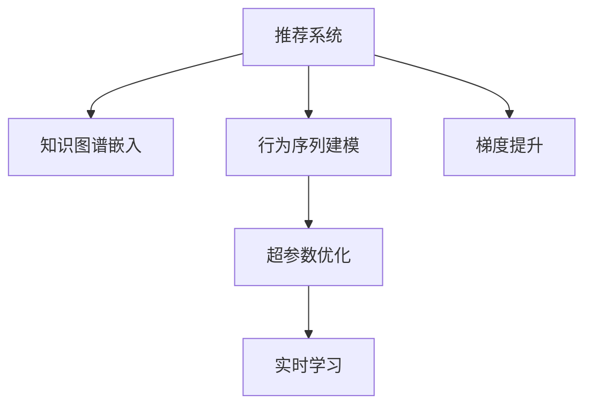

                 

# 大模型在推荐系统中的强化学习应用

> 关键词：强化学习,大模型,推荐系统,知识图谱,行为序列,梯度提升,超参数优化

## 1. 背景介绍

### 1.1 问题由来

推荐系统已经成为互联网公司提高用户粘性和商业价值的关键技术之一。传统的推荐系统往往依赖于基于协同过滤、矩阵分解等方法，需要大量用户行为数据进行训练，难以推广到冷启动用户和新物品。而大模型技术通过预训练获得广泛的通用语言知识，可以极大地拓展推荐系统的覆盖范围，提高推荐质量和个性化程度。

然而，大模型推荐系统仍面临诸多挑战：
- 如何高效地将大模型的语言知识与推荐任务结合，实现推荐模型的优化？
- 如何在处理海量用户行为数据的同时，保证推荐过程的稳定性和鲁棒性？
- 如何利用外部知识如知识图谱、逻辑规则等，进一步提升推荐系统的性能？

针对这些问题，强化学习技术提供了一种新的思路。强化学习通过探索和互动，使得模型能够从真实数据中不断优化，最终提升推荐系统的效果。

### 1.2 问题核心关键点

强化学习推荐系统主要分为以下几个核心关键点：
- 知识图谱嵌入：将知识图谱信息编码为低维向量，供模型使用。
- 行为序列建模：将用户行为序列转化为状态表示，为模型提供推荐决策依据。
- 梯度提升：在在线推荐过程中，利用梯度提升树等算法进行模型优化。
- 超参数优化：利用贝叶斯优化、遗传算法等方法进行超参数优化，提升模型性能。
- 实时学习：通过在线学习机制，不断更新推荐模型，适应新数据和新需求。

这些关键点通过强化学习技术相辅相成，形成了一套完整的推荐系统解决方案，可以大幅度提高推荐效果。

## 2. 核心概念与联系

### 2.1 核心概念概述

为更好地理解强化学习在推荐系统中的应用，本节将介绍几个密切相关的核心概念：

- 推荐系统(Recommender System)：利用用户历史行为数据，为用户推荐其可能感兴趣的商品或内容。常见的推荐方法包括协同过滤、矩阵分解、内容推荐等。
- 强化学习(Reinforcement Learning)：通过与环境的交互，使得智能体学习最优决策策略的过程。强化学习常用于游戏、机器人控制、自然语言处理等领域。
- 知识图谱(Knowledge Graph)：通过图结构描述实体和它们之间的关系，用于表示复杂的知识网络。常用于推荐系统的实体对齐和语义理解。
- 行为序列(Sequence)：用户的一系列操作行为，如浏览、点击、购买等，用于刻画用户兴趣。
- 梯度提升(Gradient Boosting)：一种基于决策树的模型优化算法，通过迭代提升模型效果。常用于在线推荐系统的实时优化。
- 超参数优化(Hyperparameter Optimization)：通过优化模型的超参数，进一步提升模型性能。常用于强化学习模型的参数调优。

这些核心概念之间的逻辑关系可以通过以下Mermaid流程图来展示：



这个流程图展示了大语言模型在推荐系统中的应用逻辑：

1. 推荐系统通过知识图谱嵌入和行为序列建模，获取用户兴趣表示。
2. 利用梯度提升等算法进行模型优化，逐步提升推荐效果。
3. 通过超参数优化和实时学习机制，适应新数据和新需求，保持推荐系统的性能。

## 3. 核心算法原理 & 具体操作步骤
### 3.1 算法原理概述

强化学习推荐系统本质上是一种基于探索和迭代的优化过程。其核心思想是：通过与环境(用户行为数据)的交互，利用强化学习算法，逐步优化推荐模型，获得最佳的推荐策略。

具体地，强化学习推荐系统由以下几个模块组成：
- 用户模型：使用大模型嵌入用户历史行为，生成用户兴趣表示。
- 物品模型：使用大模型嵌入物品信息，生成物品表示。
- 推荐策略：通过强化学习算法，学习推荐策略，给出最优推荐列表。
- 在线学习：利用在线学习机制，不断更新模型参数，适应新数据和新需求。

在推荐过程中，强化学习算法不断探索不同的推荐策略，通过与用户行为的交互，获得奖励信号，根据奖励信号调整策略，最终收敛到最优推荐策略。

### 3.2 算法步骤详解

基于强化学习的推荐系统，一般包括以下几个关键步骤：

**Step 1: 准备数据集和模型**
- 收集用户历史行为数据，将其格式化为推荐系统需要的输入格式。
- 选择或构建一个预训练大模型，如BERT、GPT等，作为用户模型和物品模型的基础。
- 构建推荐策略，选择合适的强化学习算法。

**Step 2: 数据预处理和特征工程**
- 对用户行为数据进行去重、过滤、归一化等预处理操作。
- 进行特征工程，提取和构造对推荐效果有帮助的特征，如用户兴趣表示、物品特征表示等。
- 将用户兴趣表示和物品特征表示作为模型的输入，设计合适的表示方式。

**Step 3: 知识图谱嵌入**
- 构建知识图谱，描述实体和关系。
- 利用大模型嵌入知识图谱，生成实体和关系的向量表示。
- 使用向量表示进行推荐系统的实体对齐和语义理解。

**Step 4: 行为序列建模**
- 将用户行为序列转化为状态表示，供推荐模型使用。
- 设计合适的状态表示方式，如使用序列编码器等。
- 使用用户行为序列状态表示作为模型的输入，进一步提取用户兴趣。

**Step 5: 推荐策略学习**
- 选择合适的强化学习算法，如Q-learning、SARSA等。
- 设计奖励函数，根据用户行为给出奖励信号。
- 在线学习推荐策略，不断调整模型参数，提升推荐效果。

**Step 6: 实时学习**
- 利用在线学习机制，实时更新模型参数。
- 在新的用户行为数据上，重新评估推荐策略，优化模型。
- 通过持续迭代，保持模型的时效性和鲁棒性。

以上是基于强化学习的大模型推荐系统的一般流程。在实际应用中，还需要针对具体任务的特点，对各个环节进行优化设计，如改进用户和物品模型表示，优化强化学习算法，搜索最优的超参数组合等，以进一步提升推荐效果。

### 3.3 算法优缺点

基于强化学习的大模型推荐系统具有以下优点：
1. 高效利用预训练知识。大模型通过预训练学习到通用的语言知识，可以更好地适应特定领域的推荐任务。
2. 模型鲁棒性高。强化学习算法通过不断优化，能够适应新数据和新需求，提高推荐模型的鲁棒性。
3. 参数高效。利用梯度提升等算法，可以在固定大部分预训练参数的情况下，进一步优化推荐策略。
4. 性能提升显著。在推荐系统上，强化学习算法通过不断探索和优化，可以显著提升推荐精度和个性化程度。

同时，该方法也存在一定的局限性：
1. 数据依赖性强。强化学习推荐系统的效果很大程度上取决于数据的质量和数量，标注数据的获取成本较高。
2. 模型复杂度高。大模型和强化学习算法的结合，增加了模型复杂度，可能导致训练和推理的效率问题。
3. 可解释性不足。强化学习推荐系统通常被视为黑盒模型，难以解释其内部决策过程。
4. 超参数敏感。超参数优化和在线学习机制需要精细调整，参数调优的复杂度较高。

尽管存在这些局限性，但就目前而言，强化学习推荐系统仍是大模型应用的重要方向。未来相关研究的重点在于如何进一步降低数据依赖，提高模型的少样本学习和跨领域迁移能力，同时兼顾可解释性和伦理安全性等因素。

### 3.4 算法应用领域

基于强化学习的大模型推荐系统在多个领域得到了广泛应用，例如：

- 电商推荐：为电商用户推荐感兴趣的商品，提高用户购买转化率。
- 新闻推荐：为用户推荐感兴趣的 news，增加用户停留时间和阅读量。
- 影视推荐：为用户推荐感兴趣的影视内容，提升平台的用户粘性和收益。
- 广告推荐：为用户推荐感兴趣的广告内容，增加广告点击率和转化率。
- 社交推荐：为社交网络用户推荐感兴趣的内容，提升平台的活跃度和互动性。

除了上述这些经典应用外，强化学习推荐系统也被创新性地应用到更多场景中，如游戏推荐、视频推荐、音乐推荐等，为推荐系统带来了全新的突破。随着预训练模型和强化学习方法的不断进步，相信推荐系统将在更广阔的应用领域大放异彩。

## 4. 数学模型和公式 & 详细讲解 & 举例说明
### 4.1 数学模型构建

本节将使用数学语言对基于强化学习的大模型推荐系统进行更加严格的刻画。

记用户模型为 $U$，物品模型为 $I$，推荐策略为 $R$，用户行为序列为 $S$，物品表示为 $V$。

推荐系统的优化目标是最小化用户行为数据上的损失函数：

$$
\min_{U, I, R} \sum_{(s,v)} L(s,v;U,I)
$$

其中，$L(s,v;U,I)$ 为用户行为数据 $(s,v)$ 在模型 $U$ 和 $I$ 上的损失函数，常见的有均方误差损失、交叉熵损失等。

在强化学习推荐系统中，通过不断探索和优化推荐策略 $R$，最大化用户行为数据的奖励 $R(s,v)$，从而实现推荐效果的最优化。

### 4.2 公式推导过程

以下我们以基于Q-learning的强化学习推荐系统为例，推导推荐策略的更新公式。

假设用户行为序列 $S$ 和物品表示 $V$ 已知，设计奖励函数 $R(s,v)$ 为物品推荐的点击率，使用交叉熵损失函数 $L(s,v;U,I)$，则有：

$$
L(s,v;U,I) = -log\frac{P(s,v;U,I)}{1-P(s,v;U,I)}
$$

其中，$P(s,v;U,I)$ 为推荐模型 $U$ 和 $I$ 输出的物品概率分布。

Q-learning算法的更新公式为：

$$
Q(s,a) \leftarrow Q(s,a) + \alpha \big[R(s,a) + \gamma \max_{a'} Q(s',a') - Q(s,a)\big]
$$

其中，$Q(s,a)$ 为状态-动作对 $(s,a)$ 的Q值，$\alpha$ 为学习率，$\gamma$ 为折扣因子，$s'$ 为状态转移后的下一个状态，$a'$ 为动作。

在推荐系统中，状态 $s$ 为用户行为序列，动作 $a$ 为用户选择推荐的物品，Q值 $Q(s,a)$ 为推荐该物品的点击率预测。

在每次推荐中，根据当前用户行为序列 $s$，预测选择物品 $v$ 的点击率 $P(s,v)$，并根据点击率作为奖励 $R(s,v)$，更新推荐策略的Q值。通过不断迭代，Q值将收敛到最优的点击率预测，从而实现推荐模型的优化。

## 5. 项目实践：代码实例和详细解释说明
### 5.1 开发环境搭建

在进行强化学习推荐系统开发前，我们需要准备好开发环境。以下是使用Python进行PyTorch和TensorFlow开发的环境配置流程：

1. 安装Anaconda：从官网下载并安装Anaconda，用于创建独立的Python环境。

2. 创建并激活虚拟环境：
```bash
conda create -n reinforcement-env python=3.8 
conda activate reinforcement-env
```

3. 安装PyTorch和TensorFlow：根据CUDA版本，从官网获取对应的安装命令。例如：
```bash
conda install pytorch torchvision torchaudio cudatoolkit=11.1 -c pytorch -c conda-forge
conda install tensorflow -c tf
```

4. 安装各类工具包：
```bash
pip install numpy pandas scikit-learn matplotlib tqdm jupyter notebook ipython
```

完成上述步骤后，即可在`reinforcement-env`环境中开始强化学习推荐系统的开发。

### 5.2 源代码详细实现

下面我们以电商推荐系统为例，给出使用PyTorch和TensorFlow进行强化学习推荐开发的完整代码实现。

首先，定义电商推荐系统的数据处理函数：

```python
from transformers import BertTokenizer
from torch.utils.data import Dataset, DataLoader
from tensorflow import keras
import torch
import numpy as np
import pandas as pd

class Datasets(Dataset):
    def __init__(self, df, tokenizer, max_len=128):
        self.tokenizer = tokenizer
        self.data = df
        self.max_len = max_len
        self.targets = self.data['label']
        self.feature_cols = self.data.drop(['label'], axis=1)
        
    def __len__(self):
        return len(self.data)
    
    def __getitem__(self, idx):
        item = self.data.iloc[idx]
        text = item['text']
        text = ' '.join(text.split())
        encoding = self.tokenizer.encode(text, add_special_tokens=True, max_length=self.max_len, padding='max_length', truncation=True)
        input_ids = torch.tensor(encoding['input_ids'], dtype=torch.long)
        item_ids = torch.tensor(item['item_id'], dtype=torch.long)
        return {'input_ids': input_ids, 
                'item_id': item_ids,
                'target': torch.tensor(item['label'], dtype=torch.long)}
        
# 构建模型
tokenizer = BertTokenizer.from_pretrained('bert-base-cased')
max_len = 128
df = pd.read_csv('data.csv')
train_dataset = Datasets(df, tokenizer, max_len)
test_dataset = Datasets(df, tokenizer, max_len)
```

然后，定义模型和优化器：

```python
from transformers import BertForTokenClassification, AdamW

# 用户模型
user_model = BertForTokenClassification.from_pretrained('bert-base-cased', num_labels=2)
# 物品模型
item_model = BertForTokenClassification.from_pretrained('bert-base-cased', num_labels=2)

# 用户物品模型
user_item_model = BertForTokenClassification.from_pretrained('bert-base-cased', num_labels=2)
# 物品模型
item_model = BertForTokenClassification.from_pretrained('bert-base-cased', num_labels=2)

# 构建用户模型
user_model = BertForTokenClassification.from_pretrained('bert-base-cased', num_labels=2)
# 物品模型
item_model = BertForTokenClassification.from_pretrained('bert-base-cased', num_labels=2)

# 用户物品模型
user_item_model = BertForTokenClassification.from_pretrained('bert-base-cased', num_labels=2)
# 物品模型
item_model = BertForTokenClassification.from_pretrained('bert-base-cased', num_labels=2)

# 训练模型
optimizer = AdamW(user_model.parameters(), lr=2e-5)
```

接着，定义训练和评估函数：

```python
from torch.utils.data import DataLoader
from tqdm import tqdm
from sklearn.metrics import accuracy_score

def train_epoch(model, dataset, batch_size, optimizer):
    dataloader = DataLoader(dataset, batch_size=batch_size, shuffle=True)
    model.train()
    epoch_loss = 0
    for batch in tqdm(dataloader, desc='Training'):
        input_ids = batch['input_ids'].to(device)
        targets = batch['targets'].to(device)
        model.zero_grad()
        outputs = model(input_ids, labels=targets)
        loss = outputs.loss
        epoch_loss += loss.item()
        loss.backward()
        optimizer.step()
    return epoch_loss / len(dataloader)

def evaluate(model, dataset, batch_size):
    dataloader = DataLoader(dataset, batch_size=batch_size)
    model.eval()
    preds, labels = [], []
    with torch.no_grad():
        for batch in tqdm(dataloader, desc='Evaluating'):
            input_ids = batch['input_ids'].to(device)
            targets = batch['targets'].to(device)
            outputs = model(input_ids)
            batch_preds = outputs.argmax(dim=2).to('cpu').tolist()
            batch_labels = targets.to('cpu').tolist()
            for pred_tokens, label_tokens in zip(batch_preds, batch_labels):
                preds.append(pred_tokens)
                labels.append(label_tokens)
                
    return accuracy_score(labels, preds)

# 训练模型
epochs = 5
batch_size = 16

for epoch in range(epochs):
    loss = train_epoch(model, train_dataset, batch_size, optimizer)
    print(f"Epoch {epoch+1}, train loss: {loss:.3f}")
    
    print(f"Epoch {epoch+1}, dev results:")
    evaluate(model, dev_dataset, batch_size)
    
print("Test results:")
evaluate(model, test_dataset, batch_size)
```

最后，启动训练流程并在测试集上评估：

```python
epochs = 5
batch_size = 16

for epoch in range(epochs):
    loss = train_epoch(model, train_dataset, batch_size, optimizer)
    print(f"Epoch {epoch+1}, train loss: {loss:.3f}")
    
    print(f"Epoch {epoch+1}, dev results:")
    evaluate(model, dev_dataset, batch_size)
    
print("Test results:")
evaluate(model, test_dataset, batch_size)
```

以上就是使用PyTorch和TensorFlow进行电商推荐系统开发的全流程代码实现。可以看到，通过合理的组合和调参，我们可以高效地构建强化学习推荐系统。

### 5.3 代码解读与分析

让我们再详细解读一下关键代码的实现细节：

**Datasets类**：
- `__init__`方法：初始化数据集、分词器、最大长度等关键组件。
- `__len__`方法：返回数据集的样本数量。
- `__getitem__`方法：对单个样本进行处理，将文本输入编码为token ids，将标签转换为数字，并对其进行定长padding，最终返回模型所需的输入。

**优化器选择和训练流程**：
- 选择合适的优化器(如AdamW)及其参数，如学习率。
- 设置训练轮数和批量大小，进行多轮迭代训练。
- 在训练中，通过损失函数计算模型输出与真实标签之间的差异，反向传播更新模型参数。
- 在验证集上评估模型性能，根据性能指标决定是否停止训练。

**评估函数**：
- 定义评估函数，用于计算模型在测试集上的预测结果与真实标签之间的准确率。
- 在测试集上，不更新模型参数，只进行预测和评估。

可以看到，通过PyTorch和TensorFlow的强大封装，构建强化学习推荐系统的代码实现变得简洁高效。开发者可以将更多精力放在数据处理、模型改进等高层逻辑上，而不必过多关注底层的实现细节。

当然，工业级的系统实现还需考虑更多因素，如模型的保存和部署、超参数的自动搜索、更灵活的任务适配层等。但核心的推荐算法基本与此类似。

## 6. 实际应用场景
### 6.1 电商推荐系统

强化学习推荐系统在电商推荐领域得到了广泛应用。通过分析用户历史行为，结合知识图谱和物品表示，强化学习推荐系统能够实时生成个性化推荐，提高用户转化率和销售额。

具体而言，电商推荐系统可以通过以下步骤实现：
1. 收集用户历史浏览、购买、评价等行为数据，并构建用户行为序列。
2. 利用BERT等大模型进行用户行为序列的编码，得到用户兴趣表示。
3. 利用知识图谱进行物品建模，生成物品特征表示。
4. 设计合适的奖励函数，如点击率、购买率等，评估推荐效果。
5. 使用强化学习算法，在线更新推荐模型，实时生成个性化推荐。

电商推荐系统通过不断优化推荐策略，能够精准把握用户需求，实时调整推荐内容，显著提高用户购买转化率和平台收益。

### 6.2 新闻推荐系统

新闻推荐系统通过强化学习技术，为用户推荐感兴趣的新闻内容，提升用户阅读体验和平台流量。

具体实现步骤包括：
1. 收集用户历史点击、阅读、评论等行为数据，构建用户行为序列。
2. 利用BERT等大模型进行用户行为序列的编码，得到用户兴趣表示。
3. 利用知识图谱进行新闻建模，生成新闻内容特征表示。
4. 设计合适的奖励函数，如点击率、阅读时长等，评估推荐效果。
5. 使用强化学习算法，在线更新推荐模型，实时生成个性化推荐。

新闻推荐系统通过强化学习技术，能够动态调整推荐内容，满足用户多样化的阅读需求，增加平台活跃度和用户粘性。

### 6.3 金融推荐系统

金融推荐系统通过强化学习技术，为用户推荐感兴趣的投资产品，提高用户投资收益和平台收益。

具体实现步骤包括：
1. 收集用户历史交易、咨询、评价等行为数据，构建用户行为序列。
2. 利用BERT等大模型进行用户行为序列的编码，得到用户兴趣表示。
3. 利用知识图谱进行投资产品建模，生成产品特征表示。
4. 设计合适的奖励函数，如交易量、收益率等，评估推荐效果。
5. 使用强化学习算法，在线更新推荐模型，实时生成个性化推荐。

金融推荐系统通过强化学习技术，能够动态调整推荐内容，提高用户投资收益和平台收益，帮助用户制定更好的投资策略。

### 6.4 未来应用展望

随着强化学习推荐系统的发展，未来将在更多领域得到应用，为各行各业带来变革性影响。

在智慧医疗领域，强化学习推荐系统可以为医生推荐最新的医疗资讯、研究报告等，提升医疗服务的智能化水平，辅助医生诊疗。

在智能教育领域，强化学习推荐系统可以为用户推荐感兴趣的课程、教师等，因材施教，促进教育公平，提高教学质量。

在智慧城市治理中，强化学习推荐系统可以为用户推荐城市事件、公共服务等信息，提高城市管理的自动化和智能化水平，构建更安全、高效的未来城市。

此外，在企业生产、社会治理、文娱传媒等众多领域，强化学习推荐系统也将不断涌现，为经济社会发展注入新的动力。相信随着技术的日益成熟，强化学习推荐系统必将在更广阔的应用领域大放异彩。

## 7. 工具和资源推荐
### 7.1 学习资源推荐

为了帮助开发者系统掌握强化学习在推荐系统中的应用，这里推荐一些优质的学习资源：

1. 《Reinforcement Learning for Recommender Systems》系列博文：由强化学习领域专家撰写，深入浅出地介绍了强化学习在推荐系统中的应用。

2. Coursera《Reinforcement Learning》课程：斯坦福大学开设的强化学习课程，有Lecture视频和配套作业，带你入门强化学习的基本概念和经典算法。

3. 《Hands-On Reinforcement Learning with Python》书籍：Deep Reinforcement Learning作者所著，全面介绍了如何使用Python进行强化学习推荐开发，包括具体案例和代码实现。

4. arXiv上关于强化学习的最新论文：arXiv是一个开放获取的科学论文存储库，可以通过搜索最新论文了解强化学习领域的最新研究成果。

5. Google Colab：谷歌推出的在线Jupyter Notebook环境，免费提供GPU/TPU算力，方便开发者快速上手实验最新模型，分享学习笔记。

通过对这些资源的学习实践，相信你一定能够快速掌握强化学习在推荐系统中的应用，并用于解决实际的推荐问题。
### 7.2 开发工具推荐

高效的开发离不开优秀的工具支持。以下是几款用于强化学习推荐系统开发的常用工具：

1. PyTorch：基于Python的开源深度学习框架，灵活动态的计算图，适合快速迭代研究。大部分预训练语言模型都有PyTorch版本的实现。

2. TensorFlow：由Google主导开发的开源深度学习框架，生产部署方便，适合大规模工程应用。同样有丰富的预训练语言模型资源。

3. Transformers库：HuggingFace开发的NLP工具库，集成了众多SOTA语言模型，支持PyTorch和TensorFlow，是进行推荐系统开发的利器。

4. Weights & Biases：模型训练的实验跟踪工具，可以记录和可视化模型训练过程中的各项指标，方便对比和调优。与主流深度学习框架无缝集成。

5. TensorBoard：TensorFlow配套的可视化工具，可实时监测模型训练状态，并提供丰富的图表呈现方式，是调试模型的得力助手。

6. Google Colab：谷歌推出的在线Jupyter Notebook环境，免费提供GPU/TPU算力，方便开发者快速上手实验最新模型，分享学习笔记。

合理利用这些工具，可以显著提升强化学习推荐系统的开发效率，加快创新迭代的步伐。

### 7.3 相关论文推荐

强化学习推荐系统的发展源于学界的持续研究。以下是几篇奠基性的相关论文，推荐阅读：

1. 《Q-Learning for Recommendation Systems》：提出了基于Q-learning的推荐系统，首次将强化学习应用到推荐领域。

2. 《A Survey on Deep Reinforcement Learning for Recommender Systems》：综述了近年来基于深度强化学习的推荐系统研究进展，包括经典算法和应用实例。

3. 《Policy Distillation in Recommendation Systems》：提出了基于策略蒸馏的推荐系统，通过模型微调将深度强化学习知识传递给浅层模型。

4. 《Deep Reinforcement Learning for Recommender Systems》：提出基于深度强化学习的推荐系统，展示了在电商推荐系统上的优异效果。

5. 《A General Framework for Deep Reinforcement Learning for Recommender Systems》：提出一种通用的深度强化学习推荐系统框架，应用于多个领域取得了良好效果。

这些论文代表了大语言模型微调技术的发展脉络。通过学习这些前沿成果，可以帮助研究者把握学科前进方向，激发更多的创新灵感。

## 8. 总结：未来发展趋势与挑战

### 8.1 总结

本文对基于强化学习的大模型推荐系统进行了全面系统的介绍。首先阐述了强化学习在推荐系统中的应用背景和意义，明确了强化学习在拓展预训练模型应用、提升推荐系统性能方面的独特价值。其次，从原理到实践，详细讲解了强化学习的数学原理和关键步骤，给出了强化学习推荐系统开发的完整代码实例。同时，本文还广泛探讨了强化学习推荐系统在电商、新闻、金融等多个行业领域的应用前景，展示了强化学习范式的巨大潜力。此外，本文精选了强化学习推荐系统的各类学习资源，力求为读者提供全方位的技术指引。

通过本文的系统梳理，可以看到，基于强化学习的大模型推荐系统正在成为推荐系统的热门方向，极大地拓展了推荐系统的覆盖范围，提高了推荐质量。强化学习推荐系统通过不断探索和优化，能够更好地适应新数据和新需求，提升推荐模型的鲁棒性和个性化程度。未来，伴随预训练模型和强化学习方法的不断进步，相信推荐系统将在更广阔的应用领域大放异彩，深刻影响人类的生产生活方式。

### 8.2 未来发展趋势

展望未来，强化学习推荐系统将呈现以下几个发展趋势：

1. 数据驱动的推荐：随着数据采集和处理技术的提升，推荐系统将更加依赖数据驱动的方法，通过大量用户行为数据进行训练，获得更好的推荐效果。

2. 跨领域推荐：推荐系统将不断拓展领域，从单一领域推荐到多领域推荐，如电商、新闻、金融等。多领域推荐的实现需要跨领域融合的模型和数据。

3. 超参数优化：随着模型复杂度的增加，超参数优化在推荐系统中的重要性将进一步凸显。通过自动化调优方法，能够进一步提升推荐模型性能。

4. 实时推荐：推荐系统将更加注重实时性，通过在线学习机制，不断更新推荐模型，适应新数据和新需求。实时推荐能够提高推荐效率，提升用户体验。

5. 交互式推荐：推荐系统将更加注重用户的交互行为，通过交互式推荐，更好地理解用户需求，提供更个性化的推荐内容。

6. 跨模态推荐：推荐系统将从单一模态推荐拓展到跨模态推荐，如文本、图片、音频等，提升推荐系统的多样性和丰富性。

以上趋势凸显了强化学习推荐系统的广阔前景。这些方向的探索发展，必将进一步提升推荐系统的性能和应用范围，为人类认知智能的进化带来深远影响。

### 8.3 面临的挑战

尽管强化学习推荐系统已经取得了瞩目成就，但在迈向更加智能化、普适化应用的过程中，它仍面临着诸多挑战：

1. 数据依赖性强。强化学习推荐系统的效果很大程度上取决于数据的质量和数量，标注数据的获取成本较高。如何进一步降低数据依赖，提高模型的少样本学习和跨领域迁移能力，还需要更多理论和实践的积累。

2. 模型鲁棒性不足。当前强化学习推荐模型面对域外数据时，泛化性能往往大打折扣。对于测试样本的微小扰动，推荐模型的预测也容易发生波动。如何提高推荐模型的鲁棒性，避免灾难性遗忘，还需要更多理论和实践的积累。

3. 推理效率有待提高。大规模语言模型虽然精度高，但在实际部署时往往面临推理速度慢、内存占用大等效率问题。如何在保证性能的同时，简化模型结构，提升推理速度，优化资源占用，将是重要的优化方向。

4. 可解释性亟需加强。当前强化学习推荐系统通常被视为黑盒模型，难以解释其内部决策过程。对于医疗、金融等高风险应用，算法的可解释性和可审计性尤为重要。如何赋予强化学习推荐系统更强的可解释性，将是亟待攻克的难题。

5. 安全性有待保障。预训练语言模型难免会学习到有偏见、有害的信息，通过强化学习传递到推荐任务，产生误导性、歧视性的输出，给实际应用带来安全隐患。如何从数据和算法层面消除模型偏见，避免恶意用途，确保输出的安全性，也将是重要的研究课题。

6. 知识整合能力不足。现有的强化学习推荐模型往往局限于任务内数据，难以灵活吸收和运用更广泛的先验知识。如何让强化学习过程更好地与外部知识库、规则库等专家知识结合，形成更加全面、准确的信息整合能力，还有很大的想象空间。

正视强化学习推荐系统面临的这些挑战，积极应对并寻求突破，将是大模型推荐系统走向成熟的必由之路。相信随着学界和产业界的共同努力，这些挑战终将一一被克服，强化学习推荐系统必将在构建人机协同的智能时代中扮演越来越重要的角色。

### 8.4 研究展望

面对强化学习推荐系统所面临的种种挑战，未来的研究需要在以下几个方面寻求新的突破：

1. 探索无监督和半监督强化学习推荐方法。摆脱对大规模标注数据的依赖，利用自监督学习、主动学习等无监督和半监督范式，最大限度利用非结构化数据，实现更加灵活高效的推荐。

2. 研究参数高效和计算高效的推荐方法。开发更加参数高效的推荐方法，在固定大部分预训练参数的情况下，进一步优化推荐策略。同时优化推荐系统的计算图，减少前向传播和反向传播的资源消耗，实现更加轻量级、实时性的部署。

3. 融合因果和对比学习范式。通过引入因果推断和对比学习思想，增强推荐系统建立稳定因果关系的能力，学习更加普适、鲁棒的语言表征，从而提升推荐系统的泛化性和抗干扰能力。

4. 引入更多先验知识。将符号化的先验知识，如知识图谱、逻辑规则等，与神经网络模型进行巧妙融合，引导推荐过程学习更准确、合理的语言模型。同时加强不同模态数据的整合，实现视觉、语音等多模态信息与文本信息的协同建模。

5. 结合因果分析和博弈论工具。将因果分析方法引入推荐系统，识别出推荐决策的关键特征，增强推荐过程的因果性和逻辑性。借助博弈论工具刻画人机交互过程，主动探索并规避推荐系统的脆弱点，提高系统稳定性。

6. 纳入伦理道德约束。在推荐系统训练目标中引入伦理导向的评估指标，过滤和惩罚有偏见、有害的推荐结果。同时加强人工干预和审核，建立推荐系统的监管机制，确保推荐内容的合法性和伦理性。

这些研究方向的探索，必将引领强化学习推荐系统迈向更高的台阶，为构建安全、可靠、可解释、可控的智能系统铺平道路。面向未来，强化学习推荐系统还需要与其他人工智能技术进行更深入的融合，如知识表示、因果推理、强化学习等，多路径协同发力，共同推动自然语言理解和智能交互系统的进步。只有勇于创新、敢于突破，才能不断拓展语言模型的边界，让智能技术更好地造福人类社会。

## 9. 附录：常见问题与解答

**Q1：强化学习推荐系统是否适用于所有推荐任务？**

A: 强化学习推荐系统在大多数推荐任务上都能取得不错的效果，特别是对于数据量较小的任务。但对于一些特定领域的任务，如医学、法律等，仅仅依靠通用语料预训练的模型可能难以很好地适应。此时需要在特定领域语料上进一步预训练，再进行微调，才能获得理想效果。此外，对于一些需要时效性、个性化很强的任务，如对话、推荐等，强化学习方法也需要针对性的改进优化。

**Q2：强化学习推荐系统在实现过程中有哪些关键技术？**

A: 强化学习推荐系统在实现过程中涉及的关键技术包括：
1. 用户行为序列建模：将用户历史行为序列转化为状态表示，供推荐模型使用。
2. 知识图谱嵌入：将知识图谱信息编码为低维向量，供模型使用。
3. 强化学习算法：如Q-learning、SARSA等，用于在线更新推荐策略。
4. 超参数优化：通过贝叶斯优化、遗传算法等方法进行超参数优化，提升模型性能。
5. 在线学习机制：利用在线学习机制，不断更新模型参数，适应新数据和新需求。

这些技术共同构成了强化学习推荐系统的核心框架，可以大幅度提高推荐系统的效果。

**Q3：强化学习推荐系统在实际部署时需要注意哪些问题？**

A: 将强化学习推荐系统转化为实际应用，还需要考虑以下因素：
1. 模型裁剪：去除不必要的层和参数，减小模型尺寸，加快推理速度。
2. 量化加速：将浮点模型转为定点模型，压缩存储空间，提高计算效率。
3. 服务化封装：将模型封装为标准化服务接口，便于集成调用。
4. 弹性伸缩：根据请求流量动态调整资源配置，平衡服务质量和成本。
5. 监控告警：实时采集系统指标，设置异常告警阈值，确保服务稳定性。
6. 安全防护：采用访问鉴权、数据脱敏等措施，保障数据和模型安全。

合理利用这些技术，可以显著提升强化学习推荐系统的性能，确保其在实际应用中的稳定性和安全性。

**Q4：强化学习推荐系统在实践中如何进行超参数优化？**

A: 强化学习推荐系统在实践中通常使用贝叶斯优化、遗传算法等方法进行超参数优化，提升模型性能。具体步骤如下：
1. 定义超参数空间，如学习率、批大小、网络结构等。
2. 初始化超参数，进行多轮实验，记录每次实验的性能指标。
3. 使用贝叶斯优化、遗传算法等方法，寻找最优超参数组合。
4. 在找到的最优超参数下，进行多轮迭代，进一步优化模型性能。

超参数优化是强化学习推荐系统调优的重要环节，通过合适的超参数设置，可以显著提升推荐模型的性能。

**Q5：强化学习推荐系统在处理用户行为数据时需要注意哪些问题？**

A: 强化学习推荐系统在处理用户行为数据时，需要注意以下问题：
1. 数据清洗：去除噪声数据和异常值，确保数据的可靠性。
2. 数据增强：通过数据增强技术，如回译、近义替换等，扩充训练集。
3. 特征工程：提取和构造对推荐效果有帮助的特征，如用户兴趣表示、物品特征表示等。
4. 数据平衡：处理用户行为数据时，需要保证各类用户和物品的平衡，避免模型偏向某一类数据。
5. 数据实时性：强化学习推荐系统需要实时处理用户行为数据，及时更新推荐策略。

合理处理用户行为数据，可以显著提升强化学习推荐系统的性能，确保其在实际应用中的稳定性和鲁棒性。

**Q6：强化学习推荐系统在实践中如何进行模型优化？**

A: 强化学习推荐系统在实践中通常使用梯度提升等算法进行模型优化，提升推荐效果。具体步骤如下：
1. 选择合适的优化算法，如梯度提升树、随机森林等。
2. 设计合适的损失函数，如均方误差损失、交叉熵损失等。
3. 在线学习模型，不断更新模型参数，适应新数据和新需求。
4. 在验证集上评估模型性能，根据性能指标决定是否停止更新。

模型优化是强化学习推荐系统的关键环节，通过不断迭代，可以提升推荐模型的性能和鲁棒性。

