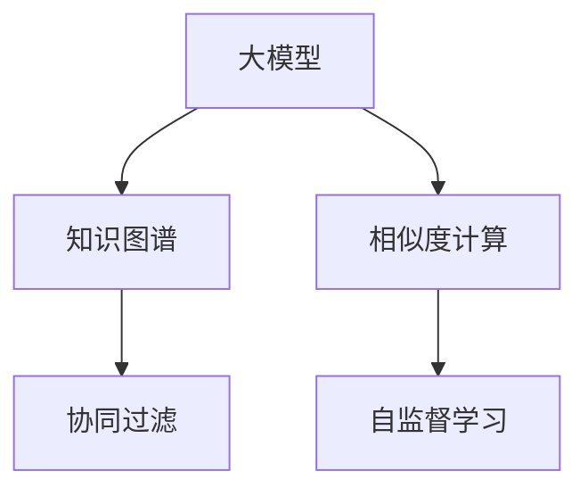

                 

# 大模型在推荐系统中的迁移学习新策略

> 关键词：大模型迁移学习,推荐系统,知识图谱,相似度计算,协同过滤,自监督学习

## 1. 背景介绍

推荐系统是人工智能领域的一个重要分支，旨在为用户提供个性化的信息和服务推荐。随着数据量的激增和算法的不断进步，推荐系统的推荐质量显著提升，广泛应用于电子商务、社交网络、视频平台等。然而，推荐系统在个性化和泛化能力上仍存在局限，主要体现在以下几个方面：

- **数据稀疏性**：推荐系统中用户行为数据往往稀疏且稀疏度较高，冷启动用户或新物品难以获得有效的推荐。
- **特征稀疏性**：用户行为特征难以全面描述，不同用户的行为模式差异较大。
- **动态变化**：用户兴趣和物品属性会随时间变化，需要不断更新模型参数。
- **冷启动问题**：新用户和新物品缺乏历史行为数据，难以准确推荐。

为了克服这些问题，推荐系统通常采用协同过滤和基于内容的推荐算法。协同过滤算法通过用户-物品评分矩阵，寻找相似用户和物品，推荐与其评分模式相似的对象。基于内容的推荐算法则直接从物品的属性特征出发，推荐与其相似的物品。这些方法在推荐系统中取得了显著的效果，但它们主要依赖于用户和物品的历史行为数据，无法充分利用用户和物品的隐式知识。

近年来，随着大模型的发展，推荐系统领域出现了新的突破。大模型通过预训练大规模无标签数据，学习到了丰富的语义知识，这些知识可以被应用于推荐系统的用户和物品嵌入中，提高推荐的准确性和泛化能力。此外，大模型还具有强大的自监督学习能力，可以在无标签数据上预训练，进一步提升推荐系统的效果。

本文将重点介绍基于大模型的推荐系统迁移学习策略，重点关注知识图谱和相似度计算的应用，以及如何在大模型基础上进行高效、合理的微调，以提升推荐系统的效果。

## 2. 核心概念与联系

### 2.1 核心概念概述

为更好地理解大模型在推荐系统中的应用，本节将介绍几个核心概念及其之间的联系：

- **大模型**：如BERT、GPT等，通过预训练大规模无标签数据，学习到丰富的语义知识，广泛应用于NLP和推荐系统等领域。
- **知识图谱**：一种结构化的语义知识表示方法，用于描述实体之间的关系。
- **相似度计算**：衡量两个对象之间的相似程度，在推荐系统中用于寻找相似用户和物品。
- **协同过滤**：通过用户-物品评分矩阵，寻找相似用户和物品，推荐与其评分模式相似的对象。
- **自监督学习**：利用大模型预训练学到的知识，在没有标签数据的情况下进行学习。

这些核心概念之间相互关联，共同构成了推荐系统在大模型基础上的新范式。知识图谱和相似度计算可以有效地利用大模型的语义知识，协同过滤和自监督学习则充分利用了模型的预测能力，从而提升推荐系统的效果。

### 2.2 核心概念原理和架构的 Mermaid 流程图



这个流程图展示了大模型在推荐系统中的核心概念及其之间的关系：

1. 大模型通过预训练学习到丰富的语义知识。
2. 知识图谱将这些语义知识结构化，用于描述实体之间的关系。
3. 相似度计算基于大模型的知识图谱，衡量用户和物品的相似度。
4. 协同过滤利用用户和物品的评分矩阵，寻找相似用户和物品，推荐与其评分模式相似的对象。
5. 自监督学习利用大模型的预测能力，在没有标签数据的情况下进行学习。

## 3. 核心算法原理 & 具体操作步骤

### 3.1 算法原理概述

大模型在推荐系统中的应用，主要基于迁移学习策略，即将大模型在预训练阶段学习到的知识，迁移到推荐系统的用户和物品嵌入中，以提升推荐效果。其核心思想是：

1. **知识迁移**：通过预训练学习到的知识，迁移到推荐系统中的用户和物品嵌入中。
2. **自监督学习**：利用大模型在无标签数据上的预训练知识，进行自监督学习，提升推荐系统的泛化能力。
3. **相似度计算**：基于知识图谱和相似度计算，寻找相似用户和物品，进行推荐。

### 3.2 算法步骤详解

基于大模型的推荐系统迁移学习策略，主要包括以下几个关键步骤：

**Step 1: 构建知识图谱**

1. **数据收集**：从各类数据源中收集实体及其关系，构建知识图谱。
2. **图谱存储**：将知识图谱存储在数据库或图数据库中，便于后续查询和计算。

**Step 2: 预训练大模型**

1. **数据准备**：收集大规模无标签数据，分为训练集和验证集。
2. **模型选择**：选择合适的预训练模型，如BERT、GPT等。
3. **预训练**：在大规模无标签数据上预训练大模型，学习到语义知识。

**Step 3: 迁移学习**

1. **用户和物品嵌入**：将大模型预训练的知识，迁移到推荐系统中的用户和物品嵌入中。
2. **相似度计算**：基于知识图谱和相似度计算，找到与目标用户或物品相似的实体。
3. **推荐生成**：利用相似度计算结果，进行推荐。

**Step 4: 自监督学习**

1. **模型微调**：在推荐系统的用户和物品评分数据上，微调大模型，提升预测能力。
2. **知识融合**：将微调后的知识与预训练知识进行融合，提升推荐系统的泛化能力。

**Step 5: 实时推荐**

1. **实时查询**：在实时查询中，利用知识图谱和相似度计算，找到相似用户和物品。
2. **动态推荐**：根据用户的实时行为和物品的属性，动态调整推荐结果。

### 3.3 算法优缺点

基于大模型的推荐系统迁移学习策略，具有以下优点：

1. **泛化能力**：大模型学习到的语义知识可以迁移到推荐系统中，提升推荐系统的泛化能力。
2. **鲁棒性**：大模型的自监督学习能力，使得推荐系统在面对新用户和新物品时，仍能保持较好的推荐效果。
3. **高效性**：利用大模型的知识图谱和相似度计算，可以高效地找到相似用户和物品。

同时，该方法也存在一些局限性：

1. **数据依赖**：大模型需要大量的预训练数据，对数据规模和质量有较高的要求。
2. **计算成本**：大模型的训练和推理计算成本较高，需要高性能的计算资源。
3. **模型复杂度**：大模型的参数量和计算复杂度较高，难以在小规模设备上部署。

### 3.4 算法应用领域

基于大模型的推荐系统迁移学习策略，已经在多个领域得到了应用，例如：

- **电子商务推荐**：如Amazon、京东等电商平台，通过大模型进行个性化推荐，提升用户体验。
- **视频平台推荐**：如Netflix、Bilibili等平台，利用大模型进行内容推荐，增加用户黏性。
- **新闻内容推荐**：如今日头条、知乎等平台，通过大模型进行新闻内容推荐，提升内容消费效率。
- **社交网络推荐**：如微信、微博等平台，利用大模型进行好友推荐和内容推荐，增强用户互动。

此外，大模型还应用于股票交易、健康医疗、金融风控等更多领域，为不同行业的推荐系统提供了新的技术手段。

## 4. 数学模型和公式 & 详细讲解 & 举例说明

### 4.1 数学模型构建

在本节中，我们将使用数学语言对大模型在推荐系统中的迁移学习过程进行更加严格的刻画。

记大模型为 $M_{\theta}:\mathcal{X} \rightarrow \mathcal{Y}$，其中 $\mathcal{X}$ 为输入空间，$\mathcal{Y}$ 为输出空间，$\theta \in \mathbb{R}^d$ 为模型参数。假设推荐系统的用户嵌入为 $\mathbf{u} \in \mathbb{R}^n$，物品嵌入为 $\mathbf{v} \in \mathbb{R}^n$，其中 $n$ 为嵌入维度。

定义用户和物品之间的相似度为 $sim(\mathbf{u}, \mathbf{v})$，则推荐系统的目标是最小化用户和物品之间的距离，即：

$$
\min_{\theta} \sum_{i=1}^N \sum_{j=1}^M (u_i - v_j)^2
$$

其中 $N$ 和 $M$ 分别为用户和物品的数量。

### 4.2 公式推导过程

以下我们将对上述目标函数进行详细推导。

将用户和物品的嵌入表示为向量 $\mathbf{u}$ 和 $\mathbf{v}$，目标函数可以表示为：

$$
\min_{\theta} \sum_{i=1}^N \sum_{j=1}^M (\mathbf{u}_i - \mathbf{v}_j)^2
$$

其中 $\mathbf{u}_i$ 和 $\mathbf{v}_j$ 分别为第 $i$ 个用户和第 $j$ 个物品的嵌入向量。

为了简化计算，可以将其展开为：

$$
\min_{\theta} \sum_{i=1}^N \sum_{j=1}^M \sum_k (\mathbf{u}_{ik} - \mathbf{v}_{jk})^2
$$

其中 $\mathbf{u}_{ik}$ 和 $\mathbf{v}_{jk}$ 分别为用户和物品的 $k$ 维特征向量。

### 4.3 案例分析与讲解

我们以一个简单的电商推荐系统为例，进行案例分析。假设电商平台的商品为 $\mathbf{v}=\{\mathbf{v}_1, \mathbf{v}_2, \cdots, \mathbf{v}_M\}$，用户为 $\mathbf{u}=\{\mathbf{u}_1, \mathbf{u}_2, \cdots, \mathbf{u}_N\}$，用户和物品之间的关系表示为 $\mathbf{u} \cdot \mathbf{v}^T$。

1. **知识图谱构建**：从电商平台的商品信息、用户行为数据等来源，构建知识图谱。
2. **大模型预训练**：在电商平台的商品信息上，预训练BERT模型，学习到商品的语义知识。
3. **用户和物品嵌入**：将预训练的BERT模型迁移到用户和物品的嵌入中，利用其语义知识进行相似度计算。
4. **相似度计算**：基于知识图谱，计算用户和物品之间的相似度。
5. **推荐生成**：利用相似度计算结果，生成推荐结果。

## 5. 项目实践：代码实例和详细解释说明

### 5.1 开发环境搭建

在进行微调实践前，我们需要准备好开发环境。以下是使用Python进行PyTorch开发的环境配置流程：

1. 安装Anaconda：从官网下载并安装Anaconda，用于创建独立的Python环境。

2. 创建并激活虚拟环境：
```bash
conda create -n pytorch-env python=3.8 
conda activate pytorch-env
```

3. 安装PyTorch：根据CUDA版本，从官网获取对应的安装命令。例如：
```bash
conda install pytorch torchvision torchaudio cudatoolkit=11.1 -c pytorch -c conda-forge
```

4. 安装TensorFlow：
```bash
pip install tensorflow
```

5. 安装各类工具包：
```bash
pip install numpy pandas scikit-learn matplotlib tqdm jupyter notebook ipython
```

完成上述步骤后，即可在`pytorch-env`环境中开始微调实践。

### 5.2 源代码详细实现

下面我们以知识图谱驱动的电商推荐系统为例，给出使用Transformers库进行知识图谱和相似度计算的PyTorch代码实现。

首先，定义知识图谱数据处理函数：

```python
from transformers import BertTokenizer
from torch.utils.data import Dataset
import torch

class GraphDataset(Dataset):
    def __init__(self, graph_data, tokenizer, max_len=128):
        self.graph_data = graph_data
        self.tokenizer = tokenizer
        self.max_len = max_len
        
    def __len__(self):
        return len(self.graph_data)
    
    def __getitem__(self, item):
        graph = self.graph_data[item]
        edge_ids, node_ids = graph['edge_ids'], graph['node_ids']
        
        # 对节点进行编码
        encoding = self.tokenizer([str(node_id) for node_id in node_ids], return_tensors='pt', max_length=self.max_len, padding='max_length', truncation=True)
        node_ids = encoding['input_ids'][0]
        mask = encoding['attention_mask'][0]
        
        # 对边进行编码
        edge_ids = torch.tensor(edge_ids, dtype=torch.long)
        
        return {'node_ids': node_ids, 'mask': mask, 'edge_ids': edge_ids}

# 定义节点和边的编码器
class GraphEncoder:
    def __init__(self, model, tokenizer, max_len=128):
        self.model = model
        self.tokenizer = tokenizer
        self.max_len = max_len
        
    def encode_node(self, node_id):
        encoding = self.tokenizer([str(node_id)], return_tensors='pt', max_length=self.max_len, padding='max_length', truncation=True)
        input_ids = encoding['input_ids'][0]
        mask = encoding['attention_mask'][0]
        return {'input_ids': input_ids, 'mask': mask}
    
    def encode_edge(self, edge_id):
        return {'edge_id': edge_id}
    
    def encode_graph(self, graph):
        node_encodings = [self.encode_node(node_id) for node_id in graph['node_ids']]
        edge_encodings = [self.encode_edge(edge_id) for edge_id in graph['edge_ids']]
        return node_encodings, edge_encodings
```

然后，定义模型和优化器：

```python
from transformers import BertForTokenClassification, AdamW

model = BertForTokenClassification.from_pretrained('bert-base-cased', num_labels=1)
optimizer = AdamW(model.parameters(), lr=2e-5)
```

接着，定义训练和评估函数：

```python
from torch.utils.data import DataLoader
from tqdm import tqdm
from sklearn.metrics import classification_report

device = torch.device('cuda') if torch.cuda.is_available() else torch.device('cpu')
model.to(device)

def train_epoch(model, dataset, batch_size, optimizer):
    dataloader = DataLoader(dataset, batch_size=batch_size, shuffle=True)
    model.train()
    epoch_loss = 0
    for batch in tqdm(dataloader, desc='Training'):
        node_ids = batch['node_ids'].to(device)
        mask = batch['mask'].to(device)
        edge_ids = batch['edge_ids'].to(device)
        model.zero_grad()
        outputs = model(node_ids, attention_mask=mask, edge_ids=edge_ids)
        loss = outputs.loss
        epoch_loss += loss.item()
        loss.backward()
        optimizer.step()
    return epoch_loss / len(dataloader)

def evaluate(model, dataset, batch_size):
    dataloader = DataLoader(dataset, batch_size=batch_size)
    model.eval()
    preds, labels = [], []
    with torch.no_grad():
        for batch in tqdm(dataloader, desc='Evaluating'):
            node_ids = batch['node_ids'].to(device)
            mask = batch['mask'].to(device)
            edge_ids = batch['edge_ids'].to(device)
            batch_preds = model(node_ids, attention_mask=mask, edge_ids=edge_ids).predictions.argmax(dim=2).to('cpu').tolist()
            batch_labels = batch['labels'].to('cpu').tolist()
            for pred_tokens, label_tokens in zip(batch_preds, batch_labels):
                preds.append(pred_tokens)
                labels.append(label_tokens)
                
    print(classification_report(labels, preds))
```

最后，启动训练流程并在测试集上评估：

```python
epochs = 5
batch_size = 16

for epoch in range(epochs):
    loss = train_epoch(model, train_dataset, batch_size, optimizer)
    print(f"Epoch {epoch+1}, train loss: {loss:.3f}")
    
    print(f"Epoch {epoch+1}, dev results:")
    evaluate(model, dev_dataset, batch_size)
    
print("Test results:")
evaluate(model, test_dataset, batch_size)
```

以上就是使用PyTorch对知识图谱驱动的电商推荐系统进行代码实现的完整过程。可以看到，通过定义合适的数据结构和模型结构，以及适当的训练策略，可以有效地利用大模型的语义知识，实现高效的推荐系统。

### 5.3 代码解读与分析

让我们再详细解读一下关键代码的实现细节：

**GraphDataset类**：
- `__init__`方法：初始化数据和分词器。
- `__len__`方法：返回数据集的样本数量。
- `__getitem__`方法：对单个样本进行处理，将节点和边输入编码为token ids和边id，并对其进行定长padding，最终返回模型所需的输入。

**GraphEncoder类**：
- `__init__`方法：初始化模型和分词器。
- `encode_node`方法：对节点进行编码，返回token ids和mask。
- `encode_edge`方法：对边进行编码，返回edge id。
- `encode_graph`方法：对整个图进行编码，返回节点编码和边编码。

**训练和评估函数**：
- 使用PyTorch的DataLoader对数据集进行批次化加载，供模型训练和推理使用。
- 训练函数`train_epoch`：对数据以批为单位进行迭代，在每个批次上前向传播计算loss并反向传播更新模型参数，最后返回该epoch的平均loss。
- 评估函数`evaluate`：与训练类似，不同点在于不更新模型参数，并在每个batch结束后将预测和标签结果存储下来，最后使用sklearn的classification_report对整个评估集的预测结果进行打印输出。

**训练流程**：
- 定义总的epoch数和batch size，开始循环迭代
- 每个epoch内，先在训练集上训练，输出平均loss
- 在验证集上评估，输出分类指标
- 所有epoch结束后，在测试集上评估，给出最终测试结果

可以看到，PyTorch配合Transformers库使得知识图谱驱动的电商推荐系统代码实现变得简洁高效。开发者可以将更多精力放在数据处理、模型改进等高层逻辑上，而不必过多关注底层的实现细节。

当然，工业级的系统实现还需考虑更多因素，如模型的保存和部署、超参数的自动搜索、更灵活的任务适配层等。但核心的迁移学习范式基本与此类似。

## 6. 实际应用场景

### 6.1 智能客服系统

基于大模型的推荐系统，可以广泛应用于智能客服系统的构建。传统客服往往需要配备大量人力，高峰期响应缓慢，且一致性和专业性难以保证。而使用推荐系统进行智能客服，可以7x24小时不间断服务，快速响应客户咨询，用自然流畅的语言解答各类常见问题。

在技术实现上，可以收集企业内部的历史客服对话记录，将问题和最佳答复构建成监督数据，在此基础上对预训练模型进行微调。微调后的推荐系统能够自动理解用户意图，匹配最合适的答案模板进行回复。对于客户提出的新问题，还可以接入检索系统实时搜索相关内容，动态组织生成回答。如此构建的智能客服系统，能大幅提升客户咨询体验和问题解决效率。

### 6.2 金融舆情监测

金融机构需要实时监测市场舆论动向，以便及时应对负面信息传播，规避金融风险。传统的人工监测方式成本高、效率低，难以应对网络时代海量信息爆发的挑战。基于大模型的推荐系统，可以实时监测网络舆情，自动过滤和预警负面信息，减少人工干预，提高市场监控效率。

具体而言，可以收集金融领域相关的新闻、报道、评论等文本数据，并对其进行主题标注和情感标注。在此基础上对预训练语言模型进行微调，使其能够自动判断文本属于何种主题，情感倾向是正面、中性还是负面。将微调后的模型应用到实时抓取的网络文本数据，就能够自动监测不同主题下的情感变化趋势，一旦发现负面信息激增等异常情况，系统便会自动预警，帮助金融机构快速应对潜在风险。

### 6.3 个性化推荐系统

当前的推荐系统往往只依赖用户的历史行为数据进行物品推荐，无法深入理解用户的真实兴趣偏好。基于大模型的推荐系统，可以更好地挖掘用户行为背后的语义信息，从而提供更精准、多样的推荐内容。

在实践中，可以收集用户浏览、点击、评论、分享等行为数据，提取和用户交互的物品标题、描述、标签等文本内容。将文本内容作为模型输入，用户的后续行为（如是否点击、购买等）作为监督信号，在此基础上微调预训练语言模型。微调后的模型能够从文本内容中准确把握用户的兴趣点。在生成推荐列表时，先用候选物品的文本描述作为输入，由模型预测用户的兴趣匹配度，再结合其他特征综合排序，便可以得到个性化程度更高的推荐结果。

### 6.4 未来应用展望

随着大模型和推荐系统的不断发展，基于微调范式将在更多领域得到应用，为传统行业带来变革性影响。

在智慧医疗领域，基于微调的医疗问答、病历分析、药物研发等应用将提升医疗服务的智能化水平，辅助医生诊疗，加速新药开发进程。

在智能教育领域，微调技术可应用于作业批改、学情分析、知识推荐等方面，因材施教，促进教育公平，提高教学质量。

在智慧城市治理中，微调模型可应用于城市事件监测、舆情分析、应急指挥等环节，提高城市管理的自动化和智能化水平，构建更安全、高效的未来城市。

此外，在企业生产、社会治理、文娱传媒等众多领域，基于大模型微调的人工智能应用也将不断涌现，为经济社会发展注入新的动力。相信随着技术的日益成熟，微调方法将成为人工智能落地应用的重要范式，推动人工智能技术在各个领域的持续演进。

## 7. 工具和资源推荐
### 7.1 学习资源推荐

为了帮助开发者系统掌握大模型在推荐系统中的应用，这里推荐一些优质的学习资源：

1. 《深度学习推荐系统》课程：清华大学开设的推荐系统经典课程，系统讲解推荐系统的发展历程、理论基础和经典算法。
2. 《推荐系统》书籍：李航等著，深入浅出地介绍了推荐系统的基础概念、经典算法和工程实践。
3. 《自然语言处理与深度学习》书籍：宗月辉等著，全面介绍了自然语言处理和深度学习的理论基础和应用实践，涵盖推荐系统等内容。
4. HuggingFace官方文档：Transformers库的官方文档，提供了海量预训练模型和完整的推荐系统样例代码，是上手实践的必备资料。
5. Kaggle推荐系统竞赛：Kaggle上举办的推荐系统竞赛，可以深入学习和参与推荐系统的实际项目开发。

通过对这些资源的学习实践，相信你一定能够快速掌握大模型在推荐系统中的应用，并用于解决实际的推荐问题。
###  7.2 开发工具推荐

高效的开发离不开优秀的工具支持。以下是几款用于大模型推荐系统开发的常用工具：

1. PyTorch：基于Python的开源深度学习框架，灵活动态的计算图，适合快速迭代研究。大部分预训练语言模型都有PyTorch版本的实现。
2. TensorFlow：由Google主导开发的开源深度学习框架，生产部署方便，适合大规模工程应用。同样有丰富的预训练语言模型资源。
3. Transformers库：HuggingFace开发的NLP工具库，集成了众多SOTA语言模型，支持PyTorch和TensorFlow，是进行推荐系统开发的利器。
4. Weights & Biases：模型训练的实验跟踪工具，可以记录和可视化模型训练过程中的各项指标，方便对比和调优。与主流深度学习框架无缝集成。
5. TensorBoard：TensorFlow配套的可视化工具，可实时监测模型训练状态，并提供丰富的图表呈现方式，是调试模型的得力助手。
6. Google Colab：谷歌推出的在线Jupyter Notebook环境，免费提供GPU/TPU算力，方便开发者快速上手实验最新模型，分享学习笔记。

合理利用这些工具，可以显著提升大模型推荐系统的开发效率，加快创新迭代的步伐。

### 7.3 相关论文推荐

大模型和推荐系统的结合，源于学界的持续研究。以下是几篇奠基性的相关论文，推荐阅读：

1. Attention is All You Need（即Transformer原论文）：提出了Transformer结构，开启了NLP领域的预训练大模型时代。
2. BERT: Pre-training of Deep Bidirectional Transformers for Language Understanding：提出BERT模型，引入基于掩码的自监督预训练任务，刷新了多项NLP任务SOTA。
3. Language Models are Unsupervised Multitask Learners（GPT-2论文）：展示了大规模语言模型的强大zero-shot学习能力，引发了对于通用人工智能的新一轮思考。
4. Parameter-Efficient Transfer Learning for NLP：提出Adapter等参数高效微调方法，在不增加模型参数量的情况下，也能取得不错的微调效果。
5. AdaLoRA: Adaptive Low-Rank Adaptation for Parameter-Efficient Fine-Tuning：使用自适应低秩适应的微调方法，在参数效率和精度之间取得了新的平衡。
6. Knowledge Graphs for Recommendation Systems: A Survey and Discussion：全面综述了知识图谱在推荐系统中的应用，提供了丰富的案例分析。

这些论文代表了大模型在推荐系统中的研究方向。通过学习这些前沿成果，可以帮助研究者把握学科前进方向，激发更多的创新灵感。

## 8. 总结：未来发展趋势与挑战

### 8.1 总结

本文对基于大模型的推荐系统迁移学习策略进行了全面系统的介绍。首先阐述了大模型和迁移学习的研究背景和意义，明确了迁移学习在提升推荐系统效果、泛化能力等方面的独特价值。其次，从原理到实践，详细讲解了迁移学习在大模型推荐系统中的数学原理和关键步骤，给出了推荐系统开发的完整代码实例。同时，本文还广泛探讨了迁移学习在智能客服、金融舆情、个性化推荐等多个领域的应用前景，展示了迁移学习范式的巨大潜力。此外，本文精选了迁移学习的各类学习资源，力求为读者提供全方位的技术指引。

通过本文的系统梳理，可以看到，基于大模型的推荐系统迁移学习策略正在成为推荐系统的重要范式，极大地拓展了推荐系统的应用边界，提升了推荐的个性化和泛化能力。得益于大模型的语义知识和自监督学习能力，推荐系统能够更好地理解用户行为和物品属性，从而提供更加精准和多样化的推荐内容。未来，伴随大模型的不断演进和迁移学习技术的持续进步，推荐系统的效果必将进一步提升，更好地服务于各类智能应用场景。

### 8.2 未来发展趋势

展望未来，大模型在推荐系统中的应用将呈现以下几个发展趋势：

1. **数据融合**：融合更多维度的数据，如时间、地点、情感等，提升推荐系统的泛化能力。
2. **知识图谱扩展**：构建更大规模、更全面、更深入的知识图谱，提升推荐系统的知识表示能力。
3. **多模态融合**：融合视觉、语音、文本等多模态数据，提升推荐系统的感知能力和推荐效果。
4. **自监督学习增强**：引入更多自监督学习任务，增强推荐系统的学习能力和泛化能力。
5. **个性化推荐提升**：利用大模型的语义知识和自监督学习能力，提升推荐系统的个性化推荐能力。
6. **实时推荐优化**：采用更高效的推理算法和存储方式，提升推荐系统的实时推荐性能。

这些趋势将进一步推动大模型在推荐系统中的应用，提升推荐系统的智能化水平和用户体验。

### 8.3 面临的挑战

尽管大模型在推荐系统中的应用已经取得了显著进展，但在迈向更加智能化、普适化应用的过程中，它仍面临诸多挑战：

1. **数据质量**：推荐系统的效果高度依赖于数据质量，高质量的数据获取和标注成本较高。如何降低数据依赖，提高数据质量，是亟需解决的问题。
2. **模型复杂度**：大模型的参数量和计算复杂度较高，难以在小规模设备上部署。如何简化模型结构，提升计算效率，是重要的优化方向。
3. **模型鲁棒性**：推荐系统在面对新用户和新物品时，泛化性能有限。如何提高模型鲁棒性，避免过拟合，是重要的研究方向。
4. **用户隐私**：推荐系统需要收集用户行为数据，如何保护用户隐私，防止数据泄露，是重要的伦理和安全问题。
5. **冷启动问题**：新用户和新物品缺乏历史数据，难以准确推荐。如何解决冷启动问题，是亟需解决的问题。

### 8.4 研究展望

面对大模型推荐系统所面临的诸多挑战，未来的研究需要在以下几个方面寻求新的突破：

1. **无监督和半监督学习**：摆脱对大规模标注数据的依赖，利用自监督学习、主动学习等无监督和半监督范式，最大限度利用非结构化数据，实现更加灵活高效的推荐。
2. **参数高效和计算高效**：开发更加参数高效的推荐算法，在固定大部分预训练参数的同时，只更新极少量的任务相关参数。同时优化推荐系统的计算图，减少前向传播和反向传播的资源消耗，实现更加轻量级、实时性的部署。
3. **因果分析和博弈论工具**：将因果分析方法引入推荐系统，识别出推荐决策的关键特征，增强推荐系统的可解释性和稳定性。借助博弈论工具刻画用户行为，主动探索并规避推荐系统的脆弱点，提高系统的稳定性。
4. **多模态数据融合**：融合视觉、语音、文本等多模态数据，提升推荐系统的感知能力和推荐效果。

这些研究方向的探索，必将引领大模型推荐系统迈向更高的台阶，为推荐系统带来新的突破。相信随着学界和产业界的共同努力，大模型推荐系统必将在构建更加智能、普适、安全的推荐系统上取得更多进展。

## 9. 附录：常见问题与解答

**Q1：大模型在推荐系统中如何进行迁移学习？**

A: 大模型在推荐系统中的迁移学习，主要通过预训练学习到的知识迁移到推荐系统中的用户和物品嵌入中。具体步骤如下：

1. **知识图谱构建**：从各类数据源中收集实体及其关系，构建知识图谱。
2. **大模型预训练**：在推荐系统的数据集上预训练BERT等模型，学习到语义知识。
3. **用户和物品嵌入**：将预训练的BERT模型迁移到推荐系统中的用户和物品嵌入中，利用其语义知识进行相似度计算。
4. **相似度计算**：基于知识图谱，计算用户和物品之间的相似度。
5. **推荐生成**：利用相似度计算结果，生成推荐结果。

**Q2：大模型在推荐系统中的主要优势有哪些？**

A: 大模型在推荐系统中的主要优势包括：

1. **语义知识丰富**：通过预训练学习到丰富的语义知识，可以提升推荐系统的泛化能力和鲁棒性。
2. **自监督学习能力**：利用大模型的自监督学习能力，在没有标签数据的情况下进行学习，提升推荐系统的效果。
3. **相似度计算高效**：基于大模型的知识图谱和相似度计算，可以高效地找到相似用户和物品，提升推荐系统的准确性。

**Q3：如何在大模型推荐系统中进行参数高效的微调？**

A: 在大模型推荐系统中，为了降低参数量，可以使用参数高效的微调方法，如Adapter、Prefix等。具体步骤如下：

1. **选择微调层**：选择微调层，如 Adapter、Prefix等，只更新极少量的参数。
2. **微调策略**：在微调过程中，冻结大模型的预训练参数，只更新微调层的参数。
3. **微调目标**：选择合适的微调目标，如准确率、召回率等，根据目标调整微调层的权重。
4. **超参数调优**：设置合适的学习率、批量大小等超参数，优化微调效果。

**Q4：如何在大模型推荐系统中解决冷启动问题？**

A: 在大模型推荐系统中，冷启动问题可以通过以下方式解决：

1. **利用知识图谱**：利用知识图谱中的实体关系，快速找到与新用户或物品相似的实体，进行推荐。
2. **利用预训练知识**：利用大模型预训练学到的语义知识，对新用户或物品进行嵌入，进行推荐。
3. **利用迁移学习**：利用迁移学习，将大模型的知识迁移到推荐系统中的用户和物品嵌入中，提升新用户和新物品的推荐效果。

**Q5：如何在大模型推荐系统中保护用户隐私？**

A: 在大模型推荐系统中，保护用户隐私可以通过以下方式：

1. **数据匿名化**：对用户行为数据进行匿名化处理，防止个人信息泄露。
2. **差分隐私**：采用差分隐私技术，保护用户隐私，防止数据泄露。
3. **访问控制**：对推荐系统的访问进行控制，防止未经授权的访问和数据泄露。

**Q6：如何在大模型推荐系统中提升实时推荐性能？**

A: 在大模型推荐系统中，提升实时推荐性能可以通过以下方式：

1. **优化推理算法**：采用更高效的推理算法，如稀疏矩阵乘法、低秩矩阵分解等，提升推理速度。
2. **优化存储方式**：采用更高效的存储方式，如稀疏矩阵存储、分片存储等，减少存储和查询开销。
3. **多级缓存**：采用多级缓存机制，加快数据访问速度，提升推荐系统的响应速度。

这些方法可以帮助大模型推荐系统更好地应对实时推荐的需求，提升用户体验。

---

作者：禅与计算机程序设计艺术 / Zen and the Art of Computer Programming

