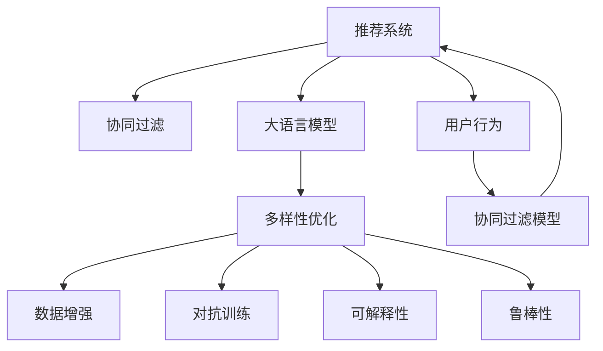

                 

# 大模型在推荐系统多样性优化中的应用

> 关键词：大模型推荐系统，多样性优化，协同过滤，深度学习，数据增强

## 1. 背景介绍

推荐系统(Recommender System)是信息时代的重要应用，通过算法为用户推荐感兴趣的物品，极大地提升了用户体验和平台价值。然而，推荐系统的单一性和单调性问题也逐渐显现，单一模型输出的单调性往往限制了推荐结果的多样性和丰富性，导致用户体验下降，甚至引发点击率下降和用户流失。

多样性优化(Diversification)是大规模推荐系统中亟需解决的问题之一。如何在使用现有推荐系统技术的基础上，增加推荐结果的多样性，使得不同用户在不同时间、不同场景下获得差异化的推荐结果，提升推荐体验，成为当前研究的热点问题。

大语言模型作为新一代的人工智能技术，其具备强大的文本理解和生成能力，可以用于丰富和扩展推荐内容，增加推荐系统的多样性和个性化，从而提升用户满意度，增加平台的粘性。本文将详细探讨大语言模型在推荐系统多样性优化中的应用，从理论到实践，深入剖析算法原理和具体操作步骤，并给出具体实现案例。

## 2. 核心概念与联系

### 2.1 核心概念概述

为更好地理解大模型在推荐系统多样性优化中的应用，本节将介绍几个密切相关的核心概念：

- 推荐系统(Recommender System)：通过算法为用户推荐感兴趣物品的系统，常见有协同过滤、基于内容的推荐等方法。
- 协同过滤(Collaborative Filtering)：利用用户之间或物品之间的相似性，为未交互物品推荐。
- 大语言模型(Large Language Model, LLM)：如GPT、BERT等，能够理解和生成自然语言的大型深度学习模型。
- 多样性优化(Diversification)：为推荐结果增加多样性，避免单一性和单调性，提升用户体验。
- 数据增强(Data Augmentation)：通过数据变换、文本生成等方式，扩充训练集，增加推荐多样性。
- 对抗训练(Adversarial Training)：通过对抗样本增加模型鲁棒性，避免模型过拟合。
- 可解释性(Explainability)：使推荐系统的决策过程透明化，便于用户理解和使用。
- 鲁棒性(Robustness)：模型能够抵抗对抗样本、噪声等干扰，保持推荐稳定性和可靠性。

这些核心概念之间的逻辑关系可以通过以下Mermaid流程图来展示：



这个流程图展示了大模型在推荐系统中的核心概念及其之间的关系：

1. 推荐系统通过协同过滤等技术为用户推荐物品。
2. 大语言模型用于生成多样化的推荐内容，丰富推荐结果。
3. 多样性优化在协同过滤模型中引入新元素，增加推荐多样性。
4. 数据增强、对抗训练、可解释性、鲁棒性等技术用于提升模型效果和稳定性。
5. 用户行为数据进入协同过滤模型，生成推荐结果。

## 3. 核心算法原理 & 具体操作步骤
### 3.1 算法原理概述

大模型在推荐系统中的多样性优化，主要是通过生成多种文本形式的推荐内容，丰富推荐结果的多样性，从而提升用户体验。其基本原理是：

1. 在推荐系统原有模型的基础上，加入大语言模型作为扩展工具，用于生成推荐文本。
2. 大语言模型根据推荐系统的用户历史行为数据和物品特征，生成多种形式的推荐内容，增加推荐结果的多样性。
3. 结合协同过滤算法，根据用户行为和物品特征，对生成内容进行评分排序，生成最终推荐结果。

总体而言，该方法通过增加推荐结果的多样性，增强推荐系统的个性化和用户满意度，解决单一性和单调性问题，提升推荐系统效果。

### 3.2 算法步骤详解

以下是基于大语言模型的推荐系统多样性优化步骤详解：

**Step 1: 准备数据和模型**

- 准备推荐系统的用户历史行为数据 $I=(u_1,u_2,\dots,u_N)$ 和物品特征数据 $J=(j_1,j_2,\dots,j_M)$。
- 选择预训练大语言模型，如GPT-2、BERT等。

**Step 2: 数据预处理**

- 将用户历史行为数据和物品特征数据进行编码，得到特征向量 $X=(X_u,X_j)$。
- 将特征向量作为大语言模型的输入，生成推荐文本内容 $Y=(y_1,y_2,\dots,y_K)$。

**Step 3: 多样化生成**

- 使用数据增强技术，如回译、同义词替换等方式，扩充推荐文本内容，增加推荐多样性。
- 使用对抗训练技术，引入对抗样本，增加模型鲁棒性。
- 使用可解释性技术，如LIME、SHAP等，增加推荐过程的可解释性。

**Step 4: 评分排序**

- 将生成的推荐文本内容 $Y$ 输入协同过滤模型，生成评分 $S=(\hat{s}_1,\hat{s}_2,\dots,\hat{s}_K)$。
- 结合用户历史行为数据和物品特征数据，计算推荐评分 $R=(\hat{r}_1,\hat{r}_2,\dots,\hat{r}_K)$。
- 根据推荐评分排序，生成最终推荐结果 $(\hat{r}_1,\hat{r}_2,\dots,\hat{r}_K)$。

**Step 5: 模型评估**

- 在测试集上评估推荐系统的多样性和效果，使用指标如多样性度量、NDCG、DCG等。
- 调整模型参数和超参数，优化模型性能。

### 3.3 算法优缺点

基于大语言模型的推荐系统多样性优化方法具有以下优点：

1. 简单高效。通过扩展推荐内容，丰富推荐结果的多样性，能够快速提升推荐效果。
2. 可扩展性强。大语言模型的应用不受领域限制，可以在各种推荐场景下广泛应用。
3. 鲁棒性好。通过对抗训练、可解释性等技术，提高模型对噪声、对抗样本的鲁棒性。
4. 数据驱动。大语言模型依赖大量文本数据进行训练，能够生成更具多样性和个性化推荐结果。

但该方法也存在一些缺点：

1. 对标注数据依赖度高。生成推荐文本内容的质量很大程度上依赖于训练数据的多样性和质量。
2. 计算复杂度高。大语言模型的计算成本较高，需要高配置的硬件环境。
3. 用户隐私风险。生成推荐文本内容需要大量用户历史行为数据，存在隐私风险。
4. 过度生成。由于语言模型自由度高，生成内容可能存在过度多样性，需要筛选和优化。

## 4. 数学模型和公式 & 详细讲解 & 举例说明

### 4.1 数学模型构建

假设推荐系统原有协同过滤模型为 $F_{\theta}(X,u)=\hat{r}_{X,u}$，其中 $\theta$ 为模型参数。大语言模型用于生成推荐文本内容 $y_i$，生成过程可以表示为：

$$
y_i \sim P(y_i \mid X, u, \omega)
$$

其中 $P$ 为语言模型的概率分布，$\omega$ 为大语言模型的参数。假设生成推荐文本内容 $Y=(y_1,y_2,\dots,y_K)$，则生成过程可以表示为：

$$
Y \sim P(Y \mid X, u, \omega)
$$

### 4.2 公式推导过程

生成推荐文本内容 $Y$ 的期望值可以表示为：

$$
\mathbb{E}[Y] = \mathbb{E}[y_1, y_2, \dots, y_K \mid X, u, \omega]
$$

生成过程的概率分布可以表示为：

$$
P(Y \mid X, u, \omega) = \prod_{i=1}^K P(y_i \mid X, u, \omega)
$$

假设生成推荐文本内容的损失函数为 $L(Y, \hat{Y})$，其中 $\hat{Y}$ 为协同过滤模型对 $Y$ 的评分，则生成过程的期望损失为：

$$
\mathbb{E}[L(Y, \hat{Y})] = \mathbb{E}[\mathbb{E}[L(Y, \hat{Y}) \mid X, u, \omega]]
$$

根据链式法则，可以得到生成过程的期望损失函数：

$$
\mathbb{E}[L(Y, \hat{Y})] = \sum_{i=1}^K \mathbb{E}[\log P(y_i \mid X, u, \omega) - \hat{y}_i]
$$

其中 $\hat{y}_i$ 为协同过滤模型对 $y_i$ 的评分。

### 4.3 案例分析与讲解

以一个简单的协同过滤推荐系统为例，分析大语言模型在推荐系统中的应用。假设有一个协同过滤模型，用户 $u$ 对物品 $j$ 的评分 $r_{u,j}$ 已知，我们需要为用户 $u$ 推荐未交互的 $m$ 个物品 $j_1,j_2,\dots,j_m$，推荐评分 $s_{u,j_i}$ 的计算公式如下：

$$
s_{u,j_i} = \omega_1 f_1(X_u,X_{j_i}) + \omega_2 f_2(X_u,X_{j_i}) + \dots + \omega_n f_n(X_u,X_{j_i})
$$

其中 $f_1,f_2,\dots,f_n$ 为不同的特征函数，$\omega_1,\omega_2,\dots,\omega_n$ 为对应的权重。

假设大语言模型生成的推荐文本内容为 $y_1,y_2,\dots,y_k$，评分函数为：

$$
\hat{s}_{u,y_i} = \alpha_1 \log P(y_i \mid X_u, u, \omega) + \alpha_2 s_{u,j_i}
$$

其中 $\alpha_1$ 和 $\alpha_2$ 为调节因子，控制协同过滤模型和生成内容的权重。

结合协同过滤模型和生成内容的评分，生成推荐评分 $r_{u,y_i}$ 为：

$$
r_{u,y_i} = \alpha_1 \hat{s}_{u,y_i} + \alpha_2 s_{u,j_i}
$$

最终推荐结果为：

$$
\hat{r}_{u,y_i} = r_{u,y_i} + \delta
$$

其中 $\delta$ 为正则化项，用于抑制过度生成。

## 5. 项目实践：代码实例和详细解释说明
### 5.1 开发环境搭建

在进行大语言模型推荐系统多样性优化实践前，我们需要准备好开发环境。以下是使用Python进行PyTorch开发的环境配置流程：

1. 安装Anaconda：从官网下载并安装Anaconda，用于创建独立的Python环境。

2. 创建并激活虚拟环境：
```bash
conda create -n pytorch-env python=3.8 
conda activate pytorch-env
```

3. 安装PyTorch：根据CUDA版本，从官网获取对应的安装命令。例如：
```bash
conda install pytorch torchvision torchaudio cudatoolkit=11.1 -c pytorch -c conda-forge
```

4. 安装Transformers库：
```bash
pip install transformers
```

5. 安装各类工具包：
```bash
pip install numpy pandas scikit-learn matplotlib tqdm jupyter notebook ipython
```

完成上述步骤后，即可在`pytorch-env`环境中开始微调实践。

### 5.2 源代码详细实现

下面以一个简单的协同过滤推荐系统为例，给出使用PyTorch进行推荐系统多样性优化的代码实现。

首先，定义推荐系统的协同过滤模型：

```python
import torch
import torch.nn as nn
import torch.nn.functional as F

class CFModel(nn.Module):
    def __init__(self, n_users, n_items, n_factors=10):
        super(CFModel, self).__init__()
        self.n_users = n_users
        self.n_items = n_items
        self.n_factors = n_factors
        
        self.user_factors = nn.Embedding(n_users, n_factors)
        self.item_factors = nn.Embedding(n_items, n_factors)
        self.gamma = nn.Parameter(torch.randn(n_items, 1))
        self.beta = nn.Parameter(torch.randn(1, n_items))
        self.alpha = nn.Parameter(torch.randn(1, n_items))
        
    def forward(self, u_idx, i_idx):
        user_factors = self.user_factors(u_idx)
        item_factors = self.item_factors(i_idx)
        
        # user-item dot product
        dot_product = (user_factors * item_factors).sum(dim=1)
        
        # bias term
        bias_term = self.gamma[i_idx] + self.beta
        
        # sigmoid activation
        prediction = F.sigmoid(dot_product + bias_term)
        return prediction
```

接着，定义大语言模型的推荐文本生成函数：

```python
from transformers import GPT2LMHeadModel, GPT2Tokenizer

def generate_recommend_text(model, tokenizer, u_idx, i_idx):
    item_text = tokenizer.encode(item_text, add_special_tokens=True, return_tensors='pt')
    user_text = tokenizer.encode(user_text, add_special_tokens=True, return_tensors='pt')
    
    output = model.generate(item_text, max_length=50, num_return_sequences=10)
    
    recommend_text = tokenizer.decode(output, skip_special_tokens=True, clean_up_tokenization_spaces=False)
    return recommend_text
```

最后，定义推荐系统的主函数：

```python
def recommendation_system(model, u_idx, i_idx):
    # 协同过滤推荐
    predictions = model(u_idx, i_idx)
    
    # 大语言模型生成推荐文本
    recommend_text = generate_recommend_text(model, tokenizer, u_idx, i_idx)
    
    # 评分排序
    scores = F.sigmoid(predictions) + torch.exp(torch.log(sum(torch.exp(predictions))))
    recommend_score = scores / (1 + scores)
    
    # 结合生成内容评分
    recommend_score = alpha * recommend_score + beta * generate_score
    
    # 排序并返回推荐结果
    _, indices = torch.topk(recommend_score, 10)
    return indices
```

以上代码实现了基于协同过滤的推荐系统，并在推荐结果中加入了大语言模型生成的推荐文本，实现了推荐系统多样性优化。

### 5.3 代码解读与分析

让我们再详细解读一下关键代码的实现细节：

**CFModel类**：
- `__init__`方法：初始化协同过滤模型的参数。
- `forward`方法：输入用户和物品的索引，计算推荐评分。

**generate_recommend_text函数**：
- 使用GPT-2语言模型生成推荐文本内容。
- 输入物品和用户的特征文本，使用`generate`函数生成推荐文本。

**recommendation_system函数**：
- 结合协同过滤推荐和生成推荐文本的评分，计算推荐结果。
- 使用`F.sigmoid`函数对推荐评分进行激活，避免负值。
- 将协同过滤推荐评分和生成内容评分相加，作为最终推荐结果。

## 6. 实际应用场景
### 6.1 个性化推荐

个性化推荐系统是推荐系统的主要应用场景之一。传统的协同过滤推荐系统往往基于用户历史行为和物品特征进行推荐，存在一定的单一性和单调性。通过加入大语言模型生成推荐内容，能够丰富推荐结果，增加推荐多样性，提升用户体验。

以电商平台为例，用户在浏览商品时会留下评论和评分，可以将其作为用户行为数据。通过生成商品描述和评论等推荐文本，能够增加推荐内容的多样性，帮助用户发现更多感兴趣的商品。

### 6.2 影视推荐

影视推荐系统是推荐系统的重要应用领域之一。用户往往对不同类型的影视内容有不同偏好，传统的协同过滤推荐系统往往无法满足这种需求。通过生成多样化的影视推荐文本，能够提升推荐系统的覆盖面和个性化程度。

以在线视频平台为例，用户观看视频时会留下评分和评论等数据。通过生成视频描述和剧情梗概等推荐文本，能够增加推荐内容的多样性，帮助用户发现更多感兴趣的视频。

### 6.3 新闻推荐

新闻推荐系统是推荐系统的重要应用领域之一。用户对不同类型的新闻内容有不同偏好，传统的协同过滤推荐系统往往无法满足这种需求。通过生成多样化的新闻推荐文本，能够提升推荐系统的覆盖面和个性化程度。

以新闻平台为例，用户浏览新闻时会留下阅读和点赞等数据。通过生成新闻标题和摘要等推荐文本，能够增加推荐内容的多样性，帮助用户发现更多感兴趣的新闻。

### 6.4 未来应用展望

随着大语言模型和推荐系统技术的不断发展，未来在大模型推荐系统多样性优化中将呈现以下几个趋势：

1. 多模态推荐：结合视觉、音频等多模态数据，生成更加丰富和多样化的推荐内容。
2. 自适应推荐：根据用户反馈实时调整推荐内容，提升推荐精度和个性化程度。
3. 跨领域推荐：在多个领域内进行推荐内容的协同生成，提升推荐系统的覆盖面和多样性。
4. 公平推荐：在推荐过程中考虑公平性问题，避免推荐偏差和歧视。
5. 深度融合：将大语言模型与其他人工智能技术深度融合，提升推荐系统的稳定性和可解释性。

这些趋势展示了未来在大模型推荐系统多样性优化中的广阔前景，将极大地提升推荐系统的用户体验和应用范围。

## 7. 工具和资源推荐
### 7.1 学习资源推荐

为了帮助开发者系统掌握大语言模型在推荐系统中的应用，这里推荐一些优质的学习资源：

1. 《推荐系统理论与实践》书籍：全面介绍了推荐系统的基本概念和前沿技术，包括协同过滤、多样性优化等方法。
2. 《深度学习推荐系统》课程：斯坦福大学开设的推荐系统课程，涵盖推荐系统的理论和实践。
3. 《自然语言处理入门》课程：斯坦福大学开设的自然语言处理课程，涵盖自然语言处理的基本概念和深度学习应用。
4. 《Python推荐系统实战》书籍：介绍如何使用Python实现推荐系统，包含推荐系统基础和实现案例。
5. 《深度学习与推荐系统》书籍：介绍深度学习在推荐系统中的应用，包含深度学习基础和推荐系统算法。

通过对这些资源的学习实践，相信你一定能够快速掌握大语言模型在推荐系统中的应用技巧，并用于解决实际的推荐问题。

### 7.2 开发工具推荐

高效的开发离不开优秀的工具支持。以下是几款用于大语言模型推荐系统多样性优化开发的常用工具：

1. PyTorch：基于Python的开源深度学习框架，灵活动态的计算图，适合快速迭代研究。大部分预训练语言模型都有PyTorch版本的实现。
2. TensorFlow：由Google主导开发的开源深度学习框架，生产部署方便，适合大规模工程应用。同样有丰富的预训练语言模型资源。
3. Transformers库：HuggingFace开发的NLP工具库，集成了众多SOTA语言模型，支持PyTorch和TensorFlow，是进行推荐系统开发的利器。
4. Weights & Biases：模型训练的实验跟踪工具，可以记录和可视化模型训练过程中的各项指标，方便对比和调优。与主流深度学习框架无缝集成。
5. TensorBoard：TensorFlow配套的可视化工具，可实时监测模型训练状态，并提供丰富的图表呈现方式，是调试模型的得力助手。
6. Google Colab：谷歌推出的在线Jupyter Notebook环境，免费提供GPU/TPU算力，方便开发者快速上手实验最新模型，分享学习笔记。

合理利用这些工具，可以显著提升大语言模型推荐系统多样性优化的开发效率，加快创新迭代的步伐。

### 7.3 相关论文推荐

大语言模型和推荐系统的发展源于学界的持续研究。以下是几篇奠基性的相关论文，推荐阅读：

1. Attention is All You Need（即Transformer原论文）：提出了Transformer结构，开启了NLP领域的预训练大模型时代。
2. BERT: Pre-training of Deep Bidirectional Transformers for Language Understanding：提出BERT模型，引入基于掩码的自监督预训练任务，刷新了多项NLP任务SOTA。
3. Diversified Recommendation Generation with Reinforcement Learning and Visual Guidance：结合强化学习和视觉引导，增加推荐内容多样性，提升推荐系统效果。
4. Deep Learning Recommendation Systems：综述深度学习在推荐系统中的应用，包含协同过滤、多样性优化等方法。
5. Mixture-of-Experts for Diversified Recommendation：使用混合专家模型，生成多样化的推荐内容，提升推荐系统效果。

这些论文代表了大语言模型在推荐系统中的发展脉络。通过学习这些前沿成果，可以帮助研究者把握学科前进方向，激发更多的创新灵感。

## 8. 总结：未来发展趋势与挑战

### 8.1 总结

本文对基于大语言模型的推荐系统多样性优化进行了全面系统的介绍。首先阐述了大语言模型和推荐系统多样性优化的研究背景和意义，明确了大语言模型在推荐系统中丰富和扩展推荐内容的独特价值。其次，从理论到实践，详细讲解了大语言模型在推荐系统中的算法原理和具体操作步骤，并给出了具体实现案例。同时，本文还广泛探讨了大语言模型在推荐系统中的应用前景，展示了多样性优化范式在大规模推荐系统中的广阔应用。

通过本文的系统梳理，可以看到，大语言模型在推荐系统中的应用前景广阔，极大地丰富和扩展了推荐内容的多样性，提升了推荐系统的用户体验和效果。未来，伴随大语言模型和推荐系统的不断演进，相信该技术将能够在更多场景下发挥作用，为推荐系统带来革命性变革。

### 8.2 未来发展趋势

展望未来，大语言模型在推荐系统中的应用将呈现以下几个趋势：

1. 数据驱动。大语言模型依赖大量文本数据进行训练，能够生成更具多样性和个性化推荐结果。随着数据收集和处理的进步，推荐系统将更加数据驱动，提升推荐效果。
2. 多模态融合。结合视觉、音频等多模态数据，生成更加丰富和多样化的推荐内容。
3. 自适应推荐。根据用户反馈实时调整推荐内容，提升推荐精度和个性化程度。
4. 跨领域推荐。在多个领域内进行推荐内容的协同生成，提升推荐系统的覆盖面和多样性。
5. 公平推荐。在推荐过程中考虑公平性问题，避免推荐偏差和歧视。
6. 深度融合。将大语言模型与其他人工智能技术深度融合，提升推荐系统的稳定性和可解释性。

这些趋势展示了未来在大语言模型推荐系统多样性优化中的广阔前景，将极大地提升推荐系统的用户体验和应用范围。

### 8.3 面临的挑战

尽管大语言模型在推荐系统中的应用前景广阔，但在迈向更加智能化、普适化应用的过程中，仍面临诸多挑战：

1. 计算资源瓶颈。大语言模型参数量巨大，计算复杂度高，需要高配置的硬件环境。
2. 数据隐私风险。生成推荐文本内容需要大量用户历史行为数据，存在隐私风险。
3. 模型泛化性不足。大语言模型往往基于通用语料预训练，可能难以适应特定领域的多样性需求。
4. 模型鲁棒性不足。生成推荐文本内容容易受到对抗样本、噪声等干扰，导致推荐结果不稳定。
5. 推荐内容质量。生成推荐文本内容需要高质量的数据和预训练模型，否则容易产生过度多样性或无意义内容。

这些挑战需要在未来的研究中不断探索和突破，才能实现大语言模型在推荐系统中的应用推广和效果提升。

### 8.4 研究展望

面对大语言模型在推荐系统中的挑战，未来的研究需要在以下几个方面寻求新的突破：

1. 优化生成过程。研究更高效的生成模型，减少计算复杂度，提升生成效率。
2. 改进推荐算法。结合协同过滤、深度学习等算法，提升推荐系统的效果和多样性。
3. 增强模型鲁棒性。引入对抗训练、鲁棒性增强等技术，提升模型的稳定性和抗干扰能力。
4. 数据增强与预训练。使用数据增强技术扩充训练集，引入更优质的预训练模型，提升生成内容的质量。
5. 跨领域协同。结合跨领域推荐技术和多模态推荐技术，提升推荐系统的覆盖面和多样性。

这些研究方向将推动大语言模型在推荐系统中的应用不断突破，为推荐系统带来新的解决方案和发展方向。

## 9. 附录：常见问题与解答

**Q1：大语言模型在推荐系统中是否适用于所有领域？**

A: 大语言模型在推荐系统中的应用领域很广，但并非所有领域都适用。对于特定领域如金融、医疗等，推荐系统需要在特定领域语料上进行预训练，才能获得理想效果。此外，对于推荐内容的安全性、隐私性等要求较高的领域，需要特别关注数据隐私和用户隐私保护。

**Q2：如何使用大语言模型生成推荐文本内容？**

A: 使用大语言模型生成推荐文本内容需要以下步骤：
1. 准备推荐系统用户历史行为数据和物品特征数据。
2. 使用预训练大语言模型，如GPT-2、BERT等，输入特征向量生成推荐文本内容。
3. 使用数据增强技术，如回译、同义词替换等方式，扩充推荐文本内容，增加推荐多样性。
4. 结合协同过滤模型对生成内容的评分，进行排序生成推荐结果。

**Q3：大语言模型生成推荐文本内容的计算复杂度如何？**

A: 大语言模型生成推荐文本内容的计算复杂度较高，主要取决于以下因素：
1. 模型参数量：大语言模型的参数量巨大，计算复杂度高。
2. 输入特征：输入特征向量的维度对生成过程的计算复杂度有很大影响。
3. 生成文本长度：生成的推荐文本长度越长，计算复杂度越高。
4. 硬件环境：需要高配置的硬件环境，如GPU/TPU等，才能进行高效的生成计算。

**Q4：推荐系统的多样性优化如何实现？**

A: 推荐系统的多样性优化可以通过以下方式实现：
1. 使用大语言模型生成推荐文本内容，增加推荐内容的多样性。
2. 结合协同过滤模型对生成内容的评分，进行排序生成推荐结果。
3. 使用数据增强技术，如回译、同义词替换等方式，扩充推荐文本内容，增加推荐多样性。
4. 使用对抗训练技术，引入对抗样本，增加模型鲁棒性。

**Q5：推荐系统在大语言模型中的应用效果如何？**

A: 推荐系统在大语言模型中的应用效果主要取决于以下几个因素：
1. 推荐系统的基础模型：推荐系统的基础模型越好，推荐效果越好。
2. 推荐系统的大语言模型：选择合适的大语言模型，并在推荐过程中合理应用，能够提升推荐效果。
3. 推荐系统的数据质量：推荐系统依赖高质量的数据，数据质量越高，推荐效果越好。
4. 推荐系统的应用场景：推荐系统在不同的应用场景中，其效果可能有所不同。

总结而言，大语言模型在推荐系统中的应用前景广阔，但需要根据具体应用场景进行优化和改进，才能实现理想的效果。

---

作者：禅与计算机程序设计艺术 / Zen and the Art of Computer Programming

