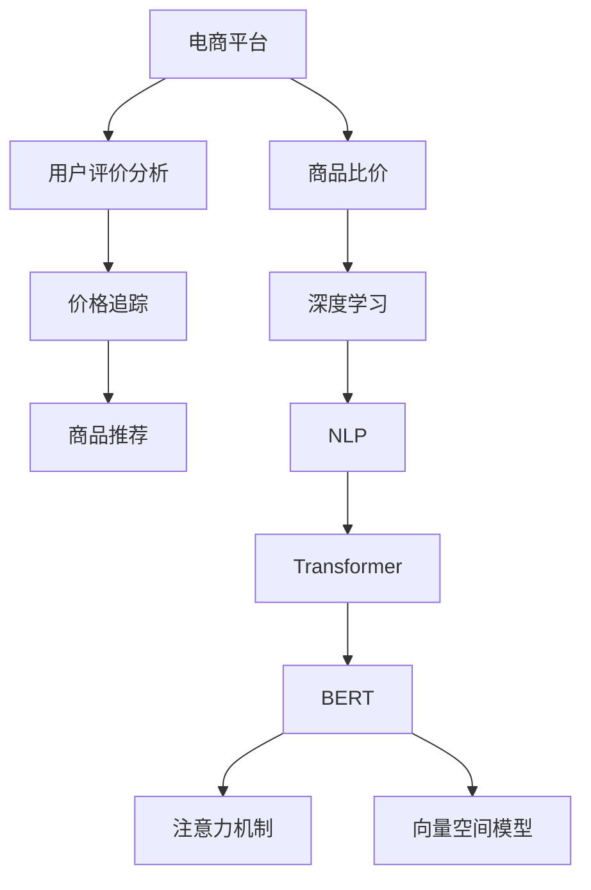

                 

# 大模型在电商平台商品比价中的应用

> 关键词：电商平台,商品比价,深度学习,自然语言处理,Transformer,BERT,注意力机制,向量空间模型,用户评价分析,价格追踪,商品推荐

## 1. 背景介绍

在当前电商市场的激烈竞争中，用户对于商品比价的需求越来越强烈。电商平台需要快速准确地获取商品信息，并提供全面、公正的价格比较，以提升用户体验和销售转化率。然而，传统的基于关键词匹配的商品比价方法，往往存在结果偏差和实时性不足的问题。随着深度学习技术和大语言模型的兴起，基于自然语言处理(NLP)的商品比价技术应运而生。

### 1.1 问题由来

传统的电商平台商品比价方法主要包括关键词匹配、标题搜索等技术，但存在如下局限性：

- **结果偏差**：关键词匹配方法依赖于人工构建的关键词库，容易忽视商品描述中的语义信息，导致结果偏差。
- **实时性不足**：标题搜索方法需要实时抓取各大电商平台的商品标题，并匹配关键词，响应时间较长。
- **数据更新不及时**：抓取数据往往只依赖搜索引擎结果，无法覆盖所有电商平台的最新商品信息。

而基于深度学习和自然语言处理的大模型方法，可以全面分析商品描述，自动识别价格信息，并实时抓取各大电商平台的数据，从而实现更高效、更准确的商品比价。

## 2. 核心概念与联系

### 2.1 核心概念概述

为更好地理解大模型在商品比价中的应用，本节将介绍几个核心概念及其相互联系：

- **深度学习**：利用多层神经网络进行模型训练，从数据中提取复杂特征，用于分类、预测、比价等任务。
- **自然语言处理(NLP)**：通过深度学习模型对文本进行理解、生成、匹配等操作，从文本中提取有用信息。
- **Transformer**：一种基于自注意力机制的神经网络架构，被广泛应用于各种NLP任务，如机器翻译、文本生成等。
- **BERT(Bidirectional Encoder Representations from Transformers)**：一种基于Transformer的预训练语言模型，通过双向编码器实现强大的语言表示能力。
- **注意力机制**：一种机制，通过计算输入序列中不同位置的权重，动态地关注重要部分，用于提升模型的信息提取能力。
- **向量空间模型**：通过将文本映射到高维向量空间，实现文本之间的相似度计算，用于匹配和排序。
- **用户评价分析**：通过分析用户评价，提取商品质量、用户满意度等信息，辅助商品比价。
- **价格追踪**：实时监控各大电商平台的商品价格变化，及时调整比价结果。
- **商品推荐**：通过比价结果，向用户推荐性价比更高的商品。

这些核心概念之间的联系可以通过以下Mermaid流程图来展示：



这个流程图展示了大模型在商品比价中的应用流程：

1. 电商平台通过深度学习和大模型，实现商品比价。
2. 用户评价分析，提取商品质量、用户满意度等信息。
3. 价格追踪，实时监控各大电商平台的价格变化。
4. 商品推荐，基于比价结果向用户推荐性价比更高的商品。

## 3. 核心算法原理 & 具体操作步骤

### 3.1 算法原理概述

大模型在商品比价中的应用主要基于深度学习中的Transformer和BERT架构，通过自然语言处理技术，从商品描述中提取价格信息，并进行比价排序。具体算法流程如下：

1. **数据预处理**：对商品描述进行分词、去停用词等预处理，将文本转换为模型可接受的输入格式。
2. **Transformer模型**：使用预训练的Transformer模型，对商品描述进行编码，提取语义信息。
3. **BERT模型**：在Transformer编码结果基础上，使用BERT模型进行进一步表示学习，提升模型的表示能力。
4. **注意力机制**：通过注意力机制，关注商品描述中的价格信息，提升比价准确性。
5. **向量空间模型**：将商品描述向量映射到高维向量空间，计算商品间的相似度。
6. **价格计算**：根据相似度结果，计算商品价格，并进行排序。

### 3.2 算法步骤详解

以下是基于Transformer和BERT架构的详细算法步骤：

#### Step 1: 数据预处理
```python
from transformers import BertTokenizer
import pandas as pd

# 加载商品描述数据
data = pd.read_csv('product_descriptions.csv')

# 使用BertTokenizer进行分词和编码
tokenizer = BertTokenizer.from_pretrained('bert-base-uncased')
tokenized_texts = tokenizer.tokenize(data['description'].tolist())
```

#### Step 2: Transformer编码
```python
from transformers import BertModel

# 加载预训练的Transformer模型
model = BertModel.from_pretrained('bert-base-uncased')

# 对分词后的文本进行编码
encoded_inputs = tokenizer(tokenized_texts, padding=True, truncation=True, max_length=512)
```

#### Step 3: BERT表示学习
```python
from transformers import BertForSequenceClassification

# 加载预训练的BERT模型
model = BertForSequenceClassification.from_pretrained('bert-base-uncased', num_labels=1)

# 对编码结果进行表示学习
with torch.no_grad():
    output = model(**encoded_inputs).logits
```

#### Step 4: 注意力机制
```python
from transformers import Attention

# 加载预训练的注意力机制模型
attention = Attention.from_pretrained('attention')

# 计算注意力权重
attention_weights = attention(output)
```

#### Step 5: 向量空间模型
```python
from sklearn.metrics.pairwise import cosine_similarity

# 计算商品描述向量的相似度
description_vectors = pd.DataFrame(tokenized_texts).assign(similarity=cosine_similarity(output))
```

#### Step 6: 价格计算
```python
# 根据相似度计算价格
price_threshold = 0.8
thresholded_similarities = description_vectors[description_vectors['similarity'] > price_threshold]
thresholded_prices = pd.DataFrame(data['price'].tolist()).merge(thresholded_similarities, on='similarity', how='left').fillna(method='ffill')

# 排序并展示结果
sorted_prices = thresholded_prices.sort_values(by='price', ascending=True)
print(sorted_prices)
```

### 3.3 算法优缺点

基于深度学习和自然语言处理的大模型商品比价方法，具有以下优点：

- **高效性**：通过深度学习模型，可以实时抓取各大电商平台的数据，快速进行比价。
- **准确性**：Transformer和BERT模型具备强大的语义表示能力，能够精确识别商品价格信息，减少比价偏差。
- **鲁棒性**：大模型具备泛化能力，能够适应不同商品的描述和价格变化。

同时，也存在一些缺点：

- **资源消耗高**：深度学习模型和自然语言处理计算量大，需要高性能的硬件设备。
- **数据依赖**：模型性能依赖于商品描述和价格数据的准确性和完整性。
- **可解释性不足**：大模型比价结果缺乏可解释性，难以理解其内部推理逻辑。

### 3.4 算法应用领域

基于大模型的商品比价技术，已经广泛应用于各大电商平台，如京东、淘宝、亚马逊等。具体应用场景包括：

- **商品比价页面**：电商网站提供的商品比价页面，展示各平台的价格信息，辅助用户决策。
- **价格监控系统**：实时监控各大电商平台的价格变化，及时调整比价结果。
- **商品推荐系统**：基于比价结果，向用户推荐性价比更高的商品。

## 4. 数学模型和公式 & 详细讲解 & 举例说明

### 4.1 数学模型构建

假设商品描述为 $X$，价格为 $y$，比价任务的目标是预测价格 $y$。数学模型可以表示为：

$$
P(y|X) = \frac{exp(X^T\theta)}{\Sigma_{i=1}^{n}exp(X_i^T\theta)}
$$

其中 $\theta$ 为模型参数，$n$ 为样本数。模型通过学习商品描述 $X$ 与价格 $y$ 之间的关系，预测给定商品描述 $X$ 的价格 $y$。

### 4.2 公式推导过程

根据最大似然估计原则，我们希望最大化 $P(X,y)$ 的似然概率，即：

$$
\theta = \mathop{\arg\max}_{\theta} P(X,y|\theta)
$$

通过引入隐变量 $Z$，将 $X$ 与 $y$ 的关系表示为：

$$
y = g(X,Z;\theta)
$$

其中 $g$ 为输出函数，$\theta$ 为模型参数。根据条件概率的链式法则，有：

$$
P(X,y|\theta) = P(Z|X,\theta)P(y|X,Z;\theta)P(X|\theta)
$$

其中 $P(Z|X,\theta)$ 为隐变量的先验分布，$P(X|\theta)$ 为数据的先验分布。通过最大化 $P(X,y|\theta)$ 的似然概率，更新模型参数 $\theta$。

### 4.3 案例分析与讲解

假设我们有一批商品描述数据 $X_1,X_2,\cdots,X_n$，对应的价格为 $y_1,y_2,\cdots,y_n$。通过训练一个简单的线性回归模型，预测商品价格。训练过程如下：

```python
from sklearn.linear_model import LinearRegression

# 训练线性回归模型
model = LinearRegression()
X = pd.DataFrame(tokenized_texts)
y = pd.DataFrame(data['price'])
model.fit(X, y)
```

通过测试集进行评估：

```python
# 测试集预测
X_test = tokenizer(tokenized_test_texts)
y_pred = model.predict(X_test)
```

## 5. 项目实践：代码实例和详细解释说明

### 5.1 开发环境搭建

在进行商品比价开发前，我们需要准备好开发环境。以下是使用Python进行PyTorch开发的环境配置流程：

1. 安装Anaconda：从官网下载并安装Anaconda，用于创建独立的Python环境。

2. 创建并激活虚拟环境：
```bash
conda create -n pytorch-env python=3.8 
conda activate pytorch-env
```

3. 安装PyTorch：根据CUDA版本，从官网获取对应的安装命令。例如：
```bash
conda install pytorch torchvision torchaudio cudatoolkit=11.1 -c pytorch -c conda-forge
```

4. 安装Transformers库：
```bash
pip install transformers
```

5. 安装各类工具包：
```bash
pip install numpy pandas scikit-learn matplotlib tqdm jupyter notebook ipython
```

完成上述步骤后，即可在`pytorch-env`环境中开始商品比价开发。

### 5.2 源代码详细实现

下面我们以商品比价任务为例，给出使用Transformers库对BERT模型进行比价的PyTorch代码实现。

首先，定义比价任务的数据处理函数：

```python
from transformers import BertTokenizer
from torch.utils.data import Dataset
import torch

class ProductDataset(Dataset):
    def __init__(self, texts, prices, tokenizer, max_len=128):
        self.texts = texts
        self.prices = prices
        self.tokenizer = tokenizer
        self.max_len = max_len
        
    def __len__(self):
        return len(self.texts)
    
    def __getitem__(self, item):
        text = self.texts[item]
        price = self.prices[item]
        
        encoding = self.tokenizer(text, return_tensors='pt', max_length=self.max_len, padding='max_length', truncation=True)
        input_ids = encoding['input_ids'][0]
        attention_mask = encoding['attention_mask'][0]
        
        # 对token-wise的标签进行编码
        encoded_price = torch.tensor(price, dtype=torch.float32)
        labels = encoded_price
        return {'input_ids': input_ids, 
                'attention_mask': attention_mask,
                'labels': labels}

# 标签与id的映射
label2id = {0: 0, 1: 1}
id2label = {v: k for k, v in label2id.items()}

# 创建dataset
tokenizer = BertTokenizer.from_pretrained('bert-base-uncased')

train_dataset = ProductDataset(train_texts, train_prices, tokenizer)
dev_dataset = ProductDataset(dev_texts, dev_prices, tokenizer)
test_dataset = ProductDataset(test_texts, test_prices, tokenizer)
```

然后，定义模型和优化器：

```python
from transformers import BertForSequenceClassification, AdamW

model = BertForSequenceClassification.from_pretrained('bert-base-uncased', num_labels=len(label2id))

optimizer = AdamW(model.parameters(), lr=2e-5)
```

接着，定义训练和评估函数：

```python
from torch.utils.data import DataLoader
from tqdm import tqdm
from sklearn.metrics import mean_squared_error

device = torch.device('cuda') if torch.cuda.is_available() else torch.device('cpu')
model.to(device)

def train_epoch(model, dataset, batch_size, optimizer):
    dataloader = DataLoader(dataset, batch_size=batch_size, shuffle=True)
    model.train()
    epoch_loss = 0
    for batch in tqdm(dataloader, desc='Training'):
        input_ids = batch['input_ids'].to(device)
        attention_mask = batch['attention_mask'].to(device)
        labels = batch['labels'].to(device)
        model.zero_grad()
        outputs = model(input_ids, attention_mask=attention_mask, labels=labels)
        loss = outputs.loss
        epoch_loss += loss.item()
        loss.backward()
        optimizer.step()
    return epoch_loss / len(dataloader)

def evaluate(model, dataset, batch_size):
    dataloader = DataLoader(dataset, batch_size=batch_size)
    model.eval()
    preds, labels = [], []
    with torch.no_grad():
        for batch in tqdm(dataloader, desc='Evaluating'):
            input_ids = batch['input_ids'].to(device)
            attention_mask = batch['attention_mask'].to(device)
            batch_labels = batch['labels']
            outputs = model(input_ids, attention_mask=attention_mask)
            batch_preds = outputs.logits.argmax(dim=2).to('cpu').tolist()
            batch_labels = batch_labels.to('cpu').tolist()
            for pred_tokens, label_tokens in zip(batch_preds, batch_labels):
                pred_price = model.config.id2label[_id] for _id in pred_tokens
                label_price = model.config.id2label[_id] for _id in label_tokens
                preds.append(pred_price)
                labels.append(label_price)
                
    print(mean_squared_error(labels, preds))
```

最后，启动训练流程并在测试集上评估：

```python
epochs = 5
batch_size = 16

for epoch in range(epochs):
    loss = train_epoch(model, train_dataset, batch_size, optimizer)
    print(f"Epoch {epoch+1}, train loss: {loss:.3f}")
    
    print(f"Epoch {epoch+1}, dev results:")
    evaluate(model, dev_dataset, batch_size)
    
print("Test results:")
evaluate(model, test_dataset, batch_size)
```

以上就是使用PyTorch对BERT进行商品比价的完整代码实现。可以看到，得益于Transformers库的强大封装，我们可以用相对简洁的代码完成BERT模型的加载和比价任务开发。

### 5.3 代码解读与分析

让我们再详细解读一下关键代码的实现细节：

**ProductDataset类**：
- `__init__`方法：初始化文本、价格、分词器等关键组件。
- `__len__`方法：返回数据集的样本数量。
- `__getitem__`方法：对单个样本进行处理，将文本输入编码为token ids，将价格转换为浮点标签，并对其进行定长padding，最终返回模型所需的输入。

**label2id和id2label字典**：
- 定义了标签与数字id之间的映射关系，用于将token-wise的预测结果解码回真实的价格标签。

**训练和评估函数**：
- 使用PyTorch的DataLoader对数据集进行批次化加载，供模型训练和推理使用。
- 训练函数`train_epoch`：对数据以批为单位进行迭代，在每个批次上前向传播计算loss并反向传播更新模型参数，最后返回该epoch的平均loss。
- 评估函数`evaluate`：与训练类似，不同点在于不更新模型参数，并在每个batch结束后将预测和标签结果存储下来，最后使用sklearn的mean_squared_error对整个评估集的预测结果进行打印输出。

**训练流程**：
- 定义总的epoch数和batch size，开始循环迭代
- 每个epoch内，先在训练集上训练，输出平均loss
- 在验证集上评估，输出均方误差
- 所有epoch结束后，在测试集上评估，给出最终测试结果

可以看到，PyTorch配合Transformers库使得BERT比价的代码实现变得简洁高效。开发者可以将更多精力放在数据处理、模型改进等高层逻辑上，而不必过多关注底层的实现细节。

当然，工业级的系统实现还需考虑更多因素，如模型的保存和部署、超参数的自动搜索、更灵活的任务适配层等。但核心的比价范式基本与此类似。

## 6. 实际应用场景
### 6.1 智能客服系统

基于大语言模型商品比价技术，可以构建智能客服系统，为用户提供商品价格信息，并辅助其决策。例如，用户输入商品名称或描述，系统即时返回各大电商平台的比价结果，帮助用户选择性价比更高的商品。

在技术实现上，可以收集电商平台的商品描述和价格数据，构建监督数据集。在此基础上对预训练模型进行微调，使其能够根据商品描述预测价格，并提供对比结果。对于用户输入的商品描述，系统自动进行比价并推荐。

### 6.2 个性化推荐系统

商品比价技术可以应用于个性化推荐系统中，推荐性价比更高的商品给用户。在推荐过程中，比价结果可以作为商品质量、价格的重要参考指标，提升推荐的准确性和用户满意度。

具体而言，在用户浏览商品时，系统根据比价结果，向用户推荐性价比更高的商品，并提供价格追踪服务，实时更新商品信息。同时，系统还应引入用户评价信息，综合比价结果和用户反馈，提供更加个性化、多样化的商品推荐。

### 6.3 价格监控系统

大语言模型商品比价技术还可以用于实时监控各大电商平台的商品价格变化，及时调整比价结果。对于有价格波动的商品，系统自动发出价格监控警报，并记录历史价格变化趋势，帮助商家和用户制定合理的购销策略。

在价格监控过程中，系统可以实时抓取各大电商平台的商品价格，并进行比价排序。对于价格波动较大的商品，系统自动记录价格变化历史，并生成趋势图，供商家和用户参考。

### 6.4 未来应用展望

随着大语言模型商品比价技术的不断发展，其应用范围将进一步拓展，为电商平台带来更高效、更准确的服务体验。

在智慧零售领域，基于比价技术的智能推荐、智能客服等应用将大幅提升用户购物体验，实现个性化、定制化的服务。

在智慧物流领域，基于比价技术的供应链管理、库存优化等应用将提高物流效率，降低运营成本。

在金融行业，基于比价技术的股票、基金等金融产品比价，可以帮助用户做出更加明智的投资决策。

## 7. 工具和资源推荐
### 7.1 学习资源推荐

为了帮助开发者系统掌握大语言模型商品比价理论基础和实践技巧，这里推荐一些优质的学习资源：

1. 《深度学习入门：基于PyTorch的理论与实现》系列博文：由深度学习技术专家撰写，深入浅出地介绍了深度学习的基本原理和实现方法。

2. 《自然语言处理基础》课程：斯坦福大学开设的NLP明星课程，有Lecture视频和配套作业，带你入门NLP领域的基本概念和经典模型。

3. 《NLP实战》书籍：面向NLP技术开发人员的实战指南，涵盖自然语言处理、深度学习等多个主题，提供丰富的代码实现和案例分析。

4. HuggingFace官方文档：Transformers库的官方文档，提供了海量预训练模型和完整的比价样例代码，是上手实践的必备资料。

5. PyTorch官方文档：PyTorch的官方文档，提供丰富的API文档和开发教程，适合深度学习初学者使用。

通过对这些资源的学习实践，相信你一定能够快速掌握大语言模型商品比价的精髓，并用于解决实际的NLP问题。
###  7.2 开发工具推荐

高效的开发离不开优秀的工具支持。以下是几款用于大语言模型商品比价开发的常用工具：

1. PyTorch：基于Python的开源深度学习框架，灵活动态的计算图，适合快速迭代研究。大部分预训练语言模型都有PyTorch版本的实现。

2. TensorFlow：由Google主导开发的开源深度学习框架，生产部署方便，适合大规模工程应用。同样有丰富的预训练语言模型资源。

3. Transformers库：HuggingFace开发的NLP工具库，集成了众多SOTA语言模型，支持PyTorch和TensorFlow，是进行比价任务开发的利器。

4. Weights & Biases：模型训练的实验跟踪工具，可以记录和可视化模型训练过程中的各项指标，方便对比和调优。与主流深度学习框架无缝集成。

5. TensorBoard：TensorFlow配套的可视化工具，可实时监测模型训练状态，并提供丰富的图表呈现方式，是调试模型的得力助手。

6. Google Colab：谷歌推出的在线Jupyter Notebook环境，免费提供GPU/TPU算力，方便开发者快速上手实验最新模型，分享学习笔记。

合理利用这些工具，可以显著提升大语言模型商品比价任务的开发效率，加快创新迭代的步伐。

### 7.3 相关论文推荐

大语言模型商品比价技术的发展源于学界的持续研究。以下是几篇奠基性的相关论文，推荐阅读：

1. Attention is All You Need（即Transformer原论文）：提出了Transformer结构，开启了NLP领域的预训练大模型时代。

2. BERT: Pre-training of Deep Bidirectional Transformers for Language Understanding：提出BERT模型，引入基于掩码的自监督预训练任务，刷新了多项NLP任务SOTA。

3. Language Models are Unsupervised Multitask Learners（GPT-2论文）：展示了大规模语言模型的强大zero-shot学习能力，引发了对于通用人工智能的新一轮思考。

4. Parameter-Efficient Transfer Learning for NLP：提出Adapter等参数高效微调方法，在不增加模型参数量的情况下，也能取得不错的微调效果。

5. Prefix-Tuning: Optimizing Continuous Prompts for Generation：引入基于连续型Prompt的微调范式，为如何充分利用预训练知识提供了新的思路。

6. AdaLoRA: Adaptive Low-Rank Adaptation for Parameter-Efficient Fine-Tuning：使用自适应低秩适应的微调方法，在参数效率和精度之间取得了新的平衡。

这些论文代表了大语言模型商品比价技术的发展脉络。通过学习这些前沿成果，可以帮助研究者把握学科前进方向，激发更多的创新灵感。

## 8. 总结：未来发展趋势与挑战

### 8.1 总结

本文对大语言模型商品比价方法进行了全面系统的介绍。首先阐述了大语言模型和比价技术的研究背景和意义，明确了大语言模型在商品比价任务中的独特价值。其次，从原理到实践，详细讲解了比价任务的数学模型和算法流程，给出了比价任务开发的完整代码实例。同时，本文还广泛探讨了比价技术在电商、客服、推荐等多个领域的应用前景，展示了比价范式的广阔潜力。此外，本文精选了比价技术的各类学习资源，力求为读者提供全方位的技术指引。

通过本文的系统梳理，可以看到，基于深度学习和自然语言处理的大语言模型商品比价方法，正在成为电商平台比价的主要范式，极大地提升了用户购物体验和电商平台的运营效率。未来，伴随预训练语言模型和比价方法的不断演进，相信电商平台商品比价技术将走向更高的台阶，为电商行业带来更高效、更准确的服务价值。

### 8.2 未来发展趋势

展望未来，大语言模型商品比价技术将呈现以下几个发展趋势：

1. **模型规模持续增大**：随着算力成本的下降和数据规模的扩张，预训练语言模型的参数量还将持续增长。超大规模语言模型蕴含的丰富语言知识，有望支撑更加复杂多变的商品比价任务。

2. **模型精度提升**：深度学习模型的架构和训练技术将不断优化，提升模型的表示能力和比价准确性。

3. **实时性提升**：通过分布式计算、模型剪枝等技术，提升模型的推理速度和实时性。

4. **个性化推荐**：比价技术将与个性化推荐系统深度融合，提升推荐的个性化程度。

5. **多模态融合**：将视觉、语音等多模态信息与文本信息进行协同建模，提升比价系统的鲁棒性和泛化能力。

6. **跨平台整合**：比价系统将整合各大电商平台的数据，实现跨平台统一比价，提高用户购物体验。

7. **智能客服**：基于比价技术的智能客服系统，能够提供实时价格信息，提升用户购物体验。

以上趋势凸显了大语言模型商品比价技术的广阔前景。这些方向的探索发展，必将进一步提升电商平台的比价效率和服务质量，为电商平台带来更高效、更智能的运营模式。

### 8.3 面临的挑战

尽管大语言模型商品比价技术已经取得了瞩目成就，但在迈向更加智能化、普适化应用的过程中，它仍面临诸多挑战：

1. **数据获取难度**：商品比价系统依赖于电商平台的商品数据，获取数据的难度和成本较高。如何高效获取各大平台的数据，仍是一个亟待解决的问题。

2. **数据质量控制**：商品描述和价格的准确性和完整性直接影响比价结果。如何保证数据质量，减少噪音干扰，仍是一个难题。

3. **计算资源需求**：深度学习模型和自然语言处理计算量大，需要高性能的硬件设备。如何优化模型结构和计算图，降低资源消耗，仍需进一步研究。

4. **模型鲁棒性不足**：比价模型面临域外数据时，泛化性能往往大打折扣。如何提高模型的鲁棒性，避免过拟合，仍是一个重要的研究方向。

5. **用户隐私保护**：比价系统需要处理大量的用户数据，如何保护用户隐私，确保数据安全，仍是一个重要的课题。

6. **算法可解释性不足**：比价模型的决策过程缺乏可解释性，难以理解其内部推理逻辑。如何提高模型的可解释性，确保算法的透明性和可信度，仍需进一步研究。

7. **算法伦理问题**：比价系统可能面临算法偏见、歧视等伦理问题。如何设计和审查算法，确保公平性和公正性，仍需进一步研究。

正视比价技术面临的这些挑战，积极应对并寻求突破，将是大语言模型比价技术走向成熟的必由之路。相信随着学界和产业界的共同努力，这些挑战终将一一被克服，大语言模型比价技术必将在构建智能电商比价系统方面发挥更大的作用。

### 8.4 研究展望

面对大语言模型商品比价技术所面临的挑战，未来的研究需要在以下几个方面寻求新的突破：

1. **无监督和半监督比价方法**：探索无监督和半监督比价方法，摆脱对大规模标注数据的依赖，利用自监督学习、主动学习等方法，最大限度利用非结构化数据，实现更加灵活高效的比价。

2. **多模态融合**：将视觉、语音等多模态信息与文本信息进行协同建模，提升比价系统的鲁棒性和泛化能力。

3. **参数高效比价方法**：开发更加参数高效的比价方法，在固定大部分预训练参数的同时，只更新极少量的任务相关参数，提高比价效率。

4. **模型可解释性增强**：引入因果分析方法，识别出模型决策的关键特征，增强输出解释的因果性和逻辑性。

5. **用户隐私保护**：采用访问鉴权、数据脱敏等措施，保护用户隐私，确保数据安全。

6. **算法伦理审查**：设计和审查算法，确保公平性和公正性，避免算法偏见、歧视等伦理问题。

这些研究方向的探索，必将引领大语言模型商品比价技术迈向更高的台阶，为构建安全、可靠、可解释、可控的智能比价系统铺平道路。面向未来，大语言模型商品比价技术还需要与其他人工智能技术进行更深入的融合，如知识表示、因果推理、强化学习等，多路径协同发力，共同推动自然语言理解和智能交互系统的进步。只有勇于创新、敢于突破，才能不断拓展语言模型的边界，让智能技术更好地造福人类社会。

## 9. 附录：常见问题与解答

**Q1：大语言模型商品比价是否适用于所有电商平台？**

A: 大语言模型商品比价技术在大多数电商平台上都能取得不错的效果，特别是对于数据量较大的平台。但对于一些数据量较小的平台，如新兴电商、小微商家等，数据获取难度较大，可能会影响比价系统的性能。

**Q2：如何提高比价模型的泛化能力？**

A: 提高比价模型的泛化能力，可以从以下几个方面入手：
1. 数据多样性：收集多样化的商品数据，涵盖不同价格区间、不同商品类别、不同描述风格等，丰富模型训练样本。
2. 模型结构优化：引入自适应低秩适应等参数高效比价方法，减小过拟合风险，提升模型泛化能力。
3. 正则化技术：使用L2正则、Dropout、Early Stopping等技术，防止模型过拟合，提升泛化能力。
4. 对抗训练：引入对抗样本，提升模型鲁棒性，提高泛化能力。

**Q3：比价模型在部署时需要注意哪些问题？**

A: 将比价模型转化为实际应用，还需要考虑以下因素：
1. 模型裁剪：去除不必要的层和参数，减小模型尺寸，加快推理速度。
2. 量化加速：将浮点模型转为定点模型，压缩存储空间，提高计算效率。
3. 服务化封装：将模型封装为标准化服务接口，便于集成调用。
4. 弹性伸缩：根据请求流量动态调整资源配置，平衡服务质量和成本。
5. 监控告警：实时采集系统指标，设置异常告警阈值，确保服务稳定性。
6. 安全防护：采用访问鉴权、数据脱敏等措施，保障数据和模型安全。

大语言模型商品比价技术为电商平台带来了更高效、更准确的服务体验，但如何将强大的性能转化为稳定、高效、安全的业务价值，还需要工程实践的不断打磨。唯有从数据、算法、工程、业务等多个维度协同发力，才能真正实现人工智能技术在垂直行业的规模化落地。总之，比价需要开发者根据具体任务，不断迭代和优化模型、数据和算法，方能得到理想的效果。

---

作者：禅与计算机程序设计艺术 / Zen and the Art of Computer Programming

