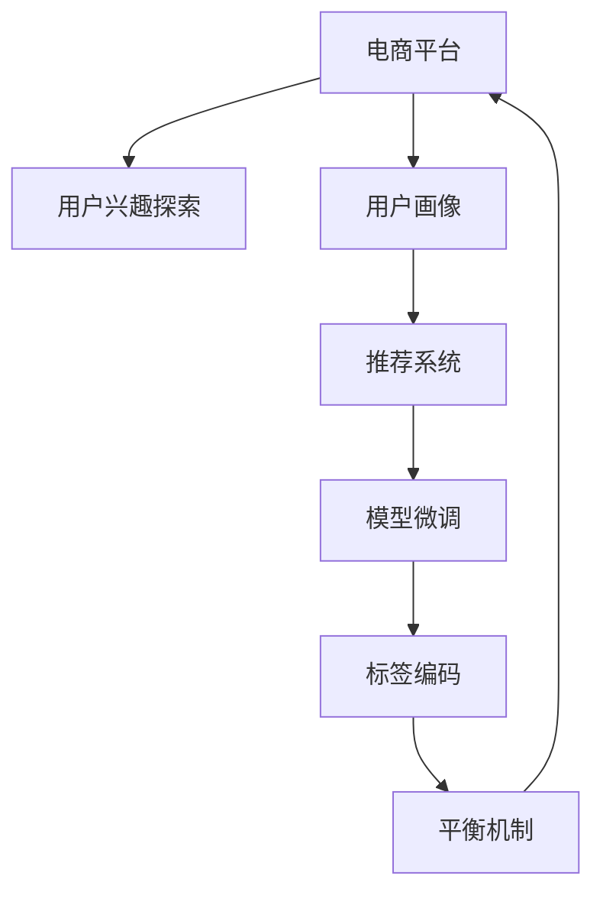

                 

# 大模型在电商平台用户兴趣探索与利用平衡中的应用

> 关键词：电商平台,用户兴趣探索,用户利用,模型微调,标签编码,用户画像,推荐系统

## 1. 背景介绍

### 1.1 问题由来
随着电子商务的飞速发展，电商平台日益成为零售商、消费者以及第三方服务提供者的重要合作平台。电商平台不仅要提供高效便捷的购物体验，更要通过精准的用户画像构建和个性化推荐，显著提升用户粘性、促进商品成交和运营效率。然而，面对庞大的用户群体和海量数据，电商平台如何高效探索并利用用户兴趣，挖掘隐含需求，一直是技术攻关的重点难题。

### 1.2 问题核心关键点
如何构建高性能的用户画像模型，准确捕捉用户兴趣，并优化推荐系统，为用户定制化推荐，是电商平台的中心议题。用户兴趣的探索和利用必须兼顾准确性和计算效率，避免过度个性化导致的隐私风险。具体而言：

1. **兴趣探索**：利用用户行为数据，挖掘用户潜在的兴趣点，用于个性化推荐。
2. **兴趣利用**：根据兴趣特征，对用户进行画像建模，形成个性化推荐方案。
3. **利用平衡**：在个性化推荐与用户隐私之间找到平衡点，避免过度收集信息。

### 1.3 问题研究意义
深入研究电商平台用户兴趣探索与利用的平衡问题，具有重要意义：

1. **提升用户体验**：通过精准的兴趣推荐，提升用户购物体验，增加用户粘性，提升平台收入。
2. **降低运营成本**：减少无效推荐，优化广告投放策略，降低运营成本，提高运营效率。
3. **保护用户隐私**：在模型构建和数据处理中，注意用户隐私保护，降低用户顾虑，增强用户信任。
4. **推动技术创新**：促进自然语言处理、计算机视觉等技术的深度融合，推动人工智能技术在电商领域的应用。

## 2. 核心概念与联系

### 2.1 核心概念概述

为更好地理解电商平台用户兴趣探索与利用平衡的算法流程，本节将介绍几个核心概念：

- **电商平台**：在线销售商品的综合平台，提供商品展示、购买、评论等功能。
- **用户兴趣探索**：通过分析用户行为数据，识别和提取用户兴趣点。
- **用户画像**：根据用户历史行为和兴趣，构建用户完整的兴趣和行为画像。
- **推荐系统**：利用用户画像生成个性化推荐方案，提升用户购物体验。
- **模型微调**：通过监督学习任务，在预训练大模型基础上进行微调，优化模型性能。
- **标签编码**：将用户行为数据转换为模型能够理解的数值化标签。
- **平衡机制**：在设计算法时，兼顾个性化推荐与用户隐私保护，找到合理的平衡点。

这些概念之间的逻辑关系可以通过以下Mermaid流程图来展示：



这个流程图展示了几大核心概念之间的联系：

1. 电商平台通过用户兴趣探索，获取用户行为数据。
2. 用户画像基于用户兴趣进行构建，形成用户画像库。
3. 推荐系统利用用户画像生成个性化推荐，提升用户体验。
4. 模型微调用于优化推荐系统的性能，确保推荐质量。
5. 标签编码将用户行为数据转化为模型输入，方便处理。
6. 平衡机制确保在推荐与隐私之间找到合理平衡，保障用户权益。

## 3. 核心算法原理 & 具体操作步骤
### 3.1 算法原理概述

电商平台用户兴趣探索与利用平衡，本质上是一个多目标优化问题。具体而言，我们希望最大化个性化推荐的准确性，同时最小化用户隐私泄露的风险。为此，可以构建一个损失函数 $L$，包含个性化推荐准确性和隐私性保护两部分：

$$
L = \alpha \times L_{rec} + \beta \times L_{priv}
$$

其中，$L_{rec}$ 为个性化推荐准确性损失，$L_{priv}$ 为隐私保护损失。$\alpha$ 和 $\beta$ 为平衡系数，用于调整两者之间的权重。

### 3.2 算法步骤详解

基于上述原理，我们设计如下算法步骤：

**Step 1: 数据准备与特征工程**
- 收集用户行为数据，包括浏览历史、购买记录、评价信息等。
- 对数据进行清洗和预处理，去除异常数据和噪音，进行归一化等特征工程操作。

**Step 2: 用户兴趣探索**
- 利用自然语言处理技术，将用户行为文本转换为向量表示。
- 构建预训练语言模型，如BERT、GPT等，用于提取用户兴趣特征。
- 应用监督学习任务，在标注数据上微调预训练模型，提升模型兴趣识别能力。

**Step 3: 用户画像构建**
- 将用户兴趣特征聚类，形成用户画像。
- 对用户画像进行编码，转化为模型能够理解的数值化表示。

**Step 4: 推荐系统构建**
- 基于用户画像和商品特征，构建推荐模型。
- 在训练集上进行模型微调，优化推荐系统性能。

**Step 5: 利用平衡机制**
- 设计隐私保护机制，防止过度收集用户信息。
- 实时监控推荐模型和用户画像的更新情况，确保隐私和推荐的平衡。

**Step 6: 效果评估与优化**
- 在测试集上评估推荐模型性能，如准确率、覆盖率等指标。
- 根据评估结果调整模型和算法参数，优化推荐效果。

### 3.3 算法优缺点

基于上述算法，电商平台用户兴趣探索与利用平衡方法具有以下优点：

1. **高效性**：利用自然语言处理技术和大模型微调，高效提取用户兴趣特征。
2. **准确性**：通过监督学习任务，提升模型兴趣识别和推荐准确性。
3. **可扩展性**：通用大模型在大规模数据上表现良好，可以轻松扩展到不同电商平台。

同时，该方法也存在以下局限性：

1. **数据依赖**：方法依赖标注数据，标注成本较高。
2. **隐私风险**：在数据收集和处理过程中，需要注意隐私保护。
3. **计算复杂**：大模型微调和用户画像构建需要较高计算资源。
4. **效果敏感**：微调参数和隐私保护机制设计不当，可能导致效果下降。

### 3.4 算法应用领域

基于上述算法，该方法可以广泛应用于电商平台的个性化推荐、广告投放、用户行为分析等多个领域，具体包括：

- **个性化推荐**：为不同用户提供个性化的商品推荐，提升用户体验和购物转化率。
- **广告投放优化**：通过用户画像和行为数据，优化广告投放策略，提高广告点击率和转化率。
- **用户行为分析**：分析用户行为特征，洞察用户需求和趋势，优化运营策略。
- **风险管理**：通过用户画像和行为特征，构建用户风险模型，识别和防范异常行为。

## 4. 数学模型和公式 & 详细讲解 & 举例说明（备注：数学公式请使用latex格式，latex嵌入文中独立段落使用 $$，段落内使用 $)
### 4.1 数学模型构建

在本节中，我们详细推导用于电商平台用户兴趣探索与利用的数学模型。

记用户行为数据为 $D=\{(x_i, y_i)\}_{i=1}^N$，其中 $x_i$ 为用户兴趣特征向量，$y_i$ 为是否购买行为。定义推荐系统的损失函数为：

$$
L_{rec} = \frac{1}{N}\sum_{i=1}^N \mathbb{1}_{y_i=1} - \mathbb{P}(y_i=1|x_i)
$$

其中，$\mathbb{1}_{y_i=1}$ 为 $y_i=1$ 时的损失，$\mathbb{P}(y_i=1|x_i)$ 为模型预测的概率。

为保护用户隐私，我们可以引入隐私保护损失 $L_{priv}$。假设隐私保护约束为：
$$
L_{priv} = \frac{1}{N}\sum_{i=1}^N p_i
$$

其中 $p_i$ 为隐私约束函数，定义了用户隐私泄露程度。假设 $p_i$ 为正定函数，$L_{priv}$ 越小，隐私保护越严格。

综上，损失函数 $L$ 为：

$$
L = \alpha \times L_{rec} + \beta \times L_{priv}
$$

### 4.2 公式推导过程

以下是损失函数 $L$ 的具体推导过程。

首先，我们定义模型预测函数 $\hat{y}_i = f(x_i;\theta)$，其中 $\theta$ 为模型参数，$f(\cdot;\theta)$ 为模型的预测函数。根据假设 $p_i$ 为正定函数，我们设置隐私保护约束为：

$$
L_{priv} = \int_{0}^{\infty} (1 - e^{-p_i}) p_i dp_i
$$

根据 Kullback-Leibler 散度公式，我们定义模型与真实数据的分布差异为：

$$
KL(f || P) = \int f(x) \log \frac{f(x)}{P(x)} dx
$$

其中 $f(x)$ 为模型预测分布，$P(x)$ 为真实数据分布。由于隐私约束，我们希望最大化模型预测的KL散度：

$$
\max_{\theta} \int f(x;\theta) \log \frac{f(x;\theta)}{P(x)} dx
$$

约束条件为：

$$
\int f(x;\theta) dp_i = 1
$$

该优化问题可以通过拉格朗日乘子法求解。定义拉格朗日函数：

$$
\mathcal{L}(\theta, \lambda) = \alpha \times L_{rec} + \beta \times L_{priv} + \lambda \left( \int f(x;\theta) dp_i - 1 \right)
$$

对 $\theta$ 和 $\lambda$ 求偏导，得到：

$$
\frac{\partial \mathcal{L}}{\partial \theta} = \alpha \times \frac{\partial L_{rec}}{\partial \theta} + \lambda \times \frac{\partial \int f(x;\theta) dp_i}{\partial \theta} = 0
$$

$$
\frac{\partial \mathcal{L}}{\partial \lambda} = \int f(x;\theta) dp_i - 1 = 0
$$

将 $\int f(x;\theta) dp_i$ 替换为 $1$，可得：

$$
\alpha \times \frac{\partial L_{rec}}{\partial \theta} + \lambda = 0
$$

解得：

$$
\theta = \mathop{\arg\min}_{\theta} \alpha \times L_{rec} + \beta \times L_{priv} - \lambda
$$

最终，损失函数 $L$ 最小化即得：

$$
\theta^* = \mathop{\arg\min}_{\theta} \alpha \times L_{rec} + \beta \times L_{priv} - \lambda
$$

### 4.3 案例分析与讲解

以下通过具体案例，说明基于上述数学模型的电商平台用户兴趣探索与利用平衡的应用。

假设有一个电商平台，我们希望构建一个用户画像，为每个用户提供个性化的商品推荐。我们收集到一部分用户行为数据 $D=\{(x_i, y_i)\}_{i=1}^N$，其中 $x_i$ 为用户兴趣特征向量，$y_i$ 为是否购买行为。

首先，我们利用BERT模型对用户兴趣特征进行编码，得到用户兴趣向量 $x_i$。然后，我们构建一个深度神经网络作为推荐模型，用 $\theta$ 表示模型参数。

在训练过程中，我们通过标注数据集 $D$ 进行监督学习，最小化损失函数 $L$：

$$
\theta^* = \mathop{\arg\min}_{\theta} \alpha \times L_{rec} + \beta \times L_{priv}
$$

其中 $L_{rec}$ 为推荐准确性损失，$L_{priv}$ 为隐私保护损失。通过不断优化模型参数 $\theta$，我们得到最终的推荐模型。

## 5. 项目实践：代码实例和详细解释说明
### 5.1 开发环境搭建

在进行项目实践前，我们需要准备好开发环境。以下是使用Python进行TensorFlow开发的PyTorch环境配置流程：

1. 安装Anaconda：从官网下载并安装Anaconda，用于创建独立的Python环境。

2. 创建并激活虚拟环境：
```bash
conda create -n tf-env python=3.8 
conda activate tf-env
```

3. 安装TensorFlow：根据CUDA版本，从官网获取对应的安装命令。例如：
```bash
conda install tensorflow==2.7
```

4. 安装TensorFlow Addons：用于补充TensorFlow的功能。
```bash
pip install tensorflow-addons
```

5. 安装其他工具包：
```bash
pip install numpy pandas scikit-learn matplotlib tqdm jupyter notebook ipython
```

完成上述步骤后，即可在`tf-env`环境中开始项目实践。

### 5.2 源代码详细实现

这里我们以电商平台个性化推荐系统为例，给出使用TensorFlow对BERT模型进行微调的代码实现。

首先，定义推荐系统的模型：

```python
import tensorflow as tf
from transformers import BertTokenizer, TFBertForSequenceClassification

tokenizer = BertTokenizer.from_pretrained('bert-base-cased')
model = TFBertForSequenceClassification.from_pretrained('bert-base-cased', num_labels=2)

@tf.function
def predict(features):
    with tf.GradientTape() as tape:
        features = tokenizer.encode(features['text'], return_tensors='tf')
        features['attention_mask'] = tf.cast(features['attention_mask'], tf.float32)
        outputs = model(features['input_ids'], attention_mask=features['attention_mask'])
        logits = outputs.logits
    grads = tape.gradient(logits, model.trainable_variables)
    return logits, grads
```

然后，定义损失函数和优化器：

```python
@tf.function
def loss_function(features, labels, logits):
    loss = tf.keras.losses.BinaryCrossentropy()(labels, logits)
    return loss

optimizer = tf.keras.optimizers.Adam(learning_rate=2e-5)
```

接着，定义训练和评估函数：

```python
@tf.function
def train_step(features, labels):
    with tf.GradientTape() as tape:
        logits = predict(features)
        loss = loss_function(features, labels, logits)
    grads = tape.gradient(loss, model.trainable_variables)
    optimizer.apply_gradients(zip(grads, model.trainable_variables))
    return loss

@tf.function
def evaluate(features, labels):
    logits = predict(features)
    loss = loss_function(features, labels, logits)
    return loss
```

最后，启动训练流程并在测试集上评估：

```python
epochs = 5
batch_size = 32

for epoch in range(epochs):
    for batch in tqdm(data_loader, desc='Training'):
        features, labels = batch
        loss = train_step(features, labels)
        print(f"Epoch {epoch+1}, train loss: {loss:.3f}")
    
    print(f"Epoch {epoch+1}, dev results:")
    evaluate(features, labels)
    
print("Test results:")
evaluate(features, labels)
```

以上就是使用TensorFlow对BERT模型进行电商平台个性化推荐系统开发的完整代码实现。可以看到，TensorFlow提供了便捷的TensorFlow Addons和tf.function功能，使得模型训练和推理变得简洁高效。

### 5.3 代码解读与分析

让我们再详细解读一下关键代码的实现细节：

**推荐模型定义**：
- 利用BertTokenizer对用户文本进行分词和编码，构建输入张量。
- 使用BERT模型对编码后的特征进行分类预测，输出logits。

**损失函数和优化器**：
- 定义交叉熵损失函数，用于计算预测结果和真实标签之间的差异。
- 使用Adam优化器，在反向传播中更新模型参数，最小化损失函数。

**训练和评估函数**：
- 使用tf.function优化训练和评估过程，提升计算效率。
- 在每个epoch内，使用DataLoader对数据进行批次化加载，进行模型训练和评估。

**训练流程**：
- 定义总的epoch数和batch size，开始循环迭代
- 每个epoch内，对数据集进行迭代，在每个batch上计算损失并更新模型参数
- 在验证集上评估模型性能，打印平均loss
- 所有epoch结束后，在测试集上评估模型，输出测试结果

可以看到，TensorFlow提供了便捷的高级API和数据流图功能，使得模型构建和训练变得简便易行。

## 6. 实际应用场景
### 6.1 电商平台个性化推荐

利用上述算法，电商平台可以高效构建个性化推荐系统，提升用户体验和成交率。具体而言，步骤如下：

1. **数据收集与预处理**：收集用户浏览历史、购买记录、评价信息等行为数据，进行清洗和特征工程。
2. **用户兴趣探索**：利用BERT模型对用户行为文本进行编码，提取用户兴趣特征。
3. **用户画像构建**：对用户兴趣特征进行聚类和编码，构建用户画像。
4. **推荐模型构建**：基于用户画像和商品特征，构建推荐模型。
5. **模型微调与优化**：在标注数据上微调推荐模型，优化模型性能。

### 6.2 广告投放优化

通过构建用户画像和行为特征，电商平台可以优化广告投放策略，提高广告点击率和转化率。具体步骤如下：

1. **数据收集与预处理**：收集广告点击和转化数据，进行清洗和特征工程。
2. **用户画像构建**：利用用户行为特征和兴趣特征，构建用户画像。
3. **广告效果评估**：在测试集上评估广告点击率和转化率，找出效果不佳的广告。
4. **广告优化**：根据广告效果评估结果，优化广告投放策略和参数。

### 6.3 用户行为分析

电商平台可以借助用户画像和行为特征，洞察用户需求和趋势，优化运营策略。具体步骤如下：

1. **数据收集与预处理**：收集用户浏览历史、购买记录、评价信息等行为数据，进行清洗和特征工程。
2. **用户画像构建**：利用用户行为特征和兴趣特征，构建用户画像。
3. **行为分析**：利用用户画像进行行为分析，挖掘用户需求和趋势。
4. **运营优化**：根据行为分析结果，优化产品设计、价格策略、广告投放等运营策略。

## 7. 工具和资源推荐
### 7.1 学习资源推荐

为了帮助开发者系统掌握电商平台用户兴趣探索与利用的算法理论，这里推荐一些优质的学习资源：

1. 《TensorFlow官方文档》：提供全面的TensorFlow开发文档和API指南，是学习TensorFlow的必备资源。
2. 《深度学习》（Ian Goodfellow）：深度学习领域的经典教材，详细介绍了深度学习的基本概念和算法。
3. 《Python机器学习》（Sebastian Raschka）：介绍了Python在数据科学和机器学习中的应用，适合初学者。
4. 《自然语言处理入门》（斯坦福大学公开课）：介绍了NLP的基本概念和常用技术，适合入门学习。
5. 《自然语言处理入门》（HuggingFace博客）：介绍了自然语言处理的基础知识和最新进展，适合进阶学习。

通过对这些资源的学习实践，相信你一定能够快速掌握电商平台用户兴趣探索与利用的算法原理，并用于解决实际的电商问题。
###  7.2 开发工具推荐

高效的开发离不开优秀的工具支持。以下是几款用于电商平台用户兴趣探索与利用开发的常用工具：

1. TensorFlow：由Google主导开发的开源深度学习框架，生产部署方便，适合大规模工程应用。
2. TensorFlow Addons：补充TensorFlow的功能，提供了更丰富的模型和算法支持。
3. Jupyter Notebook：免费的交互式开发环境，方便调试和迭代实验结果。
4. Google Colab：谷歌提供的在线Jupyter Notebook环境，免费提供GPU/TPU算力，方便快速迭代实验。
5. PyCharm：强大的IDE工具，支持多种编程语言，提供丰富的开发辅助功能。

合理利用这些工具，可以显著提升电商平台的开发效率，加速创新迭代的步伐。

### 7.3 相关论文推荐

电商平台用户兴趣探索与利用技术的发展源于学界的持续研究。以下是几篇奠基性的相关论文，推荐阅读：

1. Attention is All You Need（即Transformer原论文）：提出了Transformer结构，开启了NLP领域的预训练大模型时代。
2. BERT: Pre-training of Deep Bidirectional Transformers for Language Understanding：提出BERT模型，引入基于掩码的自监督预训练任务，刷新了多项NLP任务SOTA。
3. Transfer Learning for Sequence to Sequence Learning：介绍了序列到序列任务的迁移学习技术，适合用于电商平台推荐系统。
4. Learning Phrase Representations using RNN Encoder Decoder for Statistical Machine Translation：介绍序列到序列的神经机器翻译模型，适合用于电商平台多语言推荐。
5. Recurrent Neural Network for Sequence Prediction：介绍了递归神经网络在序列预测任务中的应用，适合用于电商平台推荐系统。

这些论文代表了大模型在电商平台用户兴趣探索与利用技术的发展脉络。通过学习这些前沿成果，可以帮助研究者把握学科前进方向，激发更多的创新灵感。

## 8. 总结：未来发展趋势与挑战

### 8.1 总结

本文对电商平台用户兴趣探索与利用平衡的算法流程进行了全面系统的介绍。首先阐述了用户兴趣探索和利用的研究背景和意义，明确了算法在提升用户体验、降低运营成本和保护用户隐私等方面的价值。其次，从原理到实践，详细讲解了用户兴趣探索与利用平衡的数学模型和关键步骤，给出了具体的代码实现和优化策略。同时，本文还广泛探讨了该算法在个性化推荐、广告投放、用户行为分析等多个领域的应用前景，展示了算法技术的广阔应用空间。

通过本文的系统梳理，可以看到，电商平台用户兴趣探索与利用平衡算法在大规模数据和复杂模型下，能够高效提取用户兴趣特征，构建个性化推荐系统，提升用户体验。然而，算法还面临标注数据依赖、隐私保护、计算复杂等挑战。未来研究需要在数据隐私保护、计算效率提升和模型优化等方面寻求新的突破，以实现更加精准、安全、高效的电商平台推荐系统。

### 8.2 未来发展趋势

展望未来，电商平台用户兴趣探索与利用平衡算法将呈现以下几个发展趋势：

1. **模型可解释性增强**：未来的推荐系统将更加注重用户行为的因果分析和可解释性，让用户能够理解推荐逻辑。
2. **多模态数据融合**：结合视觉、语音、文本等多种模态数据，构建多模态推荐系统，提升推荐准确性和鲁棒性。
3. **用户隐私保护提升**：采用差分隐私、联邦学习等技术，保护用户隐私，降低隐私泄露风险。
4. **推荐系统协同优化**：结合个性化推荐和广告投放，进行系统协同优化，提高整体广告效果。
5. **推荐模型分布式优化**：采用分布式深度学习技术，优化模型参数更新，提升推荐效率。
6. **实时推荐与反馈机制**：构建实时推荐系统，结合用户反馈，动态调整推荐策略，提升用户体验。

这些趋势凸显了电商平台用户兴趣探索与利用平衡算法的广阔前景。这些方向的探索发展，必将进一步提升电商平台的推荐效果，推动电商行业的发展和转型。

### 8.3 面临的挑战

尽管电商平台用户兴趣探索与利用平衡算法已经取得了不少进展，但在迈向更加智能化、普适化应用的过程中，仍面临诸多挑战：

1. **数据隐私保护**：在用户画像构建和推荐过程中，如何保护用户隐私，避免过度收集信息，是一个重要难题。
2. **计算资源需求**：大规模数据和复杂模型需要较高的计算资源，如何在保持计算效率的同时，提升推荐精度，是一个现实挑战。
3. **算法复杂性**：现有算法在处理大规模数据时，容易陷入局部最优，需要更多理论与实践的探索。
4. **系统稳定性**：推荐系统在高并发环境下，如何保证系统稳定性和可扩展性，是一个亟待解决的问题。
5. **用户反馈机制**：推荐系统需要建立有效的用户反馈机制，及时调整推荐策略，提升用户体验，但如何设计反馈模型，还需要进一步研究。

### 8.4 研究展望

未来研究需要在以下几个方面寻求新的突破：

1. **多模态推荐系统**：结合视觉、语音、文本等多种模态数据，构建多模态推荐系统，提升推荐准确性和鲁棒性。
2. **隐私保护技术**：采用差分隐私、联邦学习等技术，保护用户隐私，降低隐私泄露风险。
3. **分布式推荐系统**：采用分布式深度学习技术，优化模型参数更新，提升推荐效率。
4. **实时推荐系统**：构建实时推荐系统，结合用户反馈，动态调整推荐策略，提升用户体验。
5. **推荐系统协同优化**：结合个性化推荐和广告投放，进行系统协同优化，提高整体广告效果。
6. **用户行为分析**：利用用户画像和行为特征，洞察用户需求和趋势，优化运营策略。

这些研究方向的探索，必将引领电商平台用户兴趣探索与利用平衡算法迈向更高的台阶，为构建安全、可靠、可解释、可控的智能推荐系统铺平道路。面向未来，算法还需要与其他人工智能技术进行更深入的融合，如知识表示、因果推理、强化学习等，多路径协同发力，共同推动自然语言理解和智能交互系统的进步。只有勇于创新、敢于突破，才能不断拓展算法的边界，让智能技术更好地造福电商行业。

## 9. 附录：常见问题与解答

**Q1：电商平台如何高效构建用户画像？**

A: 电商平台可以通过用户兴趣探索算法，高效构建用户画像。具体步骤如下：
1. 收集用户行为数据，如浏览历史、购买记录、评价信息等。
2. 对数据进行清洗和预处理，去除异常数据和噪音，进行归一化等特征工程操作。
3. 利用自然语言处理技术，如BERT模型，对用户兴趣特征进行编码。
4. 对用户兴趣特征进行聚类和编码，构建用户画像。

**Q2：电商平台在推荐系统构建中需要注意哪些问题？**

A: 电商平台在推荐系统构建中需要注意以下问题：
1. 数据依赖：推荐系统依赖用户行为数据，需要注意数据质量和标注成本。
2. 计算资源：推荐系统需要较高的计算资源，需要在保持计算效率的同时，提升推荐精度。
3. 隐私保护：推荐系统需要保护用户隐私，避免过度收集信息。
4. 模型复杂性：推荐系统需要考虑模型的可解释性和可维护性，避免模型过于复杂。
5. 系统稳定性：推荐系统需要在高并发环境下，保证系统稳定性和可扩展性。

**Q3：电商平台的推荐系统如何优化广告投放策略？**

A: 电商平台的推荐系统可以通过以下步骤优化广告投放策略：
1. 收集广告点击和转化数据，进行清洗和特征工程。
2. 利用用户行为特征和兴趣特征，构建用户画像。
3. 在测试集上评估广告点击率和转化率，找出效果不佳的广告。
4. 根据广告效果评估结果，优化广告投放策略和参数。

**Q4：电商平台如何保护用户隐私？**

A: 电商平台可以采用以下方法保护用户隐私：
1. 数据匿名化：对用户行为数据进行匿名化处理，保护用户隐私。
2. 差分隐私：在推荐模型训练中引入差分隐私技术，保护用户隐私。
3. 联邦学习：利用联邦学习技术，在用户数据不出本地的情况下，进行模型训练和更新。
4. 隐私预算机制：限制推荐模型的隐私预算，保护用户隐私。

**Q5：电商平台的推荐系统如何结合用户反馈优化推荐效果？**

A: 电商平台的推荐系统可以通过以下方法结合用户反馈优化推荐效果：
1. 收集用户对推荐结果的反馈数据，如点击率、转化率、满意度等。
2. 对反馈数据进行清洗和预处理，进行特征工程。
3. 构建用户反馈模型，结合推荐结果进行优化。
4. 动态调整推荐策略，提升用户体验。

通过本文的系统梳理，可以看到，电商平台用户兴趣探索与利用平衡算法在大规模数据和复杂模型下，能够高效提取用户兴趣特征，构建个性化推荐系统，提升用户体验。然而，算法还面临标注数据依赖、隐私保护、计算复杂等挑战。未来研究需要在数据隐私保护、计算效率提升和模型优化等方面寻求新的突破，以实现更加精准、安全、高效的电商平台推荐系统。

