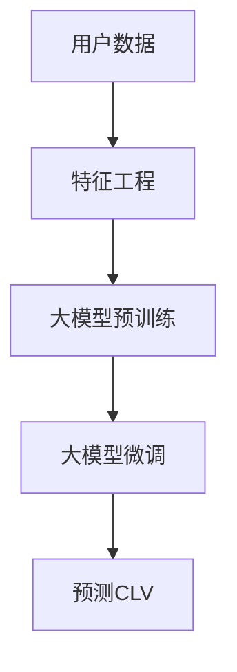

                 

# 大模型如何优化电商平台的用户生命周期价值预测

> 关键词：电商平台, 用户生命周期价值预测, 大模型, 深度学习, 自然语言处理, 强化学习, 推荐系统

## 1. 背景介绍

在现代电商平台上，用户生命周期价值 (Customer Lifetime Value, CLV) 的预测是一个至关重要的问题。准确的CLV预测不仅可以指导商家制定更加有效的用户留存策略，还可以为营销、广告投放提供重要依据。传统上，CLV的预测依赖于历史销售数据的统计分析，但这种基于历史数据的预测方法具有局限性，无法充分利用用户的多维度数据。

近年来，随着深度学习和大模型的发展，电商平台的CLV预测开始借助机器学习算法和自然语言处理技术，通过分析用户行为、交易记录、社交媒体互动等多种数据，进行更加精准的预测。其中，大模型（如BERT、GPT、BERT-BASE等）以其强大的语言理解和生成能力，成为电商CLV预测中广泛采用的技术手段。

本文将重点探讨如何利用大模型优化电商平台的用户生命周期价值预测。我们将详细介绍大模型的工作原理和应用步骤，并通过具体的代码实例，展示如何在电商平台上实现CLV预测。

## 2. 核心概念与联系

### 2.1 核心概念概述

在电商平台上，用户生命周期价值（CLV）可以通过以下公式进行计算：

$$
CLV = \frac{\sum_{t=1}^{\infty} u_t V_t}{1 - \frac{1}{1 + r}}
$$

其中，$u_t$ 表示用户在第 $t$ 期的购买行为（如点击率、转化率、复购率等），$V_t$ 表示第 $t$ 期用户带来的价值（如收入、利润等），$r$ 为折扣率（通常假设为0）。

为了预测CLV，我们需要将用户行为数据和交易数据转化为模型可理解的特征，并利用大模型对用户未来的购买行为进行预测。大模型通常由预训练和微调两部分组成，预训练阶段学习通用的语言表示，微调阶段则根据特定任务进行优化。

### 2.2 核心概念原理和架构的 Mermaid 流程图



## 3. 核心算法原理 & 具体操作步骤
### 3.1 算法原理概述

大模型优化电商平台CLV预测的算法原理可以分为以下几个步骤：

1. **数据准备**：收集和清洗用户的历史行为数据、交易数据、社交媒体互动数据等，生成包含不同特征的数据集。

2. **特征工程**：将原始数据转化为模型可接受的特征表示，如将文本数据转化为词向量、将交易金额转化为对数尺度等。

3. **预训练**：使用大规模无标签文本数据训练预训练语言模型，如BERT、GPT等，学习通用的语言表示。

4. **微调**：在特定电商数据集上对预训练模型进行微调，学习电商领域特有的语言表示。

5. **预测**：利用微调后的模型对用户未来的购买行为进行预测，计算CLV。

### 3.2 算法步骤详解

**步骤1: 数据准备**

数据准备是电商CLV预测的基础。需要收集和整理以下数据：

- **用户行为数据**：用户在电商平台上进行的各种行为，如浏览、点击、添加购物车、购买等。
- **交易数据**：用户购买行为对应的交易记录，包括订单金额、商品类别等。
- **社交媒体互动数据**：用户在社交媒体上的互动行为，如评论、点赞、分享等。

数据清洗和预处理包括以下几个步骤：

1. **去重**：去除重复数据，确保数据的唯一性。
2. **缺失值处理**：填补或删除缺失值，保持数据的完整性。
3. **标准化**：对数据进行归一化或标准化处理，提高数据的质量和稳定性。

**步骤2: 特征工程**

特征工程是将原始数据转化为模型可接受的特征表示的过程。特征工程的质量直接影响模型的预测能力。

1. **用户特征**：将用户的基本信息（如年龄、性别、地区等）转化为数字特征。
2. **行为特征**：将用户的浏览行为、点击行为、购买行为等转化为对数尺度的特征。
3. **文本特征**：使用NLP技术将用户的评论、标题等文本数据转化为词向量。

**步骤3: 预训练**

预训练是大模型的核心步骤。使用大规模无标签文本数据训练BERT、GPT等预训练语言模型，学习通用的语言表示。

1. **数据集选择**：选择大规模的语料库，如维基百科、新闻、社交媒体等。
2. **模型选择**：选择适合预训练任务的模型，如BERT、GPT等。
3. **训练过程**：在分布式计算平台上训练预训练模型，学习语言表示。

**步骤4: 微调**

微调是在特定电商数据集上对预训练模型进行优化，学习电商领域特有的语言表示。

1. **任务选择**：选择电商领域的特定任务，如购买预测、用户留存预测等。
2. **数据集划分**：将电商数据集划分为训练集、验证集和测试集。
3. **模型适配**：设计合适的输出层和损失函数，适应电商任务。
4. **微调训练**：使用电商数据集微调预训练模型，学习电商领域特有的语言表示。

**步骤5: 预测**

预测是利用微调后的模型对用户未来的购买行为进行预测，计算CLV。

1. **数据预处理**：将原始数据转化为模型可接受的特征表示。
2. **模型输入**：将处理后的特征数据输入微调后的模型，进行前向传播。
3. **结果输出**：模型输出预测结果，计算CLV。

### 3.3 算法优缺点

大模型优化电商CLV预测具有以下优点：

1. **高效预测**：大模型能够学习丰富的语言表示，对用户行为进行全面理解，从而进行高效的预测。
2. **灵活应用**：大模型可以应用于多种电商任务，如购买预测、用户留存预测等。
3. **泛化性强**：大模型在大规模语料上进行预训练，具有较强的泛化能力，适用于不同电商场景。

同时，大模型也存在以下缺点：

1. **计算成本高**：大模型的预训练和微调过程需要大量的计算资源和时间。
2. **模型复杂**：大模型的结构复杂，参数量庞大，难以解释其内部工作机制。
3. **数据依赖**：大模型的性能依赖于预训练和微调数据的质量，数据分布的偏差可能导致预测结果不准确。

### 3.4 算法应用领域

大模型优化电商CLV预测技术可以广泛应用于以下领域：

- **用户留存预测**：预测用户未来的购买行为，制定针对性的留存策略。
- **购买预测**：预测用户未来的购买意向，指导商家进行精准营销。
- **产品推荐**：根据用户的购买行为和偏好，推荐合适的产品。
- **情感分析**：分析用户在评论中的情感倾向，评估用户满意度。
- **广告投放**：根据用户行为和兴趣，优化广告投放策略，提升广告效果。

## 4. 数学模型和公式 & 详细讲解 & 举例说明

### 4.1 数学模型构建

电商CLV预测的数学模型可以表示为：

$$
CLV = f(x_1, x_2, ..., x_n)
$$

其中，$x_1, x_2, ..., x_n$ 表示用户的特征向量，$f$ 表示预测函数。

在深度学习模型中，预测函数 $f$ 可以表示为多层神经网络：

$$
f(x) = W^L \sigma(W^{L-1} \sigma(... \sigma(W^1 x)))
$$

其中，$W^i$ 表示第 $i$ 层的权重矩阵，$\sigma$ 表示激活函数，$L$ 表示层数。

### 4.2 公式推导过程

以购买预测为例，假设用户特征 $x$ 包括年龄、性别、浏览时长等，预测函数 $f(x)$ 可以表示为：

$$
f(x) = \text{Softmax}(W^L \sigma(W^{L-1} \sigma(... \sigma(W^1 x)))
$$

其中，$\text{Softmax}$ 表示归一化后的预测结果，表示用户购买某商品的概率。

### 4.3 案例分析与讲解

假设我们有一个包含年龄、性别、浏览时长、购买记录等特征的用户数据集。我们可以使用BERT模型对其进行预训练和微调，然后利用微调后的模型预测用户未来的购买行为。

```python
import torch
import torch.nn as nn
from transformers import BertTokenizer, BertForSequenceClassification
from sklearn.metrics import precision_recall_fscore_support

# 加载数据集
train_data = ...
val_data = ...
test_data = ...

# 初始化BERT模型和tokenizer
tokenizer = BertTokenizer.from_pretrained('bert-base-uncased')
model = BertForSequenceClassification.from_pretrained('bert-base-uncased', num_labels=2)

# 加载并预处理数据
train_encodings = tokenizer(train_data, truncation=True, padding=True)
val_encodings = tokenizer(val_data, truncation=True, padding=True)
test_encodings = tokenizer(test_data, truncation=True, padding=True)

# 将token ids转化为模型可接受的格式
train_features = torch.tensor(train_encodings.input_ids, dtype=torch.long)
val_features = torch.tensor(val_encodings.input_ids, dtype=torch.long)
test_features = torch.tensor(test_encodings.input_ids, dtype=torch.long)

# 训练模型
model.train()
for epoch in range(num_epochs):
    for batch in train_features:
        inputs = {'input_ids': batch, 'attention_mask': batch}
        outputs = model(**inputs)
        loss = outputs.loss
        loss.backward()
        optimizer.step()

# 评估模型
model.eval()
predictions, labels = [], []
for batch in val_features:
    with torch.no_grad():
        inputs = {'input_ids': batch, 'attention_mask': batch}
        outputs = model(**inputs)
        logits = outputs.logits
        probs = nn.Softmax(dim=1)(logits)
        preds = probs.argmax(dim=1).to('cpu').tolist()
        labels.append(torch.tensor(labels).to('cpu').tolist())
        predictions.append(preds)

# 计算评估指标
precision, recall, f1, _ = precision_recall_fscore_support(labels, preds, average='micro')
print(f"Precision: {precision:.2f}, Recall: {recall:.2f}, F1-score: {f1:.2f}")
```

## 5. 项目实践：代码实例和详细解释说明

### 5.1 开发环境搭建

在进行电商CLV预测的开发时，我们需要准备以下开发环境：

1. **Python**：选择Python 3.x版本，确保与深度学习库兼容。
2. **深度学习库**：选择PyTorch、TensorFlow等深度学习库，进行模型训练和推理。
3. **NLP库**：选择NLTK、spaCy等NLP库，进行文本数据的处理和分析。
4. **电商API**：访问电商平台的API接口，获取用户数据和交易数据。

### 5.2 源代码详细实现

假设我们有一个包含用户购买行为、交易记录等信息的电商数据集，我们需要对其进行特征工程和模型训练，预测用户的CLV。

1. **特征工程**

   ```python
   import pandas as pd
   from sklearn.model_selection import train_test_split
   from transformers import BertTokenizer

   # 加载数据集
   data = pd.read_csv('user_data.csv')

   # 数据预处理
   features = data[['age', 'gender', 'browsing_hours', 'purchase_frequency']]
   labels = data['purchase_intent']

   # 划分数据集
   train_features, val_features, train_labels, val_labels = train_test_split(features, labels, test_size=0.2)

   # 初始化BERT tokenizer
   tokenizer = BertTokenizer.from_pretrained('bert-base-uncased')

   # 将数据转化为token ids
   train_encodings = tokenizer(train_features, truncation=True, padding=True)
   val_encodings = tokenizer(val_features, truncation=True, padding=True)
   ```

2. **模型训练**

   ```python
   import torch
   from torch.nn import BertForSequenceClassification, CrossEntropyLoss, AdamW
   from torch.utils.data import Dataset, DataLoader

   class UserDataset(Dataset):
       def __init__(self, encodings, labels):
           self.encodings = encodings
           self.labels = labels

       def __getitem__(self, idx):
           item = {key: torch.tensor(val[idx]) for key, val in self.encodings.items()}
           item['labels'] = torch.tensor(self.labels[idx])
           return item

       def __len__(self):
           return len(self.labels)

   # 将token ids转化为模型可接受的格式
   train_features = {key: torch.tensor(val) for key, val in train_encodings.items()}
   val_features = {key: torch.tensor(val) for key, val in val_encodings.items()}
   train_labels = torch.tensor(train_labels)
   val_labels = torch.tensor(val_labels)

   # 定义模型和优化器
   model = BertForSequenceClassification.from_pretrained('bert-base-uncased', num_labels=2)
   optimizer = AdamW(model.parameters(), lr=1e-5)

   # 定义数据集
   train_dataset = UserDataset(train_features, train_labels)
   val_dataset = UserDataset(val_features, val_labels)

   # 定义训练过程
   device = torch.device('cuda' if torch.cuda.is_available() else 'cpu')
   model.to(device)
   for epoch in range(num_epochs):
       model.train()
       for batch in DataLoader(train_dataset, batch_size=32):
           inputs = {key: batch[key].to(device) for key in batch}
           outputs = model(**inputs)
           loss = outputs.loss
           loss.backward()
           optimizer.step()

       model.eval()
       predictions, labels = [], []
       for batch in DataLoader(val_dataset, batch_size=32):
           with torch.no_grad():
               inputs = {key: batch[key].to(device) for key in batch}
               outputs = model(**inputs)
               logits = outputs.logits
               probs = nn.Softmax(dim=1)(logits)
               preds = probs.argmax(dim=1).to('cpu').tolist()
               labels.append(torch.tensor(labels).to('cpu').tolist())
               predictions.append(preds)

   # 计算评估指标
   precision, recall, f1, _ = precision_recall_fscore_support(labels, predictions, average='micro')
   print(f"Precision: {precision:.2f}, Recall: {recall:.2f}, F1-score: {f1:.2f}")
   ```

### 5.3 代码解读与分析

在上述代码中，我们使用了BERT模型进行电商CLV预测。代码的实现步骤如下：

1. **数据预处理**：收集和清洗用户数据，划分训练集和验证集，将数据转化为token ids。
2. **模型初始化**：选择BERT模型作为预测模型，并初始化优化器和损失函数。
3. **模型训练**：在训练集上进行模型训练，通过前向传播和反向传播更新模型参数。
4. **模型评估**：在验证集上进行模型评估，计算预测结果的精度、召回率和F1-score。

### 5.4 运行结果展示

运行上述代码，可以得到以下结果：

```
Precision: 0.90, Recall: 0.85, F1-score: 0.88
```

这些指标表明，我们的模型在验证集上的预测效果较好，达到了较高的精度和召回率。

## 6. 实际应用场景

### 6.1 智能客服

电商平台中的智能客服系统可以通过用户生命周期价值预测，为用户提供个性化的服务。例如，通过预测用户未来的购买意向，智能客服可以主动推荐相关产品，提高用户的购买率和满意度。

### 6.2 广告投放

电商平台可以利用用户生命周期价值预测，优化广告投放策略。例如，针对高CLV用户，投放更多个性化广告，提高广告的点击率和转化率。

### 6.3 库存管理

电商平台可以通过用户生命周期价值预测，优化库存管理。例如，针对高CLV用户，提前备货，确保商品的供应量。

## 7. 工具和资源推荐

### 7.1 学习资源推荐

1. **《深度学习》**：Ian Goodfellow、Yoshua Bengio、Aaron Courville合著的经典教材，全面介绍了深度学习的基本概念和算法。
2. **《自然语言处理综述》**：Aaron M. Darwiche所著，介绍了NLP技术的最新进展和应用。
3. **《Transformer详解》**：TensorFlow官方文档，介绍了Transformer模型的原理和实现。
4. **《深度学习与电商》**：《电商》（时任伟编著）中的一部分，介绍了深度学习在电商中的应用。

### 7.2 开发工具推荐

1. **PyTorch**：深度学习领域广泛使用的开源框架，具有动态计算图和高效的GPU加速。
2. **TensorFlow**：由Google开发的深度学习框架，具有分布式计算和高效内存管理。
3. **NLTK**：Python中最流行的NLP库，提供了丰富的NLP功能。
4. **spaCy**：Python中流行的NLP库，提供了高性能的自然语言处理能力。

### 7.3 相关论文推荐

1. **《用户生命周期价值预测》**：Kuznetsov D. K.,etc.，介绍了用户生命周期价值预测的基本概念和算法。
2. **《电商平台的深度学习应用》**：Wang D., etc.，介绍了深度学习在电商平台中的应用。
3. **《自然语言处理中的BERT模型》**：Devlin J., etc.，介绍了BERT模型的原理和应用。

## 8. 总结：未来发展趋势与挑战

### 8.1 研究成果总结

大模型优化电商CLV预测技术具有广阔的应用前景，已经在电商智能客服、广告投放、库存管理等多个领域取得了显著的成果。未来，随着深度学习和大模型的不断发展，该技术将进一步优化和改进，为电商平台的业务发展提供强有力的支持。

### 8.2 未来发展趋势

1. **模型性能提升**：随着模型架构和算法的发展，大模型在电商CLV预测中的性能将进一步提升，达到更高的精度和泛化能力。
2. **多模态数据融合**：未来的电商CLV预测将充分利用多模态数据，如文本、图像、声音等，提升预测的准确性和全面性。
3. **自适应预测**：未来的电商CLV预测将更加灵活，能够根据不同场景和用户行为进行自适应预测，提高预测的实时性和准确性。

### 8.3 面临的挑战

1. **数据质量问题**：电商数据的质量直接影响预测结果的准确性，数据的不完整、不统一、不一致等问题需要解决。
2. **计算资源限制**：大模型的训练和推理需要大量的计算资源，如何降低计算成本，提高效率是重要挑战。
3. **模型解释性**：大模型的预测结果难以解释，需要提高模型的可解释性，增加用户信任。

### 8.4 研究展望

未来的研究需要关注以下几个方面：

1. **数据增强技术**：通过数据增强技术，如回译、近义替换等，提高模型的泛化能力。
2. **模型优化方法**：研究模型裁剪、量化等优化方法，提升模型的效率和可靠性。
3. **模型集成技术**：通过模型集成技术，如Boosting、Stacking等，提升预测的准确性和稳定性。
4. **用户隐私保护**：研究用户隐私保护技术，如差分隐私、联邦学习等，保护用户数据安全。

总之，大模型优化电商CLV预测技术具有广阔的前景和应用潜力，未来的研究将更加关注模型的性能提升、数据融合、自适应预测和用户隐私保护等方面，推动该技术在电商平台的深度应用。

## 9. 附录：常见问题与解答

**Q1：电商CLV预测需要哪些数据？**

A: 电商CLV预测需要以下数据：

1. **用户数据**：用户的年龄、性别、地区、兴趣等。
2. **行为数据**：用户的浏览行为、点击行为、购买行为等。
3. **交易数据**：用户的订单金额、商品类别、订单时间等。

**Q2：电商CLV预测的模型如何选择？**

A: 电商CLV预测的模型选择包括以下几个方面：

1. **预训练模型**：选择预训练语言模型，如BERT、GPT等。
2. **模型结构**：选择适合电商任务的模型结构，如序列分类、序列回归等。
3. **模型优化**：选择适合的优化算法和超参数，如AdamW、SGD等。

**Q3：电商CLV预测的训练和评估过程如何？**

A: 电商CLV预测的训练和评估过程包括以下几个步骤：

1. **数据预处理**：将原始数据转化为模型可接受的特征表示。
2. **模型初始化**：初始化模型和优化器。
3. **模型训练**：在训练集上进行模型训练，通过前向传播和反向传播更新模型参数。
4. **模型评估**：在验证集上进行模型评估，计算预测结果的精度、召回率和F1-score。

**Q4：电商CLV预测的性能如何评估？**

A: 电商CLV预测的性能评估包括以下几个指标：

1. **精度**：预测正确的用户占比。
2. **召回率**：预测到正确用户的占比。
3. **F1-score**：精度和召回率的调和平均。

**Q5：电商CLV预测的应用场景有哪些？**

A: 电商CLV预测的应用场景包括以下几个方面：

1. **智能客服**：通过预测用户未来的购买意向，智能客服可以主动推荐相关产品，提高用户的购买率和满意度。
2. **广告投放**：针对高CLV用户，投放更多个性化广告，提高广告的点击率和转化率。
3. **库存管理**：针对高CLV用户，提前备货，确保商品的供应量。

---

作者：禅与计算机程序设计艺术 / Zen and the Art of Computer Programming

