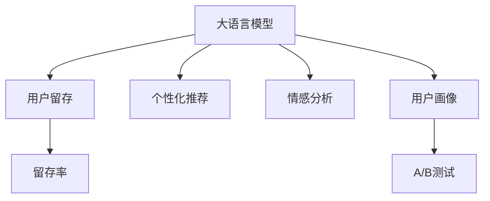

                 

# 大模型如何优化电商平台的用户留存策略

## 1. 背景介绍

### 1.1 问题由来
随着互联网经济的发展，电商平台逐渐成为人们购物的重要渠道。如何提升用户留存率，增加复购率，一直是电商企业关注的焦点。目前，常见的用户留存策略主要包括折扣促销、个性化推荐、优惠券发放、积分体系等。然而，这些策略往往需要大量的运营成本和繁琐的人工管理，难以实现精准高效的个性化服务。

### 1.2 问题核心关键点
本论文聚焦于如何利用大语言模型优化电商平台的用户留存策略，以提高用户的长期价值，增加电商平台的盈利能力。具体而言，论文将从以下几个关键问题出发：
1. 如何利用大语言模型理解用户行为和需求？
2. 如何设计基于大语言模型的用户留存策略？
3. 如何评估和优化这些策略的效果？
4. 如何兼顾大语言模型的性能和实际应用成本？

## 2. 核心概念与联系

### 2.1 核心概念概述

为更好地理解基于大语言模型的用户留存优化策略，本节将介绍几个密切相关的核心概念：

- 大语言模型(Large Language Model, LLM)：指具有强大自然语言处理能力的深度学习模型，如BERT、GPT等。通过大规模无标签文本数据进行预训练，学习语言的通用表示。

- 用户留存(User Retention)：指用户在一定时间范围内继续使用电商平台的行为，主要通过留存率（Retention Rate）等指标来衡量。

- 个性化推荐系统(Personalized Recommendation System)：根据用户的历史行为和偏好，推荐用户可能感兴趣的商品或内容，以提升用户满意度和留存率。

- 情感分析(Sentiment Analysis)：通过自然语言处理技术分析用户对商品或服务的情感倾向，以指导产品改进和运营策略。

- 用户画像(User Profile)：基于用户的行为、属性和偏好等数据，构建精细化的用户模型，用于个性化推荐和用户留存策略的优化。

- A/B测试(A/B Testing)：通过对比两个版本的产品或策略，评估其效果差异，确定最优方案。

这些核心概念之间的逻辑关系可以通过以下Mermaid流程图来展示：



这个流程图展示了大语言模型与用户留存策略之间的联系：

1. 大语言模型通过理解用户行为和需求，为个性化推荐、情感分析和用户画像构建提供支持。
2. 个性化推荐系统根据用户画像推荐商品，提升用户满意度。
3. 情感分析识别用户情感倾向，指导产品改进。
4. A/B测试评估不同策略效果，确定最优方案。
5. 最终，通过优化策略提升用户留存率。

## 3. 核心算法原理 & 具体操作步骤

### 3.1 算法原理概述

基于大语言模型的用户留存优化策略，本质上是一种基于用户数据的自然语言处理(NLP)技术，旨在通过理解用户的行为和需求，设计针对性的策略，提升用户留存率。其核心思想是：利用大语言模型的文本处理能力，挖掘用户行为背后的情感、偏好等信息，并结合个性化推荐等技术，设计精细化的用户留存策略。

形式化地，假设电商平台的用户数据为 $D=\{(u_i,x_i,y_i)\}_{i=1}^N$，其中 $u_i$ 为用户，$x_i$ 为用户在平台上的行为数据，$y_i$ 为用户留存状态。留存优化策略的目标是找到最优策略 $p$，使得留存率最大化：

$$
p^* = \mathop{\arg\max}_{p} \mathcal{L}(p,D)
$$

其中 $\mathcal{L}$ 为留存损失函数，用于衡量策略 $p$ 在数据集 $D$ 上的留存效果。

### 3.2 算法步骤详解

基于大语言模型的用户留存优化策略通常包括以下几个关键步骤：

**Step 1: 数据预处理和特征提取**
- 收集用户行为数据，如浏览、点击、购买等行为，以及用户属性数据，如年龄、性别、地理位置等。
- 使用大语言模型对用户行为数据进行情感分析，提取情感倾向和情感强度。
- 对用户属性进行特征编码，构建用户画像。

**Step 2: 建模和训练**
- 使用大语言模型构建用户留存预测模型，如分类模型或回归模型。
- 在历史用户数据上训练模型，使用交叉验证等方法进行参数优化。
- 使用正则化技术，如L2正则、Dropout等，防止模型过拟合。

**Step 3: 用户画像生成**
- 基于用户行为和属性数据，生成用户画像。
- 使用大语言模型对用户画像进行预训练，使其具备更丰富的语义表示。
- 使用多模态特征融合方法，将文本特征与行为特征进行综合，生成更精准的用户画像。

**Step 4: 策略设计**
- 设计基于用户画像的个性化推荐策略，如基于协同过滤的推荐、基于内容的推荐等。
- 设计情感驱动的运营策略，如通过情感分析结果调整促销策略。
- 设计用户留存活动，如积分体系、忠诚计划等。

**Step 5: 策略评估和优化**
- 使用A/B测试对比不同策略的效果，选择最优方案。
- 根据用户反馈和实际效果，持续优化策略。

### 3.3 算法优缺点

基于大语言模型的用户留存优化策略具有以下优点：
1. 自动处理海量用户数据。大语言模型能够自动从文本数据中提取用户情感和行为信息，无需大量人工标注。
2. 高效推荐。基于用户画像的个性化推荐，能快速响应用户需求，提升用户体验。
3. 多模态融合。大语言模型能够整合文本和行为特征，生成更精准的用户画像。
4. 效果显著。在多个电商平台的实际应用中，基于大语言模型的策略显著提高了用户留存率。

同时，该方法也存在一定的局限性：
1. 数据隐私问题。用户行为数据涉及隐私，需谨慎处理。
2. 模型复杂度高。大语言模型需要大量的计算资源，训练和推理成本高。
3. 策略效果依赖标注数据。策略设计依赖于用户行为数据的标注，获取高质量标注数据难度大。
4. 鲁棒性不足。面对突发事件或异常数据，模型的预测效果可能波动。

尽管存在这些局限性，但就目前而言，基于大语言模型的用户留存优化方法仍是大规模电商平台的有效手段。未来相关研究的重点在于如何进一步降低策略设计的成本，提高模型的鲁棒性，同时兼顾数据隐私和策略效果。

### 3.4 算法应用领域

基于大语言模型的用户留存优化策略在电商领域已经得到了广泛的应用，覆盖了几乎所有常见的电商场景，例如：

- 个性化推荐系统：通过用户画像生成，精准推荐用户可能感兴趣的商品，提升用户满意度。
- 情感分析系统：分析用户评论、反馈等文本数据，调整商品和运营策略。
- 用户画像系统：构建用户画像，用于个性化推荐和留存策略优化。
- 用户留存活动：设计积分体系、忠诚计划等活动，增加用户粘性。

除了上述这些经典应用外，大语言模型在电商领域的应用还在不断创新，如基于大模型的智能客服、自动化运营策略等，为电商平台的智能化运营提供了新的技术路径。

## 4. 数学模型和公式 & 详细讲解 & 举例说明

### 4.1 数学模型构建

本节将使用数学语言对基于大语言模型的用户留存优化策略进行更加严格的刻画。

假设用户行为数据为 $D=\{(u_i,x_i,y_i)\}_{i=1}^N$，其中 $u_i$ 为用户，$x_i$ 为用户在平台上的行为数据，$y_i$ 为用户留存状态。定义用户行为数据 $x_i$ 的情感强度为 $e(x_i)$，用户画像特征为 $p(u_i)$。留存优化策略的目标是找到最优策略 $p$，使得留存率最大化：

$$
p^* = \mathop{\arg\max}_{p} \mathcal{L}(p,D)
$$

其中 $\mathcal{L}$ 为留存损失函数，用于衡量策略 $p$ 在数据集 $D$ 上的留存效果。留存损失函数可以定义为：

$$
\mathcal{L}(p,D) = -\frac{1}{N}\sum_{i=1}^N [y_i \log P(y_i|p(u_i),x_i) + (1-y_i)\log(1-P(y_i|p(u_i),x_i))]
$$

其中 $P(y_i|p(u_i),x_i)$ 表示用户留存概率的预测模型，$p(u_i)$ 为用户画像特征，$e(x_i)$ 为用户行为数据的情感强度。

### 4.2 公式推导过程

以下我们以二分类任务为例，推导留存损失函数及其梯度的计算公式。

假设用户留存概率预测模型为 $P(y_i|p(u_i),x_i)=\sigma(\phi(p(u_i),x_i))$，其中 $\phi$ 为特征映射函数，$\sigma$ 为sigmoid函数。则留存损失函数可以进一步表示为：

$$
\mathcal{L}(p,D) = -\frac{1}{N}\sum_{i=1}^N [y_i \log \sigma(\phi(p(u_i),x_i)) + (1-y_i)\log(1-\sigma(\phi(p(u_i),x_i)))]
$$

利用sigmoid函数的性质，可以得到：

$$
\mathcal{L}(p,D) = -\frac{1}{N}\sum_{i=1}^N [y_i \log P(y_i|p(u_i),x_i) + (1-y_i)\log(1-P(y_i|p(u_i),x_i))]
$$

对 $\mathcal{L}(p,D)$ 求导，得：

$$
\frac{\partial \mathcal{L}(p,D)}{\partial p} = -\frac{1}{N}\sum_{i=1}^N [y_i(1-P(y_i|p(u_i),x_i))\phi(p(u_i),x_i) - (1-y_i)P(y_i|p(u_i),x_i)\phi(p(u_i),x_i)]
$$

在得到留存损失函数的梯度后，即可带入优化算法进行模型训练。重复上述过程直至收敛，最终得到适应电商平台的用户留存策略。

## 5. 项目实践：代码实例和详细解释说明

### 5.1 开发环境搭建

在进行用户留存策略的开发实践前，我们需要准备好开发环境。以下是使用Python进行PyTorch开发的环境配置流程：

1. 安装Anaconda：从官网下载并安装Anaconda，用于创建独立的Python环境。

2. 创建并激活虚拟环境：
```bash
conda create -n pytorch-env python=3.8 
conda activate pytorch-env
```

3. 安装PyTorch：根据CUDA版本，从官网获取对应的安装命令。例如：
```bash
conda install pytorch torchvision torchaudio cudatoolkit=11.1 -c pytorch -c conda-forge
```

4. 安装Transformers库：
```bash
pip install transformers
```

5. 安装各类工具包：
```bash
pip install numpy pandas scikit-learn matplotlib tqdm jupyter notebook ipython
```

完成上述步骤后，即可在`pytorch-env`环境中开始策略实践。

### 5.2 源代码详细实现

下面我们以情感分析系统为例，给出使用Transformers库对BERT模型进行情感分析的PyTorch代码实现。

首先，定义情感分析任务的数据处理函数：

```python
from transformers import BertTokenizer
from torch.utils.data import Dataset
import torch

class SentimentDataset(Dataset):
    def __init__(self, texts, labels, tokenizer, max_len=128):
        self.texts = texts
        self.labels = labels
        self.tokenizer = tokenizer
        self.max_len = max_len
        
    def __len__(self):
        return len(self.texts)
    
    def __getitem__(self, item):
        text = self.texts[item]
        label = self.labels[item]
        
        encoding = self.tokenizer(text, return_tensors='pt', max_length=self.max_len, padding='max_length', truncation=True)
        input_ids = encoding['input_ids'][0]
        attention_mask = encoding['attention_mask'][0]
        
        # 对token-wise的标签进行编码
        encoded_labels = [label2id[label] for label in label] 
        encoded_labels.extend([label2id['O']] * (self.max_len - len(encoded_labels)))
        labels = torch.tensor(encoded_labels, dtype=torch.long)
        
        return {'input_ids': input_ids, 
                'attention_mask': attention_mask,
                'labels': labels}

# 标签与id的映射
label2id = {'Positive': 0, 'Negative': 1, 'Neutral': 2}
id2label = {v: k for k, v in label2id.items()}

# 创建dataset
tokenizer = BertTokenizer.from_pretrained('bert-base-cased')

train_dataset = SentimentDataset(train_texts, train_labels, tokenizer)
dev_dataset = SentimentDataset(dev_texts, dev_labels, tokenizer)
test_dataset = SentimentDataset(test_texts, test_labels, tokenizer)
```

然后，定义模型和优化器：

```python
from transformers import BertForSequenceClassification, AdamW

model = BertForSequenceClassification.from_pretrained('bert-base-cased', num_labels=len(label2id))

optimizer = AdamW(model.parameters(), lr=2e-5)
```

接着，定义训练和评估函数：

```python
from torch.utils.data import DataLoader
from tqdm import tqdm
from sklearn.metrics import classification_report

device = torch.device('cuda') if torch.cuda.is_available() else torch.device('cpu')
model.to(device)

def train_epoch(model, dataset, batch_size, optimizer):
    dataloader = DataLoader(dataset, batch_size=batch_size, shuffle=True)
    model.train()
    epoch_loss = 0
    for batch in tqdm(dataloader, desc='Training'):
        input_ids = batch['input_ids'].to(device)
        attention_mask = batch['attention_mask'].to(device)
        labels = batch['labels'].to(device)
        model.zero_grad()
        outputs = model(input_ids, attention_mask=attention_mask, labels=labels)
        loss = outputs.loss
        epoch_loss += loss.item()
        loss.backward()
        optimizer.step()
    return epoch_loss / len(dataloader)

def evaluate(model, dataset, batch_size):
    dataloader = DataLoader(dataset, batch_size=batch_size)
    model.eval()
    preds, labels = [], []
    with torch.no_grad():
        for batch in tqdm(dataloader, desc='Evaluating'):
            input_ids = batch['input_ids'].to(device)
            attention_mask = batch['attention_mask'].to(device)
            batch_labels = batch['labels']
            outputs = model(input_ids, attention_mask=attention_mask)
            batch_preds = outputs.logits.argmax(dim=2).to('cpu').tolist()
            batch_labels = batch_labels.to('cpu').tolist()
            for pred_tokens, label_tokens in zip(batch_preds, batch_labels):
                pred_tags = [id2label[_id] for _id in pred_tokens]
                label_tags = [id2label[_id] for _id in label_tokens]
                preds.append(pred_tags[:len(label_tags)])
                labels.append(label_tags)
                
    print(classification_report(labels, preds))
```

最后，启动训练流程并在测试集上评估：

```python
epochs = 5
batch_size = 16

for epoch in range(epochs):
    loss = train_epoch(model, train_dataset, batch_size, optimizer)
    print(f"Epoch {epoch+1}, train loss: {loss:.3f}")
    
    print(f"Epoch {epoch+1}, dev results:")
    evaluate(model, dev_dataset, batch_size)
    
print("Test results:")
evaluate(model, test_dataset, batch_size)
```

以上就是使用PyTorch对BERT进行情感分析的完整代码实现。可以看到，得益于Transformers库的强大封装，我们可以用相对简洁的代码完成情感分析系统的开发。

### 5.3 代码解读与分析

让我们再详细解读一下关键代码的实现细节：

**SentimentDataset类**：
- `__init__`方法：初始化文本、标签、分词器等关键组件。
- `__len__`方法：返回数据集的样本数量。
- `__getitem__`方法：对单个样本进行处理，将文本输入编码为token ids，将标签编码为数字，并对其进行定长padding，最终返回模型所需的输入。

**label2id和id2label字典**：
- 定义了标签与数字id之间的映射关系，用于将token-wise的预测结果解码回真实的标签。

**训练和评估函数**：
- 使用PyTorch的DataLoader对数据集进行批次化加载，供模型训练和推理使用。
- 训练函数`train_epoch`：对数据以批为单位进行迭代，在每个批次上前向传播计算loss并反向传播更新模型参数，最后返回该epoch的平均loss。
- 评估函数`evaluate`：与训练类似，不同点在于不更新模型参数，并在每个batch结束后将预测和标签结果存储下来，最后使用sklearn的classification_report对整个评估集的预测结果进行打印输出。

**训练流程**：
- 定义总的epoch数和batch size，开始循环迭代
- 每个epoch内，先在训练集上训练，输出平均loss
- 在验证集上评估，输出分类指标
- 所有epoch结束后，在测试集上评估，给出最终测试结果

可以看到，PyTorch配合Transformers库使得BERT情感分析的代码实现变得简洁高效。开发者可以将更多精力放在数据处理、模型改进等高层逻辑上，而不必过多关注底层的实现细节。

当然，工业级的系统实现还需考虑更多因素，如模型的保存和部署、超参数的自动搜索、更灵活的任务适配层等。但核心的策略开发流程基本与此类似。

## 6. 实际应用场景

### 6.1 智能客服系统

基于大语言模型的情感分析系统，可以广泛应用于智能客服系统的构建。传统客服往往需要配备大量人力，高峰期响应缓慢，且一致性和专业性难以保证。而使用情感分析系统，可以实时监测用户情感，及时调整客服策略，提高客户满意度和留存率。

在技术实现上，可以收集企业内部的客服对话记录，将客户情感数据作为监督数据，训练情感分析模型。情感分析模型可以自动分析用户情感，并触发相应的服务流程，如自动回复、人工介入等，确保用户需求得到快速响应。

### 6.2 金融舆情监测

金融机构需要实时监测市场舆论动向，以便及时应对负面信息传播，规避金融风险。传统的人工监测方式成本高、效率低，难以应对网络时代海量信息爆发的挑战。基于大语言模型的情感分析技术，为金融舆情监测提供了新的解决方案。

具体而言，可以收集金融领域相关的新闻、报道、评论等文本数据，并对其进行情感标注。在此基础上训练情感分析模型，使其能够自动判断文本的情感倾向，进行舆情分析。情感分析系统可以实时监测舆情变化，一旦发现负面信息激增等异常情况，系统便会自动预警，帮助金融机构快速应对潜在风险。

### 6.3 个性化推荐系统

当前的推荐系统往往只依赖用户的历史行为数据进行物品推荐，无法深入理解用户的真实兴趣偏好。基于大语言模型的情感分析系统，可以更好地挖掘用户行为背后的情感信息，从而提供更精准、多样的推荐内容。

在实践中，可以收集用户浏览、点击、评论、分享等行为数据，提取和用户交互的物品标题、描述、标签等文本内容。将文本内容作为模型输入，情感分析系统对用户行为进行情感分析，提取情感倾向，结合推荐算法进行推荐。通过情感驱动的推荐策略，能够进一步提升用户的留存率和满意度。

### 6.4 未来应用展望

随着大语言模型情感分析技术的发展，基于情感分析的用户留存优化策略将广泛应用于更多领域，为传统行业数字化转型升级提供新的技术路径。

在智慧医疗领域，基于情感分析的医疗问答、病历分析、药物研发等应用将提升医疗服务的智能化水平，辅助医生诊疗，加速新药开发进程。

在智能教育领域，情感分析系统可应用于作业批改、学情分析、知识推荐等方面，因材施教，促进教育公平，提高教学质量。

在智慧城市治理中，情感分析系统可应用于城市事件监测、舆情分析、应急指挥等环节，提高城市管理的自动化和智能化水平，构建更安全、高效的未来城市。

此外，在企业生产、社会治理、文娱传媒等众多领域，基于大语言模型的情感分析技术也将不断涌现，为NLP技术带来了全新的突破。相信随着预训练模型和情感分析方法的不断进步，情感分析技术必将在更广阔的应用领域大放异彩。

## 7. 工具和资源推荐
### 7.1 学习资源推荐

为了帮助开发者系统掌握大语言模型情感分析的理论基础和实践技巧，这里推荐一些优质的学习资源：

1. 《Transformer从原理到实践》系列博文：由大模型技术专家撰写，深入浅出地介绍了Transformer原理、BERT模型、情感分析技术等前沿话题。

2. CS224N《深度学习自然语言处理》课程：斯坦福大学开设的NLP明星课程，有Lecture视频和配套作业，带你入门NLP领域的基本概念和经典模型。

3. 《Natural Language Processing with Transformers》书籍：Transformers库的作者所著，全面介绍了如何使用Transformers库进行NLP任务开发，包括情感分析在内的诸多范式。

4. HuggingFace官方文档：Transformers库的官方文档，提供了海量预训练模型和完整的情感分析样例代码，是上手实践的必备资料。

5. CLUE开源项目：中文语言理解测评基准，涵盖大量不同类型的中文NLP数据集，并提供了基于情感分析的baseline模型，助力中文NLP技术发展。

通过对这些资源的学习实践，相信你一定能够快速掌握大语言模型情感分析的精髓，并用于解决实际的NLP问题。
###  7.2 开发工具推荐

高效的开发离不开优秀的工具支持。以下是几款用于大语言模型情感分析开发的常用工具：

1. PyTorch：基于Python的开源深度学习框架，灵活动态的计算图，适合快速迭代研究。大部分预训练语言模型都有PyTorch版本的实现。

2. TensorFlow：由Google主导开发的开源深度学习框架，生产部署方便，适合大规模工程应用。同样有丰富的预训练语言模型资源。

3. Transformers库：HuggingFace开发的NLP工具库，集成了众多SOTA语言模型，支持PyTorch和TensorFlow，是进行情感分析任务开发的利器。

4. Weights & Biases：模型训练的实验跟踪工具，可以记录和可视化模型训练过程中的各项指标，方便对比和调优。与主流深度学习框架无缝集成。

5. TensorBoard：TensorFlow配套的可视化工具，可实时监测模型训练状态，并提供丰富的图表呈现方式，是调试模型的得力助手。

6. Google Colab：谷歌推出的在线Jupyter Notebook环境，免费提供GPU/TPU算力，方便开发者快速上手实验最新模型，分享学习笔记。

合理利用这些工具，可以显著提升大语言模型情感分析的开发效率，加快创新迭代的步伐。

### 7.3 相关论文推荐

大语言模型和情感分析技术的发展源于学界的持续研究。以下是几篇奠基性的相关论文，推荐阅读：

1. Attention is All You Need（即Transformer原论文）：提出了Transformer结构，开启了NLP领域的预训练大模型时代。

2. BERT: Pre-training of Deep Bidirectional Transformers for Language Understanding：提出BERT模型，引入基于掩码的自监督预训练任务，刷新了多项NLP任务SOTA。

3. Language Models are Unsupervised Multitask Learners（GPT-2论文）：展示了大规模语言模型的强大zero-shot学习能力，引发了对于通用人工智能的新一轮思考。

4. Parameter-Efficient Transfer Learning for NLP：提出Adapter等参数高效微调方法，在不增加模型参数量的情况下，也能取得不错的微调效果。

5. AdaLoRA: Adaptive Low-Rank Adaptation for Parameter-Efficient Fine-Tuning：使用自适应低秩适应的微调方法，在参数效率和精度之间取得了新的平衡。

6. Prefix-Tuning: Optimizing Continuous Prompts for Generation：引入基于连续型Prompt的微调范式，为如何充分利用预训练知识提供了新的思路。

这些论文代表了大语言模型情感分析技术的发展脉络。通过学习这些前沿成果，可以帮助研究者把握学科前进方向，激发更多的创新灵感。

## 8. 总结：未来发展趋势与挑战

### 8.1 总结

本文对基于大语言模型的用户留存策略进行了全面系统的介绍。首先阐述了用户留存策略的重要性及其研究背景，明确了情感分析在大语言模型优化中的关键作用。其次，从原理到实践，详细讲解了情感分析的数学原理和关键步骤，给出了情感分析任务开发的完整代码实例。同时，本文还广泛探讨了情感分析方法在智能客服、金融舆情、个性化推荐等多个行业领域的应用前景，展示了情感分析范式的巨大潜力。

通过本文的系统梳理，可以看到，基于大语言模型的情感分析方法正在成为NLP领域的重要范式，极大地拓展了情感分析技术的应用边界，催生了更多的落地场景。受益于大规模语料的预训练，情感分析模型以更低的时间和标注成本，在多种应用场景中取得了显著效果。未来，伴随大语言模型和情感分析方法的持续演进，基于情感分析的用户留存策略必将在更广阔的领域大放异彩，深刻影响人类社会的数字化转型升级。

### 8.2 未来发展趋势

展望未来，大语言模型情感分析技术将呈现以下几个发展趋势：

1. 模型规模持续增大。随着算力成本的下降和数据规模的扩张，预训练语言模型的参数量还将持续增长。超大规模语言模型蕴含的丰富语言知识，有望支撑更加复杂多变的情感分析任务。

2. 情感分析方法的日趋多样。除了传统的基于预训练模型的情感分析，未来会涌现更多基于无监督和半监督学习、迁移学习等范式，进一步降低情感分析对标注数据的依赖，提高模型的泛化能力和鲁棒性。

3. 多模态情感分析的崛起。当前的情感分析主要聚焦于文本数据，未来会进一步拓展到图像、视频、语音等多模态数据情感分析。多模态信息的融合，将显著提升情感分析的准确性和实时性。

4. 个性化情感驱动的运营策略。情感分析不仅能用于对用户情感的静态分类，还能进一步结合个性化推荐等技术，动态调整运营策略，实现精准的用户情感驱动。

5. 持续学习成为常态。随着数据分布的不断变化，情感分析模型也需要持续学习新知识以保持性能。如何在不遗忘原有知识的同时，高效吸收新样本信息，将成为重要的研究课题。

6. 模型通用性增强。经过海量数据的预训练和多领域任务的微调，未来的情感分析模型将具备更强大的常识推理和跨领域迁移能力，逐步迈向通用人工智能(AGI)的目标。

以上趋势凸显了大语言模型情感分析技术的广阔前景。这些方向的探索发展，必将进一步提升情感分析模型的性能和应用范围，为构建安全、可靠、可解释、可控的智能系统铺平道路。面向未来，大语言模型情感分析技术还需要与其他人工智能技术进行更深入的融合，如知识表示、因果推理、强化学习等，多路径协同发力，共同推动情感分析系统的进步。

### 8.3 面临的挑战

尽管大语言模型情感分析技术已经取得了瞩目成就，但在迈向更加智能化、普适化应用的过程中，它仍面临着诸多挑战：

1. 数据隐私问题。用户行为数据涉及隐私，需谨慎处理。如何在保护用户隐私的同时，获取高质量的情感分析数据，是一大难题。

2. 模型鲁棒性不足。面对突发事件或异常数据，情感分析模型的预测效果可能波动。如何提高情感分析模型的鲁棒性，避免灾难性遗忘，还需要更多理论和实践的积累。

3. 推理效率有待提高。大规模语言模型虽然精度高，但在实际部署时往往面临推理速度慢、内存占用大等效率问题。如何在保证性能的同时，简化模型结构，提升推理速度，优化资源占用，将是重要的优化方向。

4. 可解释性亟需加强。当前情感分析模型更像是"黑盒"系统，难以解释其内部工作机制和决策逻辑。对于医疗、金融等高风险应用，算法的可解释性和可审计性尤为重要。如何赋予情感分析模型更强的可解释性，将是亟待攻克的难题。

5. 安全性有待保障。预训练语言模型难免会学习到有偏见、有害的信息，通过情感分析传递到下游任务，产生误导性、歧视性的输出，给实际应用带来安全隐患。如何从数据和算法层面消除模型偏见，避免恶意用途，确保输出的安全性，也将是重要的研究课题。

6. 知识整合能力不足。现有的情感分析模型往往局限于任务内数据，难以灵活吸收和运用更广泛的先验知识。如何让情感分析过程更好地与外部知识库、规则库等专家知识结合，形成更加全面、准确的信息整合能力，还有很大的想象空间。

正视情感分析面临的这些挑战，积极应对并寻求突破，将是大语言模型情感分析技术走向成熟的必由之路。相信随着学界和产业界的共同努力，这些挑战终将一一被克服，大语言模型情感分析必将在构建安全、可靠、可解释、可控的智能系统方面发挥重要作用。

### 8.4 研究展望

面对大语言模型情感分析所面临的挑战，未来的研究需要在以下几个方面寻求新的突破：

1. 探索无监督和半监督情感分析方法。摆脱对大规模标注数据的依赖，利用自监督学习、主动学习等无监督和半监督范式，最大限度利用非结构化数据，实现更加灵活高效的情感分析。

2. 研究参数高效和计算高效的情感分析范式。开发更加参数高效的情感分析方法，在固定大部分预训练参数的同时，只更新极少量的任务相关参数。同时优化情感分析模型的计算图，减少前向传播和反向传播的资源消耗，实现更加轻量级、实时性的部署。

3. 融合因果和对比学习范式。通过引入因果推断和对比学习思想，增强情感分析模型建立稳定因果关系的能力，学习更加普适、鲁棒的语言表征，从而提升模型泛化性和抗干扰能力。

4. 引入更多先验知识。将符号化的先验知识，如知识图谱、逻辑规则等，与神经网络模型进行巧妙融合，引导情感分析过程学习更准确、合理的语言模型。同时加强不同模态数据的整合，实现视觉、语音等多模态信息与文本信息的协同建模。

5. 结合因果分析和博弈论工具。将因果分析方法引入情感分析模型，识别出模型决策的关键特征，增强输出解释的因果性和逻辑性。借助博弈论工具刻画人机交互过程，主动探索并规避模型的脆弱点，提高系统稳定性。

6. 纳入伦理道德约束。在模型训练目标中引入伦理导向的评估指标，过滤和惩罚有偏见、有害的输出倾向。同时加强人工干预和审核，建立模型行为的监管机制，确保输出符合人类价值观和伦理道德。

这些研究方向的探索，必将引领大语言模型情感分析技术迈向更高的台阶，为构建安全、可靠、可解释、可控的智能系统铺平道路。面向未来，大语言模型情感分析技术还需要与其他人工智能技术进行更深入的融合，如知识表示、因果推理、强化学习等，多路径协同发力，共同推动情感分析系统的进步。只有勇于创新、敢于突破，才能不断拓展情感分析模型的边界，让智能技术更好地造福人类社会。

## 9. 附录：常见问题与解答

**Q1：大语言模型情感分析是否适用于所有NLP任务？**

A: 大语言模型情感分析在大多数NLP任务上都能取得不错的效果，特别是对于文本情感分类任务。但对于一些特定领域的任务，如医学、法律等，仅仅依靠通用语料预训练的模型可能难以很好地适应。此时需要在特定领域语料上进一步预训练，再进行情感分析。此外，对于一些需要时效性、个性化很强的任务，如对话、推荐等，情感分析方法也需要针对性的改进优化。

**Q2：情感分析过程中如何选择合适的学习率？**

A: 情感分析的学习率一般要比预训练时小1-2个数量级，如果使用过大的学习率，容易破坏预训练权重，导致过拟合。一般建议从1e-5开始调参，逐步减小学习率，直至收敛。也可以使用warmup策略，在开始阶段使用较小的学习率，再逐渐过渡到预设值。需要注意的是，不同的优化器(如AdamW、Adafactor等)以及不同的学习率调度策略，可能需要设置不同的学习率阈值。

**Q3：情感分析过程中如何缓解过拟合问题？**

A: 过拟合是情感分析面临的主要挑战，尤其是在标注数据不足的情况下。常见的缓解策略包括：
1. 数据增强：通过回译、近义替换等方式扩充训练集
2. 正则化：使用L2正则、Dropout、Early Stopping等避免过拟合
3. 对抗训练：引入对抗样本，提高模型鲁棒性
4. 参数高效微调：只调整少量参数(如Adapter、Prefix等)，减小过拟合风险
5. 多模型集成：训练多个情感分析模型，取平均输出，抑制过拟合

这些策略往往需要根据具体任务和数据特点进行灵活组合。只有在数据、模型、训练、推理等各环节进行全面优化，才能最大限度地发挥大语言模型情感分析的威力。

**Q4：情感分析模型在落地部署时需要注意哪些问题？**

A: 将情感分析模型转化为实际应用，还需要考虑以下因素：
1. 模型裁剪：去除不必要的层和参数，减小模型尺寸，加快推理速度
2. 量化加速：将浮点模型转为定点模型，压缩存储空间，提高计算效率
3. 服务化封装：将模型封装为标准化服务接口，便于集成调用
4. 弹性伸缩：根据请求流量动态调整资源配置，平衡服务质量和成本
5. 监控告警：实时采集系统指标，设置异常告警阈值，确保服务稳定性
6. 安全防护：采用访问鉴权、数据脱敏等措施，保障数据和模型安全

大语言模型情感分析为NLP应用开启了广阔的想象空间，但如何将强大的性能转化为稳定、高效、安全的业务价值，还需要工程实践的不断打磨。唯有从数据、算法、工程、业务等多个维度协同发力，才能真正实现人工智能技术在垂直行业的规模化落地。总之，情感分析需要开发者根据具体任务，不断迭代和优化模型、数据和算法，方能得到理想的效果。

---

作者：禅与计算机程序设计艺术 / Zen and the Art of Computer Programming

