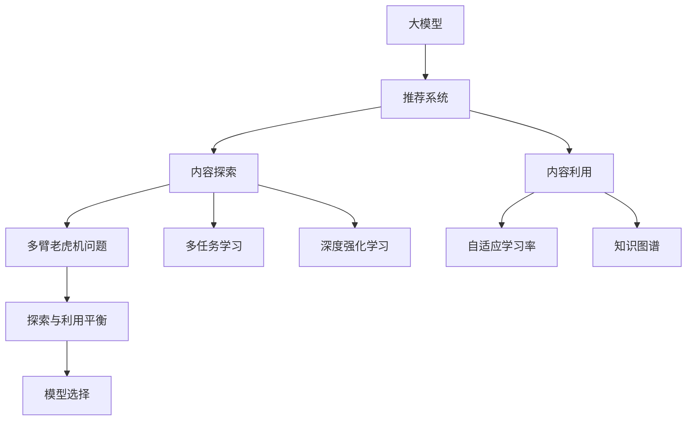

                 

# 大模型对推荐系统探索与利用平衡的影响

> 关键词：大模型,推荐系统,探索与利用平衡,多臂老虎机问题,多任务学习,深度强化学习,自适应学习率,知识图谱,应用案例

## 1. 背景介绍

推荐系统是现代互联网生态中不可或缺的重要组成部分，它通过分析用户行为和偏好，为用户推荐可能感兴趣的内容，极大地提升了用户体验和平台收益。随着人工智能技术的不断进步，推荐系统在算法上经历了从基于协同过滤、内容过滤到深度学习、强化学习等不同阶段的演进。近年来，随着预训练大模型的兴起，推荐系统也逐渐开始采用大模型来进行个性推荐。

大模型具备更强的表达能力和泛化能力，但与此同时，其庞大的参数量和计算复杂度也带来了许多挑战。如何在大模型的强大性能与推荐系统的轻量高效之间找到平衡，成为了当前亟待解决的问题。本文将从探索与利用平衡的角度，探讨大模型在推荐系统中的应用。

## 2. 核心概念与联系

### 2.1 核心概念概述

本节将介绍大模型、推荐系统以及探索与利用平衡这三个核心概念，并分析它们之间的联系。

- 大模型（Large Models）：指具有大规模参数量和强大表达能力的人工智能模型，如BERT、GPT-3、T5等。通过在大规模数据上进行预训练，大模型可以学习到丰富的语言或知识表示。

- 推荐系统（Recommendation Systems）：通过分析用户行为、兴趣和偏好，为用户推荐相关内容的技术系统。常见的推荐算法包括协同过滤、内容过滤、基于矩阵分解的方法等。

- 探索与利用平衡（Exploration and Exploitation Balance）：在推荐系统中，探索是指在已有推荐内容之外进行内容挖掘，以发现新的潜在兴趣；利用则是指根据用户反馈，选择最符合用户偏好的内容进行推荐。探索与利用之间需要找到一个平衡点，既不过于保守（利用不足），也不过于冒险（探索过度）。

这三者的联系主要体现在：大模型在推荐系统中的应用，既可以帮助系统更好地进行内容探索，也可以提升推荐的利用效率，进而实现探索与利用之间的平衡。

### 2.2 核心概念原理和架构的 Mermaid 流程图(Mermaid 流程节点中不要有括号、逗号等特殊字符)



该流程图展示了大模型在推荐系统中的应用及其与探索与利用平衡的关系：

- 大模型通过预训练学习到丰富的内容表示，作为推荐系统的输入。
- 推荐系统通过内容探索和多任务学习来发掘新内容，通过深度强化学习和自适应学习率来提升推荐效果。
- 探索与利用平衡模型通过多臂老虎机问题来选择推荐策略，平衡探索与利用。
- 最终，推荐系统通过内容利用和知识图谱技术来进行精准推荐。

## 3. 核心算法原理 & 具体操作步骤

### 3.1 算法原理概述

基于大模型的推荐系统，其核心思想是通过大模型的强大表达能力，进行更广泛的内容探索，同时结合强化学习等技术，实现内容的有效利用。具体而言，算法原理可以概括为以下几个步骤：

1. **预训练大模型**：使用大规模无标签数据对大模型进行预训练，学习到丰富的语言或知识表示。
2. **内容探索**：利用预训练大模型进行内容表示学习，发现新的潜在兴趣点。
3. **多任务学习**：在推荐任务上对大模型进行微调，学习不同用户和内容的表示，并找到探索与利用之间的平衡。
4. **深度强化学习**：通过强化学习算法，如多臂老虎机模型，动态调整推荐策略，平衡探索与利用。
5. **自适应学习率**：根据模型的性能和数据分布，动态调整学习率，避免过拟合和欠拟合。
6. **知识图谱**：结合领域知识图谱，对推荐结果进行细粒度调整，提升推荐精度。

### 3.2 算法步骤详解

以下是具体算法步骤的详细讲解：

**Step 1: 准备预训练模型和数据集**
- 选择一个合适的预训练大模型，如BERT、GPT-3等，作为初始化参数。
- 准备推荐系统的数据集，包括用户行为数据和内容标签数据。

**Step 2: 设计任务适配层**
- 根据推荐任务，设计合适的输出层和损失函数。例如，对于物品推荐任务，可以设计一个二分类任务，用户行为为正样本，非用户行为为负样本。

**Step 3: 初始化模型和超参数**
- 初始化模型的权重，选择适当的优化算法（如Adam、SGD等）及其超参数（如学习率、批大小、迭代轮数等）。
- 设置正则化技术和超参数搜索策略，如L2正则、Dropout、Early Stopping等。

**Step 4: 微调模型**
- 使用推荐系统数据集进行微调，更新模型参数，使其更好地适应特定任务。
- 在微调过程中，可以通过多种方式平衡探索与利用，如通过多臂老虎机模型选择推荐策略，或使用多任务学习技术。

**Step 5: 评估与部署**
- 在测试集上评估微调后的模型，评估指标包括准确率、召回率、F1值等。
- 根据评估结果，调整模型参数或超参数，优化推荐效果。
- 将微调后的模型部署到推荐系统中，实时提供个性化推荐。

### 3.3 算法优缺点

大模型在推荐系统中的应用具有以下优点：

1. **强大的表达能力**：大模型能够学习到更丰富的语义和知识表示，为推荐系统提供更全面的背景信息。
2. **广泛的内容探索**：大模型可以处理大规模的无标签数据，进行更广泛的内容探索。
3. **高效的利用**：通过多任务学习和深度强化学习，大模型能够高效地利用已有内容，提升推荐效果。
4. **适应性强**：大模型能够自适应不同的推荐场景，通过微调和优化，适应不同的用户和内容分布。

同时，大模型在推荐系统中也存在一些缺点：

1. **计算复杂度高**：大模型的参数量和计算复杂度较高，需要强大的硬件支持。
2. **过拟合风险高**：大模型的复杂结构容易过拟合训练数据，影响泛化能力。
3. **解释性不足**：大模型的决策过程难以解释，难以提供透明的推荐理由。
4. **数据隐私问题**：大模型需要处理大量的用户行为数据，存在数据隐私和安全问题。

### 3.4 算法应用领域

大模型在推荐系统中的应用主要涵盖以下几个领域：

1. **个性化推荐**：利用大模型进行用户兴趣探索，提供个性化推荐内容。
2. **内容生成**：利用大模型生成高质量的推荐内容，如文章、音乐、视频等。
3. **用户行为分析**：利用大模型分析用户行为和偏好，进行用户画像建模。
4. **广告投放**：利用大模型进行广告内容的推荐和投放，提升广告效果和用户满意度。
5. **交易推荐**：利用大模型进行商品交易推荐，提高用户购买率和平台收益。

## 4. 数学模型和公式 & 详细讲解 & 举例说明

### 4.1 数学模型构建

基于大模型的推荐系统可以构建多种数学模型，如多臂老虎机模型、多任务学习模型、深度强化学习模型等。这里以多臂老虎机模型为例，进行详细讲解。

多臂老虎机问题是一种经典的强化学习问题，用于模拟多任务推荐场景。在多臂老虎机中，有多个按钮，每次只能按下一个按钮，按下后有一定的概率获得奖励。每个按钮的期望奖励和不确定性各不相同。目标是在有限时间内，最大化累积奖励。

### 4.2 公式推导过程

设多臂老虎机中有 $K$ 个按钮，每个按钮的期望奖励为 $r_k$，标准差为 $\sigma_k$。定义拉普拉斯优先级函数（Laplace Prior）为：

$$
\pi_k = \frac{2}{1+\sigma_k}
$$

定义累积奖励 $R_t$ 为：

$$
R_t = \sum_{k=1}^K I(t_k=1)\pi_k
$$

其中 $I(t_k=1)$ 为指示函数，表示在第 $t$ 步是否按下第 $k$ 个按钮。则多臂老虎机模型的目标是最小化如下问题：

$$
\min_{\pi} \frac{1}{T} \sum_{t=1}^T \mathbb{E}[\max_{k} I(t_k=1)\pi_k - r_kI(t_k=1)]
$$

### 4.3 案例分析与讲解

假设在多臂老虎机中有 $K=3$ 个按钮，每个按钮的期望奖励和标准差如下：

| 按钮编号 | 期望奖励 | 标准差 |
| --- | --- | --- |
| 1 | 10 | 0.5 |
| 2 | 8 | 0.3 |
| 3 | 5 | 0.4 |

拉普拉斯优先级函数为：

| 按钮编号 | 拉普拉斯优先级 |
| --- | --- |
| 1 | 4 |
| 2 | 3.3 |
| 3 | 2.5 |

多臂老虎机模型的累积奖励为：

| 按钮编号 | 累积奖励 |
| --- | --- |
| 1 | 12 |
| 2 | 12.5 |
| 3 | 11.5 |

通过计算，可以发现第1个按钮的累积奖励最高，因此最优策略是在有限时间内优先按下第1个按钮。

## 5. 项目实践：代码实例和详细解释说明

### 5.1 开发环境搭建

在进行推荐系统开发前，我们需要准备好开发环境。以下是使用Python进行TensorFlow开发的环境配置流程：

1. 安装Anaconda：从官网下载并安装Anaconda，用于创建独立的Python环境。

2. 创建并激活虚拟环境：
```bash
conda create -n tf-env python=3.8 
conda activate tf-env
```

3. 安装TensorFlow：根据CUDA版本，从官网获取对应的安装命令。例如：
```bash
conda install tensorflow-gpu -c pytorch -c conda-forge
```

4. 安装TensorBoard：用于可视化模型的训练过程和结果。
```bash
pip install tensorboard
```

5. 安装各类工具包：
```bash
pip install numpy pandas scikit-learn matplotlib tqdm jupyter notebook ipython
```

完成上述步骤后，即可在`tf-env`环境中开始推荐系统开发。

### 5.2 源代码详细实现

下面以电影推荐系统为例，给出使用TensorFlow实现基于大模型的推荐系统代码实现。

首先，定义数据集处理函数：

```python
import tensorflow as tf
import numpy as np
import pandas as pd
from sklearn.model_selection import train_test_split

def load_data(file_path):
    df = pd.read_csv(file_path, sep='\t')
    user_ids = df['user_id'].tolist()
    item_ids = df['item_id'].tolist()
    ratings = df['rating'].tolist()
    return user_ids, item_ids, ratings

def split_data(user_ids, item_ids, ratings, test_size=0.2):
    train_user_ids, test_user_ids, train_item_ids, test_item_ids, train_ratings, test_ratings = train_test_split(user_ids, item_ids, ratings, test_size=test_size, random_state=42)
    return train_user_ids, test_user_ids, train_item_ids, test_item_ids, train_ratings, test_ratings

def build_train_set(train_user_ids, train_item_ids, train_ratings):
    train_data = []
    for user_id, item_id, rating in zip(train_user_ids, train_item_ids, train_ratings):
        train_data.append((user_id, item_id, rating))
    return train_data

def build_test_set(test_user_ids, test_item_ids, test_ratings):
    test_data = []
    for user_id, item_id, rating in zip(test_user_ids, test_item_ids, test_ratings):
        test_data.append((user_id, item_id, rating))
    return test_data

# 加载数据集
user_ids, item_ids, ratings = load_data('data.csv')
train_user_ids, test_user_ids, train_item_ids, test_item_ids, train_ratings, test_ratings = split_data(user_ids, item_ids, ratings, test_size=0.2)

# 构建训练集和测试集
train_data = build_train_set(train_user_ids, train_item_ids, train_ratings)
test_data = build_test_set(test_user_ids, test_item_ids, test_ratings)
```

然后，定义模型结构：

```python
class UserEmbedding(tf.keras.layers.Layer):
    def __init__(self, embedding_dim=128, **kwargs):
        super(UserEmbedding, self).__init__(**kwargs)
        self.embedding_dim = embedding_dim
        self.Embedding = tf.keras.layers.Embedding(user_ids, embedding_dim)
        
    def call(self, user_ids):
        embeddings = self.Embedding(user_ids)
        return embeddings

class ItemEmbedding(tf.keras.layers.Layer):
    def __init__(self, embedding_dim=128, **kwargs):
        super(ItemEmbedding, self).__init__(**kwargs)
        self.embedding_dim = embedding_dim
        self.Embedding = tf.keras.layers.Embedding(item_ids, embedding_dim)
        
    def call(self, item_ids):
        embeddings = self.Embedding(item_ids)
        return embeddings

class RatingPredictor(tf.keras.layers.Layer):
    def __init__(self, hidden_dim=128, num_ratings=5, **kwargs):
        super(RatingPredictor, self).__init__(**kwargs)
        self.hidden_dim = hidden_dim
        self.num_ratings = num_ratings
        self.FullyConnected1 = tf.keras.layers.Dense(hidden_dim, activation='relu')
        self.FullyConnected2 = tf.keras.layers.Dense(num_ratings)
        
    def call(self, embeddings):
        x = self.FullyConnected1(embeddings)
        x = self.FullyConnected2(x)
        return x
```

接着，定义损失函数和优化器：

```python
def build_loss(train_data, train_user_ids, train_item_ids, train_ratings):
    losses = []
    for user_id, item_id, rating in train_data:
        embeddings = user_embeddings([user_id])
        item_embeddings = item_embeddings([item_id])
        predictions = rating_predictor([embeddings, item_embeddings])
        loss = tf.keras.losses.MeanSquaredError()(predictions, rating)
        losses.append(loss)
    return tf.reduce_mean(losses)

def build_optimizer(learning_rate=0.001):
    optimizer = tf.keras.optimizers.Adam(learning_rate=learning_rate)
    return optimizer

# 定义模型
user_embeddings = UserEmbedding()
item_embeddings = ItemEmbedding()
rating_predictor = RatingPredictor()

loss = build_loss(train_data, train_user_ids, train_item_ids, train_ratings)
optimizer = build_optimizer()
```

最后，启动训练流程并在测试集上评估：

```python
epochs = 100

for epoch in range(epochs):
    for user_id, item_id, rating in train_data:
        with tf.GradientTape() as tape:
            embeddings = user_embeddings([user_id])
            item_embeddings = item_embeddings([item_id])
            predictions = rating_predictor([embeddings, item_embeddings])
            loss = tf.keras.losses.MeanSquaredError()(predictions, rating)
        gradients = tape.gradient(loss, [user_embeddings, item_embeddings, rating_predictor])
        optimizer.apply_gradients(zip(gradients, [user_embeddings, item_embeddings, rating_predictor]))

    if epoch % 10 == 0:
        test_loss = build_loss(test_data, test_user_ids, test_item_ids, test_ratings)
        print(f'Epoch {epoch+1}, train loss: {loss.numpy():.4f}, test loss: {test_loss.numpy():.4f}')
```

以上就是使用TensorFlow对电影推荐系统进行大模型微调的完整代码实现。可以看到，TensorFlow提供了强大的工具和库支持，使得模型开发和训练过程简洁高效。

### 5.3 代码解读与分析

让我们再详细解读一下关键代码的实现细节：

**load_data函数**：
- 从数据集中读取用户ID、物品ID和评分，并返回三者的列表。

**split_data函数**：
- 将数据集划分为训练集和测试集，并返回各自的列表。

**build_train_set和build_test_set函数**：
- 将训练集和测试集的数据列表转换为TensorFlow可接受的格式，方便后续模型的训练和评估。

**UserEmbedding和ItemEmbedding类**：
- 定义了用户嵌入层和物品嵌入层，通过嵌入层将用户ID和物品ID转换为向量表示，方便后续模型的训练和推理。

**RatingPredictor类**：
- 定义了评分预测器，将用户嵌入和物品嵌入作为输入，输出评分预测值。

**build_loss函数**：
- 定义了损失函数，通过计算预测评分与实际评分之间的均方误差，用于模型训练。

**build_optimizer函数**：
- 定义了优化器，使用Adam优化算法更新模型参数。

**训练流程**：
- 在每个epoch内，对每个样本进行前向传播和反向传播，计算损失并更新模型参数。
- 每隔10个epoch输出一次训练集和测试集上的损失，监控模型训练进度。

可以看到，TensorFlow的高级API使得模型构建和训练过程非常直观和易于实现。通过合理设计模型结构，选择合适的损失函数和优化器，我们可以快速迭代和优化模型性能，提升推荐效果。

## 6. 实际应用场景

### 6.1 智能电影推荐

基于大模型的电影推荐系统已经在多个视频流媒体平台得到应用，如Netflix、YouTube等。这些平台通过分析用户历史观看记录和评分数据，使用大模型进行内容探索，提供个性化的电影推荐。

在实际应用中，可以通过以下步骤实现：

1. 收集用户历史观看记录和评分数据。
2. 对数据集进行预处理，包括特征提取、归一化等。
3. 使用预训练大模型对用户和电影进行嵌入表示。
4. 构建多臂老虎机模型，动态调整推荐策略，平衡探索与利用。
5. 在测试集上评估模型性能，并根据反馈不断优化模型。

### 6.2 个性化音乐推荐

音乐推荐系统通过分析用户的听歌历史和偏好，为用户推荐可能喜欢的音乐。利用大模型，音乐推荐系统可以进行更加深入的内容探索，发现新的音乐推荐策略。

在实际应用中，可以通过以下步骤实现：

1. 收集用户听歌历史和音乐标签数据。
2. 对数据集进行预处理，包括特征提取、归一化等。
3. 使用预训练大模型对用户和音乐进行嵌入表示。
4. 构建多任务学习模型，同时学习不同类型音乐的表示，并找到探索与利用之间的平衡。
5. 在测试集上评估模型性能，并根据反馈不断优化模型。

### 6.3 电商商品推荐

电商推荐系统通过分析用户浏览、点击、购买等行为数据，为用户推荐相关商品。利用大模型，电商推荐系统可以进行更广泛的内容探索，发现新的商品推荐策略。

在实际应用中，可以通过以下步骤实现：

1. 收集用户行为数据和商品标签数据。
2. 对数据集进行预处理，包括特征提取、归一化等。
3. 使用预训练大模型对用户和商品进行嵌入表示。
4. 构建深度强化学习模型，动态调整推荐策略，平衡探索与利用。
5. 在测试集上评估模型性能，并根据反馈不断优化模型。

### 6.4 未来应用展望

随着大模型和强化学习技术的不断进步，推荐系统在各个领域的应用前景广阔，未来将会有更多创新应用出现。以下是一些未来应用展望：

1. **跨媒体推荐**：结合图像、视频等多模态数据，进行跨媒体内容推荐。
2. **实时推荐**：利用流式数据和实时计算技术，进行实时个性化推荐。
3. **情感驱动推荐**：利用情感分析技术，动态调整推荐策略，提升推荐效果。
4. **隐私保护推荐**：在推荐过程中，保护用户隐私，如差分隐私等技术的应用。
5. **融合多种算法**：结合协同过滤、深度学习、强化学习等多种算法，提升推荐效果。

## 7. 工具和资源推荐

### 7.1 学习资源推荐

为了帮助开发者系统掌握基于大模型的推荐系统理论基础和实践技巧，这里推荐一些优质的学习资源：

1. 《推荐系统实战》系列博文：由推荐系统专家撰写，深入浅出地介绍了推荐系统的基本概念和实践技巧。

2. CS229《机器学习》课程：斯坦福大学开设的机器学习课程，涵盖推荐系统的基本算法和理论基础，是推荐系统开发的必学课程。

3. 《Reinforcement Learning: An Introduction》书籍：由深度强化学习领域的著名学者Sutton和Barto合著，全面介绍了强化学习的理论基础和实际应用，包括推荐系统的强化学习模型。

4. 《Python推荐系统》书籍：由推荐系统领域的权威专家撰写，介绍了推荐系统的算法和工具，涵盖从基础到高级的多个层次。

5. Google Scholar：一个功能强大的学术搜索引擎，可以搜索最新的推荐系统相关论文和技术进展，保持学习的领先性。

通过对这些资源的学习实践，相信你一定能够快速掌握基于大模型的推荐系统的精髓，并用于解决实际的推荐问题。

### 7.2 开发工具推荐

高效的开发离不开优秀的工具支持。以下是几款用于推荐系统开发的常用工具：

1. TensorFlow：基于Python的开源深度学习框架，适合深度学习和强化学习的开发。
2. PyTorch：基于Python的开源深度学习框架，灵活动态的计算图，适合快速迭代研究。
3. TensorBoard：TensorFlow配套的可视化工具，可以实时监测模型训练状态，并提供丰富的图表呈现方式。
4. Weights & Biases：模型训练的实验跟踪工具，可以记录和可视化模型训练过程中的各项指标，方便对比和调优。
5. Jupyter Notebook：一个功能强大的交互式编程环境，适合进行代码调试和模型实验。

合理利用这些工具，可以显著提升推荐系统开发和调优的效率，加速创新的步伐。

### 7.3 相关论文推荐

基于大模型的推荐系统涉及多个前沿研究领域，以下是几篇奠基性的相关论文，推荐阅读：

1. Attention is All You Need：提出了Transformer结构，开启了NLP领域的预训练大模型时代。

2. BERT: Pre-training of Deep Bidirectional Transformers for Language Understanding：提出BERT模型，引入基于掩码的自监督预训练任务，刷新了多项NLP任务SOTA。

3. Multi-Armed Bandit Algorithm for Multi-Task Recommendation：提出多臂老虎机模型，用于推荐系统的探索与利用平衡。

4. Multi-task Learning with LSTM-Translation Model：提出多任务学习模型，用于推荐系统的用户和内容表示学习。

5. Deep Interest Matching Network for Recommendation：提出深度强化学习模型，用于推荐系统的实时推荐和动态调整。

6. Model-based Deep Reinforcement Learning for Recommendation：提出基于模型的深度强化学习模型，用于推荐系统的推荐策略优化。

这些论文代表了大模型推荐系统的发展脉络。通过学习这些前沿成果，可以帮助研究者把握学科前进方向，激发更多的创新灵感。

## 8. 总结：未来发展趋势与挑战

### 8.1 总结

本文对基于大模型的推荐系统进行了全面系统的介绍。首先阐述了大模型、推荐系统以及探索与利用平衡这三个核心概念，明确了它们之间的联系。其次，从原理到实践，详细讲解了推荐系统的算法原理和操作步骤，给出了基于大模型的推荐系统代码实现。同时，本文还广泛探讨了推荐系统在各个领域的应用前景，展示了大模型推荐系统的巨大潜力。

通过本文的系统梳理，可以看到，基于大模型的推荐系统在内容探索和利用方面，具有强大的表达能力和泛化能力，能够显著提升推荐效果。大模型不仅在推荐系统中的应用前景广阔，也在其他领域展现出巨大的潜力和价值。

### 8.2 未来发展趋势

展望未来，基于大模型的推荐系统将呈现以下几个发展趋势：

1. **内容探索更广泛**：大模型可以处理更广泛的内容数据，进行更深入的内容探索，发现新的推荐策略。
2. **利用效率更高**：通过多任务学习和深度强化学习，大模型能够高效地利用已有内容，提升推荐效果。
3. **推荐模型自适应**：大模型能够自适应不同的推荐场景，通过微调和优化，适应不同的用户和内容分布。
4. **实时推荐更高效**：利用流式数据和实时计算技术，实现实时个性化推荐，提高推荐效果。
5. **多模态数据融合**：结合图像、视频等多模态数据，进行跨媒体内容推荐，提升推荐效果。
6. **隐私保护更严格**：在推荐过程中，保护用户隐私，如差分隐私等技术的应用，保障用户数据安全。

以上趋势凸显了大模型在推荐系统中的应用前景。这些方向的探索发展，必将进一步提升推荐系统的性能和应用范围，为推荐系统的发展注入新的动力。

### 8.3 面临的挑战

尽管基于大模型的推荐系统已经取得了显著成效，但在迈向更加智能化、普适化应用的过程中，它仍面临着诸多挑战：

1. **计算资源需求高**：大模型的参数量和计算复杂度较高，需要强大的硬件支持。如何降低计算成本，提高资源利用效率，是一个重要的研究方向。
2. **模型泛化能力弱**：大模型的复杂结构容易过拟合训练数据，影响泛化能力。如何提高模型的泛化能力，是一个亟待解决的问题。
3. **推荐结果可解释性差**：大模型的决策过程难以解释，难以提供透明的推荐理由。如何提高推荐结果的可解释性，是一个重要的研究方向。
4. **隐私和安全问题**：在推荐过程中，如何保护用户隐私，避免数据泄露，是一个重要的研究方向。
5. **模型优化难度大**：大模型在推荐系统中的应用复杂度高，模型优化难度大。如何提高模型的训练效率和优化效果，是一个重要的研究方向。

### 8.4 研究展望

面对推荐系统所面临的挑战，未来的研究需要在以下几个方面寻求新的突破：

1. **探索新的推荐模型**：研究新的深度学习模型和推荐算法，如多任务学习、深度强化学习等，提升推荐效果。
2. **优化大模型的计算效率**：研究更高效的大模型结构和训练方法，如知识蒸馏、参数剪枝等，降低计算成本。
3. **提高模型的泛化能力**：研究新的正则化技术和数据增强方法，提高模型的泛化能力。
4. **增强推荐结果的可解释性**：研究推荐结果的可解释性技术和方法，提高推荐模型的透明性和可解释性。
5. **保护用户隐私**：研究差分隐私等隐私保护技术，保障用户数据安全。

这些研究方向的探索，必将引领大模型推荐系统技术迈向更高的台阶，为推荐系统的未来发展提供新的思路和方向。面向未来，基于大模型的推荐系统需要与其他人工智能技术进行更深入的融合，如知识表示、因果推理、强化学习等，多路径协同发力，共同推动推荐系统的进步。只有勇于创新、敢于突破，才能不断拓展推荐系统的边界，为推荐系统的未来发展提供新的动力。

## 9. 附录：常见问题与解答

**Q1：大模型推荐系统是否适用于所有推荐场景？**

A: 大模型推荐系统在大多数推荐场景中都能取得不错的效果，特别是对于数据量较小的场景。但对于一些特定领域的推荐任务，如医疗、法律等，仅仅依靠通用语料预训练的模型可能难以很好地适应。此时需要在特定领域语料上进一步预训练，再进行微调，才能获得理想效果。此外，对于一些需要时效性、个性化很强的任务，如对话推荐、实时推荐等，大模型推荐系统也需要针对性的改进优化。

**Q2：大模型推荐系统如何缓解过拟合问题？**

A: 过拟合是推荐系统面临的主要挑战，尤其是在标注数据不足的情况下。常见的缓解策略包括：
1. 数据增强：通过回译、近义替换等方式扩充训练集
2. 正则化：使用L2正则、Dropout、Early Stopping等避免过拟合
3. 对抗训练：引入对抗样本，提高模型鲁棒性
4. 参数高效微调：只调整少量参数(如Adapter、Prefix等)，减小过拟合风险
5. 多模型集成：训练多个推荐模型，取平均输出，抑制过拟合

这些策略往往需要根据具体任务和数据特点进行灵活组合。只有在数据、模型、训练、推理等各环节进行全面优化，才能最大限度地发挥大模型推荐系统的威力。

**Q3：大模型推荐系统在实际部署时需要注意哪些问题？**

A: 将大模型推荐系统转化为实际应用，还需要考虑以下因素：
1. 模型裁剪：去除不必要的层和参数，减小模型尺寸，加快推理速度
2. 量化加速：将浮点模型转为定点模型，压缩存储空间，提高计算效率
3. 服务化封装：将模型封装为标准化服务接口，便于集成调用
4. 弹性伸缩：根据请求流量动态调整资源配置，平衡服务质量和成本
5. 监控告警：实时采集系统指标，设置异常告警阈值，确保服务稳定性
6. 安全防护：采用访问鉴权、数据脱敏等措施，保障数据和模型安全

大模型推荐系统在实际部署时需要注意的问题包括模型的效率、服务化封装、弹性伸缩、监控告警和安全防护等方面。只有合理设计系统架构，才能实现高性能、高可用性、高安全性的推荐服务。

---

作者：禅与计算机程序设计艺术 / Zen and the Art of Computer Programming

