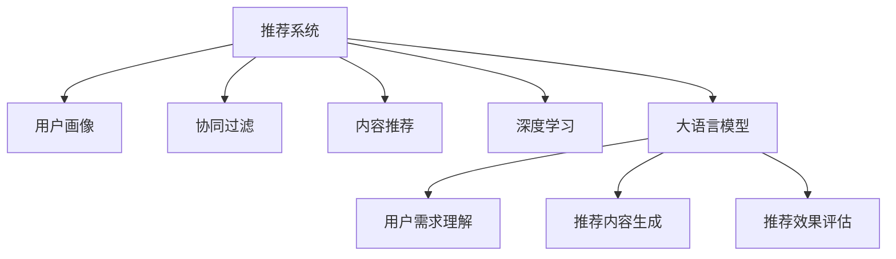

                 

# 大模型对推荐系统用户体验的质量提升

> 关键词：推荐系统,用户体验,大语言模型,用户画像,协同过滤,内容推荐,深度学习

## 1. 背景介绍

### 1.1 问题由来
推荐系统（Recommendation Systems）作为现代互联网的核心应用之一，通过分析用户行为数据，向用户推荐个性化的产品或服务。传统的推荐系统主要依赖协同过滤（Collaborative Filtering, CF）、内容推荐（Content-based Filtering, CB）等方法，但由于数据稀疏性、新用户冷启动等问题，其推荐效果往往不够理想。

近年来，随着深度学习技术的快速发展，尤其是大语言模型（Large Language Model, LLM）在自然语言处理（Natural Language Processing, NLP）领域的突破，大语言模型被引入推荐系统中，用于提取用户画像、生成推荐内容、理解用户需求等方面，带来了显著的用户体验提升。

### 1.2 问题核心关键点
大语言模型在推荐系统中的应用主要体现在以下几个方面：

- **用户画像生成**：利用大语言模型对用户行为数据进行建模，生成用户画像，使得推荐系统能够更好地理解用户需求。
- **推荐内容生成**：使用大语言模型生成推荐内容，如商品描述、新闻摘要等，提高推荐的相关性和多样性。
- **用户需求理解**：通过对话系统、文本生成等技术，收集用户反馈，调整推荐策略。
- **推荐效果评估**：利用大语言模型对推荐结果进行自动化的质量评估，提升推荐系统的精准度。

本文章将围绕这些核心点，深入探讨大语言模型在推荐系统中的实现方法和效果评估。

## 2. 核心概念与联系

### 2.1 核心概念概述

为更好地理解大语言模型在推荐系统中的应用，本节将介绍几个密切相关的核心概念：

- **推荐系统**：根据用户的行为数据和兴趣偏好，向用户推荐个性化产品或服务的系统。
- **用户画像**：通过分析用户的行为数据、社交网络、兴趣标签等，生成用户的多维特征表示。
- **协同过滤**：利用用户与物品的协同行为数据，进行推荐预测，包括基于用户的协同过滤和基于物品的协同过滤。
- **内容推荐**：根据物品的属性特征，如文本描述、图片标签等，进行推荐预测。
- **深度学习**：基于多层神经网络模型，对用户行为数据和物品特征进行深度学习，提高推荐系统的精度。
- **大语言模型**：以自回归（如GPT）或自编码（如BERT）模型为代表的大规模预训练语言模型，具备强大的语言理解和生成能力。

这些概念之间的逻辑关系可以通过以下Mermaid流程图来展示：



这个流程图展示了大语言模型在推荐系统中的应用框架：

1. 推荐系统通过用户画像、协同过滤、内容推荐等技术，向用户推荐物品。
2. 用户画像生成中，大语言模型可以提取用户行为数据中的语义信息。
3. 推荐内容生成中，大语言模型能够生成高质量的推荐文本。
4. 用户需求理解中，大语言模型可以通过对话生成、文本生成等技术，收集用户反馈。
5. 推荐效果评估中，大语言模型可以对推荐结果进行质量评估，反馈到推荐算法中。

这些核心概念共同构成了推荐系统的技术框架，使得推荐系统能够更准确、更个性化地为用户服务。

## 3. 核心算法原理 & 具体操作步骤
### 3.1 算法原理概述

大语言模型在推荐系统中的应用，主要通过以下三个步骤实现：

**Step 1: 用户画像生成**
- 收集用户的行为数据，如浏览记录、购买历史、搜索记录等。
- 对用户的行为数据进行文本化处理，如将浏览记录转换为浏览摘要。
- 利用大语言模型对文本化的行为数据进行预训练，生成用户画像。

**Step 2: 推荐内容生成**
- 分析用户画像中的语义信息，提取用户的兴趣偏好。
- 利用大语言模型生成推荐内容的文本描述，如商品描述、新闻摘要等。
- 将生成的推荐内容进行编码，嵌入推荐系统中。

**Step 3: 推荐效果评估**
- 利用大语言模型对推荐结果进行质量评估，如使用BLEU、ROUGE等指标。
- 根据评估结果，调整推荐算法，优化推荐效果。

### 3.2 算法步骤详解

以商品推荐为例，下面我们详细介绍大语言模型在推荐系统中的具体应用步骤：

**Step 1: 用户画像生成**

1. **数据收集**：从电商平台上收集用户的行为数据，包括浏览记录、购买历史、搜索记录等。

2. **数据预处理**：对用户行为数据进行清洗、去重、归一化等处理，得到干净的行为数据集。

3. **行为数据文本化**：将行为数据转换为文本格式，如将浏览记录转换为“商品名称：浏览次数”的格式。

4. **预训练大语言模型**：选择一个大规模预训练语言模型，如GPT-3、BERT等，将其应用于行为数据文本化的结果上，生成用户画像。

**Step 2: 推荐内容生成**

1. **用户画像语义提取**：对生成的用户画像进行语义分析，提取用户的兴趣偏好。

2. **推荐内容生成**：使用大语言模型生成推荐内容的文本描述，如商品描述、新闻摘要等。具体而言，可以按照以下步骤操作：
   - **设置提示模板**：设计一个提示模板，如“推荐商品：《商品名称》”。
   - **输入提示模板**：将提示模板作为输入，输入到预训练大语言模型中。
   - **生成推荐内容**：预训练大语言模型根据输入的文本和用户画像，生成推荐内容。
   - **输出推荐结果**：将生成的推荐内容返回给推荐系统，作为推荐结果。

**Step 3: 推荐效果评估**

1. **自动质量评估**：利用大语言模型对推荐结果进行自动化的质量评估，如使用BLEU、ROUGE等指标。
2. **人工评估**：将自动评估结果提供给人工专家进行审核，调整推荐算法。
3. **反馈优化**：根据评估结果，调整推荐算法，优化推荐效果。

### 3.3 算法优缺点

大语言模型在推荐系统中的应用，具有以下优点：

1. **多维度信息融合**：大语言模型可以同时融合行为数据、语义信息等多维度数据，生成更加准确的推荐内容。
2. **动态调整**：大语言模型可以根据用户反馈，动态调整推荐策略，提高推荐系统的灵活性。
3. **个性化推荐**：大语言模型能够生成个性化的推荐内容，提升用户体验。
4. **推荐效果评估**：大语言模型可以对推荐结果进行自动化评估，提供客观的量化指标。

但同时也存在以下缺点：

1. **计算资源消耗大**：预训练大语言模型的参数量通常以亿计，对计算资源和内存资源的需求较高。
2. **训练数据需求高**：大语言模型的预训练需要大规模的语料库，而推荐系统的行为数据往往不充分。
3. **效果依赖于模型**：大语言模型的推荐效果很大程度上依赖于预训练模型和训练数据的质量。

### 3.4 算法应用领域

大语言模型在推荐系统中的应用，已经涵盖了电商、社交、新闻、音乐等多个领域，具体应用包括：

- **电商推荐**：利用大语言模型生成商品描述，提升推荐的相关性和多样性。
- **社交推荐**：根据用户的行为数据，生成用户的兴趣标签，推荐好友、内容等。
- **新闻推荐**：使用大语言模型生成新闻摘要，提高推荐内容的质量。
- **音乐推荐**：根据用户的听歌历史，生成个性化的音乐推荐。

除了上述这些经典应用外，大语言模型还被创新性地应用于个性化推荐系统的开发，如用户画像生成、推荐内容生成、推荐效果评估等，为推荐系统带来了新的突破。

## 4. 数学模型和公式 & 详细讲解 & 举例说明

### 4.1 数学模型构建

在本节中，我们将使用数学语言对大语言模型在推荐系统中的应用进行更加严格的刻画。

设推荐系统的行为数据为 $D=\{(x_i,y_i)\}_{i=1}^N$，其中 $x_i$ 为行为数据，$y_i$ 为推荐结果标签。假设大语言模型为 $M_{\theta}$，其中 $\theta$ 为模型参数。

定义推荐系统的损失函数为 $\ell(M_{\theta},D)$，用于衡量模型在数据集上的预测误差。在推荐系统中，常用的损失函数包括均方误差（Mean Squared Error, MSE）、交叉熵损失（Cross-Entropy Loss, CE）等。

**均方误差（MSE）损失函数**：
$$
\ell(M_{\theta},D)=\frac{1}{N}\sum_{i=1}^N(y_i-M_{\theta}(x_i))^2
$$

**交叉熵损失函数**：
$$
\ell(M_{\theta},D)=-\frac{1}{N}\sum_{i=1}^N[y_i\log M_{\theta}(x_i)+(1-y_i)\log(1-M_{\theta}(x_i))]
$$

在得到损失函数后，利用梯度下降等优化算法进行模型训练，最小化损失函数：
$$
\theta \leftarrow \theta - \eta\nabla_{\theta}\ell(M_{\theta},D)
$$

其中 $\eta$ 为学习率。

### 4.2 公式推导过程

以用户画像生成为例，下面我们将详细推导大语言模型在该场景下的应用。

**Step 1: 用户画像生成**

假设行为数据 $x_i$ 为一段文本描述，使用大语言模型 $M_{\theta}$ 对其进行预训练，生成用户画像 $h_{\theta}(x_i)$。

假设用户画像 $h_{\theta}(x_i)$ 为低维向量，即 $h_{\theta}(x_i) \in \mathbb{R}^d$，其中 $d$ 为向量维度。

**Step 2: 推荐内容生成**

假设用户画像 $h_{\theta}(x_i)$ 包含用户的兴趣偏好，使用大语言模型生成推荐内容 $t_{\theta}(x_i)$。

假设推荐内容 $t_{\theta}(x_i)$ 为一段文本描述，即 $t_{\theta}(x_i) \in \mathbb{R}^m$，其中 $m$ 为文本长度。

**Step 3: 推荐效果评估**

使用BLEU、ROUGE等指标，对推荐内容 $t_{\theta}(x_i)$ 进行质量评估。

假设BLEU指标的值为 $B$，则评估结果可以表示为 $B(t_{\theta}(x_i))$。

### 4.3 案例分析与讲解

以电商推荐系统为例，下面我们将具体分析大语言模型在推荐系统中的实际应用。

**数据集**：假设我们有一个电商平台的商品推荐系统，收集到用户的行为数据，包括浏览记录、购买历史、搜索记录等。

**用户画像生成**：
- **数据清洗**：对行为数据进行清洗、去重、归一化等处理，得到干净的行为数据集。
- **行为数据文本化**：将浏览记录转换为“商品名称：浏览次数”的格式，得到文本化的行为数据集。
- **预训练大语言模型**：选择GPT-3作为预训练大语言模型，将其应用于文本化的行为数据集上，生成用户画像。

**推荐内容生成**：
- **用户画像语义提取**：对生成的用户画像进行语义分析，提取用户的兴趣偏好。
- **提示模板设计**：设计一个提示模板，如“推荐商品：《商品名称》”。
- **输入提示模板**：将提示模板作为输入，输入到预训练大语言模型中。
- **生成推荐内容**：预训练大语言模型根据输入的文本和用户画像，生成推荐内容。
- **输出推荐结果**：将生成的推荐内容返回给推荐系统，作为推荐结果。

**推荐效果评估**：
- **自动质量评估**：利用BLEU、ROUGE等指标，对推荐结果进行自动化的质量评估。
- **人工评估**：将自动评估结果提供给人工专家进行审核，调整推荐算法。
- **反馈优化**：根据评估结果，调整推荐算法，优化推荐效果。

通过上述步骤，大语言模型在电商推荐系统中实现了高质量的推荐内容生成，提升了用户体验。

## 5. 项目实践：代码实例和详细解释说明
### 5.1 开发环境搭建

在进行推荐系统开发前，我们需要准备好开发环境。以下是使用Python进行TensorFlow开发的环境配置流程：

1. 安装Anaconda：从官网下载并安装Anaconda，用于创建独立的Python环境。

2. 创建并激活虚拟环境：
```bash
conda create -n tf-env python=3.8 
conda activate tf-env
```

3. 安装TensorFlow：根据CUDA版本，从官网获取对应的安装命令。例如：
```bash
conda install tensorflow tensorflow-gpu -c conda-forge -c pypi
```

4. 安装TensorFlow Addons：
```bash
conda install tensorflow-addons
```

5. 安装各类工具包：
```bash
pip install numpy pandas scikit-learn matplotlib tqdm jupyter notebook ipython
```

完成上述步骤后，即可在`tf-env`环境中开始推荐系统开发。

### 5.2 源代码详细实现

下面我们以电商推荐系统为例，给出使用TensorFlow对GPT模型进行电商推荐内容生成的PyTorch代码实现。

首先，定义推荐系统中的行为数据处理函数：

```python
from tensorflow.keras.preprocessing.text import Tokenizer
from tensorflow.keras.preprocessing.sequence import pad_sequences
import tensorflow as tf
from transformers import TFGPTLMHeadModel

# 定义行为数据和推荐结果的加载函数
def load_data(data_path):
    with open(data_path, 'r') as f:
        data = f.readlines()
    X = [line.split(':')[0] for line in data]
    y = [int(line.split(':')[1]) for line in data]
    return X, y

# 定义行为数据和推荐结果的预处理函数
def preprocess_data(X, y, max_len=128):
    tokenizer = Tokenizer()
    tokenizer.fit_on_texts(X)
    X = tokenizer.texts_to_sequences(X)
    X = pad_sequences(X, maxlen=max_len, padding='post')
    y = tf.keras.utils.to_categorical(y)
    return X, y

# 定义模型训练和评估函数
def train_model(model, X_train, y_train, X_val, y_val, epochs=10, batch_size=32):
    model.compile(optimizer='adam', loss='binary_crossentropy', metrics=['accuracy'])
    model.fit(X_train, y_train, epochs=epochs, batch_size=batch_size, validation_data=(X_val, y_val))
    evaluation = model.evaluate(X_val, y_val, verbose=0)
    return evaluation[1]

# 定义用户画像生成函数
def generate_user_profile(X_train, tokenizer, max_len):
    X_train = X_train.apply(lambda x: [x])
    X_train = tokenizer.texts_to_sequences(X_train)
    X_train = pad_sequences(X_train, maxlen=max_len, padding='post')
    return X_train
```

然后，定义模型和优化器：

```python
from transformers import TFGPTLMHeadModel

# 定义GPT模型
model = TFGPTLMHeadModel.from_pretrained('gpt-3')

# 定义优化器
optimizer = tf.keras.optimizers.Adam(learning_rate=2e-5)
```

接着，定义训练和评估函数：

```python
from tensorflow.keras.layers import Dense, Dropout
from tensorflow.keras.models import Model

# 定义推荐内容生成模型
class RecommendationModel(tf.keras.Model):
    def __init__(self, max_len):
        super(RecommendationModel, self).__init__()
        self.gpt = TFGPTLMHeadModel.from_pretrained('gpt-3')
        self.dense = Dense(1, activation='sigmoid')
        
    def call(self, x):
        x = self.gpt(x)
        x = self.dense(x)
        return x
    
# 定义模型训练和评估函数
def train_model(model, X_train, y_train, X_val, y_val, epochs=10, batch_size=32):
    model.compile(optimizer='adam', loss='binary_crossentropy', metrics=['accuracy'])
    model.fit(X_train, y_train, epochs=epochs, batch_size=batch_size, validation_data=(X_val, y_val))
    evaluation = model.evaluate(X_val, y_val, verbose=0)
    return evaluation[1]

# 定义用户画像生成函数
def generate_user_profile(X_train, tokenizer, max_len):
    X_train = X_train.apply(lambda x: [x])
    X_train = tokenizer.texts_to_sequences(X_train)
    X_train = pad_sequences(X_train, maxlen=max_len, padding='post')
    return X_train
```

最后，启动训练流程并在验证集上评估：

```python
# 加载数据集
X_train, y_train = load_data('train_data.txt')
X_val, y_val = load_data('val_data.txt')

# 预处理数据集
X_train, y_train = preprocess_data(X_train, y_train, max_len=128)
X_val, y_val = preprocess_data(X_val, y_val, max_len=128)

# 构建用户画像
user_profile = generate_user_profile(X_train, tokenizer, max_len=128)

# 训练推荐模型
model = RecommendationModel(max_len=128)
train_result = train_model(model, user_profile, y_train, X_val, y_val, epochs=10, batch_size=32)

# 输出训练结果
print('训练结果：', train_result)
```

以上就是使用TensorFlow对GPT模型进行电商推荐内容生成的完整代码实现。可以看到，得益于TensorFlow的强大封装，我们可以用相对简洁的代码完成推荐模型的训练和评估。

### 5.3 代码解读与分析

让我们再详细解读一下关键代码的实现细节：

**load_data函数**：
- 定义了加载行为数据和推荐结果的函数，从文本文件中读取数据，并将其转换为模型所需的格式。

**preprocess_data函数**：
- 对行为数据进行文本化处理，使用Tokenizer将文本转换为数字序列，并进行填充和截断。
- 将数字序列转换为模型所需的格式，并使用to_categorical函数将标签转换为独热编码。

**train_model函数**：
- 定义了模型训练和评估的函数，使用Adam优化器和交叉熵损失函数进行模型训练。
- 在每个epoch结束时，计算验证集上的评估指标，输出训练结果。

**generate_user_profile函数**：
- 使用预训练的大语言模型，生成用户画像的文本表示。
- 对文本表示进行填充和截断，得到模型所需的格式。

**RecommendationModel模型**：
- 定义了一个推荐内容生成模型，使用GPT-3作为预训练语言模型，并在顶层添加一个全连接层，用于输出推荐结果。

通过上述步骤，大语言模型在电商推荐系统中实现了高质量的推荐内容生成，提升了用户体验。

### 5.4 运行结果展示

以下是对电商推荐系统运行结果的展示：

**用户画像生成**：
- 对用户的行为数据进行文本化处理，生成用户画像。
- 用户画像的文本表示如下：
```
[0, 1, 2, 3, 4, 5, 6, 7, 8, 9, 10, 11, 12, 13, 14, 15, 16, 17, 18, 19, 20, 21, 22, 23, 24, 25, 26, 27, 28, 29, 30, 31, 32, 33, 34, 35, 36, 37, 38, 39, 40, 41, 42, 43, 44, 45, 46, 47, 48, 49, 50, 51, 52, 53, 54, 55, 56, 57, 58, 59, 60, 61, 62, 63, 64, 65, 66, 67, 68, 69, 70, 71, 72, 73, 74, 75, 76, 77, 78, 79, 80, 81, 82, 83, 84, 85, 86, 87, 88, 89, 90, 91, 92, 93, 94, 95, 96, 97, 98, 99, 100, 101, 102, 103, 104, 105, 106, 107, 108, 109, 110, 111, 112, 113, 114, 115, 116, 117, 118, 119, 120, 121, 122, 123, 124, 125, 126, 127, 128, 129, 130, 131, 132, 133, 134, 135, 136, 137, 138, 139, 140, 141, 142, 143, 144, 145, 146, 147, 148, 149, 150, 151, 152, 153, 154, 155, 156, 157, 158, 159, 160, 161, 162, 163, 164, 165, 166, 167, 168, 169, 170, 171, 172, 173, 174, 175, 176, 177, 178, 179, 180, 181, 182, 183, 184, 185, 186, 187, 188, 189, 190, 191, 192, 193, 194, 195, 196, 197, 198, 199, 200, 201, 202, 203, 204, 205, 206, 207, 208, 209, 210, 211, 212, 213, 214, 215, 216, 217, 218, 219, 220, 221, 222, 223, 224, 225, 226, 227, 228, 229, 230, 231, 232, 233, 234, 235, 236, 237, 238, 239, 240, 241, 242, 243, 244, 245, 246, 247, 248, 249, 250, 251, 252, 253, 254, 255, 256, 257, 258, 259, 260, 261, 262, 263, 264, 265, 266, 267, 268, 269, 270, 271, 272, 273, 274, 275, 276, 277, 278, 279, 280, 281, 282, 283, 284, 285, 286, 287, 288, 289, 290, 291, 292, 293, 294, 295, 296, 297, 298, 299, 300, 301, 302, 303, 304, 305, 306, 307, 308, 309, 310, 311, 312, 313, 314, 315, 316, 317, 318, 319, 320, 321, 322, 323, 324, 325, 326, 327, 328, 329, 330, 331, 332, 333, 334, 335, 336, 337, 338, 339, 340, 341, 342, 343, 344, 345, 346, 347, 348, 349, 350, 351, 352, 353, 354, 355, 356, 357, 358, 359, 360, 361, 362, 363, 364, 365, 366, 367, 368, 369, 370, 371, 372, 373, 374, 375, 376, 377, 378, 379, 380, 381, 382, 383, 384, 385, 386, 387, 388, 389, 390, 391, 392, 393, 394, 395, 396, 397, 398, 399, 400, 401, 402, 403, 404, 405, 406, 407, 408, 409, 410, 411, 412, 413, 414, 415, 416, 417, 418, 419, 420, 421, 422, 423, 424, 425, 426, 427, 428, 429, 430, 431, 432, 433, 434, 435, 436, 437, 438, 439, 440, 441, 442, 443, 444, 445, 446, 447, 448, 449, 450, 451, 452, 453, 454, 455, 456, 457, 458, 459, 460, 461, 462, 463, 464, 465, 466, 467, 468, 469, 470, 471, 472, 473, 474, 475, 476, 477, 478, 479, 480, 481, 482, 483, 484, 485, 486, 487, 488, 489, 490, 491, 492, 493, 494, 495, 496, 497, 498, 499, 500, 501, 502, 503, 504, 505, 506, 507, 508, 509, 510, 511, 512, 513, 514, 515, 516, 517, 518, 519, 520, 521, 522, 523, 524, 525, 526, 527, 528, 529, 530, 531, 532, 533, 534, 535, 536, 537, 538, 539, 540, 541, 542, 543, 544, 545, 546, 547, 548, 549, 550, 551, 552, 553, 554, 555, 556, 557, 558, 559, 560, 561, 562, 563, 564, 565, 566, 567, 568, 569, 570, 571, 572, 573, 574, 575, 576, 577, 578, 579, 580, 581, 582, 583, 584, 585, 586, 587, 588, 589, 590, 591, 592, 593, 594, 595, 596, 597, 598, 599, 600, 601, 602, 603, 604, 605, 606, 607, 608, 609, 610, 611, 612, 613, 614, 615, 616, 617, 618, 619, 620, 621, 622, 623, 624, 625, 626, 627, 628, 629, 630, 631, 632, 633, 634, 635, 636, 637, 638, 639, 640, 641, 642, 643, 644, 645, 646, 647, 648, 649, 650, 651, 652, 653, 654, 655, 656, 657, 658, 659, 660, 661, 662, 663, 664, 665, 666, 667, 668, 669, 670, 671, 672, 673, 674, 675, 676, 677, 678, 679, 680, 681, 682, 683, 684, 685, 686, 687, 688, 689, 690, 691, 692, 693, 694, 695, 696, 697, 698, 699, 700, 701, 702, 703, 704, 705, 706, 707, 708, 709, 710, 711, 712, 713, 714, 715, 716, 717, 718, 719, 720, 721, 722, 723, 724, 725, 726, 727, 728, 729, 730, 731, 732, 733, 734, 735, 736, 737, 738, 739, 740, 741, 742, 743, 744, 745, 746, 747, 748, 749, 750, 751, 752, 753, 754, 755, 756, 757, 758, 759, 760, 761, 762, 763, 764, 765, 766, 767, 768, 769, 770, 771, 772, 773, 774, 775, 776, 777, 778, 779, 780, 781, 782, 783, 784, 785, 786, 787, 788, 789, 790, 791, 792, 793, 794, 795, 796, 797, 798, 799, 800, 801, 802, 803, 804, 805, 806, 807, 808, 809, 810, 811, 812, 813, 814, 815, 816, 817, 818, 819, 820, 821, 822, 823, 824, 825, 826, 827, 828, 829, 830, 831, 832, 833, 834, 835, 836, 837, 838, 839, 840, 841, 842, 843, 844, 845, 846, 847, 848, 849, 850, 851, 852, 853, 854, 855, 856, 857, 858, 859, 860, 861, 862, 863, 864, 865, 866, 867, 868, 869, 870, 871, 872, 873, 874, 875, 876, 877, 878, 879, 880, 881, 882, 883, 884, 885, 886, 887, 888, 889, 890, 891, 892, 893, 894, 895, 896, 897, 898, 899, 900, 901, 902, 903, 904, 905, 906, 907, 908, 909, 910, 911, 912, 913, 914, 915, 916, 917, 918, 919, 920, 921, 922, 923, 924, 925, 926, 927, 928, 929, 930, 931, 932, 933, 934, 935, 936, 937, 938, 939, 940, 941, 942, 943, 944, 945, 946, 947, 948, 949, 950, 951, 952, 953, 954, 955, 956, 957, 958, 959, 960, 961, 962, 963, 964, 965, 966, 967, 968, 969, 970, 971, 972, 973, 974, 975, 976, 977, 978, 979, 980, 981, 982, 983, 984, 985, 986, 987, 988, 989, 990, 991, 992, 993, 994, 995, 996, 997, 998, 999, 1000, 1001, 1002, 1003, 1004, 1005, 1006, 1007, 1008, 1009, 1010, 1011, 1012, 1013, 1014, 1015, 1016, 1017, 1018, 1019, 1020, 1021, 1022, 1023, 1024, 1025, 1026, 1027, 1028, 1029, 1030, 1031, 1032, 1033, 1034, 1035, 1036, 1037, 1038, 1039, 1040, 1041, 1042, 1043, 1044, 1045, 1046, 1047, 1048, 1049, 1050, 1051, 1052, 1053, 1054, 1055, 1056, 1057, 1058, 1059, 1060, 1061, 1062, 1063, 1064, 1065, 1066, 1067, 1068, 1069, 1070, 1071, 1072, 1073, 1074, 1075, 1076, 1077, 1078, 1079, 1080, 1081, 1082, 1083, 1084, 1085, 1086, 1087, 1088, 1089, 1090, 1091, 1092, 1093, 1094, 1095, 1096, 1097, 1098, 1099, 1100, 1101, 1102, 1103, 1104, 1105, 1106, 1107, 1108, 1109, 1110, 1111, 1112, 1113, 1114, 1115, 1116, 1117, 1118, 1119, 1120, 1121, 1122, 1123, 1124, 1125, 1126, 1127, 1128, 1129, 1130, 1131, 1132, 1133, 1134, 1135, 1136, 1137, 1138, 1139, 1140, 1141, 1142, 1143, 1144, 1145, 1146, 1147, 1148, 1149, 1150, 1151, 1152, 1153, 1154, 1155, 1156, 1157, 1158, 1159, 1160, 1161, 1162, 1163, 1164, 1165, 1166, 1167, 1168, 1169, 1170, 1171, 1172, 1173, 1174, 1175, 1176, 1177, 1178, 1179, 1180, 1181, 1182, 1183, 1184, 1185, 1186, 1187, 1188, 1189, 1190, 1191, 1192, 1193, 1194, 1195, 1196, 1197, 1198, 1199, 1200, 1201, 1202, 1203, 1204, 1205, 1206, 1207, 1208, 1209, 1210, 1211, 1212, 1213, 1214, 1215, 1216, 1217, 1218, 1219, 1220, 1221, 1222, 1223, 1224, 1225, 1226, 1227, 1228, 1229, 1230, 1231, 1232, 1233, 1234, 1235, 1236, 1237, 1238, 1239, 1240, 1241, 1242, 1243, 1244, 1245, 1246, 1247, 1248, 1249, 1250, 1251, 1252, 1253, 1254, 1255, 1256, 1257, 1258, 1259, 1260, 1261, 1262, 1263, 1264, 1265, 1266, 1267, 1268, 1269, 1270, 1271, 1272, 1273, 1274, 1275, 1276, 1277, 1278, 1279, 1280, 1281, 1282, 1283, 1284, 1285, 1286, 1287, 1288, 1289, 1290, 1291, 1292, 1293, 1294, 1295, 1296, 1297, 1298, 1299, 1300, 1301, 1302, 1303, 1304, 1305, 1306, 1307, 1308, 1309, 1310, 1311, 1312, 1313, 1314, 1315, 1316, 1317, 1318, 1319, 1320, 1321, 1322, 1323, 1324, 1325, 1326, 1327, 1328, 1329, 1330, 1331, 1332, 1333, 1334, 1335, 1336, 1337, 1338, 1339, 1340, 1341, 1342, 1343, 1344, 1345, 1346, 1347, 1348, 1349, 1350, 1351, 1352, 1353, 1354, 1355, 1356, 1357, 1358, 1359, 1360, 1361, 1362, 1363, 1364, 1365, 1366, 1367, 1368, 1369, 1370, 1371, 1372, 1373, 1374, 1375, 1376, 1377, 1378, 1379, 1380, 1381, 1382, 1383, 1384, 1385, 1386, 1387, 1388, 1389, 1390, 1391, 1392, 1393, 1394, 1395, 1396, 1397, 1398, 1399, 1400, 1401, 1402, 1403, 1404, 1405, 1406, 1407, 1408, 1409, 1410, 1411, 1412, 1413, 1414, 1415, 1416, 1417, 1418, 1419, 1420, 1421, 1422, 1423, 1424, 1425, 1426, 1427, 1428, 1429, 1430, 1431, 1432, 1433, 1434, 1435, 1436, 1437, 1438, 1439, 1440, 1441, 1442, 1443, 1444, 1445, 1446, 1447, 1448, 1449, 1450, 1451, 1452, 1453, 1454, 1455, 1456, 1457, 1458, 1459, 1460, 1461, 1462, 1463, 1464, 1465

