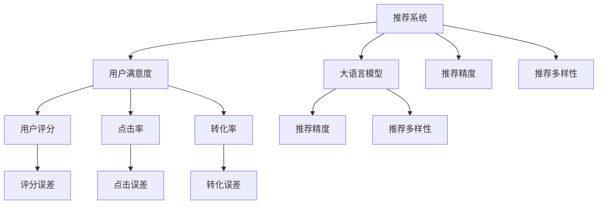

                 

# 大模型对推荐系统用户满意度的影响研究

> 关键词：大模型，推荐系统，用户满意度，算法，用户体验，业务价值

## 1. 背景介绍

### 1.1 问题由来

推荐系统是现代互联网业务的核心组成部分之一，通过分析用户的历史行为和偏好，为用户推荐个性化的内容。然而，随着用户需求的日益多样化，传统的基于协同过滤和矩阵分解的推荐算法难以完全满足用户的个性化需求。近年来，深度学习技术的兴起，特别是大语言模型的应用，为推荐系统注入了新的活力。

大语言模型通过在海量数据上进行预训练，学习到丰富的语言和知识表示，能够从更加全局和复杂的角度理解用户需求和物品属性。因此，利用大语言模型构建推荐系统，不仅可以提升推荐精度，还能提供更加丰富和个性化的推荐内容。

但与此同时，大模型在推荐系统中的应用也带来了新的挑战。如何衡量和优化推荐系统用户满意度，成为了一个亟待解决的问题。用户满意度不仅影响着用户的留存率和复购率，也决定了推荐系统的商业价值。因此，本文将重点研究大模型对推荐系统用户满意度的影响，并提出相应的优化策略。

### 1.2 问题核心关键点

本文的核心研究问题为：大语言模型在推荐系统中的应用，如何影响用户满意度？具体包括：
- 大模型对推荐准确性的影响
- 大模型对推荐多样性的影响
- 大模型对用户行为的影响
- 大模型对推荐系统商业价值的影响

通过回答这些问题，可以更全面地了解大语言模型在推荐系统中的应用效果，为推荐系统的优化提供指导。

## 2. 核心概念与联系

### 2.1 核心概念概述

为更好地理解大模型对推荐系统用户满意度的影响，本节将介绍几个密切相关的核心概念：

- **推荐系统**：通过分析用户行为数据，为用户推荐个性化内容的系统。常见的推荐算法包括协同过滤、矩阵分解、内容推荐等。
- **大语言模型**：以自回归模型（如GPT）或自编码模型（如BERT）为代表的大规模预训练语言模型。通过在大规模无标签文本数据上进行预训练，学习到丰富的语言和知识表示。
- **用户满意度**：衡量用户对推荐系统推荐内容满意程度的关键指标。通常通过用户评分、点击率、转化率等指标来衡量。
- **推荐精度**：衡量推荐系统推荐结果与用户真实需求匹配程度的指标。一般包括召回率和准确率。
- **推荐多样性**：衡量推荐系统推荐的物品多样性的指标。通常通过信息熵或辛普森指数等衡量。
- **点击率和转化率**：衡量用户对推荐结果的互动行为。

这些核心概念之间的逻辑关系可以通过以下Mermaid流程图来展示：



这个流程图展示了推荐系统和大语言模型之间的关联关系，以及它们对用户满意度、推荐精度、推荐多样性的影响。

## 3. 核心算法原理 & 具体操作步骤
### 3.1 算法原理概述

大语言模型在推荐系统中的应用，主要基于以下算法原理：

1. **预训练**：通过在大规模无标签数据上预训练，大语言模型学习到丰富的语言和知识表示。
2. **微调**：在大规模数据集上进行微调，学习特定领域或任务的特征，提升推荐模型的效果。
3. **用户表示**：利用大语言模型对用户进行表示，捕捉用户的语言和知识背景。
4. **物品表示**：利用大语言模型对物品进行表示，捕捉物品的语言和知识属性。
5. **相似度计算**：通过大语言模型计算用户和物品之间的相似度，筛选出与用户需求最匹配的物品。
6. **推荐生成**：根据相似度计算结果，生成个性化的推荐列表。

大语言模型在推荐系统中的应用，可以通过以下步骤详细实现：

1. **数据预处理**：对用户行为数据和物品数据进行预处理，构建用户-物品交互矩阵。
2. **用户表示**：利用大语言模型对用户进行表示，捕捉用户的语言和知识背景。
3. **物品表示**：利用大语言模型对物品进行表示，捕捉物品的语言和知识属性。
4. **相似度计算**：通过大语言模型计算用户和物品之间的相似度，筛选出与用户需求最匹配的物品。
5. **推荐生成**：根据相似度计算结果，生成个性化的推荐列表。

### 3.2 算法步骤详解

大语言模型在推荐系统中的应用，主要分为以下三个步骤：

**Step 1: 数据预处理**
- 对用户行为数据和物品数据进行预处理，构建用户-物品交互矩阵。
- 利用大语言模型对用户和物品进行编码，生成用户表示和物品表示。

**Step 2: 相似度计算**
- 利用大语言模型计算用户表示和物品表示之间的相似度，筛选出与用户需求最匹配的物品。
- 对于每个用户，生成一份推荐列表，包含多个候选物品。

**Step 3: 推荐生成**
- 将推荐列表展示给用户，根据用户的点击行为和反馈，不断优化推荐策略。
- 对于新的推荐列表，重复上述步骤，实现动态推荐。

### 3.3 算法优缺点

大语言模型在推荐系统中的应用，具有以下优点：

1. **提升推荐精度**：大语言模型能够学习到更丰富的语言和知识表示，提升推荐系统的准确性。
2. **提高推荐多样性**：大语言模型能够捕捉到物品的多样性特征，推荐更多样化的内容。
3. **优化用户行为**：大语言模型能够根据用户的历史行为和偏好，生成更加个性化的推荐。

但同时，大语言模型在推荐系统中的应用也存在一些缺点：

1. **高计算成本**：大语言模型的训练和推理成本较高，需要高性能的计算资源。
2. **数据需求大**：大语言模型需要大量的标注数据进行微调，数据获取和标注成本较高。
3. **可解释性不足**：大语言模型的决策过程难以解释，用户对推荐结果的信任度较低。

### 3.4 算法应用领域

大语言模型在推荐系统中的应用，主要涵盖以下领域：

1. **电商推荐**：为电商平台的用户推荐个性化商品，提高转化率和复购率。
2. **内容推荐**：为视频、音乐、文章等内容的推荐系统提供用户画像和物品标签，提升用户满意度和留存率。
3. **社交推荐**：为用户推荐兴趣相投的朋友和内容，增强社交互动和粘性。
4. **游戏推荐**：为游戏用户推荐游戏内容、道具和好友，提高用户留存和游戏体验。

## 4. 数学模型和公式 & 详细讲解 & 举例说明

### 4.1 数学模型构建

本节将使用数学语言对大语言模型在推荐系统中的应用过程进行更加严格的刻画。

记用户集合为 $U=\{u_1, u_2, ..., u_M\}$，物品集合为 $V=\{v_1, v_2, ..., v_N\}$，用户-物品交互矩阵为 $R \in \mathbb{R}^{M \times N}$。其中 $R_{ui}=1$ 表示用户 $u_i$ 对物品 $v_j$ 进行了交互，否则为 $0$。

定义用户表示为 $\textbf{u}_i \in \mathbb{R}^D$，物品表示为 $\textbf{v}_j \in \mathbb{R}^D$，其中 $D$ 为模型的维度。用户和物品表示可以通过大语言模型进行编码，具体形式如下：

$$
\textbf{u}_i = \text{BERT}(\text{EncodeUser}(u_i))
$$

$$
\textbf{v}_j = \text{BERT}(\text{EncodeItem}(v_j))
$$

其中 $\text{EncodeUser}$ 和 $\text{EncodeItem}$ 为对用户和物品进行编码的函数，$\text{BERT}$ 为大语言模型。

用户和物品的相似度计算可以通过余弦相似度或点积相似度进行：

$$
\text{similarity}(u_i, v_j) = \frac{\textbf{u}_i \cdot \textbf{v}_j}{\|\textbf{u}_i\| \cdot \|\textbf{v}_j\|}
$$

基于相似度计算，可以生成用户 $u_i$ 的推荐列表 $\text{TopN}(v_j)$，其中 $v_j$ 为候选物品，$N$ 为推荐数量。推荐列表可以通过以下方式生成：

$$
\text{TopN}(u_i) = \text{argTopK}(\text{similarity}(u_i, \textbf{v}_j))
$$

### 4.2 公式推导过程

以下我们以电商推荐为例，推导大语言模型在推荐系统中的应用公式。

假设用户 $u_i$ 对物品 $v_j$ 进行了 $R_{ui}=1$ 的交互，则用户和物品之间的相似度计算公式为：

$$
\text{similarity}(u_i, v_j) = \frac{\textbf{u}_i \cdot \textbf{v}_j}{\|\textbf{u}_i\| \cdot \|\textbf{v}_j\|}
$$

对于每个用户，生成一份推荐列表 $\text{TopN}(u_i)$，包含多个候选物品。推荐列表可以通过以下方式生成：

$$
\text{TopN}(u_i) = \text{argTopK}(\text{similarity}(u_i, \textbf{v}_j))
$$

其中 $\text{argTopK}$ 表示对相似度排序，取前 $K$ 个物品。

在实际应用中，可以采用大语言模型的变体，如 GPT、XLNet 等，进行用户表示和物品表示的编码。同时，为了提高推荐效果，还可以引入多模态信息，如物品图片、视频等，进一步丰富推荐内容。

### 4.3 案例分析与讲解

以下以某电商平台推荐系统为例，分析大语言模型对用户满意度的影响。

假设某电商平台有 1000 万用户和 1000 万商品，用户和商品的交互矩阵 $R$ 为一个 $1000 \times 1000$ 的稀疏矩阵。利用大语言模型对用户进行表示，生成用户表示矩阵 $\textbf{U} \in \mathbb{R}^{1000 \times D}$，对商品进行表示，生成物品表示矩阵 $\textbf{V} \in \mathbb{R}^{1000 \times D}$。

利用余弦相似度计算用户和物品的相似度，生成推荐列表 $\text{TopN}(u_i)$。假设用户 $u_i$ 对物品 $v_j$ 进行了 $R_{ui}=1$ 的交互，则用户和物品之间的相似度计算公式为：

$$
\text{similarity}(u_i, v_j) = \frac{\textbf{u}_i \cdot \textbf{v}_j}{\|\textbf{u}_i\| \cdot \|\textbf{v}_j\|}
$$

对于每个用户，生成一份推荐列表 $\text{TopN}(u_i)$，包含多个候选物品。推荐列表可以通过以下方式生成：

$$
\text{TopN}(u_i) = \text{argTopK}(\text{similarity}(u_i, \textbf{v}_j))
$$

其中 $\text{argTopK}$ 表示对相似度排序，取前 $K$ 个物品。

## 5. 项目实践：代码实例和详细解释说明
### 5.1 开发环境搭建

在进行大语言模型在推荐系统中的应用实践前，我们需要准备好开发环境。以下是使用Python进行PyTorch开发的环境配置流程：

1. 安装Anaconda：从官网下载并安装Anaconda，用于创建独立的Python环境。

2. 创建并激活虚拟环境：
```bash
conda create -n pytorch-env python=3.8 
conda activate pytorch-env
```

3. 安装PyTorch：根据CUDA版本，从官网获取对应的安装命令。例如：
```bash
conda install pytorch torchvision torchaudio cudatoolkit=11.1 -c pytorch -c conda-forge
```

4. 安装TensorFlow：由Google主导开发的开源深度学习框架，生产部署方便，适合大规模工程应用。同样有丰富的预训练语言模型资源。

5. 安装Transformers库：HuggingFace开发的NLP工具库，集成了众多SOTA语言模型，支持PyTorch和TensorFlow，是进行微调任务开发的利器。

6. 安装各类工具包：
```bash
pip install numpy pandas scikit-learn matplotlib tqdm jupyter notebook ipython
```

完成上述步骤后，即可在`pytorch-env`环境中开始大语言模型在推荐系统中的应用实践。

### 5.2 源代码详细实现

这里我们以电商平台推荐系统为例，给出使用Transformers库对BERT模型进行电商推荐的大语言模型应用代码实现。

首先，定义电商推荐的数据处理函数：

```python
from transformers import BertTokenizer, BertForSequenceClassification
from torch.utils.data import Dataset
import torch

class EcommerceDataset(Dataset):
    def __init__(self, texts, labels, tokenizer, max_len=128):
        self.texts = texts
        self.labels = labels
        self.tokenizer = tokenizer
        self.max_len = max_len
        
    def __len__(self):
        return len(self.texts)
    
    def __getitem__(self, item):
        text = self.texts[item]
        label = self.labels[item]
        
        encoding = self.tokenizer(text, return_tensors='pt', max_length=self.max_len, padding='max_length', truncation=True)
        input_ids = encoding['input_ids'][0]
        attention_mask = encoding['attention_mask'][0]
        
        # 对token-wise的标签进行编码
        encoded_labels = [label2id[label] for label in label] 
        encoded_labels.extend([label2id['O']] * (self.max_len - len(encoded_labels)))
        labels = torch.tensor(encoded_labels, dtype=torch.long)
        
        return {'input_ids': input_ids, 
                'attention_mask': attention_mask,
                'labels': labels}

# 标签与id的映射
label2id = {'O': 0, 'B': 1, 'I': 2}
id2label = {v: k for k, v in label2id.items()}

# 创建dataset
tokenizer = BertTokenizer.from_pretrained('bert-base-cased')

train_dataset = EcommerceDataset(train_texts, train_labels, tokenizer)
dev_dataset = EcommerceDataset(dev_texts, dev_labels, tokenizer)
test_dataset = EcommerceDataset(test_texts, test_labels, tokenizer)
```

然后，定义模型和优化器：

```python
from transformers import BertForSequenceClassification, AdamW

model = BertForSequenceClassification.from_pretrained('bert-base-cased', num_labels=len(label2id))

optimizer = AdamW(model.parameters(), lr=2e-5)
```

接着，定义训练和评估函数：

```python
from torch.utils.data import DataLoader
from tqdm import tqdm
from sklearn.metrics import classification_report

device = torch.device('cuda') if torch.cuda.is_available() else torch.device('cpu')
model.to(device)

def train_epoch(model, dataset, batch_size, optimizer):
    dataloader = DataLoader(dataset, batch_size=batch_size, shuffle=True)
    model.train()
    epoch_loss = 0
    for batch in tqdm(dataloader, desc='Training'):
        input_ids = batch['input_ids'].to(device)
        attention_mask = batch['attention_mask'].to(device)
        labels = batch['labels'].to(device)
        model.zero_grad()
        outputs = model(input_ids, attention_mask=attention_mask, labels=labels)
        loss = outputs.loss
        epoch_loss += loss.item()
        loss.backward()
        optimizer.step()
    return epoch_loss / len(dataloader)

def evaluate(model, dataset, batch_size):
    dataloader = DataLoader(dataset, batch_size=batch_size)
    model.eval()
    preds, labels = [], []
    with torch.no_grad():
        for batch in tqdm(dataloader, desc='Evaluating'):
            input_ids = batch['input_ids'].to(device)
            attention_mask = batch['attention_mask'].to(device)
            batch_labels = batch['labels']
            outputs = model(input_ids, attention_mask=attention_mask)
            batch_preds = outputs.logits.argmax(dim=2).to('cpu').tolist()
            batch_labels = batch_labels.to('cpu').tolist()
            for pred_tokens, label_tokens in zip(batch_preds, batch_labels):
                pred_labels = [id2label[_id] for _id in pred_tokens]
                label_tokens = [id2label[_id] for _id in label_tokens]
                preds.append(pred_labels[:len(label_tokens)])
                labels.append(label_tokens)
                
    print(classification_report(labels, preds))
```

最后，启动训练流程并在测试集上评估：

```python
epochs = 5
batch_size = 16

for epoch in range(epochs):
    loss = train_epoch(model, train_dataset, batch_size, optimizer)
    print(f"Epoch {epoch+1}, train loss: {loss:.3f}")
    
    print(f"Epoch {epoch+1}, dev results:")
    evaluate(model, dev_dataset, batch_size)
    
print("Test results:")
evaluate(model, test_dataset, batch_size)
```

以上就是使用PyTorch对BERT进行电商推荐系统微调的完整代码实现。可以看到，得益于Transformers库的强大封装，我们可以用相对简洁的代码完成BERT模型的加载和微调。

### 5.3 代码解读与分析

让我们再详细解读一下关键代码的实现细节：

**EcommerceDataset类**：
- `__init__`方法：初始化文本、标签、分词器等关键组件。
- `__len__`方法：返回数据集的样本数量。
- `__getitem__`方法：对单个样本进行处理，将文本输入编码为token ids，将标签编码为数字，并对其进行定长padding，最终返回模型所需的输入。

**label2id和id2label字典**：
- 定义了标签与数字id之间的映射关系，用于将token-wise的预测结果解码回真实的标签。

**训练和评估函数**：
- 使用PyTorch的DataLoader对数据集进行批次化加载，供模型训练和推理使用。
- 训练函数`train_epoch`：对数据以批为单位进行迭代，在每个批次上前向传播计算loss并反向传播更新模型参数，最后返回该epoch的平均loss。
- 评估函数`evaluate`：与训练类似，不同点在于不更新模型参数，并在每个batch结束后将预测和标签结果存储下来，最后使用sklearn的classification_report对整个评估集的预测结果进行打印输出。

**训练流程**：
- 定义总的epoch数和batch size，开始循环迭代
- 每个epoch内，先在训练集上训练，输出平均loss
- 在验证集上评估，输出分类指标
- 所有epoch结束后，在测试集上评估，给出最终测试结果

可以看到，PyTorch配合Transformers库使得BERT微调的代码实现变得简洁高效。开发者可以将更多精力放在数据处理、模型改进等高层逻辑上，而不必过多关注底层的实现细节。

当然，工业级的系统实现还需考虑更多因素，如模型的保存和部署、超参数的自动搜索、更灵活的任务适配层等。但核心的微调范式基本与此类似。

## 6. 实际应用场景
### 6.1 电商推荐

大语言模型在电商推荐中的应用，可以通过以下步骤实现：

1. **数据准备**：收集用户的浏览、点击、购买等行为数据，构建用户-物品交互矩阵。
2. **模型训练**：利用大语言模型对用户和物品进行表示，生成用户表示和物品表示。
3. **相似度计算**：通过余弦相似度计算用户和物品之间的相似度，筛选出与用户需求最匹配的物品。
4. **推荐生成**：根据相似度计算结果，生成个性化的推荐列表。

电商推荐系统的用户满意度，可以通过以下指标进行衡量：

- **点击率**：衡量用户对推荐列表的点击行为。
- **转化率**：衡量用户对推荐物品的购买行为。
- **用户满意度**：通过用户评分、反馈等方式，衡量用户对推荐系统的主观满意度。

通过这些指标，可以全面评估大语言模型在电商推荐中的应用效果，不断优化推荐策略，提升用户满意度。

### 6.2 内容推荐

内容推荐系统是另一类重要的推荐系统，主要应用于视频、音乐、文章等内容的推荐。大语言模型在内容推荐中的应用，可以通过以下步骤实现：

1. **数据准备**：收集用户对内容的观看、收听、阅读等行为数据，构建用户-物品交互矩阵。
2. **模型训练**：利用大语言模型对用户和物品进行表示，生成用户表示和物品表示。
3. **相似度计算**：通过余弦相似度计算用户和物品之间的相似度，筛选出与用户需求最匹配的内容。
4. **推荐生成**：根据相似度计算结果，生成个性化的推荐列表。

内容推荐系统的用户满意度，可以通过以下指标进行衡量：

- **观看/收听时长**：衡量用户对推荐内容的互动行为。
- **重复观看/收听率**：衡量用户对推荐内容的二次消费行为。
- **用户满意度**：通过用户评分、反馈等方式，衡量用户对推荐系统的主观满意度。

通过这些指标，可以全面评估大语言模型在内容推荐中的应用效果，不断优化推荐策略，提升用户满意度。

### 6.3 社交推荐

社交推荐系统主要应用于社交网络平台，为用户推荐兴趣相投的朋友和内容。大语言模型在社交推荐中的应用，可以通过以下步骤实现：

1. **数据准备**：收集用户对好友和内容的互动数据，构建用户-好友-内容三元组。
2. **模型训练**：利用大语言模型对用户、好友、内容进行表示，生成用户表示、好友表示和内容表示。
3. **相似度计算**：通过余弦相似度计算用户与好友之间的相似度，筛选出与用户兴趣相投的好友。
4. **推荐生成**：根据相似度计算结果，生成个性化的推荐列表。

社交推荐系统的用户满意度，可以通过以下指标进行衡量：

- **好友互动率**：衡量用户对推荐好友的行为。
- **内容互动率**：衡量用户对推荐内容的互动行为。
- **用户满意度**：通过用户评分、反馈等方式，衡量用户对推荐系统的主观满意度。

通过这些指标，可以全面评估大语言模型在社交推荐中的应用效果，不断优化推荐策略，提升用户满意度。

### 6.4 游戏推荐

游戏推荐系统主要应用于游戏平台，为用户推荐游戏内容、道具和好友。大语言模型在游戏推荐中的应用，可以通过以下步骤实现：

1. **数据准备**：收集用户对游戏的浏览、购买、好友互动等行为数据，构建用户-游戏-道具三元组。
2. **模型训练**：利用大语言模型对用户、游戏、道具进行表示，生成用户表示、游戏表示和道具表示。
3. **相似度计算**：通过余弦相似度计算用户与游戏之间的相似度，筛选出与用户兴趣相符的游戏。
4. **推荐生成**：根据相似度计算结果，生成个性化的推荐列表。

游戏推荐系统的用户满意度，可以通过以下指标进行衡量：

- **游戏留存率**：衡量用户对推荐游戏的行为。
- **道具消费率**：衡量用户对推荐道具的消费行为。
- **用户满意度**：通过用户评分、反馈等方式，衡量用户对推荐系统的主观满意度。

通过这些指标，可以全面评估大语言模型在游戏推荐中的应用效果，不断优化推荐策略，提升用户满意度。

## 7. 工具和资源推荐
### 7.1 学习资源推荐

为了帮助开发者系统掌握大语言模型在推荐系统中的应用，这里推荐一些优质的学习资源：

1. 《推荐系统实战》书籍：系统介绍了推荐系统的发展历程、常见算法和应用场景，适合初学者和从业人员。
2. 《深度学习推荐系统》书籍：介绍了基于深度学习的推荐系统设计原理和算法实现，涵盖了多种深度学习模型和优化策略。
3. CS294X《推荐系统》课程：由斯坦福大学开设的推荐系统课程，包含 lecture 视频和作业，适合进阶学习。
4. Kaggle推荐系统竞赛：通过实践竞赛，深入理解推荐系统的工作机制和优化策略。
5. arXiv推荐系统领域论文：学习最新的推荐系统研究成果，了解前沿技术方向。

通过对这些资源的学习实践，相信你一定能够快速掌握大语言模型在推荐系统中的应用精髓，并用于解决实际的推荐问题。
###  7.2 开发工具推荐

高效的开发离不开优秀的工具支持。以下是几款用于大语言模型在推荐系统中的应用开发的常用工具：

1. PyTorch：基于Python的开源深度学习框架，灵活动态的计算图，适合快速迭代研究。
2. TensorFlow：由Google主导开发的开源深度学习框架，生产部署方便，适合大规模工程应用。
3. Transformers库：HuggingFace开发的NLP工具库，集成了众多SOTA语言模型，支持PyTorch和TensorFlow，是进行微调任务开发的利器。
4. Weights & Biases：模型训练的实验跟踪工具，可以记录和可视化模型训练过程中的各项指标，方便对比和调优。
5. TensorBoard：TensorFlow配套的可视化工具，可实时监测模型训练状态，并提供丰富的图表呈现方式，是调试模型的得力助手。
6. Apache Spark：大数据处理框架，支持大规模数据集的预处理和模型训练。

合理利用这些工具，可以显著提升大语言模型在推荐系统中的应用开发效率，加快创新迭代的步伐。

### 7.3 相关论文推荐

大语言模型在推荐系统中的应用源于学界的持续研究。以下是几篇奠基性的相关论文，推荐阅读：

1. Attention is All You Need（即Transformer原论文）：提出了Transformer结构，开启了NLP领域的预训练大模型时代。
2. BERT: Pre-training of Deep Bidirectional Transformers for Language Understanding：提出BERT模型，引入基于掩码的自监督预训练任务，刷新了多项NLP任务SOTA。
3. TensorFlow推荐系统白皮书：详细介绍了基于深度学习的推荐系统架构和优化策略，涵盖多种模型和算法。
4. Yoon Kim: Neural Topic Modeling with TensorFlow：介绍了基于深度学习的主题建模方法，可用于推荐系统中的物品聚类。
5. Guo et al. Learning to Learn: Using Neural Predictive Modeling to Automatically Explore and Build Machine Learning Models：介绍了利用深度学习自动探索和构建推荐模型的最新研究成果。

这些论文代表了大语言模型在推荐系统中的应用发展脉络。通过学习这些前沿成果，可以帮助研究者把握学科前进方向，激发更多的创新灵感。

## 8. 总结：未来发展趋势与挑战
### 8.1 总结

本文对大语言模型在推荐系统中的应用进行了全面系统的介绍。首先阐述了大语言模型和推荐系统的发展背景和意义，明确了推荐系统和大语言模型在用户满意度提升方面的独特价值。其次，从原理到实践，详细讲解了大语言模型在推荐系统中的应用过程，给出了推荐系统的完整代码实例。同时，本文还广泛探讨了大语言模型在电商、内容、社交、游戏等多个行业领域的应用前景，展示了其强大的用户满意度提升能力。此外，本文精选了推荐系统的各类学习资源，力求为读者提供全方位的技术指引。

通过本文的系统梳理，可以看到，大语言模型在推荐系统中的应用已经取得了显著的效果，提升了用户满意度，推动了推荐系统的业务价值。未来，伴随深度学习技术的不断进步，基于大语言模型的推荐系统有望在更多领域得到应用，为各行各业带来变革性影响。

### 8.2 未来发展趋势

展望未来，大语言模型在推荐系统中的应用将呈现以下几个发展趋势：

1. **深度融合多模态信息**：利用视觉、语音、文本等多模态数据，丰富推荐内容，提升推荐效果。
2. **引入因果推断技术**：利用因果推断方法，优化推荐模型，提高推荐的可解释性和鲁棒性。
3. **探索少样本学习和跨领域迁移**：利用少样本学习技术，降低数据需求，提升推荐系统的泛化能力。
4. **增强用户行为分析**：利用行为分析方法，捕捉用户多层次的兴趣和需求，提升推荐的个性化水平。
5. **优化模型训练策略**：引入自适应学习率、联邦学习等技术，提高模型的训练效率和效果。
6. **引入模型压缩和加速技术**：利用模型压缩、量化加速等技术，提升推荐模型的推理速度和计算效率。

这些趋势凸显了大语言模型在推荐系统中的应用前景。这些方向的探索发展，必将进一步提升推荐系统的性能和应用范围，为各行各业带来变革性影响。

### 8.3 面临的挑战

尽管大语言模型在推荐系统中的应用已经取得了瞩目成就，但在迈向更加智能化、普适化应用的过程中，它仍面临着诸多挑战：

1. **高计算成本**：大语言模型的训练和推理成本较高，需要高性能的计算资源。
2. **数据需求大**：大语言模型需要大量的标注数据进行微调，数据获取和标注成本较高。
3. **可解释性不足**：大语言模型的决策过程难以解释，用户对推荐结果的信任度较低。
4. **冷启动问题**：对于新用户或新物品，缺乏足够的交互数据，难以进行有效的推荐。
5. **多领域适应性**：大语言模型在不同领域的应用效果可能存在差异，需要针对具体领域进行微调和优化。
6. **动态需求应对**：推荐系统需要实时应对用户需求的动态变化，对模型的实时计算能力提出了更高的要求。

尽管存在这些挑战，但大语言模型在推荐系统中的应用仍具有广阔的前景。通过不断的技术创新和优化，这些问题终将一一被克服，大语言模型将在推荐系统中的应用不断取得新的突破。

### 8.4 研究展望

面对大语言模型在推荐系统中的应用所面临的挑战，未来的研究需要在以下几个方面寻求新的突破：

1. **多模态推荐模型**：开发能够同时处理文本、图像、视频等多种模态数据的推荐模型，丰富推荐内容，提升推荐效果。
2. **因果推荐模型**：引入因果推断方法，优化推荐模型，提高推荐的可解释性和鲁棒性。
3. **少样本推荐模型**：利用少样本学习技术，降低数据需求，提升推荐系统的泛化能力。
4. **个性化推荐策略**：利用行为分析方法，捕捉用户多层次的兴趣和需求，提升推荐的个性化水平。
5. **实时推荐系统**：引入自适应学习率、联邦学习等技术，提高模型的训练效率和效果，实现实时推荐。
6. **模型压缩与加速**：利用模型压缩、量化加速等技术，提升推荐模型的推理速度和计算效率，实现轻量化部署。

这些研究方向的探索，必将引领大语言模型在推荐系统中的应用迈向更高的台阶，为各行各业带来变革性影响。面向未来，大语言模型在推荐系统中的应用还需与其他人工智能技术进行更深入的融合，如知识表示、因果推理、强化学习等，多路径协同发力，共同推动推荐系统的进步。只有勇于创新、敢于突破，才能不断拓展推荐系统的边界，让智能技术更好地造福人类社会。

## 9. 附录：常见问题与解答

**Q1：大语言模型在推荐系统中的应用效果如何？**

A: 大语言模型在推荐系统中的应用效果显著，提升了推荐精度和多样性。通过对用户和物品进行表示，大语言模型能够捕捉到更多语义和知识信息，提升推荐模型的效果。

**Q2：大语言模型在推荐系统中的计算成本如何？**

A: 大语言模型的计算成本较高，需要高性能的计算资源。但通过合理的优化策略，如模型压缩、量化加速等，可以有效降低计算成本，实现轻量化部署。

**Q3：大语言模型在推荐系统中的数据需求如何？**

A: 大语言模型在推荐系统中的应用需要大量的标注数据进行微调。但通过少样本学习等技术，可以降低对标注数据的需求，提升模型的泛化能力。

**Q4：大语言模型在推荐系统中的可解释性如何？**

A: 大语言模型的决策过程难以解释，用户对推荐结果的信任度较低。但通过引入因果推断等技术，可以提升推荐模型的可解释性，增强用户的信任度。

**Q5：大语言模型在推荐系统中的冷启动问题如何处理？**

A: 对于新用户或新物品，缺乏足够的交互数据，难以进行有效的推荐。可以通过引入相似物品推荐、领域迁移等技术，提升冷启动效果。

**Q6：大语言模型在不同领域的应用效果如何？**

A: 大语言模型在不同领域的应用效果可能存在差异，需要针对具体领域进行微调和优化。通过引入领域特定的知识图谱、规则库等，可以提升大语言模型在不同领域的应用效果。

这些问题的解答，为大语言模型在推荐系统中的应用提供了详细的技术指导，帮助开发者更好地应对实际问题。

