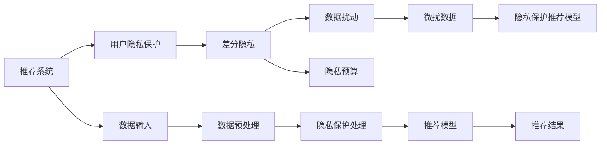

                 

# 大模型对推荐系统用户隐私保护的增强

## 1. 背景介绍

在数字化、网络化快速发展的今天，大数据、人工智能等前沿技术在各行各业中得到广泛应用，推荐系统也逐渐成为各大平台的核心竞争力。然而，在推荐系统带来的便利和效益背后，用户隐私保护问题也日益突出。如何在大模型推荐系统中实现有效的隐私保护，成为一个亟需解决的重要课题。

本博客将以深度学习大模型为基础，介绍一种基于数据扰动和差分隐私技术的推荐系统隐私保护方法，旨在保护用户隐私的同时，确保推荐效果不受过多影响。

## 2. 核心概念与联系

### 2.1 核心概念概述

为了更好地理解大模型在推荐系统中的隐私保护应用，我们首先需要了解几个关键概念：

- **推荐系统**：根据用户的历史行为和兴趣，为用户推荐合适的产品或内容。常见的推荐系统包括基于协同过滤、内容推荐、深度学习等算法。

- **用户隐私**：用户在平台上的行为数据、个人信息等敏感信息，应当得到充分保护。

- **差分隐私**：一种隐私保护技术，通过在数据中引入随机性，使得任何个体数据的加入或删除，对数据集的整体统计特性影响极小，从而保护用户隐私。

- **大模型**：基于深度学习技术构建的、具有自监督学习能力的模型，通常具有极高的精度和泛化能力。

### 2.2 核心概念联系（Mermaid 流程图）



该图展示了推荐系统与隐私保护的联系：

- 推荐系统以用户数据为输入，通过多种算法生成推荐结果。
- 隐私保护通过差分隐私等技术，对用户数据进行扰动处理，确保数据隐私。
- 微扰数据输入推荐模型，生成最终的推荐结果。

通过这样的流程，实现了在大模型推荐系统中对用户隐私的有效保护。

## 3. 核心算法原理 & 具体操作步骤

### 3.1 算法原理概述

本节将介绍基于差分隐私的大模型推荐系统隐私保护方法的原理。

在大规模推荐系统中，用户数据通常以向量形式输入模型。差分隐私技术通过在输入数据中引入噪声，使得任何个体数据的微小变化对模型输出的影响极小，从而保证数据隐私。

具体来说，该方法分为三个步骤：

1. **数据预处理**：对原始数据进行标准化、归一化等预处理，确保数据的质量和一致性。
2. **数据扰动**：在预处理后的数据中引入噪声，扰动数据的分布，使其难以与原始数据直接关联。
3. **隐私保护推荐模型**：在扰动后的数据上训练推荐模型，生成最终的推荐结果。

### 3.2 算法步骤详解

#### 3.2.1 数据预处理

数据预处理通常包括以下几个步骤：

1. **特征选择**：根据推荐任务的特点，选择合适的特征进行输入。例如，对于协同过滤推荐系统，可以选取用户历史行为、物品属性等特征。
2. **特征归一化**：对不同特征进行归一化处理，确保特征值的一致性。例如，使用z-score标准化方法，将特征值缩放到均值为0，标准差为1的标准正态分布中。
3. **特征编码**：将原始数据转换为模型可以处理的格式。例如，使用独热编码将类别特征转换为数值向量。

#### 3.2.2 数据扰动

数据扰动是差分隐私的核心步骤，通常使用加性噪声、乘性噪声等方法实现。这里以加性噪声为例进行说明。

设原始数据为 $D$，噪声参数为 $\epsilon$，噪声分布为 $\mathcal{N}(0,\sigma^2)$，扰动后的数据为 $D' = D + \epsilon \mathcal{N}(0,\sigma^2)$。其中，$\epsilon$ 为隐私预算，$\sigma$ 为噪声标准差。

隐私预算 $\epsilon$ 是一个衡量隐私保护强度和数据失真程度的关键参数。它代表了在数据扰动过程中，可以引入的最大噪声。通常，$\epsilon$ 越小，隐私保护效果越好，但数据失真程度也越高。

#### 3.2.3 隐私保护推荐模型

在扰动后的数据上训练推荐模型，是差分隐私推荐系统的主要步骤。常见的推荐模型包括协同过滤、深度学习等。

以深度学习模型为例，推荐模型的输入为扰动后的用户数据和物品特征，输出为用户的推荐物品列表。具体步骤如下：

1. **构建推荐模型**：选择合适的深度学习模型，如卷积神经网络（CNN）、循环神经网络（RNN）、Transformer等。
2. **训练模型**：在扰动后的数据集上训练推荐模型，最小化推荐误差。例如，可以使用交叉熵损失函数，衡量模型预测输出与真实标签之间的差异。
3. **测试模型**：在测试集上评估推荐模型的性能，如准确率、召回率等指标。

### 3.3 算法优缺点

#### 3.3.1 算法优点

1. **高隐私保护**：差分隐私技术可以有效保护用户隐私，防止个体数据的泄露。
2. **可控的隐私保护强度**：通过调整隐私预算 $\epsilon$，可以在隐私保护和数据失真之间进行权衡。
3. **适用性强**：该方法适用于多种推荐系统架构，包括基于协同过滤、深度学习等。

#### 3.3.2 算法缺点

1. **数据失真**：扰动过程会引入噪声，导致数据失真。这对推荐模型的性能有一定影响。
2. **计算复杂度高**：在数据扰动和模型训练过程中，需要引入额外的噪声计算，增加了算法的复杂度。
3. **参数调优困难**：隐私预算 $\epsilon$ 需要根据具体应用场景进行调整，不同的数据集和隐私需求可能导致参数调优困难。

### 3.4 算法应用领域

差分隐私技术在推荐系统中具有广泛的应用前景。以下是几个典型的应用场景：

1. **电商推荐系统**：保护用户浏览历史、购买记录等隐私数据，防止数据泄露。
2. **内容推荐平台**：保护用户观看历史、评分数据等隐私信息，避免数据滥用。
3. **社交媒体推荐**：保护用户互动数据、兴趣标签等隐私信息，确保用户数据安全。
4. **广告推荐**：保护用户点击记录、兴趣标签等隐私信息，防止数据被不当使用。

## 4. 数学模型和公式 & 详细讲解 & 举例说明

### 4.1 数学模型构建

假设原始用户数据为 $D=\{(x_i,y_i)\}_{i=1}^N$，其中 $x_i$ 为用户的特征向量，$y_i$ 为用户对物品的评分。在扰动后，用户数据变为 $D'=\{(x_i',y_i')\}_{i=1}^N$，其中 $x_i'$ 为扰动后的特征向量，$y_i'$ 为扰动后的评分。

### 4.2 公式推导过程

设原始数据 $D$ 的均值为 $\mu$，方差为 $\sigma^2$，噪声参数为 $\epsilon$，噪声标准差为 $\sigma$。则扰动后的数据 $D'$ 的均值和方差分别为：

$$
\mu' = \mu + \sigma \epsilon
$$
$$
\sigma'^2 = \sigma^2 + \sigma^2 = \sigma^2(1 + \epsilon^2)
$$

扰动后的数据 $D'$ 的分布为：

$$
p(D') = \frac{1}{\sqrt{2\pi\sigma'^2}} e^{-\frac{(D'-\mu')^2}{2\sigma'^2}}
$$

其中，$\epsilon$ 的取值决定了隐私保护强度和数据失真程度。

### 4.3 案例分析与讲解

以电商推荐系统为例，假设原始数据集包含用户历史浏览记录 $D=\{(x_i,y_i)\}_{i=1}^N$，其中 $x_i$ 为用户浏览的商品ID，$y_i$ 为用户对商品的评分。在扰动后，数据集变为 $D'=\{(x_i',y_i')\}_{i=1}^N$。

1. **数据预处理**：对原始数据进行标准化处理，归一化到均值为0，标准差为1的标准正态分布中。
2. **数据扰动**：在标准化后的数据中引入噪声 $\epsilon \mathcal{N}(0,\sigma^2)$，得到扰动后的数据 $D'$。
3. **隐私保护推荐模型**：在扰动后的数据 $D'$ 上训练推荐模型，生成推荐结果。

## 5. 项目实践：代码实例和详细解释说明

### 5.1 开发环境搭建

在进行代码实践前，我们需要准备好开发环境。以下是使用Python和PyTorch搭建环境的步骤：

1. **安装Anaconda**：从官网下载并安装Anaconda，用于创建独立的Python环境。
```bash
conda create -n pytorch-env python=3.8 
conda activate pytorch-env
```

2. **安装PyTorch**：使用conda安装PyTorch库，支持深度学习模型的构建。
```bash
conda install pytorch torchvision torchaudio cudatoolkit=11.1 -c pytorch -c conda-forge
```

3. **安装相关库**：安装TensorFlow、numpy、pandas等库，用于数据处理和模型训练。
```bash
pip install tensorflow numpy pandas
```

4. **安装差分隐私库**：安装差分隐私相关库，如pydp、delta等。
```bash
pip install pydp delta
```

完成上述步骤后，即可在`pytorch-env`环境中进行差分隐私推荐系统的开发。

### 5.2 源代码详细实现

以下是一个简单的差分隐私推荐系统示例，基于PyTorch和pydp库实现。

```python
import torch
import numpy as np
from pydp.privacy import GaussianMechanism
from pydp.privacy import epsilon, delta
from pydp.privacy import addNoise

class DifferentialPrivacyRecommender:
    def __init__(self, model, epsilon, delta, sigma):
        self.model = model
        self.epsilon = epsilon
        self.delta = delta
        self.sigma = sigma

    def preprocess(self, data):
        # 特征标准化
        mean = np.mean(data, axis=0)
        std = np.std(data, axis=0)
        return (data - mean) / std

    def injectNoise(self, data, sigma):
        # 引入噪声
        mechanism = GaussianMechanism(sigma)
        return addNoise(data, mechanism)

    def train(self, data, labels, batch_size=64, num_epochs=10):
        # 数据预处理
        preprocessed_data = self.preprocess(data)

        # 数据扰动
        noised_data = self.injectNoise(preprocessed_data, self.sigma)

        # 训练模型
        for epoch in range(num_epochs):
            optimizer = torch.optim.Adam(self.model.parameters(), lr=0.001)
            for i in range(0, len(noised_data), batch_size):
                batch_data = noised_data[i:i+batch_size]
                batch_labels = labels[i:i+batch_size]
                optimizer.zero_grad()
                outputs = self.model(batch_data)
                loss = torch.nn.functional.mse_loss(outputs, batch_labels)
                loss.backward()
                optimizer.step()

        return self.model

# 示例数据集
data = np.array([[1, 2, 3], [4, 5, 6], [7, 8, 9]])
labels = np.array([[0.1, 0.2, 0.3], [0.4, 0.5, 0.6], [0.7, 0.8, 0.9]])

# 设置隐私参数
epsilon = 1e-5
delta = 1e-5
sigma = 1

# 构建模型
model = torch.nn.Linear(3, 3)

# 隐私保护推荐器
recommender = DifferentialPrivacyRecommender(model, epsilon, delta, sigma)

# 训练模型
trained_model = recommender.train(data, labels)

# 使用训练好的模型进行推荐
new_data = np.array([[2, 3, 4]])
new_noised_data = recommender.injectNoise(new_data, sigma)
outputs = trained_model(new_noised_data)
```

### 5.3 代码解读与分析

在上述代码中，我们首先定义了一个`DifferentialPrivacyRecommender`类，用于封装差分隐私推荐系统的各个步骤。具体步骤如下：

1. **数据预处理**：使用numpy库对原始数据进行标准化处理。
2. **数据扰动**：使用pydp库中的GaussianMechanism和addNoise方法引入高斯噪声。
3. **训练模型**：在扰动后的数据上使用PyTorch进行模型训练。

在实际应用中，还需要根据具体场景进行参数调优和模型优化。例如，可以采用更高级的差分隐私技术，如Laplace机制、Sensitivity Oracle等，提高隐私保护效果。

## 6. 实际应用场景

### 6.1 电商推荐系统

电商推荐系统是差分隐私推荐系统的重要应用场景之一。电商平台需要根据用户的历史浏览记录和购买记录，为用户推荐合适的商品。同时，用户数据通常包含敏感信息，如浏览历史、购买记录等，需要有效保护用户隐私。

在电商推荐系统中，可以使用差分隐私技术对用户数据进行扰动处理，保护用户隐私。例如，将用户浏览记录和购买记录作为输入，通过差分隐私推荐系统生成推荐结果，确保数据隐私的同时，提升推荐效果。

### 6.2 内容推荐平台

内容推荐平台如Netflix、YouTube等，需要根据用户的观看历史和评分记录，为用户推荐合适的影片和视频。用户数据包含观看历史、评分记录等敏感信息，需要有效保护用户隐私。

在内容推荐平台上，可以使用差分隐私推荐系统对用户数据进行隐私保护。例如，将用户观看历史和评分记录作为输入，通过差分隐私推荐系统生成推荐结果，确保数据隐私的同时，提升推荐效果。

### 6.3 社交媒体推荐

社交媒体推荐系统如Facebook、Twitter等，需要根据用户的互动数据和兴趣标签，为用户推荐合适的内容。用户数据包含互动数据、兴趣标签等敏感信息，需要有效保护用户隐私。

在社交媒体推荐系统中，可以使用差分隐私推荐系统对用户数据进行隐私保护。例如，将用户互动数据和兴趣标签作为输入，通过差分隐私推荐系统生成推荐结果，确保数据隐私的同时，提升推荐效果。

## 7. 工具和资源推荐

### 7.1 学习资源推荐

为了帮助开发者系统掌握差分隐私技术的应用，这里推荐一些优质的学习资源：

1. **《差分隐私理论与实践》书籍**：深入浅出地介绍了差分隐私的理论基础和实际应用，是学习差分隐私的必备书籍。
2. **《差分隐私：概念与技术》课程**：斯坦福大学开设的差分隐私课程，包含差分隐私的核心理论和实际应用，适合深入学习。
3. **Kaggle差分隐私竞赛**：参与差分隐私竞赛，实践应用，积累经验。
4. **Coursera差分隐私课程**：Coursera提供的差分隐私课程，包含差分隐私的核心理论和实际应用，适合入门学习。

### 7.2 开发工具推荐

在实际开发中，可以借助一些优秀的工具提高开发效率和数据处理能力。以下是几个推荐的工具：

1. **PyTorch**：基于Python的深度学习框架，支持高效的模型训练和推理。
2. **pydp**：差分隐私库，提供了丰富的差分隐私算法和实现，适用于差分隐私推荐系统的开发。
3. **TensorBoard**：用于模型训练和调优的可视化工具，可以实时监测模型训练状态。
4. **Weights & Biases**：模型训练的实验跟踪工具，可以记录和可视化模型训练过程中的各项指标，方便对比和调优。

### 7.3 相关论文推荐

差分隐私技术在推荐系统中的应用研究还处于起步阶段，以下是几篇奠基性的相关论文，推荐阅读：

1. **《Differential Privacy in Recommendation Systems》**：探讨了差分隐私在推荐系统中的应用，提出了基于差分隐私的协同过滤推荐方法。
2. **《A Privacy-Preserving Collaborative Filtering Approach with Differential Privacy》**：提出了一种基于差分隐私的协同过滤推荐方法，保护用户隐私的同时，提升了推荐效果。
3. **《Differential Privacy Preserving Recommendation Systems》**：系统综述了差分隐私在推荐系统中的应用，包括差分隐私的实现方法和评估指标。

## 8. 总结：未来发展趋势与挑战

### 8.1 研究成果总结

差分隐私技术在大模型推荐系统中具有广泛的应用前景。通过差分隐私技术，可以有效保护用户隐私，防止个体数据的泄露。同时，该技术在大模型推荐系统中的应用，能够提升推荐模型的鲁棒性和可靠性，增强模型的安全性。

### 8.2 未来发展趋势

未来，差分隐私技术在推荐系统中的应用将呈现以下几个发展趋势：

1. **多模态数据融合**：差分隐私技术可以用于多模态数据融合，提高推荐系统的综合性能。例如，结合用户历史行为、物品属性、社交关系等多种数据，生成更准确的推荐结果。
2. **实时推荐系统**：差分隐私技术可以用于实时推荐系统，满足用户即时需求。例如，基于用户的实时行为数据，生成个性化的推荐结果。
3. **联邦学习**：差分隐私技术可以与联邦学习结合，实现分布式推荐系统。例如，通过差分隐私技术保护用户数据隐私，在分布式环境中进行模型训练和更新。

### 8.3 面临的挑战

尽管差分隐私技术在推荐系统中具有重要的应用价值，但在实际应用中也面临一些挑战：

1. **隐私保护与推荐效果之间的平衡**：如何在保证隐私保护的同时，提升推荐效果，是一个重要的挑战。
2. **模型复杂度增加**：差分隐私技术引入了额外的噪声计算，增加了模型的复杂度，需要优化算法和硬件资源。
3. **参数调优困难**：差分隐私技术的参数调优需要根据具体应用场景进行调整，不同的数据集和隐私需求可能导致参数调优困难。

### 8.4 研究展望

未来，差分隐私技术在推荐系统中的应用研究，需要关注以下几个方向：

1. **优化差分隐私算法**：研究和开发更加高效的差分隐私算法，减少噪声计算和模型复杂度，提升推荐效果。
2. **多领域隐私保护**：研究和开发跨领域隐私保护方法，确保不同领域的用户数据得到充分保护。
3. **隐私预算管理**：研究和开发隐私预算管理方法，合理分配隐私预算，确保隐私保护强度和数据失真程度之间的平衡。
4. **隐私保护与强化学习结合**：研究和开发隐私保护与强化学习结合的方法，提升推荐系统的智能性和鲁棒性。

## 9. 附录：常见问题与解答

**Q1: 差分隐私推荐系统与传统推荐系统有何区别？**

A: 差分隐私推荐系统与传统推荐系统的主要区别在于用户隐私保护机制。差分隐私推荐系统在数据预处理和模型训练过程中，引入了噪声和隐私预算，从而保护用户隐私。传统推荐系统则主要依赖数据收集和模型训练，未考虑隐私保护问题。

**Q2: 差分隐私推荐系统如何处理噪声计算？**

A: 差分隐私推荐系统在数据预处理和模型训练过程中，引入了噪声计算。为了减少计算复杂度，可以使用更高级的差分隐私算法，如Laplace机制、Sensitivity Oracle等，提高隐私保护效果和计算效率。

**Q3: 差分隐私推荐系统如何处理隐私预算？**

A: 隐私预算 $\epsilon$ 是差分隐私推荐系统的重要参数，用于衡量隐私保护强度和数据失真程度。隐私预算需要根据具体应用场景进行调整，确保隐私保护强度和推荐效果之间的平衡。

**Q4: 差分隐私推荐系统在实际应用中面临哪些挑战？**

A: 差分隐私推荐系统在实际应用中面临的主要挑战包括：隐私保护与推荐效果之间的平衡、模型复杂度增加、参数调优困难等。需要根据具体应用场景，研究和开发更加高效和灵活的隐私保护方法。

---

作者：禅与计算机程序设计艺术 / Zen and the Art of Computer Programming

