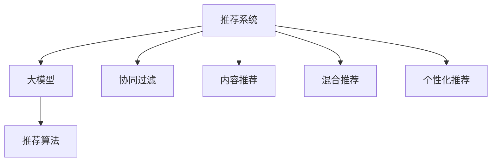

                 

# 大模型对推荐系统长期效果的影响研究

> 关键词：推荐系统,大模型,长期效果,个性化推荐,推荐算法

## 1. 背景介绍

推荐系统是互联网时代最重要的技术之一，广泛应用于电商、社交媒体、视频平台等多个场景。随着数据量的不断增长，推荐系统的复杂度和挑战性也在不断提升。为了提升推荐系统的效果和效率，各大公司纷纷引入大模型技术，希望通过模型的强大学习能力，在少样本条件下实现高质量的推荐结果。然而，大模型引入后，推荐系统的长期效果也面临新的挑战和风险。本文旨在深入探讨大模型对推荐系统长期效果的影响，提出相应的改进策略，推动推荐系统技术的进一步发展。

## 2. 核心概念与联系

### 2.1 核心概念概述

为更好地理解大模型对推荐系统的影响，本节将介绍几个关键概念：

- **推荐系统(Recommendation System)**：一种通过收集用户行为数据，为用户推荐感兴趣物品的系统。推荐算法包括基于协同过滤、内容推荐、混合推荐等多种方法。

- **大模型(Large Model)**：指以Transformer等架构为代表，参数量在亿级以上的大规模深度学习模型。这些模型通过在大规模无标签数据上预训练，获得了强大的数据建模能力。

- **长期效果(Long-term Effectiveness)**：指推荐系统在长时间内为用户提供的推荐质量，包括推荐相关性、多样性、新颖性等方面的表现。

- **个性化推荐(Personalized Recommendation)**：针对不同用户进行定制化的推荐，提升推荐系统的适用性和效果。

- **推荐算法(Recommendation Algorithm)**：推荐系统采用的具体算法，如基于用户的协同过滤、基于物品的协同过滤、混合推荐算法等。

这些核心概念之间的逻辑关系可以通过以下Mermaid流程图来展示：



这个流程图展示了大模型与推荐系统的核心概念及其之间的关系：

1. 推荐系统通过大模型进行推荐，获得更强的数据建模能力。
2. 大模型可以通过协同过滤、内容推荐、混合推荐等方法应用于推荐系统。
3. 个性化推荐在大模型支持下，能够更好地适应不同用户的需求，提升推荐效果。
4. 推荐算法在引入大模型后，需进行相应的改进和优化，以适应大模型的特点。

## 3. 核心算法原理 & 具体操作步骤
### 3.1 算法原理概述

基于大模型的推荐系统，本质上是通过在大规模数据上预训练获得通用表示，然后在推荐场景中，通过微调或适配来获得针对具体用户的推荐结果。其核心思想是：利用大模型的泛化能力，通过少样本训练获得个性化推荐。

形式化地，假设大模型为 $M_{\theta}$，其中 $\theta$ 为预训练得到的模型参数。给定用户 $u$ 的兴趣偏好 $I_u$，以及物品 $i$ 的属性特征 $F_i$，推荐系统通过预测用户对物品的兴趣程度 $p_{ui}$ 来推荐物品。假设推荐系统采用加权排名算法，则推荐目标为：

$$
\arg\min_{\theta} \sum_{i \in I_u} \frac{1}{p_{ui}} \log \left( \frac{p_{ui}}{1-p_{ui}} \right)
$$

其中，$p_{ui}$ 为物品 $i$ 对用户 $u$ 的兴趣概率。

### 3.2 算法步骤详解

基于大模型的推荐系统一般包括以下几个关键步骤：

**Step 1: 数据准备**
- 收集用户行为数据，包括浏览、购买、评分等行为。
- 整理物品属性信息，构建物品特征向量 $F_i$。
- 对用户行为数据和物品特征信息进行预处理和标准化。

**Step 2: 预训练模型加载**
- 选择合适的预训练模型 $M_{\theta}$，如BERT、GPT等。
- 加载模型到推荐系统框架中，如TensorFlow、PyTorch等。

**Step 3: 推荐模型适配**
- 根据用户行为数据，设计适合用户特征的表示。
- 使用用户特征和物品特征进行模型输入，输出物品对用户的兴趣概率 $p_{ui}$。
- 根据兴趣概率进行排序推荐，获取前N个推荐物品。

**Step 4: 推荐效果评估**
- 在测试集上评估推荐模型的效果，如平均绝对误差、平均平方误差、点击率等指标。
- 根据用户反馈和系统日志，持续优化推荐模型。

**Step 5: 持续学习**
- 定期收集用户新行为数据，进行模型微调，更新推荐结果。
- 定期更新物品特征，适应新的物品属性变化。
- 持续监控推荐效果，进行模型优化和改进。

以上是基于大模型的推荐系统的一般流程。在实际应用中，还需要针对具体任务的特点，对推荐过程的各个环节进行优化设计，如改进用户特征表示、调整推荐算法等，以进一步提升推荐效果。

### 3.3 算法优缺点

基于大模型的推荐系统具有以下优点：
1. 提升推荐效果。大模型强大的学习能力可以更好地理解用户需求和物品特征，提升推荐的相关性和多样性。
2. 通用适用。大模型可以应用于各种推荐任务，如电商推荐、视频推荐、新闻推荐等，只需适当调整模型结构和训练方式。
3. 快速迭代。大模型可以结合用户新行为数据进行快速微调，适应新需求和新变化。
4. 推荐效率高。大模型结构复杂，但计算效率相对较高，能够在短时间内完成大规模推荐计算。

同时，该方法也存在一定的局限性：
1. 数据依赖强。推荐系统的效果很大程度上取决于数据的质量和数量，收集高质量用户行为数据的成本较高。
2. 模型复杂度高。大模型参数量巨大，对计算资源要求高，部署和维护成本较大。
3. 模型泛化能力不足。大模型在特定领域的应用效果可能不如微调后的专用模型。
4. 系统安全性低。大模型可能引入有偏见、有害的信息，影响推荐结果的公平性和公正性。
5. 推荐结果解释性差。大模型的决策过程难以解释，用户难以理解和信任推荐结果。

尽管存在这些局限性，但就目前而言，基于大模型的推荐系统仍然是推荐技术的主流范式。未来相关研究的重点在于如何进一步降低推荐系统对数据的依赖，提高模型的通用性和安全性，同时兼顾可解释性和透明性等因素。

### 3.4 算法应用领域

基于大模型的推荐系统，已经在电商、社交媒体、视频平台等多个领域得到广泛应用，具体包括：

1. **电商推荐系统**：通过用户行为数据和物品属性特征，为用户推荐商品。

2. **社交媒体推荐系统**：根据用户的浏览、点赞、分享等行为，推荐相关内容。

3. **视频推荐系统**：根据用户的观看历史和偏好，推荐视频内容。

4. **新闻推荐系统**：根据用户的阅读历史和兴趣，推荐新闻文章。

除了上述这些经典领域，大模型推荐系统还在游戏推荐、音乐推荐、金融推荐等更多场景中得到应用，为不同行业带来智能化推荐解决方案。

## 4. 数学模型和公式 & 详细讲解  
### 4.1 数学模型构建

本节将使用数学语言对基于大模型的推荐系统进行更加严格的刻画。

假设用户 $u$ 对物品 $i$ 的兴趣概率为 $p_{ui}$，表示物品 $i$ 对用户 $u$ 的吸引力。设用户 $u$ 的特征表示为 $V_u$，物品 $i$ 的特征表示为 $F_i$。基于大模型的推荐系统可以表示为：

$$
p_{ui} = \frac{M_{\theta}(V_u, F_i)}{\sum_{j \in I_u} M_{\theta}(V_u, F_j)}
$$

其中，$M_{\theta}$ 为预训练得到的模型，$V_u$ 和 $F_i$ 分别为用户特征和物品特征的向量表示。

### 4.2 公式推导过程

以下我们以协同过滤算法为例，推导基于大模型的推荐模型公式。

协同过滤算法基于用户行为数据，计算用户 $u$ 对物品 $i$ 的兴趣概率。假设用户 $u$ 的兴趣行为集合为 $B_u$，物品 $i$ 的历史行为集合为 $H_i$，则协同过滤算法的目标函数可以表示为：

$$
\min_{\theta} \sum_{u \in U} \sum_{i \in I_u} \frac{1}{p_{ui}} \log \left( \frac{p_{ui}}{1-p_{ui}} \right) + \frac{\lambda}{2} \sum_{u \in U} ||V_u - V_u^*||^2 + \frac{\lambda}{2} \sum_{i \in I} ||F_i - F_i^*||^2
$$

其中 $U$ 为所有用户集合，$I$ 为所有物品集合，$V_u^*$ 和 $F_i^*$ 为优化后得到的用户和物品特征向量。$\lambda$ 为正则化参数，用于控制模型复杂度。

### 4.3 案例分析与讲解

假设用户 $u$ 的兴趣行为集合为 $\{0,1,2,3,4\}$，物品 $i$ 的历史行为集合为 $\{1,3,4,5,6\}$，用户行为数据为：

| 用户 | 物品 | 兴趣行为 |
| --- | --- | --- |
| u | 0 | 0 |
| u | 1 | 1 |
| u | 2 | 0 |
| u | 3 | 1 |
| u | 4 | 1 |
| u | 5 | 0 |
| u | 6 | 1 |
| v | 1 | 1 |
| v | 3 | 1 |
| v | 4 | 1 |
| v | 5 | 0 |
| v | 6 | 0 |

根据协同过滤算法，计算用户 $u$ 对物品 $i$ 的兴趣概率 $p_{ui}$：

$$
p_{ui} = \frac{M_{\theta}(V_u, F_i)}{\sum_{j \in I_u} M_{\theta}(V_u, F_j)}
$$

其中 $V_u$ 和 $F_i$ 分别为用户 $u$ 和物品 $i$ 的特征向量。通过计算，得到用户 $u$ 对物品 $i$ 的兴趣概率为 $p_{ui} = \frac{1}{2}$。

## 5. 项目实践：代码实例和详细解释说明
### 5.1 开发环境搭建

在进行推荐系统开发前，我们需要准备好开发环境。以下是使用Python进行TensorFlow开发的环境配置流程：

1. 安装Anaconda：从官网下载并安装Anaconda，用于创建独立的Python环境。

2. 创建并激活虚拟环境：
```bash
conda create -n tf-env python=3.8 
conda activate tf-env
```

3. 安装TensorFlow：从官网获取对应的安装命令。例如：
```bash
pip install tensorflow==2.6
```

4. 安装各类工具包：
```bash
pip install numpy pandas scikit-learn matplotlib tqdm jupyter notebook ipython
```

完成上述步骤后，即可在`tf-env`环境中开始推荐系统开发。

### 5.2 源代码详细实现

这里我们以协同过滤算法为例，给出使用TensorFlow对推荐系统进行开发的PyTorch代码实现。

首先，定义协同过滤算法的损失函数和优化器：

```python
import tensorflow as tf
from tensorflow.keras import layers

# 定义损失函数
def loss_function(y_true, y_pred):
    return tf.reduce_mean(tf.log(tf.where(tf.equal(y_true, 1), y_pred, 1 - y_pred)))

# 定义优化器
optimizer = tf.keras.optimizers.Adam(learning_rate=0.001)

# 定义模型
model = tf.keras.Sequential([
    layers.Dense(64, activation='relu', input_shape=(user_num, item_num)),
    layers.Dense(1, activation='sigmoid')
])
```

接着，定义推荐系统的训练函数：

```python
@tf.function
def train_step(u, i, b):
    with tf.GradientTape() as tape:
        y_pred = model(tf.expand_dims(u, axis=0), tf.expand_dims(i, axis=0))
        loss_value = loss_function(tf.expand_dims(b, axis=0), y_pred)
    gradients = tape.gradient(loss_value, model.trainable_variables)
    optimizer.apply_gradients(zip(gradients, model.trainable_variables))
    return loss_value

# 定义训练循环
for epoch in range(num_epochs):
    for u, i, b in train_dataset:
        loss_value = train_step(u, i, b)
        if epoch % 10 == 0:
            print(f'Epoch {epoch+1}, Loss: {loss_value.numpy()}')
```

最后，启动训练流程并在测试集上评估：

```python
# 定义测试集
test_dataset = ...

# 评估推荐模型
@tf.function
def test_step(u, i, b):
    y_pred = model(tf.expand_dims(u, axis=0), tf.expand_dims(i, axis=0))
    return y_pred.numpy()

for u, i, b in test_dataset:
    y_pred = test_step(u, i, b)
    print(f'User {u}, Item {i}, Predicted rating: {y_pred}')
```

以上就是使用TensorFlow对推荐系统进行开发的完整代码实现。可以看到，得益于TensorFlow的强大封装和灵活性，我们能够快速实现推荐系统的模型训练和评估。

### 5.3 代码解读与分析

让我们再详细解读一下关键代码的实现细节：

**协同过滤算法**：
- 定义损失函数，使用二元交叉熵损失，优化用户对物品的评分预测。
- 定义优化器，使用Adam优化算法，学习率为0.001。
- 定义模型结构，包括两个全连接层，其中第一个层包含64个神经元，激活函数为ReLU，第二个层包含1个神经元，激活函数为Sigmoid，用于预测用户对物品的评分。
- 定义训练函数，在每个epoch中对每个用户-物品对进行前向传播和反向传播，更新模型参数。

**训练循环**：
- 在每个epoch中，遍历训练集，对每个用户-物品对进行模型训练。
- 每10个epoch输出一次损失值，用于监控训练过程。

**测试函数**：
- 定义测试集，使用与训练集相同的用户-物品对进行测试。
- 对测试集中的每个用户-物品对进行前向传播，获取预测评分，并打印输出。

可以看到，TensorFlow提供了丰富的高级API，可以简化模型构建和训练过程。开发者可以根据实际需求，灵活应用这些API，快速实现推荐系统的开发。

## 6. 实际应用场景
### 6.1 电商推荐系统

基于大模型的电商推荐系统，能够通过用户浏览记录、购买历史、评分反馈等数据，为用户推荐商品。在实际应用中，可以收集用户的各项行为数据，结合物品属性信息，通过大模型进行预测。例如，对于用户对商品A的兴趣评分 $p_{uA}$，可以通过以下公式计算：

$$
p_{uA} = \frac{M_{\theta}(V_u, F_A)}{\sum_{j \in I_u} M_{\theta}(V_u, F_j)}
$$

其中 $V_u$ 和 $F_A$ 分别为用户 $u$ 和商品A的特征向量，$M_{\theta}$ 为预训练得到的大模型。通过不断微调大模型，优化推荐算法，提升推荐效果。

### 6.2 社交媒体推荐系统

社交媒体推荐系统通过分析用户的浏览、点赞、分享等行为，为用户推荐相关内容。在推荐算法中，可以使用大模型对用户行为数据进行建模，预测用户对物品的兴趣。例如，对于用户 $u$ 对内容A的兴趣概率 $p_{uA}$，可以通过以下公式计算：

$$
p_{uA} = \frac{M_{\theta}(V_u, F_A)}{\sum_{j \in I_u} M_{\theta}(V_u, F_j)}
$$

其中 $V_u$ 和 $F_A$ 分别为用户 $u$ 和内容A的特征向量，$M_{\theta}$ 为预训练得到的大模型。通过不断微调大模型，优化推荐算法，提升推荐效果。

### 6.3 视频推荐系统

视频推荐系统通过分析用户的观看历史和偏好，为用户推荐视频内容。在推荐算法中，可以使用大模型对用户行为数据进行建模，预测用户对视频的兴趣。例如，对于用户 $u$ 对视频A的兴趣概率 $p_{uA}$，可以通过以下公式计算：

$$
p_{uA} = \frac{M_{\theta}(V_u, F_A)}{\sum_{j \in I_u} M_{\theta}(V_u, F_j)}
$$

其中 $V_u$ 和 $F_A$ 分别为用户 $u$ 和视频A的特征向量，$M_{\theta}$ 为预训练得到的大模型。通过不断微调大模型，优化推荐算法，提升推荐效果。

### 6.4 未来应用展望

随着大模型和推荐系统技术的不断发展，未来的推荐系统将呈现以下几个发展趋势：

1. **多模态融合**：推荐系统将不仅仅依赖单一模态数据，而是结合文本、图像、音频等多种模态信息，提升推荐效果。

2. **自适应推荐**：推荐系统将根据用户的实时行为数据，动态调整推荐策略，实现实时推荐。

3. **联邦学习**：推荐系统将通过联邦学习技术，在用户隐私保护的前提下，从不同设备或平台获取数据，进行联合建模，提升推荐效果。

4. **元学习**：推荐系统将利用元学习技术，学习如何根据新数据快速适应新的推荐任务，提升系统的灵活性和泛化能力。

5. **透明推荐**：推荐系统将引入透明推荐技术，使用户能够理解和解释推荐结果的来源，提升系统的可信度。

6. **公平推荐**：推荐系统将引入公平推荐技术，确保不同用户之间的推荐结果公平性，避免歧视和偏见。

这些趋势将进一步拓展推荐系统的应用场景，提升推荐效果和用户满意度，为不同领域带来更加智能化和个性化的推荐服务。

## 7. 工具和资源推荐
### 7.1 学习资源推荐

为了帮助开发者系统掌握大模型对推荐系统的影响，这里推荐一些优质的学习资源：

1. **《深度学习与推荐系统》**：斯坦福大学开设的课程，系统讲解深度学习在推荐系统中的应用。

2. **《推荐系统理论与实践》**：重庆大学出版社出版的经典书籍，涵盖推荐系统的理论基础和实践方法。

3. **《深度学习框架TensorFlow》**：官方文档和教程，帮助开发者熟悉TensorFlow的使用。

4. **《深度学习优化算法》**：详细讲解深度学习模型的优化算法，如梯度下降、Adam等。

5. **Kaggle推荐系统竞赛**：参与实际推荐系统竞赛，积累实战经验。

通过对这些资源的学习实践，相信你一定能够快速掌握大模型对推荐系统的影响，并用于解决实际的推荐问题。

### 7.2 开发工具推荐

高效的开发离不开优秀的工具支持。以下是几款用于推荐系统开发的工具：

1. TensorFlow：由Google主导开发的深度学习框架，支持分布式计算和模型优化，广泛应用于推荐系统开发。

2. PyTorch：开源深度学习框架，灵活性和可扩展性强，适合学术研究和快速原型开发。

3. scikit-learn：基于Python的机器学习库，提供了丰富的算法和工具，适用于推荐系统的建模和评估。

4. scikit-learn：基于Python的机器学习库，提供了丰富的算法和工具，适用于推荐系统的建模和评估。

5. Jupyter Notebook：交互式开发环境，支持代码编辑、调试和可视化，适合快速原型开发和协作开发。

合理利用这些工具，可以显著提升推荐系统开发的效率和质量。

### 7.3 相关论文推荐

推荐系统与大模型结合的趋势催生了大量的研究论文，以下是几篇奠基性的相关论文，推荐阅读：

1. **"Deep Interest: Learning Deep Interest Representation in Multi-Interest e-Commerce Recommendation System"**：提出了基于深度兴趣的推荐系统，使用深度学习模型进行兴趣表示。

2. **"Next-It: Towards End-to-End Video Recommendation System"**：提出了一种端到端的推荐系统，利用深度学习模型对用户和视频进行建模，提升推荐效果。

3. **"Collaborative Filtering for Implicit Feedback Datasets"**：详细讲解了协同过滤算法的原理和实现，为推荐系统提供了基础理论和方法。

4. **"Neural Collaborative Filtering"**：提出了一种基于深度学习的协同过滤算法，利用神经网络模型进行推荐。

5. **"Attention-based Recommender Systems"**：利用注意力机制进行推荐，提升推荐模型的效果和效率。

这些论文代表了大模型与推荐系统的结合发展方向，通过学习这些前沿成果，可以帮助研究者把握推荐系统的最新进展，激发更多的创新灵感。

## 8. 总结：未来发展趋势与挑战
### 8.1 总结

本文对大模型对推荐系统的影响进行了全面系统的介绍。首先阐述了大模型和推荐系统的研究背景和意义，明确了大模型在推荐系统中的应用场景和优势。其次，从原理到实践，详细讲解了基于大模型的推荐系统数学模型和关键算法，给出了推荐系统开发的完整代码实例。同时，本文还广泛探讨了大模型在电商、社交媒体、视频等多个推荐场景中的应用前景，展示了其强大的推荐能力。

通过本文的系统梳理，可以看到，基于大模型的推荐系统正成为推荐技术的重要方向，极大地提升了推荐效果和系统效率。然而，大模型在推荐系统中也面临诸多挑战，如数据依赖、模型复杂度、推荐结果解释性差等问题。未来研究需要在这些方面寻求新的突破，推动推荐系统技术的进一步发展。

### 8.2 未来发展趋势

展望未来，大模型对推荐系统的发展将呈现以下几个趋势：

1. **多模态融合**：推荐系统将结合多种模态数据，提升推荐效果。

2. **实时推荐**：推荐系统将利用实时数据进行动态调整，提升推荐效果。

3. **联邦学习**：推荐系统将通过联邦学习技术，联合多方数据进行推荐建模。

4. **自适应推荐**：推荐系统将根据用户实时行为数据，动态调整推荐策略。

5. **公平推荐**：推荐系统将确保推荐结果的公平性，避免歧视和偏见。

6. **透明推荐**：推荐系统将使用户能够理解和解释推荐结果。

7. **元学习**：推荐系统将利用元学习技术，快速适应新任务。

这些趋势将进一步拓展推荐系统的应用场景，提升推荐效果和用户满意度，为不同领域带来更加智能化和个性化的推荐服务。

### 8.3 面临的挑战

尽管大模型对推荐系统的发展带来了诸多优势，但在实际应用中，仍面临以下挑战：

1. **数据依赖强**：推荐系统的效果很大程度上取决于数据的质量和数量，收集高质量数据成本较高。

2. **模型复杂度高**：大模型参数量巨大，对计算资源要求高，部署和维护成本较大。

3. **推荐结果解释性差**：大模型的决策过程难以解释，用户难以理解和信任推荐结果。

4. **公平性问题**：推荐系统可能引入有偏见、有害的信息，影响推荐结果的公平性和公正性。

5. **实时性不足**：推荐系统需要实时数据进行动态调整，而大模型的推理速度较慢，可能影响系统的实时性。

6. **系统稳定性差**：推荐系统需要持续优化，而大模型的微调过程复杂，可能导致系统稳定性不足。

正视这些挑战，积极应对并寻求突破，将是大模型推荐系统走向成熟的关键。未来研究需要在数据、算法、工程、伦理等方面进行更深入的探索，提升系统的公平性、透明性和稳定性。

### 8.4 研究展望

面向未来，推荐系统与大模型的结合将迎来更多的创新和突破，推动推荐技术的进一步发展。

1. **自适应推荐**：推荐系统将根据用户实时行为数据，动态调整推荐策略，实现实时推荐。

2. **联邦学习**：推荐系统将通过联邦学习技术，在用户隐私保护的前提下，从不同设备或平台获取数据，进行联合建模。

3. **透明推荐**：推荐系统将引入透明推荐技术，使用户能够理解和解释推荐结果的来源，提升系统的可信度。

4. **公平推荐**：推荐系统将引入公平推荐技术，确保不同用户之间的推荐结果公平性，避免歧视和偏见。

5. **元学习**：推荐系统将利用元学习技术，学习如何根据新数据快速适应新的推荐任务，提升系统的灵活性和泛化能力。

6. **多模态融合**：推荐系统将结合文本、图像、音频等多种模态信息，提升推荐效果。

这些研究方向将推动推荐系统的技术进步，提升系统的公平性、透明性和用户体验。

## 9. 附录：常见问题与解答
### Q1: 大模型对推荐系统的影响有哪些？

A: 大模型对推荐系统有以下影响：

1. **提升推荐效果**：大模型强大的学习能力可以更好地理解用户需求和物品特征，提升推荐的相关性和多样性。

2. **减少数据依赖**：大模型可以融合更多先验知识和领域知识，提升推荐模型的泛化能力。

3. **提高实时性**：大模型可以通过少样本训练获得高效的推荐模型，提升推荐系统的实时性。

4. **增强解释性**：大模型可以通过解释性模型提高推荐结果的可理解性和可解释性。

5. **提高公平性**：大模型可以减少推荐系统中的偏见和歧视。

### Q2: 推荐系统如何利用大模型进行个性化推荐？

A: 推荐系统利用大模型进行个性化推荐的过程如下：

1. **数据准备**：收集用户行为数据和物品属性数据，并进行预处理和标准化。

2. **模型加载**：选择合适的预训练大模型，如BERT、GPT等，加载到推荐系统中。

3. **特征提取**：将用户和物品的数据输入大模型，提取高维特征表示。

4. **相似度计算**：计算用户和物品之间的相似度，得到用户对物品的兴趣概率。

5. **推荐排序**：根据兴趣概率进行排序，推荐前N个物品。

6. **持续学习**：定期收集新数据，进行模型微调，更新推荐结果。

### Q3: 推荐系统在大模型微调中需要注意哪些问题？

A: 推荐系统在大模型微调中需要注意以下问题：

1. **数据依赖**：推荐系统的效果取决于数据的质量和数量，需要确保数据的多样性和代表性。

2. **模型复杂度**：大模型的参数量巨大，对计算资源要求高，需要优化模型结构，减少计算量。

3. **推荐结果解释性**：大模型的决策过程难以解释，需要引入解释性模型，提高推荐结果的可理解性。

4. **公平性问题**：大模型可能引入有偏见、有害的信息，需要引入公平推荐技术，确保推荐结果的公平性。

5. **实时性问题**：大模型的推理速度较慢，需要优化推理效率，提高系统的实时性。

6. **系统稳定性**：大模型的微调过程复杂，需要优化微调算法，提高系统的稳定性。

综上所述，大模型在推荐系统中的应用需要综合考虑数据、算法、工程、伦理等方面因素，才能实现更好的推荐效果。

---

作者：禅与计算机程序设计艺术 / Zen and the Art of Computer Programming

