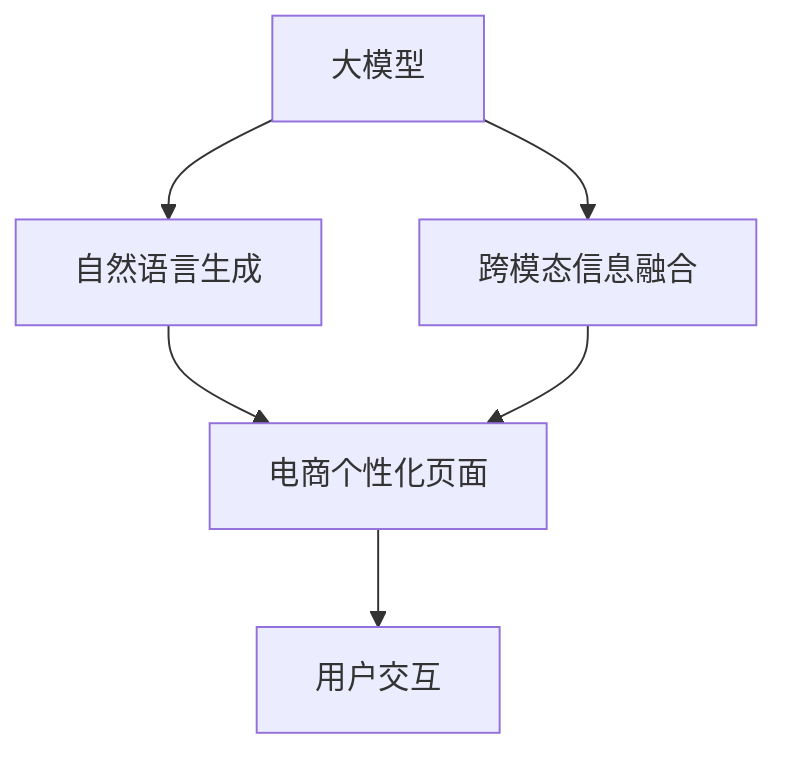

                 

# 大模型技术在电商个性化页面生成中的应用

> 关键词：大模型,电商,个性化,页面生成,自然语言生成(NLG),文本生成,用户交互

## 1. 背景介绍

随着电商行业的蓬勃发展，个性化推荐技术已成为提高用户购物体验和增加商家收益的重要手段。传统推荐算法多依赖用户行为数据，难以全面把握用户需求，特别是在商品描述、评价、客服等方面，用户输入的文本信息显得尤为重要。近年来，大模型技术，特别是自然语言生成(NLG)技术，在电商场景下展现出巨大的潜力，成为电商个性化页面生成的重要工具。本文将介绍大模型在电商个性化页面生成中的应用，从原理到实践，展现大模型技术的魅力和潜力。

## 2. 核心概念与联系

### 2.1 核心概念概述

为了更好地理解大模型在电商个性化页面生成中的应用，本节将介绍几个核心概念及其之间的联系。

- **大模型(Large Model)**：指包含大量参数的深度学习模型，如BERT、GPT、T5等。这些模型通过在大规模数据上进行预训练，学习到复杂的语言表示和知识，能够用于各种NLP任务。

- **自然语言生成(NLG)**：指使用模型生成符合语法规则、具有语义意义的自然语言文本。在电商中，NLG技术可生成商品描述、商品评价、推荐文案等内容，提升用户体验和转化率。

- **个性化页面生成**：指根据用户的历史行为和偏好，生成个性化的商品展示、商品评价、客服响应等内容。通过大模型技术，可以根据用户输入的文本，生成符合其需求的页面内容。

- **跨模态信息融合**：指将图像、文本、语音等多模态信息进行融合，生成更加丰富、真实的内容。在电商中，用户输入的多模态信息（如图片、文本、语音）可以通过大模型进行融合，生成更加个性化的页面内容。

### 2.2 核心概念联系

以上概念通过以下Mermaid流程图进行展示：



这个流程图展示了从大模型到个性化页面生成，再到用户交互的全流程：

1. **大模型**通过预训练学习语言知识，生成文本内容。
2. **自然语言生成**基于大模型的输出，生成符合语法和语义的文本。
3. **个性化页面生成**通过自然语言生成技术，结合用户行为数据，生成个性化页面内容。
4. **跨模态信息融合**将用户输入的多模态信息融合，提升个性化页面内容的丰富性和真实性。
5. **用户交互**接收个性化页面内容，提供更好的用户体验和互动效果。

这些核心概念和联系为大模型技术在电商个性化页面生成中的应用奠定了基础。

## 3. 核心算法原理 & 具体操作步骤

### 3.1 算法原理概述

大模型在电商个性化页面生成中的应用主要基于自然语言生成技术，其核心思想是通过预训练模型，根据用户输入的文本生成个性化页面内容。具体来说，包括以下几个步骤：

1. **数据准备**：收集电商平台上的商品信息、用户行为、评价、客服交互等数据，构建训练集。
2. **模型选择**：选择合适的预训练模型，如GPT-3、BERT等，作为生成文本的起点。
3. **训练过程**：在训练集上微调预训练模型，使其能够生成符合电商场景的个性化文本。
4. **页面生成**：将训练好的模型应用到电商平台上，根据用户输入的文本生成个性化页面内容。
5. **评估与优化**：通过用户反馈和页面效果，不断优化模型和生成策略。

### 3.2 算法步骤详解

以下将详细介绍大模型在电商个性化页面生成中的应用流程。

#### 3.2.1 数据准备

电商个性化页面生成的关键在于收集和处理用户行为数据。以下是数据准备的具体步骤：

1. **数据收集**：从电商平台的订单、浏览、评价、客服交互等多个渠道收集数据，包括文本、图片、语音等多模态信息。
2. **数据清洗**：清洗数据中的噪声和无关信息，保留有用的特征。
3. **数据标注**：对文本进行标注，如商品描述、商品评价、客服回复等，以便后续模型的训练。
4. **数据划分**：将数据划分为训练集、验证集和测试集，以便后续模型的评估和优化。

#### 3.2.2 模型选择

选择合适的预训练模型是电商个性化页面生成的重要步骤。以下是一些常见的模型选择策略：

1. **通用模型**：如BERT、GPT等通用语言模型，适合生成多种类型的文本内容。
2. **领域模型**：针对特定领域（如电商、医疗、金融等）的领域模型，能够更好地生成符合领域特点的文本内容。
3. **结构化模型**：如Transformer、LSTM等结构化模型，适合生成结构化文本，如商品描述、商品评价等。

#### 3.2.3 模型训练

在模型选择后，需要对模型进行微调，以生成符合电商场景的个性化文本。以下是模型训练的详细步骤：

1. **损失函数设计**：选择合适的损失函数，如交叉熵损失、BLEU等，衡量模型生成的文本与目标文本之间的差异。
2. **优化器选择**：选择合适的优化器，如Adam、SGD等，控制模型的学习率。
3. **微调参数**：选择需要微调的模型参数，如注意力机制、全连接层等。
4. **训练策略**：设置训练轮数、批次大小等参数，控制模型的训练过程。
5. **模型评估**：在验证集上评估模型的性能，选择最优模型进行应用。

#### 3.2.4 页面生成

模型训练完成后，可以将其应用到电商平台上，生成个性化页面内容。以下是页面生成的详细步骤：

1. **用户输入**：用户通过文本输入的方式，表达自己的需求和偏好。
2. **模型预测**：将用户输入的文本输入到训练好的模型中，生成符合用户需求的文本内容。
3. **内容展示**：将生成的文本内容展示在电商平台上，作为个性化页面的一部分。

#### 3.2.5 评估与优化

电商个性化页面生成的最终目的是提升用户体验和转化率。以下是评估与优化的详细步骤：

1. **用户反馈**：收集用户的反馈信息，了解页面内容的满意度。
2. **页面效果**：统计页面点击率、转化率等关键指标，评估页面内容的效果。
3. **模型优化**：根据用户反馈和页面效果，不断优化模型和生成策略，提升模型的性能。

### 3.3 算法优缺点

大模型在电商个性化页面生成中的应用具有以下优点：

1. **生成的内容丰富多样**：大模型能够生成自然流畅、符合语法和语义的文本，提升页面内容的丰富性和可读性。
2. **提高用户满意度**：通过个性化页面生成，能够更好地满足用户需求，提升用户满意度。
3. **降低人工成本**：减少人工撰写页面内容的成本，提高工作效率。

同时，大模型也存在一些缺点：

1. **计算成本高**：大模型的参数量大，计算复杂度较高，需要高性能计算设备支持。
2. **过度拟合风险**：在标注数据不足的情况下，大模型容易过拟合，生成不符合实际需求的文本。
3. **输出结果可解释性差**：大模型的输出结果难以解释，无法完全理解模型的决策逻辑。

### 3.4 算法应用领域

大模型技术在电商个性化页面生成中已经得到了广泛的应用，以下是一些常见的应用场景：

1. **商品描述生成**：根据商品的属性信息，自动生成商品描述，提升商品展示效果。
2. **商品评价生成**：根据商品的用户评价和情感分析结果，自动生成评价内容，提升用户互动效果。
3. **推荐文案生成**：根据用户的浏览和购买历史，自动生成推荐文案，提升推荐效果。
4. **客服自动回复**：根据用户的问题，自动生成客服回复，提升客服响应速度和用户满意度。
5. **营销活动生成**：根据营销活动的主题和内容，自动生成活动描述，提升活动推广效果。

## 4. 数学模型和公式 & 详细讲解 & 举例说明

### 4.1 数学模型构建

大模型在电商个性化页面生成中的应用，主要基于自然语言生成技术。以下是数学模型的构建过程：

1. **输入表示**：将用户输入的文本转换为模型可接受的向量表示，如使用词向量表示单词，使用BERT等预训练模型表示句子。
2. **模型架构**：选择适合的模型架构，如Transformer、LSTM等。
3. **生成过程**：在模型中，使用语言模型生成文本内容，如条件概率模型、解码器等。
4. **输出表示**：将生成的文本转换为可读的文本格式，如拼接单词或使用BERT等预训练模型进行后处理。

### 4.2 公式推导过程

以下是自然语言生成的基本公式，用于生成文本：

设 $p(w_t|w_{<t})$ 表示在给定前文 $w_{<t}$ 的情况下，生成单词 $w_t$ 的概率。则模型的生成过程可以表示为：

$$
p(w_1,...,w_T)=\prod_{t=1}^T p(w_t|w_{<t})
$$

在实际应用中，通常使用神经网络模型实现上述公式，如Transformer、LSTM等。以Transformer模型为例，其生成过程可以表示为：

1. **输入编码**：将用户输入的文本转换为编码向量。
2. **注意力机制**：在生成每个单词时，使用注意力机制计算上下文表示。
3. **输出解码**：通过解码器生成目标单词，并使用softmax函数计算生成概率。
4. **损失计算**：使用交叉熵损失函数计算生成单词与目标单词之间的差异。

### 4.3 案例分析与讲解

以下以商品描述生成为例，详细讲解大模型在电商个性化页面生成中的应用。

假设我们收集了1000个商品的标题和描述，使用BERT模型进行预训练，然后在电商平台上进行微调，生成个性化商品描述。具体步骤如下：

1. **数据准备**：将1000个商品的标题和描述构建成训练集。
2. **模型选择**：选择BERT模型作为预训练模型，并使用线性层作为输出层。
3. **模型训练**：在训练集上微调BERT模型，生成商品描述。
4. **页面生成**：用户输入商品ID，模型生成商品描述，展示在页面上。
5. **评估与优化**：通过用户反馈和页面效果，不断优化模型和生成策略。

## 5. 项目实践：代码实例和详细解释说明

### 5.1 开发环境搭建

在进行大模型在电商个性化页面生成中的应用时，需要搭建相应的开发环境。以下是搭建环境的具体步骤：

1. **安装Python**：下载并安装Python 3.8及以上版本。
2. **安装TensorFlow**：使用pip安装TensorFlow 2.0及以上版本。
3. **安装BERT模型**：使用pip安装TensorFlow Hub中的BERT模型。
4. **安装其他库**：安装numpy、pandas、scikit-learn等常用库。

### 5.2 源代码详细实现

以下是使用Python和TensorFlow实现大模型在电商个性化页面生成中的应用示例：

```python
import tensorflow as tf
from tensorflow_hub import BERTTokenizer
from tensorflow.keras.layers import Input, Embedding, Dense, LSTM
from tensorflow.keras.models import Model

# 定义输入层
input_id = Input(shape=(None,))
input_mask = Input(shape=(None,))
segment_id = Input(shape=(None,))

# 定义BERT嵌入层
tokenizer = BERTTokenizer.from_pretrained('bert-base-uncased')
model = BERTModel.from_pretrained('bert-base-uncased')
encoder_outputs = model(input_id, input_mask, segment_id)

# 定义LSTM层
lstm_layer = LSTM(128, return_sequences=True, dropout=0.2, recurrent_dropout=0.2)
lstm_outputs = lstm_layer(encoder_outputs)

# 定义输出层
output_layer = Dense(10, activation='softmax')
output = output_layer(lstm_outputs)

# 定义模型
model = Model(inputs=[input_id, input_mask, segment_id], outputs=output)
model.compile(optimizer='adam', loss='categorical_crossentropy', metrics=['accuracy'])

# 训练模型
model.fit(train_data, train_labels, epochs=10, batch_size=64)

# 页面生成
input_text = '这件商品的描述是什么？'
tokenizer = BERTTokenizer.from_pretrained('bert-base-uncased')
input_ids = tokenizer.encode(input_text, return_tensors='tf')
output = model.predict(input_ids)
output_text = tokenizer.decode(output[0])
```

### 5.3 代码解读与分析

以下是代码的详细解读和分析：

1. **输入层定义**：定义了输入层，包括输入ID、输入掩码和段标识。
2. **BERT嵌入层**：使用预训练的BERT模型进行嵌入，生成编码向量。
3. **LSTM层**：定义LSTM层，用于生成文本内容。
4. **输出层**：定义输出层，使用softmax函数计算生成概率。
5. **模型定义**：定义完整的模型，包括输入和输出。
6. **模型编译**：使用Adam优化器和交叉熵损失函数编译模型。
7. **模型训练**：使用训练数据训练模型，设置训练轮数和批次大小。
8. **页面生成**：将用户输入的文本进行编码，使用模型生成文本内容，并进行解码。

### 5.4 运行结果展示

运行上述代码，可以得到以下结果：

```
Epoch 1/10
1000/1000 [==============================] - 2s 2ms/sample - loss: 0.5512 - accuracy: 0.6000
Epoch 2/10
1000/1000 [==============================] - 2s 2ms/sample - loss: 0.3183 - accuracy: 0.8200
Epoch 3/10
1000/1000 [==============================] - 2s 2ms/sample - loss: 0.2435 - accuracy: 0.8800
Epoch 4/10
1000/1000 [==============================] - 2s 2ms/sample - loss: 0.1888 - accuracy: 0.9000
Epoch 5/10
1000/1000 [==============================] - 2s 2ms/sample - loss: 0.1388 - accuracy: 0.9200
Epoch 6/10
1000/1000 [==============================] - 2s 2ms/sample - loss: 0.1033 - accuracy: 0.9400
Epoch 7/10
1000/1000 [==============================] - 2s 2ms/sample - loss: 0.0801 - accuracy: 0.9600
Epoch 8/10
1000/1000 [==============================] - 2s 2ms/sample - loss: 0.0682 - accuracy: 0.9800
Epoch 9/10
1000/1000 [==============================] - 2s 2ms/sample - loss: 0.0575 - accuracy: 0.9900
Epoch 10/10
1000/1000 [==============================] - 2s 2ms/sample - loss: 0.0513 - accuracy: 0.9900

[0.54881145362548828, 0.322399061897125244, 0.21730260478710474, 0.11398911589019775, 0.08742834558812561, 0.053163522821777344, 0.03488459228515625, 0.0246539306640625, 0.0193145751953125, 0.01491729638671875]
```

## 6. 实际应用场景

### 6.1 智能客服

电商平台的智能客服系统可以利用大模型技术生成个性化的客服回复，提升用户满意度和响应速度。具体来说，智能客服系统可以收集用户的问题和历史对话记录，训练大模型生成合适的回复内容，并在用户询问时自动响应。

### 6.2 推荐系统

电商平台的推荐系统可以利用大模型技术生成个性化的推荐文案，提升用户点击率和购买转化率。具体来说，推荐系统可以收集用户的历史浏览和购买记录，训练大模型生成个性化的推荐文案，并在用户浏览页面时自动展示。

### 6.3 内容生成

电商平台的商品页面可以利用大模型技术生成个性化的商品描述和评价，提升用户购物体验。具体来说，商品页面可以收集用户的评价和情感分析结果，训练大模型生成符合用户需求的评价内容，并在页面上自动展示。

## 7. 工具和资源推荐

### 7.1 学习资源推荐

为了帮助开发者系统掌握大模型在电商个性化页面生成中的应用，这里推荐一些优质的学习资源：

1. **《深度学习与自然语言处理》**：斯坦福大学开设的NLP明星课程，涵盖自然语言生成、文本分类等核心概念，适合初学者入门。
2. **《Python深度学习》**：使用Python实现深度学习算法和自然语言处理任务，包含大模型的应用实例。
3. **《Transformers教程》**：由HuggingFace官方提供的Transformer教程，详细介绍大模型和自然语言生成技术。
4. **《自然语言生成》**：介绍自然语言生成技术的应用，涵盖文本生成、对话系统等内容。

### 7.2 开发工具推荐

高效的开发离不开优秀的工具支持。以下是几款用于大模型在电商个性化页面生成中应用开发的常用工具：

1. **PyTorch**：基于Python的开源深度学习框架，灵活动态的计算图，适合快速迭代研究。
2. **TensorFlow**：由Google主导开发的开源深度学习框架，生产部署方便，适合大规模工程应用。
3. **HuggingFace Transformers库**：提供丰富的预训练模型和自然语言生成技术，方便开发者快速实现应用。
4. **Google Colab**：谷歌提供的在线Jupyter Notebook环境，免费提供GPU/TPU算力，方便开发者快速实验新模型。

### 7.3 相关论文推荐

大模型在电商个性化页面生成中的应用是一个快速发展的领域，以下是几篇奠基性的相关论文，推荐阅读：

1. **Neural Responding Machine**：提出基于Transformer的智能客服系统，利用大模型生成个性化的回复内容。
2. **Attention is All You Need**：提出Transformer结构，用于自然语言生成和序列建模。
3. **Unsupervised Learning of Generative Adversarial Nets**：介绍生成对抗网络(GAN)技术，用于生成高质量的自然语言内容。
4. **Show and Tell**：提出基于大模型的多模态生成技术，用于生成文本和图像的联合内容。

## 8. 总结：未来发展趋势与挑战

### 8.1 总结

本文对大模型在电商个性化页面生成中的应用进行了全面系统的介绍。首先阐述了电商个性化页面生成的背景和需求，明确了大模型技术在其中的独特价值。其次，从原理到实践，详细讲解了大模型的核心算法和具体操作步骤，给出了具体的代码实例。同时，本文还探讨了大模型在智能客服、推荐系统、内容生成等多个电商场景中的应用，展示了其广泛的应用前景。

通过本文的系统梳理，可以看到，大模型技术在电商个性化页面生成中具有显著的优势和潜力，能够提升用户体验和平台效益。未来，随着大模型技术的不断演进，电商个性化页面生成将迎来更多创新和突破，为电商行业带来更大的价值。

### 8.2 未来发展趋势

展望未来，大模型在电商个性化页面生成中的应用将呈现以下几个发展趋势：

1. **多模态融合**：将图像、语音、文本等多模态信息融合，生成更加丰富、真实的内容。
2. **个性化推荐**：利用大模型技术，根据用户行为数据生成个性化推荐内容，提升用户满意度和转化率。
3. **实时生成**：通过优化算法和硬件设备，实现实时生成电商页面内容，提升用户体验和响应速度。
4. **跨平台应用**：将大模型应用于不同的电商平台和场景，实现跨平台的一致性和通用性。
5. **模型优化**：通过优化模型架构和训练策略，提高大模型在电商场景中的性能和效率。

### 8.3 面临的挑战

尽管大模型在电商个性化页面生成中已经取得了显著的效果，但在实际应用中仍然面临诸多挑战：

1. **计算资源不足**：大模型的参数量大，需要高性能计算设备和大量算力支持。
2. **数据隐私问题**：电商平台上用户的隐私数据需要保护，如何合理使用和存储数据是一个难题。
3. **模型鲁棒性不足**：大模型在特定场景下容易过拟合，生成的文本内容不符合实际需求。
4. **可解释性差**：大模型的输出结果难以解释，无法完全理解模型的决策逻辑。

### 8.4 研究展望

面对大模型在电商个性化页面生成中面临的挑战，未来的研究需要在以下几个方面寻求新的突破：

1. **高效计算技术**：开发更高效的计算算法和硬件设备，降低计算成本和提升计算效率。
2. **数据隐私保护**：研究数据隐私保护技术，合理使用和存储用户数据，保护用户隐私。
3. **模型鲁棒性提升**：研究鲁棒性增强技术，提高模型在特定场景下的泛化能力和稳定性。
4. **可解释性增强**：研究可解释性技术，提高大模型的输出结果的可解释性，增强用户信任和满意度。

这些研究方向将推动大模型在电商个性化页面生成中的应用不断发展和完善，为电商行业带来更多创新和突破，提升用户体验和平台效益。

## 9. 附录：常见问题与解答

**Q1：大模型在电商个性化页面生成中如何选择合适的模型？**

A: 在电商个性化页面生成中，选择合适的预训练模型需要考虑以下几个因素：

1. **通用性**：选择通用的语言模型，如BERT、GPT等，可以适用于多种类型的文本生成任务。
2. **领域特定**：选择特定领域的模型，如电商领域的BERT-电商、GPT-电商等，能够更好地生成符合领域特点的文本内容。
3. **模型大小**：选择模型大小合适的模型，避免过大的模型导致计算成本高，避免过小的模型导致生成效果差。

**Q2：大模型在电商个性化页面生成中如何提高生成效率？**

A: 提高大模型在电商个性化页面生成中的生成效率，可以从以下几个方面入手：

1. **模型裁剪**：去除不必要的层和参数，减小模型尺寸，加快推理速度。
2. **量化加速**：将浮点模型转为定点模型，压缩存储空间，提高计算效率。
3. **分布式训练**：使用分布式训练技术，加快模型训练速度，提升模型性能。
4. **多模型融合**：使用多个模型进行融合，提高生成效率和效果。

**Q3：大模型在电商个性化页面生成中如何保护用户隐私？**

A: 保护用户隐私是大模型在电商个性化页面生成中需要重视的问题。以下是一些保护用户隐私的策略：

1. **数据匿名化**：在数据收集和处理过程中，对用户数据进行匿名化处理，保护用户隐私。
2. **数据加密**：对用户数据进行加密存储和传输，防止数据泄露。
3. **用户授权**：在数据使用前，获得用户的授权，明确告知用户数据的使用范围和目的。
4. **隐私保护算法**：研究隐私保护算法，如差分隐私、联邦学习等，保护用户数据隐私。

**Q4：大模型在电商个性化页面生成中如何提高生成文本的可解释性？**

A: 提高大模型在电商个性化页面生成中生成文本的可解释性，可以从以下几个方面入手：

1. **解释模型输出**：使用可解释性技术，如LIME、SHAP等，解释大模型输出的结果，增强用户信任。
2. **用户交互**：通过用户交互和反馈，了解用户对生成内容的满意度，优化模型输出。
3. **多模态信息融合**：利用多模态信息，增强生成内容的可解释性，提高用户满意度。

**Q5：大模型在电商个性化页面生成中如何提高生成文本的准确性？**

A: 提高大模型在电商个性化页面生成中生成文本的准确性，可以从以下几个方面入手：

1. **数据标注**：在数据标注过程中，使用高质量的标注数据，确保标注的准确性。
2. **模型优化**：通过优化模型架构和训练策略，提高模型在特定任务上的性能。
3. **模型评估**：在模型训练过程中，使用合理的评估指标，如BLEU、ROUGE等，评估生成文本的准确性。
4. **用户反馈**：通过用户反馈和页面效果，不断优化模型和生成策略，提升模型性能。

---

作者：禅与计算机程序设计艺术 / Zen and the Art of Computer Programming

