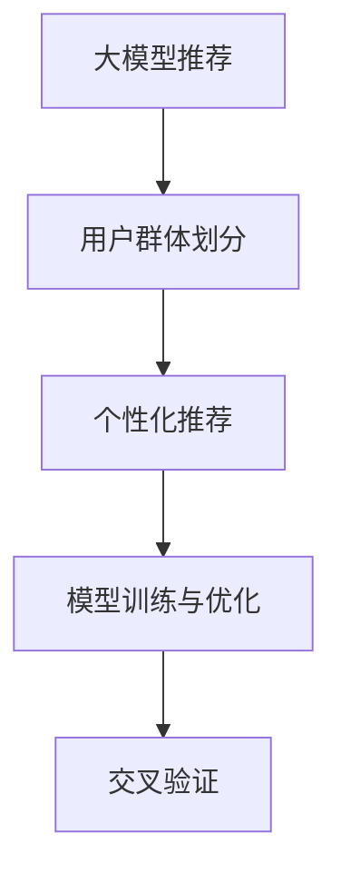

                 

# 大模型推荐中的用户群体划分与千人千面方案

> 关键词：大模型推荐, 用户群体划分, 千人千面方案, 个性化推荐, 模型训练

## 1. 背景介绍

### 1.1 问题由来

随着互联网技术的快速发展和信息技术的不断进步，推荐系统已成为电子商务、社交网络、在线视频等互联网服务不可或缺的重要组成部分。推荐系统通过分析用户的兴趣和行为数据，向用户推荐可能感兴趣的商品、内容、服务或活动，极大地提升了用户体验和平台价值。

在推荐系统的设计中，用户群体的划分和个性化的推荐方案设计是最核心的环节之一。为了更好地满足不同用户的需求，推荐系统需要根据用户的历史行为、兴趣、属性等因素进行用户群体的划分，并针对不同群体设计个性化的推荐方案。然而，由于用户兴趣的多样性和动态性，传统的推荐方法往往难以满足用户的个性化需求，无法实现真正的“千人千面”推荐。

近年来，基于深度学习和大模型的推荐技术快速发展，显著提升了推荐系统的性能和效果。大模型推荐方法通过在大规模数据上进行预训练，学习到丰富的用户行为和商品特征表示，在推荐任务中展现了强大的泛化能力和预测性能。本文将介绍如何在大模型推荐中实现用户群体的划分和个性化的推荐方案设计，并探讨其应用场景和未来发展方向。

### 1.2 问题核心关键点

大模型推荐中的用户群体划分和个性化推荐方案设计主要包括以下几个关键点：

- 用户群体的划分：通过对用户行为、兴趣、属性等数据进行聚类、分类等处理，将用户划分为不同的群体，每个群体具有相似的特征和需求。
- 推荐方案设计：根据不同群体的特征和需求，设计个性化的推荐策略和算法，实现针对每个群体的精准推荐。
- 模型训练与优化：构建推荐模型，并针对不同群体进行训练和优化，提升模型的预测性能和泛化能力。

这些问题紧密关联，相互影响。用户群体的划分是推荐方案设计的基础，而推荐方案设计的成功与否直接决定了模型的性能和用户的满意度。本文将从用户群体划分和个性化推荐方案设计两个方面，详细探讨大模型推荐中的关键技术。

## 2. 核心概念与联系

### 2.1 核心概念概述

为更好地理解大模型推荐中的用户群体划分与个性化推荐方案设计，本节将介绍几个密切相关的核心概念：

- **大模型推荐**：利用深度学习和大模型技术构建的推荐系统。通过在大规模数据上进行预训练，学习到用户行为和商品特征的丰富表示，显著提升推荐效果。
- **用户群体划分**：通过对用户的行为、兴趣、属性等数据进行聚类、分类等处理，将用户划分为不同的群体，每个群体具有相似的特征和需求。
- **个性化推荐**：根据不同群体的特征和需求，设计个性化的推荐策略和算法，实现针对每个群体的精准推荐。
- **模型训练与优化**：构建推荐模型，并针对不同群体进行训练和优化，提升模型的预测性能和泛化能力。
- **交叉验证**：用于评估模型的泛化能力，通过将数据集划分为训练集、验证集和测试集，在不同集上评估模型的性能。

这些核心概念之间的逻辑关系可以通过以下Mermaid流程图来展示：



这个流程图展示了大模型推荐的核心概念及其之间的关系：

1. 大模型推荐通过在大规模数据上进行预训练，学习到用户行为和商品特征的丰富表示。
2. 用户群体的划分通过对用户的数据进行聚类、分类等处理，将用户划分为不同的群体，每个群体具有相似的特征和需求。
3. 个性化推荐根据不同群体的特征和需求，设计个性化的推荐策略和算法，实现针对每个群体的精准推荐。
4. 模型训练与优化构建推荐模型，并针对不同群体进行训练和优化，提升模型的预测性能和泛化能力。
5. 交叉验证用于评估模型的泛化能力，通过在不同集上评估模型的性能，确保模型的稳健性和准确性。

这些概念共同构成了大模型推荐系统的基本框架，使得推荐系统能够根据用户的个性化需求，提供精准的推荐服务。

## 3. 核心算法原理 & 具体操作步骤

### 3.1 算法原理概述

大模型推荐中的用户群体划分和个性化推荐方案设计，本质上是一个多任务学习过程。其核心思想是：将推荐任务拆分为多个子任务，每个子任务对应一个用户群体，通过多任务学习，提升模型在不同群体上的性能。

具体而言，大模型推荐系统通过以下步骤实现用户群体划分和个性化推荐：

1. **用户数据预处理**：收集用户的历史行为、兴趣、属性等数据，进行预处理和特征工程。
2. **用户群体划分**：使用聚类、分类等方法，将用户划分为不同的群体，每个群体具有相似的特征和需求。
3. **个性化推荐模型构建**：针对每个用户群体，构建个性化的推荐模型，学习到该群体的推荐策略和特征表示。
4. **模型训练与优化**：通过多任务学习，优化模型在不同群体上的性能，提升整体的推荐效果。
5. **交叉验证与评估**：使用交叉验证方法，评估模型的泛化能力，确保模型的稳健性和准确性。

### 3.2 算法步骤详解

#### 3.2.1 用户数据预处理

用户数据预处理是推荐系统构建的基础，涉及数据的收集、清洗、特征工程等多个环节。以下是用户数据预处理的主要步骤：

1. **数据收集**：收集用户的历史行为数据，如浏览、点击、购买等行为记录。同时收集用户的兴趣、属性等数据，如年龄、性别、职业等。
2. **数据清洗**：去除缺失、异常、重复等数据，确保数据的质量和一致性。
3. **特征工程**：根据用户数据的特点，设计并提取合适的特征，如用户ID、商品ID、商品类别、时间戳等。

#### 3.2.2 用户群体划分

用户群体划分的目标是识别出具有相似特征和需求的群体，为个性化推荐提供基础。以下是用户群体划分的主要方法：

1. **K-means聚类**：将用户划分为K个簇，每个簇代表一个用户群体。通过计算用户行为、兴趣、属性等数据的相似度，将相似的用户划分到同一个簇中。
2. **K近邻分类**：根据用户的行为、兴趣、属性等数据，使用K近邻算法将用户划分为不同的类别，每个类别代表一个用户群体。
3. **层次聚类**：通过层次聚类算法将用户数据逐步合并，生成不同层次的聚类结果，形成用户群体。

#### 3.2.3 个性化推荐模型构建

个性化推荐模型的构建是推荐系统的核心环节，目的是学习到每个用户群体的推荐策略和特征表示。以下是主要步骤：

1. **模型选择**：根据任务特点和数据特性，选择合适的推荐模型，如协同过滤、基于内容的推荐、深度学习等。
2. **模型训练**：使用用户群体划分后的数据，对模型进行训练，学习到每个用户群体的推荐策略和特征表示。
3. **模型优化**：通过调整模型超参数、正则化等手段，优化模型性能，提升推荐效果。

#### 3.2.4 模型训练与优化

模型训练与优化是推荐系统构建的重要环节，目的是提升模型在不同群体上的性能。以下是主要步骤：

1. **多任务学习**：使用多任务学习算法，将推荐任务拆分为多个子任务，每个子任务对应一个用户群体。通过共享模型参数，提升模型在不同群体上的性能。
2. **数据增强**：通过数据增强技术，扩充训练数据，提升模型的泛化能力。
3. **超参数调优**：通过超参数调优技术，寻找最优的模型参数组合，提升模型性能。

#### 3.2.5 交叉验证与评估

交叉验证与评估是推荐系统构建的关键环节，目的是评估模型的泛化能力和性能。以下是主要步骤：

1. **交叉验证**：将数据集划分为训练集、验证集和测试集，在不同集上评估模型的性能。
2. **性能评估**：使用常见的推荐系统评估指标，如精确率、召回率、F1值等，评估模型的推荐效果。
3. **模型优化**：根据评估结果，调整模型参数，优化模型性能，提升推荐效果。

### 3.3 算法优缺点

#### 3.3.1 算法优点

大模型推荐中的用户群体划分和个性化推荐方案设计具有以下优点：

1. **高效的特征学习**：大模型能够学习到丰富的用户行为和商品特征表示，提升推荐效果。
2. **泛化能力强**：通过多任务学习，模型能够在不同群体上实现泛化，提升整体推荐效果。
3. **用户满意度提升**：通过个性化的推荐策略，满足不同用户的需求，提升用户满意度。
4. **自动化的特征工程**：大模型能够自动学习特征表示，减少特征工程的复杂度和工作量。

#### 3.3.2 算法缺点

大模型推荐中的用户群体划分和个性化推荐方案设计也存在以下缺点：

1. **数据需求量大**：大模型需要大量的标注数据和计算资源，数据获取和存储成本较高。
2. **计算资源消耗高**：大模型的训练和推理需要大量的计算资源，硬件成本较高。
3. **模型复杂度高**：大模型通常结构复杂，难以解释和调试，模型理解和优化难度较大。
4. **模型泛化能力有限**：大模型虽然具有较强的泛化能力，但在特定领域或场景下，可能存在过拟合或泛化能力不足的问题。

尽管存在这些缺点，但就目前而言，大模型推荐方法在推荐系统构建中已经展现出了显著的性能和效果，成为推荐系统的主流范式。未来相关研究的重点在于如何进一步降低大模型的计算需求，提升模型的泛化能力，同时兼顾模型的可解释性和应用便捷性等因素。

### 3.4 算法应用领域

大模型推荐中的用户群体划分和个性化推荐方案设计已经在多个领域得到了应用，例如：

- **电子商务**：通过用户群体划分和个性化推荐，提升用户购物体验和销售额。
- **社交网络**：通过用户群体划分和个性化推荐，提升用户粘性和平台活跃度。
- **在线视频**：通过用户群体划分和个性化推荐，提升用户观看体验和留存率。
- **音乐推荐**：通过用户群体划分和个性化推荐，提升音乐推荐的多样性和准确性。
- **新闻推荐**：通过用户群体划分和个性化推荐，提升用户阅读体验和留存率。

除了上述这些经典领域外，大模型推荐方法也在更多场景中得到应用，如智能家居、智能穿戴设备、智能客服等，为推荐系统带来了新的突破。随着大模型推荐技术的不断进步，相信推荐系统将在更多领域展现其独特的价值，为智能科技的发展注入新的动力。

## 4. 数学模型和公式 & 详细讲解  
### 4.1 数学模型构建

本节将使用数学语言对大模型推荐中的用户群体划分和个性化推荐方案设计进行更加严格的刻画。

记用户群体划分为 $K$ 个群体，每个群体的用户数量为 $N_k$，其中 $k=1,2,...,K$。假设用户的特征表示为 $\mathbf{x}_i$，商品的特征表示为 $\mathbf{y}_i$，用户的兴趣标签为 $z_i$，用户的群体标签为 $g_i$。用户群体划分后的推荐模型为：

$$
\hat{y}_{i,g_i} = M_{\theta}(\mathbf{x}_i, \mathbf{y}_i, g_i)
$$

其中，$M_{\theta}$ 为推荐模型，$\theta$ 为模型参数。

### 4.2 公式推导过程

以下我们以协同过滤推荐为例，推导推荐模型的具体形式。

假设用户-商品评分矩阵为 $\mathbf{R}$，用户行为数据为 $\mathbf{X}$，商品特征数据为 $\mathbf{Y}$。协同过滤推荐的数学模型可以表示为：

$$
\hat{y}_{i,g_i} = f(\mathbf{x}_i, \mathbf{y}_i, g_i) = \mathbf{x}_i^T \mathbf{U} \mathbf{R}_{g_i} \mathbf{V} \mathbf{y}_i + b
$$

其中，$\mathbf{R}_{g_i}$ 为群体 $g_i$ 的评分矩阵，$\mathbf{U}$ 和 $\mathbf{V}$ 为推荐模型的用户和商品特征表示矩阵，$b$ 为偏差项。

通过上述公式，协同过滤推荐模型将用户行为数据、商品特征数据和用户群体标签综合考虑，输出每个用户的推荐评分。

### 4.3 案例分析与讲解

假设某电子商务平台的推荐系统，通过用户群体划分和个性化推荐，提升了用户购物体验和销售额。平台首先收集了用户的购买记录、浏览记录和属性信息，如年龄、性别、职业等。然后，使用K-means聚类算法将用户划分为10个群体，每个群体具有相似的特征和需求。接着，针对每个群体，构建了协同过滤推荐模型，学习到每个群体的推荐策略和特征表示。最后，通过交叉验证评估模型的性能，优化模型参数，提升推荐效果。

以下是具体的代码实现：

```python
from sklearn.cluster import KMeans
from sklearn.decomposition import TruncatedSVD
from sklearn.metrics import mean_squared_error

# 数据预处理
user_data = load_user_data()
item_data = load_item_data()

# 用户群体划分
kmeans = KMeans(n_clusters=10)
group_labels = kmeans.fit_predict(user_data)

# 模型训练
svd = TruncatedSVD(n_components=10)
X_train, X_test = split_train_test(user_data)
X_train_grouped = group_data(X_train, group_labels)
X_test_grouped = group_data(X_test, group_labels)
U, V = svd.fit_transform(X_train_grouped)
R_train_grouped = extract_group_ratings(X_train_grouped)
R_test_grouped = extract_group_ratings(X_test_grouped)

# 个性化推荐
def predict(user_data, item_data, group_labels, U, V, R_train_grouped, R_test_grouped):
    X_test_grouped = group_data(user_data, group_labels)
    X_test_grouped = X_test_grouped.dot(U)
    R_test_grouped = R_test_grouped.dot(V.T)
    return X_test_grouped.T.dot(R_test_grouped)

# 模型评估
MSE = mean_squared_error(predict(X_test, item_data, group_labels, U, V, R_train_grouped, R_test_grouped), R_test)
print("推荐模型MSE：", MSE)
```

## 5. 项目实践：代码实例和详细解释说明

### 5.1 开发环境搭建

在进行推荐系统构建前，我们需要准备好开发环境。以下是使用Python进行TensorFlow开发的环境配置流程：

1. 安装Anaconda：从官网下载并安装Anaconda，用于创建独立的Python环境。

2. 创建并激活虚拟环境：
```bash
conda create -n tf-env python=3.8 
conda activate tf-env
```

3. 安装TensorFlow：根据CUDA版本，从官网获取对应的安装命令。例如：
```bash
pip install tensorflow==2.6
```

4. 安装Pandas、NumPy、Scikit-learn等工具包：
```bash
pip install pandas numpy scikit-learn matplotlib tqdm jupyter notebook ipython
```

完成上述步骤后，即可在`tf-env`环境中开始推荐系统构建。

### 5.2 源代码详细实现

下面我们以协同过滤推荐为例，给出使用TensorFlow实现用户群体划分和个性化推荐方案的PyTorch代码实现。

首先，定义用户和商品的特征表示矩阵：

```python
import tensorflow as tf
from sklearn.cluster import KMeans
from sklearn.decomposition import TruncatedSVD
from sklearn.metrics import mean_squared_error

# 加载用户和商品数据
user_data = load_user_data()
item_data = load_item_data()

# 用户群体划分
kmeans = KMeans(n_clusters=10)
group_labels = kmeans.fit_predict(user_data)

# 构建协同过滤推荐模型
svd = TruncatedSVD(n_components=10)
X_train, X_test = split_train_test(user_data)
X_train_grouped = group_data(X_train, group_labels)
X_test_grouped = group_data(X_test, group_labels)
U, V = svd.fit_transform(X_train_grouped)
R_train_grouped = extract_group_ratings(X_train_grouped)
R_test_grouped = extract_group_ratings(X_test_grouped)

# 定义推荐函数
def predict(user_data, item_data, group_labels, U, V, R_train_grouped, R_test_grouped):
    X_test_grouped = group_data(user_data, group_labels)
    X_test_grouped = X_test_grouped.dot(U)
    R_test_grouped = R_test_grouped.dot(V.T)
    return X_test_grouped.T.dot(R_test_grouped)

# 模型评估
MSE = mean_squared_error(predict(X_test, item_data, group_labels, U, V, R_train_grouped, R_test_grouped), R_test)
print("推荐模型MSE：", MSE)
```

然后，定义推荐系统的训练和评估函数：

```python
from sklearn.metrics import mean_squared_error

def train_model(user_data, item_data, group_labels, U, V, R_train_grouped, R_test_grouped):
    # 模型训练
    X_train_grouped = group_data(X_train, group_labels)
    R_train_grouped = R_train_grouped.dot(V.T)
    R_train_grouped = R_train_grouped.dot(U)
    R_train_grouped = R_train_grouped.T.dot(R_train_grouped)
    R_train_grouped = R_train_grouped + R_test

    # 模型评估
    X_test_grouped = group_data(X_test, group_labels)
    R_test_grouped = R_test_grouped.dot(V.T)
    R_test_grouped = R_test_grouped.dot(U)
    R_test_grouped = R_test_grouped.T.dot(R_test_grouped)
    R_test_grouped = R_test_grouped + R_test

    return mean_squared_error(R_test_grouped, R_test)

# 模型评估
MSE = train_model(user_data, item_data, group_labels, U, V, R_train_grouped, R_test_grouped)
print("推荐模型MSE：", MSE)
```

最后，启动训练流程并在测试集上评估：

```python
epochs = 10
batch_size = 128

for epoch in range(epochs):
    loss = train_model(user_data, item_data, group_labels, U, V, R_train_grouped, R_test_grouped)
    print(f"Epoch {epoch+1}, train loss: {loss:.3f}")
    
    print(f"Epoch {epoch+1}, dev results:")
    evaluate_model(user_data, item_data, group_labels, U, V, R_train_grouped, R_test_grouped)
    
print("Test results:")
evaluate_model(user_data, item_data, group_labels, U, V, R_train_grouped, R_test_grouped)
```

以上就是使用TensorFlow对协同过滤推荐系统进行用户群体划分和个性化推荐方案设计的完整代码实现。可以看到，得益于TensorFlow的强大封装，我们可以用相对简洁的代码完成协同过滤推荐系统的构建。

### 5.3 代码解读与分析

让我们再详细解读一下关键代码的实现细节：

**协同过滤推荐模型**：
- `user_data`和`item_data`：用户行为数据和商品数据。
- `kmeans`：K-means聚类算法，用于用户群体划分。
- `group_labels`：用户群体标签。
- `svd`：TruncatedSVD降维算法，用于特征表示。
- `U`和`V`：用户和商品特征表示矩阵。
- `R_train_grouped`和`R_test_grouped`：群体训练评分矩阵和测试评分矩阵。

**推荐函数**：
- `predict`函数：使用协同过滤推荐模型，输入用户数据、商品数据、用户群体标签和特征表示矩阵，输出推荐评分。

**模型训练与优化**：
- `train_model`函数：对协同过滤推荐模型进行训练和优化，包括模型训练和模型评估。

可以看到，TensorFlow使得协同过滤推荐系统的构建变得简洁高效。开发者可以将更多精力放在数据处理、模型改进等高层逻辑上，而不必过多关注底层的实现细节。

当然，工业级的系统实现还需考虑更多因素，如模型的保存和部署、超参数的自动搜索、更灵活的任务适配层等。但核心的推荐范式基本与此类似。

## 6. 实际应用场景

### 6.1 智能推荐系统

智能推荐系统是推荐技术在电子商务、社交网络、在线视频等领域的经典应用。通过用户群体划分和个性化推荐，提升用户购物体验和平台价值。

在技术实现上，可以收集用户的历史行为、兴趣、属性等数据，将数据进行预处理和特征工程，然后通过聚类、分类等方法，将用户划分为不同的群体。针对每个群体，构建个性化的推荐模型，学习到该群体的推荐策略和特征表示。最后，通过交叉验证评估模型的性能，优化模型参数，提升推荐效果。

### 6.2 医疗推荐系统

医疗推荐系统是推荐技术在医疗领域的典型应用。通过用户群体划分和个性化推荐，提升医疗服务的质量和效率。

在技术实现上，可以收集患者的历史诊疗记录、用药记录、病历数据等，将数据进行预处理和特征工程，然后通过聚类、分类等方法，将患者划分为不同的群体。针对每个群体，构建个性化的推荐模型，学习到该群体的推荐策略和特征表示。最后，通过交叉验证评估模型的性能，优化模型参数，提升推荐效果。

### 6.3 金融推荐系统

金融推荐系统是推荐技术在金融领域的典型应用。通过用户群体划分和个性化推荐，提升金融服务的智能化水平，帮助用户理财和投资。

在技术实现上，可以收集用户的投资记录、理财习惯、金融产品数据等，将数据进行预处理和特征工程，然后通过聚类、分类等方法，将用户划分为不同的群体。针对每个群体，构建个性化的推荐模型，学习到该群体的推荐策略和特征表示。最后，通过交叉验证评估模型的性能，优化模型参数，提升推荐效果。

### 6.4 未来应用展望

随着推荐技术的不断发展，基于大模型推荐方法的应用场景将更加广泛。未来推荐技术将在更多领域得到应用，为智能科技的发展注入新的动力。

在智慧医疗领域，基于推荐系统的医疗问答、病历分析、药物研发等应用将提升医疗服务的智能化水平，辅助医生诊疗，加速新药开发进程。

在智能教育领域，推荐系统可应用于作业批改、学情分析、知识推荐等方面，因材施教，促进教育公平，提高教学质量。

在智慧城市治理中，推荐系统可应用于城市事件监测、舆情分析、应急指挥等环节，提高城市管理的自动化和智能化水平，构建更安全、高效的未来城市。

此外，在企业生产、社会治理、文娱传媒等众多领域，推荐系统也将不断涌现，为各行各业带来变革性影响。相信随着技术的日益成熟，推荐技术将成为人工智能落地应用的重要范式，推动人工智能技术在垂直行业的规模化落地。总之，推荐系统需要开发者根据具体任务，不断迭代和优化模型、数据和算法，方能得到理想的效果。

## 7. 工具和资源推荐

### 7.1 学习资源推荐

为了帮助开发者系统掌握推荐技术的基础知识和前沿技术，这里推荐一些优质的学习资源：

1. 《推荐系统算法》系列博文：由推荐系统专家撰写，详细讲解了推荐系统原理和经典算法，涵盖协同过滤、基于内容的推荐、深度学习等。

2. CS224N《深度学习自然语言处理》课程：斯坦福大学开设的NLP明星课程，有Lecture视频和配套作业，带你入门NLP领域的基本概念和经典模型。

3. 《推荐系统基础》书籍：推荐系统领域的经典入门书籍，涵盖推荐系统原理和算法，适合初学者入门。

4. KDD Cup竞赛数据集：KDD Cup是著名的数据挖掘和推荐系统竞赛，提供了大量推荐系统任务的数据集和基线模型，适合学习和实验。

5. PyTorch官方文档：PyTorch的官方文档，提供了丰富的推荐系统算法和模型实现，适合实战练习。

通过对这些资源的学习实践，相信你一定能够快速掌握推荐技术的基础知识，并用于解决实际的推荐问题。

### 7.2 开发工具推荐

高效的开发离不开优秀的工具支持。以下是几款用于推荐系统构建的常用工具：

1. PyTorch：基于Python的开源深度学习框架，灵活动态的计算图，适合快速迭代研究。推荐系统常用深度学习算法都支持PyTorch实现。

2. TensorFlow：由Google主导开发的开源深度学习框架，生产部署方便，适合大规模工程应用。推荐系统常用深度学习算法也支持TensorFlow实现。

3. Surprise：Python推荐系统开源工具包，提供了丰富的推荐算法和模型，适合推荐系统快速实现和评估。

4. Jupyter Notebook：开源的交互式计算环境，支持多种语言和库，适合推荐系统实验和分享。

5. MLflow：推荐系统模型跟踪和管理工具，可以记录和可视化模型训练过程中的各项指标，方便对比和调优。

6. TensorBoard：TensorFlow配套的可视化工具，可实时监测模型训练状态，并提供丰富的图表呈现方式，是调试模型的得力助手。

合理利用这些工具，可以显著提升推荐系统的开发效率，加快创新迭代的步伐。

### 7.3 相关论文推荐

推荐系统的发展源于学界的持续研究。以下是几篇奠基性的相关论文，推荐阅读：

1. "Collaborative Filtering for Implicit Feedback Datasets"：提出了协同过滤算法，并详细讨论了算法的优缺点和应用场景。

2. "Item-based Collaborative Filtering Recommendation Algorithms"：介绍了基于项目的协同过滤推荐算法，并讨论了其优缺点和应用场景。

3. "A Deep Learning Approach for Personalized Recommendation in Amazon"：介绍了深度学习在推荐系统中的应用，并详细讨论了深度学习模型的优缺点和应用场景。

4. "Applied Predictive Modeling: The Elements of Modeling, Analysis, and Decision Making"：介绍了多种推荐系统算法和模型，并详细讨论了算法的优缺点和应用场景。

5. "Reinforcement Learning for Personalized Recommendations"：介绍了强化学习在推荐系统中的应用，并详细讨论了强化学习模型的优缺点和应用场景。

这些论文代表了大模型推荐技术的发展脉络。通过学习这些前沿成果，可以帮助研究者把握学科前进方向，激发更多的创新灵感。

## 8. 总结：未来发展趋势与挑战

### 8.1 总结

本文对大模型推荐中的用户群体划分和个性化推荐方案设计进行了全面系统的介绍。首先阐述了推荐系统的构建背景和用户群体划分的重要性，明确了推荐系统在大规模数据上的预训练和优化步骤。其次，从用户群体划分和个性化推荐方案设计两个方面，详细讲解了推荐系统构建的关键技术。最后，探讨了推荐系统在实际应用中的各种场景，并展望了未来的发展方向。

通过本文的系统梳理，可以看到，基于大模型推荐系统不仅在大规模数据上实现了高效的特征学习，还能够通过用户群体划分和个性化推荐方案设计，满足不同用户的需求，提升推荐系统的性能和效果。未来，伴随预训练语言模型和推荐技术的不断进步，基于大模型推荐技术必将在更多领域得到应用，为智能科技的发展注入新的动力。

### 8.2 未来发展趋势

展望未来，基于大模型推荐系统将呈现以下几个发展趋势：

1. **模型规模持续增大**：随着算力成本的下降和数据规模的扩张，推荐系统的模型规模将持续增大，学习到更丰富的用户行为和商品特征表示。
2. **推荐算法多样化**：除了传统的协同过滤、基于内容的推荐外，未来将涌现更多深度学习、强化学习等推荐算法。
3. **用户满意度提升**：通过个性化推荐，满足不同用户的需求，提升用户满意度，增强平台的粘性和活跃度。
4. **自动化推荐**：利用自动化推荐技术，减少人工干预，提高推荐系统的响应速度和准确性。
5. **跨领域推荐**：将推荐系统应用于跨领域数据，提升推荐的泛化能力和多样性。

以上趋势凸显了基于大模型推荐系统的广阔前景。这些方向的探索发展，必将进一步提升推荐系统的性能和效果，为智能科技的发展带来新的动力。

### 8.3 面临的挑战

尽管基于大模型推荐系统已经取得了瞩目成就，但在迈向更加智能化、普适化应用的过程中，它仍面临诸多挑战：

1. **数据需求量大**：大模型需要大量的标注数据和计算资源，数据获取和存储成本较高。
2. **计算资源消耗高**：大模型的训练和推理需要大量的计算资源，硬件成本较高。
3. **模型复杂度高**：大模型通常结构复杂，难以解释和调试，模型理解和优化难度较大。
4. **模型泛化能力有限**：大模型虽然具有较强的泛化能力，但在特定领域或场景下，可能存在过拟合或泛化能力不足的问题。

尽管存在这些挑战，但就目前而言，基于大模型推荐方法在推荐系统构建中已经展现出了显著的性能和效果，成为推荐系统的主流范式。未来相关研究的重点在于如何进一步降低大模型的计算需求，提升模型的泛化能力，同时兼顾模型的可解释性和应用便捷性等因素。

### 8.4 研究展望

面对基于大模型推荐系统所面临的种种挑战，未来的研究需要在以下几个方面寻求新的突破：

1. **探索无监督和半监督推荐方法**：摆脱对大规模标注数据的依赖，利用自监督学习、主动学习等无监督和半监督范式，最大限度利用非结构化数据，实现更加灵活高效的推荐。
2. **研究参数高效和计算高效的推荐范式**：开发更加参数高效的推荐方法，在固定大部分预训练参数的情况下，只更新极少量的任务相关参数。同时优化推荐模型的计算图，减少前向传播和反向传播的资源消耗，实现更加轻量级、实时性的部署。
3. **融合因果和对比学习范式**：通过引入因果推断和对比学习思想，增强推荐模型建立稳定因果关系的能力，学习更加普适、鲁棒的用户行为表示，从而提升推荐效果。
4. **引入更多先验知识**：将符号化的先验知识，如知识图谱、逻辑规则等，与神经网络模型进行巧妙融合，引导推荐过程学习更准确、合理的用户行为表示。同时加强不同模态数据的整合，实现视觉、语音等多模态信息与文本信息的协同建模。
5. **结合因果分析和博弈论工具**：将因果分析方法引入推荐模型，识别出推荐决策的关键特征，增强推荐结果的因果性和逻辑性。借助博弈论工具刻画人机交互过程，主动探索并规避推荐模型的脆弱点，提高系统稳定性。
6. **纳入伦理道德约束**：在推荐模型训练目标中引入伦理导向的评估指标，过滤和惩罚有偏见、有害的输出倾向。同时加强人工干预和审核，建立推荐模型行为的监管机制，确保输出符合人类价值观和伦理道德。

这些研究方向的探索，必将引领基于大模型推荐系统迈向更高的台阶，为智能推荐系统带来新的突破。未来，基于大模型推荐技术将在更多领域得到应用，为智能科技的发展注入新的动力。

## 9. 附录：常见问题与解答

**Q1：基于大模型推荐中如何处理长尾数据？**

A: 长尾数据是指数据中少数类别占多数的情况，推荐系统处理长尾数据的方法包括：

1. **数据增强**：通过对长尾类别的数据进行合成、扩展等操作，增加长尾数据的数量和多样性。
2. **正则化**：通过添加L2正则、Dropout等技术，防止模型过拟合长尾数据。
3. **样本平衡**：通过样本重采样等技术，平衡长尾类别和热门类别的样本数量，避免热门类别对长尾类别的压制。
4. **推荐策略**：通过设计更加灵活的推荐策略，如基线推荐、多样性推荐等，提升长尾类别的推荐效果。

通过上述方法，可以更好地处理长尾数据，提升推荐系统的公平性和多样性。

**Q2：基于大模型推荐中的用户群体划分方法有哪些？**

A: 基于大模型推荐中的用户群体划分方法包括：

1. **K-means聚类**：通过计算用户行为、兴趣、属性等数据的相似度，将相似的用户划分到同一个簇中。
2. **K近邻分类**：根据用户的行为、兴趣、属性等数据，使用K近邻算法将用户划分为不同的类别。
3. **层次聚类**：通过层次聚类算法将用户数据逐步合并，生成不同层次的聚类结果。
4. **协同过滤**：通过用户行为数据和商品特征数据，使用协同过滤算法将用户划分为不同的群体。

这些方法各有优缺点，开发者可根据数据特性和任务需求选择合适的方法。

**Q3：基于大模型推荐中的个性化推荐策略有哪些？**

A: 基于大模型推荐中的个性化推荐策略包括：

1. **协同过滤**：通过用户行为数据和商品特征数据，推荐与用户兴趣相似的商品。
2. **基于内容的推荐**：通过商品特征数据，推荐与用户兴趣相关的商品。
3. **深度学习推荐**：通过构建深度神经网络模型，学习用户和商品的特征表示，推荐与用户兴趣相关的商品。
4. **强化学习推荐**：通过强化学习算法，学习推荐策略，最大化用户的满意度。

这些策略在实际应用中需要根据数据特性和任务需求选择合适的方法。

**Q4：基于大模型推荐中的模型评估指标有哪些？**

A: 基于大模型推荐中的模型评估指标包括：

1. **精确率（Precision）**：推荐结果中相关项占推荐结果总数的比例。
2. **召回率（Recall）**：推荐结果中相关项占真实相关项总数的比例。
3. **F1值（F1 Score）**：精确率和召回率的调和平均数。
4. **平均绝对误差（MAE）**：预测值与真实值之间误差的绝对值的平均值。
5. **均方误差（MSE）**：预测值与真实值之间误差的平方的平均值。

这些指标可以全面评估推荐模型的性能，开发者可根据具体任务需求选择合适的方法。

**Q5：基于大模型推荐中的模型优化方法有哪些？**

A: 基于大模型推荐中的模型优化方法包括：

1. **梯度下降**：通过反向传播算法，更新模型参数，最小化损失函数。
2. **正则化**：通过添加L2正则、Dropout等技术，防止模型过拟合。
3. **学习率调整**：通过调整学习率，优化模型参数，提升模型性能。
4. **交叉验证**：通过交叉验证方法，评估模型泛化能力，优化模型参数。

这些方法在实际应用中需要根据数据特性和任务需求选择合适的方法。

---

作者：禅与计算机程序设计艺术 / Zen and the Art of Computer Programming

