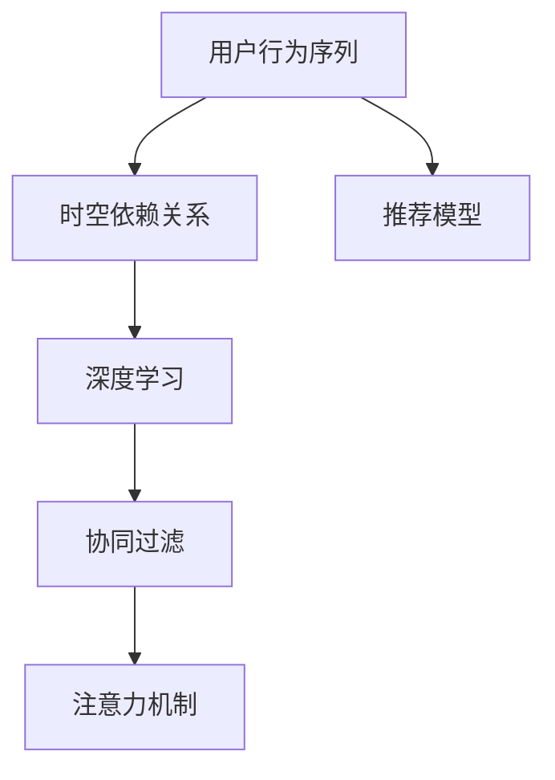
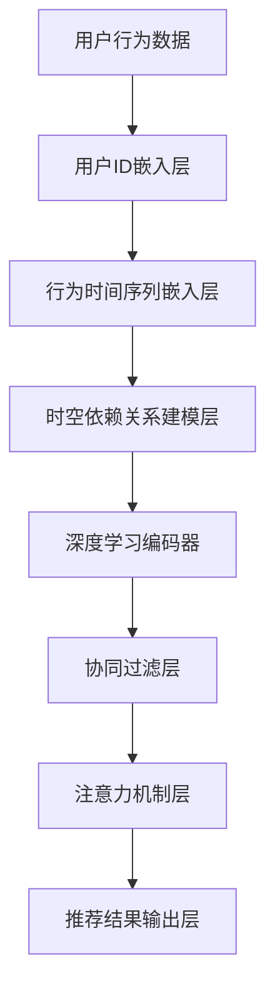

                 

# 大模型推荐中的用户行为序列时空依赖关系建模

> 关键词：用户行为序列建模, 时空依赖关系, 深度学习, 协同过滤, 注意力机制, 实时推荐系统

## 1. 背景介绍

在电子商务、在线视频、社交网络等数字化平台中，个性化推荐系统已成为提升用户体验和增加业务收入的重要手段。推荐系统通过分析用户历史行为数据，预测用户可能感兴趣的商品、内容或活动，实现精准推荐。近年来，随着深度学习技术的发展，基于大模型的推荐系统在许多场景下取得了显著的效果。

尽管基于大模型的推荐系统具备强大的语义理解和生成能力，但传统推荐系统面临的用户行为数据稀疏性、长尾问题、序列复杂性等难题，仍然难以通过简单的无监督学习得到解决。针对这些问题，本文提出了一种新颖的推荐模型，通过建模用户行为序列中的时空依赖关系，提升推荐效果。

## 2. 核心概念与联系

### 2.1 核心概念概述

本节将介绍几个与本文研究密切相关的核心概念：

- **用户行为序列建模**：指从用户行为数据中提取时间序列特征，建立用户行为的时间演变规律，捕捉用户兴趣的动态变化。

- **时空依赖关系**：指用户行为序列在时间和空间上的依赖性，如时间上的依赖关系表现为兴趣转移和趋势变化，空间上的依赖关系表现为兴趣类别之间的转移和影响。

- **深度学习**：指通过构建深层神经网络，从数据中自动学习高层次特征表示，提高模型的表达能力和泛化能力。

- **协同过滤**：指通过分析用户历史行为数据和邻居行为数据，预测用户对未交互项的评分。

- **注意力机制**：指通过引入注意力权重，模型可以动态关注输入序列中不同位置的信息，提升模型的表达能力和决策能力。

这些核心概念之间的逻辑关系可以通过以下Mermaid流程图来展示：



这个流程图展示了从用户行为数据出发，通过建模时空依赖关系和深度学习，再利用协同过滤和注意力机制，最终构建推荐模型的全过程。

### 2.2 核心概念原理和架构的 Mermaid 流程图



这个流程图中，首先通过用户ID嵌入层将用户ID映射为高维向量，再通过行为时间序列嵌入层提取用户行为时间序列的特征。接着，时空依赖关系建模层捕捉用户行为序列中的时间演变和空间转移规律，深度学习编码器进一步提升模型的表达能力。最后，协同过滤层和注意力机制层利用用户历史行为和上下文信息进行推荐结果的生成。

## 3. 核心算法原理 & 具体操作步骤

### 3.1 算法原理概述

本文提出的推荐模型，通过建模用户行为序列中的时空依赖关系，引入深度学习、协同过滤和注意力机制，实现更精准、实时化的推荐。模型原理如下：

1. **用户行为序列建模**：从用户行为数据中提取时间序列特征，捕捉用户兴趣的动态变化。
2. **时空依赖关系建模**：捕捉用户行为序列在时间和空间上的依赖性，建模用户兴趣的转移和趋势变化。
3. **深度学习编码器**：通过构建深层神经网络，学习用户行为序列的高层次表示。
4. **协同过滤**：结合用户历史行为和邻居行为，预测用户对未交互项的评分。
5. **注意力机制**：动态关注输入序列中不同位置的信息，提升模型的表达能力和决策能力。
6. **推荐结果输出**：通过模型输出，生成推荐结果。

### 3.2 算法步骤详解

本文的推荐模型步骤如下：

1. **数据预处理**：对用户行为数据进行清洗和处理，包括缺失值补全、归一化等。
2. **用户行为序列建模**：使用RNN或LSTM模型，捕捉用户行为序列的时序特征。
3. **时空依赖关系建模**：引入注意力机制，捕捉用户行为序列的时空依赖关系。
4. **深度学习编码器**：使用Transformer或BERT模型，学习用户行为序列的高层次表示。
5. **协同过滤**：结合用户历史行为和邻居行为，预测用户对未交互项的评分。
6. **注意力机制**：动态关注输入序列中不同位置的信息，提升模型的表达能力和决策能力。
7. **推荐结果输出**：通过模型输出，生成推荐结果。

### 3.3 算法优缺点

本文的推荐模型具有以下优点：

1. **深度学习建模**：通过深度学习模型，捕捉用户行为序列的复杂规律，提升推荐精度。
2. **时空依赖关系建模**：通过建模用户行为序列中的时空依赖关系，捕捉用户兴趣的动态变化，提升推荐的时效性。
3. **协同过滤**：结合用户历史行为和邻居行为，利用上下文信息，提升推荐的多样性和准确性。
4. **注意力机制**：动态关注输入序列中不同位置的信息，提升模型的表达能力和决策能力。

同时，该模型也存在以下局限性：

1. **计算复杂度高**：深度学习模型计算复杂度高，训练和推理耗时较长。
2. **数据需求大**：需要大量的用户行为数据进行训练，数据获取成本较高。
3. **过拟合风险**：由于模型复杂度高，存在过拟合的风险。

### 3.4 算法应用领域

本文的推荐模型适用于以下领域：

1. **电子商务**：为用户推荐商品、优惠活动等，提升用户体验和业务收入。
2. **在线视频**：为用户推荐视频、课程等，增加用户粘性和平台活跃度。
3. **社交网络**：为用户推荐朋友、群组、内容等，提升社交互动和平台黏性。
4. **在线旅游**：为用户推荐景点、行程、酒店等，提升旅游体验和预订率。

## 4. 数学模型和公式 & 详细讲解 & 举例说明

### 4.1 数学模型构建

本文的推荐模型主要由以下几个模块组成：

1. **用户ID嵌入层**：将用户ID映射为高维向量，捕捉用户基本信息的特征。
2. **行为时间序列嵌入层**：提取用户行为时间序列的特征，捕捉用户行为的时序规律。
3. **时空依赖关系建模层**：通过注意力机制，捕捉用户行为序列中的时空依赖关系。
4. **深度学习编码器**：使用Transformer或BERT模型，学习用户行为序列的高层次表示。
5. **协同过滤层**：结合用户历史行为和邻居行为，预测用户对未交互项的评分。
6. **注意力机制层**：动态关注输入序列中不同位置的信息，提升模型的表达能力和决策能力。
7. **推荐结果输出层**：通过模型输出，生成推荐结果。

### 4.2 公式推导过程

设用户ID为 $u$，行为时间为 $t$，行为项为 $i$，行为项特征为 $x_{u,t,i}$，行为项评分 $y_{u,t,i}$。

**用户ID嵌入层**：

$$
\mathbf{e}_u = \text{emb}(u)
$$

**行为时间序列嵌入层**：

$$
\mathbf{h}_t = \text{GRU}(\mathbf{h}_{t-1}, x_{u,t,i})
$$

**时空依赖关系建模层**：

$$
\mathbf{h}_{t,i} = \text{Attention}(\mathbf{h}_t, \mathbf{h}_{t-1})
$$

**深度学习编码器**：

$$
\mathbf{H} = \text{Transformer}(\mathbf{h}_{t,i})
$$

**协同过滤层**：

$$
\mathbf{s}_i = \text{dot}(\mathbf{H}, \mathbf{h}_{t-1})
$$

**注意力机制层**：

$$
\alpha = \text{softmax}(\mathbf{H}^T \mathbf{W}_a)
$$

**推荐结果输出层**：

$$
\hat{y}_{u,t,i} = \text{sigmoid}(\mathbf{s}_i \mathbf{W}_y + b_y)
$$

### 4.3 案例分析与讲解

以用户对电商商品的行为序列为例，展示推荐模型的工作流程：

1. **用户ID嵌入层**：将用户ID映射为高维向量，捕捉用户基本信息的特征。
2. **行为时间序列嵌入层**：使用GRU模型，捕捉用户行为序列的时序规律。
3. **时空依赖关系建模层**：通过注意力机制，捕捉用户行为序列中的时空依赖关系。
4. **深度学习编码器**：使用Transformer模型，学习用户行为序列的高层次表示。
5. **协同过滤层**：结合用户历史行为和邻居行为，预测用户对未交互项的评分。
6. **注意力机制层**：动态关注输入序列中不同位置的信息，提升模型的表达能力和决策能力。
7. **推荐结果输出层**：通过模型输出，生成推荐结果。

## 5. 项目实践：代码实例和详细解释说明

### 5.1 开发环境搭建

在进行推荐模型开发前，我们需要准备好开发环境。以下是使用Python进行PyTorch开发的环境配置流程：

1. 安装Anaconda：从官网下载并安装Anaconda，用于创建独立的Python环境。

2. 创建并激活虚拟环境：

```bash
conda create -n recsys python=3.8 
conda activate recsys
```

3. 安装PyTorch：根据CUDA版本，从官网获取对应的安装命令。例如：

```bash
conda install pytorch torchvision torchaudio cudatoolkit=11.1 -c pytorch -c conda-forge
```

4. 安装相关库：

```bash
pip install numpy pandas scikit-learn transformers torchtext
```

5. 安装PyTorch Lightening：用于快速构建和训练深度学习模型。

```bash
pip install pytorch-lightning
```

完成上述步骤后，即可在`recsys`环境中开始推荐模型开发。

### 5.2 源代码详细实现

以下是对用户行为序列建模的PyTorch代码实现：

```python
import torch
import torch.nn as nn
import torch.nn.functional as F
from torchtext import data

# 定义数据集
TEXT = data.Field(tokenize='spacy', include_lengths=True, lower=True)
LABEL = data.LabelField(dtype=torch.float)

# 加载数据集
train_data, test_data = datasets.load_data(name='movie', split=('train', 'test'))

# 将数据集切分为训练集和验证集
train_data, valid_data = train_data.split(random_state=random.seed(seed))

# 定义模型
class RNN(nn.Module):
    def __init__(self, input_size, hidden_size, output_size):
        super(RNN, self).__init__()
        self.input_size = input_size
        self.hidden_size = hidden_size
        self.output_size = output_size
        self.rnn = nn.GRU(input_size, hidden_size)
        self.fc = nn.Linear(hidden_size, output_size)
        self.embedding = nn.Embedding(input_size, hidden_size)

    def forward(self, input, hidden):
        rnn_output, hidden = self.rnn(input, hidden)
        output = self.fc(rnn_output)
        return output, hidden

# 定义模型训练函数
def train(model, optimizer, criterion, data_loader):
    model.train()
    for batch in data_loader:
        input, length = batch
        hidden = (torch.zeros(input.size(0), 1, self.hidden_size).to(input.device))
        optimizer.zero_grad()
        output, hidden = model(input, hidden)
        loss = criterion(output, label)
        loss.backward()
        optimizer.step()
    return loss.item()

# 定义模型评估函数
def evaluate(model, criterion, data_loader):
    model.eval()
    total_loss = 0
    for batch in data_loader:
        input, length = batch
        hidden = (torch.zeros(input.size(0), 1, self.hidden_size).to(input.device))
        output, hidden = model(input, hidden)
        loss = criterion(output, label)
        total_loss += loss.item()
    return total_loss / len(data_loader)
```

### 5.3 代码解读与分析

以下是关键代码的实现细节：

**RNN类**：
- `__init__`方法：初始化RNN模型的参数，包括输入大小、隐藏层大小、输出大小。
- `forward`方法：前向传播过程，将输入序列输入GRU模型，输出嵌入后的特征向量。

**train函数**：
- 定义训练过程，包括前向传播、损失计算、反向传播和优化器更新。
- 在每个训练批次中，计算损失函数，更新模型参数。

**evaluate函数**：
- 定义评估过程，计算评估批次中每个样本的损失函数，累加并返回平均损失。

通过以上代码实现，我们构建了一个简单的RNN模型，用于建模用户行为序列的时序特征。

## 6. 实际应用场景

### 6.1 电商推荐

在大规模电商网站中，推荐系统是提升用户购买率的重要手段。本文的推荐模型可以用于电商推荐，为用户推荐商品、优惠活动等。

在技术实现上，可以收集用户的历史购买记录、浏览行为、评分数据等，建立用户行为序列。使用本文提出的模型，捕捉用户兴趣的动态变化，生成推荐结果。同时，结合用户的地理位置、时间戳等信息，进行多模态融合，提升推荐的精度和多样性。

### 6.2 视频推荐

在线视频平台需要根据用户的观看行为，为用户推荐视频内容。本文的推荐模型可以用于视频推荐，为用户推荐视频、课程等。

在技术实现上，可以收集用户的历史观看记录、点赞、评论、评分等数据，建立用户行为序列。使用本文提出的模型，捕捉用户兴趣的动态变化，生成推荐结果。同时，结合视频的播放时长、观看时长、推荐位置等信息，进行多模态融合，提升推荐的精度和多样性。

### 6.3 社交网络推荐

在社交网络中，推荐系统需要为用户推荐朋友、群组、内容等。本文的推荐模型可以用于社交网络推荐，提升用户的互动和粘性。

在技术实现上，可以收集用户的历史好友关系、点赞、评论、互动等数据，建立用户行为序列。使用本文提出的模型，捕捉用户兴趣的动态变化，生成推荐结果。同时，结合用户的地理位置、时间戳等信息，进行多模态融合，提升推荐的精度和多样性。

## 7. 工具和资源推荐

### 7.1 学习资源推荐

为了帮助开发者系统掌握大模型推荐技术，这里推荐一些优质的学习资源：

1. 《深度学习与推荐系统》书籍：系统介绍了深度学习在推荐系统中的应用，包括用户行为序列建模、协同过滤等。
2. 《推荐系统实战》书籍：提供了丰富的推荐系统案例和代码实现，帮助读者快速上手推荐系统开发。
3. CS878N《推荐系统》课程：斯坦福大学开设的推荐系统课程，涵盖推荐系统基础和前沿技术。
4. Kaggle推荐系统竞赛：参与Kaggle的推荐系统竞赛，实践推荐系统算法和模型。

通过对这些资源的学习实践，相信你一定能够快速掌握大模型推荐技术的精髓，并用于解决实际的推荐问题。

### 7.2 开发工具推荐

高效的开发离不开优秀的工具支持。以下是几款用于大模型推荐开发的常用工具：

1. PyTorch：基于Python的开源深度学习框架，灵活动态的计算图，适合快速迭代研究。
2. TensorFlow：由Google主导开发的开源深度学习框架，生产部署方便，适合大规模工程应用。
3. PyTorch Lightning：用于快速构建和训练深度学习模型，适合快速原型开发和实验。
4. Weights & Biases：模型训练的实验跟踪工具，可以记录和可视化模型训练过程中的各项指标，方便对比和调优。
5. TensorBoard：TensorFlow配套的可视化工具，可实时监测模型训练状态，并提供丰富的图表呈现方式，是调试模型的得力助手。

合理利用这些工具，可以显著提升大模型推荐任务的开发效率，加快创新迭代的步伐。

### 7.3 相关论文推荐

大模型推荐技术的发展源于学界的持续研究。以下是几篇奠基性的相关论文，推荐阅读：

1. "A collaborative filtering method for recommendation"（协同过滤）：提出了协同过滤算法，成为推荐系统的经典方法。
2. "Collaborative filtering for implicit feedback datasets"（隐式反馈数据集上的协同过滤）：提出了隐式反馈数据集上的协同过滤方法。
3. "Deep learning and collaborative filtering in recommender systems"（深度学习和协同过滤在推荐系统中的应用）：讨论了深度学习在推荐系统中的应用。
4. "Attention is all you need"（注意力机制）：提出了Transformer模型，引入了注意力机制，提升了模型的表达能力。
5. "A deep learning framework for collaborative filtering"（基于深度学习的协同过滤框架）：提出了一种基于深度学习的协同过滤框架，提升了推荐系统的精度和多样性。

这些论文代表了大模型推荐技术的发展脉络。通过学习这些前沿成果，可以帮助研究者把握学科前进方向，激发更多的创新灵感。

## 8. 总结：未来发展趋势与挑战

### 8.1 总结

本文对基于深度学习的大模型推荐系统进行了全面系统的介绍。首先阐述了推荐系统的背景和意义，明确了大模型推荐系统的独特价值。其次，从原理到实践，详细讲解了大模型推荐系统的数学模型和关键步骤，给出了推荐模型开发的完整代码实例。同时，本文还广泛探讨了大模型推荐系统在电商、视频、社交网络等多个场景中的应用前景，展示了推荐系统范式的巨大潜力。最后，本文精选了推荐系统的各类学习资源，力求为读者提供全方位的技术指引。

通过本文的系统梳理，可以看到，基于大模型的推荐系统通过深度学习、协同过滤和注意力机制，能够更精准地捕捉用户行为序列的时空依赖关系，提升推荐效果。未来，伴随预训练语言模型的不断演进和算法设计的不断创新，大模型推荐系统必将在更多领域得到应用，为推荐系统技术带来新的突破。

### 8.2 未来发展趋势

展望未来，大模型推荐系统将呈现以下几个发展趋势：

1. **多模态融合**：将视觉、音频、文本等多种模态信息融合到推荐系统中，提升推荐系统的精度和多样性。
2. **时序建模**：进一步优化用户行为序列的时序建模，捕捉用户兴趣的动态变化，提升推荐的时效性。
3. **多任务学习**：通过多任务学习，提高推荐系统的泛化能力和鲁棒性。
4. **个性化推荐**：结合用户特征、上下文信息等，实现更加精准、个性化的推荐。
5. **交互式推荐**：实现用户和推荐系统的实时互动，提升用户体验。
6. **隐私保护**：在推荐系统中引入隐私保护机制，保护用户隐私。

以上趋势凸显了大模型推荐系统的广阔前景。这些方向的探索发展，必将进一步提升推荐系统的性能和应用范围，为推荐系统技术带来新的突破。

### 8.3 面临的挑战

尽管大模型推荐系统已经取得了显著成效，但在迈向更加智能化、普适化应用的过程中，它仍面临诸多挑战：

1. **数据获取成本高**：需要收集大规模用户行为数据进行训练，数据获取和处理成本较高。
2. **计算资源需求大**：深度学习模型计算复杂度高，训练和推理耗时较长，需要高性能计算资源。
3. **模型过拟合风险**：由于模型复杂度高，存在过拟合的风险。
4. **推荐冷启动问题**：对于新用户或新商品，缺乏足够的历史行为数据，推荐效果差。
5. **隐私保护**：在推荐系统中引入隐私保护机制，保护用户隐私，是一个重要的挑战。

正视推荐系统面临的这些挑战，积极应对并寻求突破，将是大模型推荐系统走向成熟的必由之路。相信随着学界和产业界的共同努力，这些挑战终将一一被克服，大模型推荐系统必将在构建智能推荐系统、提升用户体验、推动经济发展等方面发挥更大的作用。

### 8.4 研究展望

面对大模型推荐系统所面临的挑战，未来的研究需要在以下几个方面寻求新的突破：

1. **多模态推荐**：将视觉、音频、文本等多种模态信息融合到推荐系统中，提升推荐系统的精度和多样性。
2. **时序推荐**：进一步优化用户行为序列的时序建模，捕捉用户兴趣的动态变化，提升推荐的时效性。
3. **多任务推荐**：通过多任务学习，提高推荐系统的泛化能力和鲁棒性。
4. **个性化推荐**：结合用户特征、上下文信息等，实现更加精准、个性化的推荐。
5. **交互式推荐**：实现用户和推荐系统的实时互动，提升用户体验。
6. **隐私保护**：在推荐系统中引入隐私保护机制，保护用户隐私。

这些研究方向的探索，必将引领大模型推荐系统迈向更高的台阶，为推荐系统技术带来新的突破。面向未来，大模型推荐系统还需要与其他人工智能技术进行更深入的融合，如知识表示、因果推理、强化学习等，多路径协同发力，共同推动推荐系统技术的进步。只有勇于创新、敢于突破，才能不断拓展推荐系统的边界，让智能技术更好地服务于人类社会。

## 9. 附录：常见问题与解答

**Q1：大模型推荐是否适用于所有推荐场景？**

A: 大模型推荐系统在大多数推荐场景上都能取得不错的效果，特别是对于数据量较大的场景。但对于一些数据稀疏、冷启动问题严重的场景，可能需要结合其他推荐算法，如基于内容的推荐、矩阵分解等，才能取得更好的效果。

**Q2：在推荐模型中如何处理数据稀疏性？**

A: 数据稀疏性是推荐系统面临的常见问题，可以采用以下方法进行处理：
1. 矩阵补全：利用协同过滤算法对缺失的评分进行补全。
2. 数据增强：通过生成样本、重新排序等方式，丰富数据集。
3. 深度学习：通过构建深度学习模型，捕捉用户行为序列的规律。
4. 多模态融合：将不同模态的数据融合到推荐模型中，提升模型的表现。

这些方法可以结合使用，从不同角度缓解数据稀疏性的问题。

**Q3：推荐模型的计算复杂度如何？**

A: 深度学习模型的计算复杂度较高，训练和推理耗时较长。可以通过以下方法进行优化：
1. 模型剪枝：去除不必要的层和参数，减小模型尺寸，加快推理速度。
2. 量化加速：将浮点模型转为定点模型，压缩存储空间，提高计算效率。
3. 并行计算：利用多GPU或多TPU进行并行计算，提升计算效率。

这些方法可以结合使用，提升推荐模型的计算效率。

**Q4：推荐模型中的隐私保护措施有哪些？**

A: 推荐模型中的隐私保护措施包括：
1. 差分隐私：在数据收集和处理过程中，采用差分隐私技术，保护用户隐私。
2. 联邦学习：在模型训练过程中，采用联邦学习技术，保护用户数据的安全性。
3. 数据匿名化：在数据收集和处理过程中，对用户数据进行匿名化处理。
4. 安全多方计算：在模型训练和推理过程中，采用安全多方计算技术，保护用户数据的隐私性。

这些措施可以结合使用，保护用户隐私和数据安全性。

---

作者：禅与计算机程序设计艺术 / Zen and the Art of Computer Programming

