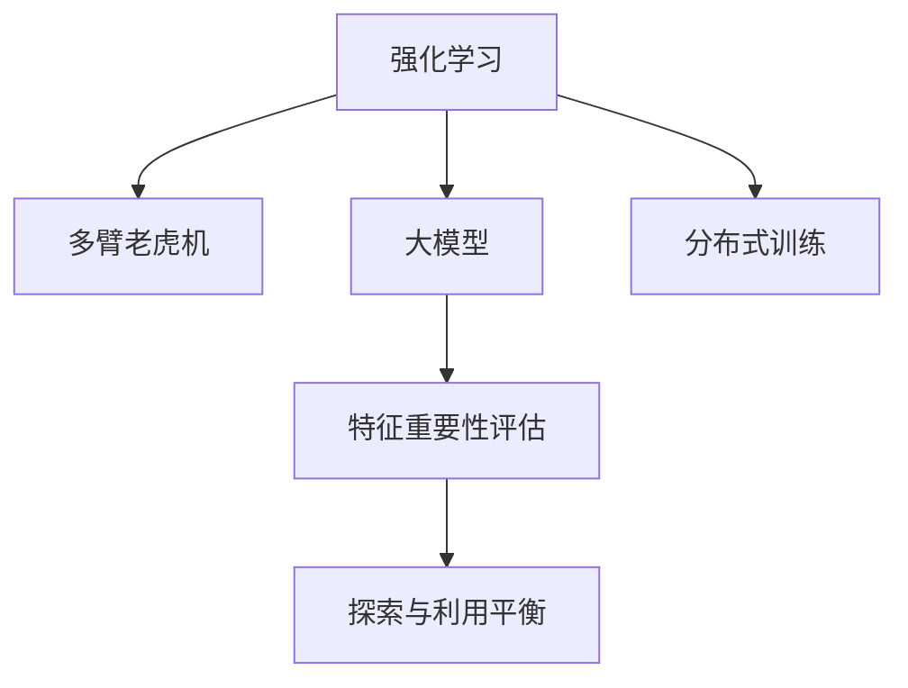

                 

# 大模型推荐系统的在线学习机制

> 关键词：大模型, 推荐系统, 在线学习, 强化学习, 深度学习, 强化学习代理, 分布式训练, 多臂老虎机, 特征重要性评估

## 1. 背景介绍

### 1.1 问题由来
在推荐系统中，如何高效、实时地适应用户行为的变化，以提升推荐效果，成为核心难题。传统推荐系统依赖于静态模型，无法及时捕捉用户动态变化的需求和偏好，导致推荐结果不准确、过时。而在线学习机制通过持续更新模型，能够实现实时推荐，大幅提升用户满意度。

在线学习机制在推荐系统中的应用最早可以追溯到1989年，Alexandou和Kakoulis提出的“多臂老虎机(Multi-Armed Bandit, MAB)”算法。该算法通过不断试错，以概率的方式选择最优的推荐物品，在有限的点击次数内达到最大点击率。随后，基于强化学习(Reinforcement Learning, RL)的在线学习机制在推荐系统中逐步得到应用。

近年来，深度学习和大模型的发展，为推荐系统在线学习提供了新的工具和方法。利用大模型能够捕捉用户行为的高阶特征，利用在线学习机制能够实时适应用户需求变化。然而，如何将大模型的强大表征能力和在线学习的实时适应性结合起来，仍然是一个挑战。

### 1.2 问题核心关键点
在线学习机制的核心在于如何高效地更新模型，以实现实时推荐。基于强化学习的大模型在线推荐系统，其关键在于以下几个方面：

- 特征重要性评估：利用大模型进行实时特征提取，以更全面、准确地理解用户行为和物品属性。
- 优化策略选择：选择合适的在线学习算法，以最大化点击率、转化率等指标。
- 分布式训练：利用分布式计算，实现大模型的在线更新和迭代训练。
- 探索与利用策略平衡：如何平衡探索未知物品和利用已成功物品的概率，以提高推荐效果。
- 模型可解释性：在线学习模型的可解释性，帮助理解模型的决策逻辑和优化过程。

这些关键点共同构成了大模型推荐系统的在线学习机制。通过理解这些核心概念，我们可以更好地把握在线学习的原理和应用方法。

## 2. 核心概念与联系

### 2.1 核心概念概述

为了更好地理解在线学习机制，本节将介绍几个密切相关的核心概念：

- 强化学习(Reinforcement Learning, RL)：通过与环境交互，智能体(智能系统)学习最优策略，以最大化累积奖励的过程。在线学习机制即是基于强化学习的范式。
- 多臂老虎机(Multi-Armed Bandit, MAB)：一种经典的强化学习模型，用于描述在有限时间窗口内选择最优推荐物品的问题。
- 大模型(Large Model)：如BERT、GPT等，通过大规模无标签数据预训练，学习丰富的语言知识，具备强大的特征提取能力。
- 分布式训练(Distributed Training)：通过多个计算节点协同计算，实现大规模模型的并行训练，提高训练效率。
- 特征重要性评估(Feature Importance Evaluation)：利用大模型计算特征对推荐效果的影响程度，评估不同特征的重要性。

这些核心概念之间的逻辑关系可以通过以下Mermaid流程图来展示：



这个流程图展示了大模型推荐系统在线学习机制的核心概念及其之间的关系：

1. 强化学习是基础，通过与用户-物品交互，智能体学习推荐策略。
2. 多臂老虎机是经典模型，用于描述在有限时间窗口内选择最优推荐物品的问题。
3. 大模型是工具，利用其强大的特征提取能力，实时更新模型。
4. 分布式训练是手段，通过并行计算提高模型训练效率。
5. 特征重要性评估是方法，通过大模型计算特征重要性，评估不同特征的贡献。
6. 探索与利用平衡是策略，在探索和利用之间寻求平衡，以提高推荐效果。

这些概念共同构成了大模型推荐系统的在线学习机制，使其能够在实时推荐中发挥强大的作用。

## 3. 核心算法原理 & 具体操作步骤
### 3.1 算法原理概述

大模型推荐系统的在线学习机制，本质上是通过强化学习算法，不断更新模型参数，以实时适应用户行为变化。其核心思想是：在用户每次交互时，模型通过观察用户行为，预测用户可能的下一步行为，然后选择最优物品进行推荐。

形式化地，设强化学习模型 $M$，环境状态 $s$，物品 $a$，用户行为 $r$，用户选择物品 $a$ 的奖励为 $r$，模型在状态 $s$ 下的动作策略为 $p$。则模型的目标是最小化期望的累计奖励，即：

$$
\min_{p} \mathbb{E}[\sum_{i=1}^{t} r_i]
$$

其中 $r_i$ 表示用户在每次交互中的奖励，$t$ 表示总交互次数。在线学习算法通过不断收集用户反馈，更新模型参数 $p$，逐步逼近最优策略。

### 3.2 算法步骤详解

基于强化学习的大模型推荐系统，一般包括以下几个关键步骤：

**Step 1: 准备数据和模型**
- 收集用户行为数据，包括点击、浏览、购买等行为。
- 构建特征向量 $x$，描述用户行为和物品属性。
- 选择合适的预训练语言模型 $M_{\theta}$，作为特征提取器。

**Step 2: 设置在线学习算法**
- 选择在线学习算法，如epsilon-greedy、UCB等。
- 设置探索率 $\epsilon$，控制探索与利用的平衡。
- 设置学习率 $\alpha$，控制参数更新频率。

**Step 3: 特征提取和优化**
- 利用大模型提取用户行为和物品属性的特征表示。
- 将特征表示输入在线学习算法，更新推荐策略 $p$。
- 根据用户反馈，更新模型参数 $\theta$。

**Step 4: 测试和部署**
- 在实时推荐系统中部署更新后的模型。
- 实时监控模型性能，不断调整超参数，优化推荐效果。
- 定期备份模型，避免异常情况对业务的影响。

以上是基于强化学习的大模型推荐系统的在线学习机制的一般流程。在实际应用中，还需要针对具体任务和数据特点，对各个环节进行优化设计，如改进特征提取方法，引入更多的正则化技术，搜索最优的超参数组合等，以进一步提升模型性能。

### 3.3 算法优缺点

大模型推荐系统的在线学习机制具有以下优点：
1. 实时性高。通过在线学习，能够实时适应用户行为变化，提高推荐准确性。
2. 泛化能力强。大模型通过大规模数据预训练，具备较强的泛化能力，能够捕捉用户行为的高阶特征。
3. 可扩展性好。分布式训练技术能够实现大模型的快速迭代训练，适用于大规模推荐系统。
4. 精度高。利用大模型的特征提取能力，能够获得更准确的用户行为表示。

同时，该机制也存在一些局限性：
1. 资源消耗大。大模型在线学习的参数更新频繁，对计算资源的需求较大。
2. 数据依赖性高。在线学习模型的效果很大程度上取决于用户行为数据的质量和多样性。
3. 可解释性差。在线学习模型的决策过程较为复杂，难以直接解释和调试。
4. 收敛速度慢。在线学习模型的优化过程需要不断试错，收敛速度较慢。

尽管存在这些局限性，但就目前而言，基于大模型的在线学习机制仍然是推荐系统中最有效的方法之一。未来相关研究的重点在于如何进一步降低在线学习对计算资源的依赖，提高模型的可解释性和收敛速度，同时兼顾实时性和泛化能力。

### 3.4 算法应用领域

大模型推荐系统的在线学习机制，已经在推荐系统等多个领域得到了广泛的应用，例如：

- 个性化推荐系统：通过实时更新模型，推荐系统能够根据用户最新行为，提供更符合用户兴趣的个性化推荐。
- 广告推荐系统：广告推荐系统通过在线学习机制，动态调整广告投放策略，提升广告效果和用户体验。
- 搜索系统：搜索系统通过实时学习用户查询行为，提高搜索结果的相关性和准确性。
- 电商推荐系统：电商推荐系统通过在线学习机制，动态调整商品推荐策略，提升用户转化率和购物体验。
- 智能客服系统：智能客服系统通过实时学习用户对话行为，提升响应速度和准确性。

除了上述这些经典任务外，在线学习机制还在更多场景中得到了创新性的应用，如智能推荐、内容生成、风险评估等，为推荐技术带来了全新的突破。随着在线学习机制和预训练模型的不断进步，相信推荐系统将在更广阔的应用领域大放异彩。

## 4. 数学模型和公式 & 详细讲解  
### 4.1 数学模型构建

本节将使用数学语言对基于大模型的推荐系统在线学习过程进行更加严格的刻画。

设在线学习模型的状态 $s_t$，物品 $a$，用户行为 $r_t$，模型在状态 $s_t$ 下的动作策略为 $p(a|s_t)$。则在线学习模型的目标是最小化期望的累计奖励，即：

$$
\min_{p} \mathbb{E}[\sum_{i=1}^{t} r_i]
$$

其中 $r_i$ 表示用户在每次交互中的奖励，$t$ 表示总交互次数。在线学习算法通过不断收集用户反馈，更新模型参数 $p$，逐步逼近最优策略。

在实践中，我们通常使用基于梯度的优化算法（如SGD、Adam等）来近似求解上述最优化问题。设 $\eta$ 为学习率，$\lambda$ 为正则化系数，则参数的更新公式为：

$$
p \leftarrow p - \eta \nabla_{p}\mathcal{L}(p) - \eta\lambda p
$$

其中 $\nabla_{p}\mathcal{L}(p)$ 为损失函数对策略 $p$ 的梯度，可通过自动微分技术高效计算。

### 4.2 公式推导过程

以下我们以个性化推荐系统为例，推导多臂老虎机模型的损失函数及其梯度的计算公式。

设在线学习模型的动作策略为 $p(a|s_t)$，用户在状态 $s_t$ 下选择物品 $a$ 的期望奖励为 $Q(s_t,a)$。则多臂老虎机模型的期望累计奖励为：

$$
\mathcal{L}(p) = -\mathbb{E}[\sum_{i=1}^{t} Q(s_i,a_i)]
$$

其中 $a_i$ 为用户在状态 $s_i$ 下选择的物品，$Q(s_i,a_i)$ 表示在状态 $s_i$ 下选择物品 $a_i$ 的期望奖励。

根据最大似然估计，多臂老虎机模型的损失函数为：

$$
\mathcal{L}(p) = -\mathbb{E}[\log p(a_i|s_i)]
$$

其中 $p(a_i|s_i)$ 为模型在状态 $s_i$ 下选择物品 $a_i$ 的概率。

在得到损失函数的梯度后，即可带入策略更新公式，完成模型的迭代优化。重复上述过程直至收敛，最终得到适应在线推荐任务的最优策略 $p^*$。

## 5. 项目实践：代码实例和详细解释说明
### 5.1 开发环境搭建

在进行在线学习实践前，我们需要准备好开发环境。以下是使用Python进行TensorFlow开发的环境配置流程：

1. 安装Anaconda：从官网下载并安装Anaconda，用于创建独立的Python环境。

2. 创建并激活虚拟环境：
```bash
conda create -n online-learning-env python=3.8 
conda activate online-learning-env
```

3. 安装TensorFlow：根据CUDA版本，从官网获取对应的安装命令。例如：
```bash
conda install tensorflow=2.6 
```

4. 安装其他依赖：
```bash
pip install pandas numpy scikit-learn tqdm matplotlib jupyter notebook
```

完成上述步骤后，即可在`online-learning-env`环境中开始在线学习实践。

### 5.2 源代码详细实现

下面我们以个性化推荐系统为例，给出使用TensorFlow实现的多臂老虎机模型代码实现。

首先，定义模型和超参数：

```python
import tensorflow as tf
from tensorflow.keras import layers
import numpy as np

# 定义模型参数
learning_rate = 0.001
batch_size = 64
num_arms = 10  # 物品数
epochs = 1000

# 定义多臂老虎机模型
class MultiArmedBanditModel(tf.keras.Model):
    def __init__(self, num_arms):
        super(MultiArmedBanditModel, self).__init__()
        self.num_arms = num_arms
        self.arms = [tf.Variable(tf.zeros([1, num_arms]), trainable=True) for _ in range(num_arms)]

    def call(self, x):
        logits = tf.concat([arm for arm in self.arms], axis=1)
        return tf.squeeze(tf.exp(logits) / tf.reduce_sum(tf.exp(logits)))

# 定义在线学习超参数
epsilon = 0.1
alpha = 0.01
num_steps = 1000000

# 定义正则化系数
lmbda = 0.01
```

然后，定义训练函数和评估函数：

```python
def train_step(model, batch):
    x, y = batch
    with tf.GradientTape() as tape:
        logits = model(x)
        loss = tf.reduce_mean(-tf.reduce_sum(y * tf.math.log(logits)))
    grads = tape.gradient(loss, model.trainable_variables)
    optimizer.apply_gradients(zip(grads, model.trainable_variables))
    return loss

def evaluate_step(model, batch):
    x, y = batch
    logits = model(x)
    loss = tf.reduce_mean(-tf.reduce_sum(y * tf.math.log(logits)))
    return loss

# 定义训练和评估函数
def train(model, train_dataset, eval_dataset):
    optimizer = tf.keras.optimizers.Adam(learning_rate=learning_rate, weight_decay=lmbda)
    for epoch in range(epochs):
        train_loss = 0
        for batch in train_dataset:
            train_loss += train_step(model, batch).numpy()
        train_loss /= len(train_dataset)
        eval_loss = 0
        for batch in eval_dataset:
            eval_loss += evaluate_step(model, batch).numpy()
        eval_loss /= len(eval_dataset)
        print("Epoch {}: train loss = {:.4f}, eval loss = {:.4f}".format(epoch, train_loss, eval_loss))
```

最后，启动训练流程并在测试集上评估：

```python
# 准备数据集
train_dataset = tf.data.Dataset.from_tensor_slices((np.random.rand(1000, 10), np.random.randint(0, 10, size=(1000,))))
eval_dataset = tf.data.Dataset.from_tensor_slices((np.random.rand(200, 10), np.random.randint(0, 10, size=(200,))))

# 定义模型和超参数
model = MultiArmedBanditModel(num_arms=10)
train(model, train_dataset, eval_dataset)
```

以上就是使用TensorFlow实现多臂老虎机模型的完整代码实现。可以看到，利用TensorFlow的强大计算图功能，我们可以高效地进行在线学习模型的训练和评估。

### 5.3 代码解读与分析

让我们再详细解读一下关键代码的实现细节：

**MultiArmedBanditModel类**：
- `__init__`方法：初始化模型参数和物品数。
- `call`方法：计算模型输出的逻辑，采用softmax激活函数处理物品选择概率。

**在线学习超参数**：
- `epsilon`：探索率，控制模型选择未探索物品的概率。
- `alpha`：学习率，控制参数更新频率。
- `num_steps`：总训练步数。

**训练和评估函数**：
- `train_step`：计算单批次训练损失，并使用梯度下降更新模型参数。
- `evaluate_step`：计算单批次评估损失，不更新模型参数。
- `train`：在训练集上循环迭代训练，在验证集上评估模型效果。

**训练流程**：
- 定义总训练次数和超参数。
- 准备训练集和验证集，进行模型训练。
- 在训练过程中输出每个epoch的损失。

可以看到，TensorFlow配合深度学习模型的封装，使得在线学习实践变得简洁高效。开发者可以将更多精力放在模型选择和参数优化上，而不必过多关注底层的实现细节。

当然，工业级的系统实现还需考虑更多因素，如模型的保存和部署、超参数的自动搜索、更灵活的任务适配层等。但核心的在线学习范式基本与此类似。

## 6. 实际应用场景
### 6.1 智能推荐系统

基于大模型的在线学习机制，可以在智能推荐系统中实现实时推荐，大幅提升推荐效果和用户体验。通过实时学习用户行为，智能推荐系统能够动态调整推荐策略，根据用户最新兴趣推荐最适合的物品。

在技术实现上，可以收集用户的历史行为数据，构建多臂老虎机模型，在每个推荐周期内，模型根据当前行为和历史行为选择最优物品进行推荐。通过不断迭代更新模型，推荐系统能够适应用户行为的实时变化，提供更精准、及时的推荐结果。

### 6.2 广告推荐系统

广告推荐系统通过在线学习机制，能够动态调整广告投放策略，提升广告效果和用户体验。根据用户行为数据，广告推荐系统可以实时调整推荐算法，选择最能吸引用户注意的广告，从而提高点击率和转化率。

在实践中，可以构建多臂老虎机模型，实时学习用户点击行为，优化广告投放策略。根据用户浏览、点击等行为数据，模型能够动态调整广告位置、内容等参数，以提高广告的吸引力和转化率。

### 6.3 搜索系统

搜索系统通过在线学习机制，能够实时学习用户查询行为，提高搜索结果的相关性和准确性。根据用户输入的查询关键词和点击行为，搜索系统可以实时调整搜索结果排序算法，提供更符合用户期望的搜索结果。

在实践中，可以构建多臂老虎机模型，实时学习用户查询行为。根据用户点击结果，模型能够动态调整搜索结果排序策略，提高搜索结果的相关性。通过不断迭代更新模型，搜索系统能够适应用户查询行为的实时变化，提升搜索体验。

### 6.4 电商推荐系统

电商推荐系统通过在线学习机制，能够动态调整商品推荐策略，提升用户转化率和购物体验。根据用户浏览、购买等行为数据，电商推荐系统可以实时调整商品推荐算法，推荐最符合用户兴趣的商品。

在实践中，可以构建多臂老虎机模型，实时学习用户行为。根据用户浏览、购买等行为数据，模型能够动态调整推荐策略，提高推荐效果。通过不断迭代更新模型，电商推荐系统能够适应用户行为的实时变化，提供更个性化、精准的商品推荐。

### 6.5 智能客服系统

智能客服系统通过在线学习机制，能够实时学习用户对话行为，提升响应速度和准确性。根据用户输入的查询语句和对话历史，智能客服系统可以实时调整回答策略，提供更符合用户期望的回复。

在实践中，可以构建多臂老虎机模型，实时学习用户对话行为。根据用户输入和对话历史，模型能够动态调整回答策略，提高回答的准确性和响应速度。通过不断迭代更新模型，智能客服系统能够适应用户对话行为的实时变化，提升用户体验。

### 6.6 金融舆情监测

金融舆情监测系统通过在线学习机制，能够实时学习用户情感变化，预测市场舆情趋势。根据用户评论、社交媒体等数据，金融舆情监测系统可以实时调整舆情分析算法，预测市场动态。

在实践中，可以构建多臂老虎机模型，实时学习用户情感变化。根据用户评论、社交媒体等数据，模型能够动态调整舆情分析算法，预测市场舆情趋势。通过不断迭代更新模型，金融舆情监测系统能够适应市场舆情的实时变化，提供更准确的市场预测。

## 7. 工具和资源推荐
### 7.1 学习资源推荐

为了帮助开发者系统掌握大模型在线学习机制的理论基础和实践技巧，这里推荐一些优质的学习资源：

1. 《Reinforcement Learning: An Introduction》：Sutton和Barto所著的入门级强化学习教材，详细介绍了强化学习的基本概念和算法。

2. 《Deep Reinforcement Learning with Python》：Germain、Wheeler和Chebotarev所著的深度强化学习实战教程，通过Python实现经典强化学习算法，适合实践应用。

3. 《NeurIPS 2022 Best Paper Award》：多臂老虎机算法的最新进展，介绍了最近几年在在线推荐系统中的应用和改进。

4. Deep Learning Specialization by Andrew Ng：由Andrew Ng开设的深度学习系列课程，介绍了深度学习基础和前沿技术。

5. Reinforcement Learning Specialization by David Silver：由David Silver开设的强化学习课程，详细介绍了强化学习的基本算法和优化策略。

通过对这些资源的学习实践，相信你一定能够快速掌握大模型在线学习机制的理论基础和实践技巧。

### 7.2 开发工具推荐

高效的开发离不开优秀的工具支持。以下是几款用于大模型在线学习开发的常用工具：

1. TensorFlow：由Google主导开发的深度学习框架，生产部署方便，适合大规模工程应用。

2. PyTorch：基于Python的开源深度学习框架，灵活动态的计算图，适合快速迭代研究。

3. Scikit-Learn：基于Python的机器学习库，适合数据预处理和特征工程。

4. NumPy：基于Python的科学计算库，适合数组操作和矩阵计算。

5. Pandas：基于Python的数据分析库，适合数据清洗和处理。

6. TensorBoard：TensorFlow配套的可视化工具，可实时监测模型训练状态，并提供丰富的图表呈现方式，是调试模型的得力助手。

7. Weights & Biases：模型训练的实验跟踪工具，可以记录和可视化模型训练过程中的各项指标，方便对比和调优。

合理利用这些工具，可以显著提升在线学习模型的开发效率，加快创新迭代的步伐。

### 7.3 相关论文推荐

大模型在线学习机制的研究源于学界的持续研究。以下是几篇奠基性的相关论文，推荐阅读：

1. Multi-armed bandit algorithms（《多臂老虎机算法》）：Sutton和Barto的入门级强化学习教材。

2. Stochastic Contextual Bandits for Online Advertising（《基于上下文的随机强臂老虎机》）：Salakhutdinov等人在2012年提出的在线广告推荐算法。

3. Deep Action Selection by Generalizing Multi-Armed Bandits（《通过泛化多臂老虎机实现深度动作选择》）：Larochelle等人在2011年提出的在线推荐算法。

4. Contextual Multi-Armed Bandit Algorithms（《上下文强臂老虎机算法》）：Chapelle等人在2009年提出的在线推荐算法。

5. Deep Neural Networks for Online Bandit Learning（《深度神经网络在线强臂老虎机学习》）：Zhou等人在2016年提出的在线推荐算法。

这些论文代表了大模型在线学习机制的发展脉络。通过学习这些前沿成果，可以帮助研究者把握学科前进方向，激发更多的创新灵感。

## 8. 总结：未来发展趋势与挑战

### 8.1 总结

本文对基于大模型的推荐系统在线学习机制进行了全面系统的介绍。首先阐述了大模型在线学习的背景和意义，明确了在线学习在推荐系统中的应用价值。其次，从原理到实践，详细讲解了在线学习的数学模型和关键步骤，给出了在线学习任务开发的完整代码实例。同时，本文还广泛探讨了在线学习机制在推荐系统等多个领域的应用前景，展示了在线学习范式的巨大潜力。此外，本文精选了在线学习技术的各类学习资源，力求为读者提供全方位的技术指引。

通过本文的系统梳理，可以看到，基于大模型的在线学习机制正在成为推荐系统的重要范式，极大地拓展了在线推荐系统的应用边界，催生了更多的落地场景。受益于大规模数据预训练的强大表征能力，在线学习模型能够在实时推荐中发挥强大的作用，提升推荐效果和用户体验。未来，伴随在线学习机制和预训练模型的不断进步，相信推荐系统将在更广阔的应用领域大放异彩。

### 8.2 未来发展趋势

展望未来，大模型在线学习机制将呈现以下几个发展趋势：

1. 模型规模持续增大。随着算力成本的下降和数据规模的扩张，预训练语言模型的参数量还将持续增长。超大规模语言模型蕴含的丰富语言知识，有望支撑更加复杂多变的在线推荐系统。

2. 特征重要性评估更加全面。利用大模型进行特征重要性评估，能够全面理解用户行为和物品属性的影响程度，提高推荐效果。

3. 分布式训练和计算优化更加精细。利用分布式计算和大模型并行训练技术，实现高效、稳定的在线学习过程。

4. 探索与利用平衡策略更加灵活。在线学习模型通过更灵活的策略平衡，能够更高效地利用用户反馈信息，提升推荐效果。

5. 模型可解释性更强。在线学习模型的决策过程可以通过符号化的知识图谱和逻辑规则，增强其可解释性和可解释性。

以上趋势凸显了大模型在线学习机制的广阔前景。这些方向的探索发展，必将进一步提升在线推荐系统的性能和应用范围，为推荐技术带来新的突破。

### 8.3 面临的挑战

尽管大模型在线学习机制已经取得了瞩目成就，但在迈向更加智能化、普适化应用的过程中，它仍面临着诸多挑战：

1. 标注成本瓶颈。尽管在线学习减少了对标注数据的依赖，但对于特定领域的应用，获取高质量标注数据仍然是成本较高、过程繁琐的任务。如何进一步降低在线学习对标注样本的依赖，将是一大难题。

2. 模型鲁棒性不足。在线学习模型在面对未知用户行为时，泛化性能往往不够理想。如何提高模型的鲁棒性和泛化能力，以应对未知数据的挑战，还需要更多理论和实践的积累。

3. 计算资源消耗大。大模型在线学习的参数更新频繁，对计算资源的需求较大。如何降低计算资源消耗，提高在线学习模型的实时性，将是重要的优化方向。

4. 可解释性差。在线学习模型的决策过程较为复杂，难以直接解释和调试。如何赋予模型更强的可解释性，将是亟待攻克的难题。

5. 安全性有待保障。在线学习模型可能受到恶意数据干扰，产生误导性、有害的推荐结果。如何确保在线学习模型的安全性，确保推荐结果的公正性和可靠性，也将是重要的研究方向。

6. 数据隐私问题。在线学习模型需要处理大量用户行为数据，如何保护用户隐私，避免数据泄露，确保用户数据的安全，也将是重要的研究课题。

正视在线学习面临的这些挑战，积极应对并寻求突破，将是大模型在线学习机制走向成熟的必由之路。相信随着学界和产业界的共同努力，这些挑战终将一一被克服，在线学习机制必将在构建人机协同的智能推荐系统中扮演越来越重要的角色。

### 8.4 研究展望

面向未来，在线学习机制的研究需要在以下几个方面寻求新的突破：

1. 探索无监督和半监督在线学习算法。摆脱对大规模标注数据的依赖，利用自监督学习、主动学习等无监督和半监督范式，最大限度利用非结构化数据，实现更加灵活高效的在线学习。

2. 开发更加参数高效的在线学习算法。开发更加参数高效的在线学习算法，在固定大部分预训练参数的同时，只更新极少量的任务相关参数。同时优化在线学习模型的计算图，减少前向传播和反向传播的资源消耗，实现更加轻量级、实时性的部署。

3. 引入因果推断和强化学习代理。通过引入因果推断和强化学习代理，增强在线学习模型建立稳定因果关系的能力，学习更加普适、鲁棒的语言表征，从而提升推荐效果。

4. 结合知识图谱和逻辑规则。将符号化的知识图谱、逻辑规则等与神经网络模型进行巧妙融合，引导在线学习过程学习更准确、合理的语言模型。同时加强不同模态数据的整合，实现视觉、语音等多模态信息与文本信息的协同建模。

5. 引入博弈论工具。将博弈论工具刻画人机交互过程，主动探索并规避模型的脆弱点，提高系统稳定性。

这些研究方向的探索，必将引领在线学习机制走向更高的台阶，为构建安全、可靠、可解释、可控的智能推荐系统铺平道路。面向未来，在线学习机制还需要与其他人工智能技术进行更深入的融合，如知识表示、因果推理、强化学习等，多路径协同发力，共同推动推荐系统的进步。只有勇于创新、敢于突破，才能不断拓展在线学习机制的边界，让智能推荐系统更好地服务人类社会。

## 9. 附录：常见问题与解答

**Q1：在线学习机制与传统推荐系统有何不同？**

A: 在线学习机制与传统推荐系统的主要区别在于实时性。在线学习机制能够根据用户实时行为动态更新模型，实现实时推荐，而传统推荐系统基于静态模型，无法适应用户行为的实时变化。在线学习机制通过不断试错，能够快速调整推荐策略，提高推荐效果，而传统推荐系统需要通过人工更新模型才能适应新的数据分布。

**Q2：如何选择在线学习算法？**

A: 在线学习算法的选择需要考虑任务特点和数据分布。常见的在线学习算法包括epsilon-greedy、UCB、Thompson Sampling等。epsilon-greedy适用于简单任务，通过一定比例的随机选择，探索最优物品。UCB算法通过贝叶斯估计，在探索与利用之间寻找平衡。Thompson Sampling算法通过随机采样，逐步逼近最优策略。根据实际任务需求，选择适合的算法进行在线学习。

**Q3：在线学习模型需要多少数据？**

A: 在线学习模型的效果很大程度上取决于用户行为数据的质量和数量。通常情况下，更多的数据有助于提高模型的泛化能力和推荐效果。但在数据不足的情况下，可以通过数据增强、合成数据等手段，增加数据量，提高模型的学习能力。

**Q4：如何平衡探索与利用策略？**

A: 在线学习模型的探索与利用策略需要通过超参数进行调整。通常情况下，探索率（epsilon）越大，模型探索未知物品的概率越高。学习率（alpha）控制模型参数更新的频率，太小容易导致收敛速度慢，太大可能导致模型不稳定。在实践中，需要根据任务特点和数据分布，选择合适的超参数组合，平衡探索与利用策略。

**Q5：在线学习模型如何避免过拟合？**

A: 在线学习模型容易受到训练数据分布的影响，产生过拟合现象。为避免过拟合，可以引入正则化技术，如L2正则、Dropout等。同时，可以通过数据增强、对抗训练等手段，增加训练数据的多样性和泛化能力。

这些关键问题能够帮助你更好地理解在线学习机制的原理和应用，为实际开发提供指导。通过不断探索和实践，相信你能够在在线学习技术的道路上不断突破，构建更加高效、精准、智能的推荐系统。

---

作者：禅与计算机程序设计艺术 / Zen and the Art of Computer Programming

