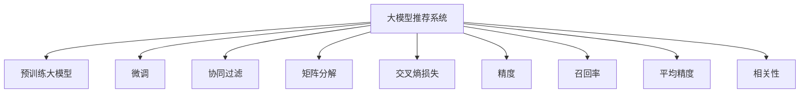

                 

# 大模型推荐系统的评估指标研究

在当今数字经济时代，推荐系统已成为电商、社交媒体、视频平台等众多网络服务的重要组成部分。通过对用户行为和内容特征的深度学习，推荐系统能够实现个性化的信息呈现，极大提升用户体验和运营效率。而随着大模型的不断发展，推荐系统逐渐从简单的协同过滤、矩阵分解等传统方法，转向基于深度学习的推荐模型，极大地提升了推荐效果。本文将深入探讨大模型推荐系统的评估指标研究，旨在帮助从业者全面理解推荐系统的性能评估和优化策略，从而构建更加精准、高效的推荐系统。

## 1. 背景介绍

### 1.1 推荐系统的发展背景

推荐系统最早起源于电子商务网站，通过分析用户的历史行为，推荐用户可能感兴趣的商品。随后，推荐技术逐步扩展到社交网络、视频平台等线上平台，用于推荐新闻、文章、视频等内容。推荐系统的核心目标是，利用用户数据和内容特征，构建个性化推荐模型，将合适的信息推荐给用户，提升用户满意度和平台留存率。

### 1.2 大模型在推荐系统中的应用

传统推荐系统依赖于用户行为数据的统计特征工程，难以捕捉长尾用户和低频行为模式。而基于大模型的推荐方法，直接利用大规模预训练模型，提取更深层次的语义信息，能更好地捕捉用户个性化需求，进行精准推荐。当前，大模型推荐系统已经在电商、新闻、视频等多个领域得到广泛应用，并取得了显著的效果。

## 2. 核心概念与联系

### 2.1 核心概念概述

在研究大模型推荐系统评估指标前，我们首先需理解几个关键概念：

- 大模型推荐系统(Large Model Recommendation System, LMRS)：基于预训练的大语言模型，通过微调获得个性化推荐模型的方法。常见的大模型包括BERT、GPT等。

- 协同过滤(Collaborative Filtering, CF)：推荐系统中的一种经典方法，通过分析用户与物品的协同关系，预测用户对未交互物品的评分，生成推荐列表。

- 矩阵分解(Matrix Factorization, MF)：另一种经典推荐方法，将用户-物品评分矩阵分解为用户和物品的潜在特征向量，进行低秩逼近，构建推荐模型。

- 交叉熵损失(Cross-Entropy Loss)：在推荐系统中，通常使用交叉熵损失衡量模型预测值与真实标签的差异，优化模型参数。

- 精度(Precision)：衡量推荐列表中排名靠前物品的实际质量，即推荐列表中预测为正的样本中，真实为正的比例。

- 召回率(Recall)：衡量推荐列表的覆盖范围，即真实为正的样本中，被推荐列表覆盖的比例。

- 平均精度(Mean Average Precision, MAP)：综合考虑精度和召回率，综合评价推荐系统的效果。

- 相关性(Correlation)：衡量推荐列表中物品与用户的匹配度，反映推荐内容的相关性。

### 2.2 核心概念原理和架构的 Mermaid 流程图



该流程图展示了大模型推荐系统的主要构成模块，包括预训练大模型、微调、协同过滤、矩阵分解、损失函数、评估指标等。通过这些模块的协同作用，大模型推荐系统能够实现精准、高效的个性化推荐。

## 3. 核心算法原理 & 具体操作步骤

### 3.1 算法原理概述

大模型推荐系统的核心原理是，利用大规模预训练模型提取用户和物品的深层次语义信息，通过微调获得个性化推荐模型。算法过程一般包括以下几个步骤：

1. **预训练大模型**：从大规模无标签文本数据中预训练一个大模型，学习通用的语言和知识表示。

2. **微调**：在用户行为数据和物品特征上微调预训练模型，获取个性化推荐模型。

3. **评分预测**：通过微调后的模型，对用户-物品评分矩阵进行预测，生成推荐列表。

4. **评估指标**：计算推荐列表的评估指标，如精度、召回率、平均精度、相关性等，衡量推荐效果。

5. **迭代优化**：根据评估指标，调整微调参数和策略，优化推荐模型。

### 3.2 算法步骤详解

下面以大模型在电商推荐中的应用为例，详细讲解推荐系统的各个步骤：

1. **预训练大模型**：
   - 收集大规模无标签文本数据，如电商商品描述、用户评论等，用于预训练BERT、GPT等大模型。
   - 对大模型进行掩码语言模型、下一句预测等自监督预训练任务，学习语言知识。

2. **微调**：
   - 收集用户行为数据，如浏览、点击、购买记录等，标注用户-物品评分矩阵。
   - 使用预训练模型作为初始化参数，在用户-物品评分数据上微调模型，获取个性化推荐模型。
   - 通常使用交叉熵损失，优化模型预测值与真实标签的差异。

3. **评分预测**：
   - 将用户和物品的特征输入微调后的模型，获得预测评分。
   - 根据预测评分生成推荐列表，排序推荐系统中的推荐物品。

4. **评估指标**：
   - 计算推荐列表的精度、召回率、平均精度、相关性等指标，衡量推荐效果。
   - 常用指标包括MAP@k、DCG@k、NDCG@k等，k表示推荐列表的长度。

5. **迭代优化**：
   - 根据评估指标，调整模型超参数、优化算法等，优化推荐模型。
   - 通过交叉验证、超参数调优等方法，提升推荐效果。

### 3.3 算法优缺点

大模型推荐系统具有以下优点：
- 能够捕捉深层次的语义信息，提升推荐精度。
- 模型参数量较大，可以通过预训练学习通用语言知识，减小微调所需样本数量。
- 可以灵活适应不同类型的推荐任务，如电商、新闻、视频等。

但同时也存在以下缺点：
- 预训练和微调过程计算复杂度高，资源消耗大。
- 模型过于庞大，推理速度慢，难以实时推荐。
- 推荐结果可解释性不足，用户难以理解推荐逻辑。

### 3.4 算法应用领域

大模型推荐系统广泛应用于电商、新闻、视频等多个领域，主要应用场景包括：

- 电商推荐：根据用户浏览、购买记录，推荐用户可能感兴趣的商品。
- 新闻推荐：根据用户阅读历史，推荐用户可能感兴趣的新闻文章。
- 视频推荐：根据用户观看历史，推荐用户可能感兴趣的视频内容。
- 音乐推荐：根据用户听歌历史，推荐用户可能感兴趣的音乐。
- 游戏推荐：根据用户游戏行为，推荐用户可能感兴趣的游戏。

## 4. 数学模型和公式 & 详细讲解 & 举例说明

### 4.1 数学模型构建

在大模型推荐系统中，数学模型通常由预训练模型、微调模型、评分预测模型、评估指标等模块构成。以电商推荐为例，数学模型可表示为：

$$
\begin{aligned}
&\hat{y}_i = M_{\theta}(x_i) \\
&\ell(\hat{y}_i, y_i) = -y_i \log \hat{y}_i - (1-y_i) \log (1-\hat{y}_i) \\
&\mathcal{L}(\theta) = \frac{1}{N} \sum_{i=1}^N \ell(\hat{y}_i, y_i) \\
&\theta^* = \mathop{\arg\min}_{\theta} \mathcal{L}(\theta)
\end{aligned}
$$

其中，$M_{\theta}$ 表示微调后的模型，$x_i$ 表示用户特征，$y_i$ 表示用户对物品的评分，$\ell(\hat{y}_i, y_i)$ 表示交叉熵损失，$\mathcal{L}(\theta)$ 表示模型经验损失，$\theta^*$ 表示最优模型参数。

### 4.2 公式推导过程

为了更好地理解大模型推荐系统，我们推导一下评分预测的数学公式。假设用户特征为 $x$，物品特征为 $z$，微调后的模型为 $M_{\theta}$，则预测评分为：

$$
\hat{y}_i = \text{softmax}(M_{\theta}([x_i; z_i]))
$$

其中，$[x_i; z_i]$ 表示将用户特征和物品特征拼接后输入模型，$\text{softmax}$ 函数将输出转化为概率分布。

根据评分预测结果，可以计算推荐列表的评估指标，如精度、召回率、平均精度等。以MAP@k为例，计算公式如下：

$$
\text{MAP}@k = \frac{1}{N} \sum_{i=1}^N \frac{\sum_{j=1}^k \hat{y}_{i,j} y_{i,j}}{\sum_{j=1}^k \hat{y}_{i,j}}
$$

其中，$N$ 表示用户数量，$k$ 表示推荐列表长度，$\hat{y}_{i,j}$ 表示模型预测的第 $j$ 个物品的评分，$y_{i,j}$ 表示实际物品的评分。

### 4.3 案例分析与讲解

假设有一个电商推荐系统，需要根据用户历史行为数据，推荐可能感兴趣的商品。用户历史行为数据包括浏览、点击、购买记录等。

**Step 1: 数据准备**
- 收集用户浏览、点击、购买记录等数据，构建用户-物品评分矩阵 $Y$。
- 对用户特征和物品特征进行编码，构建特征向量 $X$ 和 $Z$。

**Step 2: 微调模型**
- 使用预训练的BERT模型，将用户特征和物品特征拼接后输入模型，进行微调。
- 设置交叉熵损失函数，优化模型预测值与真实标签的差异。
- 调整学习率、批大小、迭代轮数等超参数，优化微调过程。

**Step 3: 评分预测**
- 将用户特征和物品特征输入微调后的模型，预测物品评分。
- 根据预测评分生成推荐列表，排序推荐物品。

**Step 4: 评估指标**
- 计算推荐列表的精度、召回率、平均精度等指标，衡量推荐效果。
- 使用MAP@k等指标，综合评价推荐系统性能。

**Step 5: 迭代优化**
- 根据评估指标，调整模型超参数和优化算法，优化推荐模型。
- 通过交叉验证、超参数调优等方法，提升推荐效果。

## 5. 项目实践：代码实例和详细解释说明

### 5.1 开发环境搭建

在进行大模型推荐系统开发前，需要先准备好开发环境。以下是使用Python进行PyTorch开发的环境配置流程：

1. 安装Anaconda：从官网下载并安装Anaconda，用于创建独立的Python环境。

2. 创建并激活虚拟环境：
```bash
conda create -n pytorch-env python=3.8 
conda activate pytorch-env
```

3. 安装PyTorch：根据CUDA版本，从官网获取对应的安装命令。例如：
```bash
conda install pytorch torchvision torchaudio cudatoolkit=11.1 -c pytorch -c conda-forge
```

4. 安装Transformers库：
```bash
pip install transformers
```

5. 安装各类工具包：
```bash
pip install numpy pandas scikit-learn matplotlib tqdm jupyter notebook ipython
```

完成上述步骤后，即可在`pytorch-env`环境中开始推荐系统开发。

### 5.2 源代码详细实现

下面以电商推荐系统为例，给出使用Transformers库对BERT模型进行微调的PyTorch代码实现。

首先，定义电商推荐任务的数据处理函数：

```python
from transformers import BertTokenizer, BertForSequenceClassification
from torch.utils.data import Dataset, DataLoader
import torch

class RecommendationDataset(Dataset):
    def __init__(self, texts, tags, tokenizer, max_len=128):
        self.texts = texts
        self.tags = tags
        self.tokenizer = tokenizer
        self.max_len = max_len
        
    def __len__(self):
        return len(self.texts)
    
    def __getitem__(self, item):
        text = self.texts[item]
        tags = self.tags[item]
        
        encoding = self.tokenizer(text, return_tensors='pt', max_length=self.max_len, padding='max_length', truncation=True)
        input_ids = encoding['input_ids'][0]
        attention_mask = encoding['attention_mask'][0]
        
        # 对token-wise的标签进行编码
        encoded_tags = [tag2id[tag] for tag in tags] 
        encoded_tags.extend([tag2id['O']] * (self.max_len - len(encoded_tags)))
        labels = torch.tensor(encoded_tags, dtype=torch.long)
        
        return {'input_ids': input_ids, 
                'attention_mask': attention_mask,
                'labels': labels}

# 标签与id的映射
tag2id = {'O': 0, 'P': 1}
id2tag = {v: k for k, v in tag2id.items()}

# 创建dataset
tokenizer = BertTokenizer.from_pretrained('bert-base-cased')

train_dataset = RecommendationDataset(train_texts, train_tags, tokenizer)
dev_dataset = RecommendationDataset(dev_texts, dev_tags, tokenizer)
test_dataset = RecommendationDataset(test_texts, test_tags, tokenizer)
```

然后，定义模型和优化器：

```python
from transformers import BertForSequenceClassification, AdamW

model = BertForSequenceClassification.from_pretrained('bert-base-cased', num_labels=len(tag2id))

optimizer = AdamW(model.parameters(), lr=2e-5)
```

接着，定义训练和评估函数：

```python
from sklearn.metrics import accuracy_score

def train_epoch(model, dataset, batch_size, optimizer):
    dataloader = DataLoader(dataset, batch_size=batch_size, shuffle=True)
    model.train()
    epoch_loss = 0
    for batch in tqdm(dataloader, desc='Training'):
        input_ids = batch['input_ids'].to(device)
        attention_mask = batch['attention_mask'].to(device)
        labels = batch['labels'].to(device)
        model.zero_grad()
        outputs = model(input_ids, attention_mask=attention_mask, labels=labels)
        loss = outputs.loss
        epoch_loss += loss.item()
        loss.backward()
        optimizer.step()
    return epoch_loss / len(dataloader)

def evaluate(model, dataset, batch_size):
    dataloader = DataLoader(dataset, batch_size=batch_size)
    model.eval()
    preds, labels = [], []
    with torch.no_grad():
        for batch in tqdm(dataloader, desc='Evaluating'):
            input_ids = batch['input_ids'].to(device)
            attention_mask = batch['attention_mask'].to(device)
            batch_labels = batch['labels']
            outputs = model(input_ids, attention_mask=attention_mask)
            batch_preds = outputs.logits.argmax(dim=2).to('cpu').tolist()
            batch_labels = batch_labels.to('cpu').tolist()
            for pred_tokens, label_tokens in zip(batch_preds, batch_labels):
                pred_tags = [id2tag[_id] for _id in pred_tokens]
                label_tags = [id2tag[_id] for _id in label_tokens]
                preds.append(pred_tags[:len(label_tokens)])
                labels.append(label_tags)
                
    return accuracy_score(labels, preds)
```

最后，启动训练流程并在测试集上评估：

```python
epochs = 5
batch_size = 16

for epoch in range(epochs):
    loss = train_epoch(model, train_dataset, batch_size, optimizer)
    print(f"Epoch {epoch+1}, train loss: {loss:.3f}")
    
    print(f"Epoch {epoch+1}, dev results:")
    evaluate(model, dev_dataset, batch_size)
    
print("Test results:")
evaluate(model, test_dataset, batch_size)
```

以上就是使用PyTorch对BERT进行电商推荐任务微调的完整代码实现。可以看到，得益于Transformers库的强大封装，我们可以用相对简洁的代码完成BERT模型的加载和微调。

### 5.3 代码解读与分析

让我们再详细解读一下关键代码的实现细节：

**RecommendationDataset类**：
- `__init__`方法：初始化文本、标签、分词器等关键组件。
- `__len__`方法：返回数据集的样本数量。
- `__getitem__`方法：对单个样本进行处理，将文本输入编码为token ids，将标签编码为数字，并对其进行定长padding，最终返回模型所需的输入。

**tag2id和id2tag字典**：
- 定义了标签与数字id之间的映射关系，用于将token-wise的预测结果解码回真实的标签。

**训练和评估函数**：
- 使用PyTorch的DataLoader对数据集进行批次化加载，供模型训练和推理使用。
- 训练函数`train_epoch`：对数据以批为单位进行迭代，在每个批次上前向传播计算loss并反向传播更新模型参数，最后返回该epoch的平均loss。
- 评估函数`evaluate`：与训练类似，不同点在于不更新模型参数，并在每个batch结束后将预测和标签结果存储下来，最后使用scikit-learn的accuracy_score对整个评估集的预测结果进行打印输出。

**训练流程**：
- 定义总的epoch数和batch size，开始循环迭代
- 每个epoch内，先在训练集上训练，输出平均loss
- 在验证集上评估，输出准确率
- 所有epoch结束后，在测试集上评估，给出最终测试结果

可以看到，PyTorch配合Transformers库使得BERT微调的代码实现变得简洁高效。开发者可以将更多精力放在数据处理、模型改进等高层逻辑上，而不必过多关注底层的实现细节。

当然，工业级的系统实现还需考虑更多因素，如模型的保存和部署、超参数的自动搜索、更灵活的任务适配层等。但核心的微调范式基本与此类似。

## 6. 实际应用场景

### 6.1 电商推荐

大模型推荐系统在电商领域已得到广泛应用。传统电商推荐系统通常依赖协同过滤、矩阵分解等方法，难以捕捉用户长尾需求和低频行为模式。而基于大模型的推荐系统，通过深度学习提取用户和物品的深层次语义信息，能够更好地捕捉用户需求，提供个性化推荐。

以Amazon为例，使用大模型推荐系统，根据用户浏览、点击、购买记录等行为数据，推荐用户可能感兴趣的商品。通过微调BERT模型，用户推荐列表更加丰富、精准，极大提升了用户购买转化率和平台留存率。

### 6.2 新闻推荐

新闻推荐系统帮助用户在海量新闻内容中找到感兴趣的文章。传统的协同过滤方法难以有效捕捉新闻内容的多样性。而大模型推荐系统通过深度学习，能够理解新闻标题、摘要等内容的语义信息，提供个性化推荐。

例如，Baidu News推荐系统使用BERT模型，根据用户阅读历史，推荐用户可能感兴趣的新闻文章。微调后的BERT模型能够理解新闻的语义，提高推荐相关性和多样性，提升用户体验。

### 6.3 视频推荐

视频推荐系统帮助用户发现可能感兴趣的视频内容。传统推荐方法难以有效捕捉视频内容的深层次语义信息。而大模型推荐系统通过深度学习，能够理解视频标题、描述等内容的语义信息，提供个性化推荐。

例如，Netflix使用大模型推荐系统，根据用户观看历史，推荐用户可能感兴趣的视频内容。微调后的模型能够理解视频的语义，提高推荐相关性和多样性，提升用户观看体验。

### 6.4 未来应用展望

随着大模型推荐技术的不断发展，其在更多领域的应用前景广阔：

1. **智慧医疗**：医疗领域推荐系统推荐专家、病历、治疗方案等，帮助医生诊断和治疗。微调BERT模型，能够从医学文献中提取知识，提供精准推荐。

2. **智能教育**：教育领域推荐系统推荐学习资源、教学方法等，提升教育质量和效率。微调BERT模型，能够理解学生需求，提供个性化推荐。

3. **智慧城市**：智慧城市治理推荐系统推荐交通路线、安全监控等，提高城市管理效率。微调BERT模型，能够理解城市环境，提供精准推荐。

4. **智能制造**：工业领域推荐系统推荐生产流程、设备维护等，提高生产效率和设备利用率。微调BERT模型，能够理解生产数据，提供个性化推荐。

5. **数字娱乐**：游戏、音乐、视频等领域推荐系统推荐内容，提升用户体验。微调BERT模型，能够理解用户偏好，提供个性化推荐。

未来，大模型推荐系统将与更多智能系统结合，提供更加精准、智能的服务，提升用户的生产和生活体验。

## 7. 工具和资源推荐

### 7.1 学习资源推荐

为了帮助开发者系统掌握大模型推荐系统的理论基础和实践技巧，这里推荐一些优质的学习资源：

1. 《推荐系统实战》书籍：由推荐系统领域的专家撰写，深入浅出地介绍了推荐系统的理论、算法和工程实现。

2. 《深度学习在推荐系统中的应用》课程：Coursera平台上由斯坦福大学开设的课程，系统讲解了推荐系统的经典算法和深度学习应用。

3. 《Transformers》书籍：Transformer的作者所著，全面介绍了Transformer模型及其在大模型推荐系统中的应用。

4. Kaggle竞赛：参加推荐系统相关的竞赛，通过实战提升推荐模型设计、优化和评估能力。

5. YouTube频道：如Google AI、Microsoft Research等，定期发布推荐系统相关的学术论文和技术分享。

通过对这些资源的学习实践，相信你一定能够快速掌握大模型推荐系统的精髓，并用于解决实际的推荐问题。

### 7.2 开发工具推荐

高效的开发离不开优秀的工具支持。以下是几款用于大模型推荐系统开发的常用工具：

1. PyTorch：基于Python的开源深度学习框架，灵活动态的计算图，适合快速迭代研究。大部分预训练语言模型都有PyTorch版本的实现。

2. TensorFlow：由Google主导开发的开源深度学习框架，生产部署方便，适合大规模工程应用。同样有丰富的预训练语言模型资源。

3. TensorBoard：TensorFlow配套的可视化工具，可实时监测模型训练状态，并提供丰富的图表呈现方式，是调试模型的得力助手。

4. Weights & Biases：模型训练的实验跟踪工具，可以记录和可视化模型训练过程中的各项指标，方便对比和调优。与主流深度学习框架无缝集成。

5. Apache Flink：开源大数据流处理框架，可以高效处理大规模推荐系统数据，支持实时推荐。

6. Apache Kafka：开源分布式消息队列，可以高效存储和传输推荐系统数据，支持分布式处理。

合理利用这些工具，可以显著提升大模型推荐系统的开发效率，加快创新迭代的步伐。

### 7.3 相关论文推荐

大模型推荐系统的发展离不开学界的持续研究。以下是几篇奠基性的相关论文，推荐阅读：

1. Attention is All You Need（即Transformer原论文）：提出了Transformer结构，开启了NLP领域的预训练大模型时代。

2. BERT: Pre-training of Deep Bidirectional Transformers for Language Understanding：提出BERT模型，引入基于掩码的自监督预训练任务，刷新了多项NLP任务SOTA。

3. Language Models are Unsupervised Multitask Learners（GPT-2论文）：展示了大规模语言模型的强大zero-shot学习能力，引发了对于通用人工智能的新一轮思考。

4. Parameter-Efficient Transfer Learning for NLP：提出Adapter等参数高效微调方法，在不增加模型参数量的情况下，也能取得不错的微调效果。

5. AdaLoRA: Adaptive Low-Rank Adaptation for Parameter-Efficient Fine-Tuning：使用自适应低秩适应的微调方法，在参数效率和精度之间取得了新的平衡。

这些论文代表了大模型推荐系统的发展脉络。通过学习这些前沿成果，可以帮助研究者把握学科前进方向，激发更多的创新灵感。

## 8. 总结：未来发展趋势与挑战

### 8.1 研究成果总结

本文对大模型推荐系统的评估指标进行了全面系统的介绍。首先阐述了大模型推荐系统的背景和意义，明确了推荐系统性能评估和优化策略的重要性。其次，从原理到实践，详细讲解了推荐系统的数学模型、公式推导、实际应用等关键内容。最后，系统总结了大模型推荐系统的优缺点和应用领域，为后续研究提供了参考。

### 8.2 未来发展趋势

展望未来，大模型推荐系统将呈现以下几个发展趋势：

1. **多模态推荐**：结合文本、图片、音频等多模态信息，提供更加丰富、智能的推荐服务。

2. **实时推荐**：利用实时流处理技术，实现实时推荐，提高推荐系统的响应速度和效率。

3. **自适应推荐**：根据用户行为和环境变化，动态调整推荐策略，提升推荐系统的个性化水平。

4. **模型压缩与优化**：通过模型压缩、稀疏化等技术，减小模型大小，提升推理速度，实现轻量级推荐系统。

5. **用户隐私保护**：在推荐系统设计中，加入隐私保护机制，保护用户数据隐私和安全。

6. **伦理道德约束**：引入伦理导向的评估指标，确保推荐系统的公平性和透明度。

7. **跨平台协作**：结合多种推荐系统，实现跨平台协作推荐，提供更全面、精准的推荐服务。

### 8.3 面临的挑战

尽管大模型推荐系统已经取得了显著成就，但在迈向更加智能化、普适化应用的过程中，它仍面临诸多挑战：

1. **数据质量与多样性**：推荐系统需要高质量、多样化的数据，但在实际应用中，数据获取和标注成本较高，数据质量难以保证。

2. **计算资源消耗**：大模型推荐系统需要大量的计算资源，包括预训练和微调过程，计算复杂度高，资源消耗大。

3. **推荐鲁棒性与泛化能力**：推荐系统面对未知数据时，泛化能力不足，容易过拟合，难以适应新的数据分布。

4. **可解释性与透明度**：推荐系统通常被视为"黑盒"模型，用户难以理解推荐逻辑，影响用户体验和信任度。

5. **隐私与安全问题**：推荐系统需要大量用户数据，如何保护用户隐私，防止数据泄露，是一大挑战。

6. **公平性与偏见问题**：推荐系统容易受到数据偏见的影响，导致推荐不公平，引发歧视性问题。

### 8.4 研究展望

面对大模型推荐系统面临的挑战，未来的研究需要在以下几个方面寻求新的突破：

1. **数据增强与生成对抗网络**：利用数据增强和生成对抗网络技术，扩大训练数据集，提升推荐系统泛化能力。

2. **模型压缩与量化**：通过模型压缩和量化技术，减小模型大小，提升推理速度，实现轻量级推荐系统。

3. **因果推理与自适应推荐**：结合因果推理和自适应推荐技术，提升推荐系统的鲁棒性和个性化水平。

4. **多模态信息融合**：利用多模态信息融合技术，提升推荐系统的多样性和丰富度。

5. **跨平台协作与联邦学习**：结合多种推荐系统，实现跨平台协作推荐，利用联邦学习技术，保护用户数据隐私。

6. **用户隐私保护**：在推荐系统设计中，加入隐私保护机制，保护用户数据安全。

7. **公平性与伦理约束**：引入伦理导向的评估指标，确保推荐系统的公平性和透明度。

这些研究方向的探索，必将引领大模型推荐系统迈向更高的台阶，为构建安全、可靠、可解释、可控的推荐系统铺平道路。面向未来，大模型推荐系统还需要与其他人工智能技术进行更深入的融合，如知识表示、因果推理、强化学习等，多路径协同发力，共同推动推荐技术的发展。只有勇于创新、敢于突破，才能不断拓展推荐系统的边界，让智能技术更好地造福人类社会。

## 9. 附录：常见问题与解答

**Q1: 大模型推荐系统与传统推荐系统有何不同？**

A: 大模型推荐系统基于深度学习，利用大规模预训练模型提取用户和物品的深层次语义信息，通过微调获得个性化推荐模型。而传统推荐系统依赖于用户行为数据的统计特征工程，难以捕捉长尾用户和低频行为模式。大模型推荐系统能够更好地捕捉用户个性化需求，提供精准推荐。

**Q2: 大模型推荐系统如何进行微调？**

A: 大模型推荐系统的微调过程与一般深度学习模型类似。首先，收集用户行为数据，构建用户-物品评分矩阵。然后，使用预训练模型作为初始化参数，在评分矩阵上进行微调，获取个性化推荐模型。在微调过程中，可以使用交叉熵损失函数，优化模型预测值与真实标签的差异。

**Q3: 大模型推荐系统的评估指标有哪些？**

A: 大模型推荐系统的评估指标包括精度、召回率、平均精度、MAP等。精度衡量推荐列表中排名靠前物品的实际质量，召回率衡量推荐列表的覆盖范围，平均精度综合考虑精度和召回率，MAP@k衡量推荐列表的前k个物品的相关性。

**Q4: 如何优化大模型推荐系统的性能？**

A: 优化大模型推荐系统的性能，可以从以下几方面入手：

1. 数据增强：通过回译、近义替换等方式扩充训练集。

2. 正则化技术：使用L2正则、Dropout、Early Stopping等，防止过拟合。

3. 对抗训练：引入对抗样本，提高模型鲁棒性。

4. 参数高效微调：使用Adapter等方法，只调整少量任务相关参数，减小计算资源消耗。

5. 自适应推荐：根据用户行为和环境变化，动态调整推荐策略。

6. 实时推荐：利用实时流处理技术，实现实时推荐。

**Q5: 大模型推荐系统在推荐效果和计算资源消耗之间如何平衡？**

A: 大模型推荐系统在推荐效果和计算资源消耗之间需要平衡。一方面，大模型能够提取深层次语义信息，提升推荐精度。另一方面，模型计算复杂度高，资源消耗大。可以通过模型压缩、量化等技术，减小模型大小，提升推理速度，实现轻量级推荐系统。同时，引入自适应推荐等技术，动态调整推荐策略，提升推荐系统的个性化水平。

---

作者：禅与计算机程序设计艺术 / Zen and the Art of Computer Programming

