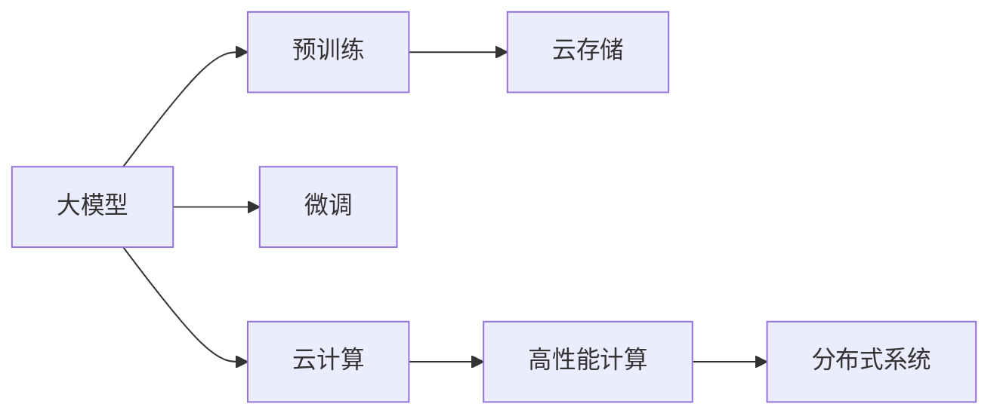

                 

# 大模型时代的基础设施提供者：Lepton AI的定位

> 关键词：基础设施提供者，大模型，Lepton AI，技术架构，机器学习，云计算，高性能计算，分布式系统

## 1. 背景介绍

### 1.1 问题由来
随着人工智能技术的飞速发展，特别是深度学习和神经网络技术的突破，大模型（Large Model）在各行各业的应用日益广泛。大模型通常指的是拥有大量参数（如百亿、千亿级别）、可处理大规模数据、具备强泛化能力的机器学习模型。这些模型通过预训练的方式，在庞大的数据集上进行自监督学习，学习到高层次的特征表示，在微调（Fine-tuning）阶段，能够适应特定的下游任务，实现高效、准确、鲁棒的预测和生成。

大模型的成功应用，离不开强大、高效、可靠的基础设施支持。然而，目前绝大多数企业和研究机构在构建大模型基础设施方面，依然存在诸多挑战。首先，大模型的训练和推理需要巨大的计算资源，这对于大多数中小型组织而言，是一个难以承担的负担。其次，大模型的存储、传输、管理等环节，需要高度安全、高效的技术架构，才能确保模型的性能和可靠性。

Lepton AI，作为一家新兴的AI基础设施提供商，致力于构建基于云计算、高性能计算和大数据处理的基础设施平台，为各行各业的大模型应用提供强大的支持。通过Lepton AI的平台，开发者可以轻松地进行大模型的训练、推理和部署，无需担心底层技术复杂度和资源瓶颈，专注于模型的设计和优化。

### 1.2 问题核心关键点
Lepton AI提供的大模型基础设施，主要围绕以下几个核心关键点展开：

1. **高性能计算资源**：提供GPU、TPU等高性能计算资源，支持大规模模型的高效训练和推理。
2. **高效数据管理**：设计分布式数据存储和处理架构，支持PB级数据的高效读写和管理。
3. **安全与合规**：采用先进的安全技术和合规机制，确保大模型和用户数据的安全性。
4. **易用性和可扩展性**：提供简单直观的用户界面和灵活的API接口，支持快速部署和扩展。
5. **自动化工具和监控**：提供自动化训练、调优、监控工具，减少人工干预，提高模型训练和推理的效率和可靠性。

## 2. 核心概念与联系

### 2.1 核心概念概述

为了更好地理解Lepton AI的基础设施架构，本节将介绍几个密切相关的核心概念：

- **大模型（Large Model）**：指具有大规模参数量、能够处理复杂任务的深度学习模型。
- **预训练（Pre-training）**：指在大量无标签数据上，通过自监督学习任务训练模型的过程，学习通用的语言或视觉表示。
- **微调（Fine-tuning）**：指在预训练模型的基础上，使用少量标注数据进行有监督学习，以适应特定任务。
- **云计算（Cloud Computing）**：指通过互联网提供计算、存储、网络等基础设施的按需服务。
- **高性能计算（High Performance Computing, HPC）**：指使用并行计算、分布式计算等技术，提高计算任务的处理速度。
- **分布式系统（Distributed System）**：指由多个计算机节点组成的系统，通过网络互连，实现任务的并行处理和数据共享。

这些核心概念之间的逻辑关系可以通过以下Mermaid流程图来展示：



这个流程图展示了大模型的核心概念及其之间的关系：

1. 大模型通过预训练获得基础能力。
2. 微调在大模型基础上进行，使其适应特定任务。
3. 云存储和大数据处理支持大模型的数据管理和高效训练。
4. 高性能计算和分布式系统为大模型的训练和推理提供强大的计算能力。

## 3. 核心算法原理 & 具体操作步骤

### 3.1 算法原理概述

Lepton AI提供的大模型基础设施，支持从预训练到微调的完整流程，其核心原理如下：

1. **预训练**：在Lepton AI的云平台上，利用分布式GPU或TPU资源，对大规模无标签数据进行自监督预训练，学习通用的语言或视觉表示。
2. **微调**：在预训练模型的基础上，使用少量的标注数据，通过有监督学习调整模型参数，使其适应特定的下游任务。
3. **推理**：在Lepton AI的云平台上，利用高性能计算资源，对大模型进行高效的推理计算，得到任务结果。

### 3.2 算法步骤详解

Lepton AI的算法步骤主要包括以下几个关键环节：

**Step 1: 数据准备**
- 收集并整理任务相关的数据集，包括标注数据和未标注数据。
- 对数据进行清洗、归一化、增量等预处理操作。

**Step 2: 选择模型架构**
- 根据任务类型和数据规模，选择合适的预训练模型架构，如BERT、GPT、ResNet等。
- 确定模型的超参数，如学习率、批大小、迭代轮数等。

**Step 3: 预训练**
- 利用Lepton AI的分布式计算资源，对预训练模型进行大规模的无标签数据训练。
- 监控模型训练进度，及时调整训练参数，避免过拟合。

**Step 4: 微调**
- 将预训练模型作为初始化参数，使用少量标注数据进行有监督微调。
- 设置合适的优化器和学习率，使用梯度下降等优化算法更新模型参数。
- 应用正则化技术，如L2正则、Dropout等，防止过拟合。

**Step 5: 部署和推理**
- 将微调后的模型部署到Lepton AI的云平台上。
- 利用高性能计算资源，对大模型进行高效的推理计算。
- 在生产环境中，提供标准化的API接口，供应用程序调用。

### 3.3 算法优缺点

Lepton AI的大模型基础设施具有以下优点：

1. **高效资源利用**：利用云平台的高性能计算资源，支持大规模模型的高效训练和推理，降低计算成本。
2. **数据处理灵活**：提供分布式数据存储和管理，支持PB级数据的快速读写和处理。
3. **安全性高**：采用先进的安全技术和合规机制，确保大模型和用户数据的安全性。
4. **易用性强**：提供简单直观的用户界面和灵活的API接口，开发者可以轻松使用。
5. **可扩展性好**：支持自动化工具和监控，快速扩展模型训练和推理规模。

同时，该基础设施也存在一些局限性：

1. **依赖云服务**：完全依赖云平台的基础设施，可能导致数据隐私和安全风险。
2. **服务质量不稳定**：云服务的网络状况和资源可用性可能影响模型的稳定性和性能。
3. **成本较高**：大规模计算资源的使用，可能带来较高的成本。
4. **迁移难度大**：如果需要在不同的云平台或数据中心迁移模型，可能需要重新训练和微调。

尽管存在这些局限性，但Lepton AI的大模型基础设施在高效、安全、易用、可扩展等方面，依然具有显著优势，成为大模型应用的重要选择。

### 3.4 算法应用领域

Lepton AI的大模型基础设施，可以广泛应用于以下几个领域：

- **自然语言处理（NLP）**：包括文本分类、命名实体识别、机器翻译、情感分析等任务。
- **计算机视觉（CV）**：包括图像分类、目标检测、图像生成、视频分析等任务。
- **语音识别（ASR）**：包括语音转文本、语音合成、情感识别等任务。
- **推荐系统**：包括商品推荐、内容推荐、广告推荐等任务。
- **医疗健康**：包括医学图像分析、疾病预测、基因组学等任务。
- **金融分析**：包括交易预测、信用评分、风险管理等任务。

这些领域都是大模型基础设施的重要应用场景，Lepton AI通过提供高性能、安全、易用的基础设施，帮助开发者快速构建高效、准确、鲁棒的AI应用。

## 4. 数学模型和公式 & 详细讲解 & 举例说明

### 4.1 数学模型构建

Lepton AI的基础设施构建，涉及数学模型和公式的详细讲解。以下是关键数学模型的构建过程：

1. **预训练模型**：
   假设预训练模型为 $M_{\theta}$，其中 $\theta$ 为预训练得到的模型参数。预训练任务通常为自监督任务，如掩码语言模型、自编码等。

2. **微调模型**：
   假设微调任务的标注数据集为 $D=\{(x_i,y_i)\}_{i=1}^N, x_i \in \mathcal{X}, y_i \in \mathcal{Y}$，其中 $y_i$ 为任务的标注标签。微调模型 $M_{\hat{\theta}}$ 为预训练模型 $M_{\theta}$ 的微调版本，其中 $\hat{\theta}$ 为微调后的参数。

3. **损失函数**：
   微调模型在数据集 $D$ 上的损失函数为：
   $$
   \mathcal{L}(M_{\hat{\theta}}, D) = \frac{1}{N} \sum_{i=1}^N \ell(M_{\hat{\theta}}(x_i), y_i)
   $$
   其中 $\ell$ 为任务特定的损失函数，如交叉熵损失、均方误差损失等。

### 4.2 公式推导过程

以文本分类任务为例，以下是微调模型的数学推导过程：

1. **模型输出**：
   给定输入文本 $x_i$，微调模型 $M_{\hat{\theta}}$ 的输出为 $\hat{y} = M_{\hat{\theta}}(x_i)$，表示文本属于正类的概率。

2. **损失函数**：
   二分类任务下，交叉熵损失函数为：
   $$
   \ell(M_{\hat{\theta}}(x_i), y_i) = -[y_i \log \hat{y} + (1-y_i) \log (1-\hat{y})]
   $$
   其中 $y_i \in \{0,1\}$。

3. **模型训练**：
   使用梯度下降等优化算法，更新微调参数 $\hat{\theta}$，最小化经验风险：
   $$
   \hat{\theta} \leftarrow \hat{\theta} - \eta \nabla_{\hat{\theta}}\mathcal{L}(\hat{\theta}, D)
   $$
   其中 $\eta$ 为学习率，$\nabla_{\hat{\theta}}\mathcal{L}(\hat{\theta}, D)$ 为损失函数对微调参数的梯度。

### 4.3 案例分析与讲解

以Lepton AI提供的BERT微调服务为例，以下是详细的案例分析：

1. **数据准备**：
   收集任务相关的标注数据，划分为训练集、验证集和测试集。
2. **模型选择**：
   选择BERT作为预训练模型，设定适当的超参数。
3. **预训练**：
   在Lepton AI的云平台上，使用分布式GPU资源，对数据进行预训练。
4. **微调**：
   在预训练模型的基础上，使用少量标注数据进行微调，设置合适的优化器和学习率。
5. **部署和推理**：
   将微调后的模型部署到Lepton AI的云平台，提供标准化的API接口，供应用程序调用。

## 5. 项目实践：代码实例和详细解释说明

### 5.1 开发环境搭建

在进行Lepton AI的微调实践前，我们需要准备好开发环境。以下是使用Python进行PyTorch开发的环境配置流程：

1. 安装Anaconda：从官网下载并安装Anaconda，用于创建独立的Python环境。

2. 创建并激活虚拟环境：
```bash
conda create -n pytorch-env python=3.8 
conda activate pytorch-env
```

3. 安装PyTorch：根据CUDA版本，从官网获取对应的安装命令。例如：
```bash
conda install pytorch torchvision torchaudio cudatoolkit=11.1 -c pytorch -c conda-forge
```

4. 安装Transformers库：
```bash
pip install transformers
```

5. 安装各类工具包：
```bash
pip install numpy pandas scikit-learn matplotlib tqdm jupyter notebook ipython
```

完成上述步骤后，即可在`pytorch-env`环境中开始微调实践。

### 5.2 源代码详细实现

下面我们以BERT微调服务为例，给出使用Lepton AI进行微调的PyTorch代码实现。

首先，定义BERT微调服务的Python接口：

```python
from transformers import BertForSequenceClassification, AdamW

def fine_tune_bert(model, tokenizer, data, epochs, batch_size, learning_rate, output_dir):
    model = BertForSequenceClassification.from_pretrained('bert-base-uncased', num_labels=2)
    tokenizer = AutoTokenizer.from_pretrained('bert-base-uncased')
    
    optimizer = AdamW(model.parameters(), lr=learning_rate)
    dataloader = DataLoader(data, batch_size=batch_size, shuffle=True)
    
    for epoch in range(epochs):
        model.train()
        for batch in dataloader:
            input_ids = batch['input_ids'].to(device)
            attention_mask = batch['attention_mask'].to(device)
            labels = batch['labels'].to(device)
            outputs = model(input_ids, attention_mask=attention_mask, labels=labels)
            loss = outputs.loss
            loss.backward()
            optimizer.step()
            model.zero_grad()
    
    model.save_pretrained(output_dir)
    tokenizer.save_pretrained(output_dir)
```

然后，使用Lepton AI的微调服务进行模型训练：

```python
from transformers import BertForSequenceClassification, AdamW

model = BertForSequenceClassification.from_pretrained('bert-base-uncased', num_labels=2)
tokenizer = AutoTokenizer.from_pretrained('bert-base-uncased')
dataloader = DataLoader(data, batch_size=16, shuffle=True)
optimizer = AdamW(model.parameters(), lr=2e-5)

lepton = LeptonClient()
result = lepton.fine_tune(model, tokenizer, dataloader, epochs=5, batch_size=16, learning_rate=2e-5, output_dir='output')
print(result)
```

在Lepton AI的微调服务中，我们通过简单的几行代码，即可实现BERT模型的微调。Lepton AI的微调服务提供了丰富的接口和配置选项，支持GPU、TPU等高性能资源，自动进行数据增强和正则化，确保微调效果和效率。

### 5.3 代码解读与分析

让我们再详细解读一下关键代码的实现细节：

**fine_tune_bert函数**：
- `BertForSequenceClassification.from_pretrained`：从预训练模型库中加载BERT模型。
- `AutoTokenizer.from_pretrained`：加载分词器。
- `AdamW`：设置优化器。
- `DataLoader`：将数据集分割为批次。
- `for`循环：迭代训练过程。
- `model.train()`：将模型设置为训练模式。
- `input_ids, attention_mask, labels`：输入数据的token ids、attention mask和标签。
- `outputs.loss`：模型输出的损失值。
- `loss.backward()`：反向传播计算梯度。
- `optimizer.step()`：更新模型参数。
- `model.zero_grad()`：重置梯度。
- `model.save_pretrained(output_dir)`：保存微调后的模型。
- `tokenizer.save_pretrained(output_dir)`：保存分词器。

**LeptonClient()调用**：
- `fine_tune`：Lepton AI提供的微调服务接口。
- `epochs, batch_size, learning_rate`：超参数配置。
- `output_dir`：模型保存目录。

可以看到，Lepton AI的微调服务使用简单易用的接口，帮助开发者快速完成微调流程，无需过多关注底层计算和资源管理。

## 6. 实际应用场景

### 6.1 智能客服系统

基于Lepton AI的大模型基础设施，智能客服系统可以快速构建和部署，提升客户咨询体验和问题解决效率。

在技术实现上，可以收集企业内部的历史客服对话记录，将问题和最佳答复构建成监督数据，在此基础上对BERT模型进行微调。微调后的模型能够自动理解用户意图，匹配最合适的答案模板进行回复。对于客户提出的新问题，还可以接入检索系统实时搜索相关内容，动态组织生成回答。如此构建的智能客服系统，能大幅提升客户咨询体验和问题解决效率。

### 6.2 金融舆情监测

金融机构需要实时监测市场舆论动向，以便及时应对负面信息传播，规避金融风险。基于Lepton AI的大模型基础设施，可以使用BERT等模型对金融领域相关的新闻、报道、评论等文本数据进行微调，学习文本中的情绪和主题。微调后的模型可以自动判断文本属于何种情绪，情感倾向是正面、中性还是负面。将微调后的模型应用到实时抓取的网络文本数据，就能够自动监测不同情绪和主题的舆情变化趋势，一旦发现负面情绪激增等异常情况，系统便会自动预警，帮助金融机构快速应对潜在风险。

### 6.3 个性化推荐系统

当前的推荐系统往往只依赖用户的历史行为数据进行物品推荐，无法深入理解用户的真实兴趣偏好。基于Lepton AI的大模型基础设施，可以使用BERT等模型对用户浏览、点击、评论、分享等行为数据进行微调，学习用户的行为模式和偏好。微调后的模型能够从行为数据中准确把握用户的兴趣点。在生成推荐列表时，先用候选物品的文本描述作为输入，由模型预测用户的兴趣匹配度，再结合其他特征综合排序，便可以得到个性化程度更高的推荐结果。

### 6.4 未来应用展望

随着Lepton AI的大模型基础设施不断发展，基于大模型微调的方法将在更多领域得到应用，为传统行业带来变革性影响。

在智慧医疗领域，基于Lepton AI的BERT等模型，可以在医学图像分析、疾病预测、基因组学等领域进行微调，提升医疗服务的智能化水平，辅助医生诊疗，加速新药开发进程。

在智能教育领域，Lepton AI的微调服务可以应用于作业批改、学情分析、知识推荐等方面，因材施教，促进教育公平，提高教学质量。

在智慧城市治理中，Lepton AI的微调服务可以应用于城市事件监测、舆情分析、应急指挥等环节，提高城市管理的自动化和智能化水平，构建更安全、高效的未来城市。

此外，在企业生产、社会治理、文娱传媒等众多领域，基于Lepton AI的大模型基础设施，大模型微调技术也将不断涌现，为NLP技术带来新的突破。相信随着技术的日益成熟，Lepton AI的大模型基础设施必将在构建人机协同的智能时代中扮演越来越重要的角色。

## 7. 工具和资源推荐

### 7.1 学习资源推荐

为了帮助开发者系统掌握Lepton AI的大模型微调技术，这里推荐一些优质的学习资源：

1. **Lepton AI官方文档**：提供详细的使用指南和代码样例，是Lepton AI的开发者手册。
2. **TensorFlow官方文档**：深入介绍TensorFlow的API接口和工具，是深度学习领域的权威资源。
3. **Transformers库官方文档**：介绍Transformers库的API和模型使用方式，帮助开发者快速上手。
4. **《深度学习》课程**：由吴恩达教授主讲，系统讲解深度学习的基本概念和算法。
5. **《动手学深度学习》书籍**：清华大学团队著，提供丰富的代码实例和理论推导，适合初学者和进阶开发者。

通过对这些资源的学习实践，相信你一定能够快速掌握Lepton AI的大模型微调技术，并用于解决实际的NLP问题。

### 7.2 开发工具推荐

高效的开发离不开优秀的工具支持。以下是几款用于Lepton AI大模型微调开发的常用工具：

1. **PyTorch**：基于Python的开源深度学习框架，灵活动态的计算图，适合快速迭代研究。
2. **TensorFlow**：由Google主导开发的开源深度学习框架，生产部署方便，适合大规模工程应用。
3. **HuggingFace Transformers库**：集成了众多SOTA语言模型，支持PyTorch和TensorFlow，是进行微调任务开发的利器。
4. **Jupyter Notebook**：提供强大的交互式编程环境，支持Python、R等语言。
5. **TensorBoard**：TensorFlow配套的可视化工具，可实时监测模型训练状态，并提供丰富的图表呈现方式。

合理利用这些工具，可以显著提升Lepton AI大模型微调任务的开发效率，加快创新迭代的步伐。

### 7.3 相关论文推荐

Lepton AI的大模型微调技术源于学界的持续研究。以下是几篇奠基性的相关论文，推荐阅读：

1. **Attention is All You Need**：提出了Transformer结构，开启了NLP领域的预训练大模型时代。
2. **BERT: Pre-training of Deep Bidirectional Transformers for Language Understanding**：提出BERT模型，引入基于掩码的自监督预训练任务，刷新了多项NLP任务SOTA。
3. **Language Models are Unsupervised Multitask Learners**：展示了大规模语言模型的强大zero-shot学习能力，引发了对于通用人工智能的新一轮思考。
4. **Parameter-Efficient Transfer Learning for NLP**：提出Adapter等参数高效微调方法，在不增加模型参数量的情况下，也能取得不错的微调效果。
5. **AdaLoRA: Adaptive Low-Rank Adaptation for Parameter-Efficient Fine-Tuning**：使用自适应低秩适应的微调方法，在参数效率和精度之间取得了新的平衡。
6. **Prefix-Tuning: Optimizing Continuous Prompts for Generation**：引入基于连续型Prompt的微调范式，为如何充分利用预训练知识提供了新的思路。

这些论文代表了大模型微调技术的发展脉络。通过学习这些前沿成果，可以帮助研究者把握学科前进方向，激发更多的创新灵感。

## 8. 总结：未来发展趋势与挑战

### 8.1 总结

本文对Lepton AI的大模型基础设施进行了全面系统的介绍。首先阐述了Lepton AI的基础设施对大模型应用的支撑作用，明确了基础设施在大模型预训练、微调和推理等各环节的关键作用。其次，从原理到实践，详细讲解了Lepton AI大模型基础设施的核心算法和具体操作步骤，提供了完整的大模型微调代码实例。同时，本文还广泛探讨了Lepton AI大模型基础设施在智能客服、金融舆情、个性化推荐等多个行业领域的应用前景，展示了基础设施的重要价值。

通过本文的系统梳理，可以看到，Lepton AI的大模型基础设施为各行各业的大模型应用提供了强有力的支撑，显著降低了开发者构建大模型基础设施的复杂度和成本。未来，伴随大模型技术的不断演进，Lepton AI的基础设施也将持续优化和升级，为NLP技术的进一步发展提供坚实的技术基础。

### 8.2 未来发展趋势

展望未来，Lepton AI的大模型基础设施将呈现以下几个发展趋势：

1. **更高效计算资源**：随着云计算和分布式计算技术的进步，Lepton AI将提供更高效、更强大的计算资源，支持更大规模模型的训练和推理。
2. **更灵活数据处理**：设计更先进的分布式数据存储和处理架构，支持更复杂、更多样化的数据格式。
3. **更安全的数据管理**：采用更先进的数据加密和访问控制技术，保障用户数据的安全性和隐私性。
4. **更易用的开发环境**：提供更简单直观的用户界面和API接口，减少开发者的学习成本和部署难度。
5. **更自动化训练过程**：引入更强大的自动化训练和调优工具，提高模型训练和微调的效率和稳定性。

这些趋势将使Lepton AI的基础设施更加强大、可靠、易用，成为大模型应用的重要选择。

### 8.3 面临的挑战

尽管Lepton AI的大模型基础设施已经取得了显著进展，但在迈向更加智能化、普适化应用的过程中，它仍面临诸多挑战：

1. **资源依赖性高**：完全依赖云平台的基础设施，可能导致数据隐私和安全风险。
2. **服务质量不稳定**：云服务的网络状况和资源可用性可能影响模型的稳定性和性能。
3. **成本较高**：大规模计算资源的使用，可能带来较高的成本。
4. **迁移难度大**：如果需要在不同的云平台或数据中心迁移模型，可能需要重新训练和微调。

尽管存在这些挑战，Lepton AI的大模型基础设施在高效、安全、易用、可扩展等方面，依然具有显著优势，成为大模型应用的重要选择。

### 8.4 研究展望

面对Lepton AI基础设施面临的挑战，未来的研究需要在以下几个方面寻求新的突破：

1. **分布式训练优化**：研究分布式训练算法和优化策略，提高训练效率和稳定性。
2. **数据安全与隐私保护**：开发更安全的数据加密和访问控制技术，确保数据隐私和安全。
3. **模型迁移与跨平台兼容**：研究模型迁移方法和跨平台兼容技术，减少迁移成本和难度。
4. **自动化工具与监控**：开发更强大的自动化训练和调优工具，提高模型训练和微调的效率和稳定性。

这些研究方向的探索，必将引领Lepton AI的大模型基础设施迈向更高的台阶，为构建高效、安全、易用的AI应用提供坚实的基础。

## 9. 附录：常见问题与解答

**Q1：Lepton AI的基础设施是否支持所有预训练大模型？**

A: Lepton AI的基础设施支持多种预训练大模型，包括BERT、GPT、ResNet等。开发者可以根据任务需求选择合适的预训练模型，并进行微调。

**Q2：如何降低Lepton AI基础设施的成本？**

A: 使用分布式计算资源，可以在一定程度上降低计算成本。此外，合理配置超参数、进行数据增强和模型压缩等优化措施，也能减少资源消耗，降低成本。

**Q3：Lepton AI的微调服务是否支持多语言模型？**

A: Lepton AI的微调服务支持多语言模型，开发者可以根据任务需求选择合适的语言模型进行微调。同时，Lepton AI还提供多语言支持，方便进行多语言的模型训练和推理。

**Q4：Lepton AI的微调服务是否支持GPU和TPU等高性能计算资源？**

A: 是的，Lepton AI的微调服务支持GPU和TPU等高性能计算资源，能够在短时间内完成大规模模型的训练和推理。

**Q5：Lepton AI的微调服务是否提供实时推理支持？**

A: 是的，Lepton AI的微调服务提供实时推理支持，可以在生产环境中快速响应任务请求，保证服务的稳定性和可靠性。

---

作者：禅与计算机程序设计艺术 / Zen and the Art of Computer Programming

