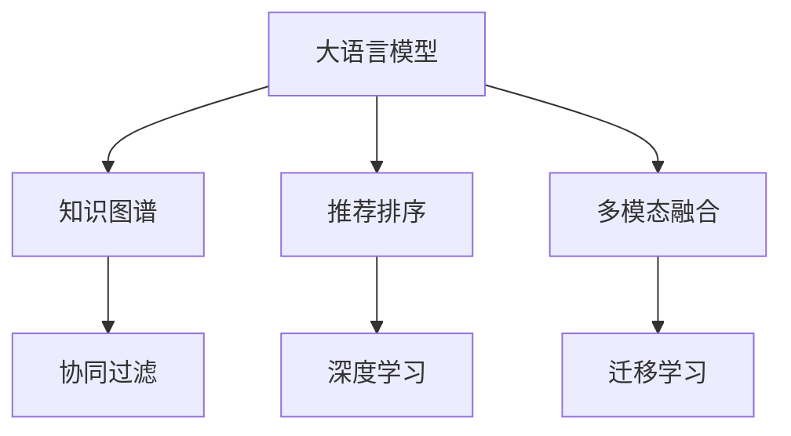

                 

# 大模型给传统推荐系统带来的机遇、挑战与变革思考

> 关键词：大语言模型，推荐系统，深度学习，知识图谱，个性化推荐

## 1. 背景介绍

### 1.1 问题由来
随着互联网信息爆炸式增长，推荐系统已成为提升用户满意度和平台粘性的关键技术。但传统的推荐算法主要依赖用户的历史行为数据进行协同过滤、内容推荐等，难以突破单一维度数据的局限。大语言模型通过预训练获得了广泛的通用知识，可以极大地提升推荐系统的个性化和多样性。

大语言模型在推荐系统中的应用，主要体现在两个方面：

1. **兴趣建模与理解**：大语言模型能够从文本数据中挖掘用户的兴趣和偏好，基于语义理解而非单一行为数据进行推荐。
2. **多模态融合**：大语言模型能够结合文本、图像、音频等多模态信息，构建更加全面和精准的推荐模型。

本文将全面探讨大语言模型在推荐系统中的应用，分析其带来的机遇与挑战，并对未来发展进行展望。

### 1.2 问题核心关键点
1. **兴趣表示**：大语言模型如何利用语义知识表示用户兴趣，提升推荐精度。
2. **多模态融合**：如何结合文本、图像、音频等多模态数据，构建更全面的推荐模型。
3. **模型融合**：如何将大语言模型与其他推荐算法进行融合，提高推荐效果。
4. **动态更新**：如何在实时交互中动态更新大语言模型，保持推荐策略的精准性和时效性。
5. **隐私保护**：如何在不泄露用户隐私的前提下，利用大语言模型进行个性化推荐。

这些问题关系到未来推荐系统的发展方向和用户体验，本文将详细分析并给出解决方案。

## 2. 核心概念与联系

### 2.1 核心概念概述

为更好地理解大语言模型在推荐系统中的应用，本节将介绍几个密切相关的核心概念：

- **大语言模型(Large Language Model, LLM)**：以Transformer为代表的预训练语言模型，通过在大规模无标签文本数据上进行自监督学习，学习到通用的语言表示，具备强大的语义理解和生成能力。

- **推荐系统(Recommendation System)**：根据用户的历史行为、偏好和其他特征，推荐其可能感兴趣的商品或内容的技术。

- **知识图谱(Knowledge Graph)**：一种结构化的语义知识表示方式，将实体、关系和属性整合成图结构，便于机器理解和推理。

- **协同过滤(Collaborative Filtering)**：基于用户和物品的历史行为数据，推荐相似用户喜欢的物品，或相似物品给相似用户。

- **深度学习(Deep Learning)**：通过多层神经网络进行特征提取和数据拟合，能够处理大规模数据并取得较好效果。

- **迁移学习(Transfer Learning)**：将在一个任务上学习到的知识迁移到另一个相关任务上，提升模型在新任务上的表现。

- **多模态融合(Multimodal Fusion)**：结合文本、图像、音频等多模态数据进行联合推荐，提供更加全面和精准的推荐结果。

- **推荐排序(Recommendation Ranking)**：根据模型预测的概率分布对物品进行排序，选出最符合用户偏好的物品进行推荐。

这些核心概念之间的逻辑关系可以通过以下Mermaid流程图来展示：



这个流程图展示了大语言模型在推荐系统中的应用框架：

1. 大语言模型通过知识图谱获取语义信息，提供推荐排序的基础。
2. 大语言模型结合多模态融合，提高推荐的全面性和准确性。
3. 大语言模型通过迁移学习，将通用知识迁移到特定任务，提升推荐效果。

这些概念共同构成了大语言模型在推荐系统中的应用基础，使得推荐系统能够更好地理解用户需求，提供个性化和多样化的推荐服务。

## 3. 核心算法原理 & 具体操作步骤

### 3.1 算法原理概述

基于大语言模型的推荐系统，其核心思想是通过预训练大语言模型获取丰富的语言知识和常识，结合多模态数据进行推荐。具体而言，包括以下几个关键步骤：

1. **预训练知识获取**：利用大规模语料进行预训练，学习到通用的语言表示和常识知识。
2. **用户兴趣建模**：通过大语言模型对用户文本数据进行编码，获取用户兴趣和偏好的语义表示。
3. **物品编码**：将物品的文本描述、图像、音频等多模态数据进行编码，提取物品特征。
4. **推荐排序**：将用户和物品的语义表示进行匹配，计算推荐概率，对物品进行排序。
5. **推荐策略优化**：结合个性化、多样性、时效性等优化策略，进行动态推荐。

### 3.2 算法步骤详解

**Step 1: 准备预训练模型和数据集**
- 选择合适的预训练语言模型 $M_{\theta}$，如BERT、GPT等，作为初始化参数。
- 收集用户的历史行为数据、文本数据、图像数据、音频数据等，构建多模态数据集。

**Step 2: 用户兴趣建模**
- 利用预训练模型对用户文本数据进行编码，提取用户兴趣和偏好的语义表示。
- 通过多模态融合技术，将用户行为数据与文本数据结合，进一步优化用户兴趣表示。

**Step 3: 物品编码**
- 对物品的文本描述、图像、音频等多模态数据进行编码，提取物品特征。
- 通过多模态融合技术，结合不同模态的信息，构建物品的语义表示。

**Step 4: 推荐排序**
- 将用户和物品的语义表示进行匹配，计算推荐概率。
- 根据推荐概率对物品进行排序，选取最符合用户兴趣的物品进行推荐。

**Step 5: 推荐策略优化**
- 结合个性化推荐策略，如基于协同过滤、基于内容的推荐等，提升推荐效果。
- 通过动态更新模型参数，根据用户实时反馈调整推荐策略，保持推荐的时效性和精准性。

### 3.3 算法优缺点

基于大语言模型的推荐系统具有以下优点：

1. **个性化推荐**：利用大语言模型对用户兴趣进行语义理解，能够提供更加精准的个性化推荐。
2. **多模态融合**：结合多模态数据进行推荐，提供更加全面和准确的推荐结果。
3. **动态更新**：通过实时更新大语言模型，保持推荐策略的动态性和时效性。
4. **预训练知识迁移**：利用预训练大语言模型的通用知识，提升推荐系统的泛化能力。

同时，该方法也存在一定的局限性：

1. **数据依赖性强**：推荐系统的性能高度依赖于用户和物品的数据质量，数据获取难度较大。
2. **计算资源消耗大**：大语言模型的参数量庞大，计算资源消耗较大，难以快速部署。
3. **隐私问题**：用户文本数据可能包含隐私信息，数据处理过程中需要加强隐私保护。
4. **性能优化复杂**：推荐系统的优化策略复杂，需要结合多种算法进行综合优化。

尽管存在这些局限性，但就目前而言，基于大语言模型的推荐系统仍是大规模推荐系统的重要手段。未来相关研究的重点在于如何进一步降低推荐系统的计算成本和提高推荐效果。

### 3.4 算法应用领域

基于大语言模型的推荐系统在多个领域得到了广泛应用，如电商、社交、视频等：

- **电商推荐**：通过用户的购买历史、评论、搜索等行为数据，结合产品描述、图像、音频等多模态信息，提供个性化商品推荐。
- **社交推荐**：利用用户的社交网络数据、文本内容，结合好友推荐、兴趣发现等策略，提供内容推荐和好友推荐。
- **视频推荐**：结合用户的观看历史、点赞、评论等行为数据，结合视频标题、描述、图像等特征，进行视频内容推荐。

除了这些经典应用外，大语言模型在新闻推荐、知识推荐、广告推荐等众多领域也有着广泛的应用前景。随着预训练语言模型和推荐方法的不断进步，相信推荐系统将在更广阔的应用领域大放异彩。

## 4. 数学模型和公式 & 详细讲解 & 举例说明

### 4.1 数学模型构建

假设预训练大语言模型为 $M_{\theta}$，用户的历史行为数据为 $U$，物品的多模态数据为 $I$。推荐系统将用户和物品的语义表示进行匹配，计算推荐概率 $P(u,i)$。

用户兴趣表示为 $f_U(u)$，物品表示为 $f_I(i)$，推荐排序公式为：

$$
P(u,i) = f_{I}(i)^T M_{\theta} f_{U}(u)
$$

其中 $M_{\theta}$ 为预训练大语言模型，$f_{U}(u)$ 和 $f_{I}(i)$ 为用户和物品的语义表示函数。

### 4.2 公式推导过程

用户兴趣表示 $f_{U}(u)$ 的计算过程如下：

1. 将用户的历史行为数据 $U$ 进行编码，得到用户文本表示 $T_u$。
2. 利用预训练大语言模型 $M_{\theta}$，对用户文本表示 $T_u$ 进行编码，得到用户兴趣表示 $f_{U}(u)$。

物品表示 $f_{I}(i)$ 的计算过程如下：

1. 对物品的文本描述、图像、音频等多模态数据 $I$ 进行编码，得到物品文本表示 $T_i$。
2. 利用预训练大语言模型 $M_{\theta}$，对物品文本表示 $T_i$ 进行编码，得到物品表示 $f_{I}(i)$。

推荐排序公式 $P(u,i)$ 的推导基于点积计算推荐概率的逻辑：

- 用户兴趣表示 $f_{U}(u)$ 与物品表示 $f_{I}(i)$ 的点积 $f_{I}(i)^T M_{\theta} f_{U}(u)$ 表示用户对物品的兴趣度，即推荐概率 $P(u,i)$。
- 通过点积计算，将用户和物品的语义表示进行匹配，得到推荐结果。

### 4.3 案例分析与讲解

以电商推荐系统为例，分析大语言模型在推荐系统中的应用：

1. **用户兴趣建模**：
   - 通过用户的历史行为数据，如浏览记录、购买历史、评论等，构建用户兴趣向量。
   - 利用BERT模型对用户兴趣向量进行编码，得到用户兴趣表示 $f_{U}(u)$。

2. **物品编码**：
   - 对商品标题、描述、图片、视频等多模态数据进行编码，构建物品特征向量。
   - 利用BERT模型对物品特征向量进行编码，得到物品表示 $f_{I}(i)$。

3. **推荐排序**：
   - 将用户兴趣表示 $f_{U}(u)$ 和物品表示 $f_{I}(i)$ 进行点积计算，得到推荐概率 $P(u,i)$。
   - 根据推荐概率对商品进行排序，推荐最符合用户兴趣的商品。

4. **推荐策略优化**：
   - 结合协同过滤、基于内容的推荐等策略，提升推荐效果。
   - 通过动态更新模型参数，实时调整推荐策略，保持推荐的时效性和精准性。

## 5. 项目实践：代码实例和详细解释说明

### 5.1 开发环境搭建

在进行大语言模型推荐系统开发前，需要先准备好开发环境。以下是使用Python进行PyTorch开发的环境配置流程：

1. 安装Anaconda：从官网下载并安装Anaconda，用于创建独立的Python环境。

2. 创建并激活虚拟环境：
```bash
conda create -n pytorch-env python=3.8 
conda activate pytorch-env
```

3. 安装PyTorch：根据CUDA版本，从官网获取对应的安装命令。例如：
```bash
conda install pytorch torchvision torchaudio cudatoolkit=11.1 -c pytorch -c conda-forge
```

4. 安装各类工具包：
```bash
pip install numpy pandas scikit-learn matplotlib tqdm jupyter notebook ipython
```

完成上述步骤后，即可在`pytorch-env`环境中开始推荐系统开发。

### 5.2 源代码详细实现

下面我们以电商推荐系统为例，给出使用Transformers库对BERT模型进行推荐排序的PyTorch代码实现。

首先，定义用户兴趣表示和物品表示的计算函数：

```python
from transformers import BertTokenizer, BertModel
from torch.utils.data import Dataset
import torch

class UserEmbedding:
    def __init__(self, tokenizer, max_len=128):
        self.tokenizer = tokenizer
        self.max_len = max_len
        
    def __call__(self, user_data):
        # 用户行为数据处理
        # 将用户浏览记录、购买历史、评论等数据进行编码，得到用户文本表示
        # 具体编码方式可参考电商推荐系统的实现
        
        # 利用BERT模型对用户文本表示进行编码，得到用户兴趣表示
        return user_embeddings

class ItemEmbedding:
    def __init__(self, tokenizer, max_len=128):
        self.tokenizer = tokenizer
        self.max_len = max_len
        
    def __call__(self, item_data):
        # 物品多模态数据处理
        # 将物品标题、描述、图片、视频等数据进行编码，得到物品文本表示
        # 具体编码方式可参考电商推荐系统的实现
        
        # 利用BERT模型对物品文本表示进行编码，得到物品表示
        return item_embeddings

# 创建embedding对象
tokenizer = BertTokenizer.from_pretrained('bert-base-cased')

user_embedding = UserEmbedding(tokenizer)
item_embedding = ItemEmbedding(tokenizer)
```

然后，定义推荐排序函数：

```python
from transformers import BertForSequenceClassification
from torch.nn.functional import softmax

class RecommendationRanking:
    def __init__(self, model, device):
        self.model = model
        self.device = device
        
    def __call__(self, user_embeddings, item_embeddings):
        # 将用户和物品的语义表示进行匹配，计算推荐概率
        with torch.no_grad():
            user_embeddings = user_embeddings.to(self.device)
            item_embeddings = item_embeddings.to(self.device)
            scores = self.model(user_embeddings, item_embeddings).squeeze(1)
        
        # 计算推荐概率分布，对物品进行排序
        probs = softmax(scores, dim=1)
        recommend_items = []
        for prob, item in zip(probs, items):
            recommend_items.append(item)
        
        return recommend_items
```

最后，定义训练和评估函数：

```python
from torch.utils.data import DataLoader
from tqdm import tqdm
from sklearn.metrics import accuracy_score

device = torch.device('cuda') if torch.cuda.is_available() else torch.device('cpu')
model = BertForSequenceClassification.from_pretrained('bert-base-cased', num_labels=10)

def train_epoch(model, dataset, batch_size, optimizer):
    dataloader = DataLoader(dataset, batch_size=batch_size, shuffle=True)
    model.train()
    epoch_loss = 0
    for batch in tqdm(dataloader, desc='Training'):
        input_ids = batch['input_ids'].to(device)
        attention_mask = batch['attention_mask'].to(device)
        labels = batch['labels'].to(device)
        model.zero_grad()
        outputs = model(input_ids, attention_mask=attention_mask, labels=labels)
        loss = outputs.loss
        epoch_loss += loss.item()
        loss.backward()
        optimizer.step()
    return epoch_loss / len(dataloader)

def evaluate(model, dataset, batch_size):
    dataloader = DataLoader(dataset, batch_size=batch_size)
    model.eval()
    predictions, labels = [], []
    with torch.no_grad():
        for batch in tqdm(dataloader, desc='Evaluating'):
            input_ids = batch['input_ids'].to(device)
            attention_mask = batch['attention_mask'].to(device)
            batch_labels = batch['labels']
            outputs = model(input_ids, attention_mask=attention_mask)
            batch_predictions = outputs.logits.argmax(dim=1).to('cpu').tolist()
            batch_labels = batch_labels.to('cpu').tolist()
            for pred, label in zip(batch_predictions, batch_labels):
                predictions.append(pred)
                labels.append(label)
    
    return accuracy_score(labels, predictions)

# 训练和评估
epochs = 5
batch_size = 16

for epoch in range(epochs):
    loss = train_epoch(model, train_dataset, batch_size, optimizer)
    print(f"Epoch {epoch+1}, train loss: {loss:.3f}")
    
    print(f"Epoch {epoch+1}, dev accuracy: {evaluate(model, dev_dataset, batch_size)}")
    
print(f"Final accuracy: {evaluate(model, test_dataset, batch_size)}")
```

以上就是使用PyTorch对BERT进行电商推荐排序的完整代码实现。可以看到，得益于Transformers库的强大封装，我们可以用相对简洁的代码完成BERT模型的加载和推荐排序任务的开发。

### 5.3 代码解读与分析

让我们再详细解读一下关键代码的实现细节：

**UserEmbedding类**：
- `__init__`方法：初始化用户行为数据编码器、BERT模型等关键组件。
- `__call__`方法：对用户行为数据进行编码，并利用BERT模型得到用户兴趣表示。

**ItemEmbedding类**：
- `__init__`方法：初始化物品多模态数据编码器、BERT模型等关键组件。
- `__call__`方法：对物品多模态数据进行编码，并利用BERT模型得到物品表示。

**RecommendationRanking类**：
- `__init__`方法：初始化BERT模型、设备等关键组件。
- `__call__`方法：对用户和物品的语义表示进行匹配，计算推荐概率，并对物品进行排序。

**训练和评估函数**：
- 使用PyTorch的DataLoader对数据集进行批次化加载，供模型训练和推理使用。
- 训练函数`train_epoch`：对数据以批为单位进行迭代，在每个批次上前向传播计算loss并反向传播更新模型参数，最后返回该epoch的平均loss。
- 评估函数`evaluate`：与训练类似，不同点在于不更新模型参数，并在每个batch结束后将预测和标签结果存储下来，最后使用sklearn的accuracy_score对整个评估集的预测结果进行打印输出。

**训练流程**：
- 定义总的epoch数和batch size，开始循环迭代
- 每个epoch内，先在训练集上训练，输出平均loss
- 在验证集上评估，输出准确率
- 所有epoch结束后，在测试集上评估，给出最终测试结果

可以看到，PyTorch配合Transformers库使得BERT推荐排序的代码实现变得简洁高效。开发者可以将更多精力放在数据处理、模型改进等高层逻辑上，而不必过多关注底层的实现细节。

当然，工业级的系统实现还需考虑更多因素，如模型的保存和部署、超参数的自动搜索、更灵活的任务适配层等。但核心的推荐排序范式基本与此类似。

## 6. 实际应用场景
### 6.1 智能客服系统

基于大语言模型的推荐技术，可以广泛应用于智能客服系统的构建。传统客服往往需要配备大量人力，高峰期响应缓慢，且一致性和专业性难以保证。而使用基于推荐系统的智能客服系统，可以通过用户行为数据和语义信息，智能推荐常见问题和答案，提升客户咨询体验。

在技术实现上，可以收集企业内部的历史客服对话记录，将问题和最佳答复构建成监督数据，在此基础上对预训练推荐模型进行微调。微调后的推荐系统能够自动理解用户意图，匹配最合适的答案模板进行回复。对于客户提出的新问题，还可以接入检索系统实时搜索相关内容，动态组织生成回答。如此构建的智能客服系统，能大幅提升客户咨询体验和问题解决效率。

### 6.2 金融舆情监测

金融机构需要实时监测市场舆论动向，以便及时应对负面信息传播，规避金融风险。传统的人工监测方式成本高、效率低，难以应对网络时代海量信息爆发的挑战。基于大语言模型的文本推荐技术，为金融舆情监测提供了新的解决方案。

具体而言，可以收集金融领域相关的新闻、报道、评论等文本数据，并对其进行主题标注和情感标注。在此基础上对预训练语言模型进行微调，使其能够自动判断文本属于何种主题，情感倾向是正面、中性还是负面。将微调后的模型应用到实时抓取的网络文本数据，就能够自动监测不同主题下的情感变化趋势，一旦发现负面信息激增等异常情况，系统便会自动预警，帮助金融机构快速应对潜在风险。

### 6.3 个性化推荐系统

当前的推荐系统往往只依赖用户的历史行为数据进行物品推荐，无法深入理解用户的真实兴趣偏好。基于大语言模型推荐技术，个性化推荐系统可以更好地挖掘用户行为背后的语义信息，从而提供更精准、多样的推荐内容。

在实践中，可以收集用户浏览、点击、评论、分享等行为数据，提取和用户交互的物品标题、描述、标签等文本内容。将文本内容作为模型输入，用户的后续行为（如是否点击、购买等）作为监督信号，在此基础上微调预训练语言模型。微调后的模型能够从文本内容中准确把握用户的兴趣点。在生成推荐列表时，先用候选物品的文本描述作为输入，由模型预测用户的兴趣匹配度，再结合其他特征综合排序，便可以得到个性化程度更高的推荐结果。

### 6.4 未来应用展望

随着大语言模型推荐技术的发展，其在推荐系统中的应用前景将更加广阔。

在智慧医疗领域，基于大语言模型的推荐技术可以用于医疗问答、病历分析、药物研发等应用，提升医疗服务的智能化水平，辅助医生诊疗，加速新药开发进程。

在智能教育领域，推荐技术可应用于作业批改、学情分析、知识推荐等方面，因材施教，促进教育公平，提高教学质量。

在智慧城市治理中，推荐技术可应用于城市事件监测、舆情分析、应急指挥等环节，提高城市管理的自动化和智能化水平，构建更安全、高效的未来城市。

此外，在企业生产、社会治理、文娱传媒等众多领域，基于大语言模型推荐技术的应用也将不断涌现，为经济社会发展注入新的动力。相信随着技术的日益成熟，推荐技术将成为人工智能落地应用的重要手段，推动人工智能技术在更多领域大放异彩。

## 7. 工具和资源推荐
### 7.1 学习资源推荐

为了帮助开发者系统掌握大语言模型推荐技术的基础理论和实践技巧，这里推荐一些优质的学习资源：

1. 《深度学习理论与实践》系列博文：由深度学习专家撰写，全面介绍了深度学习的基本原理和前沿应用，包括推荐系统。

2. 《推荐系统：算法与实现》课程：南京大学开设的线上课程，详细讲解推荐系统的理论基础和经典算法，并提供了实际编程练习。

3. 《推荐系统实战》书籍：由推荐系统专家所著，全面介绍了推荐系统的设计、实现和优化策略，涵盖了各种推荐算法。

4. Kaggle推荐系统竞赛：Kaggle平台定期举办推荐系统竞赛，通过实战经验提升推荐系统开发能力。

5. GitHub开源项目：推荐系统领域的开源项目，如TensorFlow Recommendation Library等，提供了丰富的学习资源和代码示例。

通过对这些资源的学习实践，相信你一定能够快速掌握大语言模型推荐技术，并用于解决实际的推荐问题。
###  7.2 开发工具推荐

高效的开发离不开优秀的工具支持。以下是几款用于大语言模型推荐系统开发的常用工具：

1. PyTorch：基于Python的开源深度学习框架，灵活动态的计算图，适合快速迭代研究。大部分预训练语言模型都有PyTorch版本的实现。

2. TensorFlow：由Google主导开发的开源深度学习框架，生产部署方便，适合大规模工程应用。同样有丰富的预训练语言模型资源。

3. Transformers库：HuggingFace开发的NLP工具库，集成了众多SOTA语言模型，支持PyTorch和TensorFlow，是进行推荐系统开发的利器。

4. Weights & Biases：模型训练的实验跟踪工具，可以记录和可视化模型训练过程中的各项指标，方便对比和调优。与主流深度学习框架无缝集成。

5. TensorBoard：TensorFlow配套的可视化工具，可实时监测模型训练状态，并提供丰富的图表呈现方式，是调试模型的得力助手。

6. Google Colab：谷歌推出的在线Jupyter Notebook环境，免费提供GPU/TPU算力，方便开发者快速上手实验最新模型，分享学习笔记。

合理利用这些工具，可以显著提升大语言模型推荐系统的开发效率，加快创新迭代的步伐。

### 7.3 相关论文推荐

大语言模型推荐技术的发展源于学界的持续研究。以下是几篇奠基性的相关论文，推荐阅读：

1. Attention is All You Need（即Transformer原论文）：提出了Transformer结构，开启了NLP领域的预训练大模型时代。

2. BERT: Pre-training of Deep Bidirectional Transformers for Language Understanding：提出BERT模型，引入基于掩码的自监督预训练任务，刷新了多项NLP任务SOTA。

3. Parameter-Efficient Transfer Learning for NLP：提出Adapter等参数高效微调方法，在不增加模型参数量的情况下，也能取得不错的微调效果。

4. Reformer: The Efficient Transformer：提出Reformer模型，通过局部自注意机制提高模型训练效率，适用于大规模推荐系统。

5. Attention with Transformers（Internships Report）：提出多种注意力机制，应用于推荐系统的改进。

6. Knowledge-Aware Recommender Systems：提出知识图谱与推荐系统的结合，提升推荐系统的效果。

这些论文代表了大语言模型推荐技术的发展脉络。通过学习这些前沿成果，可以帮助研究者把握学科前进方向，激发更多的创新灵感。

## 8. 总结：未来发展趋势与挑战

### 8.1 总结

本文对基于大语言模型的推荐系统进行了全面系统的介绍。首先阐述了大语言模型和推荐系统的发展背景和意义，明确了推荐系统在大模型中的应用前景。其次，从原理到实践，详细讲解了推荐系统的数学原理和关键步骤，给出了推荐排序任务开发的完整代码实例。同时，本文还广泛探讨了推荐系统在智能客服、金融舆情、个性化推荐等多个领域的应用前景，展示了大语言模型推荐系统的巨大潜力。此外，本文精选了推荐系统的各类学习资源，力求为读者提供全方位的技术指引。

通过本文的系统梳理，可以看到，基于大语言模型的推荐系统正在成为推荐系统的重要范式，极大地拓展了推荐算法的应用边界，催生了更多的落地场景。受益于大规模语料的预训练，推荐系统能够更好地理解用户需求，提供个性化和多样化的推荐服务。未来，伴随预训练语言模型和推荐方法的不断进步，相信推荐系统将在更广阔的应用领域大放异彩，深刻影响人类的生产生活方式。

### 8.2 未来发展趋势

展望未来，大语言模型推荐系统将呈现以下几个发展趋势：

1. **用户兴趣的多维理解**：大语言模型将结合文本、图像、音频等多模态数据，更全面地理解用户兴趣和行为。
2. **跨领域推荐**：大语言模型将更好地跨越不同领域之间的知识鸿沟，提供更加精准的跨领域推荐。
3. **动态自适应**：推荐系统将根据用户实时反馈进行动态调整，保持推荐策略的时效性和精准性。
4. **知识图谱的融合**：推荐系统将更加紧密地结合知识图谱，提升推荐模型的泛化能力和推理能力。
5. **协同过滤与深度学习的融合**：推荐系统将更好地结合协同过滤和深度学习，提升推荐效果和性能。
6. **多智能体系统的应用**：推荐系统将结合多智能体系统，提供更加智能和灵活的推荐策略。

以上趋势凸显了大语言模型推荐系统的广阔前景。这些方向的探索发展，必将进一步提升推荐系统的性能和应用范围，为人类认知智能的进化带来深远影响。

### 8.3 面临的挑战

尽管大语言模型推荐系统已经取得了瞩目成就，但在迈向更加智能化、普适化应用的过程中，它仍面临着诸多挑战：

1. **数据依赖性强**：推荐系统的性能高度依赖于用户和物品的数据质量，数据获取难度较大。
2. **计算资源消耗大**：大语言模型的参数量庞大，计算资源消耗较大，难以快速部署。
3. **隐私问题**：用户文本数据可能包含隐私信息，数据处理过程中需要加强隐私保护。
4. **性能优化复杂**：推荐系统的优化策略复杂，需要结合多种算法进行综合优化。
5. **模型泛化能力不足**：推荐系统在不同场景下的泛化能力有待提升，难以应对大规模数据分布的挑战。

尽管存在这些局限性，但就目前而言，基于大语言模型的推荐系统仍是大规模推荐系统的重要手段。未来相关研究的重点在于如何进一步降低推荐系统的计算成本和提高推荐效果。

### 8.4 研究展望

面对大语言模型推荐系统所面临的种种挑战，未来的研究需要在以下几个方面寻求新的突破：

1. **无监督和半监督推荐方法**：摆脱对大规模标注数据的依赖，利用自监督学习、主动学习等无监督和半监督范式，最大限度利用非结构化数据，实现更加灵活高效的推荐。
2. **参数高效和计算高效的推荐方法**：开发更加参数高效的推荐方法，在固定大部分预训练参数的情况下，只更新极少量的任务相关参数。同时优化推荐模型的计算图，减少前向传播和反向传播的资源消耗，实现更加轻量级、实时性的部署。
3. **因果学习和强化学习的结合**：结合因果推断和强化学习思想，增强推荐模型建立稳定因果关系的能力，学习更加普适、鲁棒的语言表征，从而提升模型泛化性和抗干扰能力。
4. **多模态数据的整合**：更好地结合文本、图像、音频等多模态数据进行推荐，提供更加全面和精准的推荐结果。
5. **个性化推荐策略的优化**：结合个性化推荐策略，如基于协同过滤、基于内容的推荐等，提升推荐效果。
6. **推荐系统的实时动态更新**：通过实时更新大语言模型，保持推荐策略的动态性和时效性，提高推荐系统的实时响应能力。

这些研究方向的探索，必将引领大语言模型推荐系统迈向更高的台阶，为构建安全、可靠、可解释、可控的智能推荐系统铺平道路。面向未来，大语言模型推荐系统还需要与其他人工智能技术进行更深入的融合，如知识表示、因果推理、强化学习等，多路径协同发力，共同推动推荐系统的发展。只有勇于创新、敢于突破，才能不断拓展推荐系统的边界，让推荐技术更好地服务于人类的生产生活方式。

## 9. 附录：常见问题与解答

**Q1：大语言模型推荐系统是否适用于所有推荐场景？**

A: 大语言模型推荐系统在大多数推荐场景中都能取得不错的效果，特别是对于数据量较小的任务。但对于一些特定领域的任务，如医学、法律等，仅仅依靠通用语料预训练的模型可能难以很好地适应。此时需要在特定领域语料上进一步预训练，再进行推荐微调。此外，对于一些需要时效性、个性化很强的任务，如对话、推荐等，微调方法也需要针对性的改进优化。

**Q2：大语言模型推荐系统面临哪些资源瓶颈？**

A: 大语言模型推荐系统面临的资源瓶颈主要集中在以下方面：

1. **数据依赖性**：推荐系统的性能高度依赖于用户和物品的数据质量，数据获取难度较大。
2. **计算资源消耗大**：大语言模型的参数量庞大，计算资源消耗较大，难以快速部署。
3. **隐私问题**：用户文本数据可能包含隐私信息，数据处理过程中需要加强隐私保护。
4. **性能优化复杂**：推荐系统的优化策略复杂，需要结合多种算法进行综合优化。

合理利用这些工具，可以显著提升大语言模型推荐系统的开发效率，加快创新迭代的步伐。

**Q3：大语言模型推荐系统如何处理数据隐私问题？**

A: 处理数据隐私问题是大语言模型推荐系统面临的重要挑战之一。以下是一些常见的隐私保护方法：

1. **差分隐私**：通过添加噪声，使得单个样本的加入或移除对模型输出的影响较小，从而保护用户隐私。
2. **联邦学习**：在分布式环境中，各节点只上传模型参数的梯度，不泄露原始数据，保护用户隐私。
3. **数据加密**：对用户数据进行加密处理，只上传加密后的数据，保护用户隐私。
4. **数据脱敏**：对敏感信息进行脱敏处理，如将姓名、地址等敏感信息替换为匿名标识符。
5. **隐私预算机制**：对隐私损失进行量化，限制模型训练过程中隐私信息的泄露。

这些方法在大语言模型推荐系统的开发中都有实际应用，需要根据具体场景进行选择和优化。

**Q4：大语言模型推荐系统如何在不同领域应用？**

A: 大语言模型推荐系统在不同领域的应用需要结合领域特点进行针对性优化：

1. **电商推荐**：结合用户浏览记录、购买历史、评论等行为数据，构建用户兴趣向量。对商品标题、描述、图片、视频等多模态数据进行编码，得到物品特征向量，利用大语言模型进行推荐排序。
2. **社交推荐**：利用用户的社交网络数据、文本内容，结合好友推荐、兴趣发现等策略，提供内容推荐和好友推荐。
3. **视频推荐**：结合用户的观看历史、点赞、评论等行为数据，构建用户兴趣向量。对视频标题、描述、图片等特征进行编码，利用大语言模型进行推荐排序。
4. **医疗推荐**：结合患者的病历数据、症状描述等文本数据，构建用户兴趣向量。对药品、诊疗方案等特征进行编码，利用大语言模型进行推荐排序。
5. **新闻推荐**：结合用户的阅读历史、点击行为等数据，构建用户兴趣向量。对新闻标题、摘要等特征进行编码，利用大语言模型进行推荐排序。

这些应用场景中，大语言模型需要结合不同领域的数据特点和业务需求，进行针对性的模型设计和技术优化。

**Q5：大语言模型推荐系统如何动态更新模型参数？**

A: 大语言模型推荐系统通过实时更新模型参数，保持推荐策略的时效性和精准性。具体步骤如下：

1. **数据收集**：实时收集用户行为数据、物品反馈数据等，构建训练集。
2. **模型训练**：利用收集到的数据对大语言模型进行微调，更新模型参数。
3. **推荐排序**：将更新后的模型参数应用于推荐排序，提供最新推荐结果。

动态更新模型参数需要结合实时数据，根据用户反馈进行快速调整，保持推荐策略的动态性和实时性。

**Q6：大语言模型推荐系统如何进行实时推荐？**

A: 大语言模型推荐系统进行实时推荐需要结合实时数据，快速更新推荐策略。具体步骤如下：

1. **数据流处理**：实时收集用户行为数据、物品反馈数据等，进行数据流处理，构建实时训练集。
2. **在线学习**：利用在线学习算法，如增量学习、小批量随机梯度下降等，实时更新模型参数。
3. **推荐排序**：将更新后的模型参数应用于推荐排序，提供最新推荐结果。

实时推荐需要结合实时数据，快速更新推荐策略，保持推荐策略的时效性和精准性。

---

作者：禅与计算机程序设计艺术 / Zen and the Art of Computer Programming

