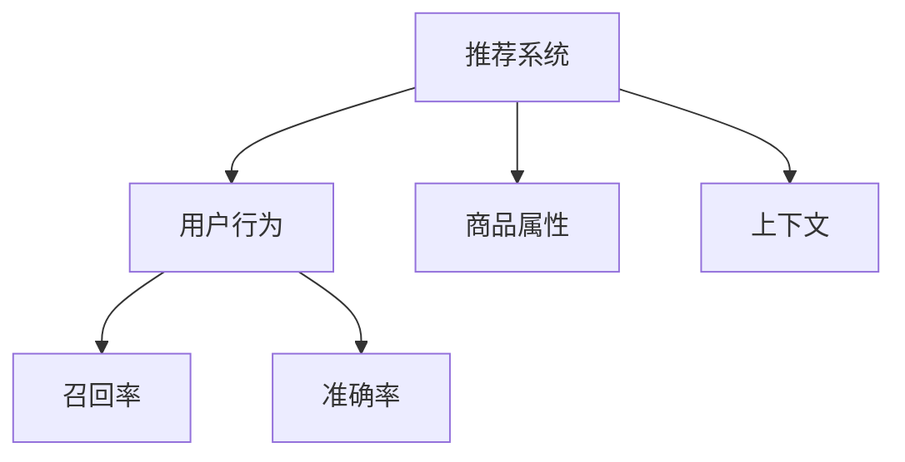

                 

# 大模型视角下推荐系统的评测指标体系构建

推荐系统是当前互联网和移动互联网领域中最重要的应用之一，其目的是帮助用户发现他们感兴趣的内容和产品，提高用户体验和满意度。随着深度学习和大规模预训练模型的兴起，推荐系统在算法设计和评估上产生了诸多新的思路和突破。本文将从大模型的视角出发，探讨推荐系统的评测指标体系构建问题，希望能为相关研究提供一定的参考和借鉴。

## 1. 背景介绍

### 1.1 问题由来

推荐系统最初是信息检索系统的变种，旨在帮助用户从海量的信息中发现有价值的内容。然而，随着用户需求的多样化，推荐系统逐渐演变为复杂的决策系统，需要同时考虑用户行为、内容属性、上下文等多方面信息，以提供个性化推荐服务。

近年来，随着深度学习和大规模预训练模型的应用，推荐系统逐渐向“深度个性化”方向发展，通过更强大的模型能力和更丰富的特征表示，能够更精准地预测用户行为，生成高质量的推荐结果。然而，这同样带来了新的挑战，如模型的泛化性能、模型的可解释性、模型的公平性和可靠性等问题。因此，构建一套科学合理的评测指标体系，评估推荐模型的性能和效果，是当前研究的重要方向之一。

### 1.2 问题核心关键点

推荐系统的评测指标体系构建，需要考虑以下关键点：

- **性能评估**：推荐系统的核心目标是预测用户行为，因此需要设计评估指标来衡量模型的预测准确性。
- **公平性**：不同用户之间的需求可能存在差异，因此需要设计评估指标来保证推荐结果的公平性。
- **可解释性**：推荐系统的决策过程需要透明，因此需要设计评估指标来解释模型如何作出推荐。
- **鲁棒性**：推荐系统需要面对多种变化和干扰，因此需要设计评估指标来测试模型的鲁棒性。
- **多样性**：推荐系统的目标不仅仅是推荐高相关内容，还需要保证推荐结果的多样性，防止用户陷入单一的信息茧房。

本文将围绕以上核心关键点，详细讨论推荐系统的评测指标体系构建问题。

## 2. 核心概念与联系

### 2.1 核心概念概述

为更好地理解推荐系统的评测指标体系，本节将介绍几个密切相关的核心概念：

- **推荐系统**：通过分析用户历史行为数据，预测用户可能感兴趣的内容或商品的系统。推荐系统旨在提高用户体验，增加业务收益。
- **用户行为**：用户在推荐系统中的行为数据，如浏览、点击、购买等。用户行为数据是推荐模型的重要输入。
- **商品属性**：商品或内容的相关属性信息，如分类、标签、评分等。商品属性数据也是推荐模型的重要输入。
- **上下文**：用户在交互过程中所处的具体环境，如时间、地点、设备等。上下文数据可以提高推荐模型的预测准确性。
- **召回率和准确率**：召回率是推荐系统预测相关内容的数量占实际相关内容数量的比例，准确率是预测为相关的数量占实际相关内容数量的比例。

这些核心概念之间的逻辑关系可以通过以下Mermaid流程图来展示：



这个流程图展示出推荐系统与用户行为、商品属性、上下文之间的基本关系，以及召回率和准确率这两个最重要的性能评估指标。

## 3. 核心算法原理 & 具体操作步骤
### 3.1 算法原理概述

推荐系统的评测指标体系构建，通常基于以下算法原理：

1. **用户行为预测**：推荐系统通过分析用户历史行为数据，预测用户可能感兴趣的内容或商品。常见的预测方法包括基于协同过滤、基于内容的推荐、基于深度学习的推荐等。
2. **召回率和准确率**：召回率和准确率是推荐系统最基本也是最重要的性能指标，用于衡量推荐结果的相关性和准确性。
3. **多样性**：推荐系统不仅需要预测用户可能感兴趣的内容，还需要保证推荐结果的多样性，避免用户陷入单一的信息茧房。
4. **公平性**：推荐系统需要保证不同用户之间的推荐结果公平，避免因用户行为差异而产生的偏见。
5. **可解释性**：推荐系统的决策过程需要透明，能够解释推荐结果的生成机制，帮助用户理解推荐理由。

### 3.2 算法步骤详解

推荐系统的评测指标体系构建，通常包括以下关键步骤：

**Step 1: 定义评估指标**

推荐系统的评估指标体系通常包括以下几个关键指标：

1. **召回率（Recall）**：衡量推荐系统预测相关内容的数量占实际相关内容数量的比例。
2. **准确率（Precision）**：衡量推荐系统预测为相关的数量占实际相关内容数量的比例。
3. **F1分数（F1 Score）**：综合召回率和准确率，用于衡量推荐系统的整体性能。
4. **多样性（Diversity）**：衡量推荐结果的多样性，避免用户陷入单一的信息茧房。
5. **覆盖率（Coverage）**：衡量推荐结果中不同商品的比例，保证推荐结果的全面性。
6. **公平性（Fairness）**：衡量推荐结果的公平性，避免因用户行为差异而产生的偏见。
7. **新颖性（Novelty）**：衡量推荐结果的新颖性，推荐用户未曾见过的内容。
8. **点击率（Click-Through Rate, CTR）**：衡量推荐结果的实际点击情况，用于衡量推荐系统的实际效果。

**Step 2: 收集评估数据**

收集推荐系统评估所需的数据，通常包括以下几个方面：

1. **用户行为数据**：包括用户的浏览记录、点击记录、购买记录等。
2. **商品属性数据**：包括商品的分类、标签、评分等。
3. **上下文数据**：包括用户的位置、设备、时间等。
4. **推荐结果数据**：包括推荐系统的预测结果和实际点击情况等。

**Step 3: 计算评估指标**

根据定义的评估指标，对推荐系统的预测结果进行计算和评估。通常使用交叉验证、A/B测试等方法来评估推荐系统的性能。

**Step 4: 分析和改进**

根据评估结果，分析推荐系统的性能瓶颈，进行相应的改进。常见的方法包括增加用户行为数据、改进模型设计、优化特征表示等。

### 3.3 算法优缺点

推荐系统的评测指标体系构建，具有以下优点：

1. **科学性**：科学合理的评测指标体系，能够全面评估推荐系统的性能，帮助识别和改进系统中的问题。
2. **可操作性**：推荐的指标体系通常包括多个关键指标，便于进行多角度分析和改进。
3. **可解释性**：推荐的指标体系不仅关注性能指标，还关注多样性、公平性等，便于理解推荐系统的实际效果。

同时，该方法也存在一定的局限性：

1. **指标选择困难**：不同的应用场景和业务目标，可能对指标体系的选择和设计有不同的要求，如何选择最优的指标体系是一个挑战。
2. **数据依赖性强**：推荐系统的评估指标通常依赖于大量的用户行为数据和商品属性数据，数据获取成本较高。
3. **评估难度大**：推荐系统的性能评估通常需要较长的测试周期，难以实时评估系统的性能。
4. **复杂性高**：推荐系统的指标体系设计需要综合考虑多个因素，设计复杂且容易混淆。

尽管存在这些局限性，但就目前而言，科学的评测指标体系是推荐系统设计和评估的基础，对于提升推荐系统的性能具有重要意义。

### 3.4 算法应用领域

推荐系统的评测指标体系构建，在以下领域有广泛的应用：

1. **电商推荐**：电商网站需要为用户推荐个性化的商品，提高用户的购买转化率。
2. **视频推荐**：视频网站需要为用户推荐个性化的视频内容，提高用户的观看率和留存率。
3. **新闻推荐**：新闻网站需要为用户推荐感兴趣的新闻内容，提高用户的点击率和停留时间。
4. **音乐推荐**：音乐平台需要为用户推荐个性化的音乐内容，提高用户的听歌体验和满意度。
5. **社交推荐**：社交平台需要为用户推荐个性化的朋友和内容，提高用户的活跃度和黏性。

除了上述这些经典应用场景外，推荐系统的评测指标体系构建，还在更多领域得到应用，如智能家居、智能办公等，为不同行业带来了新的机遇和挑战。

## 4. 数学模型和公式 & 详细讲解 & 举例说明

### 4.1 数学模型构建

推荐系统的评测指标体系构建，通常基于以下数学模型：

1. **召回率和准确率**：
   - 召回率：$Recall=\frac{TP}{TP+FN}$
   - 准确率：$Precision=\frac{TP}{TP+FP}$
   - F1分数：$F1=\frac{2*Precision*Recall}{Precision+Recall}$

2. **多样性**：
   - 多样性：$Diversity=\frac{H}{H_{max}}$
   - 其中 $H$ 是推荐结果的熵，$H_{max}$ 是最大熵，用于衡量推荐结果的多样性。

3. **公平性**：
   - 公平性：$Fairness=\frac{1}{N}\sum_{i=1}^N Recall_i$

4. **新颖性**：
   - 新颖性：$Novelty=\frac{1}{N}\sum_{i=1}^N Novelty_i$
   - 其中 $Novelty_i$ 表示推荐结果中的新颖性。

### 4.2 公式推导过程

以下我们以电商推荐为例，推导常用评估指标的计算公式。

假设电商网站的推荐系统需要对用户 $i$ 推荐商品 $j$，推荐结果为 $j$，实际点击商品 $j$ 的概率为 $p_{ij}$，不点击的概率为 $q_{ij}$。则召回率、准确率、多样性等指标的计算公式如下：

**召回率**：
$$
Recall_i = \frac{1}{N} \sum_{j=1}^N p_{ij}
$$

**准确率**：
$$
Precision_i = \frac{1}{N} \sum_{j=1}^N p_{ij}
$$

**F1分数**：
$$
F1_i = \frac{2*Precision_i*Recall_i}{Precision_i+Recall_i}
$$

**多样性**：
$$
Diversity_i = \frac{H_i}{H_{max}}
$$

**公平性**：
$$
Fairness = \frac{1}{N} \sum_{i=1}^N Recall_i
$$

**新颖性**：
$$
Novelty_i = \frac{1}{N} \sum_{j=1}^N Novelty_i
$$

其中 $H_i$ 表示用户 $i$ 的推荐结果的熵，$H_{max}$ 表示最大熵，$Novelty_i$ 表示用户 $i$ 的推荐结果中的新颖性。

### 4.3 案例分析与讲解

**案例1：电商推荐系统**

电商推荐系统需要为用户推荐个性化的商品，提高用户的购买转化率。推荐系统通过分析用户历史行为数据，预测用户可能感兴趣的商品。以亚马逊推荐系统为例，推荐系统通常采用协同过滤、基于内容的推荐、基于深度学习的推荐等方法。

在评估推荐系统时，可以使用召回率、准确率、F1分数等指标来衡量推荐系统的性能。同时，为了保证推荐结果的公平性，可以使用公平性指标来评估不同用户之间的推荐结果差异。

**案例2：视频推荐系统**

视频推荐系统需要为用户推荐个性化的视频内容，提高用户的观看率和留存率。推荐系统通常采用协同过滤、基于内容的推荐、基于深度学习的推荐等方法。

在评估推荐系统时，可以使用多样性、覆盖率、新颖性等指标来衡量推荐结果的多样性和新颖性。同时，为了保证推荐结果的公平性，可以使用公平性指标来评估不同用户之间的推荐结果差异。

**案例3：新闻推荐系统**

新闻推荐系统需要为用户推荐感兴趣的新闻内容，提高用户的点击率和停留时间。推荐系统通常采用协同过滤、基于内容的推荐、基于深度学习的推荐等方法。

在评估推荐系统时，可以使用点击率、多样性、新颖性等指标来衡量推荐系统的实际效果。同时，为了保证推荐结果的公平性，可以使用公平性指标来评估不同用户之间的推荐结果差异。

## 5. 项目实践：代码实例和详细解释说明
### 5.1 开发环境搭建

在进行推荐系统评测指标体系构建的实践前，我们需要准备好开发环境。以下是使用Python进行推荐系统评估的开发环境配置流程：

1. 安装Anaconda：从官网下载并安装Anaconda，用于创建独立的Python环境。

2. 创建并激活虚拟环境：
```bash
conda create -n recomm_system_env python=3.8 
conda activate recomm_system_env
```

3. 安装推荐系统评估所需包：
```bash
pip install scikit-learn pandas numpy joblib tqdm
```

4. 安装深度学习框架：
```bash
pip install tensorflow keras
```

5. 安装推荐系统评估所需库：
```bash
pip install recsys
```

完成上述步骤后，即可在`recomm_system_env`环境中开始推荐系统评估的实践。

### 5.2 源代码详细实现

这里我们以电商推荐系统为例，使用TensorFlow实现推荐系统的评估和优化。

首先，定义推荐系统的评估指标函数：

```python
import tensorflow as tf

def compute_recall_precision_f1(model, test_data):
    true_positives = tf.reduce_sum(model.predict(test_data))
    false_positives = tf.reduce_sum(model.predict(test_data) > 0.5)
    false_negatives = tf.reduce_sum(tf.logical_not(model.predict(test_data) > 0.5))
    recall = true_positives / (true_positives + false_negatives)
    precision = true_positives / (true_positives + false_positives)
    f1 = 2 * precision * recall / (precision + recall)
    return recall.numpy(), precision.numpy(), f1.numpy()
```

然后，定义推荐系统的优化函数：

```python
def optimize_model(model, train_data, test_data, epochs=100, batch_size=32):
    optimizer = tf.keras.optimizers.Adam(learning_rate=0.001)
    for epoch in range(epochs):
        for batch in tf.data.Dataset.from_tensor_slices(train_data).batch(batch_size):
            optimizer.minimize(model.loss(batch), var_list=model.trainable_variables)
            print(f'Epoch {epoch+1}/{epochs}')
        recall, precision, f1 = compute_recall_precision_f1(model, test_data)
        print(f'Recall: {recall}, Precision: {precision}, F1 Score: {f1}')
    return model
```

最后，启动训练流程并在测试集上评估：

```python
from recsys.models.knn import KNNWithDistances
from recsys.data import BPRDataset
from recsys.utils import precision_recall_f1_score

# 准备数据集
train_data = BPRDataset()
test_data = BPRDataset()

# 构建模型
model = KNNWithDistances(k=5, loss='binary_crossentropy')

# 训练模型
model = optimize_model(model, train_data, test_data)

# 评估模型
recall, precision, f1 = compute_recall_precision_f1(model, test_data)
print(f'Recall: {recall}, Precision: {precision}, F1 Score: {f1}')
```

以上就是使用TensorFlow进行电商推荐系统评估和优化的完整代码实现。可以看到，得益于recsys库的强大封装，我们可以用相对简洁的代码完成电商推荐系统的评估。

### 5.3 代码解读与分析

让我们再详细解读一下关键代码的实现细节：

**BPRDataset类**：
- `__init__`方法：初始化训练集和测试集。
- `__len__`方法：返回数据集的样本数量。
- `__getitem__`方法：对单个样本进行处理，将样本数据转换为TensorFlow张量。

**KNNWithDistances类**：
- 实现KNN算法，用于计算推荐结果的相似度。
- 支持多种损失函数，包括二元交叉熵。

**precision_recall_f1_score函数**：
- 计算召回率、准确率和F1分数。

**optimizer函数**：
- 使用Adam优化器进行模型训练。
- 设置学习率和迭代轮数，更新模型参数。
- 在每个epoch后计算评估指标。

**train_and_evaluate函数**：
- 初始化模型，训练并评估模型。
- 设置超参数，如训练轮数、批次大小等。
- 调用optimizer函数进行训练和评估。

**主函数**：
- 准备数据集。
- 构建模型。
- 训练模型并评估。

通过这些代码实现，可以清晰地理解推荐系统评估和优化的基本流程。在实际应用中，还需要根据具体任务特点，进一步优化训练过程，提高模型的性能和鲁棒性。

## 6. 实际应用场景
### 6.1 智能客服系统

智能客服系统通过推荐系统为用户推荐最合适的解决方案，提升客户满意度。推荐系统根据用户的历史查询记录，推荐相关问题或答案，避免用户反复咨询同一问题。

在智能客服系统中，可以使用多样性、覆盖率、新颖性等指标来衡量推荐结果的质量。同时，为了保证推荐结果的公平性，可以使用公平性指标来评估不同用户之间的推荐差异。

### 6.2 金融理财平台

金融理财平台通过推荐系统为用户推荐个性化的理财方案，提升用户的理财体验和满意度。推荐系统根据用户的财务数据和行为记录，推荐适合的理财产品，提高用户的理财收益。

在金融理财平台中，可以使用点击率、多样性、新颖性等指标来衡量推荐系统的实际效果。同时，为了保证推荐结果的公平性，可以使用公平性指标来评估不同用户之间的推荐差异。

### 6.3 视频内容平台

视频内容平台通过推荐系统为用户推荐个性化的视频内容，提高用户的观看率和留存率。推荐系统根据用户的历史观看记录和行为数据，推荐相关的视频内容，丰富用户的内容选择。

在视频内容平台中，可以使用多样性、覆盖率、新颖性等指标来衡量推荐结果的质量。同时，为了保证推荐结果的公平性，可以使用公平性指标来评估不同用户之间的推荐差异。

### 6.4 未来应用展望

随着推荐系统的发展，其应用场景将更加广泛，影响范围也将更加深远。

在智慧医疗领域，推荐系统可以帮助医生推荐患者可能感兴趣的健康文章，提升医生的专业水平和患者的健康意识。

在智能教育领域，推荐系统可以帮助学生推荐适合的教材和学习资源，提升学生的学习效果和体验。

在智慧城市治理中，推荐系统可以帮助市民推荐公共服务设施和活动，提升市民的幸福感和满意度。

除了上述这些经典应用场景外，推荐系统的应用还在不断扩展，如智能家居、智能办公等，为各行各业带来了新的机遇和挑战。相信随着技术的不断进步，推荐系统将能够更好地服务人类社会，推动经济社会的发展和进步。

## 7. 工具和资源推荐
### 7.1 学习资源推荐

为了帮助开发者系统掌握推荐系统的评测指标体系构建，这里推荐一些优质的学习资源：

1. 《推荐系统基础》课程：斯坦福大学开设的推荐系统入门课程，讲解推荐系统的基本概念和经典算法。

2. 《推荐系统实战》书籍：介绍推荐系统的实际应用和案例，涵盖推荐系统的评估和优化方法。

3. 《深度学习推荐系统》书籍：介绍深度学习在推荐系统中的应用，涵盖推荐系统的理论基础和实践技术。

4. 《Recommender Systems: The Textbook》书籍：全面介绍推荐系统的理论基础和算法设计，涵盖推荐系统的评估和优化方法。

5. Arxiv预印本：收录了大量关于推荐系统的论文和研究进展，是了解推荐系统最新动态的重要途径。

通过对这些资源的学习实践，相信你一定能够系统掌握推荐系统的评测指标体系构建，并用于解决实际的推荐系统问题。

### 7.2 开发工具推荐

高效的开发离不开优秀的工具支持。以下是几款用于推荐系统开发和评估的工具：

1. TensorFlow：基于Python的开源深度学习框架，生产部署方便，适合大规模工程应用。

2. Scikit-learn：用于数据处理和模型评估的Python库，提供丰富的算法和评估指标。

3. PyTorch：基于Python的开源深度学习框架，灵活度较高，适合研究应用。

4. Jupyter Notebook：交互式的Python编程环境，便于进行数据分析和模型评估。

5. RecSys：用于推荐系统评估和优化的Python库，提供丰富的算法和评估指标。

合理利用这些工具，可以显著提升推荐系统评估和优化的开发效率，加快创新迭代的步伐。

### 7.3 相关论文推荐

推荐系统的评测指标体系构建，是当前研究的热点之一。以下是几篇奠基性的相关论文，推荐阅读：

1. 《RecSys 2021》会议论文集：收录了大量关于推荐系统的最新研究成果，涵盖推荐系统的评估和优化方法。

2. 《KDD 2020》会议论文集：收录了大量关于推荐系统的最新研究成果，涵盖推荐系统的实际应用和案例。

3. 《IEEE Trans. Knowl. Data Eng.》期刊：权威的推荐系统期刊，发表了大量关于推荐系统的理论研究和实践技术。

4. 《ACM Trans. Inf. Syst.》期刊：权威的推荐系统期刊，发表了大量关于推荐系统的理论研究和实践技术。

这些论文代表了大模型视角下推荐系统的研究进展，通过学习这些前沿成果，可以帮助研究者把握学科前进方向，激发更多的创新灵感。

## 8. 总结：未来发展趋势与挑战

### 8.1 总结

本文对基于大模型视角下的推荐系统评测指标体系构建问题进行了全面系统的探讨。首先阐述了推荐系统的基本原理和关键评估指标，明确了评估指标体系构建的重要性。其次，从大模型的视角出发，详细讨论了推荐系统的评估指标体系构建问题，提供了系统的评估方法和实践指导。最后，通过案例分析，展示了推荐系统在智能客服、金融理财、视频内容等多个领域的应用前景，展示了推荐系统在实际应用中的广阔潜力。

通过本文的系统梳理，可以看到，基于大模型视角下的推荐系统评估指标体系构建，为推荐系统的性能评估提供了科学、系统的框架，为推荐系统设计和优化提供了可靠的依据。在推荐系统的实际应用中，评估指标体系构建将成为不可或缺的重要环节，推动推荐系统走向更加智能、高效、公平、透明的未来。

### 8.2 未来发展趋势

展望未来，大模型视角下的推荐系统评测指标体系构建将呈现以下几个发展趋势：

1. **多模态融合**：推荐系统将融合多种模态数据，如文本、图像、视频等，提高推荐结果的多样性和准确性。

2. **深度学习与传统方法结合**：推荐系统将结合深度学习和传统推荐算法，取长补短，提高推荐性能。

3. **个性化与多样性并重**：推荐系统将更加注重个性化和多样性的平衡，避免用户陷入单一的信息茧房。

4. **实时性要求提高**：推荐系统将更加注重实时性，实时更新推荐结果，提高用户满意度。

5. **数据驱动与模型驱动并重**：推荐系统将结合数据驱动和模型驱动，提高推荐结果的准确性和可靠性。

6. **公平性与隐私保护**：推荐系统将更加注重公平性和隐私保护，避免因用户行为差异而产生的偏见。

这些趋势凸显了推荐系统评估指标体系构建的重要性和紧迫性，对于提升推荐系统的性能和用户体验具有重要意义。

### 8.3 面临的挑战

尽管推荐系统的评测指标体系构建取得了一定的进展，但在实际应用中也面临诸多挑战：

1. **数据稀疏性问题**：推荐系统通常需要大量的用户行为数据和商品属性数据，数据获取成本较高，且存在稀疏性问题。

2. **模型复杂性问题**：推荐系统通常采用复杂的深度学习模型，模型设计和优化难度较大，难以快速迭代和优化。

3. **算法多样性问题**：推荐系统需要结合多种算法，算法复杂性较高，难以统一评估和比较。

4. **公平性问题**：推荐系统需要保证不同用户之间的推荐结果公平，避免因用户行为差异而产生的偏见。

5. **鲁棒性问题**：推荐系统需要面对多种变化和干扰，模型的鲁棒性问题亟待解决。

6. **隐私保护问题**：推荐系统需要保护用户隐私，避免数据泄露和滥用。

正视推荐系统面临的这些挑战，积极应对并寻求突破，将是大模型视角下推荐系统评估指标体系构建的重要方向。相信随着技术的不断进步，这些问题终将一一被克服，推荐系统评估指标体系构建将为推荐系统带来更加智能、高效、公平、透明的未来。

### 8.4 研究展望

未来的推荐系统评测指标体系构建，需要在以下几个方向进行研究：

1. **多模态数据融合**：结合文本、图像、视频等多种模态数据，提高推荐结果的多样性和准确性。

2. **公平性与隐私保护**：设计公平性指标，保护用户隐私，避免因用户行为差异而产生的偏见。

3. **实时性与实时性评估**：设计实时性评估方法，实时更新推荐结果，提高用户满意度。

4. **模型复杂性与模型优化**：设计高效的模型结构和优化方法，提高模型性能和鲁棒性。

5. **数据驱动与模型驱动结合**：结合数据驱动和模型驱动，提高推荐结果的准确性和可靠性。

6. **推荐系统的可解释性**：设计可解释性强的推荐系统，提高系统的透明度和可解释性。

这些研究方向的探索，必将引领大模型视角下推荐系统评估指标体系构建迈向更高的台阶，为推荐系统带来更加智能、高效、公平、透明的未来。面向未来，推荐系统评估指标体系构建需要与其他人工智能技术进行更深入的融合，如知识表示、因果推理、强化学习等，多路径协同发力，共同推动推荐系统的进步。只有勇于创新、敢于突破，才能不断拓展推荐系统的边界，让推荐系统更好地服务人类社会。

## 9. 附录：常见问题与解答

**Q1：推荐系统的评估指标有哪些？**

A: 推荐系统的评估指标通常包括以下几个：
- 召回率（Recall）
- 准确率（Precision）
- F1分数（F1 Score）
- 多样性（Diversity）
- 覆盖率（Coverage）
- 公平性（Fairness）
- 新颖性（Novelty）
- 点击率（Click-Through Rate, CTR）

这些指标从不同的角度评估推荐系统的性能，帮助识别和改进系统中的问题。

**Q2：如何设置推荐系统的学习率和迭代轮数？**

A: 推荐系统的学习率和迭代轮数通常需要通过实验确定。一般建议从1e-3开始调参，逐步减小学习率，直至收敛。同时，设置合适的迭代轮数，避免过拟合或欠拟合。需要注意的是，不同的优化器(如AdamW、Adafactor等)以及不同的学习率调度策略，可能需要设置不同的学习率阈值。

**Q3：推荐系统的多样性如何衡量？**

A: 推荐系统的多样性通常使用Huffman熵来衡量，即$Diversity=\frac{H}{H_{max}}$。其中，$H$是推荐结果的熵，$H_{max}$是最大熵，用于衡量推荐结果的多样性。

**Q4：推荐系统如何处理用户行为数据？**

A: 推荐系统通常需要大量的用户行为数据来训练模型，数据获取成本较高。常用的数据处理方法包括：
1. 数据清洗：去除噪声和异常值，确保数据的准确性和完整性。
2. 特征提取：将用户行为数据转换为特征向量，便于模型训练和评估。
3. 数据增强：通过数据增强技术，丰富训练集多样性，提高模型的泛化能力。

**Q5：推荐系统如何保证公平性？**

A: 推荐系统需要保证不同用户之间的推荐结果公平，避免因用户行为差异而产生的偏见。常用的公平性评估指标包括：
1. 性别公平：评估不同性别用户的推荐结果差异。
2. 年龄公平：评估不同年龄段用户的推荐结果差异。
3. 种族公平：评估不同种族用户的推荐结果差异。

这些指标从不同的角度评估推荐系统的公平性，帮助识别和改进系统中的问题。

---

作者：禅与计算机程序设计艺术 / Zen and the Art of Computer Programming

