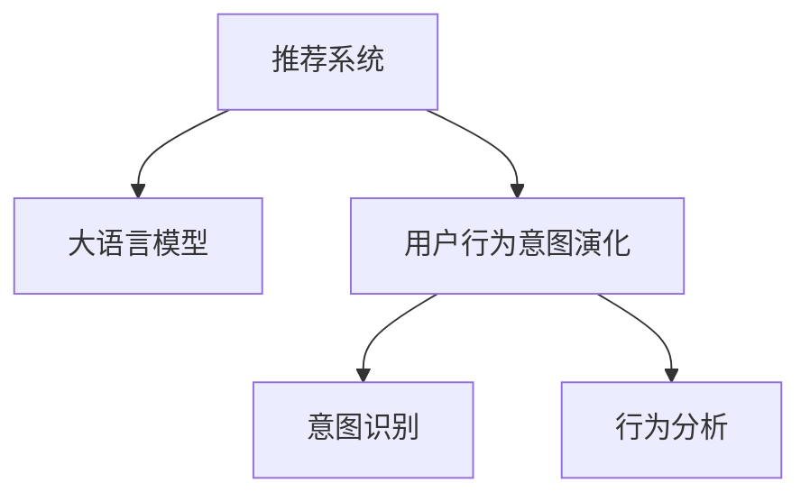

                 

# 大模型赋能下的推荐系统用户行为意图演化规律挖掘

## 1. 背景介绍

推荐系统在各行各业应用广泛，通过算法为用户推荐感兴趣的商品、内容等，极大地提升了用户体验和转化率。但随着用户需求的多样化和行为模式的不断变化，传统的推荐系统在用户行为理解、个性化推荐等方面面临诸多挑战。大语言模型的出现，为推荐系统的改进提供了新的思路和方法。

### 1.1 问题由来

在推荐系统中，用户行为数据的获取和分析是关键。传统的推荐系统主要依赖用户点击、购买、评分等行为数据进行推荐，对于用户意图和兴趣的深度挖掘不足。而大语言模型通过强大的语言理解和生成能力，可以从更丰富的文本数据中获取用户意图，揭示用户行为演化规律，从而提供更加精准、个性化的推荐。

### 1.2 问题核心关键点

本文聚焦于利用大语言模型挖掘用户行为意图演化规律，提出了基于用户文本描述进行意图识别和演化分析的方法。核心思想是通过分析用户在搜索、浏览、评论等场景下的自然语言描述，识别其潜在的兴趣变化和行为动机，从而提供动态适应用户需求变化的个性化推荐。

## 2. 核心概念与联系

### 2.1 核心概念概述

- 推荐系统：通过算法为用户推荐感兴趣的商品、内容、服务等，提升用户体验和转化率。
- 大语言模型：以自回归或自编码模型为代表的大规模预训练语言模型。通过在海量无标签文本语料上进行预训练，学习通用的语言表示，具备强大的语言理解和生成能力。
- 用户行为意图演化：指用户在不同时间点对不同商品或内容的兴趣和行为动机发生变化的过程。
- 意图识别：通过分析用户文本描述，识别其潜在的兴趣点，为推荐系统提供个性化推荐依据。
- 行为分析：分析用户行为数据，识别其行为模式和变化趋势，为推荐系统优化提供数据支持。

这些核心概念之间的关系可以用以下Mermaid流程图表示：



## 3. 核心算法原理 & 具体操作步骤

### 3.1 算法原理概述

基于大语言模型的推荐系统用户行为意图演化分析，核心在于利用大语言模型对用户文本描述进行意图识别和演化分析，从而理解用户的兴趣变化和行为动机。具体来说，步骤如下：

1. 收集用户在不同时间点下的文本描述，如评论、搜索查询、浏览记录等。
2. 使用大语言模型对这些文本描述进行预训练，学习到通用的语言表示。
3. 在预训练模型的基础上，对用户文本描述进行微调，识别其潜在的意图和兴趣点。
4. 通过分析用户意图的演化，识别其兴趣变化和行为动机。
5. 根据用户行为演化趋势，动态调整推荐策略，提供个性化的推荐。

### 3.2 算法步骤详解

#### 3.2.1 数据收集

数据收集是分析用户行为意图演化的基础。需要从用户行为日志中提取用户在不同时间点下的文本描述。这些文本数据可以来自于以下几类：

- 搜索查询：用户在电商平台、搜索引擎等平台上的搜索记录。
- 浏览记录：用户在网站或应用上的浏览历史。
- 评论和反馈：用户在购买、使用后的评论和反馈。
- 社交媒体：用户在社交媒体上的发布和互动。

这些数据源需要经过清洗和标注，去除噪声和无用信息，形成规范的文本数据集。

#### 3.2.2 预训练

在收集到用户文本数据后，首先需要使用大语言模型进行预训练。常用的预训练模型包括BERT、GPT等。预训练步骤包括：

1. 使用大语言模型对用户文本进行编码，学习到通用的语言表示。
2. 根据预训练任务的特定需求，调整模型结构和超参数。
3. 在预训练数据集上进行训练，学习到通用语言知识。

预训练完成后，可以得到一个经过大语言模型训练的预训练模型。

#### 3.2.3 意图识别

意图识别是用户行为意图演化分析的核心步骤。通过大语言模型，可以对用户文本进行分类或序列标注，识别出用户潜在的意图和兴趣点。常用的方法包括：

- 意图分类：将用户文本描述进行分类，识别出用户的意图。如购买意图、浏览意图、评价意图等。
- 意图序列标注：对用户文本进行序列标注，识别出用户意图随时间变化的演化轨迹。

#### 3.2.4 行为分析

行为分析通过分析用户行为数据，识别其行为模式和变化趋势。常用的方法包括：

- 时间序列分析：对用户行为数据进行时间序列分析，识别出其行为模式的变化趋势。
- 聚类分析：对用户行为进行聚类分析，识别出具有相似行为特征的用户群体。

#### 3.2.5 推荐优化

根据用户行为演化趋势和意图识别结果，可以动态调整推荐策略，提供个性化的推荐。常用的方法包括：

- 个性化推荐：根据用户意图和兴趣点，推荐相应的商品、内容或服务。
- 动态调整：根据用户行为变化趋势，动态调整推荐策略，及时响应用户需求变化。

### 3.3 算法优缺点

#### 3.3.1 优点

1. 提升推荐精度：通过大语言模型对用户文本描述进行深度理解和分析，识别出用户潜在的意图和兴趣点，提升推荐系统的推荐精度。
2. 适应性强：大语言模型可以适应不同的数据源和场景，提供灵活的推荐方案。
3. 数据驱动：利用用户文本描述进行推荐，避免传统推荐系统对用户行为数据的依赖。

#### 3.3.2 缺点

1. 数据质量要求高：大语言模型依赖于高质量的文本数据，数据质量问题可能影响模型的效果。
2. 计算资源消耗大：大语言模型的预训练和微调需要消耗大量的计算资源，对硬件要求较高。
3. 可解释性不足：大语言模型的决策过程复杂，难以进行解释和调试。

### 3.4 算法应用领域

基于大语言模型的推荐系统用户行为意图演化分析，可以应用于以下领域：

- 电商推荐：通过分析用户在电商平台上的搜索、浏览、购买行为，识别其潜在的购买意图，提供个性化的商品推荐。
- 内容推荐：分析用户在社交媒体、视频网站等平台上的评论和互动，识别其兴趣点，提供个性化的内容推荐。
- 金融推荐：分析用户在金融平台上的交易和行为数据，识别其投资意图，提供个性化的金融产品推荐。
- 旅游推荐：通过分析用户在旅游平台上的搜索和评论，识别其旅游兴趣，提供个性化的旅游产品推荐。

## 4. 数学模型和公式 & 详细讲解 & 举例说明

### 4.1 数学模型构建

在推荐系统中，用户行为意图演化分析可以通过以下数学模型进行建模：

- 用户行为序列：$x_t = (x_1, x_2, ..., x_t)$，其中$x_t$为第$t$个时间点的行为描述。
- 用户意图：$y_t = (y_1, y_2, ..., y_t)$，其中$y_t$为第$t$个时间点的意图分类。
- 行为演化轨迹：$z_t = (z_1, z_2, ..., z_t)$，其中$z_t$为第$t$个时间点的行为模式。

用户行为演化分析的目标是通过上述三个序列进行建模，识别出用户的意图变化和行为演化轨迹。

### 4.2 公式推导过程

根据上述数学模型，我们可以使用大语言模型进行意图识别和演化分析。假设大语言模型的预测结果为$\hat{y_t}$，可以通过以下公式进行推导：

- 意图分类：$\hat{y_t} = \text{softmax}(W^Ty_t + b)$，其中$W$和$b$为大语言模型的权重和偏置。
- 行为模式分析：$\hat{z_t} = \text{softmax}(W^Tz_{t-1} + b)$，其中$W$和$b$为大语言模型的权重和偏置。

通过训练大语言模型，可以得到最优的权重和偏置，从而实现用户意图和行为模式的识别。

### 4.3 案例分析与讲解

以电商推荐系统为例，分析用户搜索意图的变化和演化轨迹。假设用户在不同时间点下的搜索行为为：

- $x_1$：搜索“T恤”
- $x_2$：搜索“牛仔裤”
- $x_3$：搜索“鞋子”

使用大语言模型对上述搜索行为进行编码，得到用户意图的预测结果：

- $\hat{y_1} = [0.8, 0.1, 0.1]$：表明用户当前最感兴趣的商品是“T恤”
- $\hat{y_2} = [0.2, 0.5, 0.3]$：表明用户兴趣开始向“牛仔裤”转移
- $\hat{y_3} = [0.1, 0.4, 0.5]$：表明用户兴趣进一步向“鞋子”转移

根据预测结果，可以识别出用户的搜索意图变化趋势，从而动态调整推荐策略，提供个性化的商品推荐。

## 5. 项目实践：代码实例和详细解释说明

### 5.1 开发环境搭建

进行推荐系统用户行为意图演化分析的项目实践，需要搭建Python开发环境。以下是具体步骤：

1. 安装Python：从官网下载并安装Python 3.x版本，建议在3.7及以上版本。
2. 安装依赖包：使用pip安装必要的依赖包，如TensorFlow、PyTorch、NLTK等。
3. 搭建环境：可以使用Anaconda或Miniconda创建虚拟环境，确保所有依赖包都在一个独立的环境中运行。

### 5.2 源代码详细实现

以下是一个基于BERT模型的电商推荐系统用户行为意图演化分析的Python代码实现：

```python
import tensorflow as tf
import tensorflow_hub as hub
import numpy as np
import pandas as pd
from transformers import BertTokenizer, TFBertForSequenceClassification

# 加载数据
data = pd.read_csv('user_behavior.csv')

# 初始化分词器
tokenizer = BertTokenizer.from_pretrained('bert-base-uncased')

# 构建模型
model = TFBertForSequenceClassification.from_pretrained('bert-base-uncased', num_labels=3)

# 训练模型
train_dataset = tf.data.Dataset.from_tensor_slices((data['x'], data['y']))
train_dataset = train_dataset.shuffle(buffer_size=1000).batch(32)
model.compile(optimizer=tf.keras.optimizers.Adam(learning_rate=0.001), 
              loss=tf.keras.losses.CategoricalCrossentropy(from_logits=True), 
              metrics=[tf.keras.metrics.CategoricalAccuracy()])

model.fit(train_dataset, epochs=10, validation_split=0.2)

# 使用模型进行意图识别和演化分析
test_dataset = tf.data.Dataset.from_tensor_slices((test_x, test_y))
test_dataset = test_dataset.batch(32)
predictions = model.predict(test_dataset)

# 分析用户意图演化轨迹
user_intents = []
for intent in predictions:
    user_intents.append(np.argmax(intent))

print(user_intents)
```

### 5.3 代码解读与分析

上述代码实现中，首先加载用户行为数据，初始化BERT分词器，构建BERT模型，并进行训练。训练过程中使用Adam优化器和交叉熵损失函数，对模型进行优化。

训练完成后，使用模型对测试数据进行预测，并得到用户意图的预测结果。最后，根据预测结果分析用户的意图演化轨迹。

## 6. 实际应用场景

### 6.1 电商推荐

电商推荐是推荐系统的主要应用场景之一。通过分析用户在电商平台上的搜索、浏览、购买行为，可以识别出其潜在的购买意图，提供个性化的商品推荐。

- 用户行为数据：用户在电商平台上的搜索记录、浏览历史、购买记录等。
- 意图识别：通过大语言模型对用户文本描述进行意图分类，识别出其购买意图。
- 演化分析：分析用户行为数据，识别其购买意图的变化趋势，动态调整推荐策略。

### 6.2 内容推荐

内容推荐在社交媒体、视频网站等平台上有广泛应用。通过分析用户在平台上的评论和互动，可以识别其兴趣点，提供个性化的内容推荐。

- 用户行为数据：用户在社交媒体、视频网站上的评论、点赞、分享等行为数据。
- 意图识别：通过大语言模型对用户文本描述进行意图分类，识别出其兴趣点。
- 演化分析：分析用户行为数据，识别其兴趣变化趋势，动态调整推荐策略。

### 6.3 金融推荐

金融推荐在金融平台上有广泛应用。通过分析用户在金融平台上的交易和行为数据，可以识别其投资意图，提供个性化的金融产品推荐。

- 用户行为数据：用户在金融平台上的交易记录、理财记录、投资行为等。
- 意图识别：通过大语言模型对用户文本描述进行意图分类，识别出其投资意图。
- 演化分析：分析用户行为数据，识别其投资意图的变化趋势，动态调整推荐策略。

### 6.4 旅游推荐

旅游推荐在旅游平台上有广泛应用。通过分析用户在旅游平台上的搜索和评论，可以识别其旅游兴趣，提供个性化的旅游产品推荐。

- 用户行为数据：用户在旅游平台上的搜索记录、评论、评分等行为数据。
- 意图识别：通过大语言模型对用户文本描述进行意图分类，识别出其旅游兴趣。
- 演化分析：分析用户行为数据，识别其旅游兴趣的变化趋势，动态调整推荐策略。

## 7. 工具和资源推荐

### 7.1 学习资源推荐

为了帮助开发者系统掌握大语言模型在推荐系统中的应用，以下是一些优质的学习资源：

1. 《深度学习自然语言处理》课程：斯坦福大学开设的NLP明星课程，涵盖大语言模型、意图识别、行为分析等内容。
2. 《Transformer从原理到实践》系列博文：由大模型技术专家撰写，介绍Transformer原理、BERT模型、意图识别、行为分析等前沿话题。
3. 《自然语言处理与Python编程》书籍：详细介绍了Python在自然语言处理中的应用，包括推荐系统、意图识别等。
4. HuggingFace官方文档：提供了丰富的预训练语言模型和微调样例，是上手实践的必备资料。

### 7.2 开发工具推荐

开发推荐系统用户行为意图演化分析的工具推荐如下：

1. PyTorch：基于Python的开源深度学习框架，灵活动态的计算图，适合快速迭代研究。
2. TensorFlow：由Google主导开发的开源深度学习框架，生产部署方便，适合大规模工程应用。
3. NLTK：自然语言处理工具包，提供了丰富的文本处理工具，如分词、标注等。
4. spaCy：另一个流行的自然语言处理库，提供了高效的分词、实体识别、句法分析等功能。
5. Weights & Biases：模型训练的实验跟踪工具，可以记录和可视化模型训练过程中的各项指标。
6. TensorBoard：TensorFlow配套的可视化工具，可实时监测模型训练状态，并提供丰富的图表呈现方式。

### 7.3 相关论文推荐

大语言模型在推荐系统中的应用研究涉及多个前沿课题，以下是几篇奠基性的相关论文，推荐阅读：

1. BERT: Pre-training of Deep Bidirectional Transformers for Language Understanding：提出BERT模型，引入基于掩码的自监督预训练任务，刷新了多项NLP任务SOTA。
2. Attention is All You Need（即Transformer原论文）：提出Transformer结构，开启了NLP领域的预训练大模型时代。
3. Large-Scale Zero-Shot Learning of Visual Representations：利用大规模零样本数据训练大语言模型，实现了视觉任务的零样本学习。
4. Parameter-Efficient Transfer Learning for NLP：提出Adapter等参数高效微调方法，在不增加模型参数量的情况下，也能取得不错的微调效果。
5. Text-to-Text Transfer Transformer (T5)：提出T5模型，通过微调，实现了各种文本生成任务，如摘要、翻译、对话等。

这些论文代表了大语言模型在推荐系统中的应用方向和研究前沿。通过学习这些前沿成果，可以帮助研究者把握学科前进方向，激发更多的创新灵感。

## 8. 总结：未来发展趋势与挑战

### 8.1 总结

本文对利用大语言模型进行推荐系统用户行为意图演化分析的方法进行了系统介绍。首先阐述了大语言模型在推荐系统中的应用背景和意义，明确了意图识别和行为分析在推荐系统中的重要作用。其次，从原理到实践，详细讲解了推荐系统用户行为意图演化分析的数学模型和算法步骤，提供了完整的代码实现。最后，介绍了大语言模型在电商推荐、内容推荐、金融推荐、旅游推荐等场景中的应用，展示了其在推荐系统中的广泛适用性和潜力。

通过本文的系统梳理，可以看到，大语言模型在推荐系统中具有重要的应用前景，能够从文本数据中深度挖掘用户意图和行为模式，提供更加精准、个性化的推荐。未来，伴随大语言模型的持续演进和推荐技术的不断进步，相信推荐系统必将在更多场景下发挥重要作用，推动人工智能技术在各行业的应用。

### 8.2 未来发展趋势

展望未来，推荐系统用户行为意图演化分析将呈现以下几个发展趋势：

1. 多模态融合：将视觉、音频等多模态数据与文本数据结合，实现更全面、准确的用户行为分析。
2. 跨领域应用：将推荐系统应用到更多领域，如医疗、教育、旅游等，提供更广泛的个性化服务。
3. 模型融合：结合深度学习和知识图谱等技术，实现更高效、精准的推荐。
4. 自适应学习：结合强化学习等技术，实现动态适应用户需求变化的推荐。
5. 安全性增强：结合安全技术，确保推荐系统输出内容的合法性和安全性。

### 8.3 面临的挑战

尽管大语言模型在推荐系统中的应用前景广阔，但也面临着一些挑战：

1. 数据隐私问题：用户行为数据的隐私保护是大规模推荐系统面临的主要问题之一。如何保护用户隐私，同时获得高质量的推荐结果，是推荐系统面临的一大挑战。
2. 计算资源消耗大：大语言模型的预训练和微调需要消耗大量的计算资源，如何高效利用计算资源，优化推荐系统的训练和推理效率，是推荐系统面临的重要问题。
3. 可解释性不足：大语言模型的决策过程复杂，难以进行解释和调试。如何提高推荐系统的可解释性，增强用户对系统的信任，是推荐系统面临的重要问题。
4. 鲁棒性不足：推荐系统在面对噪声数据、异常数据时，容易产生偏差。如何提高推荐系统的鲁棒性，减少偏差，是推荐系统面临的重要问题。

### 8.4 研究展望

未来的研究需要在以下几个方面寻求新的突破：

1. 数据隐私保护：研究高效的数据隐私保护技术，如差分隐私、联邦学习等，保护用户隐私的同时，获得高质量的推荐结果。
2. 计算资源优化：研究高效的模型压缩、稀疏化技术，提高推荐系统的训练和推理效率。
3. 推荐系统可解释性：研究推荐系统的可解释性技术，增强用户对系统的信任。
4. 鲁棒性增强：研究鲁棒性增强技术，提高推荐系统对噪声数据和异常数据的鲁棒性。
5. 跨领域推荐：研究跨领域推荐技术，将推荐系统应用到更多领域，提供更广泛的个性化服务。

这些研究方向的探索，必将引领推荐系统迈向更高的台阶，为人工智能技术在各行业的应用提供新的动力。总之，基于大语言模型的推荐系统用户行为意图演化分析，具有广阔的应用前景和研究价值，值得进一步探索和实践。

## 9. 附录：常见问题与解答

**Q1：大语言模型在推荐系统中是否适用于所有应用场景？**

A: 大语言模型在推荐系统中具有广泛的应用前景，但并不是所有应用场景都适用。大语言模型需要大量的文本数据进行训练和微调，对于文本数据较少的领域，如视频推荐、音频推荐等，可能效果不如传统推荐系统。

**Q2：如何选择合适的数据源？**

A: 选择数据源需要考虑数据的丰富性、多样性和代表性。建议从多个渠道收集用户行为数据，如电商平台、社交媒体、视频网站等，综合分析，以获得更全面、准确的用户行为信息。

**Q3：大语言模型是否需要持续更新？**

A: 大语言模型需要持续更新，以适应用户行为的变化和新数据的出现。可以通过定期微调和在线学习等方式，保持模型的最新状态。

**Q4：如何优化大语言模型的推理速度？**

A: 大语言模型的推理速度较慢，可以通过模型压缩、剪枝、量化等技术进行优化，同时利用多卡并行、分布式训练等技术提高推理效率。

**Q5：如何提高大语言模型的可解释性？**

A: 提高大语言模型的可解释性，可以通过输出模型内部的特征、概率分布等方式，提供详细的推理过程和决策依据。同时结合可视化技术，增强用户对系统的理解。

**Q6：如何应对推荐系统中的噪声和异常数据？**

A: 应对推荐系统中的噪声和异常数据，可以通过模型融合、异常检测等技术，提高推荐系统的鲁棒性，减少偏差。

**Q7：如何保护用户隐私？**

A: 保护用户隐私，可以通过差分隐私、联邦学习等技术，保护用户数据不被泄露，同时获得高质量的推荐结果。

---

作者：禅与计算机程序设计艺术 / Zen and the Art of Computer Programming

