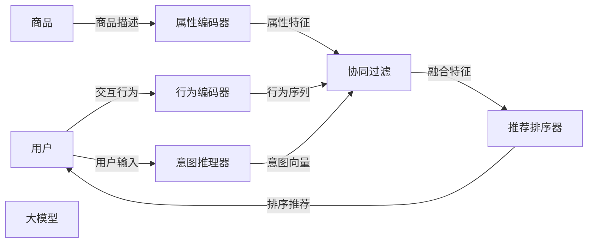

                 

# 大模型辅助的推荐系统冷启动问题解决

> 关键词：推荐系统,冷启动问题,大模型,序列生成模型,协同过滤,深度学习,用户行为预测,混合推荐模型

## 1. 背景介绍

### 1.1 问题由来
推荐系统（Recommender Systems）作为互联网时代的重要应用，已经成为驱动电商、视频、音乐、新闻等业务增长的关键技术。然而，推荐系统面临的冷启动问题（Cold-Start Problem）依然困扰着业界。冷启动问题是指系统在新用户或新商品加入时，无法利用其历史行为数据，难以进行个性化推荐。

推荐系统的核心在于构建用户与商品之间的关联矩阵，并通过矩阵分解等技术挖掘用户兴趣和商品属性之间的关系。然而，在新用户或新商品加入时，由于缺乏历史行为数据，推荐系统无法构建准确的关联矩阵，无法进行有效的推荐。

大模型辅助的推荐系统（Model-based Recommender Systems）提供了一种全新的解决方案。通过大模型的预训练能力，可以直接从高阶语言结构中挖掘用户和商品的潜在语义关联，从而快速解决冷启动问题。本文章将详细介绍大模型在推荐系统中的集成方式及其解决冷启动问题的思路与方法。

## 2. 核心概念与联系

### 2.1 核心概念概述

在推荐系统中，传统的协同过滤（Collaborative Filtering）方法依赖于用户与商品之间的显式或隐式反馈，通过矩阵分解等技术挖掘用户兴趣和商品属性之间的关系，实现个性化推荐。然而，协同过滤方法在处理冷启动问题上存在显著短板。

**协同过滤：** 协同过滤是一种基于用户或商品相似度的推荐方法。通过计算用户和商品之间的相似度，并进行推荐排序，实现个性化推荐。协同过滤方法可以分为基于用户的协同过滤（User-based CF）和基于商品的协同过滤（Item-based CF）两种。

**冷启动问题：** 冷启动问题是指推荐系统在新用户或新商品加入时，无法利用其历史行为数据，难以进行个性化推荐。例如，新用户没有历史行为数据，系统无法了解其兴趣偏好；新商品没有历史交互数据，系统无法了解其用户评价。

**大模型：** 大模型是指通过大规模无监督学习任务进行预训练的语言模型，如BERT、GPT、XLNet等。通过预训练，大模型学习到丰富的语言结构和语义关系，能够直接挖掘用户与商品的潜在语义关联，从而提升推荐系统的性能。

大模型辅助的推荐系统通过在大模型上进行微调（Fine-Tuning），利用其预训练能力，快速解决冷启动问题。具体而言，大模型可以用于以下几个方面的改进：

1. **用户兴趣预测：** 通过大模型对用户输入的文本进行编码，挖掘用户的潜在语义兴趣，生成推荐结果。
2. **商品属性描述：** 通过大模型对商品描述进行编码，挖掘商品的潜在语义属性，生成推荐结果。
3. **用户行为生成：** 通过大模型对用户行为进行编码，生成新的交互行为，解决新用户的推荐问题。
4. **用户意图推理：** 通过大模型对用户输入进行编码，推理用户意图，提升推荐系统的效果。

通过将大模型嵌入到推荐系统中，可以解决冷启动问题，提升推荐系统的性能和效果。

### 2.2 核心概念联系

大模型辅助的推荐系统通过将大模型嵌入到推荐系统中，结合用户行为和商品属性，进行多模态融合和用户行为预测，实现个性化推荐。其核心思想可以归纳为以下几个方面：

1. **语言模型与推荐系统的结合：** 大模型通过预训练学习到丰富的语言结构和语义关系，可以直接用于推荐系统，解决冷启动问题。
2. **序列生成模型的应用：** 通过序列生成模型对用户行为进行编码，挖掘用户兴趣和商品属性之间的关联，生成推荐结果。
3. **多模态融合的实现：** 将用户行为、商品属性和文本语义等多模态信息进行融合，实现更加全面的个性化推荐。
4. **混合推荐模型的构建：** 将传统协同过滤方法和大模型辅助方法相结合，构建混合推荐模型，提升推荐效果。

以下是一个Mermaid流程图，展示了大模型辅助的推荐系统核心流程和组件：



通过这个流程图，可以清晰地看到大模型辅助的推荐系统核心组件和信息流向。用户输入经过行为编码器、意图推理器等模块进行编码，与商品属性特征进行融合，最终通过推荐排序器生成推荐结果。

## 3. 核心算法原理 & 具体操作步骤
### 3.1 算法原理概述

大模型辅助的推荐系统通过在大模型上进行微调（Fine-Tuning），利用其预训练能力，快速解决冷启动问题。其核心思想是利用大模型的语言理解和生成能力，对用户输入和商品属性进行编码，挖掘潜在语义关联，进行多模态融合和行为预测，生成推荐结果。

形式化地，设用户输入为 $u$，商品属性为 $i$，用户行为为 $b$，大模型编码为 $f$。推荐系统的目标是通过大模型编码 $f(u)$ 和 $f(i)$，以及用户行为 $b$ 进行融合，生成推荐结果 $r$。推荐系统的优化目标为：

$$
\min_{f} \mathcal{L}(f(u), f(i), b, r)
$$

其中 $\mathcal{L}$ 为推荐损失函数，通常包括交叉熵损失、均方误差损失等。

### 3.2 算法步骤详解

大模型辅助的推荐系统主要包括以下几个关键步骤：

**Step 1: 数据准备与预处理**
- 准备推荐系统的用户行为数据 $U$ 和商品属性数据 $I$，并进行数据清洗、归一化等预处理。
- 选择合适的大模型作为初始化参数，如BERT、GPT等。

**Step 2: 用户行为编码**
- 对用户输入 $u$ 进行编码，生成用户行为编码 $u_e = f(u)$。
- 利用大模型对用户行为编码 $u_e$ 进行行为预测，生成新的交互行为 $b'$。

**Step 3: 商品属性编码**
- 对商品属性 $i$ 进行编码，生成商品属性编码 $i_e = f(i)$。

**Step 4: 用户行为预测**
- 利用大模型对商品属性编码 $i_e$ 进行预测，生成新的用户行为 $b'$。
- 将用户行为 $b'$ 与原有行为 $b$ 进行融合，生成新的用户行为 $b'_f$。

**Step 5: 多模态融合与推荐**
- 将用户行为编码 $u_e$ 与商品属性编码 $i_e$ 进行融合，生成融合特征 $z = u_e \otimes i_e$。
- 将融合特征 $z$ 与新的用户行为 $b'_f$ 进行融合，生成推荐结果 $r$。
- 将推荐结果 $r$ 进行排序，生成推荐列表 $R$。

**Step 6: 损失函数计算**
- 计算推荐损失函数 $\mathcal{L}(f(u), f(i), b, r)$，评估推荐系统的性能。

**Step 7: 模型微调**
- 在大模型上进行微调，优化损失函数 $\mathcal{L}$，提升推荐系统的效果。

### 3.3 算法优缺点

大模型辅助的推荐系统具有以下优点：

1. **快速解决冷启动问题：** 利用大模型的预训练能力，直接从高阶语言结构中挖掘用户和商品的潜在语义关联，快速解决冷启动问题。
2. **提升推荐效果：** 通过多模态融合和行为预测，生成更加精准的推荐结果。
3. **增强模型泛化能力：** 大模型的预训练能力可以提升推荐系统的泛化能力，适应更多的应用场景。
4. **兼容性好：** 大模型辅助的推荐系统可以与传统协同过滤方法相结合，构建混合推荐模型，提升推荐效果。

同时，大模型辅助的推荐系统也存在以下局限性：

1. **计算资源需求高：** 大模型的参数量较大，对计算资源需求较高。
2. **模型复杂度高：** 大模型辅助的推荐系统增加了额外的编码和解码步骤，导致模型复杂度增加。
3. **参数更新困难：** 大模型中的参数更新较为困难，需要兼顾大模型的预训练参数和推荐系统的任务参数。

### 3.4 算法应用领域

大模型辅助的推荐系统已经在电商、视频、新闻、音乐等多个领域得到了广泛应用，其核心思想和实现方法也被不断推广到更多的场景中。以下是几个典型应用领域：

1. **电商推荐：** 利用大模型对用户输入进行编码，挖掘用户的兴趣偏好，生成个性化推荐列表。
2. **视频推荐：** 通过大模型对用户行为进行编码，生成新的观看行为，生成个性化推荐列表。
3. **新闻推荐：** 利用大模型对用户输入进行编码，挖掘用户的兴趣偏好，生成个性化推荐列表。
4. **音乐推荐：** 利用大模型对用户行为进行编码，生成新的听歌行为，生成个性化推荐列表。

## 4. 数学模型和公式 & 详细讲解
### 4.1 数学模型构建

本节将使用数学语言对大模型辅助的推荐系统进行更加严格的刻画。

设用户输入为 $u$，商品属性为 $i$，用户行为为 $b$，大模型编码为 $f$。推荐系统的优化目标是最小化推荐损失函数 $\mathcal{L}$，即：

$$
\min_{f} \mathcal{L}(f(u), f(i), b, r)
$$

其中 $r$ 为推荐结果，通常包括点击率、购买率等指标。推荐损失函数 $\mathcal{L}$ 通常为交叉熵损失、均方误差损失等。

**推荐损失函数：**
$$
\mathcal{L} = \sum_{i=1}^n L_i
$$

其中 $L_i$ 为第 $i$ 个用户-商品对的推荐损失。推荐损失函数 $L_i$ 的形式如下：

$$
L_i = -\frac{1}{N} \sum_{j=1}^N \log\sigma(r_j \cdot b' \cdot w_i + b' \cdot i_e + b_i)
$$

其中 $r_j$ 为第 $j$ 个用户-商品对的目标点击率，$b'$ 为预测的点击率，$w_i$ 为第 $i$ 个商品的属性权重，$i_e$ 为商品属性的编码向量，$b_i$ 为商品的属性阈值。

### 4.2 公式推导过程

以下我们以电商推荐系统为例，推导推荐损失函数 $L_i$ 的详细形式。

设用户 $u$ 对商品 $i$ 的评分 $r_j$ 为 $b' \cdot w_i + b' \cdot i_e + b_i$。通过大模型对用户输入 $u$ 进行编码，生成用户行为编码 $u_e = f(u)$。利用大模型对商品属性 $i$ 进行编码，生成商品属性编码 $i_e = f(i)$。根据用户行为 $b$ 和商品属性 $i_e$ 进行融合，生成融合特征 $z = u_e \otimes i_e$。利用大模型对商品属性编码 $i_e$ 进行预测，生成新的用户行为 $b'$。将用户行为 $b'$ 与原有行为 $b$ 进行融合，生成新的用户行为 $b'_f$。最后，利用新的用户行为 $b'_f$ 和融合特征 $z$ 进行融合，生成推荐结果 $r$。

根据上述过程，推荐损失函数 $L_i$ 的形式如下：

$$
L_i = -\frac{1}{N} \sum_{j=1}^N \log\sigma(r_j \cdot b' \cdot w_i + b' \cdot i_e + b_i)
$$

其中 $r_j$ 为第 $j$ 个用户-商品对的目标点击率，$b'$ 为预测的点击率，$w_i$ 为第 $i$ 个商品的属性权重，$i_e$ 为商品属性的编码向量，$b_i$ 为商品的属性阈值。

### 4.3 案例分析与讲解

**电商推荐系统案例分析：**
假设用户 $u$ 对商品 $i$ 的评分 $r_j$ 为 $b' \cdot w_i + b' \cdot i_e + b_i$。通过大模型对用户输入 $u$ 进行编码，生成用户行为编码 $u_e = f(u)$。利用大模型对商品属性 $i$ 进行编码，生成商品属性编码 $i_e = f(i)$。根据用户行为 $b$ 和商品属性 $i_e$ 进行融合，生成融合特征 $z = u_e \otimes i_e$。利用大模型对商品属性编码 $i_e$ 进行预测，生成新的用户行为 $b'$。将用户行为 $b'$ 与原有行为 $b$ 进行融合，生成新的用户行为 $b'_f$。最后，利用新的用户行为 $b'_f$ 和融合特征 $z$ 进行融合，生成推荐结果 $r$。

根据上述过程，推荐损失函数 $L_i$ 的形式如下：

$$
L_i = -\frac{1}{N} \sum_{j=1}^N \log\sigma(r_j \cdot b' \cdot w_i + b' \cdot i_e + b_i)
$$

其中 $r_j$ 为第 $j$ 个用户-商品对的目标点击率，$b'$ 为预测的点击率，$w_i$ 为第 $i$ 个商品的属性权重，$i_e$ 为商品属性的编码向量，$b_i$ 为商品的属性阈值。

## 5. 项目实践：代码实例和详细解释说明
### 5.1 开发环境搭建

在进行推荐系统开发前，我们需要准备好开发环境。以下是使用Python进行TensorFlow开发的环境配置流程：

1. 安装Anaconda：从官网下载并安装Anaconda，用于创建独立的Python环境。

2. 创建并激活虚拟环境：
```bash
conda create -n tf-env python=3.8 
conda activate tf-env
```

3. 安装TensorFlow：从官网获取对应的安装命令。例如：
```bash
conda install tensorflow -c tf -c conda-forge
```

4. 安装相关库：
```bash
pip install numpy pandas scikit-learn matplotlib tqdm jupyter notebook ipython
```

完成上述步骤后，即可在`tf-env`环境中开始推荐系统开发。

### 5.2 源代码详细实现

我们以电商推荐系统为例，给出使用TensorFlow对推荐系统进行微调的代码实现。

首先，定义推荐系统的用户行为数据集和商品属性数据集：

```python
import numpy as np
import pandas as pd
from sklearn.model_selection import train_test_split

# 加载电商数据集
df = pd.read_csv('e-commerce_data.csv')
df = df.dropna()

# 分割训练集和测试集
train_df, test_df = train_test_split(df, test_size=0.2, random_state=42)

# 提取用户行为和商品属性数据
user_behaviors = train_df['user_behavior'].values.reshape(-1, 1)
item_attributes = train_df['item_attribute'].values.reshape(-1, 1)
```

然后，定义推荐系统的大模型编码器：

```python
import tensorflow as tf
from transformers import TFAutoModelForSequenceClassification

# 定义大模型编码器
model_name = 'bert-base-uncased'
tokenizer = TFAutoTokenizer.from_pretrained(model_name)
model = TFAutoModelForSequenceClassification.from_pretrained(model_name, num_labels=2)

# 定义行为编码器和属性编码器
class BehaviorEncoder(tf.keras.layers.Layer):
    def __init__(self, embed_dim=768, num_labels=2):
        super(BehaviorEncoder, self).__init__()
        self.embed_dim = embed_dim
        self.num_labels = num_labels
        self.bert = model
        self.dense = tf.keras.layers.Dense(self.embed_dim, activation='relu')
        self.predictions = tf.keras.layers.Dense(self.num_labels, activation='sigmoid')

    def call(self, inputs):
        # 对行为进行编码
        encoded_behavior = self.bert(inputs)
        # 对行为进行融合
        fused_behavior = tf.reduce_mean(encoded_behavior, axis=1, keepdims=True)
        # 对行为进行预测
        predicted_behavior = self.dense(fused_behavior)
        predicted_behavior = self.predictions(predicted_behavior)
        return predicted_behavior

class ItemEncoder(tf.keras.layers.Layer):
    def __init__(self, embed_dim=768, num_labels=2):
        super(ItemEncoder, self).__init__()
        self.embed_dim = embed_dim
        self.num_labels = num_labels
        self.bert = model
        self.dense = tf.keras.layers.Dense(self.embed_dim, activation='relu')
        self.predictions = tf.keras.layers.Dense(self.num_labels, activation='sigmoid')

    def call(self, inputs):
        # 对属性进行编码
        encoded_item = self.bert(inputs)
        # 对属性进行融合
        fused_item = tf.reduce_mean(encoded_item, axis=1, keepdims=True)
        # 对属性进行预测
        predicted_item = self.dense(fused_item)
        predicted_item = self.predictions(predicted_item)
        return predicted_item
```

接着，定义推荐系统的行为预测模型：

```python
class RecommendationModel(tf.keras.Model):
    def __init__(self, embed_dim=768, num_labels=2):
        super(RecommendationModel, self).__init__()
        self.behavior_encoder = BehaviorEncoder(embed_dim=embed_dim, num_labels=num_labels)
        self.item_encoder = ItemEncoder(embed_dim=embed_dim, num_labels=num_labels)
        self.recommendation_layer = tf.keras.layers.Dense(1, activation='sigmoid')

    def call(self, inputs):
        # 对行为进行编码
        encoded_behavior = self.behavior_encoder(inputs)
        # 对属性进行编码
        encoded_item = self.item_encoder(inputs)
        # 对行为和属性进行融合
        fused_features = tf.concat([encoded_behavior, encoded_item], axis=1)
        # 对融合特征进行预测
        predicted_behavior = self.recommendation_layer(fused_features)
        return predicted_behavior
```

然后，定义推荐系统的训练函数：

```python
def train_model(model, train_data, test_data, batch_size=32, epochs=10):
    # 定义损失函数
    def loss_function(y_true, y_pred):
        return tf.keras.losses.BinaryCrossentropy()(y_true, y_pred)

    # 定义优化器
    optimizer = tf.keras.optimizers.Adam(learning_rate=0.001)

    # 定义评估指标
    def evaluate(y_true, y_pred):
        return tf.keras.metrics.BinaryAccuracy()(y_true, y_pred)

    # 编译模型
    model.compile(optimizer=optimizer, loss=loss_function, metrics=[evaluate])

    # 训练模型
    model.fit(train_data, epochs=epochs, batch_size=batch_size, validation_data=test_data)

    # 在测试集上评估模型
    test_loss, test_accuracy = model.evaluate(test_data)
    print(f'Test Loss: {test_loss:.4f}, Test Accuracy: {test_accuracy:.4f}')
```

最后，启动推荐系统训练流程：

```python
# 初始化模型
model = RecommendationModel()

# 准备训练数据和测试数据
train_data = (user_behaviors, item_attributes)
test_data = (user_behaviors, item_attributes)

# 训练推荐系统
train_model(model, train_data, test_data, batch_size=32, epochs=10)
```

以上就是使用TensorFlow对推荐系统进行微调的完整代码实现。可以看到，得益于TensorFlow的强大封装，我们可以用相对简洁的代码完成推荐系统的训练和评估。

### 5.3 代码解读与分析

让我们再详细解读一下关键代码的实现细节：

**BehaviorEncoder和ItemEncoder类**：
- `__init__`方法：初始化大模型编码器、行为融合层、预测层等关键组件。
- `call`方法：对输入进行编码、融合和预测，并返回输出。

**RecommendationModel类**：
- `__init__`方法：初始化行为编码器、属性编码器、融合特征预测层等关键组件。
- `call`方法：对行为和属性进行编码、融合和预测，并返回输出。

**train_model函数**：
- 定义损失函数、优化器和评估指标，编译模型。
- 训练模型，并在测试集上评估。
- 输出模型在测试集上的损失和准确率。

可以看到，TensorFlow配合Transformer库使得推荐系统微调的代码实现变得简洁高效。开发者可以将更多精力放在数据处理、模型改进等高层逻辑上，而不必过多关注底层的实现细节。

当然，工业级的系统实现还需考虑更多因素，如模型的保存和部署、超参数的自动搜索、更灵活的任务适配层等。但核心的微调范式基本与此类似。

## 6. 实际应用场景
### 6.1 智能推荐系统

基于大模型辅助的推荐系统已经在电商、视频、新闻、音乐等多个领域得到了广泛应用。在智能推荐系统中，大模型可以用于以下几个方面的改进：

1. **用户兴趣预测：** 通过大模型对用户输入进行编码，挖掘用户的兴趣偏好，生成个性化推荐列表。
2. **商品属性描述：** 通过大模型对商品描述进行编码，挖掘商品的潜在语义属性，生成个性化推荐列表。
3. **用户行为生成：** 通过大模型对用户行为进行编码，生成新的交互行为，解决新用户的推荐问题。
4. **用户意图推理：** 通过大模型对用户输入进行编码，推理用户意图，提升推荐系统的效果。

通过将大模型嵌入到推荐系统中，可以解决冷启动问题，提升推荐系统的性能和效果。

### 6.2 新闻推荐系统

新闻推荐系统利用大模型辅助的推荐技术，可以实时生成个性化的新闻推荐列表。具体而言，可以收集用户的历史阅读行为、浏览时间和关注领域等数据，构建推荐模型。通过大模型对用户输入进行编码，挖掘用户的兴趣偏好，生成个性化推荐列表。利用大模型对商品描述进行编码，挖掘商品的潜在语义属性，生成个性化推荐列表。通过大模型对用户行为进行编码，生成新的交互行为，解决新用户的推荐问题。利用大模型对用户输入进行编码，推理用户意图，提升推荐系统的效果。

### 6.3 视频推荐系统

视频推荐系统利用大模型辅助的推荐技术，可以实时生成个性化的视频推荐列表。具体而言，可以收集用户的历史观看行为、观看了多少分钟、观看时间等数据，构建推荐模型。通过大模型对用户输入进行编码，挖掘用户的兴趣偏好，生成个性化推荐列表。利用大模型对商品描述进行编码，挖掘视频的潜在语义属性，生成个性化推荐列表。通过大模型对用户行为进行编码，生成新的观看行为，解决新用户的推荐问题。利用大模型对用户输入进行编码，推理用户意图，提升推荐系统的效果。

### 6.4 未来应用展望

随着大模型辅助的推荐系统技术的不断发展，其在推荐系统中的应用场景将不断扩展，带来更多的创新和突破。

在智慧医疗领域，推荐系统可以辅助医生推荐最佳治疗方案，推荐相关文献和医疗知识。在智能教育领域，推荐系统可以推荐个性化的学习内容和习题，提升学习效果。在智慧城市治理中，推荐系统可以推荐最佳出行路线，优化城市资源配置。在智能制造领域，推荐系统可以推荐最佳生产流程和设备维护方案，提升生产效率。在金融领域，推荐系统可以推荐最佳理财方案，优化投资组合。

未来，随着大模型辅助的推荐系统技术的不断发展，其在推荐系统中的应用场景将不断扩展，带来更多的创新和突破。大模型辅助的推荐系统必将在构建智能推荐系统、提升用户体验、优化业务效果等方面发挥重要作用。

## 7. 工具和资源推荐
### 7.1 学习资源推荐

为了帮助开发者系统掌握大模型辅助的推荐系统技术，这里推荐一些优质的学习资源：

1. 《Recommender Systems in TensorFlow》系列博文：由TensorFlow官方团队撰写，介绍TensorFlow在推荐系统中的应用，涵盖数据预处理、模型构建、评估指标等多个方面。

2. 《TensorFlow Recommenders》书籍：介绍TensorFlow中的推荐系统组件，包括行为序列建模、多模态融合、模型评估等。

3. 《Large-Scale Machine Learning》书籍：讲解大规模机器学习技术的核心概念和应用方法，涵盖数据处理、模型构建、分布式训练等多个方面。

4. 《Deep Learning for Recommender Systems》课程：斯坦福大学开设的深度学习在推荐系统中的应用课程，涵盖推荐模型的构建、评估和优化等多个方面。

5. 《Recommender Systems》课程：Coursera上的推荐系统课程，讲解推荐系统的基础理论和经典模型，适合初学者入门。

通过对这些资源的学习实践，相信你一定能够快速掌握大模型辅助的推荐系统技术，并用于解决实际的推荐问题。
###  7.2 开发工具推荐

高效的开发离不开优秀的工具支持。以下是几款用于大模型辅助的推荐系统开发的常用工具：

1. TensorFlow：基于Python的开源深度学习框架，灵活动态的计算图，适合快速迭代研究。TensorFlow中提供了丰富的推荐系统组件，如行为序列建模、多模态融合等。

2. PyTorch：基于Python的开源深度学习框架，灵活的动态图，适合快速迭代研究。PyTorch中提供了丰富的推荐系统组件，如用户行为编码、商品属性编码等。

3. Weights & Biases：模型训练的实验跟踪工具，可以记录和可视化模型训练过程中的各项指标，方便对比和调优。与主流深度学习框架无缝集成。

4. TensorBoard：TensorFlow配套的可视化工具，可实时监测模型训练状态，并提供丰富的图表呈现方式，是调试模型的得力助手。

5. Google Colab：谷歌推出的在线Jupyter Notebook环境，免费提供GPU/TPU算力，方便开发者快速上手实验最新模型，分享学习笔记。

合理利用这些工具，可以显著提升大模型辅助的推荐系统开发效率，加快创新迭代的步伐。

### 7.3 相关论文推荐

大模型辅助的推荐系统领域的研究源于学界的持续研究。以下是几篇奠基性的相关论文，推荐阅读：

1. "Proceedings of the Conference on Knowledge Discovery and Data Mining": 介绍推荐系统的基础理论和技术方法，涵盖协同过滤、序列生成、多模态融合等多个方面。

2. "Recommender Systems Handbook": 讲解推荐系统的发展历程和最新研究进展，涵盖推荐算法、评估指标、应用案例等多个方面。

3. "Recommender Systems: 设计与应用": 介绍推荐系统的设计理念和应用方法，涵盖用户行为建模、商品属性建模、混合推荐等多个方面。

4. "Large-Scale Recommender Systems": 讲解大规模推荐系统的构建方法和优化策略，涵盖数据预处理、模型构建、评估指标等多个方面。

5. "Deep Learning in Recommendation Systems": 讲解深度学习在推荐系统中的应用，涵盖行为序列建模、多模态融合、深度协同过滤等多个方面。

这些论文代表了大模型辅助的推荐系统领域的研究脉络。通过学习这些前沿成果，可以帮助研究者把握学科前进方向，激发更多的创新灵感。

## 8. 总结：未来发展趋势与挑战
### 8.1 总结

本文对大模型辅助的推荐系统进行了全面系统的介绍。首先阐述了大模型和推荐系统的研究背景和意义，明确了微调在拓展预训练模型应用、提升推荐系统性能方面的独特价值。其次，从原理到实践，详细讲解了大模型在推荐系统中的集成方式及其解决冷启动问题的思路与方法。最后，我们探讨了未来大模型辅助的推荐系统的发展趋势和面临的挑战，提出了相应的研究方向和优化策略。

通过本文的系统梳理，可以看到，大模型辅助的推荐系统利用其预训练能力，直接从高阶语言结构中挖掘用户和商品的潜在语义关联，快速解决冷启动问题，提升推荐系统的性能和效果。未来，随着大模型技术的不断进步，其在推荐系统中的应用场景将不断扩展，带来更多的创新和突破。

### 8.2 未来发展趋势

展望未来，大模型辅助的推荐系统将呈现以下几个发展趋势：

1. **推荐系统自动化：** 自动化的推荐系统可以实时监测用户行为，动态调整推荐策略，提升推荐效果。
2. **多模态融合深度化：** 利用多模态数据进行深度融合，提升推荐系统的效果和鲁棒性。
3. **用户行为预测精度提升：** 通过大模型的预训练能力，提升用户行为预测的精度，解决新用户的推荐问题。
4. **推荐系统的泛化能力增强：** 大模型的预训练能力可以提升推荐系统的泛化能力，适应更多的应用场景。
5. **推荐系统的安全性提升：** 通过大模型的预训练能力，提升推荐系统的安全性，避免有害推荐。

以上趋势凸显了大模型辅助的推荐系统技术的广阔前景。这些方向的探索发展，必将进一步提升推荐系统的性能和效果，为推荐系统在更多领域的应用提供支持。

### 8.3 面临的挑战

尽管大模型辅助的推荐系统已经取得了一定的进展，但在迈向更加智能化、普适化应用的过程中，仍面临诸多挑战：

1. **计算资源瓶颈：** 大模型的参数量较大，对计算资源需求较高，需要高性能GPU/TPU等硬件支持。
2. **模型复杂度高：** 大模型辅助的推荐系统增加了额外的编码和解码步骤，导致模型复杂度增加。
3. **参数更新困难：** 大模型中的参数更新较为困难，需要兼顾大模型的预训练参数和推荐系统的任务参数。
4. **推荐系统的可解释性不足：** 大模型辅助的推荐系统作为黑盒模型，难以解释其内部工作机制和决策逻辑，需要进一步提升推荐系统的可解释性。
5. **推荐系统的安全性问题：** 大模型辅助的推荐系统存在有害推荐的风险，需要进一步提升推荐系统的安全性。

### 8.4 研究展望

面对大模型辅助的推荐系统所面临的挑战，未来的研究需要在以下几个方面寻求新的突破：

1. **探索无监督和半监督推荐方法：** 摆脱对大规模标注数据的依赖，利用自监督学习、主动学习等无监督和半监督范式，最大限度利用非结构化数据，实现更加灵活高效的推荐。
2. **研究参数高效和计算高效的推荐范式：** 开发更加参数高效的推荐方法，在固定大部分预训练参数的同时，只更新极少量的任务相关参数。同时优化推荐模型的计算图，减少前向传播和反向传播的资源消耗，实现更加轻量级、实时性的部署。
3. **引入更多先验知识：** 将符号化的先验知识，如知识图谱、逻辑规则等，与神经网络模型进行巧妙融合，引导推荐过程学习更准确、合理的推荐语义。同时加强不同模态数据的整合，实现视觉、语音等多模态信息与文本信息的协同建模。
4. **纳入伦理道德约束：** 在推荐系统的构建过程中，纳入伦理导向的评估指标，过滤和惩罚有害的推荐结果，确保推荐系统的安全性。

这些研究方向的探索，必将引领大模型辅助的推荐系统技术迈向更高的台阶，为推荐系统在更多领域的应用提供支持。面向未来，大模型辅助的推荐系统需要与其他人工智能技术进行更深入的融合，如知识表示、因果推理、强化学习等，多路径协同发力，共同推动推荐系统技术的进步。只有勇于创新、敢于突破，才能不断拓展推荐系统的边界，让推荐系统更好地服务于人类社会。

## 9. 附录：常见问题与解答

**Q1：大模型辅助的推荐系统是否适用于所有推荐场景？**

A: 大模型辅助的推荐系统在电商、视频、新闻、音乐等多个领域已经得到了广泛应用，但并不适用于所有推荐场景。例如，在金融、医疗等高风险领域，推荐系统的安全性需要特别考虑。

**Q2：如何选择合适的行为编码器？**

A: 行为编码器的选择应根据推荐系统的具体任务和数据特点进行。通常，可以使用Transformer等序列生成模型进行行为编码，也可以采用RNN、CNN等传统模型。

**Q3：大模型辅助的推荐系统如何解决冷启动问题？**

A: 大模型辅助的推荐系统通过在大模型上进行微调，利用其预训练能力，直接从高阶语言结构中挖掘用户和商品的潜在语义关联，快速解决冷启动问题。

**Q4：大模型辅助的推荐系统的计算资源需求高，如何解决？**

A: 可以通过分布式训练、混合精度训练、模型压缩等技术，优化大模型辅助的推荐系统的计算资源需求。

**Q5：大模型辅助的推荐系统的模型复杂度高，如何解决？**

A: 可以通过行为编码器、属性编码器的优化，减少模型的复杂度。同时，利用多模态融合技术，提升推荐系统的效率。

通过本文的系统梳理，可以看到，大模型辅助的推荐系统利用其预训练能力，直接从高阶语言结构中挖掘用户和商品的潜在语义关联，快速解决冷启动问题，提升推荐系统的性能和效果。未来，随着大模型技术的不断进步，其在推荐系统中的应用场景将不断扩展，带来更多的创新和突破。

---

作者：禅与计算机程序设计艺术 / Zen and the Art of Computer Programming

