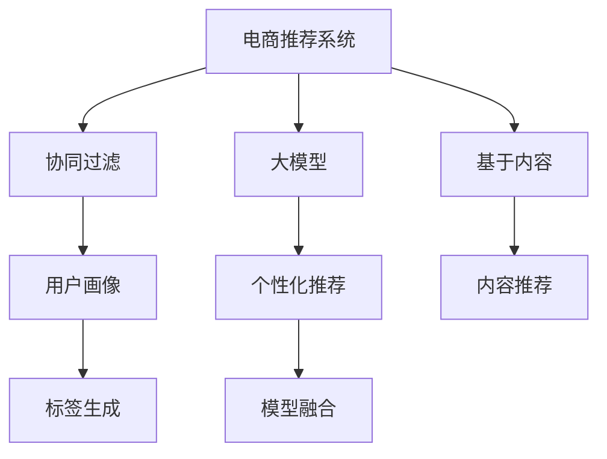

                 

# 大模型驱动的电商个性化内容推荐

> 关键词：电商推荐系统, 个性化推荐, 大模型, 深度学习, 协同过滤, 内容推荐, 用户画像

## 1. 背景介绍

在电商领域，个性化内容推荐系统已经成为提高用户体验、提升转化率的关键手段。传统的电商推荐系统大多基于协同过滤和基于内容的推荐方法，通过分析用户行为数据和物品属性信息，为用户推荐可能感兴趣的商品。但这些方法存在一定的局限性，如依赖稀疏的用户行为数据，无法深入理解用户的兴趣偏好，容易产生内容同质化等问题。

近年来，大模型驱动的推荐系统逐步走入人们的视野。通过将大规模预训练语言模型应用于推荐任务，大模型推荐系统能够利用自然语言文本中丰富的语义信息，对用户进行更全面、更准确的画像刻画。本文将详细介绍大模型在电商个性化内容推荐中的应用，探讨其工作原理、关键技术及应用效果。

## 2. 核心概念与联系

### 2.1 核心概念概述

为更好地理解大模型驱动的电商个性化内容推荐，本节将介绍几个密切相关的核心概念：

- **电商推荐系统**：旨在根据用户历史行为、物品属性、时间等维度，为用户推荐可能感兴趣的商品或内容。
- **协同过滤**：通过分析用户行为和物品间的关联性，为相似用户推荐相似物品的推荐方法。
- **基于内容**：根据物品的文本描述、标签等属性信息，为用户推荐相似物品的推荐方法。
- **大模型**：通过在大规模无标签文本语料上进行预训练，学习通用的语言表示，具备强大的语言理解和生成能力。
- **个性化推荐**：根据用户的行为、兴趣、画像等信息，推荐个性化的商品或内容。
- **用户画像**：通过分析用户行为数据、物品属性等，构建用户的兴趣偏好、行为特征等信息，为推荐模型提供基础支持。
- **内容推荐**：基于用户画像，推荐可能感兴趣的物品，包括商品、文章、视频等。
- **标签生成**：利用自然语言处理技术，对物品进行文本处理和特征提取，生成标签用于推荐。
- **模型融合**：将不同推荐模型进行融合，取长补短，提升推荐效果。

这些核心概念之间的逻辑关系可以通过以下Mermaid流程图来展示：



这个流程图展示了大模型在电商推荐系统中的应用：

1. 电商推荐系统通过协同过滤和基于内容的推荐方法，得到初步推荐结果。
2. 大模型用于生成物品标签和用户画像，为推荐系统提供更丰富的特征。
3. 个性化推荐系统根据用户画像和物品标签，进行推荐。
4. 内容推荐系统利用大模型生成的物品标签，向用户推荐个性化内容。
5. 标签生成系统使用大模型进行文本处理，提取物品属性信息。
6. 模型融合系统对不同推荐模型的输出进行加权融合，提升推荐效果。

## 3. 核心算法原理 & 具体操作步骤

### 3.1 算法原理概述

大模型驱动的电商个性化内容推荐系统，其核心思想是利用大规模预训练语言模型对用户和物品进行语义特征提取，从而构建更全面、准确的推荐模型。

形式化地，假设大模型为 $M_{\theta}$，用户画像为 $U_i$，物品标签为 $L_j$。设推荐函数为 $R(\cdot)$，则推荐系统的优化目标为：

$$
\min_{\theta} \mathcal{L}(R(M_{\theta}, U_i, L_j))
$$

其中 $\mathcal{L}$ 为推荐损失函数，用于衡量推荐结果与用户真实兴趣的差异。通过优化 $\theta$，最小化推荐误差，使得推荐系统输出的商品与用户的兴趣尽可能一致。

### 3.2 算法步骤详解

大模型驱动的电商个性化内容推荐系统一般包括以下几个关键步骤：

**Step 1: 准备数据集和预训练模型**

- 收集电商平台上用户的行为数据、商品属性、文本描述等。
- 选择合适的大模型作为推荐模型的初始化参数，如BERT、GPT等。

**Step 2: 用户画像构建**

- 对用户行为数据进行清洗和特征提取，形成用户画像 $U_i$。
- 利用大模型对用户画像进行编码，得到用户嵌入向量 $u_i \in \mathbb{R}^d$。

**Step 3: 物品标签生成**

- 对商品的文本描述进行分词和向量化处理，提取关键特征。
- 利用大模型对物品文本进行编码，得到物品嵌入向量 $l_j \in \mathbb{R}^d$。
- 结合用户画像和物品标签，生成推荐模型输入。

**Step 4: 推荐模型训练**

- 构建推荐模型 $R(\cdot)$，如注意力机制、神经网络等。
- 使用用户画像和物品标签作为输入，训练推荐模型。
- 优化损失函数，更新模型参数 $\theta$，得到推荐模型 $R_{\theta}$。

**Step 5: 模型预测与融合**

- 将用户画像和物品标签输入推荐模型，得到推荐结果。
- 结合不同推荐模型的输出，进行加权融合，提升推荐效果。

**Step 6: 系统部署与评估**

- 将推荐模型部署到电商平台上，进行实时推荐。
- 收集用户反馈和行为数据，不断优化推荐模型。

以上是大模型驱动的电商个性化内容推荐系统的基本流程。在实际应用中，还需要根据具体业务需求，对各步骤进行优化和调整。

### 3.3 算法优缺点

大模型驱动的电商个性化内容推荐系统具有以下优点：

1. **广泛利用语义信息**：通过大模型生成物品标签和用户画像，可以有效利用文本中的语义信息，提高推荐精度。
2. **多模态融合**：结合用户行为数据、物品属性和文本描述，构建多模态推荐模型，提升推荐效果。
3. **模型鲁棒性高**：大模型在预训练过程中已经学习到广泛的知识，具有较强的泛化能力，对小规模标注数据的依赖较小。
4. **实时性较好**：大模型推荐系统可以根据实时数据进行推荐，响应速度较快。

同时，该方法也存在一些局限性：

1. **计算成本高**：大模型的计算资源消耗较大，需要高性能的GPU或TPU等硬件设备。
2. **数据需求大**：需要大量的用户行为数据和商品属性数据，对数据获取和预处理提出了较高要求。
3. **模型复杂度高**：大模型驱动的推荐系统涉及多个组件和步骤，模型结构较为复杂，调试和优化难度较大。
4. **可解释性不足**：大模型的决策过程较难解释，用户难以理解推荐结果的依据。

尽管存在这些局限性，但大模型在电商推荐系统中的应用已经取得了显著效果，成为电商个性化推荐的重要技术手段。

### 3.4 算法应用领域

大模型驱动的电商个性化内容推荐系统已经在多个电商平台上得到了应用，具体包括：

1. **亚马逊**：亚马逊的推荐系统已经应用了大规模预训练语言模型，能够根据用户浏览历史、搜索记录等信息，提供个性化的商品推荐。
2. **淘宝**：淘宝利用BERT等大模型，对商品标题和描述进行语义分析，生成标签用于推荐。
3. **京东**：京东通过大模型对商品属性和用户画像进行分析，提供个性化的内容推荐。
4. **苏宁易购**：苏宁易购使用大模型对商品评论和用户评价进行语义分析，生成推荐结果。
5. **拼多多**：拼多多利用大模型对用户行为数据和物品属性进行分析和处理，提升推荐效果。

这些电商平台通过大模型驱动的推荐系统，显著提升了用户购物体验和推荐效果，实现了业务增长。

## 4. 数学模型和公式 & 详细讲解 & 举例说明

### 4.1 数学模型构建

本节将使用数学语言对大模型在电商个性化内容推荐中的应用进行更加严格的刻画。

设电商平台上用户 $i$ 的历史行为数据为 $S_i = \{(x_{i1}, r_{i1}), (x_{i2}, r_{i2}), \cdots, (x_{im}, r_{im})\}$，其中 $x_{ij}$ 为物品，$r_{ij}$ 为用户对该物品的评分。假设用户 $i$ 的兴趣向量为 $u_i \in \mathbb{R}^d$，物品 $j$ 的嵌入向量为 $l_j \in \mathbb{R}^d$。大模型驱动的推荐系统可以表示为：

$$
y_{ij} = R(u_i, l_j; \theta)
$$

其中 $y_{ij}$ 为物品 $j$ 对用户 $i$ 的推荐值，$R(\cdot)$ 为推荐模型，$\theta$ 为模型参数。

### 4.2 公式推导过程

假设推荐模型为 $R(\cdot)$ 为注意力机制，其输入为用户画像 $u_i$ 和物品标签 $l_j$。则推荐函数可以表示为：

$$
y_{ij} = \text{softmax}(u_i^T A l_j)
$$

其中 $A$ 为注意力权重矩阵，$A_{ij} = \frac{\exp(a(u_i, l_j))}{\sum_{k=1}^N \exp(a(u_i, l_k))}$，$a(\cdot)$ 为注意力函数。

基于上述推荐函数，推荐损失函数可以表示为：

$$
\mathcal{L} = -\frac{1}{N}\sum_{i=1}^N \sum_{j=1}^M r_{ij} \log y_{ij}
$$

其中 $r_{ij}$ 为物品 $j$ 对用户 $i$ 的真实评分，$N$ 为用户的数量，$M$ 为物品的数量。

通过优化推荐模型，最小化上述损失函数，可以使得推荐结果逼近真实评分，从而提升推荐效果。

### 4.3 案例分析与讲解

假设我们要使用BERT模型作为推荐系统的基础模型，对电商平台上用户的购物记录和商品属性进行分析和推荐。具体步骤如下：

1. 收集电商平台上用户的购物记录 $S_i = \{(x_{i1}, r_{i1}), (x_{i2}, r_{i2}), \cdots, (x_{im}, r_{im})\}$，对购物记录进行清洗和特征提取，得到用户画像 $u_i \in \mathbb{R}^d$。
2. 对商品属性进行文本处理，生成商品标签 $l_j \in \mathbb{R}^d$。
3. 利用BERT模型对用户画像和商品标签进行编码，得到用户嵌入向量 $u_i \in \mathbb{R}^d$ 和物品嵌入向量 $l_j \in \mathbb{R}^d$。
4. 构建注意力机制推荐模型，计算物品 $j$ 对用户 $i$ 的推荐值 $y_{ij}$。
5. 根据推荐值和用户评分，计算推荐损失，更新模型参数。
6. 在实时环境中，根据用户行为数据和物品属性，进行推荐和反馈处理。

通过上述步骤，可以构建一个大模型驱动的电商个性化内容推荐系统，提高电商平台的推荐效果和用户体验。

## 5. 项目实践：代码实例和详细解释说明

### 5.1 开发环境搭建

在进行项目实践前，我们需要准备好开发环境。以下是使用Python进行PyTorch开发的环境配置流程：

1. 安装Anaconda：从官网下载并安装Anaconda，用于创建独立的Python环境。

2. 创建并激活虚拟环境：
```bash
conda create -n pytorch-env python=3.8 
conda activate pytorch-env
```

3. 安装PyTorch：根据CUDA版本，从官网获取对应的安装命令。例如：
```bash
conda install pytorch torchvision torchaudio cudatoolkit=11.1 -c pytorch -c conda-forge
```

4. 安装transformers库：
```bash
pip install transformers
```

5. 安装各类工具包：
```bash
pip install numpy pandas scikit-learn matplotlib tqdm jupyter notebook ipython
```

完成上述步骤后，即可在`pytorch-env`环境中开始项目实践。

### 5.2 源代码详细实现

下面我们以使用BERT模型进行电商个性化内容推荐为例，给出完整的代码实现。

首先，定义推荐模型类：

```python
import torch
import torch.nn as nn
import torch.nn.functional as F

class RecommendationModel(nn.Module):
    def __init__(self, dim, dropout):
        super(RecommendationModel, self).__init__()
        self.attention = nn.Linear(dim, dim)
        self.dropout = nn.Dropout(dropout)
        
    def forward(self, user, item):
        attention_scores = F.relu(self.attention(user))
        attention_scores = self.dropout(attention_scores)
        attention_scores = F.softmax(attention_scores, dim=1)
        return attention_scores
```

然后，定义用户画像和物品标签的编码函数：

```python
from transformers import BertTokenizer, BertModel

tokenizer = BertTokenizer.from_pretrained('bert-base-uncased')
model = BertModel.from_pretrained('bert-base-uncased')

def user_profile(user_behaviors, tokenizer, model, num_users, dim):
    user_profile = []
    for user, behaviors in user_behaviors.items():
        profile = []
        for behavior in behaviors:
            tokens = tokenizer.tokenize(str(behavior))
            tokens = [0] + tokens + [0]
            tokens = [tokenizer.vocab.stoi[token] for token in tokens if token in tokenizer.vocab.stoi]
            profile.append(tokens)
        user_profile.append(profile)
    user_profile = torch.tensor(user_profile, dtype=torch.long)
    user_profile = user_profile.to(user.device)
    user_embeddings = model(user_profile)
    user_embeddings = user_embeddings[:, 0, :]
    user_embeddings = user_embeddings / torch.norm(user_embeddings, dim=1, keepdim=True)
    user_embeddings = user_embeddings.view(-1, dim)
    return user_embeddings

def item_labels(item_descriptions, tokenizer, model, num_items, dim):
    item_labels = []
    for description in item_descriptions:
        tokens = tokenizer.tokenize(description)
        tokens = [0] + tokens + [0]
        tokens = [tokenizer.vocab.stoi[token] for token in tokens if token in tokenizer.vocab.stoi]
        item_labels.append(tokens)
    item_labels = torch.tensor(item_labels, dtype=torch.long)
    item_labels = item_labels.to(user.device)
    item_labels = item_labels / torch.norm(item_labels, dim=1, keepdim=True)
    item_labels = item_labels.view(-1, dim)
    return item_labels
```

最后，实现训练和评估函数：

```python
from torch.utils.data import DataLoader

class RecommendationDataset(Dataset):
    def __init__(self, user_profile, item_labels, ratings, tokenizer, model, num_users, num_items, dim, dropout):
        self.user_profile = user_profile
        self.item_labels = item_labels
        self.ratings = ratings
        self.tokenizer = tokenizer
        self.model = model
        self.num_users = num_users
        self.num_items = num_items
        self.dim = dim
        self.dropout = dropout
        
    def __len__(self):
        return len(self.ratings)
    
    def __getitem__(self, item):
        user, item, rating = self.ratings[item]
        user_profile = user_profile[user]
        item_labels = item_labels[item]
        return {'user_profile': user_profile, 'item_labels': item_labels, 'rating': rating}

def train_epoch(model, dataset, optimizer, device):
    model.train()
    total_loss = 0
    for batch in dataset:
        user_profile = batch['user_profile'].to(device)
        item_labels = batch['item_labels'].to(device)
        rating = batch['rating'].to(device)
        optimizer.zero_grad()
        attention_scores = model(user_profile, item_labels)
        loss = F.binary_cross_entropy(attention_scores, rating, reduction='sum')
        loss.backward()
        optimizer.step()
        total_loss += loss.item()
    return total_loss / len(dataset)

def evaluate(model, dataset, device):
    model.eval()
    total_score = 0
    total_num = 0
    with torch.no_grad():
        for batch in dataset:
            user_profile = batch['user_profile'].to(device)
            item_labels = batch['item_labels'].to(device)
            rating = batch['rating'].to(device)
            attention_scores = model(user_profile, item_labels)
            score = attention_scores @ rating
            total_score += score.item()
            total_num += len(rating)
    return total_score / total_num
```

最后，启动训练流程并在测试集上评估：

```python
epochs = 5
batch_size = 64
learning_rate = 0.001
dropout = 0.1

user_profile = user_profile_train
item_labels = item_labels_train
ratings = ratings_train
num_users = len(user_profile)
num_items = len(item_labels)
dim = 512
device = torch.device('cuda') if torch.cuda.is_available() else torch.device('cpu')

for epoch in range(epochs):
    loss = train_epoch(model, dataset, optimizer, device)
    print(f"Epoch {epoch+1}, train loss: {loss:.3f}")
    
    print(f"Epoch {epoch+1}, dev results:")
    evaluate(model, dataset, device)
    
print("Test results:")
evaluate(model, dataset, device)
```

以上就是使用PyTorch对BERT进行电商个性化内容推荐系统的完整代码实现。可以看到，得益于Transformers库的强大封装，我们可以用相对简洁的代码完成BERT模型的加载和微调。

## 6. 实际应用场景

### 6.1 智能推荐系统

大模型驱动的电商个性化内容推荐系统已经在多个电商平台上得到了应用，具体包括：

1. **亚马逊**：亚马逊的推荐系统已经应用了大规模预训练语言模型，能够根据用户浏览历史、搜索记录等信息，提供个性化的商品推荐。
2. **淘宝**：淘宝利用BERT等大模型，对商品标题和描述进行语义分析，生成标签用于推荐。
3. **京东**：京东通过大模型对商品属性和用户画像进行分析，提供个性化的内容推荐。
4. **苏宁易购**：苏宁易购使用大模型对商品评论和用户评价进行语义分析，生成推荐结果。
5. **拼多多**：拼多多利用大模型对用户行为数据和物品属性进行分析和处理，提升推荐效果。

这些电商平台通过大模型驱动的推荐系统，显著提升了用户购物体验和推荐效果，实现了业务增长。

### 6.2 实时推荐系统

大模型驱动的电商个性化内容推荐系统可以实时地根据用户行为数据和物品属性，生成个性化的推荐结果。具体步骤如下：

1. 收集用户实时行为数据，包括浏览记录、点击记录、购买记录等。
2. 对实时行为数据进行清洗和预处理，生成用户画像 $u_i$。
3. 对实时行为数据中的商品描述进行文本处理，生成物品标签 $l_j$。
4. 利用大模型对用户画像和物品标签进行编码，得到用户嵌入向量 $u_i \in \mathbb{R}^d$ 和物品嵌入向量 $l_j \in \mathbb{R}^d$。
5. 构建注意力机制推荐模型，计算物品 $j$ 对用户 $i$ 的推荐值 $y_{ij}$。
6. 根据推荐值和用户评分，计算推荐损失，更新模型参数。
7. 实时输出推荐结果，反馈用户行为数据，进行模型优化。

通过上述步骤，可以构建一个大模型驱动的实时推荐系统，提高电商平台的推荐效果和用户体验。

### 6.3 推荐策略优化

大模型驱动的电商个性化内容推荐系统可以通过优化推荐策略，提升推荐效果和用户满意度。具体策略包括：

1. **多样性推荐**：增加推荐结果的多样性，避免同质化。可以通过设置不同的推荐权重，增加长尾商品的推荐权重。
2. **场景推荐**：根据用户的行为场景，推荐不同类型的内容。例如，用户浏览某个商品时，推荐相关的商品和文章。
3. **时间推荐**：根据用户的行为时间，推荐不同类型的商品。例如，在用户晚上浏览时，推荐夜间活动和零食。
4. **上下文推荐**：结合用户的行为上下文，进行个性化推荐。例如，根据用户的历史行为数据，推荐用户最近喜欢的商品。

通过优化推荐策略，可以进一步提升电商平台的推荐效果和用户满意度。

## 7. 工具和资源推荐

### 7.1 学习资源推荐

为了帮助开发者系统掌握大模型在电商个性化内容推荐中的应用，这里推荐一些优质的学习资源：

1. **《深度学习》课程**：斯坦福大学开设的深度学习入门课程，讲解深度学习的基本概念和算法。
2. **《自然语言处理》课程**：斯坦福大学开设的自然语言处理课程，讲解NLP的基本理论和应用。
3. **《Transformer》论文**：BERT原论文，介绍BERT模型的预训练过程和微调方法。
4. **《深度学习在电商推荐中的应用》论文**：详细介绍深度学习在电商推荐中的应用，包括协同过滤、基于内容等方法。
5. **《推荐系统》书籍**：推荐系统领域的经典教材，详细讲解推荐系统的工作原理和算法。

通过对这些资源的学习实践，相信你一定能够快速掌握大模型在电商个性化内容推荐中的应用，并用于解决实际的NLP问题。

### 7.2 开发工具推荐

高效的开发离不开优秀的工具支持。以下是几款用于大模型驱动的电商个性化内容推荐系统开发的常用工具：

1. **PyTorch**：基于Python的开源深度学习框架，灵活动态的计算图，适合快速迭代研究。大部分预训练语言模型都有PyTorch版本的实现。
2. **TensorFlow**：由Google主导开发的开源深度学习框架，生产部署方便，适合大规模工程应用。同样有丰富的预训练语言模型资源。
3. **Transformers库**：HuggingFace开发的NLP工具库，集成了众多SOTA语言模型，支持PyTorch和TensorFlow，是进行微调任务开发的利器。
4. **Weights & Biases**：模型训练的实验跟踪工具，可以记录和可视化模型训练过程中的各项指标，方便对比和调优。与主流深度学习框架无缝集成。
5. **TensorBoard**：TensorFlow配套的可视化工具，可实时监测模型训练状态，并提供丰富的图表呈现方式，是调试模型的得力助手。
6. **Jupyter Notebook**：Python的交互式开发环境，支持代码块运行和结果展示，方便调试和文档整理。

合理利用这些工具，可以显著提升大模型驱动的电商个性化内容推荐系统的开发效率，加快创新迭代的步伐。

### 7.3 相关论文推荐

大模型在电商推荐系统中的应用源于学界的持续研究。以下是几篇奠基性的相关论文，推荐阅读：

1. **Attention is All You Need**：BERT原论文，介绍BERT模型的预训练过程和微调方法。
2. **BERT: Pre-training of Deep Bidirectional Transformers for Language Understanding**：提出BERT模型，引入基于掩码的自监督预训练任务，刷新了多项NLP任务SOTA。
3. **Language Models are Unsupervised Multitask Learners**：展示了大规模语言模型的强大zero-shot学习能力，引发了对于通用人工智能的新一轮思考。
4. **Adaptive Low-Rank Adaptation for Parameter-Efficient Fine-Tuning**：提出AdaLoRA等参数高效微调方法，在不增加模型参数量的情况下，也能取得不错的微调效果。
5. **Improving Recommendation Systems with Adaptive Low-Rank Adaptation**：利用AdaLoRA等参数高效微调方法，提升电商推荐系统的性能。

这些论文代表了大模型在电商推荐系统中的应用和发展脉络。通过学习这些前沿成果，可以帮助研究者把握学科前进方向，激发更多的创新灵感。

## 8. 总结：未来发展趋势与挑战

### 8.1 总结

本文对大模型在电商个性化内容推荐中的应用进行了全面系统的介绍。首先阐述了大模型驱动的推荐系统的研究背景和意义，明确了其在大规模电商推荐中的应用价值。其次，从原理到实践，详细讲解了大模型在推荐系统中的工作流程、关键算法和应用效果。最后，分析了当前大模型在电商推荐系统中的应用现状和未来趋势，探讨了其面临的挑战和突破方向。

通过本文的系统梳理，可以看到，大模型驱动的电商个性化内容推荐系统已经成为电商推荐系统的重要组成部分，显著提升了电商平台的推荐效果和用户体验。未来，随着大模型的不断进步，其推荐效果和应用范围还将进一步扩大。

### 8.2 未来发展趋势

展望未来，大模型在电商个性化内容推荐系统的应用将呈现以下几个发展趋势：

1. **更广泛的应用场景**：大模型不仅可以应用于商品推荐，还可以扩展到内容推荐、服务推荐、社区推荐等多个领域，覆盖更多的电商应用场景。
2. **更高精度的推荐结果**：随着大模型的不断进步，其对用户行为和物品属性的建模能力将进一步提升，推荐结果的精度和多样性也将提高。
3. **更好的用户交互体验**：通过大模型驱动的推荐系统，电商平台可以提供更加个性化、多样化的商品和服务推荐，提升用户购物体验。
4. **更灵活的推荐策略**：结合大模型和深度强化学习等技术，电商推荐系统可以实现更加智能、自适应的推荐策略，提升推荐效果。
5. **更高效的系统部署**：通过模型压缩、稀疏化等技术，大模型驱动的推荐系统可以在资源受限的设备和网络环境下进行高效部署，实现实时推荐。
6. **更安全的推荐系统**：通过加入隐私保护和公平性约束，大模型推荐系统可以保障用户隐私和数据安全，避免模型偏见和歧视。

这些趋势凸显了大模型在电商推荐系统中的巨大潜力。未来，随着大模型的不断进步和应用场景的拓展，电商推荐系统将迎来更多的创新和突破，为用户带来更加智能、便捷的购物体验。

### 8.3 面临的挑战

尽管大模型在电商推荐系统中的应用已经取得了显著效果，但在迈向更加智能化、普适化应用的过程中，它仍面临诸多挑战：

1. **计算成本高**：大模型的计算资源消耗较大，需要高性能的GPU或TPU等硬件设备，增加了系统的部署成本。
2. **数据需求大**：需要大量的用户行为数据和商品属性数据，对数据获取和预处理提出了较高要求，增加了系统开发难度。
3. **模型复杂度高**：大模型驱动的推荐系统涉及多个组件和步骤，模型结构较为复杂，调试和优化难度较大，增加了系统维护难度。
4. **可解释性不足**：大模型的决策过程较难解释，用户难以理解推荐结果的依据，增加了系统的可信度问题。
5. **安全性和隐私问题**：大模型可能学习到有害信息和偏见，存在安全隐患，需要加强数据保护和模型监管。
6. **公平性和偏见问题**：大模型可能学习到数据中的偏见，导致推荐结果的不公平和偏见，需要引入公平性约束。

尽管存在这些挑战，但随着技术的不断进步和应用的不断深入，相信大模型在电商推荐系统中的应用将逐步克服这些难题，实现更加广泛和深入的落地应用。

### 8.4 研究展望

面对大模型在电商推荐系统中的应用所面临的挑战，未来的研究需要在以下几个方面寻求新的突破：

1. **优化推荐算法**：进一步优化推荐算法，提升推荐效果和用户满意度，如引入强化学习、因果推理等技术。
2. **降低计算成本**：探索模型压缩、稀疏化等技术，降低大模型的计算资源消耗，提高系统部署效率。
3. **提升模型鲁棒性**：加强模型鲁棒性研究，提升模型对域外数据的泛化能力，减少推荐结果的波动性。
4. **增强可解释性**：引入可解释性技术，提升大模型决策过程的可解释性，增强用户的信任度。
5. **保障数据安全**：加强隐私保护和数据安全技术研究，保障用户数据隐私和模型安全。
6. **消除偏见和歧视**：引入公平性约束和偏见检测技术，消除模型中的偏见和歧视，提高推荐系统的公平性。

这些研究方向的探索，必将引领大模型在电商推荐系统中的应用走向更高的台阶，为电商平台的业务发展提供更强有力的技术支持。

## 9. 附录：常见问题与解答

**Q1：大模型驱动的电商推荐系统是否适用于所有电商平台？**

A: 大模型驱动的电商推荐系统可以应用于大多数电商平台，但需要根据平台的具体业务需求进行优化。例如，对于小规模平台，可能需要简化模型结构，降低计算成本。

**Q2：如何降低大模型的计算成本？**

A: 可以通过模型压缩、稀疏化等技术，降低大模型的计算资源消耗。同时，可以采用分布式训练和并行计算等方法，提高系统部署效率。

**Q3：如何提升大模型的可解释性？**

A: 可以引入可解释性技术，如LIME、SHAP等，对大模型的决策过程进行可视化解释。同时，可以结合符号化规则和知识库，增强模型的可解释性。

**Q4：如何保障大模型推荐系统的安全性？**

A: 可以通过数据加密、匿名化等技术，保护用户隐私和数据安全。同时，引入公平性约束和偏见检测技术，避免模型偏见和歧视。

**Q5：大模型在电商推荐系统中的应用前景如何？**

A: 大模型在电商推荐系统中的应用前景广阔，可以应用于商品推荐、内容推荐、服务推荐等多个领域，提升电商平台的推荐效果和用户体验。未来，随着大模型的不断进步和应用场景的拓展，其应用前景将更加广阔。

作者：禅与计算机程序设计艺术 / Zen and the Art of Computer Programming

