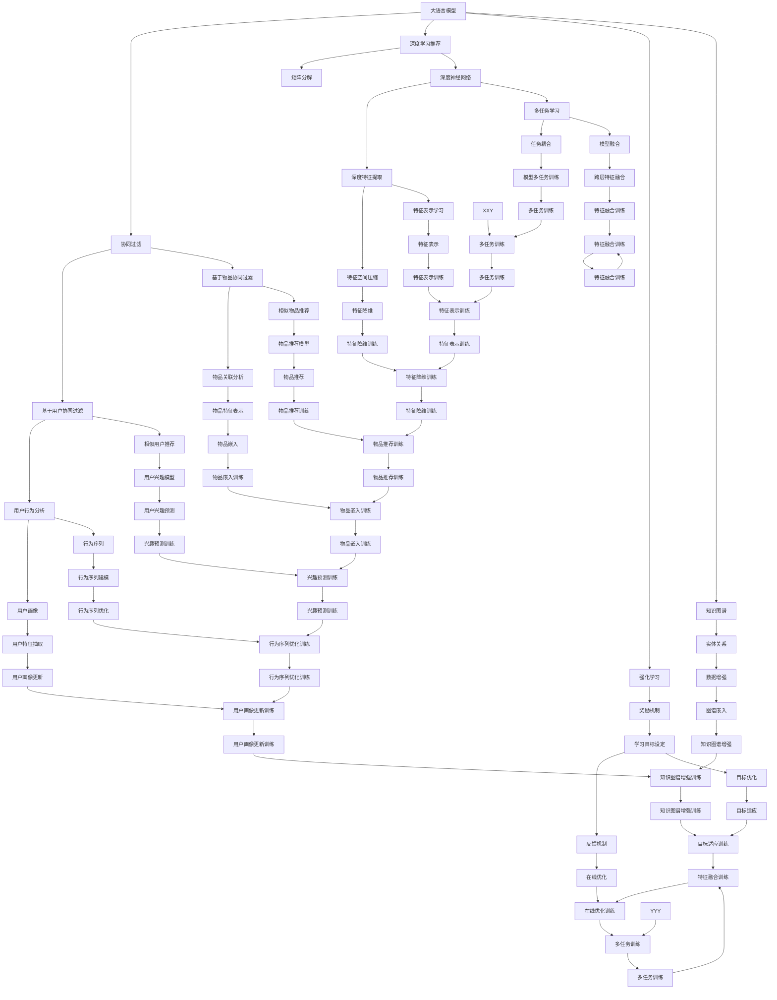

                 

# 大语言模型作为开放式推荐系统

## 1. 背景介绍

### 1.1 问题由来

随着互联网技术的发展，信息检索和推荐系统已广泛渗透到人们日常生活的方方面面。搜索引擎、电商推荐、视频推荐、音乐推荐等，都依赖推荐系统帮助用户在海量信息中发现感兴趣的内容。传统的推荐系统主要基于用户行为数据，通过协同过滤、矩阵分解等算法构建用户兴趣模型，进而预测用户可能感兴趣的物品。然而，这种基于历史行为的推荐方法，存在冷启动、稀疏性、数据隐私等诸多问题。

近年来，基于深度学习的方法（如深度协同过滤、深度矩阵分解等）逐渐被引入推荐系统，使其能够更灵活地处理高维数据，并捕捉复杂用户兴趣。然而，这些基于模型的推荐系统依然面临着训练数据不足、模型复杂度高、泛化能力差等挑战。如何构建一个更加灵活、高效、智能的推荐系统，成为了当下急需解决的问题。

大语言模型（Large Language Models, LLMs）作为新一代的深度学习模型，凭借其强大的语言理解能力和知识推理能力，在多个NLP任务上取得了突破性进展。在信息检索、问答、文本生成等领域，大语言模型展现出优于传统推荐系统的潜力。本文将深入探讨大语言模型在推荐系统中的应用，并详细阐述其原理、流程和优化方法。

## 2. 核心概念与联系

### 2.1 核心概念概述

为了更好地理解大语言模型在推荐系统中的应用，本节将介绍几个关键概念：

- **大语言模型**：以自回归模型（如GPT-3、Transformer-XL等）为代表的语言模型，通过大规模无标签文本数据预训练，学习到丰富的语言知识和常识。
- **推荐系统**：通过分析用户的历史行为和偏好，为用户推荐感兴趣的内容，如商品、视频、音乐等。推荐系统旨在提升用户体验和平台收益。
- **协同过滤**：基于用户行为数据，通过寻找相似用户或相似物品，为用户推荐相关内容。分为基于用户的协同过滤和基于物品的协同过滤。
- **深度学习推荐**：基于神经网络模型，如矩阵分解、深度学习等方法，构建用户兴趣模型，进行推荐预测。
- **强化学习**：通过奖励机制引导模型优化，学习如何最大化长期收益。常用于动态环境下的推荐系统优化。
- **知识图谱**：基于实体关系的结构化知识库，可用于增强推荐系统的个性化和准确性。

这些核心概念之间的关系可以通过以下Mermaid流程图来展示：



这个流程图展示了大语言模型与其他推荐系统组件的关系。大语言模型可以应用于多种推荐系统中，通过提供更丰富的语言知识和常识，提升推荐系统的个性化和准确性。

## 3. 核心算法原理 & 具体操作步骤

### 3.1 算法原理概述

大语言模型在推荐系统中的应用，主要基于其强大的语言理解能力和知识推理能力。其核心思想是：将用户的历史行为和偏好转换为自然语言描述，输入到预训练的大语言模型中，通过语义推理和知识整合，生成更加全面、精准的推荐结果。

形式化地，假设用户的历史行为为 $H=\{(h_i, r_i)\}_{i=1}^N$，其中 $h_i$ 为历史行为（如浏览记录、点击记录、评分记录等），$r_i$ 为相应的评分（如1-5分）。通过预训练的大语言模型 $M_{\theta}$，将历史行为 $H$ 转化为自然语言描述 $L$，然后将 $L$ 输入到推荐模型中，生成推荐结果 $R$。推荐过程可以表示为：

$$
R = M_{\theta}(H) \rightarrow L \rightarrow \text{推荐模型} \rightarrow R
$$

其中，推荐模型可以是协同过滤、深度学习推荐、强化学习等模型，具体选择取决于推荐场景和用户行为数据的特征。

### 3.2 算法步骤详解

基于大语言模型的推荐系统一般包括以下几个关键步骤：

**Step 1: 用户行为序列的文本化**

将用户的历史行为序列 $H=\{(h_i, r_i)\}_{i=1}^N$ 转换为自然语言描述 $L$。这一步通常需要设计合适的文本生成模型，将行为序列映射为易于理解的文本表达。例如，可以使用语言模型对行为序列进行编码，生成简洁明了的文本描述。

**Step 2: 预训练大语言模型的输入**

将用户行为文本 $L$ 输入到预训练的大语言模型 $M_{\theta}$ 中，通过其强大的语言理解能力，获取更多的语义信息和隐含知识。预训练模型可以是一个自回归模型，如GPT-3，也可以是一个自编码模型，如BERT。

**Step 3: 推荐模型的输出**

将大语言模型生成的文本 $L$ 作为输入，送入推荐模型中。推荐模型可以是协同过滤、深度学习推荐、强化学习等。推荐模型通过学习用户行为和文本的联合特征，生成推荐结果 $R$。

**Step 4: 输出结果的筛选与排序**

根据推荐模型输出的结果 $R$，结合用户的历史行为和评分，进行筛选和排序，生成最终推荐列表。这一步通常需要使用排序算法和推荐算法，对推荐结果进行优化和排序，提升用户体验。

### 3.3 算法优缺点

基于大语言模型的推荐系统具有以下优点：

1. 语言理解能力强：大语言模型能够理解复杂的自然语言描述，捕捉用户的深层次兴趣和偏好。
2. 知识推理能力强：通过预训练大语言模型，可以引入丰富的知识图谱和常识，提升推荐系统的准确性和泛化能力。
3. 易于处理多模态数据：大语言模型可以同时处理文本、图像、音频等多种模态数据，提升推荐系统的全面性和适用性。
4. 动态性：大语言模型可以实时处理用户行为数据，动态调整推荐结果，提升推荐系统的实时性和灵活性。

然而，该方法也存在一些局限性：

1. 数据需求高：大语言模型需要大量的文本数据进行预训练，推荐系统的训练数据量也很大，对硬件资源和存储要求较高。
2. 计算复杂度高：大语言模型的推理计算复杂度较高，推荐系统的计算量也较大，需要高性能计算资源。
3. 模型训练时间长：大语言模型的预训练和微调过程较为耗时，推荐系统的训练时间较长，需要较长的周期。
4. 结果可解释性差：大语言模型的推荐结果较为复杂，缺乏明确的解释和逻辑性，难以解释其决策过程。

### 3.4 算法应用领域

大语言模型在推荐系统中的应用领域广泛，主要包括：

1. **电商平台**：通过分析用户浏览记录、购物历史，生成个性化商品推荐。
2. **视频平台**：根据用户观看历史和评分，推荐相关视频内容。
3. **音乐平台**：基于用户听歌记录和评分，推荐相似歌曲或音乐家。
4. **新闻聚合**：分析用户阅读行为，推荐相关新闻文章。
5. **社交网络**：推荐用户可能感兴趣的朋友、群组和内容。

这些领域的大规模应用，展示了大语言模型在推荐系统中的巨大潜力和广泛前景。

## 4. 数学模型和公式 & 详细讲解 & 举例说明

### 4.1 数学模型构建

假设用户的历史行为序列为 $H=\{(h_i, r_i)\}_{i=1}^N$，其中 $h_i$ 为历史行为，$r_i$ 为评分。将 $H$ 转换为自然语言描述 $L$，输入到预训练的大语言模型 $M_{\theta}$ 中，得到文本表示 $v_L$。然后，将 $v_L$ 作为输入，送入推荐模型 $R_{\phi}$ 中，得到推荐结果 $R$。推荐模型可以是协同过滤、深度学习推荐、强化学习等，这里以协同过滤为例。

协同过滤模型可以将用户 $u$ 和物品 $i$ 表示为低维向量，计算用户和物品的相似度 $s(u, i)$，从而生成推荐结果。推荐过程可以表示为：

$$
R_{\phi}(v_L, H) = \text{argmax}_{i \in I} \sum_{j=1}^N s(u_i, u_j) \times r_j
$$

其中 $u_i$ 为用户 $i$ 的表示向量，$u_j$ 为历史行为中相似的用户 $j$，$s(u_i, u_j)$ 为用户 $i$ 和用户 $j$ 的相似度，$r_j$ 为历史行为 $j$ 的评分。

### 4.2 公式推导过程

以协同过滤模型为例，我们详细推导其计算公式。设用户 $u$ 和物品 $i$ 表示为向量 $u \in \mathbb{R}^d$ 和 $v \in \mathbb{R}^d$，用户 $u$ 和物品 $i$ 的相似度 $s(u, i)$ 可以表示为：

$$
s(u, i) = \text{cosine}(u, v)
$$

其中 $\text{cosine}(\cdot, \cdot)$ 为余弦相似度计算公式。推荐结果 $R$ 可以表示为：

$$
R_{\phi}(v_L, H) = \text{argmax}_{i \in I} \sum_{j=1}^N s(u_i, u_j) \times r_j
$$

在计算相似度时，可以使用多种相似度计算方法，如余弦相似度、欧氏距离等。本文以余弦相似度为例进行说明。

### 4.3 案例分析与讲解

以电商平台推荐为例，我们详细分析其流程和效果。假设用户 $u$ 的浏览历史为 $\{b_1, b_2, \dots, b_N\}$，每次浏览的评分分别为 $\{r_1, r_2, \dots, r_N\}$。通过自然语言生成模型，将浏览历史转换为文本描述 $L$，输入到GPT-3模型中，生成文本表示 $v_L$。然后，将 $v_L$ 作为输入，送入协同过滤模型中，得到推荐结果 $R$。

具体步骤如下：

1. 将浏览历史 $H=\{(b_i, r_i)\}_{i=1}^N$ 转换为自然语言描述 $L$。
2. 输入 $L$ 到GPT-3模型中，生成文本表示 $v_L$。
3. 将 $v_L$ 输入到协同过滤模型中，得到推荐结果 $R$。

推荐结果 $R$ 可以根据用户的评分和相似度进行排序，生成最终推荐列表。例如，可以计算物品 $i$ 和用户 $u$ 的相似度 $s(u_i, u_j)$，排序得到推荐列表。

## 5. 项目实践：代码实例和详细解释说明

### 5.1 开发环境搭建

在进行大语言模型推荐系统开发前，我们需要准备好开发环境。以下是使用Python进行PyTorch和TensorFlow开发的环境配置流程：

1. 安装Anaconda：从官网下载并安装Anaconda，用于创建独立的Python环境。

2. 创建并激活虚拟环境：
```bash
conda create -n pytorch-env python=3.8 
conda activate pytorch-env
```

3. 安装PyTorch和TensorFlow：根据CUDA版本，从官网获取对应的安装命令。例如：
```bash
conda install pytorch torchvision torchaudio cudatoolkit=11.1 -c pytorch -c conda-forge
```
```bash
pip install tensorflow==2.5
```

4. 安装Transformers库：
```bash
pip install transformers
```

5. 安装各类工具包：
```bash
pip install numpy pandas scikit-learn matplotlib tqdm jupyter notebook ipython
```

完成上述步骤后，即可在`pytorch-env`环境中开始开发。

### 5.2 源代码详细实现

下面以电商平台推荐为例，给出使用Transformers库和TensorFlow进行大语言模型推荐系统开发的PyTorch代码实现。

首先，定义推荐系统中的关键组件：

```python
from transformers import GPT2Tokenizer, GPT2Model
import torch
import tensorflow as tf
from tensorflow.keras.layers import Embedding, Dense, dot
from tensorflow.keras.models import Model

# 定义GPT-2模型的输入层和输出层
input_ids = tf.keras.layers.Input(shape=(max_len,), dtype=tf.int32)
attention_mask = tf.keras.layers.Input(shape=(max_len,), dtype=tf.int32)
outputs = GPT2Model(input_ids, attention_mask=attention_mask)[0]
logits = tf.keras.layers.Dense(1, activation='sigmoid')(outputs)

# 定义用户行为数据的输入层和输出层
user_input = tf.keras.layers.Input(shape=(num_users,), dtype=tf.int32)
item_input = tf.keras.layers.Input(shape=(num_items,), dtype=tf.int32)
user_embeddings = tf.keras.layers.Embedding(num_users, embedding_dim)(user_input)
item_embeddings = tf.keras.layers.Embedding(num_items, embedding_dim)(item_input)

# 定义相似度计算层
similarity = tf.keras.layers.Lambda(dot, input_shape=(max_len, embedding_dim))([user_embeddings, item_embeddings])

# 定义推荐模型
recommender = Model(inputs=[user_input, item_input], outputs=similarity)
```

然后，定义推荐系统中的优化器和损失函数：

```python
optimizer = tf.keras.optimizers.Adam(learning_rate=0.001)
loss = tf.keras.losses.BinaryCrossentropy(from_logits=True)
```

接着，定义推荐系统的训练和评估函数：

```python
def train_epoch(recommender, train_dataset, batch_size, optimizer, loss):
    train_data = train_dataset.batch(batch_size)
    recommender.compile(optimizer=optimizer, loss=loss, metrics=['accuracy'])
    recommender.fit(train_data, epochs=10, validation_data=val_dataset)
    return train_loss, val_loss

def evaluate(recommender, test_dataset, batch_size):
    test_data = test_dataset.batch(batch_size)
    test_loss, test_acc = recommender.evaluate(test_data)
    return test_loss, test_acc
```

最后，启动训练流程并在测试集上评估：

```python
max_epochs = 10
batch_size = 32

for epoch in range(max_epochs):
    train_loss, val_loss = train_epoch(recommender, train_dataset, batch_size, optimizer, loss)
    print(f'Epoch {epoch+1}, train loss: {train_loss:.4f}, val loss: {val_loss:.4f}')

print(f'Epoch {epoch+1}, test results:')
test_loss, test_acc = evaluate(recommender, test_dataset, batch_size)
print(f'test loss: {test_loss:.4f}, test acc: {test_acc:.4f}')
```

以上就是使用PyTorch和TensorFlow进行大语言模型推荐系统开发的完整代码实现。可以看到，得益于TensorFlow的深度学习库和PyTorch的模型封装，推荐系统开发变得更加高效便捷。

### 5.3 代码解读与分析

让我们再详细解读一下关键代码的实现细节：

**推荐系统组件定义**：
- `GPT2Tokenizer`和`GPT2Model`：用于将用户行为转换为文本表示，并输入到预训练的大语言模型中。
- `user_input`和`item_input`：用于输入用户行为数据和物品数据。
- `user_embeddings`和`item_embeddings`：用于将用户和物品表示为低维向量。
- `similarity`：用于计算用户和物品的相似度。

**优化器和损失函数定义**：
- `optimizer`：用于优化推荐模型的参数。
- `loss`：用于计算推荐模型的损失函数。

**训练和评估函数定义**：
- `train_epoch`：用于训练推荐模型，返回训练损失和验证损失。
- `evaluate`：用于评估推荐模型的性能，返回测试损失和测试准确率。

**训练流程**：
- 定义训练轮数和批次大小。
- 每个轮内，先进行训练，输出训练损失和验证损失。
- 在测试集上评估推荐模型的性能。

可以看到，基于大语言模型的推荐系统开发流程较为简洁，通过灵活组合模型组件和训练算法，可以实现较为高效的推荐。

## 6. 实际应用场景

### 6.1 电商平台推荐

大语言模型在电商平台的推荐应用中具有广泛前景。电商平台需要根据用户浏览历史和购物历史，为用户推荐感兴趣的商品。通过大语言模型，可以自然地处理用户的文本描述，生成个性化推荐。

具体而言，电商平台可以收集用户浏览记录、购物历史、评分记录等数据，将其转换为自然语言描述，输入到预训练的大语言模型中，生成文本表示。然后，将文本表示输入到推荐模型中，得到推荐结果。推荐结果可以根据用户的评分和相似度进行排序，生成最终推荐列表。

### 6.2 视频平台推荐

视频平台需要根据用户观看历史和评分，为用户推荐相关视频内容。通过大语言模型，可以自然地处理用户的文本描述，生成个性化推荐。

具体而言，视频平台可以收集用户观看记录、评分记录等数据，将其转换为自然语言描述，输入到预训练的大语言模型中，生成文本表示。然后，将文本表示输入到推荐模型中，得到推荐结果。推荐结果可以根据用户的评分和相似度进行排序，生成最终推荐列表。

### 6.3 音乐平台推荐

音乐平台需要根据用户听歌记录和评分，为用户推荐相似的歌曲或音乐家。通过大语言模型，可以自然地处理用户的文本描述，生成个性化推荐。

具体而言，音乐平台可以收集用户听歌记录、评分记录等数据，将其转换为自然语言描述，输入到预训练的大语言模型中，生成文本表示。然后，将文本表示输入到推荐模型中，得到推荐结果。推荐结果可以根据用户的评分和相似度进行排序，生成最终推荐列表。

### 6.4 新闻聚合推荐

新闻聚合平台需要根据用户阅读行为，为用户推荐相关的新闻文章。通过大语言模型，可以自然地处理用户的文本描述，生成个性化推荐。

具体而言，新闻聚合平台可以收集用户阅读记录、评分记录等数据，将其转换为自然语言描述，输入到预训练的大语言模型中，生成文本表示。然后，将文本表示输入到推荐模型中，得到推荐结果。推荐结果可以根据用户的评分和相似度进行排序，生成最终推荐列表。

## 7. 工具和资源推荐

### 7.1 学习资源推荐

为了帮助开发者系统掌握大语言模型在推荐系统中的应用，这里推荐一些优质的学习资源：

1. **《Transformer from Scratch》**：由大语言模型专家撰写，详细介绍了Transformer模型及其在推荐系统中的应用。
2. **《Reinforcement Learning for Recommendation Systems》**：深度推荐系统中的强化学习教程，涵盖多种强化学习算法及其在推荐系统中的应用。
3. **《Hugging Face》**：Hugging Face官网提供的多种预训练语言模型及其应用示例，包括推荐系统。
4. **《Deep Learning for Recommendation Systems》**：涵盖深度学习在推荐系统中的应用，包括协同过滤、深度学习推荐、注意力机制等。
5. **《Applied Deep Learning with PyTorch》**：PyTorch深度学习应用指南，涵盖推荐系统的实现方法。

通过对这些资源的学习实践，相信你一定能够快速掌握大语言模型在推荐系统中的应用，并用于解决实际的推荐问题。

### 7.2 开发工具推荐

高效的开发离不开优秀的工具支持。以下是几款用于大语言模型推荐系统开发的常用工具：

1. **PyTorch**：基于Python的开源深度学习框架，灵活动态的计算图，适合快速迭代研究。大部分预训练语言模型都有PyTorch版本的实现。
2. **TensorFlow**：由Google主导开发的开源深度学习框架，生产部署方便，适合大规模工程应用。同样有丰富的预训练语言模型资源。
3. **Transformers库**：Hugging Face开发的NLP工具库，集成了多种预训练语言模型，支持PyTorch和TensorFlow，是进行推荐系统开发的利器。
4. **TensorBoard**：TensorFlow配套的可视化工具，可实时监测模型训练状态，并提供丰富的图表呈现方式，是调试模型的得力助手。
5. **Weights & Biases**：模型训练的实验跟踪工具，可以记录和可视化模型训练过程中的各项指标，方便对比和调优。
6. **Jupyter Notebook**：交互式编程环境，便于代码的快速迭代和调试。

合理利用这些工具，可以显著提升大语言模型推荐系统的开发效率，加快创新迭代的步伐。

### 7.3 相关论文推荐

大语言模型在推荐系统中的应用源于学界的持续研究。以下是几篇奠基性的相关论文，推荐阅读：

1. **《Text2Ret: A Flexible Text Recommendation System》**：提出基于文本的推荐系统，利用大语言模型处理用户文本，提升推荐系统的个性化和准确性。
2. **《Neural Collaborative Filtering》**：提出基于神经网络的协同过滤方法，利用深度学习模型处理用户和物品的交互数据。
3. **《Reinforcement Learning for Recommendation Systems》**：提出基于强化学习的推荐系统，利用奖励机制引导模型优化，提升推荐系统的实时性和灵活性。
4. **《Attention Mechanism for Recommendation Systems》**：提出基于注意力机制的推荐系统，利用注意力模型捕捉用户和物品的交互关系。
5. **《Graph Neural Networks for Recommendation Systems》**：提出基于图神经网络的推荐系统，利用图结构捕捉用户和物品的复杂关系。

这些论文代表了大语言模型在推荐系统中的研究方向和发展趋势，值得深入学习和理解。

## 8. 总结：未来发展趋势与挑战

### 8.1 总结

本文对基于大语言模型的推荐系统进行了全面系统的介绍。首先阐述了推荐系统和大语言模型的研究背景和意义，明确了其在高维数据处理和复杂信息检索中的潜力。其次，从原理到实践，详细讲解了大语言模型在推荐系统中的应用流程，给出了推荐系统开发的完整代码实例。同时，本文还广泛探讨了大语言模型在多个推荐系统场景中的应用前景，展示了其巨大的应用潜力和广泛的应用场景。

通过本文的系统梳理，可以看到，基于大语言模型的推荐系统正在成为推荐系统研究的新范式，其强大的语言理解能力和知识推理能力，使得推荐系统能够更灵活地处理高维数据，并捕捉复杂用户兴趣。随着深度学习技术的发展，基于大语言模型的推荐系统必将迎来新的突破，为信息检索和推荐系统带来革命性的改变。

### 8.2 未来发展趋势

展望未来，基于大语言模型的推荐系统将呈现以下几个发展趋势：

1. **多模态数据融合**：未来推荐系统将更多地融合文本、图像、音频等多种模态数据，提升推荐系统的全面性和适用性。
2. **知识图谱增强**：通过引入知识图谱，增强推荐系统的知识推理能力，提升推荐结果的准确性和泛化能力。
3. **动态推荐**：未来推荐系统将能够实时处理用户行为数据，动态调整推荐结果，提升推荐系统的实时性和灵活性。
4. **个性化推荐**：基于大语言模型的推荐系统将能够更加全面地理解用户兴趣，提供更加个性化的推荐结果。
5. **跨领域推荐**：通过引入跨领域知识，提升推荐系统在不同领域和场景中的泛化能力，增强推荐系统的通用性和适用性。
6. **伦理与安全**：随着推荐系统的广泛应用，如何确保推荐结果的公平性、隐私保护和安全性，成为未来研究的重要方向。

这些趋势凸显了大语言模型在推荐系统中的广阔前景，未来必将在更广泛的应用领域中发挥重要作用。

### 8.3 面临的挑战

尽管基于大语言模型的推荐系统已经取得了瞩目成就，但在迈向更加智能化、普适化应用的过程中，它仍面临着诸多挑战：

1. **数据需求高**：大语言模型需要大量的文本数据进行预训练，推荐系统的训练数据量也很大，对硬件资源和存储要求较高。
2. **计算复杂度高**：大语言模型的推理计算复杂度较高，推荐系统的计算量也较大，需要高性能计算资源。
3. **模型训练时间长**：大语言模型的预训练和微调过程较为耗时，推荐系统的训练时间较长，需要较长的周期。
4. **结果可解释性差**：大语言模型的推荐结果较为复杂，缺乏明确的解释和逻辑性，难以解释其决策过程。
5. **鲁棒性不足**：大语言模型可能面临数据偏差、噪音等问题，导致推荐系统的不稳定性和脆弱性。
6. **隐私保护**：大语言模型需要处理大量的用户数据，如何保护用户隐私，防止数据泄露和滥用，成为未来研究的重要课题。

### 8.4 研究展望

面向未来，基于大语言模型的推荐系统还需要在以下几个方面进行深入研究：

1. **数据增强与迁移学习**：利用数据增强和多任务学习等技术，提升推荐系统的泛化能力和鲁棒性。
2. **跨领域知识整合**：通过引入跨领域知识，增强推荐系统的知识推理能力，提升推荐结果的准确性和泛化能力。
3. **模型压缩与加速**：通过模型压缩和加速技术，提升推荐系统的效率和可扩展性。
4. **解释性与公平性**：通过模型解释和公平性研究，提升推荐系统的透明度和可靠性。
5. **隐私保护与安全性**：通过隐私保护和安全技术，确保推荐系统的数据安全和用户隐私。
6. **多模态数据融合**：通过融合多模态数据，提升推荐系统的全面性和适用性。

这些研究方向将引领基于大语言模型的推荐系统迈向更加智能化、普适化和安全化的未来，为信息检索和推荐系统带来更多的创新和突破。

## 9. 附录：常见问题与解答

**Q1：大语言模型推荐系统是否适用于所有推荐场景？**

A: 大语言模型推荐系统适用于多种推荐场景，尤其是那些能够自然地处理文本数据的场景，如电商平台、视频平台、音乐平台等。对于那些主要依赖数值数据的推荐场景，如新闻聚合推荐，则可能需要先进行文本生成或文本表示处理。

**Q2：大语言模型推荐系统如何处理冷启动问题？**

A: 冷启动问题是推荐系统面临的重要挑战之一。大语言模型推荐系统可以通过引入知识图谱或先验知识，缓解冷启动问题。例如，可以利用知识图谱中的实体关系，为冷启动用户推荐相关物品。

**Q3：大语言模型推荐系统如何保证推荐结果的稳定性？**

A: 大语言模型推荐系统面临的一个挑战是推荐结果的稳定性。可以通过引入正则化技术、对抗训练等方法，提高模型的鲁棒性和泛化能力。同时，可以通过多模型集成和动态训练，提升推荐系统的稳定性和可靠性。

**Q4：大语言模型推荐系统如何保护用户隐私？**

A: 大语言模型推荐系统需要处理大量的用户数据，隐私保护是重要课题。可以通过数据脱敏、差分隐私等技术，保护用户隐私。同时，可以采用联邦学习等分布式训练方法，减少对中心服务器的依赖。

**Q5：大语言模型推荐系统如何提升推荐结果的可解释性？**

A: 大语言模型推荐系统的推荐结果较为复杂，缺乏明确的解释和逻辑性。可以通过引入解释性模型和技术，提升推荐结果的可解释性。例如，可以引入因果推理模型，解释推荐结果的因果关系。

---

作者：禅与计算机程序设计艺术 / Zen and the Art of Computer Programming

