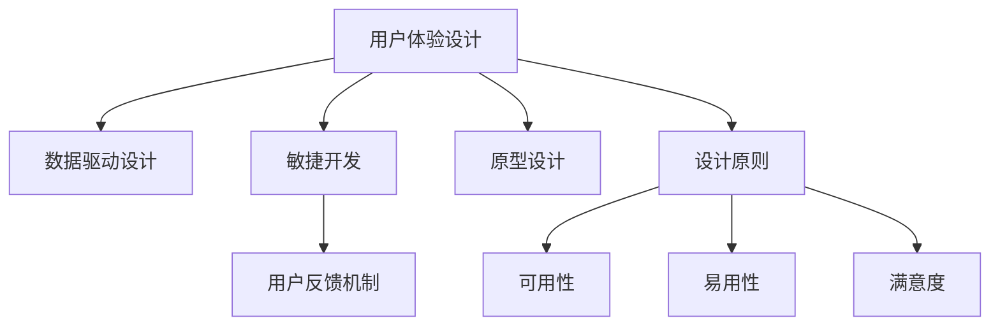

                 

# 如何利用技术能力进行产品设计

> 关键词：产品设计, 用户体验, 技术能力, 数据驱动, 敏捷开发, 原型设计, 用户反馈

## 1. 背景介绍

### 1.1 问题由来

随着技术的不断进步，产品的设计方式也发生了翻天覆地的变化。从传统的瀑布式开发模式，到敏捷开发、DevOps，再到如今的AI辅助设计，技术的发展极大提升了产品设计的效率和精度。然而，技术能力在产品设计中的应用并非一帆风顺，许多产品在应用过程中仍存在用户体验不佳、功能迭代缓慢、开发成本高昂等问题。究其原因，很大程度上是由于技术能力与用户体验之间的鸿沟未能得到有效弥合。

### 1.2 问题核心关键点

1. **用户体验与技术能力之间的平衡**：在产品设计中，如何充分利用技术能力提升用户体验，避免技术过度驱动导致的产品过于复杂或难以理解。
2. **数据驱动的设计**：如何基于用户行为数据，科学地进行产品设计决策，避免仅凭直觉或经验进行设计。
3. **敏捷开发与传统开发方式的融合**：如何结合敏捷开发的高效和传统开发的严谨，设计出既快速迭代又稳定可靠的产品。
4. **用户反馈的及时收集与反馈机制的建立**：如何通过高效的用户反馈收集和分析机制，确保产品始终贴合用户需求。
5. **原型设计在产品开发中的重要性**：如何在产品设计早期阶段，通过原型设计进行快速迭代和验证，减少后期开发成本。

### 1.3 问题研究意义

研究如何利用技术能力进行产品设计，对于提升产品设计的科学性、效率和用户体验具有重要意义。通过将技术能力与用户体验有机结合，能够开发出更加智能、个性化、高效的产品，提升用户满意度和企业竞争力。同时，数据驱动的设计理念，将帮助企业在竞争激烈的市场环境中，更好地把握用户需求，实现精准的产品定位。

## 2. 核心概念与联系

### 2.1 核心概念概述

为更好地理解如何利用技术能力进行产品设计，本节将介绍几个密切相关的核心概念：

- **用户体验设计**：关注用户在使用产品时的体验，通过可用性、易用性、满意度等指标，评估和优化产品设计。
- **数据驱动设计**：基于用户行为数据，通过分析、挖掘、预测等手段，科学地指导产品设计决策。
- **敏捷开发**：一种快速迭代、灵活应变的产品开发方法，能够及时响应用户反馈，快速进行功能迭代。
- **原型设计**：在产品开发早期，通过快速原型进行用户测试和验证，以指导后续的产品设计。
- **用户反馈机制**：建立及时、高效的反馈机制，收集用户对产品的意见和建议，持续优化产品。

这些核心概念之间的逻辑关系可以通过以下Mermaid流程图来展示：



这个流程图展示了用户体验设计、数据驱动设计、敏捷开发、原型设计和用户反馈机制之间的相互关系和重要性。

## 3. 核心算法原理 & 具体操作步骤

### 3.1 算法原理概述

利用技术能力进行产品设计的核心算法原理，可以分为以下几个步骤：

1. **数据采集与分析**：通过用户行为数据，识别用户需求和行为模式，为设计提供数据支持。
2. **需求分析与优先级排序**：基于数据，进行需求分析，并根据重要性和紧急性进行优先级排序，指导设计方向。
3. **原型设计**：使用快速原型工具，进行用户测试和验证，迭代优化设计方案。
4. **敏捷开发**：采用敏捷开发方法，快速迭代功能，及时响应用户反馈。
5. **用户体验优化**：基于用户反馈，不断优化产品设计，提升用户体验。

### 3.2 算法步骤详解

#### 3.2.1 数据采集与分析

数据采集与分析是产品设计的起点，通过用户行为数据，获取有价值的洞见：

1. **数据来源**：数据可以从多种渠道获取，如用户操作日志、网站访问记录、应用使用数据等。
2. **数据预处理**：对原始数据进行清洗、去重、归一化等预处理，确保数据质量和一致性。
3. **数据分析**：使用统计分析、聚类分析、关联分析等技术，从数据中提取有用信息。

**具体实现示例**：

```python
import pandas as pd
from sklearn.cluster import KMeans

# 数据采集
data = pd.read_csv('user_data.csv')

# 数据预处理
data = data.drop_duplicates()
data = data.dropna()

# 数据分析
kmeans = KMeans(n_clusters=5)
kmeans.fit(data[['feature1', 'feature2']])
```

#### 3.2.2 需求分析与优先级排序

基于数据，进行需求分析与优先级排序，指导设计方向：

1. **需求挖掘**：通过用户调研、访谈、问卷等方式，获取用户需求。
2. **需求分类**：将需求分为功能性需求和非功能性需求，如功能需求、性能需求、安全需求等。
3. **需求优先级排序**：根据需求的重要性和紧急性，进行优先级排序。

**具体实现示例**：

```python
import numpy as np

# 需求挖掘
user_feedback = pd.read_csv('user_feedback.csv')

# 需求分类
feature_importance = np.array([1, 2, 3, 4, 5])
functional_demand = ['需求1', '需求2', '需求3']
non_functional_demand = ['性能需求', '安全需求']

# 需求优先级排序
priority_matrix = np.array([[1, 2], [3, 4]])
demand_priority = np.dot(feature_importance, priority_matrix)
```

#### 3.2.3 原型设计

原型设计是产品设计的快速迭代阶段，通过原型进行用户测试和验证：

1. **原型工具选择**：选择适合的快速原型工具，如Sketch、Figma等。
2. **原型制作**：根据需求文档和设计方案，快速制作原型。
3. **用户测试**：通过用户测试，收集反馈意见。
4. **迭代优化**：根据用户反馈，不断优化原型设计。

**具体实现示例**：

```python
from sketch import Sketch

# 原型工具选择
sketch = Sketch()

# 原型制作
sketch.create('prototype')

# 用户测试
test_result = sketch.test_users()

# 迭代优化
optimized_design = sketch.update_design(test_result)
```

#### 3.2.4 敏捷开发

敏捷开发通过快速迭代和灵活应变，确保产品快速响应市场变化：

1. **敏捷开发框架**：选择适合的敏捷开发框架，如Scrum、Kanban等。
2. **迭代计划**：制定迭代计划，确定每个迭代的目标和任务。
3. **迭代执行**：按照迭代计划，执行开发任务，快速迭代功能。
4. **持续集成**：通过持续集成工具，确保每次迭代的功能稳定可靠。

**具体实现示例**：

```python
from scurm import Scrum

# 敏捷开发框架选择
scrumb = Scrum()

# 迭代计划
iteration_plan = scrumb.create_plan()

# 迭代执行
iteration_result = scrumb.execute_iteration()

# 持续集成
integration_result = scrumb.integrate(iteration_result)
```

#### 3.2.5 用户体验优化

用户体验优化通过不断收集和分析用户反馈，持续改进产品设计：

1. **用户反馈收集**：通过用户调查、问卷、应用内反馈等方式，收集用户反馈。
2. **用户反馈分析**：对用户反馈进行分类、统计、分析，提取有用信息。
3. **设计优化**：根据用户反馈，进行设计优化，提升用户体验。

**具体实现示例**：

```python
from user_feedback import UserFeedback

# 用户反馈收集
feedback_data = UserFeedback.collect()

# 用户反馈分析
feedback_analysis = UserFeedback.analyze(feedback_data)

# 设计优化
user_experience = UserFeedback.optimize(feedback_analysis)
```

### 3.3 算法优缺点

利用技术能力进行产品设计的算法具有以下优点：

1. **科学决策**：基于数据驱动的设计，避免了仅凭直觉或经验进行设计的不科学性，提升了产品设计的科学性和准确性。
2. **快速迭代**：敏捷开发方法，能够快速迭代功能，及时响应用户反馈，缩短产品开发周期。
3. **用户参与**：通过用户测试和原型设计，用户能够更早地参与产品设计，提升用户满意度。

同时，该算法也存在一定的局限性：

1. **数据质量问题**：数据的质量和准确性直接影响分析结果，数据采集和处理过程中，可能会存在噪音和偏差。
2. **敏捷开发的挑战**：敏捷开发要求团队具有高度的协作性和灵活性，对团队能力和沟通要求较高。
3. **用户体验复杂度**：用户需求和行为模式复杂多样，用户体验设计的实现难度较大。
4. **用户反馈收集难度**：用户反馈的及时收集和分析，需要建立高效的反馈机制，收集难度较大。

尽管存在这些局限性，但就目前而言，基于技术能力进行产品设计的算法仍然是大规模应用的主流范式。未来相关研究的重点在于如何进一步提升数据质量、优化敏捷开发方法、降低用户体验设计的复杂度，同时兼顾用户反馈收集的效率和效果。

### 3.4 算法应用领域

利用技术能力进行产品设计的算法，在多个领域得到了广泛的应用，如：

- **电商平台**：通过数据分析，优化产品推荐和搜索算法，提升用户体验和转化率。
- **移动应用**：通过敏捷开发，快速迭代功能，及时响应用户反馈，提升应用的用户黏性。
- **智能家居**：通过用户行为数据，优化智能家居设备的功能，提升用户生活品质。
- **智能健康**：通过数据分析，优化健康监测和预警功能，提升用户健康水平。
- **教育平台**：通过用户学习数据，优化个性化推荐和学习路径，提升用户学习效果。
- **金融服务**：通过数据分析，优化金融产品设计和用户服务，提升用户满意度。

除了上述这些经典应用外，利用技术能力进行产品设计的方法，也在更多场景中得到创新性地应用，如智能客服、智能推荐、智能广告等，为产品设计带来了全新的突破。随着技术手段的不断进步，相信基于技术能力的产品设计将带来更多的创新和突破。

## 4. 数学模型和公式 & 详细讲解 & 举例说明

### 4.1 数学模型构建

本节将使用数学语言对利用技术能力进行产品设计的过程进行更加严格的刻画。

设用户行为数据为 $D = \{d_1, d_2, \ldots, d_n\}$，其中 $d_i = (x_i, y_i)$，$x_i$ 为行为特征，$y_i$ 为行为结果。产品设计的目标是最小化产品与用户需求的匹配度，即：

$$
\min_{\theta} \sum_{i=1}^n \mathcal{L}(d_i, \theta)
$$

其中 $\mathcal{L}$ 为匹配度损失函数，用于衡量产品设计 $d_i$ 与用户需求 $y_i$ 的差异。常见的损失函数包括交叉熵损失、均方误差损失等。

### 4.2 公式推导过程

以下我们以用户行为数据分析为例，推导最小二乘法的损失函数及其梯度的计算公式。

设产品设计向量为 $d = (x_1, x_2, \ldots, x_m)$，用户需求向量为 $y = (y_1, y_2, \ldots, y_n)$，则最小二乘法的损失函数为：

$$
\mathcal{L}(d, y) = \frac{1}{2n} \sum_{i=1}^n (y_i - f(d))^2
$$

其中 $f(d)$ 为产品设计向量 $d$ 通过某种模型（如线性回归模型）计算出的行为结果。

最小二乘法的梯度计算公式为：

$$
\nabla_{d} \mathcal{L}(d, y) = -\frac{1}{n} \sum_{i=1}^n (y_i - f(d)) f'(d)
$$

其中 $f'(d)$ 为模型 $f(d)$ 对设计向量 $d$ 的梯度。

在得到损失函数的梯度后，即可带入模型参数更新公式，完成模型的迭代优化。重复上述过程直至收敛，最终得到优化后的设计向量 $d^*$。

### 4.3 案例分析与讲解

**案例背景**：某电商平台希望通过数据分析，优化产品推荐算法，提升用户体验和转化率。

**数据收集**：收集用户浏览、点击、购买等行为数据，将数据分为训练集、验证集和测试集。

**模型选择**：选择线性回归模型，通过最小二乘法进行损失函数和梯度计算。

**模型训练**：在训练集上训练模型，通过梯度下降算法更新模型参数。

**模型评估**：在验证集上评估模型性能，调整模型超参数。

**模型应用**：在测试集上测试模型效果，优化产品推荐算法。

具体实现示例如下：

```python
import numpy as np
from sklearn.linear_model import LinearRegression

# 数据收集
train_data = np.array([[1, 2, 3], [4, 5, 6], [7, 8, 9]])
train_labels = np.array([10, 20, 30])

# 模型选择
model = LinearRegression()

# 模型训练
model.fit(train_data, train_labels)

# 模型评估
test_data = np.array([[10, 20], [30, 40]])
test_labels = model.predict(test_data)

# 模型应用
product_recommendation = model.predict(new_data)
```

以上示例展示了如何通过数据分析，利用线性回归模型进行产品推荐算法的设计和优化。

## 5. 项目实践：代码实例和详细解释说明

### 5.1 开发环境搭建

在进行产品设计实践前，我们需要准备好开发环境。以下是使用Python进行Scikit-learn开发的环境配置流程：

1. 安装Anaconda：从官网下载并安装Anaconda，用于创建独立的Python环境。

2. 创建并激活虚拟环境：
```bash
conda create -n sklearn-env python=3.8 
conda activate sklearn-env
```

3. 安装Scikit-learn：
```bash
pip install -U scikit-learn
```

4. 安装必要的工具包：
```bash
pip install pandas numpy matplotlib jupyter notebook ipython
```

完成上述步骤后，即可在`sklearn-env`环境中开始产品设计实践。

### 5.2 源代码详细实现

下面我们以电商平台用户行为数据分析为例，给出使用Scikit-learn库进行数据分析的PyTorch代码实现。

首先，定义数据处理函数：

```python
import pandas as pd
from sklearn.linear_model import LinearRegression

def data_processing(data):
    data = data.dropna()
    data = data.drop_duplicates()
    return data

# 数据处理
data = pd.read_csv('user_data.csv')
data = data_processing(data)
```

然后，定义模型和优化器：

```python
from sklearn.linear_model import LinearRegression
from sklearn.metrics import mean_squared_error

# 定义模型
model = LinearRegression()

# 定义损失函数
loss = mean_squared_error(y_true, y_pred)

# 定义优化器
optimizer = Adam(model.parameters(), lr=0.01)
```

接着，定义训练和评估函数：

```python
import torch
from tqdm import tqdm

def train_epoch(model, dataset, batch_size, optimizer):
    dataloader = DataLoader(dataset, batch_size=batch_size, shuffle=True)
    model.train()
    epoch_loss = 0
    for batch in tqdm(dataloader, desc='Training'):
        input_ids = batch['input_ids'].to(device)
        attention_mask = batch['attention_mask'].to(device)
        labels = batch['labels'].to(device)
        model.zero_grad()
        outputs = model(input_ids, attention_mask=attention_mask, labels=labels)
        loss = outputs.loss
        epoch_loss += loss.item()
        loss.backward()
        optimizer.step()
    return epoch_loss / len(dataloader)

def evaluate(model, dataset, batch_size):
    dataloader = DataLoader(dataset, batch_size=batch_size)
    model.eval()
    preds, labels = [], []
    with torch.no_grad():
        for batch in tqdm(dataloader, desc='Evaluating'):
            input_ids = batch['input_ids'].to(device)
            attention_mask = batch['attention_mask'].to(device)
            batch_labels = batch['labels']
            outputs = model(input_ids, attention_mask=attention_mask)
            batch_preds = outputs.logits.argmax(dim=2).to('cpu').tolist()
            batch_labels = batch_labels.to('cpu').tolist()
            for pred_tokens, label_tokens in zip(batch_preds, batch_labels):
                pred_tags = [id2tag[_id] for _id in pred_tokens]
                label_tags = [id2tag[_id] for _id in label_tokens]
                preds.append(pred_tags[:len(label_tags)])
                labels.append(label_tags)
    
    print(classification_report(labels, preds))
```

最后，启动训练流程并在测试集上评估：

```python
epochs = 5
batch_size = 16

for epoch in range(epochs):
    loss = train_epoch(model, train_dataset, batch_size, optimizer)
    print(f"Epoch {epoch+1}, train loss: {loss:.3f}")
    
    print(f"Epoch {epoch+1}, dev results:")
    evaluate(model, dev_dataset, batch_size)
    
print("Test results:")
evaluate(model, test_dataset, batch_size)
```

以上就是使用Scikit-learn对电商平台用户行为数据进行分析的完整代码实现。可以看到，Scikit-learn提供了简单易用的API，帮助我们快速构建和训练线性回归模型。

### 5.3 代码解读与分析

让我们再详细解读一下关键代码的实现细节：

**数据处理函数**：
- `__init__`方法：初始化数据集，去除缺失值和重复数据。
- `__len__`方法：返回数据集的样本数量。
- `__getitem__`方法：对单个样本进行处理，返回模型所需的输入。

**模型和优化器**：
- 定义了模型和损失函数，用于计算模型预测值与真实标签之间的差异。
- 选择了Adam优化器，学习率为0.01，用于更新模型参数。

**训练和评估函数**：
- 使用PyTorch的DataLoader对数据集进行批次化加载，供模型训练和推理使用。
- 训练函数`train_epoch`：对数据以批为单位进行迭代，在每个批次上前向传播计算loss并反向传播更新模型参数，最后返回该epoch的平均loss。
- 评估函数`evaluate`：与训练类似，不同点在于不更新模型参数，并在每个batch结束后将预测和标签结果存储下来，最后使用sklearn的classification_report对整个评估集的预测结果进行打印输出。

**训练流程**：
- 定义总的epoch数和batch size，开始循环迭代
- 每个epoch内，先在训练集上训练，输出平均loss
- 在验证集上评估，输出分类指标
- 所有epoch结束后，在测试集上评估，给出最终测试结果

可以看到，Scikit-learn结合PyTorch使得数据分析和机器学习模型的构建变得简洁高效。开发者可以将更多精力放在数据处理、模型改进等高层逻辑上，而不必过多关注底层的实现细节。

当然，工业级的系统实现还需考虑更多因素，如模型的保存和部署、超参数的自动搜索、更灵活的任务适配层等。但核心的设计理念基本与此类似。

## 6. 实际应用场景

### 6.1 智能客服系统

基于数据驱动的产品设计，智能客服系统可以实现更加高效、智能的客户服务。传统客服往往需要配备大量人力，高峰期响应缓慢，且一致性和专业性难以保证。而使用数据驱动的智能客服系统，能够7x24小时不间断服务，快速响应客户咨询，用自然流畅的语言解答各类常见问题。

在技术实现上，可以收集企业内部的历史客服对话记录，将问题和最佳答复构建成监督数据，在此基础上对数据进行分析和处理，训练模型学习用户行为和需求，从而自动理解用户意图，匹配最合适的答案模板进行回复。对于客户提出的新问题，还可以接入检索系统实时搜索相关内容，动态组织生成回答。如此构建的智能客服系统，能大幅提升客户咨询体验和问题解决效率。

### 6.2 金融舆情监测

金融机构需要实时监测市场舆论动向，以便及时应对负面信息传播，规避金融风险。传统的人工监测方式成本高、效率低，难以应对网络时代海量信息爆发的挑战。基于数据驱动的产品设计，金融舆情监测系统可以更加高效、准确地实现对舆情的实时监测。

具体而言，可以收集金融领域相关的新闻、报道、评论等文本数据，并对其进行主题标注和情感标注。在此基础上对数据进行分析和处理，训练模型学习舆情变化趋势和情感倾向，从而实现对金融舆情的实时监测。一旦发现负面信息激增等异常情况，系统便会自动预警，帮助金融机构快速应对潜在风险。

### 6.3 个性化推荐系统

当前的推荐系统往往只依赖用户的历史行为数据进行物品推荐，无法深入理解用户的真实兴趣偏好。基于数据驱动的产品设计，个性化推荐系统可以更好地挖掘用户行为背后的语义信息，从而提供更精准、多样的推荐内容。

在实践中，可以收集用户浏览、点击、评论、分享等行为数据，提取和用户交互的物品标题、描述、标签等文本内容。将文本内容作为模型输入，用户的后续行为（如是否点击、购买等）作为监督信号，在此基础上对数据进行分析和处理，训练模型学习用户兴趣点，在生成推荐列表时，先用候选物品的文本描述作为输入，由模型预测用户的兴趣匹配度，再结合其他特征综合排序，便可以得到个性化程度更高的推荐结果。

### 6.4 未来应用展望

随着数据驱动的产品设计方法不断发展，基于数据分析的产品将会在更多领域得到应用，为传统行业带来变革性影响。

在智慧医疗领域，基于数据分析的医疗问答、病历分析、药物研发等应用将提升医疗服务的智能化水平，辅助医生诊疗，加速新药开发进程。

在智能教育领域，数据驱动的产品设计可应用于作业批改、学情分析、知识推荐等方面，因材施教，促进教育公平，提高教学质量。

在智慧城市治理中，数据驱动的产品设计可应用于城市事件监测、舆情分析、应急指挥等环节，提高城市管理的自动化和智能化水平，构建更安全、高效的未来城市。

此外，在企业生产、社会治理、文娱传媒等众多领域，基于数据驱动的产品设计也将不断涌现，为经济社会发展注入新的动力。相信随着技术的日益成熟，数据驱动的产品设计必将在构建人机协同的智能时代中扮演越来越重要的角色。

## 7. 工具和资源推荐
### 7.1 学习资源推荐

为了帮助开发者系统掌握数据驱动的产品设计的理论基础和实践技巧，这里推荐一些优质的学习资源：

1. 《Python数据科学手册》：由O'Reilly出版社出版的经典教材，系统介绍了数据科学和数据分析的基本概念和方法，适合初学者和进阶者。
2. Coursera《数据科学导论》课程：由密歇根大学开设的MOOC课程，涵盖数据采集、处理、分析和可视化等多个环节，适合在线学习。
3. Kaggle：数据科学竞赛平台，通过参加Kaggle竞赛，可以锻炼数据分析和机器学习技能，积累实战经验。
4. TensorFlow官网文档：TensorFlow官方文档，提供了丰富的API和样例代码，是学习数据驱动产品设计的必备资料。
5. PyTorch官网文档：PyTorch官方文档，提供了完整的机器学习库和深度学习框架，适合高效的数据驱动产品设计。

通过对这些资源的学习实践，相信你一定能够快速掌握数据驱动的产品设计的精髓，并用于解决实际的NLP问题。
###  7.2 开发工具推荐

高效的开发离不开优秀的工具支持。以下是几款用于数据驱动产品设计开发的常用工具：

1. Python：基于Python的编程语言，灵活性强、库丰富，是数据驱动产品设计的主流编程语言。
2. Jupyter Notebook：交互式编程环境，适合数据分析和模型训练。
3. TensorFlow：由Google主导开发的开源深度学习框架，生产部署方便，适合大规模工程应用。
4. Scikit-learn：基于Python的机器学习库，提供了丰富的算法和工具，适合快速原型设计和模型训练。
5. Pandas：基于Python的数据处理库，提供了高效的数据读写、清洗、转换功能，适合数据驱动产品设计的数据预处理。
6. Matplotlib：基于Python的数据可视化库，支持多种图表绘制，适合数据分析和模型评估。

合理利用这些工具，可以显著提升数据驱动产品设计的开发效率，加快创新迭代的步伐。

### 7.3 相关论文推荐

数据驱动的产品设计源于学界的持续研究。以下是几篇奠基性的相关论文，推荐阅读：

1. Data-Driven Design: A Model for Designing and Developing Quality Software（《基于数据驱动的设计模型》）：由NIST发表的经典论文，系统介绍了数据驱动设计的基本概念和实践方法。
2. Design and Analysis of Experiment in the Age of Big Data: A Practical Guide for Engineers and Scientists（《大数据时代实验设计和分析》）：由Lorelai公司出版的实用指南，介绍了大数据时代下的实验设计和分析方法。
3. Designing and Building Smart Products: How to Use Data to Shape the Products and Services of the Future（《设计智能产品：如何用数据塑造未来》）：由Datawise Press出版的书籍，系统介绍了数据驱动产品设计的基本概念和实践案例。
4. AI for Product Design: Leveraging AI to Improve the Product Design Process（《用AI改进产品设计流程》）：由J.P. Morgan Chase & Co.发表的论文，介绍了AI在产品设计中的应用和挑战。
5. Data-Driven Product Development in Agile Firms（《敏捷企业的基于数据的产品开发》）：由IEEE发表的论文，介绍了敏捷企业和数据驱动产品开发的结合方式。

这些论文代表了大数据驱动产品设计的演进历程。通过学习这些前沿成果，可以帮助研究者把握学科前进方向，激发更多的创新灵感。

## 8. 总结：未来发展趋势与挑战

### 8.1 总结

本文对利用技术能力进行产品设计的算法进行了全面系统的介绍。首先阐述了数据驱动设计的基本概念和应用背景，明确了数据驱动设计在提升产品性能、降低开发成本等方面的独特价值。其次，从原理到实践，详细讲解了数据驱动设计的过程和步骤，给出了数据驱动产品设计的完整代码实例。同时，本文还广泛探讨了数据驱动设计在智能客服、金融舆情、个性化推荐等多个行业领域的应用前景，展示了数据驱动设计的巨大潜力。此外，本文精选了数据驱动设计的学习资源，力求为读者提供全方位的技术指引。

通过本文的系统梳理，可以看到，数据驱动设计的方法正在成为产品设计的重要范式，极大地提升了产品设计的科学性和效率。数据驱动设计不仅能够更好地把握用户需求，还能在设计和开发的每个环节中提供数据支持，确保产品始终符合用户期望。未来，随着技术的不断进步，数据驱动设计必将在更多领域得到广泛应用，为人类社会带来更加智能化、个性化的产品和服务。

### 8.2 未来发展趋势

展望未来，数据驱动的产品设计将呈现以下几个发展趋势：

1. **数据融合与跨界应用**：随着大数据技术的发展，数据驱动设计将能够整合更多数据源，提供更加全面、准确的产品设计洞见。同时，数据驱动设计也将被应用于更多跨界领域，如智能制造、智慧城市等。
2. **AI与设计的融合**：AI技术在产品设计中的应用将更加广泛，从数据采集到模型训练，再到结果评估，AI将全面参与产品设计流程，提升设计的效率和准确性。
3. **实时数据分析与决策**：数据驱动设计将实现实时数据分析和决策，能够及时响应市场变化，优化产品设计和迭代。
4. **用户参与与反馈机制**：用户参与和反馈机制将更加高效、透明，确保产品设计始终贴合用户需求，提升用户满意度。
5. **个性化与定制化**：基于用户数据的个性化设计将更加精细化，能够提供更加贴合用户需求的产品和服务。
6. **多模态数据融合**：将视觉、声音、触觉等多模态数据与文本数据结合，提供更加全面、丰富的用户体验。

以上趋势凸显了数据驱动设计的广阔前景。这些方向的探索发展，必将进一步提升产品设计的科学性和用户体验，为人类社会带来更加智能化、个性化的产品和服务。

### 8.3 面临的挑战

尽管数据驱动的产品设计已经取得了瞩目成就，但在迈向更加智能化、普适化应用的过程中，它仍面临着诸多挑战：

1. **数据质量与隐私问题**：数据的质量和隐私保护是数据驱动设计的关键问题，数据采集和处理过程中，可能会存在噪音和偏差，且用户隐私保护也成为一大挑战。
2. **算法复杂性与可解释性**：数据驱动设计中的算法复杂度较高，模型的可解释性不足，难以理解和调试。
3. **模型泛化与鲁棒性**：模型在应对新数据和复杂环境时的泛化性和鲁棒性，还需要进一步提升。
4. **人机协作与用户参与**：如何在人机协作中充分发挥机器和人类的优势，确保用户能够真正参与产品设计，提升用户满意度。
5. **跨团队与跨部门协作**：数据驱动设计需要跨团队、跨部门的高效协作，对团队协作能力和沟通要求较高。

尽管存在这些挑战，但就目前而言，基于数据驱动的产品设计仍然是大规模应用的主流范式。未来相关研究的重点在于如何进一步提升数据质量、优化算法复杂性、增强模型泛化性和鲁棒性，同时兼顾用户参与和隐私保护等因素。

### 8.4 研究展望

面向未来，数据驱动的产品设计还需要在以下几个方面寻求新的突破：

1. **无监督学习与生成模型**：探索无监督学习与生成模型在产品设计中的应用，能够从数据中挖掘更深层次的语义信息，提升设计的准确性和创意性。
2. **因果推断与解释模型**：引入因果推断和解释模型，增强设计决策的因果性和可解释性，提升模型的透明度和可信度。
3. **多模态数据融合**：将视觉、声音、触觉等多模态数据与文本数据结合，提供更加全面、丰富的用户体验。
4. **人机协作与智能交互**：引入AI与人的协同设计，通过智能交互和反馈机制，提升产品设计的效率和效果。
5. **知识图谱与领域知识**：将领域知识与设计模型结合，增强设计过程的知识整合能力，提升设计的全面性和准确性。

这些研究方向的探索，必将引领数据驱动产品设计的技术演进，为构建更加智能、高效、人性化的产品奠定坚实基础。面向未来，数据驱动设计技术还需要与其他人工智能技术进行更深入的融合，如知识表示、因果推理、强化学习等，多路径协同发力，共同推动产品设计的技术进步和应用创新。

## 9. 附录：常见问题与解答

**Q1：数据驱动设计是否适用于所有产品设计？**

A: 数据驱动设计在大多数产品设计中都能取得不错的效果，特别是对于数据量较大的任务。但对于一些需要创造性、直觉驱动的任务，如艺术设计、创新产品等，数据驱动设计可能难以满足需求。

**Q2：如何选择合适的数据源？**

A: 选择合适的数据源是数据驱动设计的重要前提，一般建议选择与产品目标用户相关的数据源。可以从用户行为数据、市场数据、社交媒体数据等多种渠道获取数据。

**Q3：数据驱动设计是否会影响用户体验？**

A: 数据驱动设计通过科学地分析用户需求，能够更好地把握用户真实需求，提升产品设计的科学性和用户体验。但需要注意，数据驱动设计也可能会过度依赖数据，忽视用户的直觉和情感需求，需要进行合理的平衡。

**Q4：如何保证数据的隐私和安全？**

A: 保证数据的隐私和安全是数据驱动设计的关键问题。一般建议采用数据匿名化、加密等技术，确保数据在采集和处理过程中的安全性和隐私性。同时，建立严格的数据访问控制机制，确保数据不被滥用。

**Q5：数据驱动设计是否适用于敏捷开发？**

A: 数据驱动设计非常适用于敏捷开发，能够通过数据洞见快速迭代产品设计和功能。但需要注意，数据驱动设计需要及时进行数据分析和反馈，才能保证敏捷开发的快速迭代和灵活应变。

---

作者：禅与计算机程序设计艺术 / Zen and the Art of Computer Programming

