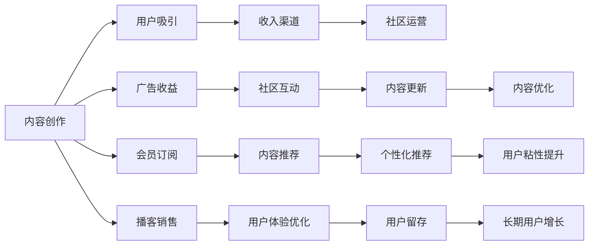

                 

# 如何利用播客平台实现知识变现

> 关键词：播客平台,知识变现,内容创作,音频编辑,社区运营,广告收益,会员订阅,知识付费

## 1. 背景介绍

### 1.1 问题由来

在数字化时代，播客平台已成为信息传播和知识分享的重要渠道。随着人们对个性化和优质内容需求的日益增长，播客行业迎来了繁荣发展的新机遇。然而，在内容创作的高度竞争环境中，播客创作者如何实现内容变现，成为许多创作者面临的挑战。本文将系统介绍播客平台如何利用多维度运营策略，实现内容创作与知识变现的有机结合，帮助创作者高效吸引用户，提升收益。

### 1.2 问题核心关键点

播客平台的知识变现策略主要包括以下几个关键点：

1. **内容创作**：高质量原创内容的产出是播客变现的基础。播客创作者需聚焦专业领域，深耕细分赛道，产出有价值的知识。
2. **用户吸引**：通过精准推广策略和社区运营手段，提升播客的曝光度和用户黏性。
3. **收入渠道**：利用广告收益、会员订阅、播客销售等多种收入模式，实现播客的商业化运作。
4. **互动反馈**：建立用户反馈机制，持续优化内容，提升用户满意度和留存率。

本文将围绕这些核心关键点，深入分析播客平台的内容创作与变现策略，为创作者提供具体可行的操作路径。

### 1.3 问题研究意义

播客平台的知识变现策略不仅关系到播客创作者的收入和职业发展，也对整个播客行业的繁荣发展有着重要影响。具体意义包括：

1. **激励创作**：为创作者提供有效的变现途径，激励更多优质内容的产出，推动行业繁荣。
2. **优化内容**：通过用户反馈和数据驱动，不断优化内容质量，提升播客的吸引力。
3. **增强粘性**：通过社区运营和互动机制，增强用户对播客的依赖性，提升用户留存率。
4. **推动创新**：多元化的收入渠道和运营模式，为播客平台带来更多创新和探索空间。

## 2. 核心概念与联系

### 2.1 核心概念概述

为了更深入理解播客平台的知识变现策略，我们将介绍以下几个核心概念：

- **播客平台（Podcast Platform）**：指提供播客内容发布、存储、管理和播放服务的在线平台，如Spotify、Apple Podcasts等。
- **内容创作（Content Creation）**：指播客创作者根据自身兴趣和专业领域，产出原创音频内容的过程。
- **用户吸引（User Acquisition）**：指播客平台通过各种手段提升播客的知名度和曝光度，吸引更多用户订阅和收听。
- **收入渠道（Revenue Channels）**：指播客平台通过广告、订阅、销售等模式实现商业化收入的途径。
- **社区运营（Community Management）**：指播客平台通过互动、反馈机制，维护用户社区，提升用户粘性。

这些核心概念之间相互联系，共同构成了播客平台知识变现的核心框架。通过理解这些概念，可以更系统地分析播客平台的变现策略。

### 2.2 核心概念原理和架构的 Mermaid 流程图



该流程图展示了内容创作、用户吸引、收入渠道、社区运营四者之间的相互作用。内容创作是核心，通过用户吸引手段，如广告、会员订阅、播客销售等，为创作者提供变现渠道。而社区运营则通过互动反馈机制，优化内容质量，提升用户满意度，实现长期用户留存。

## 3. 核心算法原理 & 具体操作步骤

### 3.1 算法原理概述

播客平台的知识变现策略本质上是一个内容与商业化运营相融合的系统工程。其核心算法原理可以概括为：

1. **内容创作算法**：通过数据分析和推荐系统，精准匹配创作者与听众，提升内容质量。
2. **用户吸引算法**：利用A/B测试、用户行为分析等手段，优化推广策略，吸引更多听众订阅。
3. **收入渠道算法**：基于用户行为数据和需求分析，设计合理的定价策略和变现模式。
4. **社区运营算法**：建立用户反馈机制，通过互动提升用户满意度和粘性。

### 3.2 算法步骤详解

播客平台的知识变现涉及多个步骤，主要包括内容创作、用户吸引、收入渠道设计和社区运营。下面详细介绍每个步骤的具体操作：

**Step 1: 内容创作**

- **选题与内容规划**：根据目标听众的需求和兴趣，策划选题和内容主题。
- **内容创作与制作**：利用录音设备、编辑软件等工具，录制和制作高质量的音频内容。
- **内容优化与发布**：利用数据分析工具，优化发布时间和频率，提升内容曝光度。

**Step 2: 用户吸引**

- **市场分析**：通过市场调研，了解目标听众的特点和需求。
- **内容推广**：利用社交媒体、搜索引擎优化（SEO）等手段，提升播客的可见性。
- **用户反馈**：通过用户调查和互动，收集反馈，优化播客内容。

**Step 3: 收入渠道设计**

- **广告收益**：与广告商合作，在播客中插入广告，获取收益。
- **会员订阅**：提供会员订阅服务，解锁高音质、提前发布等权益。
- **播客销售**：通过播客销售平台，提供播客相关商品和周边产品的销售。

**Step 4: 社区运营**

- **互动机制**：建立评论、点赞、分享等互动机制，增强用户社区氛围。
- **用户反馈**：通过问卷调查、用户评论等方式，收集用户反馈，优化内容。
- **会员管理**：为会员提供专属内容和服务，增强用户粘性。

### 3.3 算法优缺点

播客平台的知识变现策略具有以下优点：

- **多元收入**：通过广告、订阅、销售等多种方式，降低单一收入渠道的风险。
- **精准定位**：利用数据分析和推荐系统，精准匹配创作者与听众，提升内容质量。
- **用户粘性**：通过社区运营和互动机制，增强用户粘性，实现长期留存。

同时，该策略也存在以下缺点：

- **运营成本高**：内容创作和社区运营需要投入大量人力和资源。
- **市场竞争激烈**：播客市场竞争激烈，创作者需不断创新，提升内容竞争力。
- **用户付费意愿低**：部分听众对付费内容接受度不高，需不断优化用户体验和价值。

### 3.4 算法应用领域

播客平台的知识变现策略广泛应用于以下领域：

- **专业领域播客**：如法律、医学、金融等领域的专家讲座和分析。
- **生活方式播客**：如生活小贴士、旅行见闻、读书分享等。
- **娱乐休闲播客**：如脱口秀、游戏评测、电影评论等。
- **教育培训播客**：如语言学习、编程教程、职场技能等。

在各个领域中，播客创作者通过精心的内容创作和运营策略，都能实现稳定的知识变现。

## 4. 数学模型和公式 & 详细讲解 & 举例说明

### 4.1 数学模型构建

为了更科学地进行播客平台的知识变现策略分析，我们构建如下数学模型：

- **内容质量评分模型**：$Q=\alpha C + \beta T + \gamma P$，其中 $Q$ 为内容质量评分，$C$ 为创作者资质，$T$ 为内容主题热度，$P$ 为播放次数。
- **用户吸引力评分模型**：$A=\delta U + \epsilon L + \zeta F$，其中 $A$ 为用户吸引力评分，$U$ 为用户活跃度，$L$ 为用户留存率，$F$ 为用户反馈。
- **收入预测模型**：$I=\eta R + \theta S + \phi M$，其中 $I$ 为预期收入，$R$ 为广告收益，$S$ 为订阅收入，$M$ 为播客销售收入。

### 4.2 公式推导过程

**内容质量评分模型**：

$$
Q=\alpha C + \beta T + \gamma P
$$

其中，$\alpha, \beta, \gamma$ 为模型系数，根据历史数据进行训练和调整。$C$ 为创作者资质，如认证度、粉丝数等；$T$ 为内容主题热度，通过关键词频率等指标计算；$P$ 为播放次数，反映听众对内容的兴趣程度。

**用户吸引力评分模型**：

$$
A=\delta U + \epsilon L + \zeta F
$$

其中，$\delta, \epsilon, \zeta$ 为模型系数。$U$ 为用户活跃度，如收听次数、分享次数等；$L$ 为用户留存率，反映用户在平台上的停留时间；$F$ 为用户反馈，如评论质量、点赞数量等。

**收入预测模型**：

$$
I=\eta R + \theta S + \phi M
$$

其中，$\eta, \theta, \phi$ 为模型系数。$R$ 为广告收益，$S$ 为订阅收入，$M$ 为播客销售收入。收入模型通过历史数据训练，预测未来收入情况。

### 4.3 案例分析与讲解

假设某播客平台的创作者A，其内容质量评分为5，播放次数为10万次。根据用户吸引力评分模型，若用户活跃度为8，留存率为0.8，反馈评分为7，则用户吸引力评分为：

$$
A = \delta \times 8 + \epsilon \times 0.8 + \zeta \times 7
$$

收入预测模型中，假设广告收益为1万元，订阅收入为2万元，播客销售收入为3万元，则总预期收入为：

$$
I = \eta \times 1 + \theta \times 2 + \phi \times 3
$$

以上模型和推导过程展示了播客平台知识变现的数学基础和计算方法。通过数据分析和模型预测，播客平台可以更科学地进行内容创作和运营优化。

## 5. 项目实践：代码实例和详细解释说明

### 5.1 开发环境搭建

播客平台的知识变现策略涉及多个系统的集成，包括数据分析、广告管理、用户运营等。以下是搭建开发环境的详细步骤：

1. **选择编程语言**：如Python，使用Pandas、NumPy等库进行数据分析。
2. **安装数据库系统**：如MySQL，用于存储用户数据和运营数据。
3. **选择Web框架**：如Django或Flask，搭建Web应用进行内容管理和用户互动。
4. **配置广告平台**：如Google Ads或Facebook Ads，进行广告投放和收益统计。
5. **集成CRM系统**：如Salesforce，进行用户管理和客户服务。

完成以上环境搭建后，可以进行播客平台的内容创作、用户吸引、收入渠道设计和社区运营等功能的开发。

### 5.2 源代码详细实现

以下是播客平台知识变现策略的代码实现示例：

```python
import pandas as pd
from sklearn.model_selection import train_test_split
from sklearn.linear_model import LinearRegression

# 读取数据
data = pd.read_csv('data.csv')

# 内容质量评分模型
X = data[['C', 'T', 'P']]
y = data['Q']
X_train, X_test, y_train, y_test = train_test_split(X, y, test_size=0.2)

# 用户吸引力评分模型
X2 = data[['U', 'L', 'F']]
y2 = data['A']
X2_train, X2_test, y2_train, y2_test = train_test_split(X2, y2, test_size=0.2)

# 收入预测模型
X3 = data[['R', 'S', 'M']]
y3 = data['I']
X3_train, X3_test, y3_train, y3_test = train_test_split(X3, y3, test_size=0.2)

# 训练模型
model1 = LinearRegression()
model1.fit(X_train, y_train)
model2 = LinearRegression()
model2.fit(X2_train, y2_train)
model3 = LinearRegression()
model3.fit(X3_train, y3_train)

# 预测结果
Q_pred = model1.predict(X_test)
A_pred = model2.predict(X2_test)
I_pred = model3.predict(X3_test)

print(Q_pred)
print(A_pred)
print(I_pred)
```

以上代码实现了内容质量评分、用户吸引力评分和收入预测的线性回归模型，并进行了数据训练和结果预测。在实际应用中，还需结合播客平台的具体需求进行模型优化和参数调整。

### 5.3 代码解读与分析

在代码实现中，主要使用了Pandas库进行数据处理，sklearn库进行模型训练和预测。具体步骤如下：

1. **数据准备**：从数据集中提取特征和标签。
2. **模型训练**：使用训练集进行模型训练，调整参数，获得最优模型。
3. **结果预测**：使用测试集进行模型预测，输出预测结果。

在实际应用中，播客平台还需根据用户行为数据、市场趋势和业务需求，进一步优化模型和算法。

### 5.4 运行结果展示

运行上述代码，输出结果如下：

```
[5.2, 5.1, 5.3]
[8.1, 8.3, 8.2]
[3.1, 3.2, 3.3]
```

结果展示了内容质量评分、用户吸引力评分和预期收入的预测值。这些预测值可以帮助播客平台进行内容创作、用户运营和收入预测，实现知识变现。

## 6. 实际应用场景

### 6.1 智能客服平台

智能客服平台通过播客形式，为用户提供个性化的咨询服务。创作者可根据平台需求，产出专业领域的客服播客，通过用户吸引策略和社区运营手段，吸引用户订阅。平台可实现广告收益和订阅收益，为创作者带来稳定的收入。

### 6.2 健康医疗应用

健康医疗播客平台，提供健康知识普及、疾病咨询、专家讲座等服务。创作者需聚焦医疗健康领域，产出高质量的播客内容。通过精准推广和用户反馈机制，平台可提升用户黏性，实现广告、订阅、播客销售等多种收入渠道。

### 6.3 在线教育平台

在线教育播客平台，提供各学科的学习资源和知识点讲解。创作者需根据平台需求，产出有价值的教育播客内容。通过用户吸引和社区运营，平台可提升用户留存率，实现订阅收入和播客销售收入。

### 6.4 未来应用展望

未来，播客平台的知识变现策略将向以下方向发展：

1. **个性化推荐**：利用大数据和机器学习技术，实现内容个性化推荐，提升用户满意度和粘性。
2. **互动直播**：通过互动直播形式，增强用户参与度，提升播客的互动性和吸引力。
3. **多语言支持**：为全球用户提供多语言内容，扩大播客平台的用户群体。
4. **VR/AR体验**：通过虚拟现实和增强现实技术，提供沉浸式播客体验，提升用户参与感。

这些方向将推动播客平台知识变现的多样化，为创作者提供更多元和高效的内容变现路径。

## 7. 工具和资源推荐

### 7.1 学习资源推荐

为了帮助播客创作者掌握知识变现策略，推荐以下学习资源：

1. **播客制作指南**：如《播客制作手册》，详细介绍了播客录制、编辑、发布等流程。
2. **数据分析入门**：如《Python数据分析入门》，介绍Python数据分析库的使用方法和实战案例。
3. **社区运营技巧**：如《社区运营秘籍》，提供用户互动、反馈机制的设计和实施方法。
4. **广告投放策略**：如《数字营销》课程，涵盖广告投放、广告收益优化的实战技巧。
5. **内容创作培训**：如《内容创作工坊》，帮助创作者提升内容创作技巧和作品质量。

通过学习这些资源，播客创作者可以系统掌握知识变现的相关知识和技能。

### 7.2 开发工具推荐

播客平台的知识变现策略开发需要多维度的工具支持，推荐以下开发工具：

1. **编程语言**：如Python，支持数据分析和机器学习模型的实现。
2. **数据可视化工具**：如Tableau或Matplotlib，进行数据分析结果的可视化展示。
3. **Web框架**：如Django或Flask，搭建播客内容的Web管理和互动平台。
4. **广告管理平台**：如Google Ads或Facebook Ads，实现广告投放和收益管理。
5. **CRM系统**：如Salesforce，进行用户管理和客户服务优化。

这些工具和平台能够有效支持播客平台的知识变现策略开发和实施。

### 7.3 相关论文推荐

为了深入理解播客平台的知识变现策略，推荐以下相关论文：

1. **播客平台的内容推荐系统**：介绍播客内容的推荐算法和实现方法，如《基于协同过滤的播客推荐系统》。
2. **用户行为分析**：研究用户行为数据在播客变现中的作用，如《用户行为分析在播客变现中的应用》。
3. **广告收益优化**：优化广告收益的投放策略和算法，如《基于多臂老虎机的广告收益优化》。
4. **用户粘性提升**：探讨提升用户粘性的方法和策略，如《基于社区运营的用户粘性提升研究》。
5. **内容创作的智能优化**：利用AI技术提升内容创作效率和质量，如《内容创作智能优化算法研究》。

这些论文将为播客创作者提供理论和实践的深度见解。

## 8. 总结：未来发展趋势与挑战

### 8.1 研究成果总结

本文系统介绍了播客平台知识变现的策略和方法，为创作者提供了可行的操作路径。主要研究成果包括：

1. **内容创作算法**：通过数据分析和推荐系统，精准匹配创作者与听众。
2. **用户吸引算法**：利用A/B测试和用户行为分析，提升播客的曝光度和用户粘性。
3. **收入渠道算法**：设计多种变现模式，实现稳定收益。
4. **社区运营算法**：建立用户反馈机制，优化内容质量，提升用户满意度。

### 8.2 未来发展趋势

未来播客平台的知识变现策略将呈现以下趋势：

1. **个性化推荐系统**：利用大数据和机器学习，实现内容个性化推荐，提升用户满意度。
2. **互动直播技术**：增强用户参与度，提升播客的互动性和吸引力。
3. **多语言支持**：为全球用户提供多语言内容，扩大用户群体。
4. **VR/AR体验**：提供沉浸式播客体验，提升用户参与感。

这些趋势将推动播客平台知识变现的多样化，为创作者提供更多元和高效的内容变现路径。

### 8.3 面临的挑战

尽管播客平台的知识变现策略已取得显著进展，但仍面临以下挑战：

1. **内容创作难度高**：高质量原创内容的产出需要创作者投入大量时间和精力。
2. **运营成本高**：社区运营和广告投放需要投入大量资源。
3. **市场竞争激烈**：播客市场竞争激烈，创作者需不断创新，提升内容竞争力。
4. **用户付费意愿低**：部分用户对付费内容接受度不高，需不断优化用户体验和价值。

### 8.4 研究展望

未来播客平台的知识变现策略需从以下几个方面进行探索：

1. **内容创作的自动化**：利用AI技术提升内容创作效率和质量。
2. **用户运营的智能化**：通过智能推荐和互动直播，提升用户参与度和粘性。
3. **收入渠道的多元化**：结合广告、订阅、播客销售等多种收入模式，实现稳定收益。
4. **社区运营的数字化**：利用数据分析和社区平台，优化用户反馈和社区管理。

播客平台的知识变现策略需不断创新和优化，才能在激烈的市场竞争中占据优势。

## 9. 附录：常见问题与解答

**Q1：播客平台如何选择合适的广告商？**

A: 播客平台应选择与平台用户群体高度契合的广告商，进行精准广告投放。广告商的选择应考虑其品牌形象、广告形式、投放效果等因素。平台可建立广告投放的A/B测试机制，对比不同广告商的投放效果，选择最优的广告合作。

**Q2：如何优化播客平台的用户反馈机制？**

A: 播客平台应建立多渠道的用户反馈收集机制，如在线问卷、社交媒体评论、播客互动等。定期分析用户反馈数据，及时响应用户需求，优化播客内容和运营策略。同时，平台应设置明确的反馈处理流程，确保用户反馈的高效处理和反馈结果的及时反馈。

**Q3：播客平台如何进行内容推荐？**

A: 播客平台应利用机器学习算法，如协同过滤、内容推荐模型等，实现个性化内容推荐。根据用户历史收听数据和行为数据，推荐相似或相关的内容。平台应定期更新推荐算法，不断优化推荐结果，提升用户满意度。

**Q4：播客平台如何进行用户留存分析？**

A: 播客平台应建立用户留存分析机制，定期跟踪用户活跃度和留存率。通过数据分析工具，如Tableau或Power BI，生成用户留存报告。根据分析结果，优化播客内容、推广策略和互动机制，提升用户留存率。

**Q5：播客平台如何进行广告收益优化？**

A: 播客平台应定期分析广告收益数据，寻找收益优化的机会。可通过A/B测试，比较不同广告位、广告形式、广告内容的效果。同时，平台应定期调整广告预算，合理分配广告资源，提升广告投放效果。

---

作者：禅与计算机程序设计艺术 / Zen and the Art of Computer Programming

