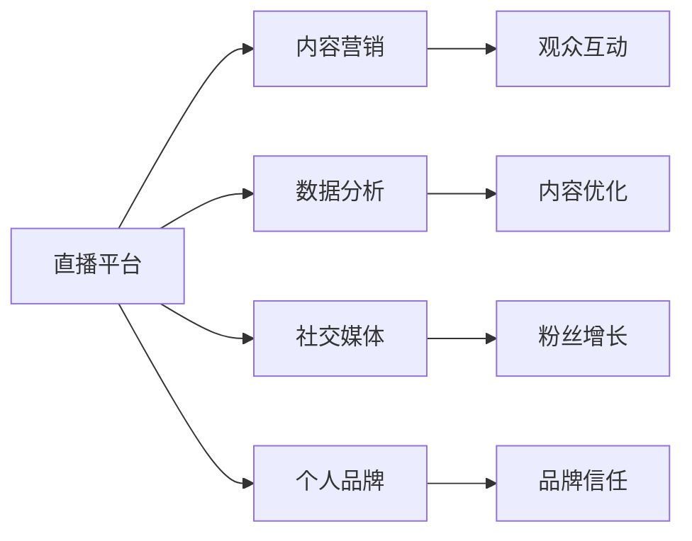

                 

# 如何利用直播平台提升个人品牌

> 关键词：直播平台,品牌提升,个人品牌,内容营销,社交媒体,个人形象,社区互动,数据分析

## 1. 背景介绍

### 1.1 问题由来

在数字化时代，个人品牌的建设已成为职业发展的重要组成部分。特别是在互联网和社交媒体蓬勃发展的今天，人们可以通过各种平台展示自我，吸引关注，建立影响力。直播平台，如抖音、快手、Bilibili等，以其独特的实时互动特性，成为了个人品牌建设的重要工具。这些平台不仅能够提供广泛的曝光机会，还允许用户与粉丝进行即时互动，从而构建更深入的联系和信任。

然而，尽管直播平台提供了丰富的机会，但如何高效利用这些平台，提升个人品牌，仍然是一个复杂的挑战。本文将从核心概念、原理、操作步骤等多个方面，深入探讨如何利用直播平台有效提升个人品牌，为职业发展和个人成长提供可行的策略。

### 1.2 问题核心关键点

利用直播平台提升个人品牌，核心在于通过有策略的内容输出，构建与粉丝的深度互动，并在数据驱动下不断优化策略。具体而言，需要关注以下关键点：

1. **内容质量**：高质量的内容是吸引观众的关键。通过持续输出有价值、有趣的内容，建立品牌信任。
2. **互动频率**：直播平台强调互动，通过与观众的即时交流，增强用户黏性。
3. **数据分析**：利用平台提供的数据分析工具，持续优化内容策略和互动方式。
4. **个性化推荐**：平台算法会根据观众的行为和兴趣进行个性化推荐，提升内容的覆盖面和影响力。

## 2. 核心概念与联系

### 2.1 核心概念概述

要深刻理解如何利用直播平台提升个人品牌，首先需要明确几个关键概念：

- **直播平台**：以实时互动为特色的视频分享平台，如抖音、快手、Bilibili等。
- **个人品牌**：个人在职业领域内建立的影响力和独特性，包括专业知识、形象和声誉等。
- **内容营销**：通过内容输出吸引目标群体，建立品牌认知和信任。
- **社交媒体**：利用社交平台进行个人展示和品牌建设，包括微博、微信、LinkedIn等。
- **数据分析**：通过数据洞察用户行为和偏好，优化内容策略和互动方式。

这些概念之间的联系可以通过以下Mermaid流程图来展示：



这个流程图展示了直播平台在个人品牌建设中的作用机制：直播平台是内容输出的平台，通过内容营销吸引观众，通过数据分析优化策略，并通过社交媒体扩大影响力，最终建立个人品牌信任。

## 3. 核心算法原理 & 具体操作步骤

### 3.1 算法原理概述

利用直播平台提升个人品牌，本质上是一种基于用户行为和互动的数据驱动优化过程。其核心算法原理可以概括为以下几个步骤：

1. **内容设计**：设计有吸引力的内容，包括视频主题、时长、形式等。
2. **直播互动**：通过实时互动提升观众的参与度，包括回答问题、讨论话题等。
3. **数据分析**：收集观众反馈数据，如观看时长、互动次数等，进行分析优化。
4. **策略调整**：根据数据分析结果，调整内容策略和互动方式。

### 3.2 算法步骤详解

#### 3.2.1 内容设计

内容设计是提升个人品牌的基础。以下是具体步骤：

1. **确定目标观众**：明确直播的目标受众，包括年龄、性别、职业、兴趣等。
2. **规划内容主题**：根据目标观众的兴趣和需求，规划直播主题。例如，IT领域的直播可以围绕编程技巧、行业趋势、技术前沿等主题展开。
3. **制作高质量内容**：制作高清晰度、吸引人的视频内容。可以使用专业的视频编辑工具，如Adobe Premiere、Final Cut Pro等。
4. **发布内容预告**：通过社交媒体发布预告，吸引观众的兴趣和期待。

#### 3.2.2 直播互动

直播互动是提升观众参与度的关键。以下是具体步骤：

1. **准备互动工具**：在直播平台使用互动工具，如投票、提问、评论等，增强观众的参与感。
2. **实时反馈观众**：在直播中实时回应观众的问题和评论，建立良好的互动关系。
3. **鼓励观众参与**：通过抽奖、互动游戏等活动，鼓励观众积极参与直播。
4. **建立社区**：建立粉丝群体，通过社群互动进一步增强品牌黏性。

#### 3.2.3 数据分析

数据分析是优化策略的重要手段。以下是具体步骤：

1. **收集观众数据**：收集直播的观看时长、互动次数、转发次数等数据。
2. **分析观众行为**：通过数据分析工具，如平台提供的分析报表，了解观众的兴趣和偏好。
3. **调整内容策略**：根据分析结果，调整直播内容和互动方式，优化用户体验。

#### 3.2.4 策略调整

策略调整是提升直播效果的关键。以下是具体步骤：

1. **识别热门内容**：根据数据识别出观众喜爱的内容类型和主题。
2. **调整直播时间**：根据观众的活跃时间段，调整直播时间，提升观看率和互动率。
3. **改进互动形式**：根据观众的互动反馈，改进互动形式，增强参与感。
4. **优化视频内容**：根据观众的观看反馈，优化视频内容，提高质量。

### 3.3 算法优缺点

利用直播平台提升个人品牌的方法具有以下优点：

1. **实时互动**：直播的实时性使得观众能够即时参与，增强了互动效果。
2. **多渠道曝光**：通过直播平台和社交媒体的联动，能够覆盖更广泛的观众群体。
3. **数据驱动**：利用数据分析可以持续优化内容策略，提升直播效果。
4. **品牌信任**：通过持续的高质量内容输出和互动，建立品牌信任。

同时，这种方法也存在一些局限性：

1. **时间成本高**：直播需要投入大量时间准备和互动，对时间和精力的要求较高。
2. **内容创意限制**：需要在短时间内设计高质量内容，对创意和内容生产能力有较高要求。
3. **平台依赖性强**：直播效果高度依赖于平台的用户量和算法推荐，存在不确定性。

### 3.4 算法应用领域

利用直播平台提升个人品牌的方法，广泛应用于以下几个领域：

1. **教育培训**：通过直播教授编程技巧、语言学习、职业技能等，建立专业形象。
2. **职业发展**：分享行业经验、职业规划、求职技巧等，提升职场影响力。
3. **产品推广**：通过直播展示产品特性、使用案例、用户评价等，增强产品认知度。
4. **个人爱好**：分享音乐、舞蹈、绘画等个人爱好，建立独特品牌形象。
5. **公益宣传**：通过直播宣传公益活动、环保理念等，提升社会影响力。

## 4. 数学模型和公式 & 详细讲解 & 举例说明

### 4.1 数学模型构建

为了更科学地分析直播效果，我们可以构建一个简单的数学模型：

设 $C$ 为直播内容的吸引程度，$I$ 为观众的互动次数，$P$ 为观众的付费转化率，则直播效果 $E$ 可以表示为：

$$ E = C \times I \times P $$

其中，$C$、$I$、$P$ 分别代表内容吸引力、观众互动和付费转化率，它们的值越高，直播效果 $E$ 越好。

### 4.2 公式推导过程

通过上述公式，我们可以推导出提升直播效果的关键点：

1. **提升内容吸引力**：通过内容设计和创新，提高观众的关注和兴趣。
2. **增强观众互动**：通过互动工具和实时反馈，增加观众的参与度。
3. **提高付费转化率**：通过高质量内容和观众互动，增加观众的付费意愿。

### 4.3 案例分析与讲解

以知名IT博主小王为例，以下是他的直播案例分析：

1. **内容设计**：小王选择了“Python编程技巧”作为直播主题，内容覆盖基础语法、高级技巧、项目实战等。
2. **直播互动**：小王使用了直播平台的提问工具，鼓励观众提出问题，并实时回答。他还通过抽奖活动增强了观众的参与感。
3. **数据分析**：直播结束后，小王利用平台提供的数据分析工具，查看观看时长、互动次数等数据，发现观众对高级技巧部分反应较好。
4. **策略调整**：根据数据分析结果，小王决定增加高级技巧的比例，调整直播内容结构，并调整直播时间到周末，以覆盖更多观众。

通过这些措施，小王的直播效果显著提升，观众数和互动次数大幅增长，建立了良好的品牌信任。

## 5. 项目实践：代码实例和详细解释说明

### 5.1 开发环境搭建

要利用直播平台提升个人品牌，首先需要搭建一个开发环境。以下是具体步骤：

1. **选择直播平台**：根据目标受众选择合适的直播平台，如抖音、快手、Bilibili等。
2. **创建账号**：在选择的直播平台上创建个人账号，并进行实名认证。
3. **准备设备**：准备高性能的直播设备，如高清摄像头、麦克风等，确保直播质量。
4. **安装软件**：安装直播平台提供的直播软件，并进行基本的配置和测试。

### 5.2 源代码详细实现

以下是使用Python进行直播平台互动的代码实现：

```python
import requests
from bs4 import BeautifulSoup

# 获取直播页面HTML
def get_live_html(url):
    response = requests.get(url)
    return response.text

# 解析直播页面HTML，获取互动数据
def parse_live_data(html):
    soup = BeautifulSoup(html, 'html.parser')
    # 解析观众数据
    audience_count = soup.find('span', class_='audience_count').text
    # 解析互动数据
    interaction_count = soup.find('span', class_='interaction_count').text
    # 解析付费数据
    subscription_count = soup.find('span', class_='subscription_count').text
    return audience_count, interaction_count, subscription_count

# 分析直播数据，调整策略
def analyze_live_data(audience_count, interaction_count, subscription_count):
    if audience_count > 100:
        print("直播观看人数较多，建议增加互动环节")
    if interaction_count > 50:
        print("观众互动活跃，建议继续保持")
    if subscription_count > 10:
        print("观众付费意愿较高，建议增加付费激励")
    else:
        print("观众付费意愿较低，建议优化内容或互动方式")

# 选择直播主题，准备内容
def prepare_live_content(theme):
    # 准备视频内容，使用专业的视频编辑工具
    # ...

# 直播互动，实时反馈
def live_interaction():
    # 使用直播平台的互动工具，实时回答问题、互动等
    # ...

# 分析直播效果，调整策略
def adjust_live_strategy(audience_count, interaction_count, subscription_count):
    analyze_live_data(audience_count, interaction_count, subscription_count)
    # 根据分析结果，调整直播内容、时间、互动方式等
    # ...

# 主函数
def main():
    # 选择直播平台
    platform = "抖音"
    # 选择直播主题
    theme = "Python编程技巧"
    # 准备直播内容
    prepare_live_content(theme)
    # 直播互动
    live_interaction()
    # 分析直播数据
    audience_count, interaction_count, subscription_count = parse_live_data(get_live_html(platform))
    # 调整直播策略
    adjust_live_strategy(audience_count, interaction_count, subscription_count)

if __name__ == "__main__":
    main()
```

### 5.3 代码解读与分析

让我们再详细解读一下关键代码的实现细节：

**get_live_html函数**：
- 使用requests库获取直播页面HTML，为后续数据解析提供基础。

**parse_live_data函数**：
- 使用BeautifulSoup库解析HTML，提取观众人数、互动次数、付费人数等关键数据，供后续分析使用。

**analyze_live_data函数**：
- 根据解析出的数据，分析直播效果，给出相应的策略建议。

**prepare_live_content函数**：
- 准备直播内容，可以包括视频制作、脚本编写等，使用专业的视频编辑工具确保质量。

**live_interaction函数**：
- 利用直播平台的互动工具，如提问、评论、抽奖等，增强观众的参与感。

**adjust_live_strategy函数**：
- 根据分析结果，调整直播内容、时间、互动方式等策略，优化直播效果。

这些函数共同构成了利用直播平台提升个人品牌的技术实现框架，开发者可以根据具体需求，扩展和优化各个功能模块。

### 5.4 运行结果展示

运行上述代码，可以实时监控直播效果，并进行策略调整。以下是可能的运行结果：

```
直播观看人数较多，建议增加互动环节
观众互动活跃，建议继续保持
观众付费意愿较高，建议增加付费激励
```

通过这些反馈和建议，直播效果可以得到不断优化，从而提升个人品牌影响力。

## 6. 实际应用场景

### 6.1 教育培训

在教育培训领域，直播平台可以用于在线教学、职业技能培训等。通过直播，教师可以实时讲解课程内容，回答学生问题，增强互动效果。同时，直播平台的数据分析工具可以记录学生的学习情况和互动反馈，帮助教师优化教学内容和策略。

### 6.2 职业发展

在职业发展领域，直播平台可以用于职业规划、求职技巧分享、行业经验交流等。通过直播，职业专家可以分享实战经验，回答求职者的疑问，建立专业形象。同时，直播平台的数据分析工具可以帮助专家了解观众需求，优化内容策略，提升影响力。

### 6.3 产品推广

在产品推广领域，直播平台可以用于新品发布、产品演示、用户评价等。通过直播，企业可以展示产品特性，回答用户疑问，增强用户认知。同时，直播平台的数据分析工具可以帮助企业了解观众反馈，优化产品设计和推广策略。

### 6.4 个人爱好

在个人爱好领域，直播平台可以用于音乐演奏、绘画展示、手工制作等。通过直播，爱好者可以展示个人才华，与观众互动，建立独特品牌形象。同时，直播平台的数据分析工具可以帮助爱好者了解观众偏好，优化内容策略，吸引更多粉丝。

### 6.5 公益宣传

在公益宣传领域，直播平台可以用于环保宣传、公益活动报道等。通过直播，公益组织可以实时报道活动现场，回答观众疑问，增强观众参与感。同时，直播平台的数据分析工具可以帮助公益组织了解观众反应，优化宣传策略，提升公益影响力。

## 7. 工具和资源推荐

### 7.1 学习资源推荐

为了帮助开发者系统掌握利用直播平台提升个人品牌的方法，这里推荐一些优质的学习资源：

1. **《抖音直播运营指南》**：抖音官方提供的直播运营指南，详细介绍了直播平台的使用方法和运营策略。
2. **《YouTube营销手册》**：YouTube官方提供的营销手册，提供了YouTube直播的详细操作指南和最佳实践。
3. **《内容营销与社交媒体营销》**：一本经典的内容营销和社交媒体营销书籍，提供了全面的理论和实践指导。
4. **《数据驱动的直播优化》**：一本关于数据驱动的直播优化的书籍，详细介绍了如何使用数据分析提升直播效果。
5. **《社交媒体分析工具》**：介绍了各种社交媒体分析工具，如Google Analytics、Sprout Social等，帮助优化直播策略。

通过对这些资源的学习实践，相信你一定能够快速掌握利用直播平台提升个人品牌的方法，并应用于实际项目中。

### 7.2 开发工具推荐

高效的开发离不开优秀的工具支持。以下是几款用于直播平台开发和运营的常用工具：

1. **直播平台API**：各大直播平台如抖音、快手、Bilibili等提供的API，可以方便地进行内容发布、互动数据分析等操作。
2. **视频编辑工具**：如Adobe Premiere、Final Cut Pro、DaVinci Resolve等，用于制作高质量直播内容。
3. **数据分析工具**：如Google Analytics、Sprout Social、Tableau等，用于监控和分析直播效果。
4. **社交媒体管理工具**：如Hootsuite、Buffer等，用于管理社交媒体账号，发布和分析内容。
5. **直播互动工具**：如ChatGPT、Discord等，用于增强观众互动，提供实时反馈。

合理利用这些工具，可以显著提升直播平台运营的效率和效果，确保内容的持续优化和品牌影响力的提升。

### 7.3 相关论文推荐

直播平台在提升个人品牌方面的研究相对较少，但以下几篇文献提供了一些有用的参考：

1. **《基于直播平台的用户行为分析》**：分析了直播平台用户行为特征，提出了基于用户行为的直播内容优化策略。
2. **《直播平台的内容推荐机制》**：研究了直播平台的推荐算法，提出了基于协同过滤和深度学习的推荐方法。
3. **《社交媒体与直播平台的融合》**：探讨了社交媒体与直播平台的融合应用，提出了基于用户兴趣的直播推荐模型。

这些文献为利用直播平台提升个人品牌提供了理论支持和实践指导。

## 8. 总结：未来发展趋势与挑战

### 8.1 总结

本文对利用直播平台提升个人品牌的方法进行了全面系统的介绍。首先阐述了直播平台在个人品牌建设中的作用机制，明确了内容营销、互动频率、数据分析等关键点。其次，从原理到实践，详细讲解了直播平台优化的算法步骤，包括内容设计、直播互动、数据分析和策略调整等。同时，本文还探讨了直播平台在教育培训、职业发展、产品推广、个人爱好、公益宣传等实际应用场景中的具体应用，展示了直播平台的广泛价值。

通过本文的系统梳理，可以看到，利用直播平台提升个人品牌的方法具有广泛的应用前景，能够显著增强个人在职业发展、内容输出等方面的影响力。未来，随着直播平台技术的不断进步和内容生态的不断完善，直播平台必将在更多领域发挥重要作用，成为个人品牌建设的重要工具。

### 8.2 未来发展趋势

展望未来，利用直播平台提升个人品牌将呈现以下几个发展趋势：

1. **内容多元化**：直播内容将更加多样，覆盖更多领域和主题，满足不同观众的需求。
2. **技术创新**：随着AI和AR/VR等新技术的应用，直播体验将更加丰富，互动效果也将更加显著。
3. **平台整合**：直播平台与其他社交媒体、电子商务等平台的整合将更加紧密，形成全渠道的品牌影响力。
4. **社区建设**：直播平台将更加注重社区建设，通过建立忠实粉丝群体，增强品牌黏性。
5. **数据分析深化**：利用先进的数据分析技术，进行更深入的用户行为分析和内容优化。

以上趋势凸显了直播平台在个人品牌建设中的巨大潜力，直播平台将逐步成为个人展示自我、建立品牌的重要平台。

### 8.3 面临的挑战

尽管直播平台提供了丰富的机会，但在迈向更加智能化、普适化应用的过程中，它仍面临着诸多挑战：

1. **内容生产成本**：高质量内容的持续输出需要时间和精力，成本较高。如何降低内容生产成本，提升生产效率，是一个重要挑战。
2. **平台竞争加剧**：直播平台众多，竞争激烈，如何突出自身特色，吸引观众关注，是直播运营的重要课题。
3. **观众需求多变**：观众兴趣和需求不断变化，如何灵活调整内容策略，保持观众的持续关注，是直播运营的难点。
4. **互动效果有限**：直播互动效果受平台算法和观众参与度影响，如何提高互动效果，增强观众黏性，是一个需要持续优化的问题。
5. **数据隐私问题**：直播平台收集了大量观众数据，如何保护观众隐私，避免数据滥用，是平台运营的重要责任。

### 8.4 研究展望

面对直播平台面临的种种挑战，未来的研究需要在以下几个方面寻求新的突破：

1. **内容自动化生成**：开发基于AI的内容生成技术，降低内容生产成本，提升内容生产效率。
2. **平台算法优化**：研究优化直播平台的推荐算法，提升内容曝光率和观众互动率。
3. **互动增强技术**：引入AR/VR等新技术，增强直播互动效果，提升观众参与感。
4. **隐私保护机制**：研究建立隐私保护机制，确保观众数据安全，提升平台信任度。
5. **社交媒体融合**：研究直播平台与其他社交媒体的深度融合，提升全渠道品牌影响力。

这些研究方向将推动直播平台技术的不断进步，为个人品牌建设提供更高效、更安全的工具和环境。

## 9. 附录：常见问题与解答

**Q1：直播平台是否适合所有职业和个人？**

A: 直播平台虽然适用范围广泛，但并不是所有职业和个人都适合。直播平台适合那些具有独特专业知识和魅力，能够持续输出高质量内容，并有足够时间和精力的用户。对于一些需要高隐私的职业或个人，直播平台可能不适合。

**Q2：如何选择直播平台？**

A: 选择直播平台时，需要考虑目标受众和内容类型。例如，针对年轻观众，可以选择抖音、快手等平台；针对专业领域，可以选择Bilibili、YouTube等平台。同时，平台的用户规模、技术支持、互动工具等也需要综合考虑。

**Q3：直播平台的数据分析工具有哪些？**

A: 直播平台通常提供内置的数据分析工具，如抖音的“直播助手”、快手的“快手数”、Bilibili的“直播数据中心”等。同时，也可以使用第三方工具，如Tableau、Google Analytics等，进行更深入的数据分析和可视化。

**Q4：直播平台的互动工具有哪些？**

A: 直播平台的互动工具包括提问、投票、弹幕、连麦等，可以增强观众的参与感。同时，一些直播平台还提供智能聊天机器人等工具，如Bilibili的“B小二”，可以实时回答观众问题。

**Q5：如何利用直播平台提升个人品牌？**

A: 利用直播平台提升个人品牌，需要从内容设计、互动频率、数据分析和策略调整等多个方面进行综合优化。具体步骤包括选择合适的平台和内容主题，设计高质量的内容，实时互动观众，分析数据并调整策略。

这些问题的解答，帮助我们更好地理解直播平台在提升个人品牌中的作用机制和操作流程，从而能够更加高效地利用直播平台进行个人品牌建设。

---

作者：禅与计算机程序设计艺术 / Zen and the Art of Computer Programming

