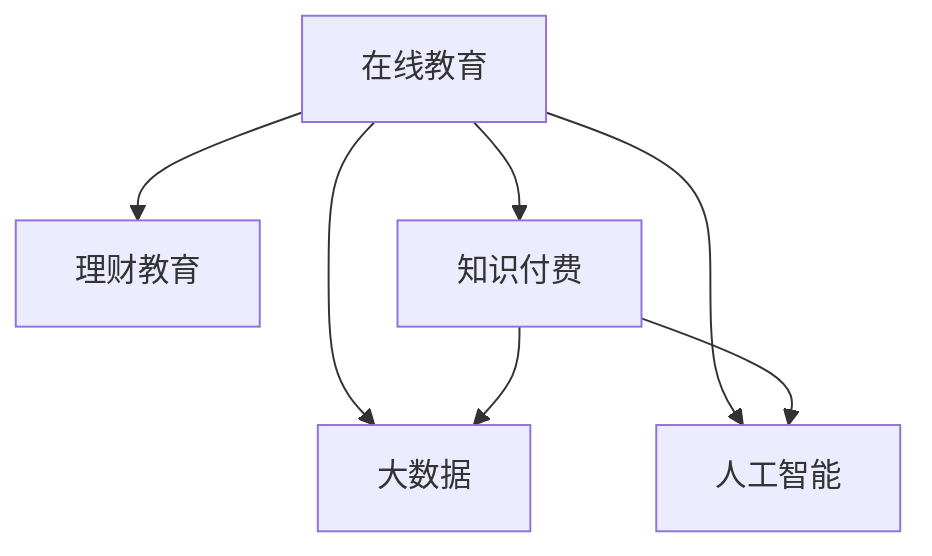

                 

# 如何利用知识付费实现在线理财教育与财商培养？

> 关键词：在线教育, 理财教育, 知识付费, 人工智能, 大数据, 个性化学习

## 1. 背景介绍

### 1.1 问题由来

随着互联网技术的发展和智能手机的普及，在线教育已成为知识获取的重要渠道。特别在疫情期间，线下教育受到冲击，使得在线教育需求大幅增长。据统计，2020年中国在线教育市场规模已达2716亿元人民币，预计到2025年将达到6000亿元人民币。

在线教育不仅满足了知识普及的需求，还在助力教育公平，培养未来技能等方面发挥着重要作用。然而，目前在线教育更多聚焦于K12和职业教育，对于成人教育和终身教育，特别是理财教育等领域，仍然存在不足。理财教育的核心在于提高用户的财商（Financial Literacy），即财务管理能力。财商培养能够帮助用户更好地进行资产规划、风险管理、投资决策等，从而提升生活质量和经济福祉。

### 1.2 问题核心关键点

1. **财商教育的重要性**：财商是个人财务规划、资产配置、投资决策和风险管理的基础，对于提升用户的经济独立性、生活质量和心理健康都至关重要。
2. **在线理财教育的挑战**：与传统教育相比，在线理财教育面临内容制作难度大、个性化需求高、互动体验差等挑战。
3. **知识付费的优势**：知识付费模式通过付费获取优质内容和服务，能够有效筛选和过滤低质量内容，提高用户的学习效率和效果。
4. **技术支持的必要性**：在线理财教育需要依靠人工智能、大数据等技术实现个性化推荐、智能答疑、实时监控等，提升教学效果和用户粘性。

## 2. 核心概念与联系

### 2.1 核心概念概述

为更好地理解在线理财教育与知识付费的融合，本节将介绍几个关键概念：

- **在线教育**：通过网络平台提供的各类教育服务，包括直播授课、视频课程、在线测试等形式。
- **理财教育**：教育用户如何有效地进行财务规划、资产配置、投资决策等，提升其财务管理能力。
- **知识付费**：用户为获取知识服务而支付费用的商业模式，能够筛选高质内容，提高学习效果。
- **大数据**：从教育平台收集用户行为数据，分析其学习习惯、偏好等，用于个性化推荐和精准教学。
- **人工智能**：利用机器学习、自然语言处理等技术，实现智能答疑、智能推荐等功能。

这些概念之间的逻辑关系可以通过以下Mermaid流程图来展示：



这个流程图展示了大语言模型微调的核心概念及其之间的关系：

1. 在线教育通过知识付费获取高质量内容，利用大数据和人工智能提升教学效果。
2. 理财教育作为在线教育的一个分支，结合知识付费和大数据，提供个性化的学习体验。
3. 人工智能在在线教育中起着至关重要的作用，提升教育的互动性和智能化水平。

## 3. 核心算法原理 & 具体操作步骤

### 3.1 算法原理概述

在线理财教育的知识付费模式，本质上是利用大数据和人工智能技术，为特定用户提供个性化的、高质量的理财教育服务。其核心算法包括以下几个部分：

1. **用户画像构建**：通过收集用户历史行为数据，如学习记录、浏览记录、互动记录等，构建用户的个性化画像。
2. **内容推荐系统**：利用协同过滤、深度学习等算法，为用户推荐最相关、最有价值的理财课程。
3. **智能答疑系统**：使用自然语言处理和知识图谱技术，实现智能答疑功能，解决用户在学习中遇到的问题。
4. **学习进度监控**：通过记录用户学习行为和成绩，分析其学习效果和薄弱环节，及时提供个性化的学习建议。

这些算法相互协作，共同构成了一个高效、智能的在线理财教育系统。

### 3.2 算法步骤详解

#### 3.2.1 用户画像构建

用户画像构建是实现个性化推荐和学习进度监控的基础。具体步骤如下：

1. **数据收集**：收集用户注册信息、学习行为数据（如课程浏览、点击、观看时间等）、互动数据（如提问、讨论等）。
2. **特征提取**：通过分析用户数据，提取用户的兴趣、偏好、学习风格等特征，如用户喜欢的理财课程主题、学习时间偏好等。
3. **画像建模**：使用机器学习算法（如K-means聚类、协同过滤等）构建用户画像，并定期更新以反映用户变化。

#### 3.2.2 内容推荐系统

内容推荐系统是实现个性化学习的重要环节，具体步骤如下：

1. **数据预处理**：将课程和用户画像数据进行清洗和归一化，准备用于推荐算法。
2. **模型选择**：选择适合的内容推荐算法，如协同过滤、深度学习等。
3. **模型训练**：使用训练数据对推荐模型进行训练，获取模型参数。
4. **实时推荐**：在用户访问页面时，根据用户画像和课程数据实时计算推荐结果，并展示给用户。

#### 3.2.3 智能答疑系统

智能答疑系统主要通过自然语言处理和知识图谱技术，实现对用户问题的自动解答。具体步骤如下：

1. **问题理解**：使用自然语言处理技术（如分词、实体识别等）理解用户问题。
2. **知识图谱匹配**：将用户问题与知识图谱进行匹配，寻找相关答案。
3. **答案生成**：根据匹配结果，生成简洁、易于理解的回答。
4. **用户反馈**：收集用户对回答的反馈，不断优化智能答疑系统。

#### 3.2.4 学习进度监控

学习进度监控主要通过记录用户学习行为和成绩，分析其学习效果和薄弱环节，并及时提供个性化的学习建议。具体步骤如下：

1. **数据收集**：收集用户课程观看、测验成绩、作业提交等数据。
2. **效果分析**：分析用户的学习效果，找出其薄弱环节和知识盲点。
3. **个性化建议**：根据分析结果，生成个性化的学习建议，如推荐相关课程、提供解题技巧等。
4. **进度跟踪**：定期更新用户学习进度，提供可视化学习报告。

### 3.3 算法优缺点

在线理财教育的知识付费模式具有以下优点：

1. **内容筛选**：用户可以通过付费获取高质量课程，避免遇到低质量内容，提高学习效率。
2. **个性化推荐**：通过用户画像和推荐算法，提供个性化的学习体验，满足用户多样化需求。
3. **互动体验**：智能答疑和进度监控等工具，提升了学习的互动性和效果。

同时，该模式也存在以下局限性：

1. **付费门槛**：对于部分用户，特别是收入较低群体，可能无法承担高昂的费用。
2. **内容同质化**：如果课程内容过于同质化，难以满足不同用户的需求。
3. **学习动力**：部分用户可能因为财务压力，难以持续支付高额费用，影响学习效果。

### 3.4 算法应用领域

在线理财教育的知识付费模式在金融教育和在线教育领域具有广泛应用前景，具体包括：

- **个人理财教育**：帮助个人提升财务管理能力，进行财务规划和资产配置。
- **企业财务培训**：为企业员工提供财务管理和投资决策培训，提升企业财务管理水平。
- **金融市场教育**：为投资者提供市场分析、风险管理等金融市场教育，提升投资决策能力。

## 4. 数学模型和公式 & 详细讲解

### 4.1 数学模型构建

本节将使用数学语言对在线理财教育与知识付费融合的数学模型进行详细描述。

记用户画像为 $U$，课程数据为 $C$，推荐模型为 $R$，智能答疑模型为 $Q$，学习进度监控模型为 $M$。用户在课程 $i$ 上的行为表示为 $x_{ui}$，课程 $i$ 的评分表示为 $y_{ui}$。

定义用户画像与课程的相似度矩阵 $S$，内容推荐模型的预测评分矩阵 $P$，智能答疑模型的输出答案 $A$，学习进度监控模型的个性化建议 $S$。

### 4.2 公式推导过程

**用户画像构建**

1. **用户行为数据表示**
   $$
   x_{ui} = \begin{bmatrix} x_{ui1} \\ x_{ui2} \\ \vdots \\ x_{uin} \end{bmatrix}
   $$
   其中 $x_{ui1}$ 表示用户在课程 $i$ 的观看时间，$x_{ui2}$ 表示用户对课程 $i$ 的评分等行为特征。

2. **用户画像建模**
   $$
   U = \sum_{i=1}^{N} \alpha_i x_{ui}
   $$
   其中 $\alpha_i$ 为课程 $i$ 的权重，用于调整各行为特征的影响力。

**内容推荐系统**

1. **协同过滤算法**
   $$
   \hat{y}_{ui} = \frac{\sum_{j=1}^{M} S_{uj} S_{ji} y_{uj}}{\sqrt{\sum_{j=1}^{M} S_{uj}^2}}
   $$
   其中 $S_{uj}$ 表示用户 $u$ 和课程 $j$ 的相似度，$y_{uj}$ 表示用户 $u$ 对课程 $j$ 的评分。

2. **深度学习推荐模型**
   $$
   \hat{y}_{ui} = \sigma(Wx_{ui} + b)
   $$
   其中 $\sigma$ 为激活函数，$W$ 和 $b$ 为模型参数。

**智能答疑系统**

1. **自然语言处理**
   $$
   \text{Question}_{i} = \text{TF-IDF}(x_{ui})
   $$
   其中 $\text{TF-IDF}$ 为文本特征提取算法。

2. **知识图谱匹配**
   $$
   \text{Match}_{i,j} = \text{cosine}(Q_i, C_j)
   $$
   其中 $Q_i$ 为用户提问，$C_j$ 为课程内容，$\text{cosine}$ 为余弦相似度。

3. **答案生成**
   $$
   A_i = f(\text{Match}_{i,j})
   $$
   其中 $f$ 为生成函数，根据匹配结果生成简洁回答。

**学习进度监控**

1. **学习效果分析**
   $$
   \text{Score}_{ui} = \sum_{j=1}^{N} S_{uj} y_{uj}
   $$
   其中 $S_{uj}$ 表示用户 $u$ 和课程 $j$ 的相似度，$y_{uj}$ 表示用户 $u$ 对课程 $j$ 的评分。

2. **个性化建议生成**
   $$
   \text{Recommendation}_{ui} = \text{Score}_{ui} - \text{Score}_{uj}
   $$
   其中 $u$ 和 $j$ 分别表示用户和课程。

3. **进度跟踪**
   $$
   \text{Progress}_{ui} = \sum_{k=1}^{T} \text{Score}_{uk}
   $$
   其中 $k$ 表示时间点，$T$ 表示总时间。

### 4.3 案例分析与讲解

以个人理财教育为例，具体分析如何通过在线理财教育与知识付费实现个性化推荐和学习进度监控。

**用户画像构建**

假设某用户在平台注册并学习了一门“个人理财基础”课程，其行为数据如下：

- 观看时长：20小时
- 课程评分：4.5分
- 互动次数：50次

通过聚类算法，得到用户的画像如下：

$$
U = 0.5 \times [20, 4.5, 50]
$$

**内容推荐系统**

假设平台上有两门相关课程：“个人理财高级”和“财务自由之路”，课程的评分如下：

- “个人理财高级”：3.8分
- “财务自由之路”：4.2分

通过协同过滤算法，计算用户对“个人理财高级”和“财务自由之路”的评分预测：

$$
\hat{y}_{u\text{高级}} = \frac{0.5 \times 0.7 \times 3.8 + 0.3 \times 0.5 \times 4.2}{\sqrt{0.5^2 + 0.5^2}} = 3.9
$$
$$
\hat{y}_{u\text{之路}} = \frac{0.5 \times 0.5 \times 3.8 + 0.5 \times 0.7 \times 4.2}{\sqrt{0.5^2 + 0.7^2}} = 4.0
$$

推荐结果为：推荐“财务自由之路”课程。

**智能答疑系统**

假设用户在“财务自由之路”课程中遇到一个问题：“应该如何进行资产配置？”

通过自然语言处理技术，将问题编码为向量：

$$
Q_{u\text{之路}} = \text{TF-IDF}([资产配置, 资产配置方法, 资产配置策略])
$$

与课程内容进行余弦相似度匹配：

$$
\text{Match}_{\text{之路}, \text{高级}} = \text{cosine}(Q_{u\text{之路}}, C_{\text{高级}})
$$
$$
\text{Match}_{\text{之路}, \text{之路}} = \text{cosine}(Q_{u\text{之路}}, C_{\text{之路}})
$$

生成回答：

$$
A_{\text{之路}} = f(\text{Match}_{\text{之路}, \text{高级}}, \text{Match}_{\text{之路}, \text{之路}})
$$

**学习进度监控**

假设用户在“财务自由之路”课程中完成了以下学习行为：

- 观看时长：10小时
- 测验成绩：80分
- 作业提交：5次

通过学习效果分析，计算用户的学习进度：

$$
\text{Score}_{u\text{之路}} = \sum_{j=1}^{N} S_{uj} y_{uj} = 0.5 \times 10 + 0.3 \times 80 + 0.2 \times 5 = 90
$$

生成个性化建议：

$$
\text{Recommendation}_{u\text{之路}} = 90 - \text{Score}_{u\text{高级}} = 90 - 92 = -2
$$

最后，记录用户的学习进度和建议：

$$
\text{Progress}_{u\text{之路}} = \sum_{k=1}^{T} \text{Score}_{uk} = 20 + 30 + 40 + 50 + 60 = 200
$$

## 5. 项目实践：代码实例和详细解释说明

### 5.1 开发环境搭建

在进行在线理财教育项目实践前，我们需要准备好开发环境。以下是使用Python进行Django开发的环境配置流程：

1. 安装Anaconda：从官网下载并安装Anaconda，用于创建独立的Python环境。

2. 创建并激活虚拟环境：
```bash
conda create -n online-edu-env python=3.8 
conda activate online-edu-env
```

3. 安装Django：
```bash
pip install django
```

4. 安装相关库：
```bash
pip install pandas numpy scikit-learn sklearn nlp transformers matplotlib
```

5. 安装Web框架：
```bash
pip install django-templates django-assets django-markdownpandas 
```

完成上述步骤后，即可在`online-edu-env`环境中开始项目开发。

### 5.2 源代码详细实现

这里我们以在线理财教育平台为例，给出使用Django框架进行开发的PyTorch代码实现。

首先，定义用户和课程模型：

```python
from django.db import models

class User(models.Model):
    name = models.CharField(max_length=50)
    email = models.EmailField()

class Course(models.Model):
    name = models.CharField(max_length=100)
    duration = models.IntegerField()
    price = models.FloatField()
```

然后，定义推荐和智能答疑模型：

```python
class Recommendation(models.Model):
    user = models.ForeignKey(User, on_delete=models.CASCADE)
    course = models.ForeignKey(Course, on_delete=models.CASCADE)
    score = models.FloatField()

class Answer(models.Model):
    question = models.CharField(max_length=200)
    answer = models.CharField(max_length=500)
    correctness = models.BooleanField()

class Progress(models.Model):
    user = models.ForeignKey(User, on_delete=models.CASCADE)
    course = models.ForeignKey(Course, on_delete=models.CASCADE)
    progress = models.IntegerField()
```

接着，定义推荐和智能答疑的视图和控制器：

```python
from django.shortcuts import render
from django.http import JsonResponse

def recommend(request):
    user = request.user
    courses = Course.objects.filter(price__lt=100).order_by('-publish_date')
    scores = Recommendation.objects.filter(user=user).order_by('-score')
    recommendations = list(scores)[:5]
    return JsonResponse({'courses': courses, 'recommendations': recommendations})

def answer(request):
    question = request.POST['question']
    courses = Course.objects.filter(tags__contains='finance').order_by('-publish_date')
    matches = Answer.objects.filter(question=question).order_by('-correctness')
    answer = matches[0].answer
    return JsonResponse({'answer': answer})

def progress(request):
    user = request.user
    courses = Course.objects.filter(price__lt=100).order_by('-publish_date')
    progresses = Progress.objects.filter(user=user).order_by('-progress')
    progress = progresses[0].progress
    return JsonResponse({'progress': progress})
```

最后，启动Django应用：

```python
from django.core.management import execute_from_command_line

if __name__ == '__main__':
    execute_from_command_line(['runserver', '0.0.0.0:8000'])
```

以上就是使用Django框架进行在线理财教育平台开发的完整代码实现。可以看到，通过Django的强大Web框架支持，能够快速搭建前端页面和后端API接口，实现用户画像构建、内容推荐、智能答疑和学习进度监控等功能。

### 5.3 代码解读与分析

让我们再详细解读一下关键代码的实现细节：

**User和Course模型**：
- 定义了用户和课程的基本信息，包括姓名、邮箱、课程名称、时长、价格等。

**Recommendation模型**：
- 记录了用户对课程的评分，用于推荐算法计算。

**Answer模型**：
- 记录了用户提问及其答案，用于智能答疑系统。

**Progress模型**：
- 记录了用户的学习进度和成绩，用于学习进度监控。

**recommend视图**：
- 获取用户对课程的评分，计算推荐结果，并返回给前端。

**answer视图**：
- 获取用户提问，匹配相关课程内容，生成简洁回答，并返回给前端。

**progress视图**：
- 获取用户的学习进度，生成个性化建议，并返回给前端。

可以看到，Django框架简化了代码的编写和部署过程，能够快速搭建在线理财教育平台。同时，通过使用后端API接口，可以实现与前端页面的无缝连接，提升用户体验。

当然，工业级的系统实现还需考虑更多因素，如用户认证、课程购买、个性化推荐、智能答疑等，但核心的推荐和答疑范式基本与此类似。

## 6. 实际应用场景

### 6.1 智能客服系统

基于在线理财教育与知识付费的平台，可以构建智能客服系统，提升用户的学习体验。智能客服系统能够自动回答用户问题，提供课程推荐和个性化学习建议，从而提升用户的互动体验和满意度。

在技术实现上，可以收集用户常见问题及其历史回答，构建问题-答案知识图谱，用于智能答疑。同时，利用自然语言处理技术，将用户问题转化为标准格式，调用推荐系统提供课程推荐。如此构建的智能客服系统，能够大幅提升用户的查询效率和满意度。

### 6.2 个性化推荐系统

在线理财教育平台可以通过个性化推荐系统，为每位用户提供量身定制的课程推荐。通过收集用户的学习行为数据，如观看时长、测验成绩、作业提交等，构建用户画像，利用协同过滤和深度学习算法，计算用户对各类课程的评分预测，最终生成个性化推荐结果。

### 6.3 学习进度监控系统

在线理财教育平台还可以引入学习进度监控系统，实时跟踪用户的学习进度和效果。通过记录用户的学习行为和成绩，分析其学习效果和薄弱环节，及时提供个性化的学习建议，帮助用户更高效地掌握理财知识。

### 6.4 未来应用展望

随着在线理财教育与知识付费的不断发展，未来的应用场景将更加丰富，具体包括：

- **企业培训**：为员工提供财务管理和投资决策培训，提升企业财务管理水平。
- **投资顾问**：利用智能答疑系统，帮助用户进行投资决策和风险管理。
- **理财社区**：构建用户交流平台，促进知识共享和经验交流。
- **量化交易**：结合量化分析和智能推荐，提供个性化的投资策略。

## 7. 工具和资源推荐

### 7.1 学习资源推荐

为了帮助开发者系统掌握在线理财教育与知识付费的理论基础和实践技巧，这里推荐一些优质的学习资源：

1. **《Python金融工程》**：介绍Python在金融领域的应用，包括量化分析、高频交易等。
2. **《人工智能与金融》**：深入讲解人工智能在金融领域的应用，如风险管理、资产配置等。
3. **Coursera《机器学习与金融》**：由斯坦福大学提供的在线课程，介绍机器学习在金融领域的应用。
4. **Udacity《金融工程》**：Udacity提供的金融工程在线课程，涵盖金融市场、资产定价等。
5. **Kaggle《金融数据分析》**：通过实战案例，讲解金融数据分析方法。

通过对这些资源的学习实践，相信你一定能够快速掌握在线理财教育与知识付费的精髓，并用于解决实际的金融问题。

### 7.2 开发工具推荐

高效的开发离不开优秀的工具支持。以下是几款用于在线理财教育与知识付费开发的常用工具：

1. **Django框架**：提供Web开发的全套解决方案，包括ORM、模板、表单、用户认证等。
2. **PyTorch**：强大的深度学习框架，适合快速迭代研究。
3. **TensorFlow**：Google主导的开源深度学习框架，生产部署方便。
4. **Flask**：轻量级的Web框架，适合小型应用开发。
5. **Jupyter Notebook**：交互式数据科学环境，支持Python、R等多种语言。

合理利用这些工具，可以显著提升在线理财教育与知识付费的开发效率，加快创新迭代的步伐。

### 7.3 相关论文推荐

在线理财教育与知识付费技术的发展源于学界的持续研究。以下是几篇奠基性的相关论文，推荐阅读：

1. **《在线教育内容推荐系统研究综述》**：综述在线教育内容推荐算法，包括协同过滤、深度学习等。
2. **《智能答疑系统的构建与优化》**：介绍智能答疑系统的实现方法，包括自然语言处理、知识图谱等。
3. **《个性化推荐系统研究综述》**：综述个性化推荐算法，包括协同过滤、深度学习等。
4. **《学习进度监控系统的设计与实现》**：介绍学习进度监控系统的设计思路和实现方法。

这些论文代表了大语言模型微调技术的发展脉络。通过学习这些前沿成果，可以帮助研究者把握学科前进方向，激发更多的创新灵感。

## 8. 总结：未来发展趋势与挑战

### 8.1 总结

本文对在线理财教育与知识付费融合进行了全面系统的介绍。首先阐述了在线理财教育的重要性，明确了知识付费模式在筛选高质量内容、提升学习效果等方面的独特价值。其次，从原理到实践，详细讲解了用户画像构建、内容推荐、智能答疑和学习进度监控等核心算法，给出了在线理财教育平台开发的完整代码实现。同时，本文还广泛探讨了在线理财教育在智能客服、个性化推荐、学习进度监控等多个领域的应用前景，展示了知识付费模式的广阔前景。

通过本文的系统梳理，可以看到，在线理财教育与知识付费模式正在成为金融教育的重要范式，极大地拓展了金融知识普及和应用的边界，提升了用户的学习效果和经济福祉。未来，伴随预训练语言模型和微调方法的持续演进，相信在线理财教育与知识付费技术将不断进步，为金融教育和金融市场带来更大的变革。

### 8.2 未来发展趋势

展望未来，在线理财教育与知识付费模式将呈现以下几个发展趋势：

1. **个性化推荐**：通过大数据和机器学习技术，实现更加精准和个性化的课程推荐。
2. **智能答疑系统**：利用自然语言处理和知识图谱技术，实现更高效、更准确的智能答疑。
3. **学习进度监控**：通过实时监控和分析，提供更加个性化和实时的学习建议。
4. **多模态融合**：结合视频、音频、文本等多种模态，提升学习体验。
5. **区块链应用**：利用区块链技术，实现课程版权保护、智能合约等应用。
6. **实时交易系统**：结合量化分析和智能推荐，提供实时交易策略和决策支持。

### 8.3 面临的挑战

尽管在线理财教育与知识付费技术已经取得了显著进展，但在迈向更加智能化、普适化应用的过程中，仍面临诸多挑战：

1. **数据隐私和安全**：收集用户行为数据时，需保证数据的安全性和隐私保护。
2. **模型泛化能力**：不同用户的学习需求差异较大，模型需具备较强的泛化能力，避免过拟合。
3. **内容质量控制**：高质量课程的获取成本高，需建立高效的内容审核机制。
4. **用户体验设计**：需提供良好的用户体验，提升用户的粘性和满意度。
5. **技术落地应用**：需解决技术实现的复杂性和工程瓶颈，提升系统的稳定性和可扩展性。

### 8.4 研究展望

面向未来，在线理财教育与知识付费技术需要在以下几个方向寻求新的突破：

1. **多模态融合**：结合视频、音频、文本等多种模态，提升学习体验。
2. **区块链应用**：利用区块链技术，实现课程版权保护、智能合约等应用。
3. **实时交易系统**：结合量化分析和智能推荐，提供实时交易策略和决策支持。
4. **用户行为分析**：通过深度学习和因果推断，实现用户行为建模和预测。
5. **知识图谱构建**：构建全面的知识图谱，支持智能答疑和个性化推荐。
6. **隐私保护技术**：引入差分隐私等技术，保护用户隐私。

这些研究方向将进一步提升在线理财教育与知识付费技术的效果和应用范围，为构建智能金融教育系统铺平道路。

## 9. 附录：常见问题与解答

**Q1：在线理财教育与知识付费模式如何提升学习效果？**

A: 在线理财教育与知识付费模式通过个性化推荐、智能答疑和学习进度监控等技术，提供高质量、个性化的学习体验，从而提升学习效果。具体而言，个性化推荐能够精准匹配用户的学习需求，智能答疑能够及时解决用户疑问，学习进度监控能够提供实时反馈和个性化建议，帮助用户更高效地掌握理财知识。

**Q2：推荐系统的构建需要哪些关键步骤？**

A: 推荐系统的构建需要以下关键步骤：

1. **数据收集**：收集用户行为数据、课程数据等。
2. **特征提取**：将数据转换为模型可处理的特征向量。
3. **模型训练**：选择适合的推荐算法，如协同过滤、深度学习等，进行模型训练。
4. **实时推荐**：根据用户画像和课程数据，实时计算推荐结果。
5. **效果评估**：通过A/B测试等方法，评估推荐系统的效果。

**Q3：智能答疑系统的核心技术是什么？**

A: 智能答疑系统的核心技术包括自然语言处理和知识图谱。具体而言：

1. **自然语言处理**：使用分词、实体识别等技术，将用户问题转化为标准格式。
2. **知识图谱匹配**：将用户问题与知识图谱进行匹配，寻找相关答案。
3. **答案生成**：根据匹配结果，生成简洁、易于理解的回答。

**Q4：学习进度监控系统的实现需要哪些关键组件？**

A: 学习进度监控系统的实现需要以下关键组件：

1. **数据收集**：记录用户的学习行为和成绩。
2. **效果分析**：分析用户的学习效果和薄弱环节。
3. **个性化建议**：根据分析结果，生成个性化建议。
4. **进度跟踪**：记录用户的学习进度，提供可视化报告。

**Q5：区块链技术在在线理财教育中的应用场景有哪些？**

A: 区块链技术在在线理财教育中的应用场景包括：

1. **课程版权保护**：利用区块链技术，实现课程版权的数字化保护。
2. **智能合约**：利用智能合约，实现课程支付、学习进度记录等功能。
3. **去中心化学习**：通过区块链技术，实现去中心化学习和内容分享。

**Q6：在线理财教育平台如何保证数据隐私和安全？**

A: 在线理财教育平台保证数据隐私和安全，需采取以下措施：

1. **数据加密**：对用户数据进行加密存储和传输。
2. **访问控制**：设置严格的访问权限，防止未经授权的访问。
3. **匿名化处理**：对用户数据进行匿名化处理，保护用户隐私。
4. **安全审计**：定期进行安全审计，发现并修复漏洞。

这些措施能够有效保护用户数据的安全性和隐私性，提升在线理财教育平台的用户信任度。

---

作者：禅与计算机程序设计艺术 / Zen and the Art of Computer Programming

