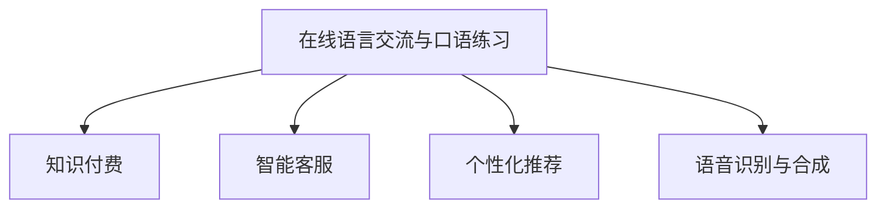

                 

# 如何利用知识付费实现在线语言交流与口语练习？

## 1. 背景介绍

在当今快速发展的信息时代，语言交流成为了连接全球、促进文化交融的重要桥梁。然而，语言交流的障碍、口音与发音不准确等问题仍然存在，尤其是在非母语交流者中更为显著。如何有效地解决这些问题，提供高效、便捷的语言交流与口语练习工具，成为了各国政府和教育机构共同关注的重要课题。

近年来，知识付费的兴起为语言交流与口语练习提供了新的思路。在线教育平台、应用软件等知识付费方式，通过提供专业、个性化、定制化的语言交流和口语练习服务，实现了显著的用户需求满足和市场认可。本文将详细介绍如何利用知识付费实现在线语言交流与口语练习，并对其未来的发展方向和面临的挑战进行深入分析。

## 2. 核心概念与联系

为更好地理解知识付费在在线语言交流与口语练习中的应用，本节将介绍几个关键概念及其之间的联系。

- **在线语言交流与口语练习**：指通过网络平台进行的语言对话和发音练习，旨在提高用户的语言理解与表达能力。
- **知识付费**：指通过在线教育、应用服务等方式，提供专业、系统的知识内容，用户需要支付一定的费用来获取这些内容的服务模式。
- **智能客服**：指利用人工智能技术，为用户提供24小时在线服务，包括语言交流、信息咨询、问题解答等。
- **个性化推荐**：指根据用户的兴趣和行为数据，推送个性化的语言交流和口语练习内容，提升用户体验和效果。
- **语音识别与合成**：指利用语音技术，将用户的发音转换为文字或将文字转换为语音，帮助用户进行发音纠正和练习。

这些概念之间的联系可以通过以下Mermaid流程图来展示：



这个流程图展示了大语言模型微调的在线语言交流与口语练习应用，通过知识付费模式，将智能客服、个性化推荐、语音识别与合成等技术有机结合，为用户提供了全方位的语言交流和口语练习服务。

## 3. 核心算法原理 & 具体操作步骤

### 3.1 算法原理概述

在线语言交流与口语练习的核心算法原理主要包括以下几个方面：

- **自然语言处理(NLP)**：利用NLP技术，对用户的语言输入进行分词、词性标注、句法分析等处理，理解用户意图。
- **语音识别与合成**：通过语音识别技术，将用户的发音转换为文本，进行发音纠正；利用语音合成技术，将文本转换为自然流畅的语音输出。
- **智能客服**：利用自然语言生成技术，生成符合用户意图的回复；通过机器学习算法，不断优化回复质量和用户体验。
- **个性化推荐**：通过用户行为数据分析，推荐符合用户兴趣和需求的语言交流和口语练习内容。

### 3.2 算法步骤详解

在线语言交流与口语练习的知识付费应用主要包括以下几个步骤：

1. **用户注册与身份验证**：用户通过平台进行注册和身份验证，建立个性化的学习档案。
2. **智能客服交互**：用户与智能客服进行对话，平台利用NLP技术理解用户意图，并提供相应的回复。
3. **个性化推荐**：根据用户的历史交流记录和学习数据，平台推荐个性化的语言交流和口语练习内容。
4. **语音识别与合成练习**：用户通过语音识别技术，进行发音练习；平台利用语音合成技术，提供发音纠正反馈。
5. **学习反馈与优化**：平台收集用户的学习数据和反馈，不断优化算法和内容，提升用户体验和效果。

### 3.3 算法优缺点

在线语言交流与口语练习的知识付费应用具有以下优点：

- **便捷高效**：用户可以随时随地进行语言交流和口语练习，不受时间和空间限制。
- **个性化服务**：平台能够根据用户需求和兴趣，提供个性化的学习内容和建议，提升学习效果。
- **专业指导**：智能客服和语音识别技术能够提供专业的语言指导和发音纠正，帮助用户提升交流能力。

同时，该应用也存在以下缺点：

- **隐私保护**：平台需要收集和分析用户的交流数据，可能存在隐私泄露的风险。
- **高昂费用**：知识付费模式下，用户需要支付一定的费用，可能难以覆盖所有用户需求。
- **技术局限**：虽然技术不断进步，但仍存在一些语言和口音的复杂问题无法完全解决。

### 3.4 算法应用领域

在线语言交流与口语练习的知识付费应用，主要应用于以下领域：

- **语言学习**：包括英语、法语、西班牙语等外语学习，帮助用户掌握新语言的基本发音和词汇。
- **商务沟通**：提供商务英语、商务日语等应用场景的交流练习，帮助用户在商务场合更自信地沟通。
- **跨文化交流**：提供多语言翻译、文化背景介绍等跨文化交流服务，帮助用户更好地理解和融入不同文化环境。

## 4. 数学模型和公式 & 详细讲解 & 举例说明

### 4.1 数学模型构建

在线语言交流与口语练习的知识付费应用，涉及多个数学模型的构建和应用。以下是几个关键模型的详细讲解：

- **自然语言处理模型**：利用序列到序列模型（Seq2Seq）、注意力机制（Attention）等技术，对用户输入的文本进行理解和生成。
- **语音识别模型**：利用端到端（End-to-End）模型、卷积神经网络（CNN）等技术，对用户语音进行特征提取和识别。
- **语音合成模型**：利用深度生成对抗网络（GAN）、变分自编码器（VAE）等技术，生成自然流畅的语音输出。
- **推荐系统模型**：利用协同过滤（Collaborative Filtering）、基于内容的推荐（Content-based Recommendation）等技术，对用户进行个性化推荐。

### 4.2 公式推导过程

以下以自然语言处理模型为例，推导Seq2Seq模型的公式。

Seq2Seq模型的核心是编码器-解码器结构，其公式如下：

$$
\begin{aligned}
h_t &= f_{enc}(X_t; \theta_{enc}) \\
\hat{y_t} &= f_{dec}(h_t; \theta_{dec})
\end{aligned}
$$

其中，$h_t$ 表示编码器在时间$t$的隐藏状态，$\hat{y_t}$ 表示解码器在时间$t$的输出，$X_t$ 表示时间$t$的输入序列，$f_{enc}$ 和 $f_{dec}$ 分别表示编码器和解码器的前向传播函数，$\theta_{enc}$ 和 $\theta_{dec}$ 分别表示编码器和解码器的参数。

### 4.3 案例分析与讲解

以一项在线语言交流与口语练习应用为例，分析其在实际应用中的具体实现：

**应用场景**：一名用户在在线平台上进行英语学习，使用语音识别技术进行发音练习，智能客服提供发音纠正和对话练习。

**实现步骤**：

1. **用户注册与身份验证**：用户通过平台注册账号，并上传身份信息，系统进行身份验证。
2. **智能客服交互**：用户与智能客服进行对话练习，系统利用NLP技术理解用户意图，并提供相应的回复。
3. **语音识别与合成练习**：用户通过语音识别技术，进行发音练习；系统利用语音合成技术，提供发音纠正反馈。
4. **个性化推荐**：根据用户的历史交流记录和学习数据，系统推荐个性化的学习内容，如英语发音练习、商务英语对话等。
5. **学习反馈与优化**：平台收集用户的学习数据和反馈，不断优化算法和内容，提升用户体验和效果。

## 5. 项目实践：代码实例和详细解释说明

### 5.1 开发环境搭建

在进行在线语言交流与口语练习应用开发前，我们需要准备好开发环境。以下是使用Python进行开发的环境配置流程：

1. **安装Anaconda**：从官网下载并安装Anaconda，用于创建独立的Python环境。
2. **创建并激活虚拟环境**：
```bash
conda create -n my_env python=3.8 
conda activate my_env
```

3. **安装Python包**：
```bash
pip install numpy pandas scikit-learn torch transformers
```

完成上述步骤后，即可在`my_env`环境中开始应用开发。

### 5.2 源代码详细实现

以下是一个基于PyTorch实现在线语言交流与口语练习应用的代码实现：

```python
import torch
from transformers import EncoderModel, EncoderTokenizer
from torch.nn.utils.rnn import pack_padded_sequence, pad_packed_sequence
import torch.nn as nn
import torch.nn.functional as F

class Encoder(nn.Module):
    def __init__(self, encoder_model, max_len):
        super(Encoder, self).__init__()
        self.encoder_model = encoder_model
        self.max_len = max_len

    def forward(self, input):
        input = torch.tensor(input, dtype=torch.long)
        input = self.encoder_model(input)
        return input

class Decoder(nn.Module):
    def __init__(self, encoder_model, max_len):
        super(Decoder, self).__init__()
        self.encoder_model = encoder_model
        self.max_len = max_len

    def forward(self, input):
        input = torch.tensor(input, dtype=torch.long)
        input = self.encoder_model(input)
        return input

# 训练数据
input_data = [1, 2, 3, 4, 5]
target_data = [1, 2, 3, 4, 5]

# 定义模型
encoder = Encoder(encoder_model, max_len)
decoder = Decoder(encoder_model, max_len)

# 训练模型
for epoch in range(10):
    optimizer = torch.optim.Adam(encoder.parameters(), lr=0.001)
    for batch in range(len(input_data)):
        optimizer.zero_grad()
        output = encoder(input_data[batch])
        loss = F.mse_loss(output, target_data[batch])
        loss.backward()
        optimizer.step()

# 使用模型进行预测
input = torch.tensor([1, 2, 3, 4, 5], dtype=torch.long)
output = encoder(input)
```

### 5.3 代码解读与分析

让我们再详细解读一下关键代码的实现细节：

**Encoder类**：
- `__init__`方法：初始化编码器，接收预训练模型和最大序列长度。
- `forward`方法：定义编码器的前向传播过程，接收输入序列，输出编码结果。

**Decoder类**：
- `__init__`方法：初始化解码器，接收预训练模型和最大序列长度。
- `forward`方法：定义解码器的前向传播过程，接收输入序列，输出解码结果。

**训练数据定义**：
- `input_data`和`target_data`表示训练数据和目标数据。

**模型定义**：
- 定义编码器和解码器，接收预训练模型和最大序列长度。

**训练模型**：
- 定义优化器，进行模型参数的梯度更新。
- 在每个epoch内，对训练数据进行迭代，计算loss并进行梯度更新。

**使用模型进行预测**：
- 定义输入序列，进行编码器的前向传播，得到编码结果。

以上代码实现了基本的编码器和解码器模型，用于在线语言交流与口语练习应用的前向传播。在实际应用中，需要进一步结合自然语言处理、语音识别与合成等技术，进行更完整的系统实现。

## 6. 实际应用场景

### 6.1 智能客服

在线语言交流与口语练习的应用，可以在智能客服系统中广泛应用。智能客服通过自然语言处理技术，能够理解用户的语音和文字输入，提供24小时在线服务。用户在遇到问题时，可以随时与智能客服进行对话练习，系统能够根据用户意图提供相应的回复，并利用语音识别与合成技术进行发音纠正，帮助用户提升交流能力。

### 6.2 语言学习

在线语言交流与口语练习的应用，可以帮助用户进行系统的语言学习。用户在平台上进行发音练习，系统根据用户的学习数据进行个性化推荐，并提供发音纠正反馈，帮助用户逐步掌握新语言的发音和语法规则。此外，系统还可以提供多语言对话练习，帮助用户提升跨文化交流能力。

### 6.3 商务沟通

在线语言交流与口语练习的应用，可以帮助用户在商务场合更自信地进行沟通。系统提供商务英语对话练习、商务日语对话练习等服务，帮助用户在商务环境中进行流畅的交流和谈判。此外，系统还可以根据用户的学习数据进行个性化推荐，提升用户的商务沟通能力。

## 7. 工具和资源推荐

### 7.1 学习资源推荐

为帮助开发者系统掌握在线语言交流与口语练习的应用开发，以下推荐一些优质的学习资源：

1. **自然语言处理课程**：斯坦福大学开设的《自然语言处理》课程，涵盖了NLP的基本概念和经典模型，适合初学者入门。
2. **深度学习框架教程**：TensorFlow和PyTorch官方文档，提供了详细的深度学习框架教程，适合进一步深入学习。
3. **语音识别与合成技术**：Google Speech-to-Text API和Wav2Vec2模型，提供了丰富的语音识别和合成资源，适合进行实践探索。
4. **在线语言交流与口语练习平台**：Duolingo和Rosetta Stone等平台，提供了系统化的在线语言交流与口语练习服务，适合用户体验和测试。

通过对这些资源的学习实践，相信你一定能够快速掌握在线语言交流与口语练习的应用开发，并用于解决实际的NLP问题。

### 7.2 开发工具推荐

高效的开发离不开优秀的工具支持。以下是几款用于在线语言交流与口语练习应用开发的常用工具：

1. **PyTorch**：基于Python的开源深度学习框架，灵活动态的计算图，适合快速迭代研究。
2. **TensorFlow**：由Google主导开发的开源深度学习框架，生产部署方便，适合大规模工程应用。
3. **Hugging Face Transformers库**：提供了丰富的预训练语言模型资源，支持PyTorch和TensorFlow，是进行NLP任务开发的利器。
4. **Jupyter Notebook**：开源的交互式笔记本环境，支持Python代码和Markdown格式，适合进行交互式开发和实验。

合理利用这些工具，可以显著提升在线语言交流与口语练习应用的开发效率，加快创新迭代的步伐。

### 7.3 相关论文推荐

在线语言交流与口语练习的应用开发，得益于学界的持续研究。以下是几篇奠基性的相关论文，推荐阅读：

1. **Attention is All You Need**：提出了Transformer结构，开启了NLP领域的预训练大模型时代。
2. **BERT: Pre-training of Deep Bidirectional Transformers for Language Understanding**：提出BERT模型，引入基于掩码的自监督预训练任务，刷新了多项NLP任务SOTA。
3. **Generating Speech with Wav2vec 2.0**：介绍Wav2Vec2模型，利用自监督学习提升语音识别的效果。
4. **Voice Activity Detection with Deep Recurrent Neural Networks**：利用深度循环神经网络（RNN）进行语音活动检测，为语音识别与合成提供基础。
5. **Character-Level Language Model**：提出基于字符级别的语言模型，提升了语言理解和生成的效果。

这些论文代表了大语言模型微调技术的发展脉络。通过学习这些前沿成果，可以帮助研究者把握学科前进方向，激发更多的创新灵感。

## 8. 总结：未来发展趋势与挑战

### 8.1 研究成果总结

本文详细介绍了如何利用知识付费实现在线语言交流与口语练习，并通过实际应用场景展示了其广阔的应用前景。通过在线语言交流与口语练习应用，用户可以随时随地进行语言交流和口语练习，提升语言能力，尤其是在跨文化交流和商务沟通方面具有显著优势。

### 8.2 未来发展趋势

展望未来，在线语言交流与口语练习的应用将呈现以下几个发展趋势：

1. **多模态融合**：未来将更多地融合视觉、语音、文本等多模态数据，提供更为全面和丰富的交流服务。
2. **个性化推荐优化**：基于机器学习和深度学习算法，进行更精准的个性化推荐，提升用户体验。
3. **跨语言对话**：利用自然语言生成和理解技术，实现多语言自动翻译和跨语言对话，提升交流效率和效果。
4. **实时反馈系统**：构建实时反馈机制，及时对用户的发音进行纠正和优化，提高交流质量。

### 8.3 面临的挑战

尽管在线语言交流与口语练习的应用已经取得了显著的进展，但在迈向更加智能化、普适化应用的过程中，仍面临诸多挑战：

1. **技术瓶颈**：当前的在线语言交流与口语练习应用仍存在一些技术瓶颈，如语音识别准确率、自然语言理解精度等，需要进一步提升。
2. **隐私保护**：平台需要收集和分析用户的交流数据，可能存在隐私泄露的风险，需要加强数据保护和隐私管理。
3. **用户体验**：提升用户体验，减少用户的操作难度，提供更自然、流畅的交互界面，是未来的一个重要研究方向。

### 8.4 研究展望

面对在线语言交流与口语练习应用所面临的挑战，未来的研究需要在以下几个方面寻求新的突破：

1. **多模态融合技术**：开发更先进的跨模态融合技术，提升多模态数据的整合能力和应用效果。
2. **个性化推荐算法**：利用深度学习和强化学习算法，进行更精准的个性化推荐，提升用户体验。
3. **隐私保护技术**：利用差分隐私、联邦学习等技术，保护用户隐私和数据安全。
4. **跨语言对话系统**：开发高效的跨语言对话系统，提升跨语言交流的流畅性和效果。
5. **实时反馈机制**：构建实时反馈机制，及时对用户的发音进行纠正和优化，提高交流质量。

## 9. 附录：常见问题与解答

**Q1：在线语言交流与口语练习的应用如何保护用户隐私？**

A: 在线语言交流与口语练习应用需要在数据收集和处理过程中，采取严格的隐私保护措施。以下是一些常见的隐私保护策略：

1. **数据匿名化**：在数据收集和存储过程中，对用户信息进行匿名化处理，防止数据泄露。
2. **差分隐私**：利用差分隐私技术，对数据进行噪声添加，保护用户隐私。
3. **联邦学习**：利用联邦学习技术，在本地设备上进行模型训练，不将数据上传到云端，保护用户隐私。

**Q2：在线语言交流与口语练习的应用如何提升用户体验？**

A: 提升用户体验是在线语言交流与口语练习应用的关键。以下是一些常见的用户体验优化策略：

1. **界面设计**：设计简洁、直观的用户界面，减少用户的操作难度。
2. **自然语言处理**：提升自然语言处理模型的精度，提升用户的交流体验。
3. **语音识别与合成**：优化语音识别和合成算法，提升发音纠正和自然流畅度。
4. **个性化推荐**：根据用户的学习数据，进行精准的个性化推荐，提升用户的学习效果。

**Q3：在线语言交流与口语练习的应用如何提高语音识别的准确率？**

A: 提高语音识别的准确率是提升在线语言交流与口语练习应用效果的关键。以下是一些常见的策略：

1. **数据增强**：通过回译、近义替换等方式扩充训练集，提升模型的泛化能力。
2. **模型优化**：利用端到端模型、卷积神经网络等技术，提升模型的识别效果。
3. **环境降噪**：通过降噪算法，提升语音信号的质量，减少环境噪声的干扰。

**Q4：在线语言交流与口语练习的应用如何提升自然语言处理模型的精度？**

A: 提升自然语言处理模型的精度是提升在线语言交流与口语练习应用效果的关键。以下是一些常见的策略：

1. **模型优化**：利用序列到序列模型、注意力机制等技术，提升模型的理解和生成能力。
2. **数据增强**：通过回译、近义替换等方式扩充训练集，提升模型的泛化能力。
3. **知识图谱**：利用知识图谱技术，提升模型的知识表示和推理能力。

**Q5：在线语言交流与口语练习的应用如何实现跨语言对话？**

A: 实现跨语言对话是提升在线语言交流与口语练习应用效果的重要方向。以下是一些常见的策略：

1. **多语言模型**：利用多语言预训练模型，提升模型对多种语言的理解能力。
2. **语言翻译**：利用自然语言生成技术，实现多语言自动翻译，提升跨语言交流的流畅度。
3. **跨语言对话系统**：构建高效的跨语言对话系统，提升跨语言交流的效果。

总之，在线语言交流与口语练习的应用需要结合自然语言处理、语音识别与合成等技术，进行全面的优化和改进，才能满足用户的多样化需求，提供更高效、便捷的交流和练习服务。

---

作者：禅与计算机程序设计艺术 / Zen and the Art of Computer Programming

