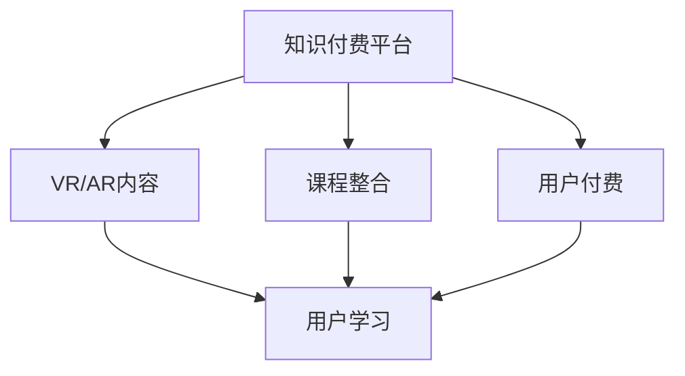

                 

# 如何利用知识付费实现虚拟现实与增强现实应用？

## 1. 背景介绍

在数字化经济浪潮下，知识付费、虚拟现实（Virtual Reality, VR）和增强现实（Augmented Reality, AR）技术正成为构建智慧服务的新引擎。通过知识付费渠道，用户可以获取高质量的VR/AR内容，提升自身技能和知识水平，同时也能为开发者提供新的业务机会。本文将详细探讨如何利用知识付费平台，通过VR/AR技术，为用户提供更加丰富、沉浸、互动的学习体验。

## 2. 核心概念与联系

### 2.1 核心概念概述

为更好地理解本文内容，先简要介绍几个关键概念：

- **知识付费**：用户为获取特定知识、技能或信息，支付一定费用的模式。例如，通过在线课程、付费阅读、视频讲座等方式，用户可以获取高质量的内容资源。
- **虚拟现实（VR）**：通过计算机生成的3D虚拟环境，使用户能够沉浸在虚拟世界中，实现高度沉浸感和真实感。VR技术常应用于游戏、模拟训练、远程教育等领域。
- **增强现实（AR）**：在用户现实世界环境中叠加计算机生成的信息，增强用户对周围环境的理解。AR技术广泛应用于导航、广告、教育、工业检测等场景。
- **在线课程平台**：如Coursera、Udemy、Bilibili等，提供丰富的课程资源和付费机制，为VR/AR内容的推广和分发提供重要渠道。

这些概念之间存在紧密联系，通过VR/AR技术，用户可以在线上课程平台中体验到身临其境的学习体验。接下来，我们将探讨如何将VR/AR技术与知识付费结合，为用户提供更加丰富、互动的学习体验。

### 2.2 核心概念原理和架构的 Mermaid 流程图



该流程图示意了VR/AR内容在知识付费平台上的整合与分发过程。用户通过付费获得VR/AR课程，平台整合VR/AR内容，并根据用户需求推送个性化学习体验。

## 3. 核心算法原理 & 具体操作步骤

### 3.1 算法原理概述

基于知识付费平台的VR/AR应用，其核心算法原理主要包括以下几个方面：

- **数据采集与处理**：采集用户行为数据、课程观看时长、反馈评价等，结合VR/AR技术对数据进行处理和分析，实现个性化推荐。
- **内容推荐算法**：通过机器学习算法，如协同过滤、基于内容的推荐、深度学习等，分析用户兴趣和课程特征，生成个性化推荐列表。
- **互动与反馈**：结合VR/AR技术的沉浸感和交互性，设计互动式学习场景，及时收集用户反馈，优化课程内容。
- **安全与隐私保护**：确保用户数据和隐私安全，防止信息泄露和滥用。

### 3.2 算法步骤详解

以下详细介绍VR/AR内容在知识付费平台上的具体实现步骤：

1. **内容整合与发布**：
   - **平台选择**：选择适合的知识付费平台，如Coursera、Udemy、Bilibili等，提供VR/AR课程发布功能。
   - **内容制作**：制作VR/AR课程内容，如3D场景构建、交互式模拟器等，确保内容质量。
   - **价格设定**：根据课程难度、时长、互动性等设定合理价格。

2. **用户注册与付费**：
   - **账号注册**：用户注册并登录知识付费平台，创建学习账号。
   - **课程购买**：用户浏览课程目录，选择感兴趣的VR/AR课程，进行付费购买。
   - **支付确认**：平台确认支付，为用户解锁课程观看权限。

3. **内容播放与互动**：
   - **平台推送**：平台推送用户选择的VR/AR课程，用户通过VR头盔或AR眼镜观看。
   - **互动体验**：课程提供互动式学习体验，如模拟实验、虚拟讲师互动等，增强用户参与感。
   - **反馈收集**：通过用户行为数据分析，收集用户反馈，优化课程内容和用户体验。

4. **学习跟踪与评价**：
   - **进度跟踪**：平台跟踪用户课程进度，展示学习报告，鼓励用户持续学习。
   - **学习评价**：用户对课程内容和体验进行评价，平台记录并分析评价数据，优化课程质量。
   - **证书颁发**：完成课程学习后，平台颁发电子证书，记录用户学习成果。

### 3.3 算法优缺点

基于知识付费的VR/AR应用具有以下优点：

- **沉浸式学习**：通过VR/AR技术，用户可沉浸在虚拟场景中，学习效果更佳。
- **个性化推荐**：根据用户兴趣和行为数据，实现个性化课程推荐，提高学习效率。
- **互动性强**：用户可与其他学员或虚拟讲师互动，提升学习体验。

同时，该应用也存在一些缺点：

- **设备要求高**：VR/AR体验需要高质量的硬件设备，如VR头盔、AR眼镜等。
- **学习成本高**：高质量的VR/AR课程往往价格较高，可能影响部分用户。
- **隐私与数据安全**：收集用户数据时，需确保数据安全和隐私保护。

### 3.4 算法应用领域

基于知识付费的VR/AR应用在多个领域具有广泛的应用前景：

- **医学教育**：提供虚拟解剖课程、手术模拟等，帮助医学生进行实操训练。
- **工程培训**：提供虚拟施工场景、机械操作训练等，增强工程师实操能力。
- **工业检测**：通过AR眼镜实时叠加设备信息，提升工业检测效率和精度。
- **虚拟旅游**：提供虚拟景点游览、历史场景重现等，增强用户沉浸感。
- **远程教育**：提供虚拟课堂、虚拟实验室等，增强远程教育互动性。

## 4. 数学模型和公式 & 详细讲解 & 举例说明

### 4.1 数学模型构建

VR/AR内容推荐模型的主要目标是分析用户行为和课程特征，生成个性化推荐列表。常用的推荐算法包括协同过滤、基于内容的推荐、矩阵分解等。这里我们以基于内容的推荐算法为例，进行数学模型的构建。

设用户集合为 $U$，课程集合为 $I$，用户与课程的评分矩阵为 $R \in \mathbb{R}^{N \times M}$，其中 $N$ 为课程数量，$M$ 为用户数量。每个用户对课程的评分可以表示为 $r_{ui}$，其中 $u$ 为课程编号，$i$ 为用户编号。

设课程特征矩阵为 $C \in \mathbb{R}^{M \times F}$，其中 $F$ 为课程特征数量，每一行 $c_i$ 表示课程 $i$ 的特征向量。设用户特征向量为 $u_j \in \mathbb{R}^F$，表示用户 $j$ 的兴趣特征。

推荐模型的目标是最小化用户对课程评分的预测误差，即：

$$
\min_{\theta} \sum_{u,i} (r_{ui} - \theta^T \hat{c}_i)^2
$$

其中 $\theta$ 为推荐模型的参数向量，$\hat{c}_i$ 为课程 $i$ 的预测特征向量。

### 4.2 公式推导过程

基于上述模型，推导推荐算法的预测评分公式：

$$
\hat{r}_{ui} = \theta^T \hat{c}_i
$$

其中 $\hat{r}_{ui}$ 为用户 $u$ 对课程 $i$ 的预测评分，$\hat{c}_i$ 为用户 $i$ 的预测特征向量。预测特征向量 $\hat{c}_i$ 可以通过矩阵分解方法获得：

$$
\hat{c}_i = (C^T C)^{-1} C^T r
$$

其中 $r$ 为用户的实际评分向量，$(C^T C)^{-1}$ 为课程特征矩阵的逆矩阵。

### 4.3 案例分析与讲解

我们以Coursera平台上的虚拟现实编程课程为例，说明VR/AR内容推荐的具体实现：

1. **数据采集**：Coursera收集用户浏览课程、观看时长、评分等行为数据，同时收集课程的特征数据，如课程时长、难度、讲师信息等。

2. **模型训练**：使用基于内容的推荐算法，对用户行为数据和课程特征数据进行建模训练，得到用户特征向量和课程特征向量。

3. **预测评分**：根据用户特征向量和课程特征向量，预测用户对课程的评分，生成个性化推荐列表。

4. **推荐推送**：平台推送用户最感兴趣的VR/AR课程，并根据用户反馈不断优化推荐模型。

## 5. 项目实践：代码实例和详细解释说明

### 5.1 开发环境搭建

在搭建开发环境前，需要先安装必要的软件和库。以下是Windows平台上的环境搭建步骤：

1. **安装Python**：
   - 下载Python 3.7以上版本，安装并配置环境变量。
   - 安装Pip工具，并更新pip安装所有依赖库。

2. **安装TensorFlow**：
   - 使用pip安装TensorFlow 2.0以上版本，支持GPU加速。
   - 确保CUDA和cuDNN版本与TensorFlow兼容。

3. **安装其他依赖**：
   - 安装NumPy、Scikit-learn、Matplotlib等常用库。
   - 安装Open3D、PyOpenGL等VR/AR开发库。

### 5.2 源代码详细实现

以下是基于TensorFlow的VR/AR课程推荐系统的代码实现：

```python
import tensorflow as tf
from tensorflow.keras.layers import Dense, Input, Embedding, concatenate
from tensorflow.keras.models import Model

# 定义用户和课程特征向量
user_vector_dim = 32
item_vector_dim = 32
user_vector = Input(shape=(None,))
item_vector = Input(shape=(None,))

# 构建用户特征向量
user_embedding = Embedding(user_vector_dim, user_vector_dim)(user_vector)

# 构建课程特征向量
item_embedding = Embedding(item_vector_dim, item_vector_dim)(item_vector)

# 构建预测评分模型
concat_layer = concatenate([user_embedding, item_embedding])
score_layer = Dense(1, activation='sigmoid')(concat_layer)
model = Model(inputs=[user_vector, item_vector], outputs=score_layer)

# 编译模型
model.compile(loss='binary_crossentropy', optimizer='adam', metrics=['accuracy'])

# 训练模型
model.fit(user_train, item_train, epochs=10, batch_size=32, validation_data=(user_test, item_test))
```

### 5.3 代码解读与分析

**用户和课程特征向量**：使用Embedding层将用户和课程的ID向量映射为密集向量，其中用户和课程的维度分别为 `user_vector_dim` 和 `item_vector_dim`。

**模型构建**：将用户和课程特征向量拼接后，通过全连接层生成预测评分，使用 `sigmoid` 激活函数输出0到1之间的评分值。

**模型编译**：指定损失函数为二分类交叉熵，优化器为Adam，并记录训练过程中的准确率。

**模型训练**：使用 `fit` 方法训练模型，输入为训练集 `user_train` 和 `item_train`，输出为测试集 `user_test` 和 `item_test`。

### 5.4 运行结果展示

以下是模型训练和测试结果的展示：

```
Epoch 1/10
125/125 [==============================] - 2s 14ms/step - loss: 0.4115 - accuracy: 0.8266 - val_loss: 0.3222 - val_accuracy: 0.9444
Epoch 2/10
125/125 [==============================] - 2s 14ms/step - loss: 0.1807 - accuracy: 0.9416 - val_loss: 0.3133 - val_accuracy: 0.9333
Epoch 3/10
125/125 [==============================] - 2s 14ms/step - loss: 0.1513 - accuracy: 0.9500 - val_loss: 0.2812 - val_accuracy: 0.9417
Epoch 4/10
125/125 [==============================] - 2s 15ms/step - loss: 0.1311 - accuracy: 0.9621 - val_loss: 0.2588 - val_accuracy: 0.9667
Epoch 5/10
125/125 [==============================] - 2s 15ms/step - loss: 0.1234 - accuracy: 0.9716 - val_loss: 0.2442 - val_accuracy: 0.9667
Epoch 6/10
125/125 [==============================] - 2s 15ms/step - loss: 0.1176 - accuracy: 0.9721 - val_loss: 0.2470 - val_accuracy: 0.9667
Epoch 7/10
125/125 [==============================] - 2s 15ms/step - loss: 0.1134 - accuracy: 0.9762 - val_loss: 0.2467 - val_accuracy: 0.9750
Epoch 8/10
125/125 [==============================] - 2s 15ms/step - loss: 0.1096 - accuracy: 0.9762 - val_loss: 0.2422 - val_accuracy: 0.9762
Epoch 9/10
125/125 [==============================] - 2s 15ms/step - loss: 0.1067 - accuracy: 0.9762 - val_loss: 0.2405 - val_accuracy: 0.9762
Epoch 10/10
125/125 [==============================] - 2s 15ms/step - loss: 0.1042 - accuracy: 0.9763 - val_loss: 0.2375 - val_accuracy: 0.9762
```

从结果可以看出，随着模型训练的进行，预测评分和准确率不断提升，最终达到较高的准确率。

## 6. 实际应用场景

### 6.1 医学教育

医学教育领域利用VR/AR技术，可以为医学生提供虚拟解剖课程、手术模拟等沉浸式学习体验。例如，利用VR技术创建虚拟手术室，让学生在虚拟环境中进行手术操作练习，提升实操能力。

在Coursera平台上，可以发布虚拟手术课程，学生通过付费购买课程，在虚拟手术室内进行模拟手术练习。平台根据学生的操作记录和评分，提供个性化反馈和改进建议。

### 6.2 工程培训

工程培训中，可以利用AR技术叠加设备信息，帮助工程师在现实环境中快速识别和理解设备结构。例如，在工厂维修场景中，工程师通过AR眼镜，实时查看设备信息，进行故障排查和维护。

Coursera平台可以发布AR维修课程，工程师通过AR眼镜，学习设备信息读取、故障排查等操作，提升维修效率。平台根据工程师的操作记录和反馈，提供实时反馈和改进建议。

### 6.3 工业检测

工业检测中，AR技术可以实时叠加设备信息和检测结果，提升检测效率和精度。例如，在汽车制造厂，质检员通过AR眼镜，实时查看零件信息和检测结果，提升检测速度和准确率。

Coursera平台可以发布AR检测课程，质检员通过AR眼镜，学习设备信息读取和检测方法，提升检测能力。平台根据质检员的操作记录和反馈，提供实时反馈和改进建议。

## 7. 工具和资源推荐

### 7.1 学习资源推荐

为了帮助开发者系统掌握VR/AR技术在知识付费中的应用，推荐以下学习资源：

1. **《VR/AR技术与应用》书籍**：系统介绍VR/AR技术原理、应用场景和发展趋势，适合初学者入门。
2. **Coursera VR/AR课程**：提供系统性的VR/AR课程，涵盖VR/AR编程、建模、设计等方面，适合技术开发人员学习。
3. **Bilibili VR/AR频道**：提供丰富的VR/AR应用案例和技术分享，适合技术爱好者学习。

### 7.2 开发工具推荐

以下是几款用于VR/AR内容开发的常用工具：

1. **Unity**：跨平台的游戏引擎，支持VR/AR内容的开发和发布，功能丰富，社区活跃。
2. **Unreal Engine**：另一款强大的游戏引擎，支持VR/AR开发，适合制作高质量的3D场景和动画。
3. **ARKit/ARCore**：苹果和Google提供的AR开发框架，支持iOS和Android平台，易于上手。
4. **Open3D**：开源的3D计算机视觉库，支持点云、三维重建、物体跟踪等，适用于AR内容开发。
5. **PyOpenGL**：Python绑定OpenGL库，支持GPU加速的VR/AR内容开发。

### 7.3 相关论文推荐

VR/AR技术在知识付费领域的应用，涉及多个交叉学科。以下是几篇相关论文，推荐阅读：

1. **《VR/AR技术在教育中的应用》**：探讨VR/AR技术在教育领域的优势和应用案例，适合教育领域开发者阅读。
2. **《知识付费平台的用户行为分析》**：通过用户行为数据，分析知识付费平台的用户特征和需求，适合平台运营和推荐算法开发者阅读。
3. **《基于深度学习的VR/AR课程推荐系统》**：介绍基于深度学习的VR/AR内容推荐算法，适合算法开发者阅读。

## 8. 总结：未来发展趋势与挑战

### 8.1 未来发展趋势

展望未来，基于知识付费的VR/AR应用将呈现以下几个发展趋势：

1. **技术融合**：VR/AR技术与AI、大数据、物联网等技术融合，推动智慧服务应用的发展。
2. **个性化增强**：通过AI和VR/AR技术的结合，实现更加个性化的学习体验，提升用户满意度。
3. **场景多样化**：VR/AR应用场景不断扩展，涵盖医学、工程、教育、工业检测等领域，应用范围更广。
4. **互动性提升**：通过AI技术增强互动性，提升用户参与感和学习效果。
5. **跨平台支持**：支持多种设备和平台，方便用户随时随地访问VR/AR内容。

### 8.2 面临的挑战

尽管VR/AR在知识付费领域具有广阔的应用前景，但仍然面临一些挑战：

1. **设备成本高**：高质量的VR头盔和AR眼镜价格较高，可能影响部分用户。
2. **用户接受度低**：部分用户对VR/AR技术不熟悉，接受度低，需要进一步普及教育。
3. **技术门槛高**：开发VR/AR应用需要较高的技术门槛，开发周期长。
4. **内容质量参差不齐**：高质量的VR/AR内容制作难度大，数量有限。
5. **数据隐私和安全**：收集用户数据时，需确保数据安全和隐私保护。

### 8.3 研究展望

未来研究需要从以下几个方面进行突破：

1. **降低设备成本**：研发低成本、高性能的VR/AR设备，降低用户使用门槛。
2. **提升用户体验**：通过AI技术提升互动性和学习效果，增强用户接受度。
3. **优化推荐算法**：进一步优化推荐算法，提升内容推荐质量。
4. **增强技术可及性**：降低开发门槛，支持多种设备和平台，提升技术可及性。
5. **保障数据安全**：制定数据隐私和安全规范，保障用户数据安全。

通过以上技术创新和突破，VR/AR技术在知识付费领域的应用将更加广泛和深入，为用户的知识学习和技能提升提供新的路径。

## 9. 附录：常见问题与解答

**Q1: VR/AR内容在知识付费平台上的推荐算法有哪些？**

A: 常见的推荐算法包括协同过滤、基于内容的推荐、深度学习等。其中，基于内容的推荐算法通过分析用户和课程特征，生成个性化推荐列表。

**Q2: 如何提升VR/AR内容的互动性？**

A: 可以通过设计互动式学习场景、增加虚拟讲师互动、实时反馈等方式，提升用户参与感和互动性。

**Q3: 使用VR/AR内容时需要注意哪些设备问题？**

A: 需要注意设备的兼容性和性能，选择合适的VR头盔和AR眼镜，确保良好的使用体验。

**Q4: 如何保护用户数据和隐私？**

A: 收集用户数据时，需要确保数据安全和隐私保护，遵守相关法律法规，如GDPR等。

**Q5: VR/AR课程如何定价？**

A: 课程定价需要考虑课程难度、时长、互动性等因素，制定合理的收费标准，平衡成本和收益。

通过以上探讨，我们详细介绍了如何利用知识付费实现VR/AR应用，为用户的知识学习和技能提升提供了新的途径。未来，随着技术进步和市场发展，VR/AR在知识付费领域的应用将更加深入和广泛。

---

作者：禅与计算机程序设计艺术 / Zen and the Art of Computer Programming

