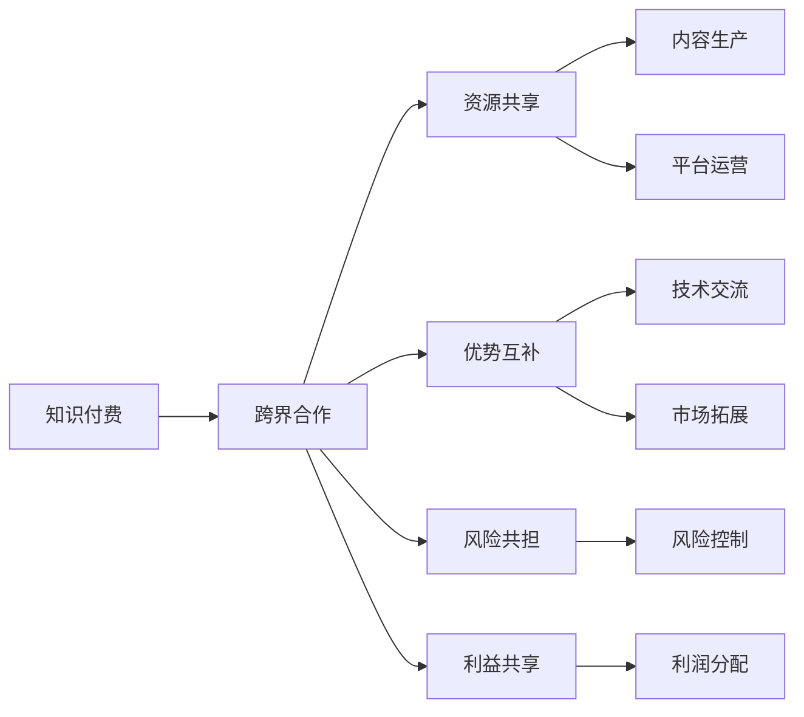

                 

# 如何利用知识付费实现跨界合作共赢？

## 1. 背景介绍

在数字化转型日益加速的今天，各行各业之间的界限变得越来越模糊。跨界合作已经成为提升竞争力的重要手段。而知识付费，作为信息经济的一种重要模式，正成为推动跨界合作的关键驱动力。本文将探讨如何利用知识付费，实现跨界合作的共赢。

## 2. 核心概念与联系

### 2.1 核心概念概述

1. **知识付费**：指通过付费方式获取专业知识和信息的服务模式。包括线上线下各种形式的知识产品，如文章、课程、讲座、咨询等。

2. **跨界合作**：指不同行业之间通过资源共享、优势互补等方式，进行战略合作，实现互利共赢。

3. **共赢**：指各方通过合作，实现资源共享、风险共担、利益共享，共同达到目标的状态。

### 2.2 核心概念原理和架构的 Mermaid 流程图



这个流程图展示了知识付费与跨界合作的联系，以及如何通过资源共享、优势互补、风险共担、利益共享，实现双方的共赢。

## 3. 核心算法原理 & 具体操作步骤

### 3.1 算法原理概述

利用知识付费实现跨界合作的原理，主要基于以下几个方面：

1. **知识资源共享**：知识付费平台提供的海量专业内容，为跨界合作提供了丰富的资源支持。
2. **优势互补**：不同行业在知识、技术、市场等方面存在差异，通过跨界合作，可以实现资源互补，提升整体竞争力。
3. **风险共担**：跨界合作中，各方共同承担项目风险，降低单个企业的不确定性。
4. **利益共享**：通过合理的利润分配机制，各方共享合作带来的收益。

### 3.2 算法步骤详解

1. **需求识别**：识别各方的需求和资源优势。例如，教育行业需要扩大市场，而技术公司需要推广技术应用。
2. **资源对接**：基于需求，对接相应的知识资源和技术资源。例如，教育机构通过知识付费平台，找到技术公司提供的服务。
3. **合作谈判**：各方就合作方式、利润分配、风险控制等进行详细谈判，达成共识。
4. **项目实施**：根据合作协议，启动项目实施，资源整合、技术集成、市场推广等。
5. **效果评估**：定期评估合作效果，调整优化合作策略，确保双方利益最大化。

### 3.3 算法优缺点

#### 优点

1. **提升效率**：通过知识付费，快速获取所需专业知识，提升项目实施效率。
2. **降低成本**：利用跨界合作，共享资源，降低单方成本。
3. **拓展市场**：跨界合作拓展新的市场和用户群体。
4. **促进创新**：不同行业之间的合作，可以催生新的商业模式和技术应用。

#### 缺点

1. **资源协调难度大**：不同行业在资源需求、技术能力、市场渠道等方面存在差异，协调难度较大。
2. **利益分配复杂**：合作各方利益诉求不同，难以达成一致的利益分配方案。
3. **风险管理复杂**：跨界合作中，涉及多方面的风险，管理难度较大。

### 3.4 算法应用领域

1. **教育与科技**：教育机构通过知识付费平台，获取科技公司的教育技术支持，提升教育质量。
2. **医疗与AI**：医疗机构利用AI公司的技术，提升诊疗效率，改善患者体验。
3. **零售与电商**：零售商通过知识付费平台，获取电商公司的营销和销售技术，拓展市场。
4. **金融与区块链**：金融机构借助区块链公司的技术，提升交易安全，降低成本。

## 4. 数学模型和公式 & 详细讲解 & 举例说明

### 4.1 数学模型构建

设知识付费平台的知识资源库为 $K$，技术公司的技术资源库为 $T$，双方的合作需求为 $D$，则知识付费与跨界合作的数学模型可表示为：

$$
\max_{D, K, T} \sum_{i \in K} \sum_{j \in T} p_{ij} x_{ij}
$$

其中，$p_{ij}$ 表示知识 $i$ 和技术 $j$ 的匹配度，$x_{ij}$ 表示知识 $i$ 和技术 $j$ 的整合度，$\max$ 表示各方利益最大化。

### 4.2 公式推导过程

假设知识付费平台有 $n$ 种知识资源 $K_1, K_2, ..., K_n$，技术公司有 $m$ 种技术资源 $T_1, T_2, ..., T_m$，合作需求为 $d$。则上述模型的优化目标可以表示为：

$$
\max_{K, T} \sum_{i=1}^n \sum_{j=1}^m p_{ij} x_{ij}
$$

其中，$p_{ij}$ 为知识 $i$ 和技术 $j$ 的匹配度，$x_{ij}$ 为知识 $i$ 和技术 $j$ 的整合度。

### 4.3 案例分析与讲解

以教育与科技合作为例，设知识付费平台提供教育技术支持（如AI辅助教学、在线课程等），技术公司提供技术开发和支持（如开发教育应用、提供技术咨询等）。合作需求为提升教育质量、扩大市场覆盖。

合作过程中，双方需要进行多次沟通和协调，以确定知识和技术资源的整合方式和优先级。通过优化上述模型，可以找到最优的资源整合方案，实现双方的共赢。

## 5. 项目实践：代码实例和详细解释说明

### 5.1 开发环境搭建

1. **知识付费平台**：搭建基于云服务的知识付费平台，如Udemy、Coursera等。
2. **技术公司**：提供AI、SaaS等技术支持，如Google Cloud、Microsoft Azure等。
3. **合作伙伴**：选择具有较强合作意愿和资源优势的合作伙伴，如大型教育机构、医疗机构等。

### 5.2 源代码详细实现

1. **知识付费平台**：开发知识付费平台，提供课程、文章、讲座等知识资源。使用技术如Flask、Django、MongoDB等，实现用户注册、课程管理、支付结算等功能。
2. **技术公司**：提供技术支持，开发教育应用、AI辅助工具等。使用技术如React、Node.js、TensorFlow等，实现应用开发、数据处理、模型训练等功能。
3. **合作伙伴**：选择合作伙伴，如教育机构、医疗机构等。通过接口调用，实现知识和技术资源的整合。

### 5.3 代码解读与分析

以知识付费平台的开发为例，主要代码实现如下：

```python
from flask import Flask, render_template, request

app = Flask(__name__)

@app.route('/')
def index():
    return render_template('index.html')

@app.route('/register', methods=['POST'])
def register():
    username = request.form['username']
    password = request.form['password']
    # 调用知识付费平台接口进行用户注册
    # ...

@app.route('/login', methods=['POST'])
def login():
    username = request.form['username']
    password = request.form['password']
    # 调用知识付费平台接口进行用户登录
    # ...

@app.route('/course', methods=['GET'])
def course():
    course_id = request.args.get('id')
    # 调用知识付费平台接口获取课程信息
    # ...
```

以上代码展示了Flask框架的基本用法，实现了用户注册、登录和课程查询功能。开发过程中，需要注意接口调用的安全性、可靠性和性能优化。

### 5.4 运行结果展示

通过知识付费平台，合作伙伴可以获取所需知识资源和技术支持。例如，教育机构通过知识付费平台获取AI辅助教学工具，提升了教学效果和学生满意度。技术公司通过与教育机构的合作，扩展了市场，提高了品牌知名度。

## 6. 实际应用场景

### 6.1 教育与科技

通过知识付费平台，教育机构可以获取科技公司的教育技术支持，提升教学质量，扩大市场覆盖。科技公司也可以通过教育机构的平台，推广技术应用，提升自身品牌价值。

### 6.2 医疗与AI

医疗机构利用AI公司的技术，提升诊疗效率，改善患者体验。AI公司通过与医疗机构的合作，获取临床数据，优化算法模型，提升技术应用效果。

### 6.3 零售与电商

零售商通过知识付费平台，获取电商公司的营销和销售技术，拓展市场，提升销售额。电商公司通过与零售商的合作，推广技术应用，扩大市场覆盖。

### 6.4 金融与区块链

金融机构借助区块链公司的技术，提升交易安全，降低成本。区块链公司通过与金融机构的合作，获取大量数据，优化算法，提升技术应用效果。

## 7. 工具和资源推荐

### 7.1 学习资源推荐

1. **知识付费平台**：Udemy、Coursera、网易云课堂等。
2. **技术公司**：Google Cloud、Microsoft Azure、AWS等。
3. **合作伙伴**：教育机构、医疗机构、零售商等。

### 7.2 开发工具推荐

1. **知识付费平台**：Flask、Django、MongoDB等。
2. **技术公司**：React、Node.js、TensorFlow等。
3. **合作伙伴**：API接口、云服务、数据管理等工具。

### 7.3 相关论文推荐

1. **知识付费与跨界合作**：《Cross-domain Knowledge Sharing in the Age of AI》（中国科学院）
2. **平台技术架构**：《Architecture of Large-scale Online Education Platforms》（MIT Press）
3. **AI技术应用**：《AI for Medical Diagnosis and Treatment》（IEEE）

## 8. 总结：未来发展趋势与挑战

### 8.1 研究成果总结

知识付费与跨界合作已经成为推动各行各业发展的关键驱动力。通过资源共享、优势互补、风险共担、利益共享，实现跨界合作的共赢，成为企业的战略选择。

### 8.2 未来发展趋势

1. **技术融合加速**：未来跨界合作将更多地融合人工智能、区块链、物联网等新兴技术，提升合作效率和效果。
2. **市场范围扩大**：通过知识付费平台，跨界合作的范围将进一步扩大，涵盖更多行业和应用场景。
3. **合作模式创新**：探索新的合作模式，如知识共享、技术授权、平台联盟等，推动合作深入发展。

### 8.3 面临的挑战

1. **数据隐私和安全**：跨界合作中，涉及大量敏感数据，如何保障数据隐私和安全是主要挑战。
2. **利益分配公平**：各方的利益诉求不同，如何公平分配收益，是跨界合作的难点。
3. **合作机制规范**：制定标准化的合作机制，规范合作流程和行为，保障合作顺利进行。

### 8.4 研究展望

未来，需要在数据隐私、利益分配、合作机制等方面进行深入研究，推动知识付费与跨界合作的深入发展，实现各方共赢。

## 9. 附录：常见问题与解答

**Q1：知识付费与跨界合作是否适用于所有行业？**

A: 知识付费与跨界合作适用于大多数行业，但不同行业在需求和资源方面存在差异。需要根据具体情况，选择合适的合作伙伴和资源整合方式。

**Q2：如何进行有效的利益分配？**

A: 利益分配需要考虑各方贡献、市场价值、收益预期等因素。可以采用股权、分成、服务费等多种方式，根据具体情况进行灵活设计。

**Q3：如何保障数据隐私和安全？**

A: 可以通过数据加密、访问控制、审计日志等方式，保障数据隐私和安全。需要制定明确的数据使用和共享协议，确保数据合规使用。

**Q4：如何应对跨界合作的挑战？**

A: 需要建立标准化合作机制，规范合作流程和行为，制定明确的利益分配和风险控制机制，保障合作的顺利进行。

---

作者：禅与计算机程序设计艺术 / Zen and the Art of Computer Programming

