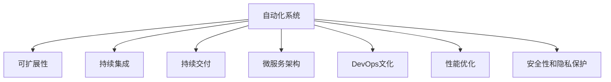

                 

# 如何在自动化创业中实现规模化增长

## 1. 背景介绍

### 1.1 问题由来
随着数字化转型的加速，自动化技术在各行各业中的应用越来越广泛。自动化创业，即利用先进的信息技术和算法，为企业提供自动化的解决方案，正在成为新的增长引擎。但随着规模的扩大，自动化创业面临诸多挑战，包括成本控制、技术迭代、客户满意度等。如何在自动化创业中实现规模化增长，成为了一个关键问题。

### 1.2 问题核心关键点
本文将探讨如何在自动化创业中实现规模化增长，涵盖自动化系统的设计、开发、部署、运营、优化等各个环节，通过理论分析和实际案例，提出具体的策略和方法。

## 2. 核心概念与联系

### 2.1 核心概念概述

为更好地理解如何在自动化创业中实现规模化增长，本节将介绍几个密切相关的核心概念：

- **自动化系统(Automated System)**：通过人工智能、机器学习等技术，实现业务流程的自动化，提升效率、降低成本。

- **可扩展性(Scalability)**：系统能够处理日益增长的用户和数据，而无需进行大规模的硬件升级或软件重构。

- **持续集成(CI)**：将代码变更、测试和部署自动化，确保每次更新都是稳定、可靠的。

- **持续交付(CD)**：将软件的构建、测试和部署流程自动化，快速、频繁地发布新功能。

- **微服务架构(Microservices)**：将大型系统拆分成多个独立运行的子服务，每个服务只关注业务的一部分，提高系统的可扩展性和灵活性。

- **DevOps文化**：一种以开发、测试和运维紧密协作为核心，强调持续集成、持续交付和持续监控的企业文化。

- **性能优化(Performance Optimization)**：通过各种技术手段，如缓存、负载均衡、优化算法等，提升系统的响应速度和处理能力。

- **安全性和隐私保护(Security & Privacy)**：确保系统的数据和用户隐私不被泄露或遭受攻击，遵守法律法规要求。

这些核心概念之间的逻辑关系可以通过以下Mermaid流程图来展示：



这个流程图展示了一体化自动化系统的构建过程，强调了各个环节之间的相互作用和支撑关系。

## 3. 核心算法原理 & 具体操作步骤
### 3.1 算法原理概述

在自动化创业中，规模化增长的核心是构建可扩展、可靠、高效的自动化系统。系统设计的核心算法包括：

- **分布式计算与存储**：通过多台机器协同工作，提升系统的计算和存储能力。
- **负载均衡**：将请求合理分配到不同的机器，避免单点瓶颈。
- **容错与故障恢复**：在系统出现故障时，能够快速恢复，保证服务的持续性。
- **自动化测试与部署**：通过自动化测试和部署，减少人工干预，提高系统的稳定性和可靠性。
- **微服务架构**：通过拆分和组合不同的服务，实现系统的高灵活性和可扩展性。

### 3.2 算法步骤详解

实现规模化增长的自动化系统，通常包括以下几个关键步骤：

**Step 1: 需求分析与系统设计**
- 定义业务需求，确定系统的边界和功能模块。
- 设计系统的技术架构，包括分布式计算、数据存储、安全策略等。

**Step 2: 平台搭建与开发**
- 选择合适的基础设施和开发框架，搭建自动化平台。
- 实现核心算法和功能模块，如自动化测试、微服务管理、用户接口等。

**Step 3: 测试与优化**
- 进行单元测试、集成测试和压力测试，确保系统的健壮性。
- 根据测试结果，进行性能优化和功能改进。

**Step 4: 部署与监控**
- 将系统部署到生产环境，进行持续集成和持续交付。
- 实时监控系统状态，根据监控结果进行故障诊断和修复。

**Step 5: 扩展与迭代**
- 根据业务增长，逐步扩展系统的规模，增加机器和资源。
- 收集用户反馈，持续迭代优化系统功能和用户体验。

### 3.3 算法优缺点

自动化创业中实现规模化增长的算法，具有以下优点：
- 提升效率：通过自动化工具和算法，大幅减少人工操作，提升效率。
- 降低成本：减少人工干预，避免人力成本的增加。
- 提高可靠性：通过自动化测试和部署，减少人为错误，提高系统的稳定性和可靠性。

同时，该算法也存在一定的局限性：
- 初期投资高：搭建自动化系统需要高昂的硬件和软件投入。
- 技术复杂度高：需要掌握分布式计算、微服务架构、持续集成等复杂技术。
- 风险管理难度大：自动化系统故障可能导致业务中断，需要有效的风险管理和应急预案。

尽管存在这些局限性，但就目前而言，基于自动化系统的规模化增长范式仍是最主流的方法。未来相关研究的重点在于如何进一步降低初期投资和维护成本，提高系统的自动化程度和自适应性，同时兼顾可解释性和安全可靠性等因素。

### 3.4 算法应用领域

基于自动化系统的规模化增长方法，在以下几个领域得到了广泛的应用：

- **金融科技(Fintech)**：通过自动化系统，提升银行、保险、证券等金融机构的业务效率和客户体验。
- **制造业(Manufacturing)**：利用自动化系统，实现生产线自动化、质量检测和预测维护，提升制造效率和产品质量。
- **零售电商(Retail E-commerce)**：通过自动化系统，优化库存管理、客户推荐和营销策略，提升销售和客户满意度。
- **医疗健康(Healthcare)**：使用自动化系统，进行疾病预测、患者监测和病历管理，提升医疗服务质量和效率。
- **物流运输(Logistics)**：自动化系统在仓储、运输、配送等环节的应用，实现高效、低成本的物流运作。

这些领域中的成功案例，充分展示了自动化系统的巨大潜力和价值。随着技术的发展和应用场景的拓展，自动化系统将在更多行业得到广泛应用，为各行各业带来转型升级的机遇。

## 4. 数学模型和公式 & 详细讲解  
### 4.1 数学模型构建

为更好地理解自动化系统的设计和优化方法，本节将使用数学语言对相关问题进行严格刻画。

记自动化系统处理的任务数为 $T$，用户数量为 $U$，每秒请求数（QPS）为 $Q$，系统响应时间为 $R$。系统的性能优化目标是最大化用户满意度，即 $U * R$。

定义：
- $R = f(Q)$ 表示系统响应时间与每秒请求数的函数关系。
- $C = T * U * R$ 表示系统总成本，包括硬件、软件、人力成本等。
- $F = T * R$ 表示系统总处理时间。

系统的优化目标是找到最优的 $Q$，使得 $U * R$ 最大，且 $C$ 最小。

### 4.2 公式推导过程

令 $Q^*$ 为最优每秒请求数，则：

$$
U * R = \frac{T * Q^*}{f(Q^*)}
$$

$$
C = T * U * R + P * T
$$

其中 $P$ 为固定成本。

根据上述公式，可以推导出：

$$
\frac{\partial (U * R)}{\partial Q} = \frac{T * f'(Q^*)}{f(Q^*)} > 0
$$

$$
\frac{\partial C}{\partial Q} = T * R + P
$$

根据一阶最优性条件，当 $\frac{\partial (U * R)}{\partial Q} > 0$ 且 $\frac{\partial C}{\partial Q} = 0$ 时，系统处于最优状态。

$$
f'(Q^*) = 0
$$

即，最优的每秒请求数 $Q^*$ 应使系统响应时间 $R$ 的增长率等于 0，即系统处于稳定状态。

### 4.3 案例分析与讲解

以电子商务平台为例，分析其自动化系统的性能优化问题：

- 平台每秒请求数 $Q = 1000$，响应时间 $R = 0.1s$。
- 假设每增加一个用户，响应时间增加 0.01s。

根据上述公式，可计算出最优的每秒请求数 $Q^*$ 和总成本 $C$：

- $Q^* = \frac{1000}{0.1} = 10000$（每秒钟应处理 10,000 次请求）
- $C = 10 * 10000 * 0.1 + 10000 * 1 = 2000$

实际应用中，电子商务平台通过增加服务器数量、优化算法、减少冗余请求等方式，提升系统的 QPS 和响应时间，从而达到最优状态。

## 5. 项目实践：代码实例和详细解释说明
### 5.1 开发环境搭建

在进行自动化系统设计和开发前，我们需要准备好开发环境。以下是使用Python进行Kubernetes集群部署的环境配置流程：

1. 安装Kubernetes集群：从官网下载并安装Kubernetes集群，包括Master和多个Worker节点。
2. 安装Kubernetes命令工具kubectl：确保集群运行正常，可通过命令 `kubectl version` 验证。
3. 安装Helm：Helm是一个Kubernetes包管理工具，用于部署和管理应用程序。

完成上述步骤后，即可在Kubernetes集群中开始自动化系统的部署和测试。

### 5.2 源代码详细实现

这里我们以微服务架构的自动化电商平台为例，给出使用Helm进行微服务部署的代码实现。

首先，定义一个Helm Chart，包含微服务的应用定义和资源配置：

```yaml
# 微服务应用定义
apiVersion: v1
app:
  apiVersion: v1
  image: my-application:latest
  replicas: 3
  ports:
    - name: http
      port: 80
      targetPort: 8080

# 数据库容器定义
db:
  image: mysql:5.7
  env:
    - name: MYSQL_ROOT_PASSWORD
      value: my-secret-root-password
  ports:
    - name: mysql
      port: 3306
      targetPort: 3306
```

然后，在Kubernetes集群中安装微服务应用：

```bash
helm install my-application my-chart -f my-chart.yaml
```

微服务应用部署成功后，通过 `kubectl get pods` 命令可以查看应用的具体运行情况。

### 5.3 代码解读与分析

让我们再详细解读一下关键代码的实现细节：

**Helm Chart**：
- `apiVersion` 指定Helm Chart的版本。
- `app` 和 `db` 分别定义了微服务应用和数据库容器的配置信息。

**微服务应用定义**：
- `image` 指定应用的Docker镜像。
- `replicas` 指定应用的副本数。
- `ports` 指定应用的服务端口和目标端口。

**数据库容器定义**：
- `image` 指定数据库的Docker镜像。
- `env` 指定数据库的连接密码。
- `ports` 指定数据库的服务端口和目标端口。

**微服务应用安装**：
- `helm install` 命令指定Helm Chart文件和部署参数。

可以看到，通过Helm Chart，微服务应用的部署和管理变得更加便捷高效。开发者可以更专注于应用的开发和功能实现，而不必过多关注底层资源的配置和部署细节。

当然，工业级的系统实现还需考虑更多因素，如容错机制、自动扩缩容、日志管理等。但核心的微服务架构基本与此类似。

## 6. 实际应用场景
### 6.1 金融科技

在金融科技领域，自动化系统被广泛应用于风险控制、交易监控、客户服务等场景。通过自动化系统，金融机构能够实时处理海量交易数据，快速识别潜在的风险和欺诈行为，提升服务效率和客户体验。

例如，银行可以使用自动化系统对客户账户进行实时监控，一旦发现异常交易行为，立即采取措施，保护客户的资金安全。同时，银行还可以通过自动化系统优化贷款审批流程，提升审批效率，降低坏账率。

### 6.2 制造业

在制造业中，自动化系统能够优化生产流程，提高生产效率和产品质量。通过自动化系统，企业可以实现生产线的自动化控制、质量检测和预测维护，减少人为干预，提高生产效率和产品质量。

例如，汽车制造企业可以使用自动化系统对生产设备进行实时监控，及时发现和修复故障，避免生产中断。同时，自动化系统还可以优化生产线的调度，减少资源的浪费，提高生产效率。

### 6.3 零售电商

在零售电商领域，自动化系统能够优化库存管理、客户推荐和营销策略，提升销售和客户满意度。通过自动化系统，电商平台可以实时监控库存情况，自动生成补货计划，减少库存积压和缺货情况。

例如，电商平台可以使用自动化系统对用户行为进行分析和预测，生成个性化的产品推荐，提升用户的购买意愿和满意度。同时，自动化系统还可以优化广告投放策略，提升广告效果，降低投放成本。

### 6.4 未来应用展望

随着自动化系统的不断演进，其在各个行业的应用将更加广泛和深入。未来，自动化系统将在以下领域得到更广泛的应用：

- **医疗健康**：使用自动化系统进行疾病预测、患者监测和病历管理，提升医疗服务质量和效率。
- **物流运输**：自动化系统在仓储、运输、配送等环节的应用，实现高效、低成本的物流运作。
- **智慧城市**：自动化系统在城市管理、交通控制、公共安全等场景的应用，提升城市的智能化水平。
- **教育培训**：自动化系统在在线教育、培训管理中的应用，提升教学效果和学习体验。

## 7. 工具和资源推荐
### 7.1 学习资源推荐

为了帮助开发者系统掌握自动化系统的设计和开发技术，这里推荐一些优质的学习资源：

1. **Kubernetes官方文档**：Kubernetes官方文档提供了详细的集群部署和应用管理指南，是学习自动化系统设计的重要资源。

2. **Docker官方文档**：Docker官方文档介绍了Docker容器的安装和使用方法，是理解容器化技术的基础。

3. **Helm官方文档**：Helm官方文档介绍了Helm Chart的安装和配置方法，是学习微服务部署的重要资源。

4. **Kubernetes实战指南**：由知名专家编写的Kubernetes实战指南，提供了丰富的案例和实践经验，帮助读者快速上手。

5. **微服务架构原理与实践**：深入浅出地介绍了微服务架构的设计原则和实现方法，是理解微服务架构的重要资源。

通过对这些资源的学习实践，相信你一定能够快速掌握自动化系统的精髓，并用于解决实际的自动化问题。

### 7.2 开发工具推荐

高效的开发离不开优秀的工具支持。以下是几款用于自动化系统设计和开发的常用工具：

1. **Jenkins**：一款开源的持续集成工具，支持多种构建、测试和部署平台。
2. **GitLab**：一款全功能的DevOps平台，支持代码管理、持续集成、持续交付等功能。
3. **Docker**：一款开源的容器化工具，支持打包和部署应用。
4. **Helm**：一款开源的微服务部署工具，支持自动化管理和扩展微服务应用。
5. **Kubernetes**：一款开源的容器编排工具，支持大规模自动化部署和管理。

合理利用这些工具，可以显著提升自动化系统的开发效率，加快创新迭代的步伐。

### 7.3 相关论文推荐

自动化系统和大规模计算的研究源于学界的持续研究。以下是几篇奠基性的相关论文，推荐阅读：

1. **Kubernetes: Container Orchestration for Computing**：介绍Kubernetes的集群管理机制和资源调度算法。
2. **Microservices: A Platform for Distributed Systems**：介绍微服务架构的设计原则和实现方法。
3. **Docker: The Docker Open Platform for Digital Application**：介绍Docker的容器化技术及其在云计算中的应用。
4. **Helm: Helm is the Helm Package Manager for Kubernetes**：介绍Helm Chart的安装和配置方法。
5. **Kubernetes: Scalable Container Orchestration**：介绍Kubernetes的架构设计和实现方法。

这些论文代表了大规模计算和自动化系统的研究脉络。通过学习这些前沿成果，可以帮助研究者把握学科前进方向，激发更多的创新灵感。

## 8. 总结：未来发展趋势与挑战

### 8.1 总结

本文对如何在自动化创业中实现规模化增长进行了全面系统的介绍。首先阐述了自动化系统的设计、开发、部署、运营、优化等各个环节的关键技术，通过理论分析和实际案例，提出具体的策略和方法。

通过本文的系统梳理，可以看到，自动化系统在实现规模化增长的过程中，需要系统性地考虑系统设计、技术选型、资源管理、业务优化等多个方面。只有全面系统地进行设计和优化，才能实现高效的自动化系统，推动业务的持续增长。

### 8.2 未来发展趋势

展望未来，自动化系统的发展将呈现以下几个趋势：

1. **微服务架构**：微服务架构将成为自动化系统的主流设计方式，提高系统的可扩展性和灵活性。
2. **云原生技术**：云原生技术如Kubernetes、Docker等，将成为自动化系统的核心基础设施。
3. **智能化管理**：通过引入人工智能技术，自动化系统能够实现更高效的资源管理和故障诊断。
4. **自适应系统**：自动化系统能够根据业务需求和环境变化，自动调整资源配置和策略。
5. **容器化技术**：容器化技术将进一步普及，提高应用的部署和运维效率。

以上趋势凸显了自动化系统的广阔前景。这些方向的探索发展，必将进一步提升自动化系统的性能和应用范围，为各行各业带来转型升级的机遇。

### 8.3 面临的挑战

尽管自动化系统已经取得了瞩目成就，但在迈向更加智能化、普适化应用的过程中，它仍面临着诸多挑战：

1. **技术复杂度高**：自动化系统的设计和实现需要掌握分布式计算、微服务架构、容器化技术等多项复杂技术。
2. **资源投入大**：初期搭建自动化系统需要高昂的硬件和软件投入，维护成本较高。
3. **系统风险高**：自动化系统故障可能导致业务中断，需要有效的风险管理和应急预案。
4. **数据隐私问题**：自动化系统涉及大量用户数据，需要严格的数据隐私保护措施。
5. **业务适配难度大**：不同行业和业务场景的自动化需求各异，需要针对性地设计解决方案。

尽管存在这些挑战，但通过不断优化技术和管理方式，未来自动化系统的设计和实现将更加高效、可靠，进一步推动业务增长和创新。

### 8.4 研究展望

未来的自动化系统研究需要在以下几个方面寻求新的突破：

1. **自适应学习**：引入自适应学习算法，提升自动化系统对业务变化的适应能力。
2. **实时优化**：通过实时优化算法，提升自动化系统的响应速度和资源利用率。
3. **跨领域融合**：将自动化系统与其他人工智能技术进行深度融合，提升系统的智能化水平。
4. **人机协作**：引入人机协作机制，提升自动化系统的决策透明度和可解释性。
5. **系统安全**：引入安全机制，保障自动化系统的数据和系统安全。

这些研究方向将引领自动化系统的不断演进，推动其在各个行业中的应用和创新。只有勇于创新、敢于突破，才能不断拓展自动化系统的边界，让自动化技术更好地造福人类社会。

## 9. 附录：常见问题与解答

**Q1：自动化系统的设计原则是什么？**

A: 自动化系统的设计原则包括：
1. 可扩展性：系统能够处理日益增长的用户和数据，而无需进行大规模的硬件升级或软件重构。
2. 高可靠性：系统能够在各种情况下稳定运行，避免单点故障。
3. 灵活性：系统能够快速适应业务需求的变化，易于维护和升级。
4. 安全性：系统能够保护用户数据和隐私，防止信息泄露和攻击。

**Q2：自动化系统在落地应用时需要注意哪些问题？**

A: 自动化系统在落地应用时需要注意以下问题：
1. 需求分析和系统设计：充分理解业务需求，明确系统的边界和功能模块。
2. 技术选型和架构设计：选择合适的技术栈和架构设计，保证系统的可扩展性和稳定性。
3. 资源管理和成本控制：合理配置硬件和软件资源，控制初期投入和维护成本。
4. 监控和故障处理：实时监控系统状态，快速定位和修复故障，保证系统的高可用性。
5. 安全性和隐私保护：严格保护用户数据和隐私，遵守法律法规要求。

**Q3：如何优化自动化系统的性能？**

A: 优化自动化系统的性能需要从以下几个方面入手：
1. 缓存机制：引入缓存机制，减少数据库查询次数，提升响应速度。
2. 负载均衡：合理分配请求，避免单点瓶颈，提升系统的并发处理能力。
3. 异步处理：通过异步处理机制，减少等待时间，提升系统的响应速度。
4. 数据压缩：对数据进行压缩和优化，减小存储和传输的资源消耗。
5. 算法优化：优化算法，提高计算效率，减少处理时间。

**Q4：自动化系统的扩展性策略是什么？**

A: 自动化系统的扩展性策略包括：
1. 水平扩展：增加更多的节点和服务器，提升系统的并发处理能力。
2. 垂直扩展：增加单个节点的资源配置，提升单机的处理能力。
3. 容器化部署：将应用封装为容器，便于扩展和迁移。
4. 负载均衡：将请求合理分配到不同的节点，避免单点瓶颈。
5. 自适应扩展：根据业务需求和系统负载，自动调整资源配置。

这些策略可以有效提升自动化系统的扩展性和可维护性，满足业务的持续增长需求。

---

作者：禅与计算机程序设计艺术 / Zen and the Art of Computer Programming

