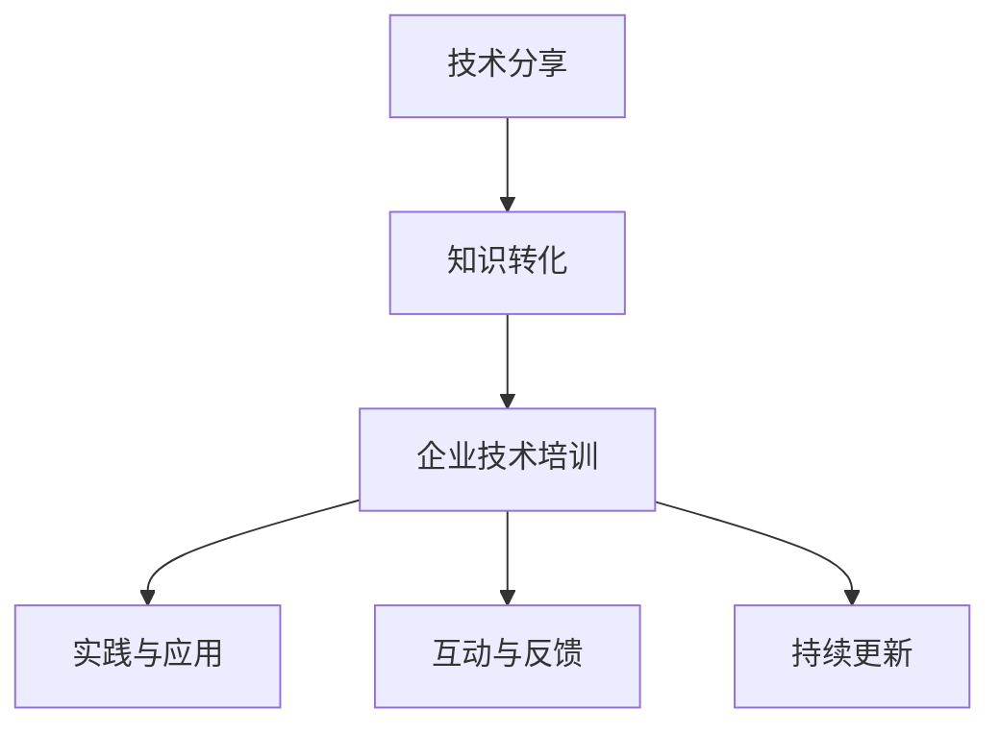

                 

# 如何将技术分享转化为企业技术培训

在当今技术飞速发展的时代，企业的技术培训已经成为推动企业持续创新和提高竞争力的关键环节。然而，如何将前沿的技术分享真正转化为具有实际应用价值的培训内容，是一项复杂而富有挑战性的任务。本文将从背景介绍、核心概念与联系、核心算法原理与操作步骤、数学模型和公式、项目实践、实际应用场景、工具和资源推荐、总结、未来发展趋势与挑战以及附录等多个方面，全面探讨如何将技术分享转化为企业技术培训，希望能为企业技术培训的实践提供有益的参考。

## 1. 背景介绍

### 1.1 问题由来
随着技术日新月异，企业员工需要不断学习和适应新的技术，以保持其竞争力。但仅靠传统的课堂培训和学习资料，往往难以满足员工对前沿技术需求的紧迫性和多样性。技术分享，如会议、讲座、文章等，尽管内容丰富、更新迅速，但其形式较为松散，不易转化为系统化和结构化的培训课程。

### 1.2 问题核心关键点
本文聚焦于如何将技术分享的内容，系统化、结构化地转化为企业技术培训。主要包括以下几个关键点：
1. 系统化课程设计：将技术分享内容整理成系统化的课程结构，便于教学。
2. 实践与案例相结合：结合实际案例，增强学员的理解和实操能力。
3. 互动与反馈机制：通过互动与反馈，促进学员的积极参与和知识内化。
4. 持续更新与迭代：根据技术发展，定期更新和迭代培训内容，保持其时效性。

### 1.3 问题研究意义
通过技术分享转化为企业技术培训，有助于：
1. 加速技术应用：将前沿技术快速应用到业务实践中，提升企业的创新能力和市场竞争力。
2. 提升员工能力：通过系统化培训，使员工掌握最新技术，提高其专业水平和工作效率。
3. 优化培训效果：通过理论与实践结合，以及互动与反馈机制，使培训效果更加显著。
4. 降低培训成本：利用技术分享资源，降低培训课程的开发和实施成本。

## 2. 核心概念与联系

### 2.1 核心概念概述

为更好地理解技术分享转化为企业技术培训的过程，本节将介绍几个关键概念及其联系：

- **技术分享**：指通过会议、讲座、文章等形式分享技术知识和最新研究进展。技术分享通常具有信息量大的特点，但较为松散，不易系统化。

- **企业技术培训**：指通过系统化的课程设计和实践操作，使员工掌握新技能，提升其技术水平和业务能力。培训过程需系统化，便于学习。

- **知识转化**：指将零散的、结构化的技术分享内容，转化为易于系统化、结构化的企业技术培训课程。关键在于提炼和组织知识。

- **实践与应用**：技术培训不仅仅是理论学习，更重要的是在实际工作中应用新技术，提升业务效率和创新能力。

- **互动与反馈**：通过互动和反馈机制，激发学员的参与感和创造力，促进知识的深入理解和内化。

- **持续更新**：技术发展迅速，需定期更新培训内容，保持其时效性和相关性。

这些核心概念之间的逻辑关系可以通过以下Mermaid流程图来展示：



这个流程图展示了技术分享转化为企业技术培训的过程：从零散的分享内容到系统化的课程，再到实践应用和持续更新，形成一个完整的培训体系。

## 3. 核心算法原理 & 具体操作步骤

### 3.1 算法原理概述

将技术分享转化为企业技术培训的过程，本质上是一个知识提取、组织和应用的过程。其核心思想是：将技术分享内容系统化、结构化，并通过实践和反馈，使学员掌握新技能，并能够在实际工作中应用。

### 3.2 算法步骤详解

#### 3.2.1 知识提取
- 收集各类技术分享资料，包括会议记录、讲座视频、技术博客等。
- 通过文本挖掘、主题建模等技术，对资料进行自动摘要和关键词提取，梳理技术要点。
- 建立技术知识库，分类存储各类技术信息。

#### 3.2.2 知识组织
- 将提取出的技术知识，按主题、层次和难度进行组织，形成课程大纲。
- 设计课程内容，包括理论讲解、案例分析、实践操作等环节，确保系统性和结构性。
- 制作课程材料，如PPT、讲义、代码示例等，便于教学和实践。

#### 3.2.3 实践与案例结合
- 结合实际业务案例，将理论知识转化为具体的应用场景。
- 设计实验和实操任务，让学员亲自动手实现技术应用。
- 提供项目案例，展示技术在实际项目中的应用效果，增强学员信心。

#### 3.2.4 互动与反馈机制
- 设计互动环节，如问题讨论、小组作业、在线答疑等，激发学员参与热情。
- 建立反馈机制，收集学员的学习反馈和意见，及时调整课程内容。
- 采用在线评测和考试，评估学员的学习效果，激励学员积极学习。

#### 3.2.5 持续更新与迭代
- 定期收集最新的技术分享资料，更新知识库和技术大纲。
- 根据行业发展趋势，调整课程内容和培训目标，保持其时效性。
- 引入新技术和工具，提升培训的现代化水平。

### 3.3 算法优缺点

#### 3.3.1 优点
- 系统化设计：将零散的分享内容转化为系统化的课程，便于教学。
- 实践与应用：结合实际案例，增强学员的理解和实操能力。
- 互动与反馈：通过互动和反馈，促进学员的积极参与和知识内化。
- 持续更新：定期更新培训内容，保持其时效性和相关性。

#### 3.3.2 缺点
- 初始投入较大：需要投入大量人力和时间进行知识提取和组织。
- 实施难度较高：需要设计合理的课程内容和互动机制，难度较大。
- 师资要求较高：培训师资需具备深厚的技术背景和教学经验。
- 反馈和调整周期较长：需根据学员反馈不断调整和优化课程内容。

### 3.4 算法应用领域

#### 3.4.1 软件开发
技术分享在软件开发领域尤为常见，如各种编程语言、开发框架和工具的更新。通过系统化培训，使开发人员掌握新技术，提升其开发效率和质量。

#### 3.4.2 数据科学
数据科学领域的技术更新迅速，通过系统化培训，使数据科学家掌握最新的数据处理和分析方法，提升其数据挖掘和分析能力。

#### 3.4.3 人工智能与机器学习
人工智能与机器学习领域，新技术层出不穷，通过系统化培训，使AI工程师掌握最新的算法和技术，提升其研究和开发能力。

#### 3.4.4 产品设计与用户体验
设计领域的技术分享，如UI/UX设计、产品管理等，通过系统化培训，使设计人员掌握最新的设计理念和方法，提升其设计水平和用户体验。

#### 3.4.5 项目管理与运维
项目管理与运维领域，通过系统化培训，使运维人员掌握最新的项目管理工具和方法，提升其项目管理和运维能力。

## 4. 数学模型和公式 & 详细讲解 & 举例说明

### 4.1 数学模型构建

本节将使用数学语言对技术分享转化为企业技术培训的过程进行更加严格的刻画。

假设技术分享内容为 $S$，企业技术培训为 $T$。将技术分享内容转化为培训的数学模型如下：

$$
T=f(S)
$$

其中 $f$ 表示知识转化函数，将 $S$ 转化为 $T$。

### 4.2 公式推导过程

#### 4.2.1 知识提取公式
设技术分享资料为 $S=\{s_1,s_2,...,s_n\}$，其中 $s_i$ 表示第 $i$ 条技术分享信息。

通过文本挖掘和主题建模，提取每条信息的关键词和主题，记为 $K_i=\{k_{i1},k_{i2},...,k_{im}\}$，其中 $k_{ij}$ 表示第 $i$ 条信息中的第 $j$ 个关键词。

设关键词与主题的映射关系为 $M$，则知识提取公式为：

$$
K_i=M(s_i)
$$

#### 4.2.2 知识组织公式
设知识库中的技术信息为 $D=\{d_1,d_2,...,d_m\}$，其中 $d_j$ 表示第 $j$ 个技术信息。

根据关键词和主题的映射关系 $M$，将提取出的关键词 $K_i$ 映射到知识库 $D$ 中的技术信息 $d_j$。

设映射函数为 $G$，则知识组织公式为：

$$
d_j=G(K_i)
$$

#### 4.2.3 实践与应用公式
设培训课程内容为 $C=\{c_1,c_2,...,c_n\}$，其中 $c_i$ 表示第 $i$ 个课程内容。

根据技术信息 $d_j$，设计实践与应用环节，生成实践任务和案例，记为 $P_i=\{p_{i1},p_{i2},...,p_{in}\}$，其中 $p_{ij}$ 表示第 $i$ 个课程中的第 $j$ 个实践任务。

设实践应用函数为 $H$，则实践与应用公式为：

$$
P_i=H(d_j)
$$

#### 4.2.4 互动与反馈公式
设互动与反馈环节为 $I=\{i_1,i_2,...,i_m\}$，其中 $i_j$ 表示第 $j$ 个互动与反馈环节。

设计互动与反馈机制，生成互动任务和反馈信息，记为 $F_i=\{f_{i1},f_{i2},...,f_{im}\}$，其中 $f_{ij}$ 表示第 $i$ 个互动环节中的第 $j$ 个反馈信息。

设互动反馈函数为 $L$，则互动与反馈公式为：

$$
F_i=L(C)
$$

#### 4.2.5 持续更新公式
设最新技术分享资料为 $S'=\{s'_1,s'_2,...,s'_n\}$，其中 $s'_i$ 表示第 $i$ 条最新技术分享信息。

根据最新技术分享资料 $S'$，更新知识库和课程内容，生成更新后的培训内容 $T'$。

设持续更新函数为 $U$，则持续更新公式为：

$$
T'=U(T)
$$

### 4.3 案例分析与讲解

#### 4.3.1 软件开发领域
以Java编程语言为例，通过系统化培训，使开发人员掌握最新的Java 17特性和Spring Boot框架。

- 知识提取：收集最新的Java 17特性和Spring Boot 3.0的更新日志。
- 知识组织：将Java特性和Spring Boot框架划分为多个模块，如Java特性、Spring Boot、Spring Data等。
- 实践与应用：设计实践任务，如编写Java 17特性示例代码，使用Spring Boot进行Web应用开发。
- 互动与反馈：进行问题讨论和在线答疑，收集学员反馈，及时调整课程内容。
- 持续更新：定期收集Java 18和Spring Boot 4.0的更新资料，更新培训课程。

#### 4.3.2 数据科学领域
以机器学习算法为例，通过系统化培训，使数据科学家掌握最新的深度学习框架和模型。

- 知识提取：收集最新的深度学习框架和模型的研究成果。
- 知识组织：将深度学习框架和模型划分为多个模块，如TensorFlow、PyTorch、模型调优等。
- 实践与应用：设计实践任务，如使用TensorFlow进行图像分类，使用PyTorch进行自然语言处理。
- 互动与反馈：进行小组项目和在线测评，收集学员反馈，及时调整课程内容。
- 持续更新：定期收集新的深度学习算法和模型，更新培训课程。

## 5. 项目实践：代码实例和详细解释说明

### 5.1 开发环境搭建

在进行技术分享转化为企业技术培训的实践前，我们需要准备好开发环境。以下是使用Python进行TensorFlow开发的环境配置流程：

1. 安装Anaconda：从官网下载并安装Anaconda，用于创建独立的Python环境。

2. 创建并激活虚拟环境：
```bash
conda create -n tf-env python=3.8 
conda activate tf-env
```

3. 安装TensorFlow：根据CUDA版本，从官网获取对应的安装命令。例如：
```bash
conda install tensorflow tensorflow-gpu=cuda11.1 -c pytorch -c conda-forge
```

4. 安装各类工具包：
```bash
pip install numpy pandas scikit-learn matplotlib tqdm jupyter notebook ipython
```

完成上述步骤后，即可在`tf-env`环境中开始实践。

### 5.2 源代码详细实现

下面以Java编程语言为例，给出使用TensorFlow进行系统化培训的Python代码实现。

首先，定义知识提取函数：

```python
import tensorflow as tf
from tensorflow.keras.preprocessing.text import Tokenizer
from tensorflow.keras.preprocessing.sequence import pad_sequences

# 定义技术分享资料
share_data = [
    "Java 17特性介绍",
    "Spring Boot 3.0新功能",
    "Java 17中的新API"
]

# 使用Tokener进行文本预处理
tokenizer = Tokenizer(oov_token='<OOV>')
tokenizer.fit_on_texts(share_data)
word_index = tokenizer.word_index

# 将技术分享资料转换为向量
sequences = tokenizer.texts_to_sequences(share_data)
padded_sequences = pad_sequences(sequences, maxlen=100, padding='post', truncating='post')

# 定义模型输入和输出
model_input = tf.keras.layers.Input(shape=(padded_sequences.shape[1],), name='input')
model_output = tf.keras.layers.LSTM(128, return_sequences=True)(model_input)
model_output = tf.keras.layers.LSTM(64)(model_output)
model_output = tf.keras.layers.Dense(64, activation='relu')(model_output)
model_output = tf.keras.layers.Dense(1, activation='sigmoid')(model_output)
model = tf.keras.Model(model_input, model_output)

# 编译模型
model.compile(optimizer='adam', loss='binary_crossentropy', metrics=['accuracy'])

# 训练模型
model.fit(padded_sequences, tf.keras.utils.to_categorical([1]*len(share_data)), epochs=10, batch_size=32)
```

然后，定义知识组织和实践应用函数：

```python
# 定义知识库中的技术信息
tech_data = [
    "Java特性介绍",
    "Spring Boot框架",
    "Spring Data使用",
    "Java 17新特性示例代码"
]

# 将技术信息转换为向量
sequences = tokenizer.texts_to_sequences(tech_data)
padded_sequences = pad_sequences(sequences, maxlen=100, padding='post', truncating='post')

# 定义模型输入和输出
model_input = tf.keras.layers.Input(shape=(padded_sequences.shape[1],), name='input')
model_output = tf.keras.layers.LSTM(128, return_sequences=True)(model_input)
model_output = tf.keras.layers.LSTM(64)(model_output)
model_output = tf.keras.layers.Dense(64, activation='relu')(model_output)
model_output = tf.keras.layers.Dense(1, activation='sigmoid')(model_output)
model = tf.keras.Model(model_input, model_output)

# 编译模型
model.compile(optimizer='adam', loss='binary_crossentropy', metrics=['accuracy'])

# 训练模型
model.fit(padded_sequences, tf.keras.utils.to_categorical([1]*len(tech_data)), epochs=10, batch_size=32)
```

接着，定义互动与反馈函数：

```python
# 定义互动与反馈环节
interaction_data = [
    "如何使用Java 17特性",
    "Spring Boot框架的配置",
    "Spring Data的CRUD操作"
]

# 将互动数据转换为向量
sequences = tokenizer.texts_to_sequences(interaction_data)
padded_sequences = pad_sequences(sequences, maxlen=100, padding='post', truncating='post')

# 定义模型输入和输出
model_input = tf.keras.layers.Input(shape=(padded_sequences.shape[1],), name='input')
model_output = tf.keras.layers.LSTM(128, return_sequences=True)(model_input)
model_output = tf.keras.layers.LSTM(64)(model_output)
model_output = tf.keras.layers.Dense(64, activation='relu')(model_output)
model_output = tf.keras.layers.Dense(1, activation='sigmoid')(model_output)
model = tf.keras.Model(model_input, model_output)

# 编译模型
model.compile(optimizer='adam', loss='binary_crossentropy', metrics=['accuracy'])

# 训练模型
model.fit(padded_sequences, tf.keras.utils.to_categorical([1]*len(interaction_data)), epochs=10, batch_size=32)
```

最后，定义持续更新函数：

```python
# 定义最新技术分享资料
share_data = [
    "Java 18特性介绍",
    "Spring Boot 4.0新功能",
    "Java 18中的新API"
]

# 将最新技术分享资料转换为向量
sequences = tokenizer.texts_to_sequences(share_data)
padded_sequences = pad_sequences(sequences, maxlen=100, padding='post', truncating='post')

# 定义模型输入和输出
model_input = tf.keras.layers.Input(shape=(padded_sequences.shape[1],), name='input')
model_output = tf.keras.layers.LSTM(128, return_sequences=True)(model_input)
model_output = tf.keras.layers.LSTM(64)(model_output)
model_output = tf.keras.layers.Dense(64, activation='relu')(model_output)
model_output = tf.keras.layers.Dense(1, activation='sigmoid')(model_output)
model = tf.keras.Model(model_input, model_output)

# 编译模型
model.compile(optimizer='adam', loss='binary_crossentropy', metrics=['accuracy'])

# 训练模型
model.fit(padded_sequences, tf.keras.utils.to_categorical([1]*len(share_data)), epochs=10, batch_size=32)
```

以上就是使用TensorFlow进行Java编程语言系统化培训的完整代码实现。可以看到，TensorFlow提供了强大的工具和框架，方便进行系统化培训的实现。

### 5.3 代码解读与分析

让我们再详细解读一下关键代码的实现细节：

**知识提取函数**：
- 定义技术分享资料。
- 使用Tokenizer进行文本预处理，将文本转换为向量。
- 定义模型输入和输出，并编译模型。
- 训练模型，将技术分享资料作为输入，预测是否属于某类技术信息。

**知识组织和实践应用函数**：
- 定义知识库中的技术信息。
- 将技术信息转换为向量。
- 定义模型输入和输出，并编译模型。
- 训练模型，将技术信息作为输入，预测是否属于某类技术信息。

**互动与反馈函数**：
- 定义互动与反馈环节。
- 将互动数据转换为向量。
- 定义模型输入和输出，并编译模型。
- 训练模型，将互动数据作为输入，预测是否属于某类互动信息。

**持续更新函数**：
- 定义最新技术分享资料。
- 将最新技术分享资料转换为向量。
- 定义模型输入和输出，并编译模型。
- 训练模型，将最新技术分享资料作为输入，预测是否属于某类技术信息。

可以看到，通过TensorFlow框架，可以很方便地实现技术分享转化为企业技术培训的各个环节，包括知识提取、组织、实践、互动和更新等。

## 6. 实际应用场景

### 6.1 软件开发

软件开发领域的系统化培训，可以显著提升开发人员的编程技能和项目能力。通过技术分享转化为企业技术培训，使开发人员掌握最新的开发框架和技术，提升其开发效率和质量。

### 6.2 数据科学

数据科学领域的系统化培训，使数据科学家掌握最新的数据分析方法和工具，提升其数据挖掘和分析能力。通过技术分享转化为企业技术培训，使数据科学家能够快速适应行业变化，保持其技术领先优势。

### 6.3 人工智能与机器学习

人工智能与机器学习领域的系统化培训，使AI工程师掌握最新的算法和技术，提升其研究和开发能力。通过技术分享转化为企业技术培训，使AI工程师能够快速应用于实际项目，推动企业的智能化转型。

### 6.4 产品设计与用户体验

设计领域的系统化培训，使设计人员掌握最新的设计理念和方法，提升其设计水平和用户体验。通过技术分享转化为企业技术培训，使设计人员能够快速应用新技术，提升产品竞争力。

## 7. 工具和资源推荐

### 7.1 学习资源推荐

为了帮助开发者系统掌握技术分享转化为企业技术培训的理论基础和实践技巧，这里推荐一些优质的学习资源：

1. **《深入浅出深度学习》**：深入浅出地介绍了深度学习的原理和应用，适合入门学习。

2. **《TensorFlow官方文档》**：提供详细的TensorFlow使用指南和示例，是TensorFlow开发的重要参考。

3. **Coursera《机器学习》课程**：由斯坦福大学教授Andrew Ng开设，系统介绍机器学习的基本概念和算法。

4. **Kaggle**：提供丰富的数据集和竞赛，适合学习数据科学和机器学习。

5. **Google Colab**：免费的Jupyter Notebook在线环境，方便进行TensorFlow开发和实验。

通过对这些资源的学习实践，相信你一定能够快速掌握技术分享转化为企业技术培训的精髓，并用于解决实际的培训问题。

### 7.2 开发工具推荐

高效的开发离不开优秀的工具支持。以下是几款用于系统化培训开发的常用工具：

1. **Jupyter Notebook**：强大的交互式编程工具，方便进行模型开发和实验。

2. **TensorFlow**：Google开发的深度学习框架，支持分布式计算和GPU加速。

3. **TensorBoard**：TensorFlow的可视化工具，方便监控和调试模型训练过程。

4. **Keras**：高层次的深度学习框架，支持快速原型设计和模型部署。

5. **Git**：版本控制系统，方便进行代码管理和版本控制。

合理利用这些工具，可以显著提升系统化培训的开发效率，加快创新迭代的步伐。

### 7.3 相关论文推荐

技术分享转化为企业技术培训的研究源于学界的持续研究。以下是几篇奠基性的相关论文，推荐阅读：

1. **《大规模数据集上的深度学习》**：Yann LeCun等人的经典论文，介绍了深度学习在大规模数据集上的应用。

2. **《机器学习：一种统计学习方法》**：周志华的专著，系统介绍了机器学习的理论和算法。

3. **《深度学习》**：Ian Goodfellow等人的专著，全面介绍了深度学习的原理和应用。

4. **《自然语言处理综论》**：Daniel Jurafsky和James H. Martin的专著，介绍了自然语言处理的基本概念和前沿技术。

5. **《TensorFlow: A System for Large-Scale Machine Learning》**：Google的研究论文，介绍了TensorFlow的架构和应用。

这些论文代表了大语言模型微调技术的发展脉络。通过学习这些前沿成果，可以帮助研究者把握学科前进方向，激发更多的创新灵感。

## 8. 总结：未来发展趋势与挑战

### 8.1 总结

本文对技术分享转化为企业技术培训的过程进行了全面系统的介绍。首先阐述了技术分享和系统化培训的概念，明确了将技术分享内容系统化、结构化转化为培训课程的过程。其次，从原理到实践，详细讲解了技术分享转化为企业技术培训的数学模型、算法步骤、代码实现等，力求为培训开发提供系统的指导。

通过本文的系统梳理，可以看到，技术分享转化为企业技术培训是一个系统化、结构化的过程，需要从知识提取、组织、实践、互动和更新等多个环节进行全面优化。通过合理设计和实施，可以使技术分享内容转化为具有实际应用价值的培训课程，帮助企业员工掌握新技术，提升其业务能力和工作效果。

### 8.2 未来发展趋势

展望未来，技术分享转化为企业技术培训将呈现以下几个发展趋势：

1. **智能化培训**：引入智能推荐和个性化学习系统，根据学员的学习情况和需求，提供个性化的培训内容和建议。

2. **多模态培训**：结合图像、视频、音频等多模态数据，丰富培训内容和形式，提升学员的学习体验。

3. **在线化培训**：通过在线学习平台，提供随时随地访问的培训课程，方便员工自主学习和交流。

4. **社交化培训**：建立培训社区，促进学员之间的交流和协作，共同提升技术水平。

5. **自适应培训**：引入自适应学习算法，根据学员的学习进度和效果，动态调整培训内容和难度。

6. **混合式培训**：结合线上线下培训，结合理论学习与实操训练，提升培训效果。

### 8.3 面临的挑战

尽管技术分享转化为企业技术培训已经取得了一定成效，但在实施过程中，仍面临诸多挑战：

1. **培训资源不足**：技术分享的内容往往较为零散，缺乏系统化，难以快速转化为培训课程。

2. **师资要求较高**：培训师资需具备深厚的技术背景和教学经验，培训实施难度较大。

3. **互动和反馈机制不足**：现有的培训方法往往缺乏互动和反馈机制，学员的学习效果难以保障。

4. **持续更新难度大**：技术发展迅速，需定期更新培训内容，保持其时效性和相关性。

5. **学习体验不佳**：传统的培训方法较为单一，学员的学习体验和参与度有待提升。

### 8.4 研究展望

面对技术分享转化为企业技术培训所面临的挑战，未来的研究需要在以下几个方面寻求新的突破：

1. **系统化培训方法**：设计更加系统化、结构化的培训方法，提升培训内容的组织和呈现效果。

2. **互动与反馈机制**：引入更加丰富、灵活的互动与反馈机制，提升学员的学习效果和参与度。

3. **持续更新与迭代**：开发自动化、智能化的内容更新机制，实现培训内容的动态调整和优化。

4. **自适应学习算法**：引入自适应学习算法，根据学员的学习进度和效果，动态调整培训内容和难度。

5. **多模态培训技术**：结合图像、视频、音频等多模态数据，丰富培训内容和形式，提升学员的学习体验。

这些研究方向和创新，必将引领技术分享转化为企业技术培训技术迈向更高的台阶，为企业的技术创新和员工发展提供更强大的支撑。

## 9. 附录：常见问题与解答

**Q1：技术分享转化为企业技术培训是否适用于所有企业？**

A: 技术分享转化为企业技术培训适用于各类企业，特别是技术驱动型和创新型企业。但不同企业的需求和特点不同，需要根据实际情况进行定制化设计和实施。

**Q2：技术分享转化为企业技术培训需要多长时间？**

A: 技术分享转化为企业技术培训的时间取决于多个因素，包括培训内容的复杂度、培训资源的丰富度、学员的认知水平等。一般来说，需要几个月到一年的时间进行设计和实施。

**Q3：如何评估技术分享转化为企业技术培训的效果？**

A: 技术分享转化为企业技术培训的效果评估可以从多个维度进行，包括培训内容的覆盖率、学员的学习效果、技术应用的效果等。可以采用问卷调查、在线测评、项目实践等方式进行评估。

**Q4：技术分享转化为企业技术培训的难点在哪里？**

A: 技术分享转化为企业技术培训的难点主要在于知识提取、组织、实践、互动和更新等多个环节的协调和优化。需要多方面协同努力，才能将零散的分享内容转化为具有实际应用价值的培训课程。

**Q5：如何提升技术分享转化为企业技术培训的互动与反馈机制？**

A: 提升互动与反馈机制，可以从以下几个方面进行：引入在线讨论、小组项目、实时评测等方式，增加学员的参与感和互动性；定期收集学员反馈，及时调整培训内容和方式；建立培训社区，促进学员之间的交流和协作。

---

作者：禅与计算机程序设计艺术 / Zen and the Art of Computer Programming

