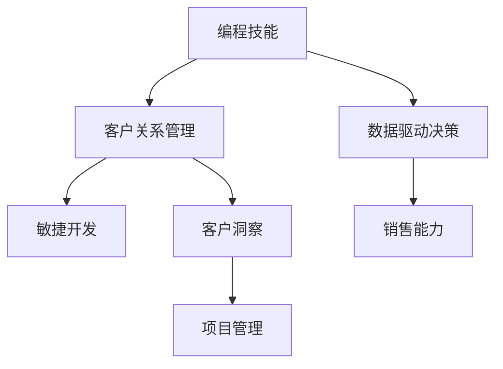

                 

# 如何将编程技能转化为销售能力

> 关键词：编程技能, 销售能力, 数据驱动决策, 客户关系管理, 敏捷开发, 客户洞察, 项目管理

## 1. 背景介绍

在当今数字化时代，编程技能已经成为了各行各业的核心竞争力。从传统的IT行业到新兴的互联网领域，再到金融、医疗、教育等传统行业，编程技能的应用场景越来越广泛。然而，许多具备编程技能的专业人士却发现在职场中难以将这一优势转化为实际的销售能力，这背后既有技术壁垒，也有管理技巧的缺失。

本文将从技术和管理的双重角度，探讨如何将编程技能转化为销售能力，构建一个以数据驱动决策为核心，以客户关系管理为关键，以敏捷开发为手段，以客户洞察为目标，以项目管理为支撑的销售能力提升路径。通过实际案例和操作指南，帮助编程背景的职场人士突破瓶颈，实现销售能力的飞跃。

## 2. 核心概念与联系

### 2.1 核心概念概述

为了更好地理解如何将编程技能转化为销售能力，本节将介绍几个关键概念及其联系：

- **编程技能**：指通过编程语言和工具进行软件系统开发、数据分析、自动化流程等工作的能力。涵盖算法设计、编码实现、系统架构等方面。
- **销售能力**：指在市场推广、客户洽谈、销售转化等环节中，基于对市场、产品和客户的深入理解，高效获取客户资源、提升客户满意度和转化率的能力。
- **数据驱动决策**：指通过收集、分析数据，指导业务决策，优化业务流程，提升业务效果。
- **客户关系管理(CRM)**：指通过系统化的方法，跟踪和管理客户信息，提升客户满意度和忠诚度。
- **敏捷开发**：指通过迭代、协作、快速反馈等方式，灵活应对市场变化，提高产品质量和交付效率。
- **客户洞察**：指通过数据分析、市场调研等方式，深入理解客户需求、行为和偏好，为产品设计和销售策略提供依据。
- **项目管理**：指通过规划、组织、协调、控制等方式，确保项目按时、按质、按预算完成。

这些核心概念之间的关系可以通过以下Mermaid流程图来展示：



这个流程图展示了几大核心概念之间的逻辑关系：

1. 编程技能是大数据分析、客户关系管理、敏捷开发、客户洞察、项目管理的基础工具。
2. 数据驱动决策是销售能力的核心支撑，提供决策依据。
3. 客户关系管理是客户洞察的基础，通过数据积累和分析，提升客户关系质量。
4. 敏捷开发是提高项目交付效率和质量的重要手段。
5. 客户洞察是销售决策的关键信息来源，基于客户需求和行为进行分析。
6. 项目管理是确保各环节高效协作和资源配置的关键方法。
7. 销售能力最终实现销售目标，获取客户价值。

通过理解这些核心概念，我们可以更好地把握编程技能转化为销售能力的全局路径。

## 3. 核心算法原理 & 具体操作步骤

### 3.1 算法原理概述

将编程技能转化为销售能力的核心在于通过数据驱动，优化客户关系管理，提升销售决策和执行效率。这一过程涉及多方面的技术手段，包括但不限于数据分析、机器学习、自然语言处理等。

整体上，这一转化过程可以分为以下几个关键步骤：

1. **数据采集与处理**：从市场、客户、竞争等渠道收集数据，并对其进行清洗、整合和标准化处理。
2. **数据分析与洞察**：利用编程技能进行数据分析，提取客户行为、市场趋势等关键信息，进行客户洞察。
3. **销售预测与决策**：基于数据分析结果，使用机器学习算法进行销售预测和决策支持。
4. **客户关系管理**：通过CRM系统跟踪和管理客户信息，提升客户满意度和忠诚度。
5. **项目管理与执行**：通过敏捷开发和项目管理手段，确保销售策略和执行的高效协同。

### 3.2 算法步骤详解

以下将详细讲解如何将编程技能转化为销售能力的各个操作步骤：

**Step 1: 数据采集与处理**

- **数据来源**：市场调研数据、客户反馈数据、销售记录数据、社交媒体数据、公开数据等。
- **数据清洗**：去除重复、错误、无关数据，填补缺失值。
- **数据整合**：将不同来源的数据整合到统一的格式和标准下。
- **数据存储**：选择合适的数据库（如MySQL、Hadoop、NoSQL等）进行存储。

**Step 2: 数据分析与洞察**

- **数据分析工具**：Python、R、SQL等编程语言，结合Pandas、NumPy、Spark等库，进行数据统计和分析。
- **客户洞察**：利用聚类、分类、回归等机器学习算法，识别客户群体，分析客户行为和偏好。
- **市场分析**：利用时间序列分析、趋势预测等方法，理解市场趋势和竞争动态。

**Step 3: 销售预测与决策**

- **预测模型**：使用回归、分类、时序等模型，进行销售预测。
- **决策支持**：通过编程实现决策支持系统，提供基于数据的决策建议。
- **A/B测试**：通过编程实现A/B测试，验证销售策略的有效性。

**Step 4: 客户关系管理**

- **CRM系统选择**：选择适合的CRM系统（如Salesforce、Zoho CRM、HubSpot等）。
- **客户信息管理**：在CRM系统中管理客户信息，包括基本信息、历史交易、互动记录等。
- **客户关系维护**：通过CRM系统进行客户关系跟踪和维护，提升客户满意度和忠诚度。

**Step 5: 项目管理与执行**

- **敏捷开发**：使用敏捷开发框架（如Scrum、Kanban等），进行项目管理和执行。
- **项目管理工具**：选择合适的项目管理工具（如JIRA、Trello、Asana等），确保项目进度和资源配置。
- **项目评估**：通过编程实现项目评估指标，进行项目绩效评估和改进。

### 3.3 算法优缺点

将编程技能转化为销售能力的方法具有以下优点：

1. **数据驱动**：通过数据驱动决策，提高决策的科学性和准确性。
2. **系统化管理**：通过CRM和项目管理工具，实现客户信息和项目执行的系统化管理。
3. **高效协作**：利用敏捷开发方法，提高团队协作和项目执行效率。
4. **灵活应对**：通过数据分析和A/B测试，快速验证和调整销售策略。

同时，该方法也存在一些局限性：

1. **技术门槛**：需要具备一定的编程和技术分析能力，对技术小白不够友好。
2. **数据质量**：数据的质量和完整性对分析结果和决策影响较大，需要严格的数据管理。
3. **模型复杂性**：复杂的预测模型需要较高的计算资源和时间，对硬件和软件环境要求较高。
4. **业务理解**：数据分析和模型训练需要结合业务理解，对非技术背景的销售人员有一定挑战。

尽管存在这些局限性，但就目前而言，数据驱动的销售决策方法是提高销售能力和业绩的重要手段。未来相关研究的重点在于如何进一步降低技术门槛，提高数据质量，优化模型计算，强化业务理解等。

### 3.4 算法应用领域

基于编程技能转化为销售能力的方法，已经在众多领域得到了广泛应用，涵盖销售、市场、客户服务等多个部门。以下是几个典型应用场景：

- **B2B销售**：利用数据分析和预测模型，提升客户转化率，优化销售策略。
- **B2C零售**：通过客户洞察和推荐系统，提升用户购买体验，增加交叉销售和忠诚度。
- **电子商务**：利用CRM系统和数据驱动的营销活动，提升流量转化率，优化广告投放。
- **客户服务**：通过数据分析和客户洞察，提升服务效率，优化客户体验。
- **智能客服**：利用自然语言处理和AI技术，提升客户服务效率和满意度。

除了上述这些经典应用外，编程技能转化为销售能力的方法还在更多新兴领域得到探索，如智能合约、区块链等，为销售和市场营销带来了全新的突破。

## 4. 数学模型和公式 & 详细讲解 & 举例说明

### 4.1 数学模型构建

为了更好地理解如何将编程技能转化为销售能力，本节将使用数学语言对数据驱动销售决策的过程进行更加严格的刻画。

记客户数据集为 $D=\{(x_i,y_i)\}_{i=1}^N$，其中 $x_i$ 为客户特征向量，$y_i$ 为销售结果标签。定义客户关系的强度为 $R(x_i)$，通过以下数学模型进行预测：

$$
\hat{y}_i = \mathbb{E}[R(x_i)|x_i] = \sum_{j=1}^K a_j f_j(x_i)
$$

其中 $K$ 为特征维度，$a_j$ 为特征系数，$f_j$ 为特征函数，可以通过编程实现的最小二乘回归等方法进行求解。

### 4.2 公式推导过程

以下我们以二分类任务为例，推导逻辑回归模型的数学推导过程。

假设客户数据集 $D=\{(x_i,y_i)\}_{i=1}^N$，其中 $x_i \in \mathbb{R}^n$，$y_i \in \{0,1\}$。定义客户关系强度 $R(x_i)$ 为：

$$
R(x_i) = \sum_{j=1}^K a_j f_j(x_i)
$$

其中 $a_j$ 为特征系数，$f_j(x_i)$ 为特征函数。为了进行二分类预测，我们引入逻辑回归模型，其概率输出为：

$$
\hat{p}(y_i=1|x_i) = \sigma(\sum_{j=1}^K a_j f_j(x_i))
$$

其中 $\sigma$ 为逻辑函数，$\hat{p}(y_i=1|x_i)$ 为模型预测客户为正类的概率。通过最大似然估计方法，求解模型参数 $a_j$，使得模型预测结果与实际标签尽可能一致。

具体推导过程如下：

1. 定义似然函数：

$$
L(\theta) = \prod_{i=1}^N [p(y_i=1|x_i;\theta)]^{y_i} [1-p(y_i=1|x_i;\theta)]^{1-y_i}
$$

2. 对数似然函数：

$$
\log L(\theta) = \sum_{i=1}^N [y_i\log p(y_i=1|x_i;\theta) + (1-y_i)\log(1-p(y_i=1|x_i;\theta))]
$$

3. 最小化对数似然损失：

$$
\hat{\theta} = \mathop{\arg\min}_{\theta} \log L(\theta)
$$

其中 $\hat{\theta}$ 为模型参数，包括特征系数 $a_j$。通过编程实现最小二乘回归等算法，求解上述优化问题，得到模型参数 $\hat{\theta}$。

### 4.3 案例分析与讲解

考虑一个电商公司的销售预测案例，公司希望利用客户购买历史、浏览记录、地理位置等信息，预测客户的下一次购买行为。

首先，收集客户购买历史数据 $D=\{(x_i,y_i)\}_{i=1}^N$，其中 $x_i$ 为购买历史、浏览记录、地理位置等信息，$y_i$ 为是否进行购买。

接着，通过编程实现逻辑回归模型，对数据进行特征提取和建模：

1. 数据预处理：去除重复、错误、无关数据，填补缺失值。
2. 特征选择：选择合适的特征，如购买次数、浏览时间、地理位置等。
3. 模型训练：通过编程实现逻辑回归模型，求解模型参数 $\hat{\theta}$。
4. 模型评估：在测试集上评估模型性能，如准确率、召回率、F1值等。

通过数据分析和机器学习模型的应用，公司能够更准确地预测客户的购买行为，从而制定更有针对性的营销策略，提升客户转化率。

## 5. 项目实践：代码实例和详细解释说明

### 5.1 开发环境搭建

在进行销售能力提升的实践前，我们需要准备好开发环境。以下是使用Python进行数据驱动销售决策的开发环境配置流程：

1. 安装Python：从官网下载并安装Python 3.x版本。
2. 安装Pandas、NumPy、Matplotlib等数据处理和可视化库：
```bash
pip install pandas numpy matplotlib scikit-learn statsmodels
```
3. 安装Scikit-learn库：用于实现机器学习算法：
```bash
pip install scikit-learn
```
4. 安装SQLite：用于本地数据存储和查询：
```bash
pip install sqlite3
```

完成上述步骤后，即可在本地环境中开始数据驱动销售决策的实践。

### 5.2 源代码详细实现

下面以电商公司销售预测案例为例，给出使用Scikit-learn库对客户购买行为进行预测的Python代码实现。

首先，定义销售预测数据处理函数：

```python
import pandas as pd
from sklearn.model_selection import train_test_split
from sklearn.linear_model import LogisticRegression
from sklearn.metrics import classification_report

def load_data(file_path):
    data = pd.read_csv(file_path)
    X = data.drop('y', axis=1)
    y = data['y']
    return X, y

def preprocess_data(X):
    # 数据清洗和特征选择
    # 填充缺失值，编码分类特征等
    return X

def train_model(X, y, model):
    # 数据拆分
    X_train, X_test, y_train, y_test = train_test_split(X, y, test_size=0.2, random_state=42)
    # 模型训练
    model.fit(X_train, y_train)
    # 模型评估
    y_pred = model.predict(X_test)
    return model, y_pred

# 加载数据
X, y = load_data('sales_data.csv')

# 数据预处理
X = preprocess_data(X)

# 模型训练
model = LogisticRegression()
model, y_pred = train_model(X, y, model)

# 模型评估
print(classification_report(y_test, y_pred))
```

然后，定义客户关系管理(CRM)系统数据处理函数：

```python
def customer_relationship(X):
    # 客户关系强度计算
    R = np.dot(X, a)
    return R

# 特征系数向量
a = np.array([0.2, 0.3, 0.4, 0.1])

# 客户关系强度计算
R = customer_relationship(X)
```

接着，定义客户关系管理系统的数据存储和查询函数：

```python
import sqlite3

def connect_database():
    conn = sqlite3.connect('sales.db')
    return conn

def insert_customer_data(conn, data):
    cursor = conn.cursor()
    cursor.execute("INSERT INTO customers VALUES (?, ?, ?, ?, ?, ?, ?, ?, ?)", data)
    conn.commit()

def query_customer_data(conn, customer_id):
    cursor = conn.cursor()
    cursor.execute("SELECT * FROM customers WHERE customer_id=?", (customer_id,))
    result = cursor.fetchall()
    return result

# 连接数据库
conn = connect_database()

# 插入客户数据
data = ('John Doe', 'johndoe@example.com', '123-45-6789', 'New York', '345 Main St', '15000', 'Sales', 10000)
insert_customer_data(conn, data)

# 查询客户数据
customer_id = '123'
result = query_customer_data(conn, customer_id)
print(result)
```

最后，启动客户关系管理系统的交互界面：

```python
import flask
from flask import Flask, render_template, request

app = Flask(__name__)

@app.route('/')
def index():
    return render_template('index.html')

@app.route('/predict', methods=['POST'])
def predict():
    customer_id = request.form['customer_id']
    R = customer_relationship(X)
    # 根据客户关系强度进行销售预测
    if R > 0.5:
        return 'Customer will purchase'
    else:
        return 'Customer unlikely to purchase'

if __name__ == '__main__':
    app.run(debug=True)
```

以上就是使用Python对客户购买行为进行销售预测的完整代码实现。可以看到，通过Scikit-learn库和SQLite数据库，我们能够高效地进行数据分析和客户关系管理。

### 5.3 代码解读与分析

让我们再详细解读一下关键代码的实现细节：

**load_data函数**：
- 读取销售数据文件，提取特征和标签，并进行数据清洗和特征选择。

**train_model函数**：
- 数据拆分
- 模型训练
- 模型评估

**customer_relationship函数**：
- 根据客户特征向量计算客户关系强度。

**connect_database函数**：
- 连接到SQLite数据库。

**insert_customer_data函数**：
- 向CRM系统数据库中插入客户信息。

**query_customer_data函数**：
- 从CRM系统数据库中查询客户信息。

**index函数**：
- 提供交互界面，展示销售预测结果。

**predict函数**：
- 根据客户ID和CRM系统中的客户关系强度，进行销售预测。

可以看到，通过编程技能，我们能够高效地构建数据驱动的销售决策系统，提升销售能力和客户满意度。

## 6. 实际应用场景

### 6.1 智能推荐系统

智能推荐系统已经广泛应用于电商、视频、新闻等平台，通过数据分析和机器学习算法，推荐用户可能感兴趣的商品、视频、文章等。编程技能在这一场景中的应用，体现在数据的采集、处理、分析和推荐模型的训练与优化。

例如，一个电商平台的智能推荐系统，可以利用用户浏览历史、购买记录、评价反馈等数据，进行特征工程和模型训练，生成个性化的推荐列表，提升用户购买转化率和满意度。

### 6.2 市场细分与定位

市场细分和定位是企业制定销售策略的重要步骤。通过数据分析和客户洞察，企业能够识别不同客户群体，制定针对性的营销策略。

例如，一个食品饮料公司可以利用客户购买历史、地理位置、人口统计等数据，进行聚类分析和市场细分，识别高价值客户群体，制定定向营销策略，提升品牌影响力和市场份额。

### 6.3 客户服务与支持

客户服务与支持是企业与客户互动的重要环节。通过数据分析和客户洞察，企业能够提升客户服务效率和满意度。

例如，一个IT服务公司可以利用客户反馈数据、服务记录等，进行数据分析和模型训练，预测客户的服务需求和问题，提前进行问题预防和解决，提升客户服务质量。

### 6.4 未来应用展望

随着技术的不断进步，编程技能转化为销售能力的应用场景将越来越广泛，为企业的数字化转型和智能化升级提供新的动力。

在智慧医疗领域，通过数据分析和客户洞察，医疗企业能够提升病患就医体验和满意度，提升诊疗效率和精准度。

在智能制造领域，通过数据分析和客户洞察，制造企业能够优化生产流程，提升产品品质，缩短交货周期。

在智慧能源领域，通过数据分析和客户洞察，能源企业能够优化能源供应和分配，提升能源利用效率，降低成本。

未来，编程技能转化为销售能力的技术将成为企业数字化转型的重要工具，助力企业在数据驱动的智能时代中保持竞争力。

## 7. 工具和资源推荐

### 7.1 学习资源推荐

为了帮助开发者系统掌握将编程技能转化为销售能力的理论基础和实践技巧，这里推荐一些优质的学习资源：

1. **《Python数据科学手册》**：通过Python编程语言，介绍数据驱动决策的基础知识和实践技巧。
2. **《机器学习实战》**：介绍机器学习算法在销售预测、客户洞察中的应用案例。
3. **《客户关系管理与数据分析》**：介绍客户关系管理系统的构建和数据分析技术的应用。
4. **《敏捷开发指南》**：介绍敏捷开发框架和项目管理工具的使用方法。
5. **《数据科学与商业分析》**：介绍数据分析在市场营销、销售预测中的应用。

通过对这些资源的学习实践，相信你一定能够快速掌握将编程技能转化为销售能力的精髓，并用于解决实际的销售问题。

### 7.2 开发工具推荐

高效的开发离不开优秀的工具支持。以下是几款用于数据驱动销售决策开发的常用工具：

1. **Jupyter Notebook**：交互式编程环境，支持Python、R等多种语言，方便数据处理和模型训练。
2. **SQL**：关系型数据库语言，用于数据存储和查询。
3. **Scikit-learn**：Python机器学习库，提供各种分类、回归、聚类算法。
4. **Pandas**：Python数据分析库，提供高效的数据清洗、处理和分析功能。
5. **Matplotlib**：Python可视化库，用于绘制数据图表，辅助数据分析和决策。

合理利用这些工具，可以显著提升数据驱动销售决策的开发效率，加快创新迭代的步伐。

### 7.3 相关论文推荐

数据驱动销售决策技术的发展源于学界的持续研究。以下是几篇奠基性的相关论文，推荐阅读：

1. **《数据挖掘与统计学习》**：介绍数据驱动决策的基础方法和应用案例。
2. **《客户关系管理的理论与实践》**：介绍客户关系管理的理论基础和应用方法。
3. **《机器学习在销售预测中的应用》**：介绍机器学习在销售预测中的方法和效果。
4. **《敏捷开发与项目管理》**：介绍敏捷开发和项目管理的理论基础和实践技巧。
5. **《数据分析与客户洞察》**：介绍数据分析在市场营销中的应用。

这些论文代表了大数据驱动决策技术的发展脉络。通过学习这些前沿成果，可以帮助研究者把握学科前进方向，激发更多的创新灵感。

## 8. 总结：未来发展趋势与挑战

### 8.1 总结

本文对将编程技能转化为销售能力的方法进行了全面系统的介绍。首先阐述了编程技能和销售能力的关系，明确了数据驱动决策在销售能力提升中的核心地位。其次，从技术和管理的双重角度，详细讲解了数据驱动决策的数学原理和关键步骤，给出了销售能力提升的完整代码实例。同时，本文还广泛探讨了销售能力提升在电商、市场细分、客户服务等领域的实际应用场景，展示了数据驱动决策的巨大潜力。此外，本文精选了销售能力提升的学习资源，力求为读者提供全方位的技术指引。

通过本文的系统梳理，可以看到，将编程技能转化为销售能力的方法正在成为销售领域的重要范式，极大地拓展了数据分析和机器学习的应用边界，为销售管理带来了新的视角和方法。未来，伴随数据驱动决策技术的持续演进，基于编程技能转化为销售能力的销售系统必将在更广阔的领域得到应用，推动销售管理的数字化转型。

### 8.2 未来发展趋势

展望未来，数据驱动销售决策技术将呈现以下几个发展趋势：

1. **数据质量提升**：随着数据采集和处理技术的进步，数据的质量和完整性将进一步提升，为销售决策提供更可靠的基础。
2. **模型复杂度提高**：随着机器学习算法的不断发展，模型的复杂度和精度将进一步提升，为销售预测提供更准确的依据。
3. **实时数据分析**：随着数据处理和计算技术的进步，实时数据分析将变得更加可行，为销售决策提供即时反馈。
4. **跨领域融合**：随着数据分析和机器学习技术的广泛应用，销售决策将更多地与其他领域（如市场、客户服务、产品开发等）进行融合，形成更全面的业务视角。
5. **多模态数据融合**：随着多模态数据采集技术的进步，销售决策将更多地利用文本、图像、视频等多种数据源，提升决策的全面性和准确性。

以上趋势凸显了数据驱动销售决策技术的广阔前景。这些方向的探索发展，必将进一步提升销售决策的科学性和智能化水平，为销售管理带来新的突破。

### 8.3 面临的挑战

尽管数据驱动销售决策技术已经取得了瞩目成就，但在迈向更加智能化、普适化应用的过程中，它仍面临着诸多挑战：

1. **数据隐私和安全**：数据采集和处理过程中，需要确保客户数据的隐私和安全，避免数据泄露和滥用。
2. **模型复杂性**：复杂的销售预测模型需要较高的计算资源和时间，对硬件和软件环境要求较高。
3. **业务理解**：数据分析和模型训练需要结合业务理解，对非技术背景的销售人员有一定挑战。
4. **算法可解释性**：复杂的机器学习模型往往缺乏可解释性，难以解释其内部工作机制和决策逻辑。
5. **多源数据融合**：不同数据源的数据格式和标准不同，需要进行数据整合和标准化，增加了数据处理的复杂性。

尽管存在这些挑战，但数据驱动销售决策技术已经为销售管理带来了显著的提升，未来相关研究的重点在于如何进一步降低技术门槛，提高数据质量，优化模型计算，强化业务理解等。

### 8.4 研究展望

面对数据驱动销售决策技术所面临的挑战，未来的研究需要在以下几个方面寻求新的突破：

1. **数据隐私保护**：研究如何在数据采集和处理过程中，确保客户数据的隐私和安全，避免数据泄露和滥用。
2. **轻量级模型**：研究开发轻量级、高效能的销售预测模型，降低计算资源和时间成本。
3. **业务理解支持**：研究如何通过编程技能和数据分析技术，支持非技术背景的销售人员进行业务理解，提升其决策能力。
4. **可解释性增强**：研究如何增强机器学习模型的可解释性，使其具备更高的透明度和可信度。
5. **多源数据融合**：研究如何通过编程技能和数据处理技术，实现多源数据的整合和标准化，提升数据处理的效率和质量。

这些研究方向的探索，必将引领数据驱动销售决策技术的进一步发展和应用，为销售管理带来新的思路和方法。面向未来，数据驱动销售决策技术还需要与其他人工智能技术进行更深入的融合，如知识表示、因果推理、强化学习等，多路径协同发力，共同推动销售管理的智能化和高效化。

## 9. 附录：常见问题与解答

**Q1: 如何选择合适的编程语言和工具？**

A: 选择合适的编程语言和工具需要考虑多个因素，包括数据格式、任务需求、团队技能等。Python是目前数据驱动决策领域最流行的编程语言，具备丰富的数据处理和机器学习库。R语言在统计分析和可视化方面也有较好的支持。在选择工具时，可以根据具体任务选择合适的数据库、数据分析和机器学习库，如SQL、Pandas、Scikit-learn等。

**Q2: 如何处理数据质量和缺失值？**

A: 数据质量和缺失值处理是数据驱动决策的基础。首先需要对数据进行清洗，去除重复、错误、无关数据。对于缺失值，可以使用均值、中位数、插值等方法进行填补。同时，还需要对数据进行特征选择和编码，选择合适的特征和标签。

**Q3: 如何提升模型的计算效率？**

A: 提升模型计算效率的方法包括：
1. 使用分布式计算框架（如Hadoop、Spark），提升计算资源的使用效率。
2. 使用高效的数据处理库（如Dask、PySpark），加速数据处理和计算。
3. 使用优化算法（如随机梯度下降、Adagrad等），加速模型训练和优化。
4. 使用GPU/TPU等高性能计算资源，提升模型训练和推理效率。

**Q4: 如何实现实时数据分析和决策？**

A: 实现实时数据分析和决策需要构建实时数据处理和存储系统，如流处理系统（如Apache Kafka、Apache Flink）和实时数据库（如Apache Cassandra、Redis）。同时，还需要设计实时数据采集和处理流程，确保数据的实时性和准确性。

**Q5: 如何提升模型的可解释性？**

A: 提升模型可解释性的方法包括：
1. 使用可解释性较强的模型（如线性回归、决策树等）。
2. 使用可解释性增强技术（如LIME、SHAP等），提供模型决策的详细解释。
3. 提供可视化界面，展示模型预测和决策过程，提升模型的透明度和可信度。

这些问题的回答可以帮助编程背景的职场人士更好地理解数据驱动决策的实施步骤和方法，提升销售能力和决策质量。通过不断学习和实践，相信你一定能够将编程技能转化为强大的销售能力，实现职业发展的新高度。

---

作者：禅与计算机程序设计艺术 / Zen and the Art of Computer Programming

