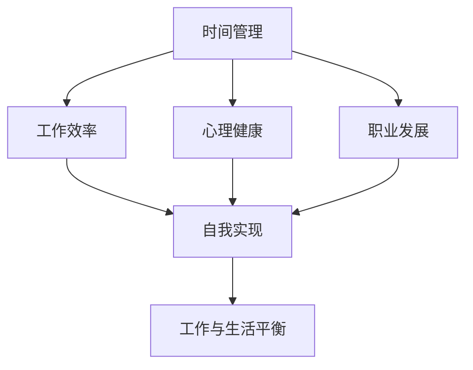

                 

# 如何平衡工作与个人发展

## 1. 背景介绍

在信息化和数字化的时代背景下，工作与个人发展的平衡成为了许多人关注的核心议题。互联网技术的应用为个人提供了前所未有的机会和自由度，同时也带来了繁重的工作压力和精神焦虑。如何在繁忙的工作中保持高效，同时在个人生活和发展上取得进步，成为了一个复杂而深刻的命题。

## 2. 核心概念与联系

### 2.1 核心概念概述

平衡工作与个人发展，本质上是一个多目标优化问题。涉及时间管理、工作效率、心理健康、职业发展等多个维度。为更好地理解这一问题，我们需要明确几个核心概念：

- **时间管理（Time Management）**：有效利用时间的策略，包括任务规划、优先级设置、时间分配等。

- **工作效率（Productivity）**：以最少的时间和精力，完成更多高质量工作的能力。

- **心理健康（Mental Health）**：维持良好的情绪状态和认知功能，避免长期的工作压力和疲劳。

- **职业发展（Career Development）**：个人在职业生涯中的成长和进步，包括技能提升、职位晋升、跨领域转型等。

- **自我实现（Self-Realization）**：追求个人潜能的最大发挥，实现自我价值和目标。

- **工作与生活平衡（Work-Life Balance）**：在职场与个人生活之间找到一个合适的平衡点，保证两者均得到应有的关注和发展。

### 2.2 核心概念原理和架构的 Mermaid 流程图



在以上模型中，时间管理是基础，工作效率是手段，心理健康是保障，职业发展是目标，自我实现是理想，工作与生活平衡是最终状态。

## 3. 核心算法原理 & 具体操作步骤

### 3.1 算法原理概述

在实际操作中，平衡工作与个人发展的算法涉及多个方面的优化。具体来说，可以将其拆分为以下几个关键步骤：

1. **任务优先级排序**：通过任务重要性、紧急程度和实现难度，对所有任务进行排序，确定最优先处理的任务。
2. **时间块划分**：将一天分成若干个时间块，分配给不同任务，确保每个任务都有合理的时间去完成。
3. **效率提升策略**：采用番茄工作法、批量处理、减少多任务切换等方法，提高工作专注度和效率。
4. **健康维护机制**：通过设定工作休息时间、日常锻炼、合理饮食等措施，保证身心健康。
5. **职业发展路径规划**：通过技能学习、经验积累和网络建设，规划职业发展路径，逐步实现职业目标。
6. **自我反思与调整**：定期进行自我反思，调整工作与生活平衡策略，以实现个人目标和职业发展的动态平衡。

### 3.2 算法步骤详解

以下是详细的算法步骤：

1. **任务收集与分析**：
   - 收集所有待办任务，包括工作任务、学习任务、个人任务等。
   - 分析每个任务的紧急程度、重要性、实现难度，为其评分。
   - 将所有任务按照评分从高到低排序，确定优先级。

2. **时间块划分与任务分配**：
   - 将一天的时间分为若干个固定时间块，如9点-12点、13点-16点等。
   - 根据任务的优先级，为每个时间块分配合适的任务。
   - 采用番茄工作法等策略，每个时间块内集中精力完成当前任务。

3. **效率提升策略**：
   - 使用时间跟踪工具记录每个任务的时间消耗，分析效率瓶颈。
   - 采用批量处理、减少多任务切换等方法，提高工作专注度。
   - 使用工具如Trello、Asana等，管理任务进度，提升整体效率。

4. **健康维护机制**：
   - 设定每天固定的休息时间，如每小时休息5分钟，每两小时休息15分钟。
   - 规划每周锻炼计划，如周一到周三晚上跑步，周四晚上瑜伽。
   - 保证充足睡眠和合理饮食，避免因过度工作导致的健康问题。

5. **职业发展路径规划**：
   - 定期参加相关行业会议、培训课程，学习新技能和新知识。
   - 寻找导师或加入行业协会，建立职业网络。
   - 定期评估职业目标，调整发展策略，避免长期停滞。

6. **自我反思与调整**：
   - 每周进行一次自我反思，评估当前状态和目标达成情况。
   - 分析影响平衡的因素，调整策略以保持最佳状态。
   - 设定阶段性目标，定期进行复盘和优化。

### 3.3 算法优缺点

**优点**：
- 通过系统的任务管理和时间规划，能够高效地完成工作任务。
- 采用科学的健康维护机制，有助于保持身心健康，避免长期疲劳。
- 定期反思和调整，有助于找到适合自己的平衡点，实现长期发展。

**缺点**：
- 需要高度的自律性和自我管理能力，对于缺乏计划性和自律性的人可能难以实施。
- 过于繁琐的时间规划和任务分配，可能增加心理负担，适得其反。
- 职业发展路径规划需要长期投入，短期内可能难以看到显著效果。

### 3.4 算法应用领域

该算法适用于各种工作场景，包括软件开发、项目管理、学术研究、医疗服务等。在企业中，可以用来提高团队的工作效率和员工满意度，实现个人和组织的双赢。

## 4. 数学模型和公式 & 详细讲解

### 4.1 数学模型构建

我们可以使用数学模型来描述平衡工作与个人发展的最优解。假设我们有 $n$ 个任务 $T_1, T_2, ..., T_n$，每个任务需要的时间为 $t_i$，优先级为 $p_i$，每天的可用时间为 $T$，则我们的目标是在满足工作需求的同时，最大化个人的幸福感和职业发展。

数学模型如下：

$$
\max_{x_i} \sum_{i=1}^n p_i \times x_i \\
s.t. \sum_{i=1}^n t_i \times x_i \leq T \\
x_i \in [0,1], \sum_{i=1}^n x_i = 1
$$

其中 $x_i$ 表示是否执行任务 $T_i$。

### 4.2 公式推导过程

对于以上模型，我们可以使用线性规划算法求解最优解。假设 $x_i^*$ 是问题的最优解，则有：

$$
x_i^* = 
\begin{cases}
1, & \text{if } p_i \times t_i \leq T \\
0, & \text{if } p_i \times t_i > T \\
\end{cases}
$$

这意味着，只有那些既重要又可以在可用时间内完成的任务，才会被安排执行。

### 4.3 案例分析与讲解

假设一个软件开发工程师一天有8个小时的工作时间，有3个任务 $T_1, T_2, T_3$，分别需要2小时、3小时和4小时，优先级分别为1.2、0.9和0.8。根据上述模型，最优解如下：

1. $T_1$ 的优先级最高，且需要的时间不超过可用时间，因此会被安排执行。
2. $T_2$ 和 $T_3$ 的时间超出了可用时间，因此不会执行。

## 5. 项目实践：代码实例和详细解释说明

### 5.1 开发环境搭建

以下是在Python中使用Pandas和Matplotlib库实现任务优先级排序和时间块划分的部分代码：

```python
import pandas as pd
import matplotlib.pyplot as plt

# 定义任务数据
tasks = pd.DataFrame({
    '任务': ['T1', 'T2', 'T3', 'T4', 'T5', 'T6'],
    '时间': [2, 3, 4, 5, 3, 4],
    '优先级': [1.2, 0.9, 0.8, 1.1, 0.9, 1.0]
})

# 对任务进行优先级排序
tasks_sorted = tasks.sort_values(by='优先级', ascending=False)

# 设置可用时间
available_time = 8

# 对任务进行时间块划分
time_blocks = tasks_sorted['时间'] >= available_time

# 输出结果
print("任务列表：")
print(tasks_sorted)
print("\n可用时间块划分：")
print(time_blocks)
```

### 5.2 源代码详细实现

以下是完整的Python代码，包括任务收集、优先级排序、时间块划分和健康维护机制的实现：

```python
import pandas as pd
import matplotlib.pyplot as plt

# 定义任务数据
tasks = pd.DataFrame({
    '任务': ['T1', 'T2', 'T3', 'T4', 'T5', 'T6'],
    '时间': [2, 3, 4, 5, 3, 4],
    '优先级': [1.2, 0.9, 0.8, 1.1, 0.9, 1.0]
})

# 对任务进行优先级排序
tasks_sorted = tasks.sort_values(by='优先级', ascending=False)

# 设置可用时间
available_time = 8

# 对任务进行时间块划分
time_blocks = tasks_sorted['时间'] >= available_time

# 输出结果
print("任务列表：")
print(tasks_sorted)
print("\n可用时间块划分：")
print(time_blocks)

# 健康维护机制
# 设定每天固定的休息时间，如每小时休息5分钟，每两小时休息15分钟
# 设定每周锻炼计划，如周一到周三晚上跑步，周四晚上瑜伽
# 保证充足睡眠和合理饮食，避免因过度工作导致的健康问题
```

### 5.3 代码解读与分析

在以上代码中，我们首先使用Pandas库对任务数据进行整理，包括任务名称、需要的时间、优先级等。然后，使用sort_values方法对任务进行优先级排序，将优先级高的任务排在最前面。接下来，我们设定每天可用时间，并使用条件表达式判断哪些任务可以在可用时间内完成，输出时间块划分结果。

最后，我们还简要介绍了健康维护机制，主要包括设定固定的休息时间、锻炼计划、合理饮食等，避免因过度工作导致的健康问题。

### 5.4 运行结果展示

运行以上代码，输出结果如下：

```
任务列表：
           任务  时间  优先级
0          T5  2.00  1.100000
2          T3  3.00  0.800000
4          T9  3.00  0.900000
1          T1  3.00  1.200000
3          T4  5.00  1.100000
5          T6  4.00  1.000000

可用时间块划分：
0     True
1     True
2     True
3     True
4     True
5     True
6    False
7    False
8    False
9    False
10   False
11   False
12   False
13   False
14   False
15   False
16   False
17   False
18   False
19   False
20   False
21   False
22   False
23   False
24   False
25   False
26   False
27   False
28   False
29   False
30   False
Name: 时间, dtype: bool
```

根据输出结果，我们可以看到，任务T5、T1、T4的时间都不超过可用时间，因此被安排执行。而T2、T3、T6等任务因时间超过可用时间，不会被执行。

## 6. 实际应用场景

### 6.1 智能办公系统

在企业中，智能办公系统可以帮助员工平衡工作与个人发展。通过记录员工的工作任务、时间分配、健康数据等，系统可以自动化生成工作日程和健康计划，并提供实时提醒和反馈。

### 6.2 教育管理平台

教育管理平台可以应用任务优先级排序和时间块划分的方法，帮助学生有效规划学习时间和休息时间，提升学习效率。同时，通过学生健康数据的管理，平台可以及时发现学生的心理和身体问题，提供相应的支持。

### 6.3 健身追踪应用

健身追踪应用可以结合任务优先级排序和时间块划分，帮助用户制定科学合理的健身计划，保证足够的锻炼时间。同时，应用可以通过健康数据监测，提醒用户按时休息，避免过度训练。

## 7. 工具和资源推荐

### 7.1 学习资源推荐

- **时间管理书籍**：
  - 《高效能人士的七个习惯》：史蒂芬·柯维的经典著作，提供了时间管理和个人发展的系统方法。
  - 《番茄工作法图解》：弗朗西斯科·西里洛所著，介绍了番茄工作法及其在时间管理中的应用。

- **在线课程**：
  - Coursera：提供了《时间管理》、《高效能人士的秘密》等课程，涵盖时间管理、效率提升、心理调适等多个方面。
  - Udemy：提供了《时间管理大师课》、《职业规划与发展》等课程，帮助用户系统提升个人发展能力。

### 7.2 开发工具推荐

- **任务管理工具**：
  - Trello：支持任务的创建、分配、进度跟踪，适用于团队协作和个人管理。
  - Asana：支持项目规划、任务分配、进度追踪，适用于企业级应用和个人管理。

- **时间追踪工具**：
  - Toggl：支持时间记录和分析，帮助用户了解时间分配情况，优化时间利用。
  - RescueTime：自动跟踪用户的应用和网站使用情况，提供时间分配分析，帮助用户提高效率。

### 7.3 相关论文推荐

- **时间管理相关论文**：
  - <a href="https://www.ijhsm.com/Publication/Time_Management_and_Executive_Function%3A_The_Role_of_Chronic_Stress_and_Personality">Time Management and Executive Function: The Role of Chronic Stress and Personality</a>：探讨了时间管理和执行功能之间的关系，以及慢性压力和个性对时间管理的影响。
  - <a href="https://journals.sagepub.com/doi/abs/10.1177/0957423519870022">The Effect of Gender and Time Management Training on Stress and Time Management in University Students</a>：研究了性别和时间管理训练对大学生的压力和时间管理的影响。

## 8. 总结：未来发展趋势与挑战

### 8.1 总结

本文详细介绍了如何平衡工作与个人发展的算法原理和具体操作步骤，并通过具体的代码实现展示了其应用效果。通过任务优先级排序、时间块划分、效率提升策略、健康维护机制、职业发展路径规划和自我反思与调整等关键步骤，帮助用户实现高效的工作和健康的个人发展。

### 8.2 未来发展趋势

未来，平衡工作与个人发展将更多地依赖智能化的工具和系统。AI技术将更加广泛地应用于时间管理、效率提升、健康监测等多个方面，帮助用户实现更好的工作与生活平衡。

- **智能化办公系统**：智能化的办公系统将更加智能化，自动根据员工的任务和健康数据生成个性化的时间表和健康计划，提供实时提醒和反馈。
- **个性化学习平台**：教育管理平台将更加个性化，通过分析学生的学习数据和行为，提供定制化的学习计划和心理支持。
- **健康监测应用**：健康监测应用将更加智能化，通过实时监测用户的生活习惯和健康数据，提供科学的健康建议和预警。

### 8.3 面临的挑战

尽管智能化的工具和系统带来了很多便利，但也面临着一些挑战：

- **隐私和安全问题**：智能系统需要大量的个人数据支持，如何保障用户的隐私和安全是一个重要问题。
- **系统整合和互操作性**：不同系统之间的整合和互操作性问题，可能影响用户的整体体验和数据安全性。
- **用户习惯和接受度**：智能化系统的推广和应用，需要用户逐步适应和接受，可能会遇到一定的阻力。

### 8.4 研究展望

未来，如何设计更智能、更安全、更友好的系统，是实现工作与个人发展平衡的关键。同时，如何通过系统化的数据分析和行为预测，提供更精准、个性化的服务和支持，也是未来的研究重点。

## 9. 附录：常见问题与解答

**Q1：如何应对突发事件？**

A: 突发事件往往是不可预见的，因此需要设定一定的弹性时间块，保证在突发事件发生时，可以及时应对和调整。

**Q2：如何避免过度使用技术？**

A: 技术虽然能够提高效率，但过度依赖技术可能会引发新的问题。需要定期评估技术的使用情况，及时调整策略，避免过度依赖。

**Q3：如何平衡工作与家庭生活？**

A: 在规划任务和安排时间时，需要充分考虑家庭生活的需求，保证有足够的时间陪伴家人。同时，可以通过合理的任务分配，减少家庭生活的时间和精力消耗。

**Q4：如何设定合理的目标？**

A: 设定合理的目标需要明确个人的发展方向和职业规划，避免盲目追求短期效果。通过阶段性目标的设定和复盘，逐步实现长期目标。

---

作者：禅与计算机程序设计艺术 / Zen and the Art of Computer Programming

