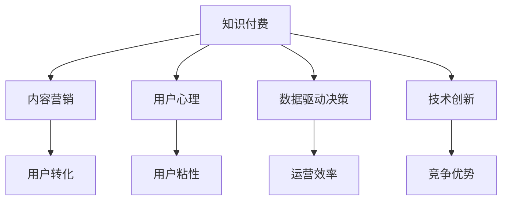

                 

# 如何打造个人知识付费商业帝国

## 1. 背景介绍

在数字化转型如火如荼的今天，知识付费已成为蓬勃发展的新兴产业，为个人和企业提供了广阔的商业机遇。在此背景下，如何打造可持续发展的知识付费商业帝国，成为摆在每一位知识付费从业者面前的重要课题。本文将从理论到实践，全面解析打造知识付费商业帝国的核心要素，提供一套系统、可行的路径。

### 1.1 问题由来

随着移动互联网的普及和信息技术的进步，知识付费市场正呈现出爆发式增长的态势。相较于传统的课程书籍和视频讲座，知识付费平台能够提供更加个性化、互动化的学习体验，帮助用户精准地获取所需知识和技能，从而获得了市场的青睐。然而，知识付费领域竞争激烈，如何在众多平台中脱颖而出，建立品牌忠诚度，实现商业盈利，是一大难题。

### 1.2 问题核心关键点

打造个人知识付费商业帝国，需要从多个维度进行系统规划和执行。这些核心要素包括：

1. 精准定位目标用户群体。明确你的知识产品面向哪个细分市场，用户有哪些核心需求。
2. 构建高质量、高价值的内容体系。确保内容能解决用户痛点，提供实用价值。
3. 实现商业化运营。通过有效的营销策略、会员制模式、分销机制等，实现可持续的商业盈利。
4. 建立品牌和社区。通过打造品牌形象、社区互动等方式，增强用户粘性。
5. 数据驱动决策。利用数据分析技术，持续优化产品和服务，提升用户满意度和留存率。
6. 技术支撑与创新。借助前沿技术，提升平台体验，探索新的商业形态。

## 2. 核心概念与联系

### 2.1 核心概念概述

为更好地理解打造知识付费商业帝国的路径，本节将介绍几个密切相关的核心概念：

- **知识付费(Knowledge As A Service, KaaS)**：通过知识产品和服务，帮助用户提升自身价值，实现知识变现的商业模式。
- **内容营销(Content Marketing)**：利用优质、有价值的内容吸引并转化用户，实现品牌传播和客户转化。
- **用户心理(UX Design)**：通过设计高体验感的用户界面，提升用户的使用粘性，提高转化率。
- **数据驱动决策(Data-Driven Decision Making)**：基于数据分析，对营销、产品等决策进行优化，提高运营效率。
- **技术创新(Technology Innovation)**：引入新兴技术，提升平台的竞争力和用户体验。

这些核心概念之间的逻辑关系可以通过以下Mermaid流程图来展示：



这个流程图展示了大语言模型微调的核心概念及其之间的关系：

1. 知识付费提供价值导向的内容，通过内容营销吸引用户。
2. 用户心理设计提升用户粘性，通过用户体验实现用户转化。
3. 数据驱动决策提供数据支持，优化运营流程。
4. 技术创新提升平台竞争力，保持市场领先地位。

## 3. 核心算法原理 & 具体操作步骤

### 3.1 算法原理概述

打造知识付费商业帝国，本质上是一个系统化的商业决策过程。其核心思想是通过对目标用户的深入研究，构建高价值的内容体系，并通过有效的营销手段、社区建设、数据分析等方法，实现商业变现。

### 3.2 算法步骤详解

1. **市场分析与用户画像构建**：
   - 分析行业趋势和竞争格局，明确目标市场的核心需求。
   - 基于用户行为数据，构建详细的用户画像，了解用户特点和偏好。
   - 使用A/B测试等方法，验证产品功能是否满足用户需求。

2. **内容设计与生产**：
   - 与行业专家、学者合作，设计和生产高质量的知识产品。
   - 采用内容多样化策略，包括视频、音频、图文、直播等多种形式，满足不同用户的需求。
   - 定期更新内容，保持平台活力和用户粘性。

3. **商业化运营**：
   - 引入会员制模式，设置不同等级会员权益，吸引用户订阅。
   - 实施分销机制，通过奖励和佣金激励分销商，扩大市场覆盖。
   - 设计多元化的定价策略，如单次购买、订阅制等，满足不同消费习惯的用户。

4. **品牌与社区建设**：
   - 打造独特品牌形象，提升用户对平台的信任度。
   - 创建在线社区，鼓励用户互动，形成活跃的社区氛围。
   - 定期举办线上线下活动，增加品牌曝光度，增强用户粘性。

5. **数据驱动决策**：
   - 利用数据分析工具，如Google Analytics、Hotjar等，监测用户行为数据。
   - 分析用户留存率、转化率、复购率等关键指标，优化产品和服务。
   - 定期进行用户调研，获取用户反馈，持续改进平台体验。

### 3.3 算法优缺点

打造知识付费商业帝国的主要优点包括：

- **市场潜力大**：知识付费市场快速扩张，市场需求旺盛，具有广阔的商业前景。
- **回报高**：高质量知识产品能够为用户提供价值，实现较高的复购率和转化率。
- **技术成熟**：知识付费平台已有多家知名公司，技术和市场运营经验丰富。

其不足之处在于：

- **竞争激烈**：市场竞争激烈，如何脱颖而出需要独特的创新和运营策略。
- **用户留存难度大**：知识付费产品属于精神消费，用户流失率较高，需要持续投入和优化。
- **内容制作成本高**：高质量内容的制作需要专业的团队和技术支持，成本较高。

### 3.4 算法应用领域

知识付费商业模式已在多个行业得到广泛应用，涵盖教育、健康、IT技术、金融等众多领域。具体应用包括：

1. **在线教育**：提供各种课程、培训、直播等知识产品，帮助用户提升技能。
2. **健康管理**：提供健康知识、饮食、运动指导，帮助用户实现健康生活。
3. **职业发展**：提供职业技能培训、职场指导等，帮助用户提升职业竞争力。
4. **技术资讯**：提供最新技术动态、开发教程等，满足技术爱好者的需求。
5. **金融理财**：提供理财知识、投资策略等，帮助用户优化财务规划。

## 4. 数学模型和公式 & 详细讲解 & 举例说明

### 4.1 数学模型构建

本节将使用数学语言对知识付费商业帝国的构建过程进行更加严格的刻画。

记知识付费平台的用户数量为 $N$，转化为会员的用户数量为 $M$，转化率为 $\eta$。设平台的收入来源包括订阅费、广告收入和分销收入，分别为 $I_{sub}$、$I_{ad}$ 和 $I_{dis}$。

根据业务模型，我们有：

$$
I_{total} = I_{sub} + I_{ad} + I_{dis}
$$

其中，

$$
I_{sub} = M \times S
$$

$$
I_{ad} = N \times C_{ad}
$$

$$
I_{dis} = N \times C_{dis}
$$

其中，$S$ 为会员订阅费，$C_{ad}$ 为广告点击率，$C_{dis}$ 为分销佣金率。

### 4.2 公式推导过程

为了最大化收入 $I_{total}$，需要优化转化率 $\eta$、会员订阅费 $S$、广告点击率 $C_{ad}$ 和分销佣金率 $C_{dis}$ 等关键参数。

假设平台通过A/B测试发现，提升广告点击率 $C_{ad}$ 可以从20%提升到30%，同时会员订阅费 $S$ 可以从100元提升到150元，转化为会员的平均转化成本为100元。

则新旧两种策略下的收入对比如下：

$$
I_{total,old} = M_{old} \times 100 + N_{old} \times (0.2 \times C_{ad,old} + 0.8 \times C_{dis,old})
$$

$$
I_{total,new} = M_{new} \times 150 + N_{new} \times (0.3 \times C_{ad,new} + 0.7 \times C_{dis,new})
$$

其中，$M_{new}$ 和 $N_{new}$ 分别为新的用户和会员数量。

假设提升广告点击率带来的会员数量增加可以忽略不计，则：

$$
M_{new} = M_{old} + \frac{1}{10} \times (1-\eta) \times N_{old}
$$

代入公式，有：

$$
I_{total,new} = (M_{old} + \frac{1}{10} \times (1-\eta) \times N_{old}) \times 150 + N_{old} \times (0.3 \times C_{ad,new} + 0.7 \times C_{dis,new})
$$

通过对比，可以计算出新策略下平台的净增收入。

### 4.3 案例分析与讲解

以Coursera平台为例，分析其商业模式的成功要素。

Coursera平台通过与顶尖大学和专家合作，提供高质量的在线课程。平台通过免费试听、短期课程和正式课程等形式，吸引用户订阅。

1. **内容多样化**：提供涵盖各个学科的课程，满足不同用户的需求。
2. **品牌建设**：与名校合作，提升平台公信力，吸引高质量用户。
3. **用户粘性**：通过社区互动、用户反馈等方式，提升用户粘性，增加复购率。
4. **技术支持**：采用先进的视频流技术和交互式教学方法，提升用户体验。
5. **数据分析**：利用数据分析工具，持续优化课程内容和运营策略。

通过这些策略，Coursera平台实现了快速的市场增长和商业盈利。

## 5. 项目实践：代码实例和详细解释说明

### 5.1 开发环境搭建

在进行知识付费商业帝国构建的过程中，需要使用多款工具进行数据采集、分析、可视化等操作。以下是常用的开发环境配置流程：

1. **安装Python**：从官网下载并安装Python，方便后续的开发工作。
2. **配置开发工具**：如Visual Studio Code、PyCharm等，提升开发效率。
3. **数据采集与处理**：使用Pandas、NumPy等库，进行数据清洗、转换等操作。
4. **数据分析与可视化**：使用Matplotlib、Seaborn等库，生成图表展示数据变化趋势。
5. **部署平台**：使用Django、Flask等框架，搭建知识付费平台。
6. **持续集成与部署**：使用Jenkins、Travis CI等工具，实现代码的持续集成和自动部署。

### 5.2 源代码详细实现

以下是一个简单的知识付费平台页面实现的示例代码：

```python
from flask import Flask, render_template, request

app = Flask(__name__)

@app.route('/')
def index():
    return render_template('index.html')

@app.route('/search', methods=['POST'])
def search():
    query = request.form['query']
    # 处理搜索逻辑，获取推荐内容
    return render_template('search.html', results=results)

if __name__ == '__main__':
    app.run(debug=True)
```

### 5.3 代码解读与分析

**index函数**：
- 渲染主页，展示平台首页内容。
- 访问主页时，显示搜索框和搜索结果。

**search函数**：
- 处理搜索请求，获取用户输入的关键词。
- 根据关键词查询数据库，返回推荐内容。
- 渲染搜索结果页面，展示相关知识产品。

通过这些代码，可以看出知识付费平台的基本框架，包括首页、搜索结果页等关键页面。

### 5.4 运行结果展示

在实际应用中，可以通过Django的管理后台界面，进行内容管理、用户管理等操作。同时，用户登录后，可以访问推荐内容、订阅课程、查看学习进度等。

## 6. 实际应用场景

### 6.1 在线教育

在线教育是知识付费的重要应用场景，通过高质量的课程内容，帮助用户提升技能，满足其职业发展需求。

1. **自适应学习**：根据用户学习情况，推送个性化推荐内容。
2. **互动式教学**：利用视频、直播、互动问答等方式，提升用户体验。
3. **智能测评**：通过自动化的测试和评估，及时反馈用户学习效果。
4. **社区交流**：创建在线学习社区，鼓励用户交流分享，形成学习生态。

### 6.2 健康管理

健康管理平台通过提供健康知识、饮食、运动指导等内容，帮助用户改善生活方式，提升健康水平。

1. **个性化建议**：基于用户的健康数据和行为习惯，提供个性化的饮食和运动建议。
2. **实时监测**：利用可穿戴设备收集用户健康数据，实时监测健康状况。
3. **心理辅导**：提供心理健康咨询、压力管理等内容，帮助用户缓解压力。
4. **社区互动**：创建健康交流社区，分享健康经验，形成健康生活方式。

### 6.3 职业发展

职业发展平台通过提供职业技能培训、职场指导等内容，帮助用户提升职业竞争力，实现职业进阶。

1. **简历优化**：提供简历模板、修改建议，提升用户的求职竞争力。
2. **技能培训**：提供各类职业技能的在线课程和培训，帮助用户提升技能。
3. **职业咨询**：提供职业规划、面试指导等内容，帮助用户实现职业转型。
4. **社区交流**：创建职业交流社区，分享职场经验，形成职业发展生态。

## 7. 工具和资源推荐

### 7.1 学习资源推荐

为了帮助开发者系统掌握知识付费商业帝国的构建方法，这里推荐一些优质的学习资源：

1. **《内容营销的艺术》**：介绍内容营销的基本理论和实操技巧，涵盖用户心理、内容策略等多个方面。
2. **《用户行为分析》**：介绍数据分析技术在知识付费平台中的应用，帮助提升用户留存率和转化率。
3. **《知识付费平台运营》**：全面介绍知识付费平台的构建、运营和盈利模式，涵盖市场营销、用户管理等多个环节。
4. **《机器学习与大数据》**：介绍机器学习和大数据技术在知识付费平台中的应用，帮助提升平台智能化水平。
5. **《知识付费商业模式》**：分析知识付费领域的主要商业模式和成功案例，提供可行的商业实践参考。

通过对这些资源的学习实践，相信你一定能够快速掌握知识付费商业帝国的构建精髓，并用于解决实际的商业问题。

### 7.2 开发工具推荐

高效的开发离不开优秀的工具支持。以下是几款用于知识付费平台开发的常用工具：

1. **Flask**：轻量级Web框架，方便快速搭建知识付费平台。
2. **Django**：功能强大的Web框架，支持用户管理、权限控制等复杂功能。
3. **Python可视化库**：如Matplotlib、Seaborn，方便数据可视化和图表生成。
4. **数据分析工具**：如Google Analytics、Hotjar，实时监测用户行为，优化产品体验。
5. **Jenkins、Travis CI**：持续集成和部署工具，保障平台的稳定性和可靠性。

合理利用这些工具，可以显著提升知识付费平台的开发效率，加快创新迭代的步伐。

### 7.3 相关论文推荐

知识付费领域的快速发展得益于学界和业界的持续研究。以下是几篇奠基性的相关论文，推荐阅读：

1. **《知识付费的市场潜力和用户行为研究》**：分析知识付费市场规模和用户行为特征，提出市场发展策略。
2. **《知识付费平台的运营优化》**：介绍知识付费平台的运营优化方法，涵盖会员管理、广告投放等环节。
3. **《智能推荐算法在知识付费中的应用》**：介绍智能推荐算法在知识付费平台中的应用，提升用户体验和留存率。
4. **《知识付费平台的商业模型分析》**：分析知识付费平台的商业模型和收入来源，提出盈利策略。
5. **《知识付费平台的社区建设》**：介绍知识付费平台的社区建设方法，增强用户粘性和社区活力。

这些论文代表了大语言模型微调技术的发展脉络。通过学习这些前沿成果，可以帮助研究者把握学科前进方向，激发更多的创新灵感。

## 8. 总结：未来发展趋势与挑战

### 8.1 总结

本文对打造知识付费商业帝国的方法进行了全面系统的介绍。从市场分析、内容设计、商业运营等多个角度，系统地解析了知识付费商业帝国的构建路径。通过本文的系统梳理，可以看到，知识付费商业模式不仅具备广阔的市场潜力，还通过优质的内容和服务，能够有效解决用户痛点，实现商业盈利。未来，伴随技术的进步和市场的成熟，知识付费商业帝国将迎来更大的发展机遇。

### 8.2 未来发展趋势

展望未来，知识付费商业帝国将呈现以下几个发展趋势：

1. **内容多样化**：平台将进一步丰富课程和内容形式，涵盖在线课程、直播、视频等多种形式，满足用户多样化的需求。
2. **智能化提升**：通过人工智能技术，实现智能推荐、自适应学习等功能，提升用户体验和留存率。
3. **国际化拓展**：全球化视角下，知识付费平台将拓展至国际市场，提供多语言支持，吸引更多海外用户。
4. **平台生态建设**：通过构建完整的生态系统，如内容创作者、技术供应商、用户等，形成多方共赢的局面。
5. **技术驱动创新**：引入前沿技术，如区块链、大数据等，提升平台安全性和智能化水平。

### 8.3 面临的挑战

尽管知识付费商业帝国的发展前景广阔，但在迈向更加智能化、普适化应用的过程中，仍面临诸多挑战：

1. **内容质量参差不齐**：知识付费平台上的内容质量参差不齐，如何筛选优质内容，提升平台内容水平是一大难题。
2. **用户粘性不足**：用户流失率高，如何提升用户粘性和平台忠诚度，需要持续投入和优化。
3. **市场竞争激烈**：市场竞争激烈，如何突出自身特色，吸引优质用户，是一大挑战。
4. **技术投入大**：平台建设需要大量技术投入，如何平衡投入和回报，确保可持续发展，是运营者需要考虑的问题。
5. **数据隐私和安全**：平台需要处理大量的用户数据，如何保障数据隐私和安全，是一大难题。

### 8.4 研究展望

面对知识付费商业帝国面临的种种挑战，未来的研究需要在以下几个方面寻求新的突破：

1. **内容筛选与推荐算法**：开发更智能、高效的内容筛选和推荐算法，提升平台内容质量和用户体验。
2. **用户行为分析与预测**：利用数据分析技术，提升用户行为预测和个性化推荐，提升用户留存率。
3. **智能化平台建设**：引入前沿技术，如AI、大数据、区块链等，提升平台智能化水平和安全性。
4. **社区建设与运营**：创建高质量的社区平台，鼓励用户交流分享，形成用户互动生态。
5. **国际化拓展**：拓展国际市场，提供多语言支持，吸引更多海外用户，提升平台国际化水平。

这些研究方向的探索，必将引领知识付费商业帝国迈向更高的台阶，为构建可持续发展的知识付费平台提供有力支持。总之，知识付费商业帝国需要从技术、市场、运营等多个维度进行系统化规划和执行，方能实现持续发展，造福广大用户。

## 9. 附录：常见问题与解答

**Q1：如何提升知识付费平台的广告点击率？**

A: 提升广告点击率可以从以下几个方面入手：
1. **优化广告素材**：制作高质量、有吸引力的广告素材，吸引用户点击。
2. **精准定位用户**：通过用户画像分析，精准投放广告，提高广告的转化率。
3. **多次触达**：采用多次触达策略，通过多渠道、多时间点投放广告，提升广告曝光率。
4. **反馈优化**：利用A/B测试等方法，不断优化广告创意和投放策略，提升点击效果。

**Q2：如何设计高效的内容推荐算法？**

A: 设计高效的内容推荐算法可以从以下几个方面入手：
1. **用户行为数据采集**：收集用户浏览、点击、订阅等行为数据，分析用户兴趣和偏好。
2. **内容特征提取**：提取内容的关键特征，如标题、摘要、标签等，用于内容相似度计算。
3. **协同过滤算法**：利用协同过滤算法，根据用户行为数据和内容特征，推荐相关内容。
4. **深度学习模型**：引入深度学习模型，如TensorFlow、PyTorch等，提升推荐效果和模型泛化能力。
5. **个性化推荐**：通过个性化推荐算法，根据用户画像和行为数据，提供精准推荐。

**Q3：如何构建高质量的用户画像？**

A: 构建高质量的用户画像可以从以下几个方面入手：
1. **多渠道数据采集**：通过多渠道数据采集，收集用户的行为数据、社交数据、地理位置等。
2. **数据清洗和预处理**：对采集到的数据进行清洗、预处理，去除噪声和异常值，提升数据质量。
3. **用户行为分析**：利用数据挖掘和机器学习技术，分析用户的行为模式和兴趣偏好。
4. **用户画像建模**：通过用户画像建模，生成详细的用户画像，用于个性化的推荐和服务。
5. **定期更新**：定期更新用户画像，及时反映用户行为的变化，提升用户画像的准确性。

**Q4：如何提高知识付费平台的转化率？**

A: 提高知识付费平台的转化率可以从以下几个方面入手：
1. **优化产品体验**：提升平台的用户体验，增加用户粘性，提高用户转化率。
2. **设计吸引人心的内容**：提供高质量、有价值的内容，吸引用户订阅和付费。
3. **优化定价策略**：设计合理的定价策略，满足不同用户的需求，提高用户转化率。
4. **增加用户互动**：通过社区建设、用户反馈等方式，增加用户互动，提升用户留存率。
5. **定期营销活动**：开展定期营销活动，如优惠活动、会员专享等，提升用户转化率。

这些方法需要根据平台的具体情况进行灵活应用，结合数据分析和用户反馈，不断优化平台运营策略，提高用户转化率。

---

作者：禅与计算机程序设计艺术 / Zen and the Art of Computer Programming

